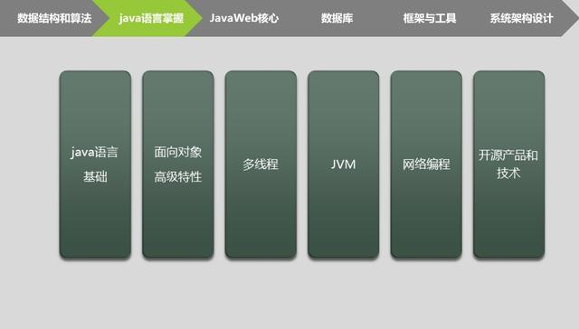
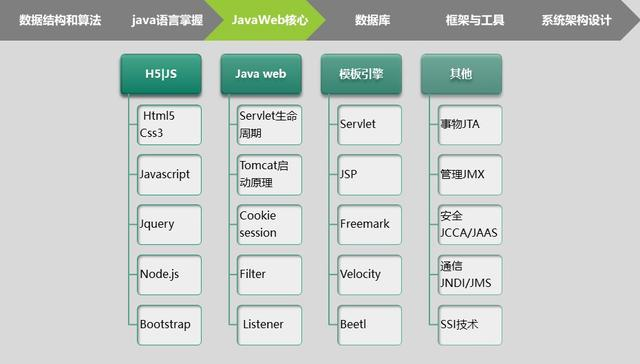
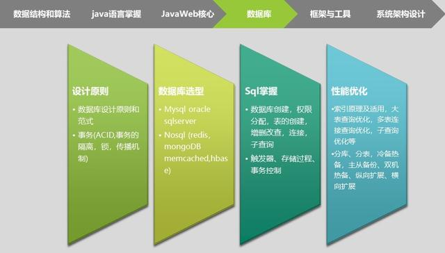
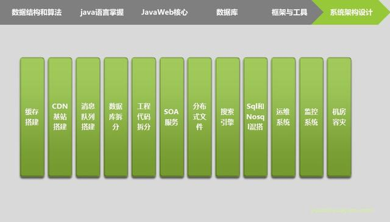

***************************
架构师必须掌握的6大技能体系
***************************

程序设计和开发
==============

- 数据结构和算法：常用数据结构，排序，检索等；
- 面向对象编程、设计模式，掌握建模语言和建模工具： ``UML`` 、 ``MVC`` 编程思想；
- 高质量编码能力：重用性，低耦合，可扩展性，高性能，可维护性，安全性高；
- 集成开发，版本控制，构建等工具： ``eclipse`` 、 ``svn`` 、 ``maven`` 等；
- 脚本语言： ``Perl`` ， ``PHP`` ， ``Ruby`` ， ``Python`` ， ``Groovy`` 等；

.. image:: ./images/1.jpg

Java开发
========

- Java 语言基础：异常处理，泛型， ``reflection`` ， ``annotation`` ； Java 基本类库： ``io`` ， ``util`` ；
- Java 高级特性和类库： ``class loader`` ， ``bytecode`` ， ``nio`` ， ``juc`` 等；
- Java 多线程编程；
- Java 网络与服务器编程， ``TCP/IP`` 协议；
- 开源产品和技术；
- JVM 原理和调优；

Web开发
=======

- ``DNS`` ， ``HTTP`` ， ``Cookie`` ， ``Mail`` ， ``FTP`` ， ``Proxy`` 等协议；
- ``Java Servlet API`` ， ``Velocity/JSP`` 等模板引擎；
- 主流 ``Web`` 开发框架： ``Spring Framework`` ， ``WebX`` ， ``Struts`` 等；
- ``Web`` 服务器部署和配置： ``Apache`` ， ``Tomcat`` ， ``JBoss`` ， ``Jetty`` 等；
- 客户端代码编写： ``HTML/CSS/JS`` ；
- ``Web`` 开发调试工具： ``Firebug`` 等；

数据库开发
==========

- 数据库设计原则；
- 数据库 ``SQL`` 和 ``NOSQL`` 的选型；
- 常见的： ``mysql`` 和 ``oracle`` 的掌握；
- 常用的nosql的掌握： ``Redis`` 、 ``Memchache`` 、 ``MongoDb`` ；
- 常见的数据库性能优化方案等；

java开发框架与工具
==================

- 常用的开发系统： ``spring`` 、 ``redis`` 、 ``memcached`` 、 ``activeMQ`` 等的掌握；
- 常用的 ``web`` 服务器： ``tomcat`` 、 ``jboss`` 等；
- 构建工具： ``maven`` 等；

.. image:: ./images/5.jpg

分布式架构设计与经验
====================

- 分层的应用框架设计思想： ``SOA`` ，事件驱动等；
- 分布式系统原理： ``CAP`` ，最终一致性，幂等操作等；
- 大型网络应用结构：消息中间件，缓存，负载均衡，集群技术，数据同步；
- 高可用，可容灾分布式系统设计能力；
- 大容量数据存储和检索系统设计能力：数据库分区， ``NoSQL`` ，搜索引擎等；

以上就是阿里 P8 架构师的技能，以上技能的要求重点都是精通，除了技能，还有就是面试了，以下是总结出来最全架构师题目，包含：微服务、数据库、分布式架构等。

