*****
AES加密
*****

``AES`` ，高级加密标准（英语：Advanced Encryption Standard，缩写： ``AES`` ），是美国联邦政府采用的一种区块加密标准。这个标准用来替代原先的 DES ，已经被多方分析且广为全世界所使用。严格地说， ``AES`` 的区块长度固定为 ``128`` 比特，密钥长度则可以是 ``128`` ， ``192`` 或 ``256`` 比特，包括 ``AES-ECB`` ， ``AES-CBC`` ， ``AES-CTR`` ， ``AES-OFB`` ， ``AES-CFB`` 。

AES的基本结构
============
``AES`` 为分组密码，分组密码也就是把明文分成一组一组的，每组长度相等，每次加密一组数据，直到加密完整个明文。在 ``AES`` 标准规范中，分组长度只能是 ``128`` 位，也就是说，每个分组为 ``16`` 个字节（每个字节 ``8`` 位）。密钥的长度可以使用 ``128`` 位、 ``192`` 位或 ``256`` 位。密钥的长度不同，推荐加密轮数也不同，如下表所示：

+---------+-----------------------+----------------------+----------+
| AES     | 密钥长度（32位比特字) | 分组长度(32位比特字) | 加密轮数 |
+=========+=======================+======================+==========+
| AES-128 | 4                     | 4                    | 10       |
+---------+-----------------------+----------------------+----------+
| AES-192 | 6                     | 4                    | 12       |
+---------+-----------------------+----------------------+----------+
| AES-256 | 8                     | 4                    | 14       |
+---------+-----------------------+----------------------+----------+

初始化向量（IV）
==============
初始化向量（IV，Initialization Vector）是许多任务作模式中用于将加密随机化的一个位块，由此即使同样的明文被多次加密也会产生不同的密文，避免了较慢的重新产生密钥的过程。

初始化向量与密钥相比有不同的安全性需求，因此 ``IV`` 通常无须保密，然而在大多数情况中，不应当在使用同一密钥的情况下两次使用同一个 ``IV`` 。对于 ``CBC`` 和 ``CFB`` ，重用 ``IV`` 会导致泄露明文首个块的某些信息，亦包括两个不同消息中相同的前缀。对于 ``OFB`` 和 ``CTR`` 而言，重用 ``IV`` 会导致完全失去安全性。

填充
====
块密码只能对确定长度的数据块进行处理，而消息的长度通常是可变的。因此部分模式（即 ``ECB`` 和 ``CBC`` ）需要最后一块在加密前进行填充。有数种填充方法，其中最简单的一种是在明文的最后填充空字符以使其长度为块长度的整数倍，但必须保证可以恢复明文的原始长度；例如，若明文是 ``C`` 语言风格的字符串，则只有串尾会有空字符。稍微复杂一点的方法则是原始的 ``DES`` 使用的方法，即在数据后添加一个 ``1`` 位，再添加足够的 ``0`` 位直到满足块长度的要求；若消息长度刚好匹配块长度，则添加一个填充块(16字节)。最复杂的则是针对 ``CBC`` 的方法，例如密文窃取，残块终结等，不会产生额外的密文，但会增加一些复杂度。布鲁斯·施奈尔和尼尔斯·弗格森提出了两种简单的可能性：添加一个值为 ``128`` 的字节（十六进制的 ``80`` ），再以 ``0`` 字节填满最后一个块；或向最后一个块填充 ``n`` 个值均为 ``n`` 的字节。

``CFB`` ， ``OFB`` 和 ``CTR`` 模式不需要对长度不为密码块大小整数倍的消息进行特别的处理。因为这些模式是通过对块密码的输出与明文进行异或工作的。最后一个明文块（可能是不完整的）与密钥流块的前几个字节异或后，产生了与该明文块大小相同的密文块。流密码的这个特性使得它们可以应用在需要密文和明文数据长度严格相等的场合，也可以应用在以流形式传输数据而不便于进行填充的场合。

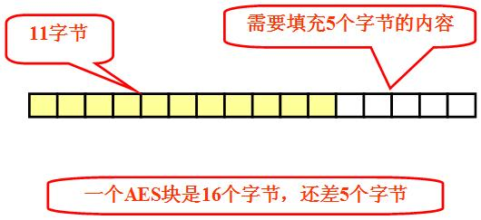

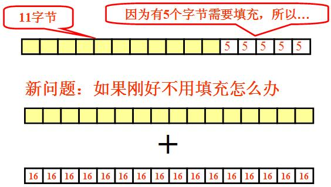

常用模式
========

基本加密过程
-----------

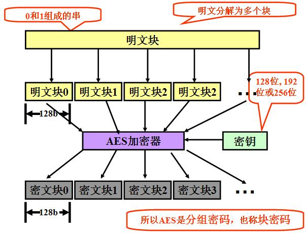

``AES`` 五种加密模式（ ``CBC`` 、 ``ECB`` 、 ``CTR`` 、 ``OFB`` 、 ``CFB`` ）
虽然有五种加密，但是常用的还是 ``CBC`` ， ``CBC`` 的全称 ``Cipher Block Chaining``  ，有点类似于区块链，我们先来看下这几种加密方式。

电子密码本（ECB）
================
最简单的加密模式即为电子密码本（Electronic codebook，ECB）模式。需要加密的消息按照块密码的块大小被分为数个块，并对每个块进行独立加密。

.. image:: ./images/Ecb_encryption.png

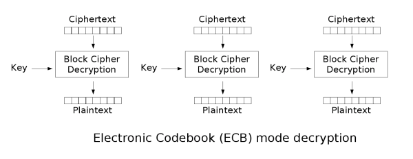

本方法的缺点在于同样的明文块会被加密成相同的密文块；因此，它不能很好的隐藏数据模式。在某些场合，这种方法不能提供严格的数据保密性，因此并不推荐用于密码协议中。

``ECB`` 模式也会导致使用它的协议不能提供数据完整性保护，易受到重放攻击的影响，因为每个块是以完全相同的方式解密的。

由上图可以看出，明文中重复的排列会反映在密文中。

并且，当密文被篡改时，解密后对应的明文分组也会出错，且解密者察觉不到密文被篡改了。也就是说，ECB不能提供对密文的完整性校验。
因此，在任何情况下都不推荐使用ECB模式。

.. image:: ./images/1ECB.jpg

优点：

1. 简单；
2. 有利于并行计算；
3. 误差不会被传送；

缺点：

1. 不能隐藏明文的模式；
2. 可能对明文进行主动攻击；

密码块链接（CBC）
===============
1976年，IBM发明了密码分组链接（CBC，Cipher-block chaining）模式。在 ``CBC`` 模式中，每个明文块先与前一个密文块进行异或后，再与密钥进行加密。在这种方法中，每个密文块都依赖于它前面的所有明文块。同时，为了保证每条消息的唯一性，在第一个块中需要使用初始化向量。

CBC加密
-------

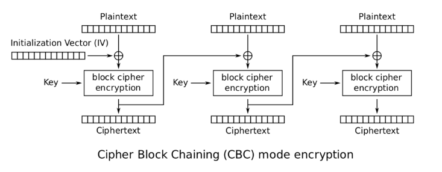

上面的图片从左往右看，初始化 ``IV`` 只有在第一个块加密的时候才会用到，而第 ``N`` 个块的加密 ``IV`` 则是用的 ``N-1(N>1)`` 个加密后的二进制数组。

CBC解密
-------

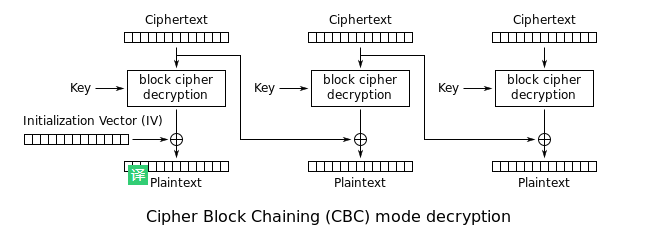

``CBC`` 的解密则也是从左往右看，但是加密时的 ``IV`` 在解密时候，只会用于对第一个块进行解密，其他块的解密则是使用上一块的加密二进制作为 ``IV`` 进行解密操作。

.. note:: 加密时，用 ``iv`` 和 ``key`` 去加密第一个块，然后用第一个块的加密数据作为下一个块的 ``iv`` ，依次迭代。解密时，用 ``n-1`` 个块的加密数据作为 ``iv`` 和 ``key`` 去解密第 ``n`` 个块（ ``n>1`` ），只有第一个块才会用加密时的 ``iv`` 去解密第一个块。按照这样的逻辑来看，那么如果解密时，使用了 ``iv`` 错误，出问题的数据应该只有第一个块。

通过上面的分析就能知道，加密的时候， ``iv`` 会影响所有数据的加密结果，而解密时， ``iv`` 只会影响第一个加密块的解密结果，其他块的解密可以直接通过分隔加密数据获取正确是 ``N-1`` 块的 ``IV`` 。

``CBC`` 是最为常用的工作模式。它的主要缺点在于加密过程是串行的，无法被并行化，而且消息必须被填充到块大小的整数倍。解决后一个问题的一种方法是利用密文窃取。

注意在加密时，明文中的微小改变会导致其后的全部密文块发生改变，而在解密时，从两个邻接的密文块中即可得到一个明文块。因此，解密过程可以被并行化，而解密时，密文中一位的改变只会导致其对应的明文块完全改变和下一个明文块中对应位发生改变，不会影响到其它明文的内容。

优点：

1. 不容易主动攻击，安全性好于 ``ECB`` ，适合传输长度长的报文，是 ``SSL`` 、 ``IPSec`` 的标准。

缺点：

1. 不利于并行计算；
2. 误差传递；
3. 需要初始化向量 ``IV`` ；

填充密码块链接（PCBC）
====================
填充密码块链接（PCBC，Propagating cipher-block chaining）或称为明文密码块链接（Plaintext cipher-block chaining），是一种可以使密文中的微小更改在解密时导致明文大部分错误的模式，并在加密的时候也具有同样的特性。

.. image:: ./images/Pcbc_encryption.png

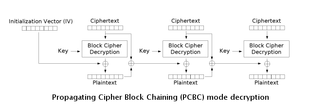

对于使用 ``PCBC`` 加密的消息，互换两个邻接的密文块不会对后续块的解密造成影响。

密文反馈（CFB）
=============
密文反馈（CFB，Cipher feedback）模式类似于 ``CBC`` ，可以将块密码变为自同步的流密码；工作过程亦非常相似， ``CFB`` 的解密过程几乎就是颠倒的 ``CBC`` 的加密过程：

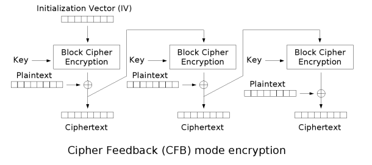

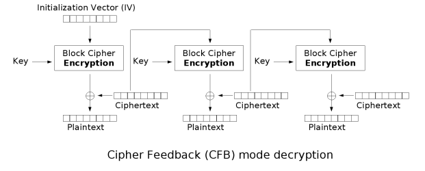

与 ``CBC`` 相似，明文的改变会影响接下来所有的密文，因此加密过程不能并行化；而同样的，与 ``CBC`` 类似，解密过程是可以并行化的。在解密时，密文中一位数据的改变仅会影响两个明文块：对应明文块中的一位数据与下一块中全部的数据，而之后的数据将恢复正常。

``CFB`` 拥有一些 ``CBC`` 所不具备的特性，这些特性与 ``OFB`` 和 ``CTR`` 的流模式相似：只需要使用块密码进行加密操作，且消息无需进行填充（虽然密文窃取也允许数据不进行填充）。

优点：

1. 隐藏了明文模式；
2. 分组密码转化为流模式；
3. 可以及时加密传送小于分组的数据；

缺点:

1. 不利于并行计算；
2. 误差传送：一个明文单元损坏影响多个单元；
3. 唯一的 ``IV`` ；

输出反馈（OFB）
=============
输出反馈模式（Output feedback, OFB）可以将块密码变成同步的流密码。它产生密钥流的块，然后将其与明文块进行异或，得到密文。与其它流密码一样，密文中一个位的翻转会使明文中同样位置的位也产生翻转。这种特性使得许多错误校正码，例如奇偶校验位，即使在加密前计算，而在加密后进行校验也可以得出正确结果。

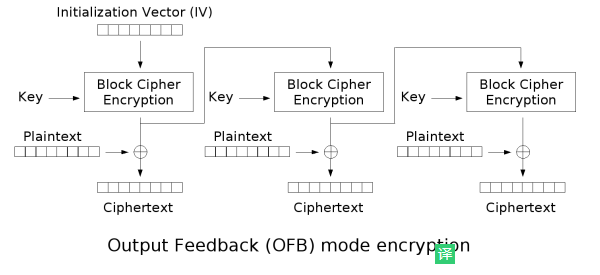

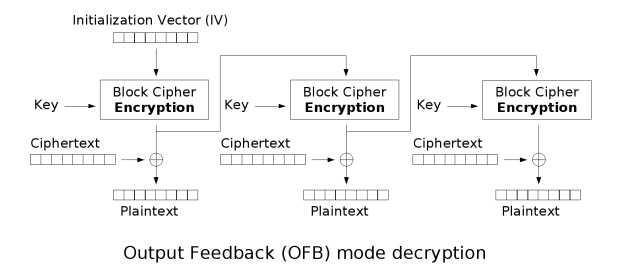

每个使用 ``OFB`` 的输出块与其前面所有的输出块相关，因此不能并行化处理。然而，由于明文和密文只在最终的异或过程中使用，因此可以事先对 ``IV`` 进行加密，最后并行的将明文或密文进行并行的异或处理。

可以利用输入全 ``0`` 的 ``CBC`` 模式产生 ``OFB`` 模式的密钥流。这种方法十分实用，因为可以利用快速的 ``CBC`` 硬件实现来加速 ``OFB`` 模式的加密过程。

优点：

1. 隐藏了明文模式；
2. 分组密码转化为流模式；
3. 可以及时加密传送小于分组的数据；

缺点：

1. 不利于并行计算；
2. 对明文的主动攻击是可能的；
3. 误差传送：一个明文单元损坏影响多个单元；

计数器模式（CTR）
===============
与 ``OFB`` 相似， ``CTR`` 将块密码变为流密码。它通过递增一个加密计数器以产生连续的密钥流，其中，计数器可以是任意保证长时间不产生重复输出的函数，但使用一个普通的计数器是最简单和最常见的做法。使用简单的、定义好的输入函数是有争议的：批评者认为它“有意的将密码系统暴露在已知的、系统的输入会造成不必要的风险”。当前， ``CTR`` 已经被广泛的使用了，由输入函数造成的问题被认为是使用的块密码的缺陷，而非 ``CTR`` 模式本身的弱点。无论如何，有一些特别的攻击方法，例如基于使用简单计数器作为输入的硬件差错攻击。

``CTR`` 模式的特征类似于 ``OFB`` ，但它允许在解密时进行随机存取。由于加密和解密过程均可以进行并行处理， ``CTR`` 适合运用于多处理器的硬件上。

注意图中的 ``nonce`` 与其它图中的 ``IV`` （初始化向量）相同。 ``IV`` 、随机数和计数器均可以通过连接，相加或异或使得相同明文产生不同的密文。

``CTR`` 模式下的分组密码的行为类似于流密码，这对于许多用例（例如文件加密）比分组密码更理想。

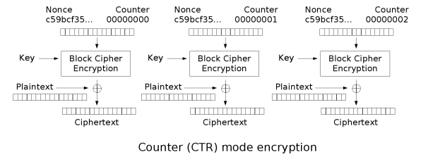

.. image:: ./images/aes-ctr-decrypt.png

计数器模式下，每次与明文分组进行 ``XOR`` 的比特序列是不同的，因此，计数器模式解决了 ``ECB`` 模式中，相同的明文会得到相同的密文的问题。 ``CBC`` ， ``CFB`` ， ``OFB`` 模式都能解决这个问题，但 ``CTR`` 的另两个优点是：

1) 支持加解密并行计算，可事先进行加解密准备；
2) 错误密文中的对应比特只会影响明文中的对应比特等优点。

但 ``CTR`` 仍然不能提供密文消息完整性校验的功能。有的人可能会想到，如果将密文的 ``hash`` 值随密文一起发送，密文接收者对收到的密文计算 ``hash`` 值，与收到的 ``hash`` 值进行比对，这样是否就能校验消息的完整性呢？

再仔细想想，就能发现这其中的漏洞。当篡改者截获原始的密文消息时，先篡改密文，而后计算篡改后的密文 ``hash`` ， 替换掉原始消息中的密文 ``hash`` 。这样，消息接收者仍然没有办法发现对源密文的篡改。可见，使用单向散列函数计算 ``hash`` 值仍然不能解决消息完整性校验的问题。

想要校验消息的完整性，必须引入另一个概念： **消息验证码** 。消息验证码是一种与秘钥相关的单项散列函数。

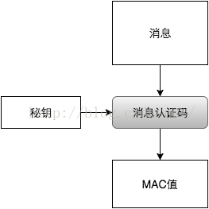

密文的收发双发需要提前共享一个秘钥。密文发送者将密文的 ``MAC`` 值随密文一起发送，密文接收者通过共享秘钥计算收到密文的 ``MAC`` 值，这样就可以对收到的密文做完整性校验。当篡改者篡改密文后，没有共享秘钥，就无法计算出篡改后的密文的 ``MAC`` 值。

如果生成密文的加密模式是 ``CTR`` ，或者是其他有初始 ``IV`` 的加密模式，别忘了将初始的计时器或初始向量的值作为附加消息与密文一起计算 ``MAC`` 。

GCM 模式
========
``GCM`` ( Galois/Counter Mode) 指的是该对称加密采用 ``CTR`` 模式，并带有 ``GMAC`` 消息认证码。

GMAC ( Galois message authentication code mode, 伽罗瓦消息验证码 )
-----------------------------------------------------------------
对应到前面的消息认证码， ``GMAC`` 就是利用伽罗华域(Galois Field，GF，有限域)乘法运算来计算消息的 ``MAC`` 值。假设秘钥长度为 ``128bits`` , 当密文大于 ``128bits`` 时，需要将密文按 ``128bits`` 进行分组。应用流程如下图：

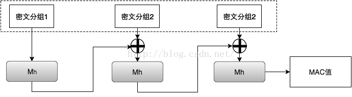

GCM（ Galois/Counter Mode ) 
---------------------------
``GCM`` 中的 ``G`` 就是指 ``GMAC`` ， ``C`` 就是指 ``CTR`` 。

``GCM`` 可以提供对消息的加密和完整性校验，另外，它还可以提供附加消息的完整性校验。在实际应用场景中，有些信息是我们不需要保密，但信息的接收者需要确认它的真实性的，例如源 ``IP`` ，源端口，目的 ``IP`` ， ``IV`` 等等。因此，我们可以将这一部分作为附加消息加入到 ``MAC`` 值的计算当中。下图的 ``Ek`` 表示用对称秘钥 ``k`` 对输入做 ``AES`` 运算。最后，密文接收者会收到密文、 ``IV`` （计数器 ``CTR`` 的初始值）、 ``MAC`` 值。

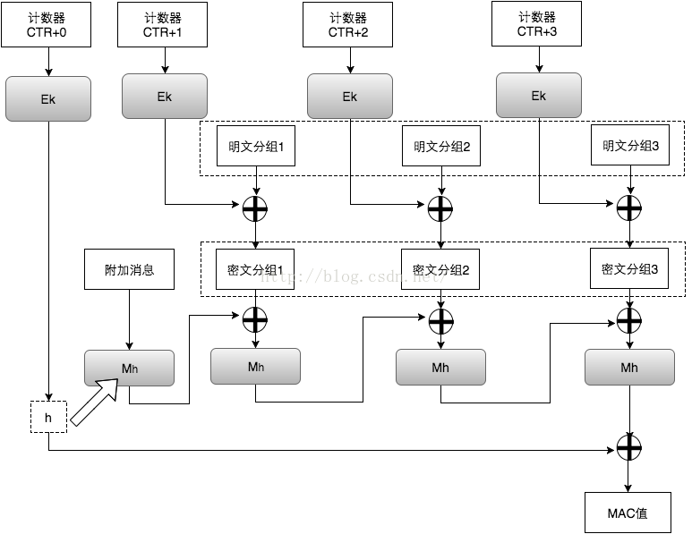

参考文献：

- https://zh.wikipedia.org/wiki/%E5%88%86%E7%BB%84%E5%AF%86%E7%A0%81%E5%B7%A5%E4%BD%9C%E6%A8%A1%E5%BC%8F
- https://www.cnblogs.com/liangxuehui/p/4651351.html
- https://blog.csdn.net/T0mato_/article/details/53160772

