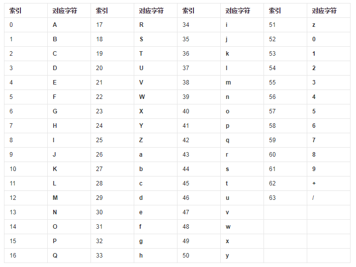

********
BASE64编码
********

BASE64编码介绍
==============
``BASE64`` 编码是一种常用的将十六进制数据转换为可见字符编码。与 ``ASCII`` 码相比，它占用的空间较小。 ``BASE64`` 编码在 ``rfc3548`` 中定义。

BASE64编解码原理
================
将数据编码成 ``BASE64`` 编码时，以 ``3`` 字节数据为一组，转换为 ``24bit`` 的二进制，将 ``24bit`` 的二进制数据，得到一个数字: ``0-63`` 。

比如有数据：0x30 0x82 0x02
编码过程如下：
a.得到16进制的数据：30 82 02
b.得到二进制数据： 00110000 10000010  00000010
c.每6bit分组： 001100 001000 001000 000010
d.得到数字：12 8 8 2
e.根据查表得到结果：MIIC
BASE64填充：在不够的情况下的右边加0.

有三种情况：
a.输入数据比特数是24的整数倍(输入字节为3字节正数倍)，则无填充。
b.输入数据最后编码的是1个字节（输入数据字节数除3余1），即8比特，则需要填充2个"=="，因为要补齐6比特，需要加2个00.
c.输入数据最后编码是2个字节（输入数据字节数除3余2），则需要填充1个"=",因为补齐6比特，需要加一个00

对0x30编码：
a.0x30的二进制位：00110000
b.分组为:001100 00
c.填充2个00: 001100 000000
d.得到数字：12 0
e.查表得到的编码MA,另外加上两个==
最终编码为：MA==

备注：base64解码是起编码过程的逆过程。解码时，将base64编码根据表展开，根据有几个等号去掉结尾几个00，然后每8比特恢复即可。

