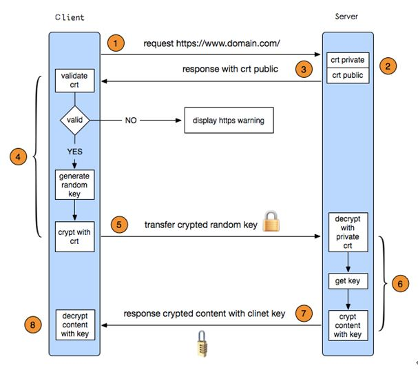

**************
一张图读懂https加密协议
**************

``https`` 是一种加密传输协议，网站使用 ``https`` 后可以避免敏感信息被第三方获取。所以我们经常看见很多银行网站或电子邮箱等等安全级别较高的服务都会采用 ``https`` 协议，具体表现为， ``https`` 开头、显示绿色安全锁、某些浏览器地址栏变成绿色。那么具体 ``https`` 是怎么工作的呢?

https加密协议简介
=================
``https`` 其实是有两部分组成： ``http + SSL/TLS`` ，也就是在 ``http`` 上又加了一层处理加密信息的模块。服务端和客户端的信息传输都会通过 ``TLS`` 进行加密，所以传输的数据都是加密后的数据。具体是如何进行加密，解密，验证的，且看下图。

1. 客户端发起 ``https`` 请求

   客户端发起 ``https`` 请求就是指用户在浏览器里输入一个 ``https`` 网址，然后连接到 ``server`` 的 ``443`` 端口。

3. 服务器端的配置

   采用 ``https`` 协议的服务器必须要有一套 ``SSL`` 数字证书，需要向 ``CA`` 组织(如 ``WoSign`` 沃通 ``CA`` )申请。这套 ``SSL`` 证书其实就是一对公钥和私钥。如果对公钥和私钥不太理解，可以想象成一把钥匙和一个锁头，只是全世界只有你一个人有这把钥匙，你可以把锁头给别人，别人可以用这个锁把重要的东西锁起来，然后发给你，因为只有你一个人有这把钥匙，所以只有你才能看到被这把锁锁起来的东西。 ``SSL`` 证书是网站实现 ``https`` 加密协议的先决条件，可以向 ``CA`` 机构申请免费 ``SSL`` 证书，也可以付费购买高级别的 ``SSL`` 证书。目前沃通 ``CA`` 提供3年期免费 ``SSL`` 证书申请 http://freessl.wosign.com 。

3. 传送证书

   这个证书其实就是公钥，只是包含了很多信息，如证书的颁发机构，证书过期时间等等。

4. 客户端解析证书

   这部分工作是有客户端的 ``TLS`` 来完成的，首先会验证公钥是否有效，比如颁发机构，过期时间等等，如果发现异常，则会弹出一个警告框，提示证书存在问题。如果证书没有问题，那么就生成一个随机值。然后用证书对该随机值进行加密。就好像上面说的，把随机值用锁头锁起来，这样除非有钥匙，不然看不到被锁住的内容。

5. 传送加密信息

   这部分传送的是用 ``SSL`` 证书加密后的随机值，目的就是让服务端得到这个随机值，以后客户端和服务端的通信就可以通过这个随机值来进行加密解密了。

6. 服务段解密信息

   服务端用私钥解密后，得到了客户端传过来的随机值(私钥)，然后把内容通过该值进行对称加密。所谓对称加密就是，将信息和私钥通过某种算法混合在一起，这样除非知道私钥，不然无法获取内容，而正好客户端和服务端都知道这个私钥，所以只要加密算法够彪悍，私钥够复杂，数据就够安全。

7. 传输加密后的信息

   这部分信息是服务段用私钥加密后的信息，可以在客户端被还原。

8. 客户端解密信息

   客户端用之前生成的私钥解密服务段传过来的信息，于是获取了解密后的内容。整个过程第三方即使监听到了数据，也束手无策。

当今互联网安全形势恶劣，个人隐私泄露，钓鱼网站欺诈等事件层出不穷，严重威胁到了人们的上网安全。https加密的应用对保护网民信息安全有重大意义。随着百度、谷歌等互联网巨头率先启用https加密协议，相信越来越多的站点将加入到https阵营中来，全网https时代即将来临。

https://www.cnblogs.com/zxj015/p/6530766.html 继续总结