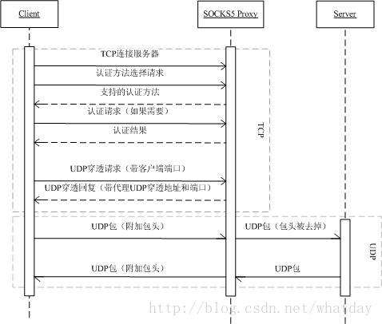
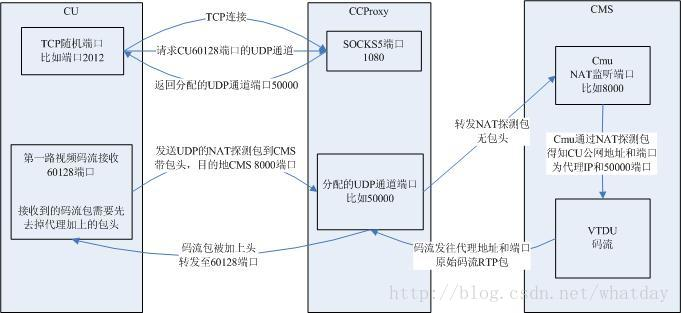

********
Socks5协议
********
socks5是一种代理协议，如果防火墙禁止所有的计算机发送udp包，代理也没用。

http隧道技术是在防火墙禁止了udp的数据包，可以把数据封装在http包中，防火墙让看起来像http包的数据包通过，在防火墙外有专门的计算机把http包还原成udp包。

SOCKS5
========
简介
-----
SOCKS5大家肯定很熟悉，是我们常用的代理协议的一种。它是Socks协议的第五版，相对于第四版增加了对身份验证，UDP，IPV6的支持。

一般的代理协议（比如Http代理）都是工作在应用层的，功能单一。而Socks代理协议旨在提供一种通用的代理服务，所以工作在应用层和传输层之间，只是传递传输层网络数据包（TCP/UDP），对于应用层的协议并不关心。

SOCKS5中的方法
--------------------
SOCKS5在使用时是典型的CS模式的。SOCKS5服务可以分成两大功能，身份认证和代理服务。每个功能又支持不定的多种方法（Method）。
身份认证常用的方法是不需认证（No Authentication Required）和用户名/密码认证（Username/Password），多数应用软件包括我们监控CU都只支持这两种方法。

代理服务的模式有连接（Connect），绑定（Bind）和UDP穿透（UDP Associate）。OSP通过代理连接服务器的时候，是用的连接模式。通过代理服务器看码流的时候用的是UDP穿透模式。

握手阶段
----------
客户端和服务器在握手阶段协商认证方式，比如：是否采用用户名/密码的方式进行认证，或者不采用任何认证方式。

客户端发送给服务器的消息格式如下（数字表示对应字段占用的字节数）：

+-----+----------+----------+
| VER | NMETHODS | METHODS  |
+=====+==========+==========+
| 1   | 1        | 1 to 255 |
+-----+----------+----------+

第一行是信令中该位置表示的含义。第二行是长度。

- VER：字段是当前协议的版本号，也就是 5；
- NMETHODS：字段是 ``METHODS`` 字段占用的字节数，八位的范围为(0~255)；
- METHODS：字段的每一个字节表示一种认证方式，表示客户端支持的全部认证方式。

服务器在收到客户端的协商请求后，会检查是否有服务器支持的认证方式，并返回客户端如下格式的消息：

+-----+--------+
| VER | METHOD |
+=====+========+
| 1   | 1      |
+-----+--------+

如果选中的消息是X’FF’，这表示客户端所列出的方法列表中没有一个方法被选中，客户端必须关闭连接。

当前定义的方法有：

- X’00’：不需要认证
- X’01’：GSSAPI
- X’02’：用户名/密码
- X’03’ -- X’7F’：由IANA分配
- X’80’ -- X’FE’：为私人方法所保留的
- X’FF’：没有可以接受的方法

建立连接
-----------
完成握手后，客户端会向服务器发起请求，请求的格式如下：

+-----+-----+-----+------+----------+----------+
| VER | CMD | RSV | ATYP | DST.ADDR | DST.PORT |
+=====+=====+=====+======+==========+==========+
| 1   | 1   | 1   | 1    | Variable | 2        |
+-----+-----+-----+------+----------+----------+

其中：

- VER：协议版本: X’05’
- CMD：command 的缩写，shadowsocks 只用到了：

  + 0x01：建立 TCP 连接
  + 0x02：绑定
  + 0x03：UDP穿透

- RSV 字段：保留字段，值为 0x00；
- ATYP 字段：address type 的缩写，取值为：

  + 0x01：IPv4
  + 0x03：域名
  + 0x04：IPv6

- DST.ADDR 字段：destination address 的缩写，取值随 ATYP 变化：

  + ATYP == 0x01：4 个字节的 IPv4 地址
  + ATYP == 0x03：1 个字节表示域名长度，紧随其后的是对应的域名
  + ATYP == 0x04：16 个字节的 IPv6 地址

- DST.PORT 字段：目的服务器的端口。网络协议规定接收到得第一个字节是高字节，存放到低地址，所以发送时会首先去低地址取数据的高字节。

在收到客户端的请求后，服务器会返回如下格式的消息：

+-----+-----+-----+------+----------+----------+
| VER | REP | RSV | ATYP | BND.ADDR | BND.PORT |
+=====+=====+=====+======+==========+==========+
| 1   | 1   | 1   | 1    | Variable | 2        |
+-----+-----+-----+------+----------+----------+

其中：

- VER 协议版本: X’05’
- REP 应答字段：用以告知客户端请求处理情况。在请求处理成功的情况下，shadowsocks 将这个字段的值设为 0x00，否则，shadowsocks 会直接断开连接；

  + X’00’ 成功
  + X’01’ 普通的SOCKS服务器请求失败
  + X’02’ 现有的规则不允许的连接
  + X’03’ 网络不可达
  + X’04’ 主机不可达
  + X’05’ 连接被拒
  + X’06’ TTL超时
  + X’07’ 不支持的命令
  + X’08’ 不支持的地址类型
  + X’09’ – X’FF’ 未定义

- RSV 保留，标识为RSV的字段必须设为X’00’。
- ATYP 后面的地址类型

  + IPV4：X’01’
  + 域名：X’03’
  + IPV6：X’04’

- BND.ADDR 服务器绑定的地址
- BND.PORT 以网络字节顺序表示的服务器绑定的段口

各个连接命令的分析
"""""""""""""""""""""

CONNECT
^^^^^^^^^
在对一个 ``CONNECT`` 命令的应答中， ``BND.PORT`` 包含了服务器分配的用来连到目标机的端口号， ``BND.ADDR`` 则是相应的 ``IP`` 地址。由于 ``SOCKS`` 服务器通常有多个 ``IP`` ，应答中的 ``BND.ADDR`` 常和客户端连到 ``SOCKS`` 服务器的那个 ``IP`` 不同。

``SOCKS`` 服务器可以利用 ``DST.ADDR`` 和 ``DST.PORT`` ，以及客户端源地址和端口来对一个 ``CONNECT`` 请求进行分析。

BIND
^^^^^^
``BIND`` 请求通常被用在那些要求客户端接受来自远程服务器的连接的协议上。 ``FTP`` 是一个典型的例子。它建立一个从客户端到服务器端的连接来执行命令以及接收状态报告，而使用另一个从服务器到客户端的连接来传输需要的数据(如 ``LS`` ， ``GET`` ， ``PUT`` )。

建议只有在应用程序协议的客户端在使用 ``CONNECT`` 命令建立主连接后才可以使用 ``BIND`` 命令建立第二个连接。建议 ``SOCKS`` 服务器使用 ``DST.ADDR`` 和 ``DST.PORT`` 来评价 ``BIND`` 请求。

在一个 ``BIND`` 请求的操作过程中， ``SOCKS`` 服务器要发送两个应答给客户端。当服务器建立并绑定一个新的 ``socket`` 时发送第一个应答。 ``BND.PORT`` 字段包含 ``SOCKS`` 服务器用来监听进入的连接的端口号， ``BND.ADDR`` 字段包含了对应的 ``IP`` 地址。客户端通常使用这些信息来告诉（通过主连接或控制连接）应用服务器连接的汇接点。第二个应答仅发生在所期望到来的连接成功或失败之后。在第二个应答中， ``BND.PORT`` 和 ``BND.ADDR`` 字段包含了连上来的主机的 ``IP`` 地址和端口号。

建立流程如下：

1. ``Client`` 随 ``BIND`` 请求，发送其要绑定的地址和端口。
2. ``Server`` 返回其创建的监听端口的地址和端口。
3. ``Server`` 创建的监听端口有连接后，返回该连接的源地址和端口。
4. ``Server`` 端将上述连接中的流量，发送给 ``client`` 的监听端口。

UDP ASSOCIATE (UDP穿透)
^^^^^^^^^^^^^^^^^^^^^^^
``UDP`` 穿透（UDP Associate）是 ``SOCKS5`` 新加入的功能。 ``UDP ASSOCIATE`` 请求通常是用来建立与一个 ``UDP`` 中继进程关联来处理 ``UDP`` 数据报。 ``DST.ADDR`` 和 ``DST.PORT`` 字段包含客户端所希望的用来发送 ``UDP`` 数据报的 ``IP`` 地址和端口号。服务器可以使用这个信息来限制进入的连接。如果客户端在发送这个请求时没有地址和端口信息，客户端必须用全 ``0`` 来填充。

当与 ``UDP`` 相应的 ``TCP`` 连接中断时，该 ``UDP`` 连接也必须中断。

应答 ``UDP ASSOCIATE`` 请求时， ``BND.PORT`` 和 ``BND.ADDR`` 字段指明了客户发送 ``UDP`` 消息至服务器的端口和地址。

应答处理

当一个应答(REP值不等于00)指明出错时，SOCKS服务器必须在发送完应答消息后一小段时间内终止TCP连接。这段时间应该在发现错误后少于10秒。

**如果一个应答(REP值等于00)指明成功，并且请求是一个BIND或CONNECT时** ，客户端就可以开始发送数据了。如果协商的认证方法中有以完整性、认证和/或安全性为目的的封装，这些请求必须按照该方法所定义的方式进行封装。类似的，当以客户机为目的地的数据到达SOCKS服务器时，SOCKS服务器必须用正在使用的方法对这些数据进行封装。

流程
"""""

流程如上图。下面具体讲各个交互信令。

连接和认证
""""""""""""
客户端TCP连接SOCKS5代理服务器的服务端口，并完成认证过程。不详述。

UDP穿透请求
""""""""""""""
客户端会用通过认证的这个TCP连接发送UDP穿透请求，信令格式如下：

+-----+-----+-------+------+----------+----------+
| VER | CMD | RSV   | ATYP | DST.ADDR | DST.PORT |
+=====+=====+=======+======+==========+==========+
| 1   | 1   | X'00' | 1    | Variable | 2        |
+-----+-----+-------+------+----------+----------+

其中各项：

- VER：协议版本，对于SOCKS5都是 5。
- CMD：要请求的命令，UDP穿透填3。 其它的CONNECT是1，BIND是2。
- RSV：保留字段，填0。
- ATYP：地址类型，我们用IPV4，填1。域名的话填3，IPV6的话填4。
- DST.ADDR：IP地址。对于UDP穿透来说，好像没有什么意义，填0（也就是127.0.0.1）。
- DST.PORT：这个很重要，要填客户端想发送/接收UDP包的本地端口。后面在发送UDP包时代理服务器会检测收到的UDP包的源端口，只有和这里填入的端口号符合的包才会被处理。（CCProxy收到源端口错误的包会出bug，狂发包。）

Demo中的对应代码：

.. code-block:: c++

    char abyUdpAssociateBuf[1024] = { 0 };

    //sock5代理版本号,当然是5了。
    const int SOCK5_PROXY_VERSION = 0x05;
    const int CMD_UDP_ASSOCIATE = 0x03;
    const int RESERVED = 0;
    const int IP_TYPE = 0x01;   // ipv4

    int nAddr = inet_addr( m_strLocalIp );
    short nPort = htons( (short)m_nPortReq );

    abyUdpAssociateBuf[0] = SOCK5_PROXY_VERSION;
    abyUdpAssociateBuf[1] = CMD_UDP_ASSOCIATE;
    abyUdpAssociateBuf[2] = RESERVED;
    abyUdpAssociateBuf[3] = IP_TYPE;
    memcpy( &abyUdpAssociateBuf[4], &nAddr, 4 );
    memcpy( &abyUdpAssociateBuf[8], &nPort, 2 );

    if( SOCKET_ERROR == send( this->m_hProxyControl, abyUdpAssociateBuf, 10 , 0 ) ){
        this->ShowAssociateMsg( "Send associate msg fail!" );
        this->Release();
        return ;
    }

UDP穿透应答
""""""""""""""
代理服务器会回应客户端的请求，消息格式如下：

+-----+-----+-------+------+----------+----------+
| VER | REP | RSV   | ATYP | BND.ADDR | BND.PORT |
+=====+=====+=======+======+==========+==========+
| 1   | 1   | X'00' | 1    | Variable | 2        |
+-----+-----+-------+------+----------+----------+

其中：

- VER：协议版本，对于SOCKS5都是 5。
- REP：代理服务器返回的结果，含义如下:

  + X'00' succeeded
  + X'01' general SOCKS server failure
  + X'02' connection not allowed by ruleset
  + X'03' Network unreachable
  + X'04' Host unreachable
  + X'05' Connection refused
  + X'06' TTL expired
  + X'07' Command not supported
  + X'08' Address type not supported
  + X'09' to X'FF' unassigned

- RSV：保留字段。
- ATYP：后面IP地址的格式，含义如下：

  + IP V4 address: X'01'
  + DOMAINNAME: X'03'
  + IP V6 address: X'04'

- BND.ADDR   此UDP穿透通道对应的代理服务器地址。
- BND.PORT    此UDP穿透通道对应的代理服务器端口。

至此，UDP穿透通道已经被建起来了，客户端只要按标准格式将UDP包发往上述地址端口，UDP包就会被代理服务器转发出去。

Demo中对应的代码：

.. code-block:: c++

    if( 10 != recv( this->m_hProxyControl, abyUdpAssociateBuf, sizeof(abyUdpAssociateBuf), 0 ) ) {
        this->ShowAssociateMsg( "Receive reply of UDP Associate req fail!" );
        return;
    }

    // 校验返回值。
    const int SOCK5_PROXY_SUCCESS = 0;
    if ( SOCK5_PROXY_VERSION != abyUdpAssociateBuf[0] || SOCK5_PROXY_SUCCESS != abyUdpAssociateBuf[1] || IP_TYPE != abyUdpAssociateBuf[3] ) {
        this->ShowAssociateMsg( "proxy error！" );
        return;
    }

    // 看服务器返回的地址。
    m_strIPProxyReply = inet_ntoa( *(IN_ADDR*)(&abyUdpAssociateBuf[4]) );
    m_sPortProxyReply = ntohs( *(short*)( &abyUdpAssociateBuf[8] ) );

    this->ShowAssociateMsg( "UDP Associate success!" );

UDP包发出
""""""""""""
上面交互信令中都没有提到客户端想通过代理访问的远端服务器地址。UDP包的最终目的地是通过在原始UDP包数据前加一个包头来实现的。在UDP ASSOCIATE应答中由BND.PORT指明了服务器所使用的UDP端口，一个基于UDP协议的客户必须发送数据报至UDP转发服务器的该端口上。如果协商的认证方法中有以完整性、认证和/或安全性为目的的封装，这些数据报必须按照该方法所定义的方式进行封装。每个UDP数据报都有一个UDP请求头在其首部：

包头的格式如下：

+-----+------+------+----------+----------+----------+
| RSV | FRAG | ATYP | DST.ADDR | DST.PORT | DATA     |
+=====+======+======+==========+==========+==========+
| 2   | 1    | 1    | Variable | 2        | Variable |
+-----+------+------+----------+----------+----------+

其中：

- RSV：保留字段，填0。
- FRAG：当前分片序号，我们没有分片，填0。
- ATYP：地址类型，和前面的几个一样。IPV4填 1 。

  + IPV4：X’01’
  + 域名：X’03’
  + IPV6：X’04’

- DST.ADDR：UDP包最终的目的地址。
- DST.PORT：UDP包最终的目的端口。
- DATA：原始的UDP包的数据。

按照上面格式发出的UDP包中的DATA部分会被代理服务器转发到包头中填入的最终目的地址。也就是说，我们用一路UDP穿透通道可以向不同的服务器发送数据。因为包头会被代理服务器去掉，所以远端服务器是不用知道客户端是否使用了代理。

当一个UDP中继服务器转发客户端的一个UDP数据报时，不会发送任何通知给客户端；同样，它也将丢弃任何它不能发至远端主机的数据报。当UDP中继服务器从远端服务器收到一个应答的数据报时，必须加上上述UDP请求头，并对数据报进行封装。

UDP中继服务器必须从SOCKS服务器得到期望的客户端IP地址，并将数据报发送到UDP ASSOCIATE应答中给定的端口号。如果数据报从任何IP地址到来，而该IP地址与该特定连接中指定的IP地址不同，那么该数据报会被丢弃。

FRAG字段指明数据报是否是一些分片中的一片。如果SOCKS服务器要实现这个功能，X’00’指明数据报是独立的；其他则越大越是数据报的尾端。介于1到127之间的值说明了该分片在分片序列里的位置。每个接收者都为这些分片提供一个重组队列和一个重组的计时器。这个重组队列必须在重组计时器超时后重新初始化，并丢弃相应的数据报。或者当一个新到达的数据报有一个比当前在处理的数据报序列中最大的FRAG值要小时，也必须重新初始化从组队列。重组计时器必须小于5秒。只要有可能，应用程序最好不要使用分片。

分片的实现是可选的；如果某实现不支持分片，所有FRAG字段不为0的数据报都必须被丢弃。

一个SOCKS敏感的UDP编程接口必须报告当前可用UDP数据报缓存空间小于操作系统提供的实际空间。

- 如果 ATYP是 X’01’ - 10+method_dependent octets smaller
- 如果 ATYP是X’03’ - 262+method_dependent octets smaller
- 如果 ATYP是X’04’ - 20+method_dependent octets smaller

Demo中对应的包头组装代码：

.. code-block:: c++

    const int BUF_SIZE = 1024;
    char abySentBuf[ BUF_SIZE ];
    char *pCursor = abySentBuf;

    *(short*)pCursor = 0;    // RSV  Reserved X'0000'
    pCursor += 2;

    *pCursor = 0; // Current fragment number
    pCursor++;

    *pCursor = 0x01;  // IP V4 address: X'01'
    pCursor ++;

    int nIp = inet_addr( m_strRemoteIp );
    *(int*)pCursor = nIp;    // desired destination address
    pCursor += 4;

    *(short*)pCursor = htons( m_nRemotePort );
    pCursor += 2;

    // 最后是我们的消息。
    strcpy( pCursor, this->m_strMsgSentToRemote );
    pCursor += this->m_strMsgSentToRemote.GetLength() + 1;

    int nDataLen = pCursor - abySentBuf;

UDP包返回
""""""""""""
远端服务器不用知道客户端是否使用了代理，它只要将需要回复的UDP包发送到它接收UDP包的源端口就行，在远端服务器看来表现和NAT表现一样。

但代理服务器不会直接转发发入的包，它会在原始数据包前面再封装一个包头然后发送给客户端。这个包头和上面的格式是一样的。客户端在处理之前，首先要去掉或跳过这个包头，才能得到服务器发送过来的原始数据。

实战分析
----------
白话半天容易晕，直接上图，不解释。

容易出现的问题
-----------------
链路的断链情况
"""""""""""""""""
在标准中说的很清楚，UDP通道和发送请求的TCP连接是拴在一根绳上的蚂蚱。如果这个TCP连接断开了，UDP通道也会跟着生效。反过来，如果因为某些原因导致UDP通道失效了（比如客户端发送了一个错误的UDP包，导致代理服务器停掉UDP通道），那么这个TCP连接也会被跟着中断掉。所以客户端程序必须要检测这个TCP连接的情况，如果发现断链了，就需要重新打洞。

每个TCP连接只能请求一路UDP通道
"""""""""""""""""""""""""""""""""""""
虽然标准中并没有此限制，但CCProxy就是这么做的。请求第二路通道会返回失败，此前打通的那路也会断掉。这样，因为监控客户端需要的码流通道非常多，现在每个客户端登录后要开157路UDP通道，对应157个TCP连接，对代理服务器的压力很大，估计支撑不了几个人同时登录。还有就是代理转发效率可能不高，像CCProxy在高码率下会严重丢包。

`socks5协议规范 <https://tools.ietf.org/html/rfc1928>`_ 