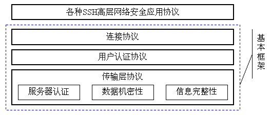
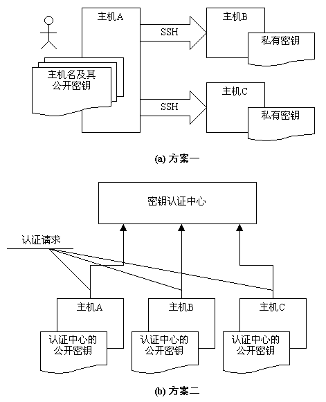

*******
ssh协议规范
*******

简介
====

Secure Shell（SSH）是一种用于安全远程登录的协议，在不安全的网络上保护网络服务。它包括三大部分：

- 传输层协议( ``SSH-TRANS`` )提供服务器认证，机密性和完整性。它还可选择的提供压缩。传输层通常是运行 ``TCP/IP`` 连接上，但也可以使用其它可靠的数据流。
- 用户认证协议( ``SSH-USERAUTH`` )验证连接到服务器的客户端用户。它运行于传输层 ``SSH-TRANS`` 之上。
- 连接协议( ``SSH-CONNECT`` )多路复用加密隧道为几个逻辑通道，提供给更高层的应用协议使用。它运行于用户认证协议 ``SSH-USERAUTH`` 之上。

各种高层应用协议可以相对地独立于 ``SSH`` 基本体系之外，并依靠这个基本框架，通过连接协议使用 ``SSH`` 的安全机制。同时 ``SSH`` 协议框架中还为许多高层的网络安全应用协议提供扩展的支持。

首先 ``SSH2`` 协议分为 3 个子协议，分别是 ``SSH-TRANS`` ,  ``SSH-USERAUTH`` 和 ``SSH-CONN`` 。其中 ``SSH-TRANS`` 是传输协议，定义了传输的包和加密通道，其他两个协议是建立在这个协议之上的。

``SSH-USERAUTH`` 是 ``SSH`` 里面用于验证客户端身份的协议。我们在用 ``ssh`` 命令输入密码的那一步实际上就是在这个阶段。可以看到的是，虽然传输的是用户名和密码，但是由于这个协议建立在 ``SSH-TRANS`` 之上，所以内容都是加密的，可以放心的传输。

而 ``SSH-CONN`` 是真正的应用协议。在这里可以定义各种不同的协议，其中我们经常使用的 ``scp`` 、 ``sftp`` 还有正常的 ``remote shell`` 都是定义在这里的一种协议实现。这里的各种应用协议都要首先经过 ``SSH-USERAUTH`` 的验证之后才可以使用。

它们之间的层次关系可以用如下图来表示：

其中 ``SSH-TRANS`` 是基本的协议， ``SSH-USERAUTH`` 和 ``SSH-CONN`` 都是通过这个协议来实现安全加密的。虽然在时序上， ``SSH-CONN`` 发生在 ``SSH-USERAUTH`` 之后，但是 ``SSH-CONN`` 并不依赖于 ``SSH-USERAUTH`` 。

架构
====

主机密钥(Host keys)
-------------------

每个服务器主机应该有一个主机密钥。主机可能有多个主机密钥使用多种不同的算法。多个主机可以共享相同的主机密钥。如果主机有密钥，它必须有至少一个密钥使用（DSS[FIPS-186-2]）中公钥算法。

密钥交换期间使用服务器主机密钥来验证客户端正在与正确的服务器通信。为此，客户必须具有服务器主机密钥公钥的先验知识。

``SSH`` 协议关于主机密钥认证的管理方案有两种，如下图所示：

每一个主机都必须有自己的主机密钥，密钥可以有多对，每一对主机密钥对包括公开密钥和私有密钥。在实际应用过程中怎样使用这些密钥，并依赖它们来实现安全特性呢？如上图所示， ``SSH`` 协议框架中提出了两种方案。

- 在第一种方案中，主机将自己的公用密钥分发给相关的客户机，客户机具有一个存储主机名和主机密钥公钥的本地数据库，客户机在访问主机时则根据主机名使用该主机的公开密钥来加密数据，主机则使用自己的私有密钥来解密数据，从而实现主机密钥认证，确定客户机的可靠身份。在图2（a）中可以看到，用户从主机A上发起操作，去访问，主机B和主机C，此时，A成为客户机，它必须事先配置主机B和主机C的公开密钥，在访问的时候根据主机名来查找相应的公开密钥。对于被访问主机（也就是服务器端）来说则只要保证安全地存储自己的私有密钥就可以了。
- 在第二种方案中，存在一个密钥认证中心，所有系统中提供服务的主机都将自己的公开密钥提交给认证中心，而任何作为客户机的主机则只要保存一份认证中心的公开密钥就可以了。在这种模式下，客户机在访问服务器主机之前，还必须向密钥认证中心请求认证，认证之后才能够正确地连接到目的主机上。

很 显然，第一种方式比较容易实现，但是客户机关于密钥的维护却是个麻烦事，因为每次变更都必须在客户机上有所体现；第二种方式比较完美地解决管理维护问题， 然而这样的模式对认证中心的要求很高，在互联网络上要实现这样的集中认证，单单是权威机构的确定就是个大麻烦，有谁能够什么都能说了算呢？但是从长远的发 展来看，在企业应用和商业应用领域，采用中心认证的方案是必要的。

``SSH`` 协议框架中还允许对主机密钥的一个折中处理，那就是首次访问免认证。首次访问免认证是指，在某客户机第一次访问主机时，服务器主机不检查主机密钥，而向该客户都发放一个公开密钥的拷贝，这样在以后的访问中则必须使用该密钥，否则会被认为非法而拒绝其访问。这种方式变得容易受到攻击中间人攻击。对于第一次访问如何验证公钥的正确问题，一般是通过 SHA-1 hash [FIPS-180-2] 算法来计算主机密钥公钥的十六进制指纹。用户通过比较(可通过其它电话或通讯方式获取该指纹信息)该指纹来验证连接主机的正确性。

可扩展性
--------

我们相信该协议将随着时间的推移而发展，有些组织将希望使用自己的加密，身份验证，或密钥交换方法。所有扩展的集中注册很麻烦，特别是对于实验或机密功能。另一方面，没有集中注册在方法标识符中会导致冲突，使互操作性变得困难。

我们选择具有特定格式的文本名称来识别算法，方法，格式和扩展协议。 ``DNS`` 名称用于创建本地名称空间，实验或机密扩展可以定义而不必担心与其他实现冲突。

一个设计目标是使基本协议保持尽可能简单，并要求尽可能少的算法。但是，所有实现必须支持一组最小的算法来确保互操作性（这并不意味着所有的本地主机政策必然会允许这些算法）。强制性的算法在相关协议文档中指定。

其他算法，方法，格式和扩展协议都可以在单独的文件中定义。请参见第6节，算法命名来获得更多信息。

策略问题
--------

该协议允许完全协商加密，完整性，密钥交换，压缩和公钥算法和格式。加密，完整性，公钥和压缩算法都可以每方都不同。

应该在每种实施的配置机制中解决以下策略问题：

- 加密，完整性和压缩算法，双方都是不同的。策略必须指定哪个是首选算法（例如，每个类别中列出的第一算法）。
- 用于主机认证的公钥算法和密钥交换方法。存在可信主机密钥的不同公钥算法也会影响这种选择。
- 服务器为每个用户必须的身份验证方法。服务器的策略可能需要为部分或全部用户进行多种身份验证。所需的算法可以取决于用户访问位置。
- 允许用户使用连接协议的操作。有些问题与安全有关;例如，策略不应该允许服务器启动会话或在客户端计算机上运行命令，绝不允许连接到身份验证代理，除非转发连接请求。其他问题，例如哪些 ``TCP/IP`` 端口可以转发并由谁来转发，显然是本地政策的问题。其中许多问题可能涉及遍历或绕过防火墙，并与本地安全性相互关联政策。

安全属性
-------

``SSH`` 协议的主要目标是提高互联网安全性。它试图以易于部署的方式执行此操作，即使绝对安全需要付出代价。

- 使用的所有加密，完整性和公钥算法都是众所周知的，完善的算法。
- 所有算法都使用加密声音密钥大小被认为可以提供甚至最强的保护数十年的密码分析攻击。

本地化和字符集支持
-----------------

SSH协议中使用的数据类型
======================

算法和方法名称
=============

消息号码
========

IANA注意事项
============

安全考虑
========

伪随机数生成
-----------

控制字符过滤
-----------

传输(Transport)组件
-------------------

加密
^^^^

数据完整性
^^^^^^^^^

重放
^^^^

中间人攻击
^^^^^^^^^

拒绝服务
^^^^^^^

隐密通道
^^^^^^^^

转发安全
^^^^^^^^

密钥交换方法的排序
^^^^^^^^^^^^^^^^^

流量分析
^^^^^^^^

认证(Authentication)协议
-----------------------

弱传输
^^^^^^

调试消息
^^^^^^^^

本地安全策略
^^^^^^^^^^^

公钥(yue)认证
^^^^^^^^^^^^^

密码认证
^^^^^^^^

基于主机认证
^^^^^^^^^^^

连接(Connection)协议
--------------------

终点安全
^^^^^^^^

代理转发
^^^^^^^

X11转发
^^^^^^^

https://www.ssh.com/ssh/protocol/
https://blog.csdn.net/vevenlcf/article/details/43273405
https://www.cnblogs.com/zmlctt/p/3946860.html