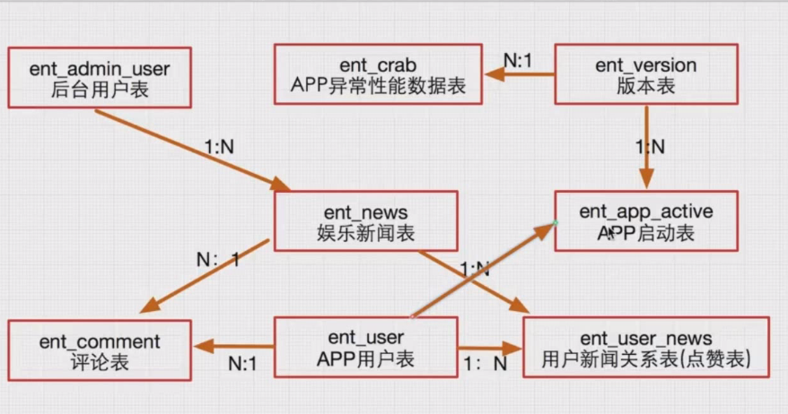

高安全
======

- 授权码sign算法；
- 登录场景access_user_token算法；
- token唯一性支持；
- API一次性请求支持；

高可用
======

- 玩转restful api开发全流程；
- web登录和APP登录异同处；
- 阿里大鱼短信验证解决客户端APP复杂登录场景；
- API接口版本解决方案；
- APP本地时间和服务器时间一致性解决方案；
- 不可预知的API内部异常解决方案；
- APP版本升级解决方案；
- 利用七牛云解决图片处理基础服务能力；
- 基础类库的封装；
- 部分PHP设计模式的穿透；
- 部分模块提供多种解决方案最后选择最优的方案；
- PHP+ajax实现异步数据交互；
- 编码严格遵循PHP代码规范；

异常检测
========

- APP端异常、性能监控以及定位解决方案；
- 多种APP调试方案（编辑器调试APP，手机调试APP）；
- 系统日志问题定位分析；

功能分析
========

APP后端分为管理后台和app后台：

- 管理后台包括：后台登录、退出登录、新闻管理、管理员管理；

  - 新闻管理包括：添加功能(图片上传，本地、七牛云)、列表(搜索、分页)、修改状态、删除文章等、编辑功能；
  - 管理员管理：增删改查、权限控制；

- app后台包括：版本升级功能、首页接口API、栏目接口、栏目列表页数据接口、详情页接口、相关推荐、内容搜索、评论、点赞、登录功能、消息推送服务、APP端异常分析定位等

  - 登录功能包括：手机号+验证码；手机号+密码、个人中心；

表字段设计
---------

admin_user

字段名称  字段类型  字段长度  默认值
id    int  10  none
username  varchar  50  
password  char  32
last_login_ip  varchar  30
last_login_time  int  10
listorder  int  8
status  tinyint  1
create_time  int  10
update_time  int  10

restful api
===========

- 面向资源；
- http动词(get post put delete等)来描述操作；
- api数据格式一般是json；

传统api
-------

- 获取用户信息 get /api/user/read;
- 更新用户信息 post /api/user/update;
- 新增用户信息 post /api/user/add;
- 删除用户信息 post /api/user/delete;

restful api
-----------

- 获取用户信息 get /api/user/1;
- 更新用户信息 put /api/user/1;
- 新增用户信息 post /api/user;
- 删除用户信息 delete /api/user/1;

HTTP状态码

- 200 请求成功；
- 201 创建成功；
- 202 更新成功；
- 400 无效请求；
- 401 地址不存在；
- 403 禁止访问；
- 404 请求资源不存在；
- 500 内部错误；

API数据结构的格式

- status 业务状态码；
- message 提示信息；
- data 数据层；

不可预知的API内部异常解决方案
===========================

https://www.jianshu.com/p/e2eaa1b88414

APP-api数据安全
===============

背景
----

- 接口请求地址和参数暴露；
- 重要接口返回数据明文暴露；
- APP登录态请求的数据安全性问题；
- 代码层的数据安全性校验问题；
  
加密方式
--------

- MD5 AES RSA；
- 基本参数放入header，如sign；业务参数放置在body中
- 每次http请求都携带sign；签名是为了保证数据的完整性
- sign唯一性保证；防止重放攻击，可以通过随机数和时间戳来实现
- 请求参数、返回数据按安全性适当加密；
- access_token；为了用户认证

基本参数包括：

- sign;
- version;
- app_type，手机系统类型；
- did，移动端设备号；
- model，手机机型；
- access_user_token；

APP和服务器端时间不一致问题解决方案：

- 通过接口获取服务器端时间；

API接口版本解决方案
==================

Route::get('api/:ver/cat','api/:ver.cat/read');

API接口文档编写
==============

需要包含哪些内容：

- API接口的地址；
- 请求方式get put post delete ;
- 入参格式；
- 出参格式；
- http code；

APP版本升级
===========

- APP更新迭代快；
- APP是安装在用户手机端；

APP版本升级的类型
----------------

- 用户自主选择更新；
- 强制更新；

APP端异常收集
=============

成熟解决方案
------------

- 听云；
- oneapm；

数据推送
========

第三方推送
----------

- 极光推送；