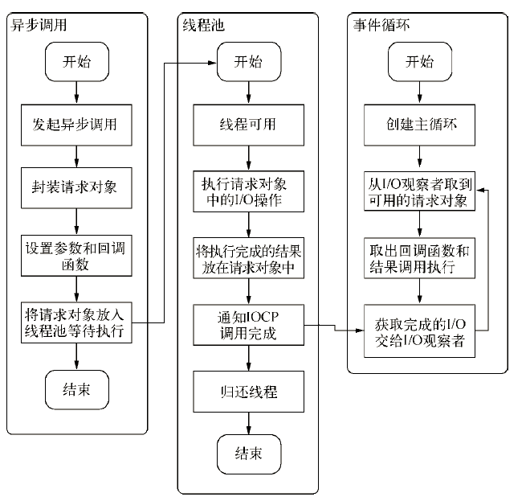
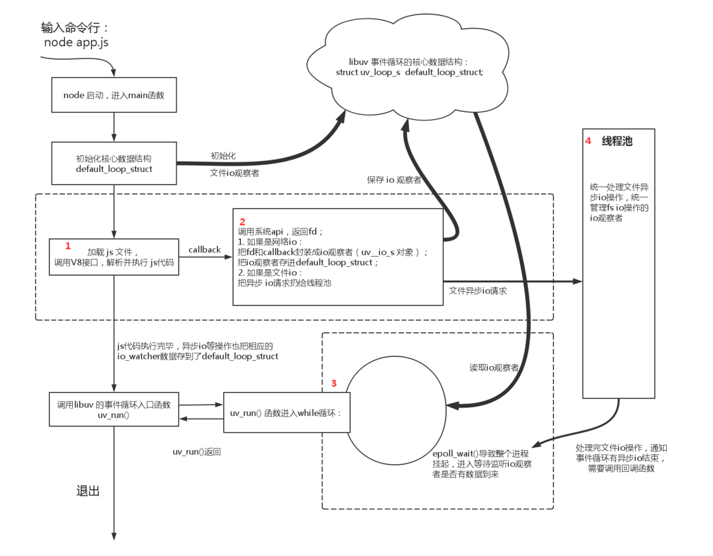

***********
nodejs中事件循环
***********

Node 简介
=========
``Node`` 中的 ``Event Loop`` 和浏览器中的是完全不相同的东西。 ``Node.js`` 采用 ``V8`` 作为 ``js`` 的解析引擎，而 ``I/O`` 处理方面使用了自己设计的 ``libuv`` ， ``libuv`` 是一个基于事件驱动的跨平台抽象层，封装了不同操作系统一些底层特性，对外提供统一的 ``API`` ，事件循环机制也是它里面的实现（下文会详细介绍）。
　　
``Node.js`` 的运行机制如下:
　　
- ``V8`` 引擎解析 ``JavaScript`` 脚本。
- 解析后的代码，调用 ``Node API`` 。
- ``libuv`` 库负责 ``Node API`` 的执行。它将不同的任务分配给不同的线程，形成一个 ``Event Loop`` （事件循环），以异步的方式将任务的执行结果返回给 ``V8`` 引擎。
- ``V8`` 引擎再将结果返回给用户。

六个阶段
========

其中 ``libuv`` 引擎中的事件循环分为 ``6`` 个阶段，它们会按照顺序反复运行。每当进入某一个阶段的时候，都会从对应的回调队列中取出函数去执行。当队列为空或者执行的回调函数数量到达系统设定的阈值，就会进入下一阶段。
　　
从上图中，大致看出 ``node`` 中的事件循环的顺序：
　　
外部输入数据-->轮询阶段(poll)-->检查阶段(check)-->关闭事件回调阶段(close callback)-->定时器检测阶段(timer)-->I/O 事件回调阶段(I/O callbacks)-->闲置阶段(idle, prepare)-->轮询阶段（按照该顺序反复运行）...
　　
- ``timers`` 阶段：这个阶段执行 ``timer`` （ ``setTimeout`` 、 ``setInterval`` ）的回调；
- ``I/O callbacks`` 阶段：处理一些上一轮循环中的少数未执行的 ``I/O`` 回调；
- ``idle prepare`` 阶段：仅 ``node`` 内部使用；
- ``poll`` 阶段：获取新的 ``I/O`` 事件, 适当的条件下 ``node`` 将阻塞在这里；
- ``check`` 阶段：执行 ``setImmediate()`` 的回调；
- ``close callbacks`` 阶段：执行 ``socket`` 的 ``close`` 事件回调；
　　
注意：上面六个阶段都不包括 ``process.nextTick()`` (下文会介绍)
　　
接下去我们详细介绍 ``timers`` 、 ``poll`` 、 ``check`` 这 3 个阶段，因为日常开发中的绝大部分异步任务都是在这 3 个阶段处理的。

timer
-----
　　
``timers`` 阶段会执行 ``setTimeout`` 和 ``setInterval`` 回调，并且是由 ``poll`` 阶段控制的。 同样，在 ``Node`` 中定时器指定的时间也不是准确时间，只能是尽快执行。

poll
----
　
``poll`` 是一个至关重要的阶段，这一阶段中，系统会做两件事情：
　　
- 回到 ``timer`` 阶段执行回调；
- 执行 ``I/O`` 回调；
　　
并且在进入该阶段时如果没有设定了 ``timer`` 的话，会发生以下两件事情
　　
- 如果 ``poll`` 队列不为空，会遍历回调队列并同步执行，直到队列为空或者达到系统限制；
- 如果 ``poll`` 队列为空时，会有两件事发生：

  + 如果有 ``setImmediate`` 回调需要执行， ``poll`` 阶段会停止并且进入到 ``check`` 阶段执行回调；
  + 如果没有 ``setImmediate`` 回调需要执行，会等待回调被加入到队列中并立即执行回调，这里同样会有个超时时间设置防止一直等待下去
　　
当然设定了 ``timer`` 的话且 ``poll`` 队列为空，则会判断是否有 ``timer`` 超时，如果有的话会回到 ``timer`` 阶段执行回调。

check 阶段
----------

``setImmediate()`` 的回调会被加入 ``check`` 队列中，从 ``event loop`` 的阶段图可以知道， ``check`` 阶段的执行顺序在 ``poll`` 阶段之后。

我们先来看个例子：

.. code-block:: js

	console.log('start')

	setTimeout(() => {

	    console.log('timer1')

	    Promise.resolve().then(function () {

	        console.log('promise1')

	    })

	}, 0)

	setTimeout(() => {

	    console.log('timer2')

	    Promise.resolve().then(function () {

	        console.log('promise2')

	    })

	}, 0)

	Promise.resolve().then(function () {

	    console.log('promise3')

	})

	console.log('end')

	//start=>end=>promise3=>timer1=>timer2=>promise1=>promise2

一开始执行栈的同步任务（这属于宏任务）执行完毕后（依次打印出 ``start end`` ，并将 2 个 ``timer`` 依次放入 ``timer`` 队列），会先去执行微任务（这点跟浏览器端的一样），所以打印出 ``promise3``
然后进入 ``timers`` 阶段，执行 ``timer1`` 的回调函数，打印 ``timer1`` ，并将 ``promise.then`` 回调放入 ``microtask`` 队列，同样的步骤执行 ``timer2`` ，打印 ``timer2`` ；这点跟浏览器端相差比较大， ``timers`` 阶段有几个 ``setTimeout/setInterval`` 都会依次执行，并不像浏览器端，每执行一个宏任务后就去执行微任务（关于 ``Node`` 与浏览器的 ``Event Loop`` 差异，下文还会详细介绍）。

注意点
======

setTimeout 和 setImmediate
---------------------------
二者非常相似，区别主要在于调用时机不同。
　　
- ``setImmediate`` 设计在 ``poll`` 阶段完成时执行，即 ``check`` 阶段；
- ``setTimeout`` 设计在 ``poll`` 阶段为空闲时，且设定时间到达后执行，但它在 ``timer`` 阶段执行；

.. code-block:: js

	setTimeout(function timeout() {

	    console.log('timeout');

	}, 0);

	setImmediate(function immediate() {

	    console.log('immediate');

	});

对于以上代码来说， ``setTimeout`` 可能执行在前，也可能执行在后。
　　
首先 ``setTimeout(fn, 0) === setTimeout(fn, 1)`` ，这是由源码决定的 进入事件循环也是需要成本的，如果在准备时候花费了大于 ``1ms`` 的时间，那么在 ``timer`` 阶段就会直接执行 ``setTimeout`` 回调；

如果准备时间花费小于 ``1ms`` ，那么就是 ``setImmediate`` 回调先执行了；
　　
但当二者在异步 ``i/o callback`` 内部调用时，总是先执行 ``setImmediate`` ，再执行 ``setTimeout`` ；

.. code-block:: js

	const fs = require('fs')

	fs.readFile(__filename, () => {

	    setTimeout(() => {

	        console.log('timeout');

	    }, 0)

	    setImmediate(() => {

	        console.log('immediate')

	    })

	})

	// immediate
	// timeout

在上述代码中， ``setImmediate`` 永远先执行。因为两个代码写在 ``IO`` 回调中， ``IO`` 回调是在 ``poll`` 阶段执行，当回调执行完毕后队列为空，发现存在 ``setImmediate`` 回调，所以就直接跳转到 ``check`` 阶段去执行回调了。

process.nextTick
-----------------
这个函数其实是独立于 ``Event Loop`` 之外的，它有一个自己的队列，当每个阶段完成后，如果存在 ``nextTick`` 队列，就会清空队列中的所有回调函数，并且优先于其它 ``microtask`` 执行。

.. code-block:: js

	setTimeout(() => {

	    console.log('timer1')

	    Promise.resolve().then(function () {

	        console.log('promise1')

	    })

	}, 0)

	process.nextTick(() => {

	    console.log('nextTick')

	    process.nextTick(() => {

	        console.log('nextTick')

	        process.nextTick(() => {

	            console.log('nextTick')

	            process.nextTick(() => {

	                console.log('nextTick')

	            })

	        })

	    })

	})

	// nextTick=>nextTick=>nextTick=>nextTick=>timer1=>promise1

Node 与浏览器的 Event Loop 差异
===============================
浏览器环境下， ``microtask`` 的任务队列是每个 ``macrotask`` 执行完之后执行。而在 ``Node.js`` 中， ``microtask`` 会在事件循环的各个阶段之间执行，也就是一个阶段执行完毕，就会去执行 ``microtask`` 队列的任务。

接下我们通过一个例子来说明两者区别：

.. code-block:: js

	setTimeout(() => {

	    console.log('timer1')

	    Promise.resolve().then(function () {

	        console.log('promise1')

	    })

	}, 0)

	setTimeout(() => {

	    console.log('timer2')

	    Promise.resolve().then(function () {

	        console.log('promise2')

	    })

	}, 0)

浏览器端运行结果： timer1=>promise1=>timer2=>promise2

``Node`` 端运行结果： timer1=>timer2=>promise1=>promise2

全局脚本（ ``main()`` ）执行，将 2 个 ``timer`` 依次放入 ``timer`` 队列， ``main()`` 执行完毕，调用栈空闲，任务队列开始执行；
　　
首先进入 ``timers`` 阶段，执行 ``timer1`` 的回调函数，打印 ``timer1`` ，并将 ``promise1.then`` 回调放入 ``microtask`` 队列，同样的步骤执行 ``timer2`` ，打印 ``timer2`` ；
　　
至此， ``timer`` 阶段执行结束， ``event loop`` 进入下一个阶段之前，执行 ``microtask`` 队列的所有任务，依次打印 ``promise1、promise2``

总结
====　

浏览器和 Node 环境下， ``microtask`` 任务队列的执行时机不同：
　　
- ``Node`` 端， ``microtask`` 在事件循环的各个阶段之间执行；
- 浏览器端， ``microtask`` 在事件循环的 ``macrotask`` 执行完之后执行；

事件驱动
========
事件驱动编程主要思想是 **通过事件或状态的变化来进行应用程序的流程控制** ，一般通过事件监听完成，一旦事件被检测到，则调用相应的回调函数。事件驱动主要执行过程是当进来的一个新的请求的时候，请求将会被压入队列中，然后通过一个循环来检测队列中的事件状态变化，如果检测到有状态变化的事件，那么就执行该事件对应的处理代码，一般都是回调函数。

线程驱动是当收到一个请求的时候，将会为该请求开一个新的线程来处理请求。而线程主要是由线程池来管理的。当线程池中有空闲的线程，会从线程池中拿取线程来处理，如果线程池中没有空闲的线程，新来的请求将会进入队列排队，直到线程池中空闲线程

异步I/O
=======
``nodejs`` 是单线程运行的，通过一个事件循环来循环取出消息队列中的消息进行处理，处理过程基本上就是去调用该消息对应的回调函数。消息队列就是当一个事件状态发生变化时，就将一个消息压入队列中 ``NodeJS`` 的事件循环模型一般要注意下面几点：

- 因为是单线程的，所以当顺序执行 ``js`` 文件中的代码的时候，事件循环是被暂停的；
- 当 ``JS`` 文件执行完以后，事件循环开始运行，并从 **消息队列** 中取出消息，开始执行回调函数；
- 因为是单线程的，所以当回调函数被执行的时候，事件循环是被暂停的；
- 当涉及到 ``I/O`` 的时候， ``nodejs`` 会开一个独立的线程来进行异步 ``I/O`` 操作，操作结果以后将消息压入 **消息队列** ；

.. code-block:: js

	var fs = require('fs');
	console.log('begin');
	setTimeout(function(){
	    console.log('timeout1');
	},100)

	fs.readFile('test.txt',function(err,data){
	    console.log(data);
	    console.log(data.toString());
	})

	setTimeout(function(){
	    console.log('timeout2');
	},100)

	console.log('end');

由于 ``NodeJS`` 是单线程运行的，首先会顺序执行 ``js`` 文件中的代码，此时事件循环是暂停的。 ``setTimeout`` 和读文件的操作都是异步操作，异步函数会在工作线程执行，当异步函数执行完成以后，将回调函数放入消息队列。当 ``js`` 文件执行完成以后，事件循环开始执行，并从消息队列中取出消息，开始执行回调函数。

而整个异步函数的执行过程如下：

1. 主线程发起一个异步请求，相应的工作线程接收请求并告知主线程已收到（异步函数返回）；
2. 主线程可以继续执行后面的代码，同时工作线程执行异步任务；
3. 工作线程完成工作以后，通知主线程；
4. 主线程收到通知后，执行一定的动作（调用回调）；

内部实现：

在 ``NodeJS`` 中整个异步 ``I/O`` 模型的基本要素是事件循环、观察者、请求对象和 ``I/O`` 线程池。整个异步 ``I/O`` 的流程图如下:

整个实现过程大概更可以描述为：发起异步请求之后将请求进行封装，封装为请求对象，对请求对象设置参数和回调函数并将请求对象放入线程池，线程池中检查是否有可用线程，当线程可用时执行请求对象的 ``I/O`` 操作，并将执行完成的结果放入请求对象中，通知 ``IOCP`` 调用完成并获取完成的 ``I/O`` 交给 ``I/O`` 观察者。

在 ``libuv`` 中创建主循环开始事件循环，主循环从 ``I/O`` 观察者中取出可用的请求对象，在请求对象中取出回调函数和 ``I/O`` 结果并调用回调函数。

NodeJS异步I/O解析：
------------------

- 事件循环：在进程启动时， ``Node`` 会创建一个类似于 ``while(true)`` 的循环，每执行一次循环体的过程称为 ``Tick`` ，每个 ``Tick`` 的过程就是查看是否有事件待处理。
- 观察者：每个事件循环中有一个或多个观察者，判断是否有事件要处理的过程就是向这些观察者询问是否有要处理的事件。
- 请求对象：从 ``JavaScript`` 发起调用到内核执行完 ``I/O`` 操作的过渡过程中，存在一种中间产物，就是请求对象。
- ``I/O`` 线程池：组装好请求、送入 ``I/O`` 线程池等待执行，完成第一步 ``I/O`` 操作，进入第二部分回调通知。（在 ``Windows`` 中，线程池中的 ``I/O`` 操作调用完毕之后，会将获取的结果存在 ``req->result`` 属性上，然后调用 ``PostQueuedCompletionStatus()`` 通知 ``IOCP`` ，告知当前对象操作已经完成。）

异步 ``I/O`` 有如下图：

Nodejs运行流程
--------------

当你运行 ``node app.js`` ，剖析内部的具体流程。

1. ``node`` 启动，进入 ``main`` 函数；
2. 初始化核心数据结构 ``default_loop_struct`` ；这个数据结构是事件循环的核心，当 ``node`` 执行到 ``加载js文件`` 时，如果用户的 ``javascript`` 代码中具有异步 ``IO`` 操作时，如读写文件。这时候， ``javascript`` 代码 调用–>lib模块–>C++模块–>libuv接口–>最终系统底层的API—>系统返回一个文件描述符 ``fd`` 和 ``javascript`` 代码传进来的回调函数 ``callback`` ，然后封装成一个 ``IO`` 观察者（一个 ``uv__io_s`` 类型的对象），保存到 ``default_loop_struct`` 。

   （文件描述符的理解： 对于每个程序系统都有一张单独的表。精确地讲，系统为每个运行的进程维护一张单独的文件描述符表。当进程打开一个文件时，系统把一个指向此文件内部数据结构的指针写入文件描述符表，并把该表的索引值返回给调用者 。应用程序只需记住这个描述符，并在以后操作该文件时使用它。操作系统把该描述符作为索引访问进程描述符表，通过指针找到保存该文件所有的信息的数据结构。）

   （观察者的理解：在每个 ``Tick`` （在程序启动后， ``Node`` 便会创建一个类似于 ``while(true)`` 的循环，每执行一次循环体的过程我们称为 ``Tick`` ）的过程中，为了判断是否有事件需要处理，所以引入了观察者的概念，每个事件循环中有一个或多个观察者，判断是否有事件要处理的过程就是向这些观察者询问是否有要处理的事件。在 ``node`` 中，事件主要来源于网络请求，文件 ``IO`` 等，这些事件对应的观察者有文件 ``I/O`` 观察者、网络 ``I/O`` 观察者等。事件轮询是一个典型的生产者、消费者模型，异步 ``I/O`` 、网络请求等则是事件的生产者，源源不断为 ``node`` 提供不同类型的事件，这些事件被传递到对应的观察者那里，事件循环则从观察者那里取出事件并处理。）

3. 加载用户 ``javascript`` 文件，调用 ``V8`` 引擎接口，解析并执行 ``javascript`` 代码； 如果有异步 ``IO`` ，则通过一系列调用系统底层 ``API`` ，若是网络 ``IO`` ，如 ``http.get()`` 或者 ``app.listen()`` ；则把系统调用后返回的结果（文件描述符 ``fd`` ）和事件绑定的回调函数 ``callback`` ，一起封装成一个 ``IO`` 观察者，保存到 ``default_loop_struct`` ；如果是文件 ``IO`` ，例如在 ``uv_fs_open()`` 的调用过程中，我们创建了一个 ``FSReqWrap`` 请求对象。从 ``JavaScript`` 层传入的参数和当前方法都被封装在这个请求对象中，其中我们最为关心的回调函数则被设置在这个对象的 ``oncomplete_sym`` 属性上： ``req_wrap->object_->Set(oncomplete_sym, callback)`` ;对象包装完毕后，在 ``Windows`` 下，则调用 ``QueueUserWorkItem()`` 方法将这个 ``FSReqWrap`` 对象推入线程池中等待执行，该方法的代码如下所示 ``QueueUserWorkItem(&uv_fs_thread_proc, req, WT_EXECUTEDEFAULT)`` ； ``QueueUserWorkItem()`` 方法接收 ``3`` 个参数：第一个参数是将要执行的方法的引用，这里引用的是 ``uv_fs_thread_proc`` ，这个参数是 ``uv_fs_thread_proc`` 运行时所需要的参数；第三个参数是执行的标志。当线程池中有可用线程时，我们会调用 ``uv_fs_thread_proc()`` 方法。 ``uv_fs_thread_proc()`` 方法会根据传入参数的类型调用相应的底层函数。以 ``uv_fs_open()`` 为例，实际上调用的是 ``fs_open()`` 方法。

   至此， ``JavaScript`` 调用立即返回，由 ``JavaScript`` 层面发起的异步调用的第一阶段就此结束。 ``JavaScript`` 线程可以继续执行当前任务的后续操作。当前的 ``I/O`` 操作在线程池中等待执行，不管它是否会阻塞 ``I/O`` ，都不会影响到 ``JavaScript`` 线程的后续执行，如此就达到到了异步的目的。

4. 进入事件循环，即调用 ``libuv`` 的事件循环入口函数 ``uv_run()`` ；当处理完 ``js`` 代码，如果有 ``io`` 操作，那么这时 ``default_loop_struct`` 是保存着对应的 ``io`` 观察者的。处理完 ``js`` 代码， ``main`` 函数继续往下调用 ``libuv`` 的事件循环入口 ``uv_run()`` ， ``node`` 进程进入事件循环：

   ``uv_run()`` 的 ``while`` 循环做的就是一件事，判断 ``default_loop_struct`` 是否有存活的 ``io`` 观察者。

   1. 如果没有 ``io`` 观察者，那么 ``uv_run()`` 退出， ``node`` 进程退出。
   2. 而如果有 ``io`` 观察者，那么 ``uv_run()`` 进入 ``epoll_wait()`` ，线程挂起等待，监听对应的 ``io`` 观察者是否有数据到来。有数据到来调用 ``io`` 观察者里保存着的 ``callback`` （ ``js`` 代码），没有数据到来时一直在 ``epoll_wait()`` 进行等待。

5. 这里要强调的是：只有用户的 ``js`` 代码全部执行完后， ``nodejs`` 才调用 ``libuv`` 的事件循环入口函数 ``uv_run()`` ，即回调函数才有可能被执行。所以，如果主线程的 ``js`` 代码调用了阻塞方法，那么整个事件轮询就会被阻塞，事件队列中的事件便得不到及时处理。

参考：

- https://www.cnblogs.com/AngelaDuoduo/p/5738486.html
- https://www.cnblogs.com/liuchuanfeng/p/6703993.html
- https://juejin.im/post/5b61d8e3e51d45191d7a28a8 （经典）

then->setImmediate->setTimeout2->nextTick->setTimeout1->setImmediate2

