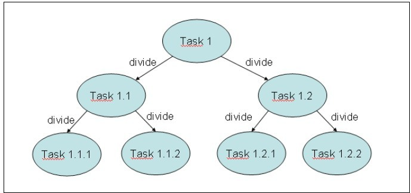

************
Fork/Join 框架
************

介绍
====
通常，当你实现一个简单的并发应用程序，你实现一些 ``Runnable`` 对象和相应的 ``Thread`` 对象。在你的程序中，你控制这些线程的创建、执行和状态。 Java 5 引入了 ``Executor`` 和 ``ExecutorService`` 接口及其实现类进行了改进（比如： ``ThreadPoolExecutor`` 类）。

执行者框架将任务的创建与执行分离。有了它，你只要实现 ``Runnable`` 对象和使用 ``Executor`` 对象。你提交 ``Runnable`` 任务给执行者，它创建、管理线程来执行这些任务。

Java 7 更进一步，包括一个面向特定问题的 ``ExecutorService`` 接口的额外实现，它就是 ``Fork/Join`` 框架。

这个框架被设计用来解决可以使用分而治之技术将任务分解成更小的问题。在一个任务中，检查你想要解决问题的大小，如果它大于一个既定的大小，把它分解成更小的任务，然后用这个框架来执行。如果问题的大小是小于既定的大小，你直接在任务中解决这问题。它返回一个可选地结果。以下图总结了这个概念：

没有公式来确定问题的参数大小，所以你可以根据它的特点来确定一个任务是否可以被细分。你可以参考任务处理元素的大小和预估任务执行时间来确定子任务大小。你需要解决的问题是测试不同的参考大小来选择最好的一个。你可以将 ``ForkJoinPool`` 作为一种特殊的执行者来考虑。

这个框架基于以下两种操作：

- ``fork`` 操作：当你把任务分成更小的任务和使用这个框架执行它们。
- ``join`` 操作：当一个任务等待它创建的任务的结束。

``Fork/Join`` 和 ``Executor`` 框架主要的区别是 ``work-stealing`` 算法。不像 ``Executor`` 框架，当一个任务正在等待它使用 ``join`` 操作创建的子任务的结束时，执行这个任务的线程（工作线程）查找其他未被执行的任务并开始它的执行。通过这种方式，线程充分利用它们的运行时间，从而提高了应用程序的性能。

为实现这个目标， ``Fork/Join`` 框架执行的任务有以下局限性：

- 任务只能使用 ``fork()`` 和 ``join()`` 操作，作为同步机制。如果使用其他同步机制，工作线程不能执行其他任务，当它们在同步操作时。比如，在 ``Fork/Join`` 框架中，你使任务进入睡眠，正在执行这个任务的工作线程将不会执行其他任务，在这睡眠期间内。
- 任务不应该执行 ``I/O`` 操作，如读或写数据文件。
- 任务不能抛出检查异常，它必须包括必要的代码来处理它们。

``Fork/Join`` 框架的核心是由以下两个类：

- ``ForkJoinPool`` ：它实现 ``ExecutorService`` 接口和 ``work-stealing`` 算法。它管理工作线程和提供关于任务的状态和它们执行的信息。
- ``ForkJoinTask`` ： 它是将在 ``ForkJoinPool`` 中执行的任务的基类。它提供在任务中执行 ``fork()`` 和 ``join()`` 操作的机制，并且这两个方法控制任务的状态。通常，为了实现你的 ``Fork/Join`` 任务，你将实现两个子类的子类的类： ``RecursiveAction`` 对于没有返回结果的任务和 ``RecursiveTask`` 对于返回结果的任务。

本章有 5 个指南，告诉你如何使 ``Fork/Join`` 框架有效地工作。

创建 Fork/Join 池
=================
在这个指南中，你将学习如何使用 ``Fork/Join`` 框架的基本元素。它包括：

- 创建一个 ``ForkJoinPool`` 对象来执行任务。
- 创建一个 ``ForkJoinPool`` 执行的 ``ForkJoinTask`` 类。

你将在这个示例中使用 ``Fork/Join`` 框架的主要特点，如下：

- 你将使用默认构造器创建 ``ForkJoinPool`` 。
- 在这个任务中，你将使用 Java API 文档推荐的结构：

.. code-block:: java

	If (problem size < default size){
		tasks=divide(task);
		execute(tasks);
	} else {
		resolve problem using another algorithm;
	}

- 你将以一种同步方式执行任务。当一个任务执行 2 个或 2 个以上的子任务时，它将等待它们的结束。通过这种方式 ，正在执行这些任务的线程（工作线程）将会查找其他任务（尚未执行的任务）来执行，充分利用它们的执行时间。
- 你将要实现的任务将不会返回任何结果，所以你将使用 ``RecursiveAction`` 作为它们实现的基类。

在这个指南中，你将继续实现一个任务来修改产品列表的价格。任务最初是负责更新一个队列中的所有元素。你将会使用 10 作为参考大小，如果一个任务必须更新超过 10 个元素，这些元素将被划分成两个部分，并创建两个任务来更新每个部分中的产品的价格。

按以下步骤来实现这个示例：

.. code-block:: java

	// 1.创建类Product，将用来存储产品的名称和价格
	public class Product {
		// 2.声明一个私有的String类型的属性name和一个私有的double类型的属性price
		private String name;
		private double price;

		// 3.实现这些方法，用来设置和获取这两个属性的值
		public String getName() {
			return name;
		}

		public void setName(String name) {
			this.name = name;
		}

		public double getPrice() {
			return price;
		}

		public void setPrice(double price) {
			this.price = price;
		}
	}

	// 4.创建ProductListGenerator类，用来产生随机产品的数列
	public class ProductListGenerator {
		// 5.实现generate()方法。它接收一个数列大小 的int类型参数，返回一个产生产品数列的List<Product>对象
		public List<Product> generate(int size) {
			// 6.创建返回产品数列的对象
			List<Product> ret = new ArrayList<Product>();
			// 7.创建产品队列。给所有产品赋予相同值。比如，10用来检查程序是否工作得很好
			for (int i = 0; i < size; i++) {
				Product product = new Product();
				product.setName("Product " + i);
				product.setPrice(10);
				ret.add(product);
			}
			return ret;
		}
	}

	// 8.创建Task类，指定它继承RecursiveAction类
	public class Task extends RecursiveAction {

		// 9.声明类的序列版本UID。这个元素是必需的，因为RecursiveAction类的父类ForkJoinTask实现了Serializable接口
		private static final long serialVersionUID = 1L;

		// 10.声明一个私有的、List<Product>类型的属性products
		private List<Product> products;

		// 11.声明两个私有的、int类型的属性first和last。这些属性将决定这个任务产品的阻塞过程
		private int first;
		private int last;

		// 12.声明一个私有的、double类型的属性increment，用来存储产品价格的增长
		private double increment;

		// 13.实现这个类的构造器，初始化所有属性
		public Task(List<Product> products, int first, int last, double increment) {
			this.products = products;
			this.first = first;
			this.last = last;
			this.increment = increment;
		}

		// 14.实现compute()方法 ，该方法将实现任务的逻辑
		@Override
		protected void compute() {
			// 15.如果last和first的差小于10（任务只能更新价格小于10的产品），使用updatePrices()方法递增的设置产品的价格
			if (last - first < 10) {
				updatePrices();
				// 16.如果last和first的差大于或等于10，则创建两个新的Task对象，一个处理产品的前半部分，另一个处理产品的后半部分，然后在ForkJoinPool中，使用invokeAll()方法执行它们
			} else {
				int middle = (last + first) / 2;
				System.out.printf("Task: Pending tasks: %s\n", getQueuedTaskCount());
				Task t1 = new Task(products, first, middle + 1, increment);
				Task t2 = new Task(products, middle + 1, last, increment);
				System.out.println("t1 : " + t1);
				System.out.println("t2 : " + t2);
				System.out.println();
				invokeAll(t1, t2);
			}
		}

		// 17.实现updatePrices()方法。这个方法更新产品队列中位于first值和last值之间的产品
		private void updatePrices() {
			System.out.println("first : " + this.first + "  last : " + last);
			System.out.println();
			for (int i = first; i < last; i++) {
				Product product = products.get(i);
				product.setPrice(product.getPrice() * (1 + increment));
			}
		}

		@Override
		public String toString() {
			return "Task [first=" + first + ", last=" + last + "]";
		}
	}

	// 18.实现这个示例的主类，通过创建Main类，并实现main()方法
	public class Main {
		public static void main(String[] args) {
			// 19.使用ProductListGenerator类创建一个包括10000个产品的数列
			ProductListGenerator generator = new ProductListGenerator();
			List<Product> products = generator.generate(40);

			// 20.创建一个新的Task对象，用来更新产品队列中的产品。first参数使用值0，last参数使用值10000（产品数列的大小）
			Task task = new Task(products, 0, products.size(), 0.20);

			// 21.使用无参构造器创建ForkJoinPool对象
			ForkJoinPool pool = new ForkJoinPool();

			// 22.在池中使用execute()方法执行这个任务
			pool.execute(task);

			// 23.实现一个显示关于每隔5毫秒池中的变化信息的代码块。将池中的一些参数值写入到控制台，直到任务完成它的执行
			do {
				System.out.printf("Main: Thread Count: %d\n", pool.getActiveThreadCount());
				System.out.printf("Main: Thread Steal: %d\n", pool.getStealCount());
				System.out.printf("Main: Paralelism: %d\n", pool.getParallelism());
				try {
					TimeUnit.MILLISECONDS.sleep(5);
				} catch (InterruptedException e) {
					e.printStackTrace();
				}
			} while (!task.isDone());

			// 24.使用shutdown()方法关闭这个池
			pool.shutdown();

			// 25.使用isCompletedNormally()方法检查假设任务完成时没有出错，在这种情况下，写入一条信息到控制台
			if (task.isCompletedNormally()) {
				System.out.printf("Main: The process has completed normally.\n");
			}
			// 26.在增长之后，所有产品的价格应该是12。将价格不是12的所有产品的名称和价格写入到控制台，用来检查它们错误地增长它们的价格
			for (int i = 0; i < products.size(); i++) {
				Product product = products.get(i);
				if (product.getPrice() != 12) {
					System.out.printf("Product %s: %f\n", product.getName(), product.getPrice());
				}
			}
			// 27.写入一条信息到控制台表明程序的结束
			System.out.println("Main: End of the program.\n");
		}
	}

在这个示例中，你已经创建一个 ``ForkJoinPool`` 对象和一个在池中执行的 ``ForkJoinTask`` 类的子类。为了创建 ``ForkJoinPool`` 对象，你已经使用了无参构造器，所以它会以默认的配置来执行。它创建一个线程数等于计算机处理器数的池。当 ``ForkJoinPool`` 对象被创建时，这些线程被创建并且在池中等待，直到有任务到达让它们执行。

由于 ``Task`` 类没有返回结果，所以它继承 ``RecursiveAction`` 类。在这个指南中，你已经使用了推荐的结构来实现任务。如果这个任务更新超过 10 产品，它将被分解成两部分，并创建两个任务，一个任务执行一部分。你已经在 ``Task`` 类中使用 ``first`` 和 ``last`` 属性，用来了解这个任务要更新的产品队列的位置范围。你已经使用 ``first`` 和 ``last`` 属性，只复制产品数列一次，而不是为每个任务创建不同的数列。

它调用 ``invokeAll()`` 方法，执行每个任务所创建的子任务。这是一个同步调用，这个任务在继续（可能完成）它的执行之前，必须等待子任务的结束。当任务正在等待它的子任务（结束）时，正在执行它的工作线程执行其他正在等待的任务。在这种行为下， ``Fork/Join`` 框架比 ``Runnable`` 和 ``Callable`` 对象本身提供一种更高效的任务管理。

``ForkJoinTask`` 类的 ``invokeAll()`` 方法是执行者（ ``Executor`` ）和 ``Fork/Join`` 框架的一个主要区别。在执行者框架中，所有任务被提交给执行者，而在这种情况下，这些任务包括执行和控制这些任务的方法都在池内。你已经在 ``Task`` 类中使用 ``invokeAll()`` 方法，它是继承了继承 ``ForkJoinTask`` 类的 ``RecursiveAction`` 类。

你使用 ``execute()`` 方法提交唯一的任务给这个池，用来所有产品数列。在这种情况下，它是一个异步调用，而主线程继续它的执行。

你已经使用 ``ForkJoinPool`` 类的一些方法，用来检查正在运行任务的状态和变化。基于这个目的，这个类包括更多的方法。参见有这些方法完整列表的监控一个 ``Fork/Join`` 池指南。

最后，与执行者框架一样，你应该使用 ``shutdown()`` 方法结束 ``ForkJoinPool`` 。

``ForkJoinPool`` 类提供其他的方法，用来执行一个任务。这些方法如下：

- ``execute (Runnable task)`` ：这是在这个示例中，使用的 ``execute()`` 方法的另一个版本。在这种情况下，你可以提交一个 ``Runnable`` 对象给 ``ForkJoinPool`` 类。注意： ``ForkJoinPool`` 类不会对 ``Runnable`` 对象使用 ``work-stealing`` 算法。它（work-stealing算法）只用于 ``ForkJoinTask`` 对象。
- ``invoke(ForkJoinTask<T> task)`` ：当 ``execute()`` 方法使用一个异步调用 ``ForkJoinPool`` 类，正如你在本示例中所学的， ``invoke()`` 方法使用同步调用 ``ForkJoinPool`` 类。这个调用不会（立即）返回，直到传递的参数任务完成它的执行。
- 你也可以使用在 ``ExecutorService`` 接口的 ``invokeAll()`` 和 ``invokeAny()`` 方法。这些方法接收一个 ``Callable`` 对象作为参数。 ``ForkJoinPool`` 类不会对 ``Callable`` 对象使用 ``work-stealing`` 算法，所以你最好使用执行者去执行它们。

``ForkJoinTask`` 类同样提供在示例中使用的 ``invokeAll()`` 的其他版本。这些版本如下：

- ``invokeAll(ForkJoinTask<?>… tasks)`` ：这个版本的方法使用一个可变参数列表。你可以传入许多你想要执行的 ``ForkJoinTask`` 对象作为参数。
- ``invokeAll(Collection<T> tasks)`` ：这个版本的方法接收一个泛型类型 ``T`` 对象的集合（如：一个 ``ArrayList`` 对象，一个 ``LinkedList`` 对象或者一个 ``TreeSet`` 对象）。这个泛型类型 ``T`` 必须是 ``ForkJoinTask`` 类或它的子类。

即使 ``ForkJoinPool`` 类被设计成用来执行一个 ``ForkJoinTask`` ，你也可以直接执行 ``Runnable`` 和 ``Callable`` 对象。你也可以使用 ``ForkJoinTask`` 类的 ``adapt()`` 方法来执行任务，它接收一个 ``Callable`` 对象或 ``Runnable`` 对象（作为参数）并返回一个 ``ForkJoinTask`` 对象。

加入任务的结果
=============
``Fork/Join`` 框架提供了执行返回一个结果的任务的能力。这些任务的类型是实现了 ``RecursiveTask`` 类。这个类继承了 ``ForkJoinTask`` 类和实现了执行者框架提供的 ``Future`` 接口。

在任务中，你必须使用 Java API 方法推荐的结构：

.. code-block:: java

	If (problem size < size){
		tasks=Divide(task);
		execute(tasks);
		groupResults()
		return result;
	} else {
		resolve problem;
		return result;
	}

如果这个任务必须解决一个超过预定义大小的问题，你应该将这个任务分解成更多的子任务，并且用 ``Fork/Join`` 框架来执行这些子任务。当这些子任务完成执行，发起的任务将获得所有子任务产生的结果 ，对这些结果进行分组，并返回最终的结果。最终，当在池中执行的发起的任务完成它的执行，你将获取整个问题地最终结果。

在这个指南中，你将学习如何使用 ``Fork/Join`` 框架解决这种问题，开发一个在文档中查找单词的应用程序。你将会实现以下两种任务类型：

- 一个文档任务，将在文档中的行集合中查找一个单词。
- 一个行任务，将在文档的一部分数据中查找一个单词。

所有任务将返回单词在文档的一部分中或行中出现的次数。

.. code-block:: java

	// 1.创建一个DocumentMock类，它将产生用来模拟文档的字符串的二维数组
	public class DocumentMock {
		// 2.创建一个带有一些单词的字符串数组。这个数组将被用来生成字符串二维数组
		private String words[] = { "the", "hello", "goodbye", "packt", "java", "thread", "pool", "random", "class", "main" };

		// 3.实现generateDocument()方法。它接收以下参数：行数、每行的单词数。这个例子返回一个字符串二维数组，来表示将要查找的单词
		public String[][] generateDocument(int numLines, int numWords, String word) {
			// 4.首先，创建生成这个文档必需的对象：字符串二维对象和生成随机数的Random对象
			int counter = 0;
			String[][] document = new String[numLines][numWords];
			Random random = new Random();
			// 5.用字符串填充这个数组。存储在每个位置的字符串是单词数组的随机位置，统计这个程序将要在生成的数组中查找的单词出现的次数。你可以使用这个值来检查程序是否执行正确
			for (int i = 0; i < numLines; i++) {
				for (int j = 0; j < numWords; j++) {
					int index = random.nextInt(words.length);
					document[i][j] = words[index];
					if (document[i][j].equals(word)) {
						counter++;
					}
				}
			}
			// 6.将单词出现的次数写入控制台，并返回生成的二维数组
			System.out.printf("DocumentMock: The word appears %d times in the document.\n", counter);
			return document;
		}
	}

	// 7.创建一个DocumentTask类，指定它继承RecursiveTask类，并参数化为Integer类型。该类将实现统计单词在一组行中出现的次数的任务
	public class DocumentTask extends RecursiveTask<Integer> {

		private static final long serialVersionUID = 1L;

		// 8.声明一个私有的String类型的二维数组document，两个私有的int类型的属性名为start和end，一个私有的String类型的属性名为word
		private String[][] document;
		private int start, end;
		private String word;

		// 9.实现这个类的构造器，用来初始化这些属性
		public DocumentTask(String[][] document, int start, int end, String word) {
			this.document = document;
			this.start = start;
			this.end = end;
			this.word = word;
		}

		// 10.实现compute()方法。如果属性end和start的差小于10，那么这个任务统计单词位于行在调用processLines()方法的这些位置中出现的次数
		@Override
		protected Integer compute() {
			Integer result = null;
			if (end - start < 10) {
				result = processLines(document, start, end, word);
			} else {
				// 11.否则，用两个对象分解行组，创建两个新的DocumentTask对象用来处理这两个组，并且在池中使用invokeAll()方法来执行它们
				int mid = (start + end) / 2;
				DocumentTask task1 = new DocumentTask(document, start, mid, word);
				DocumentTask task2 = new DocumentTask(document, mid, end, word);
				invokeAll(task1, task2);

				// 12.然后，使用groupResults()方法将这两个任务返回的结果相加。最后，返回这个任务统计的结果
				try {
					result = groupResults(task1.get(), task2.get());
				} catch (InterruptedException | ExecutionException e) {
					e.printStackTrace();
				}
			}
			return result;
		}

		// 13.实现processLines()方法。它接收以下参数：字符串二维数组、start属性、end属性、任务将要查找的word属性
		private Integer processLines(String[][] document, int start, int end, String word) {
			List<LineTask> tasks = new ArrayList<>();

			// 14.对于任务要处理的每行，创建LineTask对象来处理整行，并且将它们存储在任务数列中
			for (int i = start; i < end; i++) {
				LineTask task = new LineTask(document[i], 0, document[i].length, word);
				tasks.add(task);
			}
			// 15.在那个数列中使用invokeAll()执行所有任务
			invokeAll(tasks);
			// 16.合计所有这些任务返回的值，并返回这个结果
			int result = 0;
			for (int i = 0; i < tasks.size(); i++) {
				LineTask task = tasks.get(i);
				try {
					result = result + task.get();
				} catch (InterruptedException | ExecutionException e) {
					e.printStackTrace();
				}
			}

			return new Integer(result);
		}

		// 17.实现groupResults()方法。它相加两个数，并返回这个结果
		private Integer groupResults(Integer number1, Integer number2) {
			Integer result;
			result = number1 + number2;
			return result;
		}
	}

	// 18.创建LineTask类，指定它继承RecursiveTask类，并参数化为Integer类型。这个类将实现统计单词在一行中出现的次数的任务
	public class LineTask extends RecursiveTask<Integer> {

		// 19.声明这个类的序列号版本UID。这个元素是必需的，因为RecursiveTask类的父类，ForkJoinTask类实现了Serializable接口。声明一个私有的、String类型的属性line，两个私有的、int类型的属性start和end，一个私有的、String类型的属性word
		private static final long serialVersionUID = 1L;
		private String[] line;
		private int start, end;
		private String word;

		// 20.实现这个类的构造器，初始化这些属性
		public LineTask(String[] line, int start, int end, String word) {
			this.line = line;
			this.start = start;
			this.end = end;
			this.word = word;
		}

		// 21.实现这个类的compute()方法。如果属性end和start之差小于100，这个任务在行中由start和end属性使用count()方法决定的片断中查找单词
		@Override
		protected Integer compute() {
			Integer result = null;

			if (end - start < 10) {
				result = count(line, start, end, word);
			} else {
				// 22.否则，将行中的单词组分成两部分，创建两个新的LineTask对象来处理这两个组，在池中使用invokeAll()方法执行它们
				int mid = (start + end) / 2;
				LineTask task1 = new LineTask(line, start, mid, word);
				LineTask task2 = new LineTask(line, mid, end, word);
				invokeAll(task1, task2);

				// 23.然后，使用groupResults()方法将这两个任务返回的值相加。最后，返回这个任务计算的结果
				try {
					result = groupResults(task1.get(), task2.get());
				} catch (InterruptedException | ExecutionException e) {
					e.printStackTrace();
				}
			}
			return result;
		}

		// 24.实现count()方法。它接收以下参数：完整行的字符串数组、start属性、end属性、任务将要查找的word属性
		private Integer count(String[] line, int start, int end, String word) {
			// 25.比较这个任务将要查找的word属性中的在start和end属性之间的位置的单词，如果它们相等，则增加count变量
			int counter = 0;
			for (int i = start; i < end; i++) {
				if (line[i].equals(word)) {
					counter++;
				}
			}

			// 26.为了显示示例的执行，令任务睡眠10毫秒
			try {
				TimeUnit.MILLISECONDS.sleep(10);
			} catch (InterruptedException e) {
				e.printStackTrace();
			}
			// 27.返回counter变量的值
			return counter;
		}

		// 28.实现groupResults()方法。它合计两个数的值，并返回这个结果
		private Integer groupResults(Integer number1, Integer number2) {
			Integer result;
			result = number1 + number2;
			return result;
		}
	}

	// 29.实现示例的主类，通过创建Main类，并实现main()方法
	public class Main {
		public static void main(String[] args) {
			// 30.使用DocumentMock类，创建一个带有100行，每行1000个单词的Document
			DocumentMock mock = new DocumentMock();
			String[][] document = mock.generateDocument(10, 100, "the");

			// 31.创建一个新的DocumentTask对象，用来更新整个文档的产品。参数start值为0，参数end值为100
			DocumentTask task = new DocumentTask(document, 0, 10, "the");
			// 32.使用无参构造器创建一个ForkJoinPool对象，在池中使用execute()方法执行这个任务
			ForkJoinPool pool = new ForkJoinPool();
			pool.execute(task);

			// 33.实现一个代码块，用来显示关于池变化的信息。每秒向控制台写入池的某些参数的值，直到任务完成它的执行
			do {
				System.out.printf("******************************************\n");
				System.out.printf("Main: Parallelism: %d\n", pool.getParallelism());
				System.out.printf("Main: Active Threads: %d\n", pool.getActiveThreadCount());
				System.out.printf("Main: Task Count: %d\n", pool.getQueuedTaskCount());
				System.out.printf("Main: Steal Count: %d\n", pool.getStealCount());
				System.out.printf("******************************************\n");

				try {
					TimeUnit.SECONDS.sleep(1);
				} catch (InterruptedException e) {
					e.printStackTrace();
				}
			} while (!task.isDone());
			// 34.使用shutdown()方法关闭这个池
			pool.shutdown();
			// 35.使用awaitTermination()方法等待任务的结束
			try {
				pool.awaitTermination(1, TimeUnit.DAYS);
			} catch (InterruptedException e) {
				e.printStackTrace();
			}

			// 36.打印单词在文档中出现的次数。检查这个数是否与DocumentMock类中写入的数一样
			try {
				System.out.printf("Main: The word appears %d in the document", task.get());
			} catch (InterruptedException | ExecutionException e) {
				e.printStackTrace();
			}
		}
	}

在这个示例中，你已经实现了两种不同的任务：

- ``DocumentTask`` 类：这个类的任务将处理由 ``start`` 和 ``end`` 属性决定的文档中的行组。如果这个行组的大小小于 10 ，它为每行创建 ``LineTask`` 对象，并且当它们完成它们的执行时，它合计这些任务的结果，并返回这个合计值。如果这个任务要处理的行组大小不小于 10 ，它将这个组分成两个并创建两个 ``DocumentTask`` 对象来处理这些新组。当这些任务完成它们的执行时，这个任务合计它们的结果，并返回这个合计值。
- ``LineTask`` 类：这个类的任务将处理文档中的一行的单词组。如果这个单词组小于 10 ，这个任务直接在这个单词组中查找单词，并且返回这个单词出现的次数。否则，它将这个单词组分成两个并创建两个 ``LineTask`` 对象来处理。当这些任务完成它们的执行，这个任务合计这些任务的结果并返回这个合计值。

在 ``Main`` 类中，你已经使用默认构造器一个 ``ForkJoinPool`` 对象，并且你在它里面执行一个 ``DocumentTask`` 类，这个类将处理一个拥有 100 行，每行有 1000 个单词的文档。这个任务将使用其他的 ``DocumentTask`` 对象和 ``LineTask`` 对象来分解这个问题，当所有任务完成它们的执行，你可以使用启动任务来获取单词在整个文档中出现的总次数。由于任务返回一个结果，所以它们继承 ``RecursiveTask`` 类。

为了获取 ``Task`` 返回的结果，你已经使用了 ``get()`` 方法 。这个方法是在 ``Future`` 接口中声明的，由 ``RecursiveTask`` 类实现的。

当你执行这个程序，你可以比较在控制台中的第一行和最后一行。第一行是文档生成时计算的单词出现的次数，最后一行是由 ``Fork/Join`` 任务计算的。

``ForkJoinTask`` 类提供其他的方法来完成一个任务的执行，并返回一个结果，这就是 ``complete()`` 方法。这个方法接收一个 ``RecursiveTask`` 类的参数化类型的对象，并且当 ``join()`` 方法被调用时，将这个对象作为任务的结果返回。 它被推荐使用在：提供异步任务结果。

由于 ``RecursiveTask`` 类实现了 ``Future`` 接口， ``get()`` 方法其他版本如下：

- ``get(long timeout, TimeUnit unit)`` ：这个版本的 ``get()`` 方法，如果任务的结果不可用，在指定的时间内等待它。如果超时并且结果不可用，那么这个方法返回 ``null`` 值。 ``TimeUnit`` 类是一个枚举类，它有以下常量：DAYS, HOURS，MICROSECONDS，MILLISECONDS， MINUTES， NANOSECONDS和SECONDS。

异步运行任务
===========
当你在 ``ForkJoinPool`` 中执行 ``ForkJoinTask`` 时，你可以使用同步或异步方式来实现。当你使用同步方式时，提交任务给池的方法直到提交的任务完成它的执行，才会返回结果。当你使用异步方式时，提交任务给执行者的方法将立即返回，所以这个任务可以继续执行。

你应该意识到这两个方法有很大的区别，当你使用同步方法，调用这些方法（比如： ``invokeAll()`` 方法）的任务将被阻塞，直到提交给池的任务完成它的执行。这允许 ``ForkJoinPool`` 类使用 ``work-stealing`` 算法，分配一个新的任务给正在执行睡眠任务的工作线程。反之，当你使用异步方法（比如： ``fork()`` 方法），这个任务将继续它的执行，所以 ``ForkJoinPool`` 类不能使用 ``work-stealing`` 算法来提高应用程序的性能。在这种情况下，只有当你调用 ``join()`` 或 ``get()`` 方法来等待任务的完成时， ``ForkJoinPool`` 才能使用 ``work-stealing`` 算法。

在这个指南中，你将学习如何使用 ``ForkJoinPool`` 和 ``ForkJoinTask`` 类提供的异步方法来管理任务。你将实现一个程序，在一个文件夹及其子文件夹内查找确定扩展名的文件。你将实现 ``ForkJoinTask`` 类来处理文件夹的内容。对于文件夹里的每个子文件夹，它将以异步的方式提交一个新的任务给 ``ForkJoinPool`` 类。对于文件夹里的每个文件，任务将检查文件的扩展名，如果它被处理，并把它添加到结果列表。

.. code-block:: java

	// 1.创建FolderProcessor类，指定它继承RecursiveTask类，并参数化为List<String>类型
	public class FolderProcessor extends RecursiveTask<List<String>> {

		// 2.声明这个类的序列号版本UID。这个元素是必需的，因为RecursiveTask类的父类，ForkJoinTask类实现了Serializable接口
		private static final long serialVersionUID = 1L;
		// 3.声明一个私有的、String类型的属性path。这个属性将存储任务将要处理的文件夹的全路径
		private String path;

		// 4.声明一个私有的、String类型的属性extension。这个属性将存储任务将要查找的文件的扩展名
		private String extension;

		// 5.实现这个类的构造器，初始化它的属性
		public FolderProcessor(String path, String extension) {
			this.path = path;
			this.extension = extension;
		}

		// 6.实现compute()方法。正如你用List<String>类型参数化RecursiveTask类，这个方法将返回这个类型的一个对象
		@Override
		protected List<String> compute() {
			// 7.声明一个String对象的数列，用来保存存储在文件夹中的文件
			List<String> list = new ArrayList<>();
			// 8.声明一个FolderProcessor任务的数列，用来保存将要处理存储在文件夹内的子文件夹的子任务
			List<FolderProcessor> tasks = new ArrayList<>();

			// 9.获取文件夹的内容
			File file = new File(path);
			File[] content = file.listFiles();

			// 10.对于文件夹里的每个元素，如果是子文件夹，则创建一个新的FolderProcessor对象，并使用fork()方法异步地执行它
			if (content != null) {
				for (int i = 0; i < content.length; i++) {
					if (content[i].isDirectory()) {
						FolderProcessor task = new FolderProcessor(content[i].getAbsolutePath(), extension);
						task.fork();
						tasks.add(task);
					} else {
						// 11.否则，使用checkFile()方法比较这个文件的扩展名和你想要查找的扩展名，如果它们相等，在前面声明的字符串数列中存储这个文件的全路径
						if (checkFile(content[i].getName())) {
							list.add(content[i].getAbsolutePath());
						}
					}
				}

				// 12.如果FolderProcessor子任务的数列超过50个元素，写入一条信息到控制台表明这种情况
				if (tasks.size() > 50) {
					System.out.printf("%s: %d tasks ran.\n", file.getAbsolutePath(), tasks.size());
				}

				// 13.调用辅助方法addResultsFromTask()，将由这个任务发起的子任务返回的结果添加到文件数列中。传入参数：字符串数列和FolderProcessor子任务数列
				addResultsFromTasks(list, tasks);
			}
			// 14.返回字符串数列
			return list;
		}

		// 15.实现addResultsFromTasks()方法。对于保存在tasks数列中的每个任务，调用join()方法，这将等待任务执行的完成，并且返回任务的结果。使用addAll()方法将这个结果添加到字符串数列
		private void addResultsFromTasks(List<String> list, List<FolderProcessor> tasks) {
			for (FolderProcessor item : tasks) {
				list.addAll(item.join());
			}
		}
		// 16.实现checkFile()方法。这个方法将比较传入参数的文件名的结束扩展是否是你想要查找的。如果是，这个方法返回true，否则，返回false
		private boolean checkFile(String name) {
			if (name.endsWith(extension)) {
				return true;
			}
			return false;
		}
	}

	// 17.实现这个例子的主类，通过创建Main类，并实现main()方法
	public class Main {
		public static void main(String[] args) {
			// 18.使用默认构造器创建ForkJoinPool
			ForkJoinPool pool = new ForkJoinPool();
			// 19.创建3个FolderProcessor任务。用不同的文件夹路径初始化每个任务
			FolderProcessor system = new FolderProcessor("C:\\Windows", "log");
			FolderProcessor apps = new FolderProcessor("C:\\Program Files", "log");
			FolderProcessor documents = new FolderProcessor("C:\\Documents And Settings", "log");

			// 20.在池中使用execute()方法执行这3个任务
			pool.execute(system);
			pool.execute(apps);
			pool.execute(documents);

			// 21.将关于池每秒的状态信息写入到控制台，直到这3个任务完成它们的执行
			do {
				System.out.printf("******************************************\n");
				System.out.printf("Main: Parallelism: %d\n", pool.getParallelism());
				System.out.printf("Main: Active Threads: %d\n", pool.getActiveThreadCount());
				System.out.printf("Main: Task Count: %d\n", pool.getQueuedTaskCount());
				System.out.printf("Main: Steal Count: %d\n", pool.getStealCount());
				System.out.printf("******************************************\n");
				try {
					TimeUnit.SECONDS.sleep(1);
				} catch (InterruptedException e) {
					e.printStackTrace();
				}
			} while ((!system.isDone()) || (!apps.isDone()) || (!documents.isDone()));

			// 22.使用shutdown()方法关闭ForkJoinPool
			pool.shutdown();

			// 23.将每个任务产生的结果数量写入到控制台
			List<String> results;

			results = system.join();
			System.out.printf("System: %d files found.\n", results.size());

			results = apps.join();
			System.out.printf("Apps: %d files found.\n", results.size());

			results = documents.join();
			System.out.printf("Documents: %d files found.\n", results.size());
		}
	}

这个例子的关键是 ``FolderProcessor`` 类。每个任务处理文件夹的内容。如你所知，这个内容有以下两种元素：

- 文件
- 其他文件夹

如果任务找到一个文件夹，它创建另一个 ``Task`` 对象来处理这个文件夹，并使用 ``fork()`` 方法把它（ ``Task`` 对象）提交给池。这个方法提交给池的任务将被执行，如果池中有空闲的工作线程或池可以创建一个新的工作线程。这个方法会立即返回，所以这个任务可以继续处理文件夹的内容。对于每个文件，任务将它的扩展与所想要查找的（扩展）进行比较，如果它们相等，将文件名添加到结果数列。

一旦这个任务处理完指定文件夹的所有内容，它将使用 ``join()`` 方法等待已提交到池的所有任务的结束。这个方法在一个任务等待其执行结束时调用，并返回 ``compute()`` 方法返回的值。这个任务将它自己发送的所有任务的结果和它自己的结果分组，并返回作为 ``compute()`` 方法的一个返回值的数组。

``ForkJoinPool`` 类同时允许任务的执行以异步的方式。你已经使用 ``execute()`` 方法，提交 3 个初始任务给池。在 ``Main`` 类中，你也使用 ``shutdown()`` 方法结束池，并打印关于正在池中运行任务的状态和变化的信息。 ``ForkJoinPool`` 类包含更多方法，可用于这个目的（异步执行任务）。参见监控一个 ``Fork/Join`` 池指南，看这些方法完整的列表。

在这个示例中，你已经使用了 ``join()`` 方法来等待任务的结束，并获得它们的结果。对于这个目的，你也可以使用 ``get()`` 方法的两个版本之一：

- ``get()`` ：这个版本的 ``get()`` 方法，如果 ``ForkJoinTask`` 已经结束它的执行，则返回 ``compute()`` 方法的返回值，否则，等待直到它完成。
- ``get(long timeout, TimeUnit unit)`` ：这个版本的 ``get()`` 方法，如果任务的结果不可用，则在指定的时间内等待它。如果超时并且任务的结果仍不可用，这个方法返回 ``null`` 值。 ``TimeUnit`` 类是一个枚举类，包含以下常量：DAYS，HOURS，MICROSECONDS， MILLISECONDS，MINUTES， NANOSECONDS 和 SECONDS。

``get()`` 和 ``join()`` 有两个主要的区别：

- ``join()`` 方法不能被中断。如果你中断调用 ``join()`` 方法的线程，这个方法将抛出 ``InterruptedException`` 异常。
- 如果任务抛出任何未受检异常， ``get()`` 方法将返回一个 ``ExecutionException`` 异常，而 ``join()`` 方法将返回一个 ``RuntimeException`` 异常。

任务中抛出异常
=============
在Java中有两种异常：

- 已检查异常（ ``Checked exceptions`` ）：这些异常必须在一个方法的 ``throws`` 从句中指定或在内部捕捉它们。比如： ``IOException`` 或 ``ClassNotFoundException`` 。
- 未检查异常（ ``Unchecked exceptions`` ）：这些异常不必指定或捕捉。比如： ``NumberFormatException`` 。

在 ``ForkJoinTask`` 类的 ``compute()`` 方法中，你不能抛出任何已检查异常，因为在这个方法的实现中，它没有包含任何抛出（异常）声明。你必须包含必要的代码来处理异常。但是，你可以抛出（或者它可以被任何方法或使用内部方法的对象抛出）一个未检查异常。 ``ForkJoinTask`` 和 ``ForkJoinPool`` 类的行为与你可能的期望不同。程序不会结束执行，并且你将不会在控制台看到任何关于异常的信息。它只是被吞没，好像它没抛出（异常）。你可以使用 ``ForkJoinTask`` 类的一些方法，得知一个任务是否抛出异常及其异常种类。在这个指南中，你将学习如何获取这些信息。

.. code-block:: java

	// 1.创建Task类。指定它实现RecursiveTask类，并参数化为Integer类型
	public class Task extends RecursiveTask<Integer> {

		private static final long serialVersionUID = 1L;
		// 2.声明一个私有的、int类型数组的属性array。它将模拟在这个指南中，你将要处理的数据的数组
		private int array[];
		// 3.声明两个私有的、int类型的属性start和end。这些属性将决定这个任务要处理的数组的元素
		private int start, end;

		// 4.实现这个类的构造器，初始化它的属性
		public Task(int array[], int start, int end) {
			this.array = array;
			this.start = start;
			this.end = end;
		}

		// 5.实现这个任务的compute()方法。正如你使用Integer类型参数化RecursiveTask类一样，这个方法将返回一个Integer对象。首先，将start和end值写入到控制台
		@Override
		protected Integer compute() {
			System.out.printf("Task: Start from %d to %d\n", start, end);
			// 6.如果这个任务将要处理的，由start和end属性决定的元素块的大小小于10，检查数组的第4位置（索引号3）的元素是否在那个块中。如果是这种情况，抛出一个RuntimeException异常。然后，令这个任务睡眠1秒
			if (end - start < 10) {
				if ((3 > start) && (3 < end)) {
					throw new RuntimeException("This task throws an Exception: Task from  " + start + " to " + end);
				}
				try {
					TimeUnit.SECONDS.sleep(1);
				} catch (InterruptedException e) {
					e.printStackTrace();
				}
				// 7.否则（这个任务将要处理的元素块的大小等于或大于10），将这个元素块分成两个部分，创建2个Task对象来处理这些块，在池中使用invokeAll()方法执行它们
			} else {
				int mid = (end + start) / 2;
				Task task1 = new Task(array, start, mid);
				Task task2 = new Task(array, mid, end);
				invokeAll(task1, task2);
				System.out.printf("Task: Result form %d to %d: %d\n", start, mid, task1.join());
				System.out.printf("Task: Result form %d to %d: %d\n", mid, end, task2.join());
			}
			// 8.写入一条信息（start和end属性值）到控制台，表明任务的结束
			System.out.printf("Task: End form %d to %d\n", start, end);
			// 9.返回数字0作为任务的结果
			return new Integer(0);
		}
	}

	// 10.实现这个例子的主类，通过创建Main类，并实现main()方法
	public class Main {
		public static void main(String[] args) {
			// 11.创建一个大小为100的整数数组
			int array[] = new int[100];
			// 12.创建一个Task对象来处理这个数组
			Task task = new Task(array, 0, 100);
			// 13.使用默认构造器创建一个ForkJoinPool对象
			ForkJoinPool pool = new ForkJoinPool();
			// 14.在池中使用execute()方法执行这个任务
			pool.execute(task);
			// 15.使用shutdown()方法关闭ForkJoinPool类
			pool.shutdown();

			// 16.使用awaitTermination()方法等待任务的结束。如果你想要等待任务的结束，无论它花多长时间结束，将值1和TimeUnit.DAYS作为参数传给这个方法
			try {
				pool.awaitTermination(1, TimeUnit.DAYS);
			} catch (InterruptedException e) {
				e.printStackTrace();
			}

			// 17.使用isCompletedAbnormally()方法，检查这个任务或它的子任务是否已经抛出异常。在这种情况下，将抛出的异常写入到控制台。使用ForkJoinTask类的getException()方法获取那个异常
			if (task.isCompletedAbnormally()) {
				System.out.printf("Main: An exception has ocurred\n");
				System.out.printf("Main: %s\n", task.getException());
			}
			System.out.printf("Main: Result: %d", task.join());
		}
	}

在这个指南中，你已经实现 ``Task`` 类来处理一个数字数组。它检查要处理的数字块是否是 10 个或更多的元素。在这种情况下，它将数字块分成两块，并创建两个新的 ``Task`` 对象来处理这些块。否则，他查找数组中的第 4 个位置的元素（索引号 3 ）。如果这个元素在任务要处理的块中，它抛出一个 ``RuntimeException`` 异常。

当你执行这个程序，异常是抛出了，但程序并没有停止。在 ``Main`` 类中，你已经使用发起任务调用 ``ForkJoinTask`` 类的 ``isCompletedAbnormally()`` 方法。如果任务或它的子任务抛出异常，这个方法返回 ``true`` 。你同时使用了同样对象的 ``getException()`` 方法来获取已抛出的 ``Exception`` 对象。

当你在一个任务中抛出一个未检查异常时，它也影响到它的父任务（把它提交到 ``ForkJoinPool`` 类的任务）和父任务的父任务，以此类推。如果你修订程序的所有输出，你将会看到一些任务结束没有输出信息。

这些任务是那些及其父任务抛出异常的任务。它们全部异常地完成。考虑到这一点，当你使用 ``ForkJoinPool`` 和 ``ForkJoinTask`` 对象开发一个程序，当你不想这种行为时，可以抛出异常。

取消任务
========
当你在一个 ``ForkJoinPool`` 类中执行 ``ForkJoinTask`` 对象，在它们开始执行之前，你可以取消执行它们。 ``ForkJoinTask`` 类提供 ``cancel()`` 方法用于这个目的。当你想要取消一个任务时，有一些点你必须考虑一下，这些点如下：

- ``ForkJoinPool`` 类并没有提供任何方法来取消正在池中运行或等待的所有任务。
- 当你取消一个任务时，你不能取消一个已经执行的任务。

在这个指南中，你将实现取消 ``ForkJoinTask`` 对象的例子。你将查找数在数组中的位置。第一个找到这个数的任务将取消剩下的任务（未找到这个数的任务）。由于 ``Fork/Join`` 框架并没有提供这种功能，所以，你将实现一个辅助类来做这个取消功能。

.. code-block:: java

// 1.创建ArrayGenerator类。这个类将产生一组随机的、指定大小的整数数字。实现generateArray()方法。它将产生一组数字，它接收数组大小作为参数
public class ArrayGenerator {
	public int[] generateArray(int size) {
		int array[] = new int[size];
		Random random = new Random();
		for (int i = 0; i < size; i++) {
			array[i] = random.nextInt(10);
		}
		return array;
	}
}

// 2.创建一个TaskManager类。我们将使用这个类来存储在ForkJoinPool中执行的所有任务。由于ForkJoinPool和ForkJoinTask类的局限性，你将使用这个类来取消ForkJoinPool类的所有任务
public class TaskManager {
	// 3.声明一个对象参数化为ForkJoinTask类型的数列，其中ForkJoinTask类参数化为Integer类型
	private List<ForkJoinTask<Integer>> tasks;

	// 4.实现这个类的构造器，它初始化任务数列
	public TaskManager() {
		tasks = new ArrayList<>();
	}
	// 5.实现addTask()方法。它添加ForkJoinTask对象到任务数列
	public void addTask(ForkJoinTask<Integer> task) {
		tasks.add(task);
	}

	// 6.实现cancelTasks()方法。它将使用cancel()方法取消在数列中的所有ForkJoinTask对象。它接收一个想要取消剩余任务的ForkJoinTask对象作为参数。这个方法取消所有任务
	public void cancelTasks(ForkJoinTask<Integer> cancelTask) {
		for (ForkJoinTask<Integer> task : tasks) {
			if (task != cancelTask) {
				task.cancel(true);
				((SearchNumberTask) task).writeCancelMessage();
			}
		}
	}
}

// 7.实现SearchNumberTask类，指定它继承参数化为Integer类型的RecursiveTask类。这个类将查找在整数数组的元素块中的数
public class SearchNumberTask extends RecursiveTask<Integer> {

	private static final long serialVersionUID = 1L;
	// 声明一个私有的、int类型的常量并初始化它为值-1。当任务没有找到这个数时，它将作为任务的返回值
	private final static int NOT_FOUND = -1;
	// 8.声明一个私有的、int类型的数字数组
	private int numbers[];
	// 9.声明两个私有的、int类型的属性start和end。这些属性将决定任务要处理的数组的元素
	private int start, end;

	// 10.声明一个私有的、int类型的属性number，它将存储你将要查找的数
	private int number;
	// 11.声明一个私有的、TaskManager类型的属性manager。你将使用这个对象来取消所有任务
	private TaskManager manager;

	// 实现这个类的构造器来初始化它的属性
	public SearchNumberTask(int numbers[], int start, int end, int number, TaskManager manager) {
		this.numbers = numbers;
		this.start = start;
		this.end = end;
		this.number = number;
		this.manager = manager;
	}

	// 14.实现compute()方法。写入一条信息（start和end属性值）到控制台表明这个方法的开始
	@Override
	protected Integer compute() {
		System.out.println("Task: " + start + ":" + end);
		// 15.如果start和end之差大于10（这个任务将处理超过10个元素的数组），调用launchTasks()方法，将这个任务的工作拆分成两个任务
		int ret;
		if (end - start > 10) {
			ret = launchTasks();
		} else { // 16.否则，这个任务调用lookForNumber()方法来查找在数组块中的数
			ret = lookForNumber();
		}
		// 17.返回任务的结果
		return new Integer(ret);
	}

	// 实现launchTasks()方法。首先，将这个任务要处理的数块分成两个部分，然后，创建两个Task对象来处理它们
	private int launchTasks() {
		int mid = (start + end) / 2;

		SearchNumberTask task1 = new SearchNumberTask(numbers, start, mid, number, manager);
		SearchNumberTask task2 = new SearchNumberTask(numbers, mid, end, number, manager);
		// 添加这个任务到TaskManager对象中
		manager.addTask(task1);
		manager.addTask(task2);
		// 使用fork()方法异步执行这两个任务
		task1.fork();
		task2.fork();
		// 等待这个任务的结束，返回第一个任务的结果（如果它不等于1），或第二个任务的结果
		int returnValue;
		returnValue = task1.join();
		if (returnValue != -1) {
			return returnValue;
		}

		returnValue = task2.join();
		return returnValue;
	}

	// 实现writeCancelMessage()方法，当任务取消时，写一条信息到控制台
	public void writeCancelMessage() {
		System.out.printf("Task: Cancelled task from %d to %d\n", start, end);
	}

	// 实现lookForNumber()方法
	private int lookForNumber() {
		// 对于任务要处理的元素块中的所有元素，将你想要查找的数与存储在元素中的值进行比较。如果他们相等，写入一条信息到控制台表明这种情形，使用TaskManager对象的cancelTasks()方法来取消所有任务，并返回你已经找到的这个数对应元素的位置
		for (int i = start; i < end; i++) {
			if (numbers[i] == number) {
				System.out.printf("Task: Number %d found in position %d\n", number, i);
				manager.cancelTasks(this);	// ȡ��ʣ�������
				return i;
			}
			// 在循环的内部，令任务睡眠1秒
			try {
				TimeUnit.SECONDS.sleep(1);
			} catch (InterruptedException e) {
				e.printStackTrace();
			}
		}
		// 最后，返回值-1
		return NOT_FOUND;
	}
}

// 实现这个例子的主类，通过创建Main类，并实现main()方法
public class Main {
	public static void main(String[] args) {
		// 使用ArrayGenerator类，创建一个有1000个数字的数组
		ArrayGenerator generator = new ArrayGenerator();
		int array[] = generator.generateArray(1000);

		// 创建一个TaskManager对象
		TaskManager manager = new TaskManager();
		// 使用默认的构造器创建一个ForkJoinPool对象
		ForkJoinPool pool = new ForkJoinPool();
		// 创建一个Task对象来处理前面生成的数组
		SearchNumberTask task = new SearchNumberTask(array, 0, 1000, 5, manager);
		// 使用execute()方法，在池中异步执行任务
		pool.execute(task);
		// 使用shutdown()方法关闭这个池
		pool.shutdown();

		// 使用ForkJoinPool类的awaitTermination()方法，等待任务的结束
		try {
			pool.awaitTermination(1, TimeUnit.DAYS);
		} catch (InterruptedException e) {
			e.printStackTrace();
		}
		// 写入一条信息到控制台，表明程序的结束
		System.out.printf("Main: The program has finished\n");
	}
}

``ForkJoinTask`` 提供 ``cancel()`` 方法，允许你取消一个还未执行的任务。这是一个非常重要的点。如果任务已经开始它的执行，那么调用 ``cancel()`` 方法对它没有影响。这个方法接收一个 ``Boolean`` 值，名为 ``mayInterruptIfRunning`` 的参数。这个名字可能让你觉得，如果你传入一个true值给这个方法，这个任务将被取消，即使它正在运行。

Java API 文档指出，在 ``ForkJoinTask`` 类的默认实现中，这个属性不起作用。任务只能在它们还未开始执行时被取消。一个任务的取消不会影响到已经提到到池的（其他）任务。它们继续它们的执行。  ``Fork/Join`` 框架的一个局限性是，它不允许取消在 ``ForkJoinPool`` 中的所有任务。为了克服这个限制，你实现了 ``TaskManager`` 类。它存储被提到池中的所有任务。它有一个方法取消它存储的所有任务。如果一个任务由于它正在运行或已经完成而不能被取消， ``cancel()`` 方法返回 ``false`` 值，所以，你可以尝试取消所有任务，而不用担心可能有间接的影响。 在这个例子中，你已经实现一个任务，用来在一个数字数组中查找一个数。如 ``Fork/Join`` 框架所推荐的，你将问题分解成更小的子问题。你只关心这个数的出现，所以当你找到它，你取消了其他任务。

