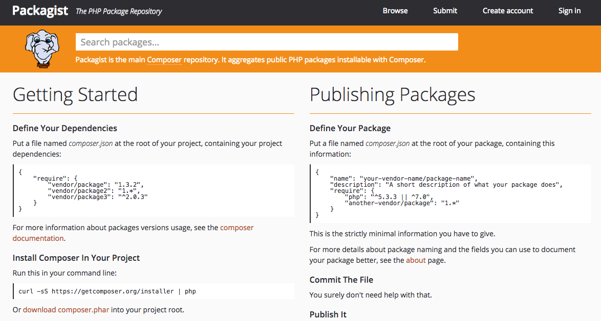
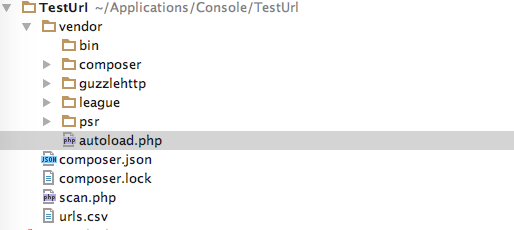
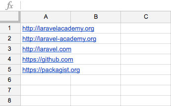

什么是组件
==========
组件是一组打包的代码，是一系列相关的类、接口和Trait，用于帮助我们解决PHP应用中某个具体问题。例如，你的PHP应用需要收发HTTP请求，可以使用现成的组件如guzzle/guzzle实现。我们使用组件不是为了重新实现已经实现的功能，而是把更多时间花在实现项目的长远目标上。

优秀的PHP组件具备以下特性：

- 作用单一：专注于解决一个问题，而且使用简单的接口封装功能
- 小型：小巧玲珑，只包含解决某个问题所需的最少代码
- 合作：PHP组件之间可以良好合作，组合在一起实现大型项目
- 测试良好：本身提供测试，而且有充足的测试覆盖度
- 文档完善：应该提供完善的文档，能让开发者轻易安装、理解和使用

组件 vs 框架
============
我们选择框架时，要为这个框架的工具投入很多，框架通常会提供大量工具，但却没有提供我们所需的某个工具时，痛苦就转嫁到我们头上，我们要寻找并集成自定义的PHP库。把第三方代码集成到框架中是件难事，因为第三方代码和框架可能没有使用相同的接口。

选择框架时，我们看中的是框架的未来，但是谁又能保证某个框架始终是完成某项工作最好的工具呢？存在多年的大型项目必须有好的表现，而且要时刻做好调整，如果选错了PHP框架，可能无法做到这一点。较旧的PHP框架可能由于缺乏社区支持而变慢或过时，这些旧框架通常使用过程式代码编写，而没有使用新式的面向对象代码以及PHP的一些新特性，总之，决定是否使用PHP框架时，要考虑的事情很多。

庆幸的是， ``Laravel`` 在这些担忧方面表现良好，因此才能在众多 PHP 框架中脱颖而出，从某种意义上来说， ``Laravel`` 也是个基于组件开发的框架（核心组件是自身的 ``Illuminate`` 库，功能实现上则大量依赖第三方组件），相比 ``Symfony`` 而言，上手又比较简单，所以兼具了扩展性和易用性。但是， ``Laravel`` 也存在一些不足，比如 ``Laravel`` 自身的组件不能轻易解耦，用于 ``Laravel`` 框架之外（但是相信这种状况会有好转，比如其数据库和队列组件就可以解耦出去）。综合来看， ``Laravel`` 仍是一个出色的框架，能帮组我们快速创建强大的应用。

那我们应该使用组件还是框架呢？答案是，使用正确的工具做正确的事，如果能通过一些 PHP 组件快速实现小型项目，那就使用组件，如果有多个团队成员开发大型项目，而且能从框架提供的约定准则和结构中受益，那就使用框架（如果是在纠结使用什么框架，那么选择 ``Laravel`` 吧，它不会让你失望），使用框架能够引导并加速项目的开发。

PS：这句话也适用于语言之争，用正确的语言做正确的事，没事少BB，这是学院君对语言之争的态度和立场。

使用组件
========
Packagist
---------
我们在 ``Packagist`` 中查找 PHP 组件，这个网站用于收集 PHP 组件，最好的 PHP 组件在 ``Packagist`` 中都能找到。

比如我们想使用一个 ``http`` 组件用于收发 ``HTTP`` 消息，在搜索框中搜索 ``http`` ，得到的第一个结果就是 ``Guzzle`` ，就用它吧。

Composer
--------
``Packagist`` 是查找 PHP 组件的社区， ``Composer`` 则是安装 PHP 组件的工具。 ``Composer`` 是 PHP 的依赖管理器，运行在命令行中，你告诉 ``Composer`` 需要哪些组件， ``Composer`` 会下载并把这些组件自动加载到你的项目中，就这么简单。

``Composer`` 和 ``Packagist`` 紧密合作，如果你告诉 ``Composer`` 想要使用 ``guzzlehttp/guzzle`` 组件， ``Composer`` 会从 ``Packagist`` 中获取 ``guzzlehttp/guzzle`` 组件，找到这个组件的仓库地址，确定要使用哪个版本，还能找出这个组件的依赖，然后把 ``guzzlehttp/guzzle`` 组件及其依赖下载到你的项目中。

此外， ``Composer`` 会为项目中的所有 PHP 组件自动生成符合 ``PSR`` 标准的自动加载器，有效地抽象了依赖管理和自动加载，所以，对 PHP 社区来说， ``Composer`` 是最重要的附加工具，没有之一，想想之前我们要使用诸如 ``include`` 、 ``require`` 、 ``spl_autoload_register`` 来手动实现自动加载的痛苦日子，这一点也不为过。

关于Composer的安装和使用，这里不赘述，请参考 `Composer中文网 <http://www.phpcomposer.com/>`_ 。

示例项目
========
下面我们通过一个示例项目来演示如何使用 ``Composer`` 和组件来开发一个 ``PHP`` 应用，这个应用的作用是扫描一个 ``CSV`` 文件中的 ``URL`` ，找出死链，该应用会向每个 ``URL`` 发 ``HTTP`` 请求，如果返回的 ``HTTP`` 状态码大于等于 400 ，就把这个死链发给标准输出。这是一个命令行应用，开发好之后，我们会执行这个脚本，传入 ``csv`` 文件的路径，在标准输出中显示死链列表。

安装组件
--------
开始之前，先看看哪些任务可以使用现有的 PHP 组件解决：我们需要一个可以迭代处理 ``csv`` 文件数据的组件，此外还要向 ``csv`` 文件中的每个 ``URL`` 发送 ``HTTP`` 请求，因此还需要一个可以发送 ``HTTP`` 请求并检查 ``HTTP`` 响应的组件。

浏览 ``Packagist`` 后，我们找到 ``guzzlehttp/guzzle`` 和 ``league/csv`` 两个组件，前者用于处理 ``HTTP`` 消息，后者用于处理 ``CSV`` 数据。下面我们在项目最顶层运行如下命令：

.. code-block:: shell

    composer require guzzlehttp/guzzle
    composer require league/csv

``Composer`` 会将依赖安装到根目录的 ``vendor`` 目录下，安装完成后，会在根目录下生成 ``composer.json`` 和 ``composer.lock`` 文件：

``composer.lock`` 文件中会列出项目使用的所有 PHP 组件，以及组件的具体版本号，这其实是锁定了项目，让项目只能使用具体版本的 PHP 组件。这样的好处是， ``composer`` 会下载这个文件中列出的具体版本，而不管 ``Packagist`` 中可用的最新版本是多少，你应该把 ``composer.lock`` 文件纳入版本控制，这样让团队成员使用的 PHP 版本和你一样，如果本地开发和服务器使用的 PHP 组件版本相同，可以尽量降低由组件版本不同导致的 bug 。

如果确实要下载最新版本的组件并更新 ``composer.lock`` ，可以使用 ``composer update`` 命令。

自动加载
--------
接下来我们来编写应用代码，在根目录下创建一个 ``scan.php`` 文件，然后在该文件顶部使用 ``require`` 导入 ``Composer`` 创建的自动加载器：

.. code-block:: php

    <?php
    require 'vendor/autoload.php';

``Composer`` 创建的自动加载器其实就是个名为 ``autoload.php`` 的文件，保存在 ``vendor`` 目录中， ``Composer`` 下载各个 ``PHP`` 组件时，会检查每个组件的 ``composer.json`` 文件，确定如何加载该组件，得到这个信息后， ``Composer`` 会在本地为该组件创建一个符合 ``PSR`` 标准的自动加载器。这样我们就可以实例化项目中的任何 ``PHP`` 组件，这些组件按需自动加载。

编写代码
--------
下面我们正式使用 ``Guzzle`` 和 ``CSV`` 组件编写 ``scan.php`` 代码：

.. code-block:: php

    <?php
    //使用composer自动加载器
    require 'vendor/autoload.php';

    //实例Guzzle Http客户端
    $client = new GuzzleHttp\Client();

    //打开并迭代处理CSV
    $csv = League\Csv\Reader::createFromPath($argv[1]);
    foreach ($csv as $csvRow) {
        try {
            //发送HTTP GET请求
            $httpResponse = $client->get($csvRow[0]);

            //检查HTTP响应的状态码
            if($httpResponse->getStatusCode() >= 400) {
                throw new Exception();
            }
        } catch (Exception $e) {
                //把死链发给标准输出
                echo $csvRow[0] . PHP_EOL;
        }
    }

下面我们在 ``urls.csv`` 中添加一些 ``URL`` ，一行一个，而且至少有一个是死链：

然后打开终端，执行 ``scan.php`` 脚本：

.. code-block:: shell

    php scan.php urls.csv

我们传入了两个参数，第一个是脚本文件 ``scan.php`` 的路径，另一个是 ``CSV`` 文件的路径。
