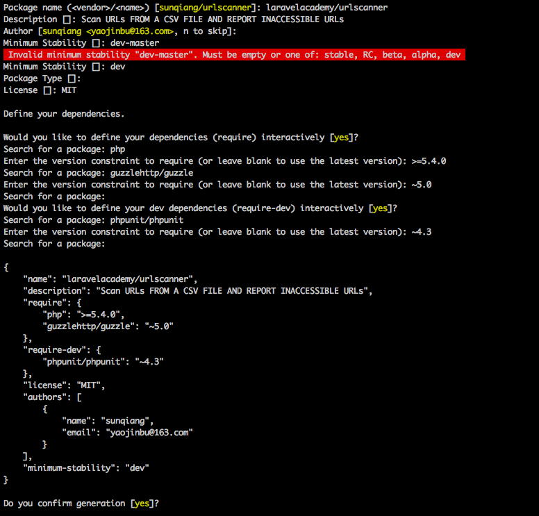
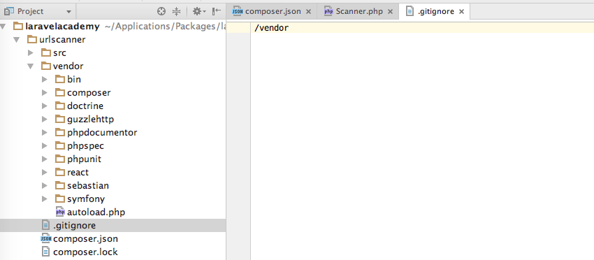
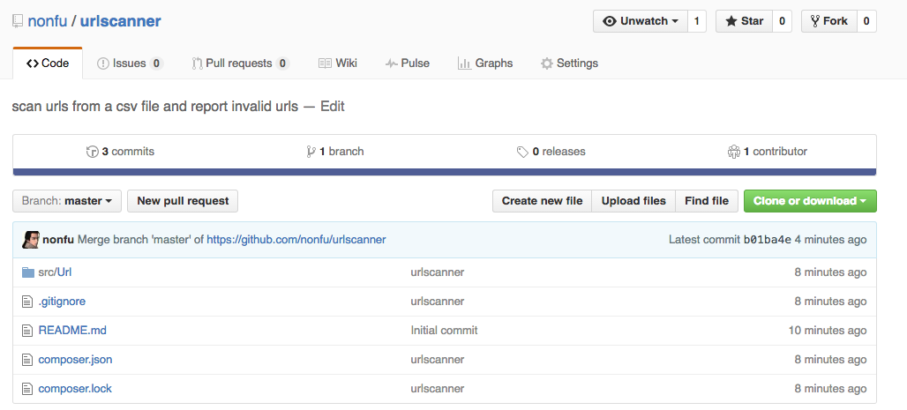
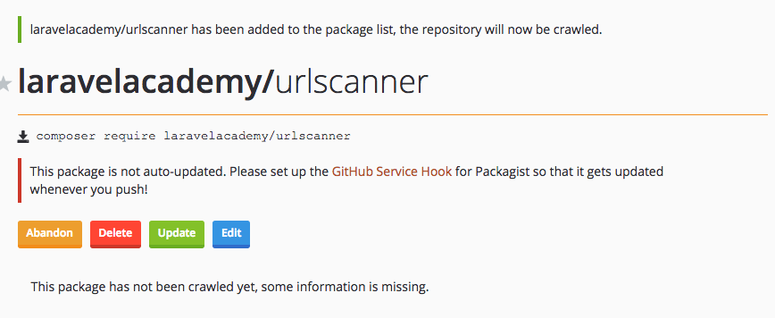
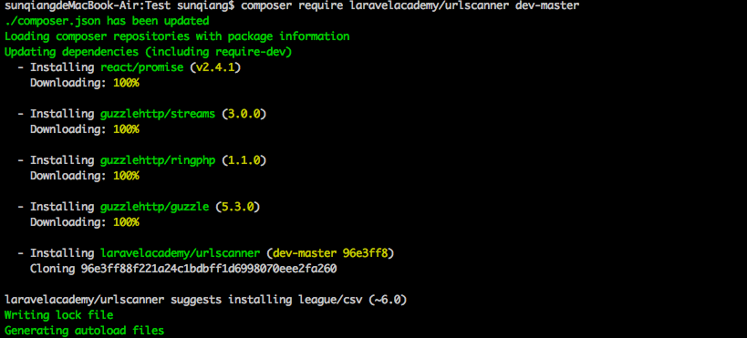

私有组件
========
大多数时候我们使用的都是公开可用的开源组件，但有时候如果公司使用内部开发的 PHP 组件，而基于许可证和安全方面的问题不能将其开源，就需要使用私有组件。对 ``Composer`` 而言，这是小菜一碟。

``Composer`` 可用管理放在需要认证的仓库中的私有 PHP 组件，执行 ``composer install`` 或 ``composer update`` 命令时，如果组件的仓库需要认证凭据， ``Composer`` 会提醒你需要输入认证信息，此外， ``Composer`` 还会询问是否把仓库的认证凭据保存在本地的 ``auth.json`` 文件（和 ``composer.json`` 放在同一级）。下面是 ``auth.json`` 的内容示例：

.. code-block:: json

    {
        “http-basic”: {
            “laravelacademy.org”: {
                “username”: “your-username”,
                “password”: “your-password"
            }
        }
    }

``auth.json`` 最好不要放到版本控制中，我们要让项目的开发者自己创建 ``auth.json`` 文件，保存他们自己的认证凭据。

如果不想傻傻的等待 ``Composer`` 向你询问认证凭据，可以使用下述命令手动告诉 ``Composer`` 远程设备的认证凭据：

.. code-block:: shell

    composer config http-basic.laravelacademy.org your-username your-password

在这个示例中， ``http-basic`` 告诉 ``Composer`` 我们要为指定的域名添加认证信息。 ``laravelacademy.org`` 是主机名，用于识别存储私有组件仓库的设备，最后两个参数是用户名和密码。默认情况下，这个命令会在当前项目中的 ``auth.json`` 文件里保存凭据。

你还可以使用 ``--global`` 标记在系统全局中保存认证凭据。使用这个标记设定认证凭据后， ``Composer`` 会在本地设备中的所有项目里使用这个凭据。

.. code-block:: shell

    composer config --global http-basic.laravelacademy.org your-username your-password

全局凭据保存在 ``~/.composer/auth.json`` 中，如果你使用的是 ``Windows`` 系统，相应全局凭据保存在 ``APPDATA%/Composer`` 文件夹中。

创建组件
========
现在你应该知道怎么查找和使用 PHP 组件了，下面我们来讨论如何创建 PHP 组件。创建 PHP 组件是把工作成果分享给 PHP 社区成员的好方式，PHP 社区乐于分享和帮助他人，如果你在应用中使用了开源组件，那么投桃报李，创建有创意的新开源组件是回报社区最好的方式。

.. epigraph::

   注：别重新编写已经存在的组件，如果是改进现有组件，可以在拉取请求中把改进发送给原本的组件，否则，PHP生态系统将充斥重复的组件。

命名空间
--------
在设置命名空间之前，先要确定厂商名称和包名，即形如 ``laravel/framework`` 这样，要确保其全局唯一性，在 ``Packagist`` 中不存在。

每个组件都有自己的命名空间，说到这里，人们常常误以为组件的命名空间必须与组件的厂商名和包名一致，其实不然，组件使用的命名空间与组件的厂商名和包名无关，厂商名和包名只是为了让 ``Packagist`` 和 ``Composer`` 识别组件，而组件的命名空间是为了在 PHP 代码中使用组件。

文件系统结构
------------
PHP 组件的文件系统结构基本上是确定的：

- src：这个目录用于存放组件的源代码
- tests：存放组件的测试代码
- composer.json：Composer配置文件，用于描述组件，声明组件依赖以及自动加载配置等
- README.md：这个Markdown文件提供关于组件的相关信息、使用文档说明、软件许可证等
- CONTRIBUTING.md：这个Markdown文件告知别人如何为这个组件做贡献
- LICENSE：纯文本文件，声明组件的软件许可证
- CHANGELOG.md：Markdown文件，列出组件在每个版本中引入的改动

composer.json
-------------
PHP 组件中必须包含 ``composer.json`` 文件，而且这个文件的内容必须是有效的 ``JSON`` ， ``Composer`` 会使用这个文件中的信息查找、安装和自动加载 ``PHP`` 组件。 ``composer.json`` 文件还包含组件在 ``Packagist`` 目录中的信息。

我们新建一个组件目录（ ``~/Packages/urlscanner`` ），然后在 ``urlscanner`` 目录下通过如下命令生成 ``composer.json`` 文件：

.. code-block:: shell

    composer init

然后在终端会让我们按照提示向导一步步填写 ``composer.json`` 内容：

最后回车，会生成相应的 ``composer.json`` 文件，我们对该文件作如下修改：

.. code-block:: json

    {
        "name": "laravelacademy/urlscanner",
        "description": "Scan URLs FROM A CSV FILE AND REPORT INACCESSIBLE URLs",
        "keywords": ["url", "scanner", "csv"],
        "homepage": "http://laravelacademy.org",
        "license": "MIT",
        "authors": [
            {
                "name": "sunqiang",
                "email": "yaojinbu@163.com"
            }
        ],
        "support": {
            "email": "yaojinbu@163.com"
        },
        "minimum-stability": "dev",
        "require": {
            "php": ">=5.4.0",
            "guzzlehttp/guzzle": "~5.0"
        },
        "require-dev": {
            "phpunit/phpunit": "~4.3"
        },
        "suggest": {
            "league/csv": "~6.0"
        },
        "autoload": {
            "psr-4": {
                "LaravelAcademy\\UrlScanner\\": "src/"
            }
        }
    }

我们来仔细研究一下这个文件，看看每个部分究竟是什么意思：

- name：组件的厂商名和包名，也是Packagist中的组件名
- description：简要说明组件
- keywords：描述属性的关键字
- homepage：组件网站URL
- license：PHP组件采用的软件许可证（更多软件许可证参考：http://choosealicense.com/）
- authors：作者信息数组
- support：组件用户获取技术支持的方式
- require：组件自身依赖的组件
- require-dev：开发这个组件所需的依赖
- suggest：建议安装的组件
- autoload：告诉Composer自动加载器如何自动加载这个组件

READEME.md
----------
通常这个是用户最先阅读的文件，对托管在 ``Github`` 和 ``Bitbucket`` 中的组件来说，更是如此。标准的 ``READEME.md`` 文件至少提供以下信息：

- 组件的名称和描述
- 安装说明
- 使用说明
- 测试说明
- 贡献方式
- 支持资源
- 作者信息
- 软件许可证

实现组件
--------
开始之前我们使用如下命令安装依赖：

.. code-block:: shell

    composer install

该命令会把依赖组件安装到vendor目录并生成自动加载器。

现在我们要来实现组件的具体功能了。这一步我们要编写组成 PHP 组件的类、接口和 ``Trait`` ，编写什么类以及编写多少类完全取决于 PHP 组件的作用。不过组件中的所有类、接口和 ``Trait`` 都要放到 ``src`` 目录下。

对这个组件来说我只需要创建一个类 ``Scanner`` ，位于子命名空间 ``Url`` 中，这个子命名空间位于 ``composer.json`` 文件中设定的 ``LaravelAcademy/UrlScanner`` 命名空间下， ``Scanner`` 类保存在 ``src/Url/Scanner.php`` 文件(注意这里的映射关系)。 ``Scanner`` 类实现的逻辑和上一节的 ``URL`` 扫描器示例应用相同，只不过现在我们要把扫描 ``URL`` 的功能封装在一个 PHP 类中：

.. code-block:: php

    <?php
    namespace LaravelAcademy\UrlScanner\Url;

    use GuzzleHttp\Client;

    class Scanner
    {
        protected $urls;

        protected $httpClient;

        public function __construct(array $urls)
        {
            $this->urls = $urls;
            $this->httpClient = new Client();
        }

        /**
         * 获取访问指定URL的HTTP状态码
         *
         * @param $url
         * @return int
         */
        public function getStatusCodeForUrl($url)
        {
            $httpResponse = $this->httpClient->get($url);
            return $httpResponse->getStatusCode();
        }

        /**
         * 获取死链
         *
         * @return array
         */
        public function getInvalidUrls()
        {
            $invalidUrls = [];
            foreach ($this->urls as $url) {
                try {
                    $statusCode = $this->getStatusCodeForUrl($url);
                } catch (\Exception $e) {
                    $statusCode = 500;
                }

                if ($statusCode >= 400) {
                    array_push($invalidUrls, ['url' => $url, 'status' => $statusCode]);
                }
            }

            return $invalidUrls;
        }

    }

我们没有解析并迭代处理一个 ``CSV`` 文件，而是把一个 ``URL`` 数组传递给 ``Scanner`` 类的构造函数，因为我们要尽量让这个扫描 ``URL`` 的类通用。如果直接处理 ``CSV`` 文件就限制了这个组件的用途。我们把获取 ``URL`` 的来源开放给用户，让他们自己从文件、数组亦或是 ``CSV`` 文件中获取。所以回到上面的 ``composer.json`` ，我们在 ``suggest`` 中声明了 ``league/csv`` 组件，只是建议安装，并不是必须安装。

提交到Packagist
===============
我们先将代码提交到 ``GitHub`` （注意将 ``vendor`` 目录添加到 ``.gitignore`` ）仓库（我的是 ``nonfu/urlscanner`` ）：

涉及到的git命令如下：

.. code-block:: shell

    git init
    git remote add origin https://github.com/nonfu/urlscanner.git
    git add .
    git commit -m “urlscanner"
    git pull origin master
    git push origin master

这样就将本地组件提交到 GitHub 仓库：

然后在 ``Packagist`` 中通过 ``GitHub`` 账户登录，通过 https://packagist.org/packages/submit 提交组件，在输入框中输入刚刚提交的 ``GitHub`` 仓库地址：

.. image:: ./images/submit-to-packagist.png

check 成功后点击 submit 即可将组件提交到 ``Packagist`` ：

其中红色的警告的意思是需要我们通过 ``GitHub Service Hook`` 去 ``GitHub`` 中创建一个钩子，以后每次更新组件的 ``GitHub`` 仓库时通知 ``Packagist`` 。

使用组件
========
至此，我们已经成功将自己的组件提交到 ``Packagist`` ，现在任何人都可以使用 ``Composer`` 安装这个 ``URL`` 扫描器组件，然后在自己的 PHP 应用中使用。在终端执行如下命令安装这个组件：

.. code-block:: shell

    composer require laravelacademy/urlsanner dev-master

然后在我们的代码中使用：

.. code-block:: php

    <?php
    require “vendor/autoload.php”;

    $urls = [
        “http://laravelacademy.org”,
        “http://laravel-academy.org”,
        “https://packagist.org"
    ];

    $scanner =  new \LaravelAcademy\UrlScanner\Url\Scanner($urls);
    print_r($scanner->getInvalidUrls());

