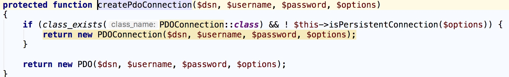
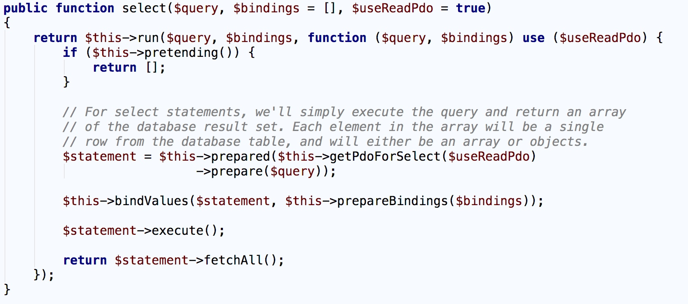
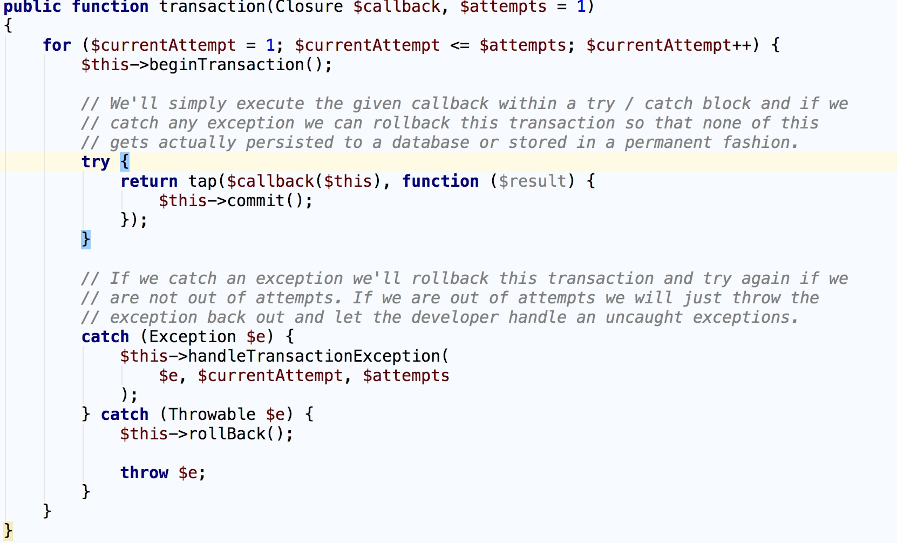

PHP 支持多种数据库，如 ``MySQL`` 、 ``PostgreSQL`` 、 ``SQLite`` 和 ``Oracle`` 等，并且这些数据库都提供了用于 PHP 和相应数据库之间通信的扩展，如 ``mysqli`` 、 ``sqlite3`` 等。这样造成的一个问题是如果项目中使用了多种数据库，需要安装并使用多种 ``PHP`` 数据库扩展和接口，增加了学习和维护的成本。为此，从 PHP 5.1 开始引入了一个新的扩展 —— ``PDO`` 。

PDO 扩展
========
PDO（PHP Data Objects）是一系列 PHP 类，抽象了不同数据库的具体实现，只通过同一套接口就可以与不同的数据库通信，极大地降低了学习成本，同时提高开发效率。

.. epigraph::

   注：尽管 ``PDO`` 为不同数据库提供了统一接口，但是仍然必须自己编写 ``SQL`` 语句，这是 ``PDO`` 的劣势所在。这样存在的一个隐患是不同的数据库 ``SQL`` 语句语法可能略有出入，所以在切换数据系统的时候需要注意这一点，建议尽可能编写符合 ``ANSI/ISO`` 标准的 ``SQL`` 语句。

数据库连接和DSN
---------------
``PDO`` 的构造函数中有一个字符串参数，用于指定 ``DSN`` （Data Source Name）来提供数据库连接的详细信息：

.. code-block:: php

    <?php
    try {
        $pdo = new PDO(
            'mysql:host=127.0.0.1;dbname=test;port=3306;charset=utf8',
            'username',
            'password'
        );
    } catch (PDOException $ex) {
        echo 'database connection failed';
        exit();
    }

可见 ``DSN`` 主要包含信息包括：数据库主机名/IP地址、端口号、数据库名称、字符集。 ``PDO`` 构造函数的第二个参数是数据库用户名，第三个参数是该用户名对应密码。

Laravel 框架的数据库组件就是基于 ``PDO`` 实现的，底层使用工厂模式为不同的数据库创建相应的 ``PDO`` 实例， Laravel 默认使用 ``MySQL`` 数据库，对应的 ``PDO`` 实例通过 ``MySqlConnector`` 类的 ``connect()`` 方法创建，并且最终落地到 ``createPdoConnection`` 方法实现：

保证数据库凭证的安全
---------------------
为了保证数据库凭证（用户名/密码）的安全，不能将其硬编码在代码中，尤其是可以公开访问的 ``PHP`` 文件。我们应该将其存放在一个位于文档根目录之外的配置文件中，然后在需要使用凭证的地方引入，正如 Laravel 所实现的那样（用户名密码信息位于 ``.env`` ，隔离在版本控制之外）:

.. code-block:: ini

    DB_CONNECTION=mysql
    DB_HOST=127.0.0.1
    DB_PORT=3306
    DB_DATABASE=homestead
    DB_USERNAME=homestead
    DB_PASSWORD=secret

然后在 ``config/database.php`` 中引入：

.. code-block:: php

    <?php
    'mysql' => [
        'driver' => 'mysql',
        'host' => env('DB_HOST', '127.0.0.1'),
        'port' => env('DB_PORT', '3306'),
        'database' => env('DB_DATABASE', 'forge'),
        'username' => env('DB_USERNAME', 'forge'),
        'password' => env('DB_PASSWORD', ''),
        'unix_socket' => env('DB_SOCKET', ''),
        'charset' => 'utf8mb4',
        'collation' => 'utf8mb4_unicode_ci',
        'prefix' => '',
        'strict' => true,
        'engine' => null,
    ],

预处理语句
----------
现在我们建立了一个连接到数据库的 ``PDO`` 实例，通过这个实例就可以使用 ``SQL`` 语句从数据库读取数据，或者将数据写入数据库。

开发 ``PHP`` 应用时，我们经常需要从 ``HTTP`` 请求中获取动态值来定制 ``SQL`` 语句，如使用 ``/user?name=nonfu`` 来显示具体账户的资料信息，对应的 ``SQL`` 语句可能是：

.. code-block:: sql

    SELECT * FROM user WHERE name = "nonfu";

初级 ``PHP`` 开发者可能会像这样构建这个 ``SQL`` 语句：

.. code-block:: php

    <?php
    $sql = sprintf(
        'SELECT * FROM user WHERE name = "%s"',
        filter_input(INPUT_GET, 'name')
    );

这样做就会有 ``SQL`` 注入隐患。所以，在基于用户请求参数构建 ``SQL`` 语句时，一定要过滤用户输入参数值。幸运的是，在 ``PDO`` 中，我们可以通过预处理语句和参数绑定来实现用户输入过滤，从而避免 ``SQL`` 注入。

预处理语句是一个 ``PDOStatement`` 实例，我们可以通过 ``prepare()`` 方法来返回该实例：

.. code-block:: php

    <?php
    $sql = 'SELECT * FROM user WHERE name = :name';
    $statement = $pdo->prepare($sql);
    $name = filter_input(INPUT_GET, 'name');
    $statement->bindValue(':name', $name, PDO::PARAM_STR);

预处理语句会自动过滤 ``$name`` 的值，防止数据库遭受 ``SQL`` 注入攻击。

Laravel 框架中相应的底层实现位于 ``MySqlConnetion`` 的父类 ``Connection`` 的 ``select`` 方法中：

查询结果
--------
有了预处理语句之后，就可以在数据库中执行 ``SQL`` 查询了，调用预处理语句的 ``execute()`` 方法后就会使用绑定的所有数据执行 ``SQL`` 语句，如果执行的是 ``INSERT`` 、 ``UPDATE`` 或 ``DELETE`` 语句，执行完 ``execute()`` 方法工作结束了，如果执行的是 ``SELECT`` 语句，我们还期望数据库能返回匹配的结果。我们可以使用以下方法获取查询结果：

- fetch()
- fetchAll()
- fetchColumn()
- fetchObject()

``fetch()`` 方法用于获取结果集的下一行，我们可以使用这个方法迭代大型结果集：

.. code-block:: php

    <?php
    $sql = 'SELECT * FROM user WHERE name = :name';
    $statement = $pdo->prepare($sql);
    $name = filter_input(INPUT_GET, 'name');
    $statement->bindValue(':name', $name, PDO::PARAM_STR);
    $statement->execute();

    while (($result = $statement->fetch(PDO::FETCH_ASSOC)) !== FALSE) {
        echo $result['name'];
    }

我们在调用 ``fetch()`` 方法时，传入了 ``PDO::FETCH_ASSOC`` 参数，该参数决定如何返回查询结果，该参数支持以下常量：

- PDO::FETCH_ASSOC：返回关联数组，数组的键是数据表的列名
- PDO::FETCH_NUM：返回键为数字的数组
- PDO::FETCH_BOTH：顾名思义，返回一个既有键为列名又有键为数字的数组
- PDO::FETCH_OBJ：返回一个对象，对象的属性是数据表的列名

如果处理的小型结果集合，可以使用 ``fetchAll()`` 方法获取所有查询结果， Laravel 框架底层的 ``select()`` 方法中就使用了该方法来获取返回结果集，所以在获取大量结果时不能使用该方法：

.. code-block:: php

    <?php
    $sql = 'SELECT * FROM user WHERE name = :name';
    $statement = $pdo->prepare($sql);
    $name = filter_input(INPUT_GET, 'name');
    $statement->bindValue(':name', $name, PDO::PARAM_STR);
    $statement->execute();

    $results = $statement->fetchAll(PDO::FETCH_ASSOC);
    if ($results) {
        foreach ($results as $result) {
            echo $result['name'];
        }
    }

如果只关心查询结果中的一列，可以使用 ``fetchColumn()`` 方法：

.. code-block:: php

    <?php
    $sql = 'SELECT id, name FROM user WHERE name = :name';
    $statement = $pdo->prepare($sql);
    $name = filter_input(INPUT_GET, 'name');
    $statement->bindValue(':name', $name, PDO::PARAM_STR);
    $statement->execute();

    while (($name = $statement->fetchColumn(1)) !== FALSE) {
        echo $name;
    }

我们还可以使用 ``fetchObject()`` 方法获取查询结果中的行，这个方法把行当做对象：

.. code-block:: php

    <?php
    $sql = 'SELECT id, name FROM user WHERE name = :name';
    $statement = $pdo->prepare($sql);
    $name = filter_input(INPUT_GET, 'name');
    $statement->bindValue(':name', $name, PDO::PARAM_STR);
    $statement->execute();

    while (($result = $statement->fetchObject()) !== FALSE) {
        echo $result->name;
    }

事务
----
事务是把一系列数据库操作当作一个逻辑单元执行，也就是说，事务中的一系列 ``SQL`` 语句要么都执行成功，要么都失败，事务的原子性能保证数据的一致性、安全性和持久性。

``PDO`` 扩展中使用事务很容易，只需把想要执行的 ``SQL`` 语句放在 ``PDO`` 实例的 ``beginTransaction()`` 方法和 ``commit()`` 方法之间即可。

在 Laravel 框架中对事务操作进行了封装，我们可以这样调用：

.. code-block:: php

    <?php
    DB::transaction(function () {
        DB::table('users')->update(['votes' => 1]);

        DB::table('posts')->delete();
    }, 5);

相应的底层位于 ``ManagesTransactions trait`` 中：

还可以这样调用：

.. code-block:: php

    <?php
    DB::beginTransaction();
    try {
        DB::table('users')->update(['votes' => 1]);
        DB::table('posts')->delete();
        DB::commit();
    } catch (PDOException $ex) {
        var_dump($ex);
        DB::rollback();
    }

相应的底层实现同样位于 ``ManagesTransactions`` ，可自行查看。
