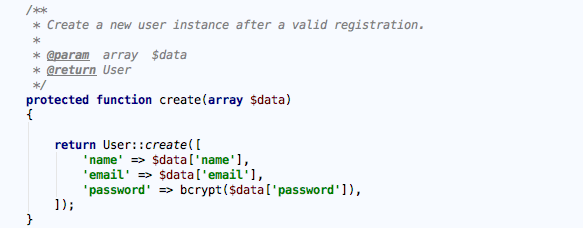
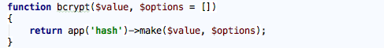
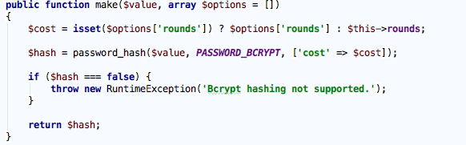
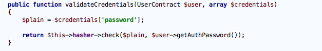
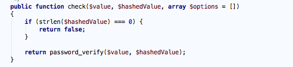
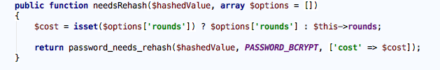

随着在线攻击的增多，密码安全越来越重要。作为开发者我们要担负起安全管理、计算哈希和存储用户密码的责任，不管应用是简单的游戏还是绝密商业文件的仓库，都要做到这一点。 PHP 内置了一些工具，让保护密码变得更加容易，本节我们就来讨论如何根据现代的安全措施来使用这些工具。

密码保护三原则
==============
绝对不能知道用户的密码
----------------------
我们绝对不能知道用户的密码，也不能有获取用户密码的方式，如果应用的数据库被黑，你肯定不希望数据库中有纯文本或能解密的密码。任何时候，知道的越少越安全。

绝对不要约束用户的密码
----------------------
如果要求密码符合特定的模式，其实是为不怀好意的人提供了攻击应用的途径，如果必须约束密码，我建议只限制最小长度，把常用的密码或基于字典创建的密码加入黑名单也是好主意。

绝对不能通过电子邮件发送用户密码
--------------------------------
如果你通过电子邮件给用户发送密码，用户会知道三件事：你知道他的密码，你使用纯文本或能解密的方式存储了他的密码，你没有对通过互联网发送纯文本的密码感到不安。

我们应该在电子邮件中发送用于设置或修改密码的 ``URL`` ， Web 应用通常会生成一个唯一的令牌，这个令牌只在设定或修改密码时使用一次（比如修改密码），通常我们把这个令牌作为设置或修改密码 URL 的一个参数，当用户访问这个 URL 时，应用会验证令牌是否有效，如果有效则继续操作，操作完成后，令牌失效，不能重复使用。

密码存储算法
============
关于密码存储的最佳实践是计算密码的哈希值，而不是加密用户的密码。加密和哈希不是一回事，加密事双向算法，加密的数据可以解密，而哈希是单向算法，哈希后的数据不能再还原成原始值，而且相同的数据得到的哈希值始终相同。

在数据库中存储用户的密码，要先计算密码的哈希值，然后在数据库中存储密码的哈希值，如果黑客攻入数据库，只能看到无意义的密码哈希值，需要花费大量的时间和 NSA 资源才能破解。

哈希算法有很多种（如 ``md5`` 、 ``SHA1`` 、 ``bcrypt`` 和 ``scrypt`` ），有些算法速度很快，用于验证数据完整性；有些算法的速度则很慢，旨在提高安全性。生成密码和存储密码时要使用速度慢、安全性高的算法。

目前，最安全的算法当属 ``bcrypt`` ，与 ``md5`` 和 ``SHA1`` 不同， ``bcrypt`` 故意设计得很慢， ``bcrypt`` 会自动加盐（ ``salt`` ），防止潜在的彩虹表攻击， ``bcrypt`` 算法会花费大量时间反复处理数据，生成特别安全的哈希值。在这个过程中，处理数据的次数叫工作因子，工作因子的值越高，破解密码所需的时间越长，安全性越好。 ``bcrypt`` 算法永不过时，如果计算机运算速度变快了，我们只需提高工作因子的值。

密码哈希API
============
通过前面的介绍，我们知道在处理用户的密码时要考虑很多东西，好在 PHP 5.5.0 原生的哈希 API （ http://php.net/manual/zh/book.password.php ）提供了很多易于使用的函数，大大简化了计算密码哈希值和验证密码的操作，而且，这个密码哈希 API 默认使用 ``bcrpt`` 算法。

开发 Web 应用时，有两个地方会用到密码哈希 API ：注册用户和用户登录，下面我们以 Laravel 提供的用户注册和登录为例，看看 PHP 密码哈希 API 时如何简化这两个操作的。

.. epigraph::

   注：Laraval框架内置的用户注册和登录功能正是使用了PHP哈希API实现密码的存储和验证。

注册用户
--------
用户注册在 ``AuthController`` 中完成，新用户的创建在该控制器的 ``create`` 方法中实现：

可以看到这里使用了 Laravel 提供的辅助函数 ``bcrypt`` 对用户提交的密码进行哈希并保存到数据库。 ``bcrypt`` 函数定义如下：

这里我们可以看出实际上是调用了别名为 ``hash`` 的服务提供者实例上的 ``make`` 方法实现哈希密码，进入 ``HashServiceProvider`` ，在 ``register`` 方法中我们可以看到 ``hash`` 对应的类为 ``BcryptHasher`` ，在该类中我们找到了 ``make`` 方法：

这里的核心是调用了 PHP 提供的 ``password_hash`` 函数，该函数接收三个参数，第一个是用户输入的密码值，第二个参数是使用的哈希算法（更多算法查看： http://php.net/manual/zh/password.constants.php ），第三个参数可选，包括 ``salt`` 和 ``cost`` 两个选项，分别表示干扰字符串（加盐）和前面提到的工作因子，工作因子可以随着硬件性能的提升而提升，不传的话使用随机加盐和默认工作因子（计算哈希值一般需要 0.1～0.5s ）。如果计算失败，抛出异常。

用户登录
--------
在 Larval 中以在 ``auth.php`` 中使用 ``session`` 作为 ``guards`` 、 ``eloquent`` 作为 ``providers`` 实现用户登录认证为例（实际上默认设置就是这样），登录验证最终会走到 ``EloquentUserProvider`` 的 ``validateCredentials`` 方法：

``$this->hasher`` 对应的实现也是 ``BcryptHasher`` 类，我们来查看它的 ``check`` 方法：

其中传入的第一个参数是用户输入的密码，第二个参数是用户注册时保存的密码哈希值，如果哈希值为空直接返回 ``false`` ，否则调用 php 提供的 ``password_verify`` 函数，该函数用于验证密码（纯文本）和哈希值是否匹配，匹配返回 ``true`` ，否则返回 ``false`` 。

重新计算哈希值
--------------
通过上述步骤用户已经可以实现登录认证了，但是登录前我们还需要检查现有的密码哈希值是否已经过期，如果过期，需要重新计算密码哈希值。

为什么要重新计算呢？加入我们的应用创建于两年前，那时候使用的工作因子时 10 ，现在使用的是 20 ，因为计算机的速度更快了，黑客也更聪明了。可以有些用户的密码哈希值仍然是工作因子为 10 时生成的，这时，登录认证通过后，要使用 ``password_needs_refresh`` 函数检查用户记录中现有的哈希值是否需要更新，这个函数可以确保指定的密码哈希值是使用最新的哈希算法创建的。如果确实需要重新计算生成密码的哈希值，要使用 ``make`` 方法生成新的哈希值并更新数据库中的原密码。

Laraval 中目前并没有使用这一功能，但是在 ``BcryptHasher`` 类中已经提供了对应的函数：

