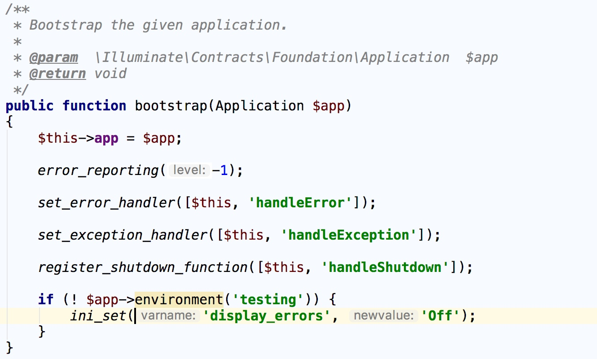
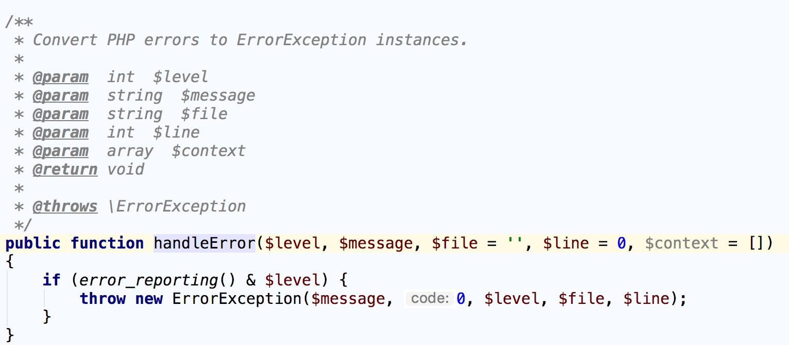
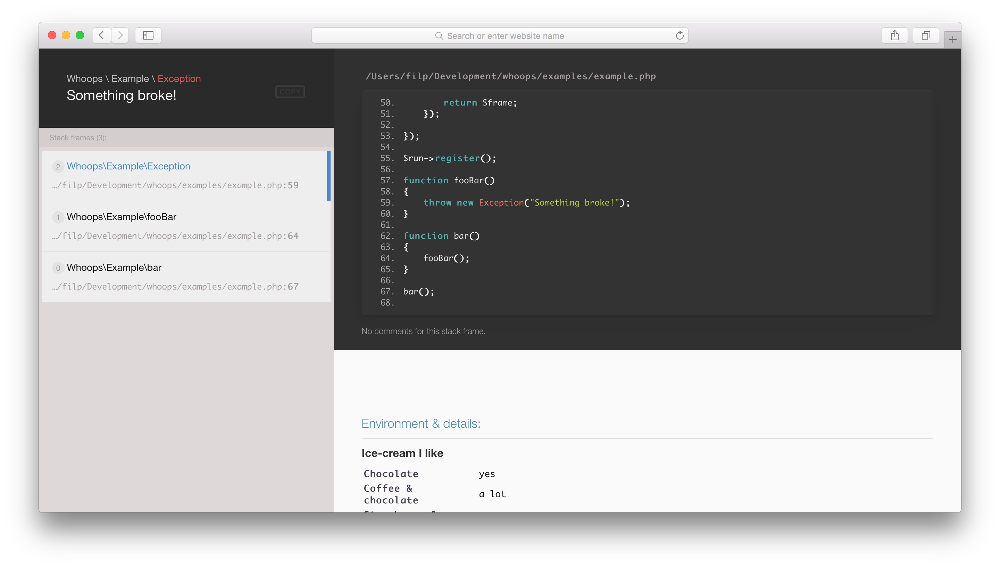
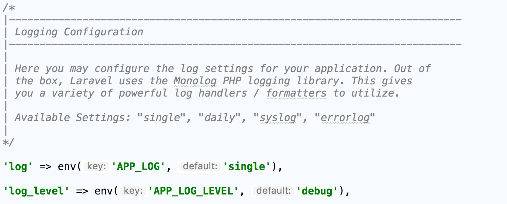

错误和异常是很强大的工具，能帮助我们预期意料之外的事，使用优雅的方式捕获问题。不过，错误和异常很相似，容易让人混淆，二者都表示出问题了，都会提供错误信息，而且都有错误类型。然而，错误出现的时间比异常早，错误会导致程序脚本停止执行，如果可能，错误会委托给全局错误处理程序处理，有些错误是无法恢复的。对于高版本 PHP 我们基本上只需要处理异常，不用管错误，但我们仍然必须做好防御准备，因为 PHP 中很多较旧的函数遇到问题时仍然会触发错误。

.. epigraph::

   注：尽管我们可以在触发错误的函数前加上 ``@`` 抑制符，不让 PHP 触发错误，但这有悖于常规做法，不建议这么做。

异常是 PHP 的错误处理系统向面向对象演进后的产物。异常要先实例化，然后抛出，最后再捕获。 **异常是预期并处理问题更为灵活的方式，可以就地处理，无需停止执行脚本** 。异常进可攻退可守，我们需要使用 ``try catch`` 代码块预测第三方代码可能抛出的异常；我们还可以主动出击，抛出异常，把我们不知道怎么处理的特定情况交给上层开发者来处理。

异常
====
异常是 ``Exception`` 类的对象，在遇到无法修复的状况时抛出（例如，远程 ``API`` 无响应，数据库查询失败等），我们称这些状况为异常状况。出现问题时，异常可以主动出击，委托职责，也可用于防守，预测潜在的问题，减轻其影响。

``Exception`` 对象与其他任何 ``PHP`` 对象一样，使用 ``new`` 关键字实例化， ``Exception`` 对象有两个主要的属性：一个是消息，一个是数字代码。消息用于描述出现的问题，数字代码是可选的，用于为指定的异常提供上下文，实例化 ``Exception`` 对象时可以像下面这样设定消息和可选的数字代码：

.. code-block:: php

    <?php
    $exception = new Exception('Danger, Will Robinson!', 100);

我们可以使用公开的实例化方法 ``getCode()`` 和 ``getMessage()`` 获取 ``Exception`` 对象的这两个属性：

.. code-block:: php

    <?php
    $code = $exception->getCode();
    $message = $exception->getMessage();

抛出异常
--------
实例化时可以把异常赋值给变量，不过一定要把异常抛出。如果你编写的代码是提供给其他开发者调用的，遇到异常情况时要抛出异常。PHP 组件和框架的作者尤其无法确定如何处理异常情况，因此会选择抛出异常，把异常委托给使用者去处理。

抛出异常后代码会立即停止执行，后续的 PHP 代码都不会运行，抛出异常的方式是使用 ``throw`` 关键字，后面紧跟着要抛出的 ``Exception`` 实例：

.. code-block:: php

    <?php
    throw new Exception('Something went wrong. Time for lunch!');

我们必须抛出 ``Exception`` 类（或其子类）的实例， ``PHP`` 内置的异常类及其子类如下：

- `Exception <http://php.net/manual/zh/class.exception.php>`_
- `ErrorException <http://php.net/manual/zh/class.errorexception.php>`_

`PHP 标准库 <http://php.net/manual/zh/book.spl.php>`_ 提供了下述额外的 ``Exception`` 子类，扩展了 PHP 内置的异常类：

- `LogicException <http://php.net/manual/zh/class.logicexception.php>`_

  + `BadFunctionCallException <http://php.net/manual/zh/class.badfunctioncallexception.php>`_
  + `BadMethodCallException <http://php.net/manual/zh/class.badmethodcallexception.php>`_
  + `DomainException <http://php.net/manual/zh/class.domainexception.php>`_
  + `InvalidArgumentException <http://php.net/manual/zh/class.invalidargumentexception.php>`_
  + `LengthException <http://php.net/manual/zh/class.lengthexception.php>`_
  + `OutOfRangeException <http://php.net/manual/zh/class.outofrangeexception.php>`_

- `RuntimeException <http://php.net/manual/zh/class.runtimeexception.php>`_

  + `OutOfBoundsException <http://php.net/manual/zh/class.outofboundsexception.php>`_
  + `OverflowException <http://php.net/manual/zh/class.overflowexception.php>`_
  + `RangeException <http://php.net/manual/zh/class.rangeexception.php>`_
  + `UnderflowException <http://php.net/manual/zh/class.underflowexception.php>`_
  + `UnExpectedValueException <http://php.net/manual/zh/class.unexpectedvalueexception.php>`_

各个子类针对特定的情况，提供了上下文，说明为什么抛出异常。例如，如果 PHP 组件中的方法应该至少传入五个字符的字符串参数，但是传入的字符串只有两个字符，那么这个方法可以抛出 ``InvalidArgumentException`` 异常。PHP 中的异常是类，因此可以轻易扩展 ``Exception`` 类，使用定制的属性和方法创建自定义的异常类。使用哪个异常子类由开发者决定，不过选择或创建的异常子类最好能回答为什么抛出异常这个问题，而且还要说明为什么这么选择。

捕获异常
--------
我们应该捕获抛出的异常，然后进行相应的处理，尤其是使用第三方编写的 PHP 组件和框架时更要做好防范。好的 PHP 组件和框架会在文档中说明什么时候以及什么情况下抛出异常。预测、捕获并处理异常是我们自己的责任，未捕获的异常会导致 PHP 应用终止运行，显示致命错误信息，而更糟糕的是，可能会暴露敏感的调试详细信息，让应用的用户看到。因此，一定要捕获异常，然后进行相应的处理。

拦截并处理潜在异常的方式是把可能抛出异常的代码放在 ``try/catch`` 语句块中，在下面的示例中，使用 ``PDO`` 连接数据库失败时会抛出 ``PDOException`` 异常， ``catch`` 块会捕获这个异常，然后显示一个友好的错误提示信息，而不是丑陋的堆栈信息：

.. code-block:: php

    <?php
    try {
        $pdo = new PDO('mysql://host=wrong_host;dbname=wrong_name');
    } catch (PDOException $e) {
        // 捕获异常信息以便输出
        $code = $e->getCode();
        $message = $e->getMessage();
        // 给用户显示友好提示信息
        echo 'Something went wrong. Check back soon, please.';
        exit();
    }

我们可以使用多个 ``catch`` 块拦截多种异常，如果要使用不同的方式处理抛出 的不同异常类型，可以这么做。我们还可以使用一个 ``finally`` 语句块，在捕获任何异常的类型之后运行一段代码（未捕获异常也会运行）：

.. code-block:: php

    <?php
    try {
        throw new Exception('Not a PDO Exception');
        $pdo = new PDO('mysql://host=wrong_host;dbname=wrong_name');
    } catch (PDOException $e) {
        // 处理 PDOException
        echo 'Caught PDO Exception';
    } catch (Exception $e) {
        // 处理 Exception
        echo 'Caught generic Exception';
    } finally {
        // 这里的代码始终都会执行
        echo 'Always do this';
    }

第一个 ``catch`` 会捕获 ``PDOException`` 异常，第二个 ``catch`` 会捕获所有其他类型的异常。捕获某种异常时只会运行其中一个 ``catch`` 块，如果 PHP 没有找到合适的 ``catch`` 块，异常会向上冒泡，直到 PHP 脚本由于致命错误而终止运行。

异常处理程序
============
你可能会想应该如何捕获每个可能抛出的异常呢？这是个好问题，PHP 允许我们注册一个全局异常处理程序，捕获所有未被捕获的异常。我们一定要设置一个全局异常处理程序，它是最后的安全保障。如果没有成功捕获并处理异常，通过这个措施可以给 PHP 应用的用户显示合适的错误信息。我们一般会在开发环境显示调试信息，而在线上环境显示对用户友好的提示信息。

异常处理程序使用 ``set_exception_handler()`` 函数注册，传入参数可以是匿名函数，也可以是回调函数：

.. code-block:: php

    <?php
    set_exception_handler(function (Exception $e) {
        // 处理并记录异常
    });

Laravel 中也是这么实现的，在应用启动的时候，会通过 ``\Illuminate\Foundation\Bootstrap\HandleExceptions`` 的 ``bootstrap`` 方法注册全局异常处理：

异常的具体处理位于 ``handleException`` 方法中，感兴趣的同学可以自行查看。

某些情况下，我们可能想要使用自定义的异常处理程序替换现有的全局异常处理程序，代码执行完毕后，PHP 会礼貌性地建议你还原现有的异常处理程序，还原的方式是调用 ``restore_exception_handler()`` 函数：

.. code-block:: php

    <?php
    // 注册全局异常处理程序
    set_exception_handler(function (Exception $e) {
       // 处理并记录异常
    });

    // 注册其他的异常处理程序...

    // 还原成之前的全局异常处理程序
    restore_exception_handler();

错误
====
除了异常之外，PHP 还提供了用于报告错误的函数，PHP 能触发不同级别的错误，如致命错误、运行时错误、编译时错误、启动错误和用户触发的错误等。我们平时最常见的错误是由语法错误或未捕获异常导致的错误。

错误和异常的差别很小，如果 PHP 脚本由于某种原因根本无法运行，通常会触发错误。我们还可以使用 ``trigger_error`` 函数自己触发错误，然后使用自定义的错误处理程序进行处理，不过，编写运行在用户空间里的代码时最好使用异常。与错误不同的是，PHP 异常可以在 PHP 应用的任何层级抛出和捕获。异常提供的上下文信息比错误多，而且我们可以扩展最顶层的 ``Exception`` 类，创建自定义的异常子类。异常加上一个好的日志记录器（如 Monolog）比错误能解决更多的问题。不过，话说回来，现代 PHP 开发者必须能预测并处理 PHP 错误及异常。

我们可以使用 ``error_reporting()`` 函数或者在 ``php.ini`` 文件中使用 ``error_reporting`` 指令，告诉 PHP 哪些错误要报告，哪些错误要忽略，这两种方式都使用 ``E_*`` 常量确定要报告的错误级别。

在开发环境中，我们倾向于让 PHP 显示并记录所有错误信息，而在生产环境中我们会让 PHP 记录大部分错误信息，但不显示出来，不论如何，一定要遵守以下规则：

- 一定要让 PHP 报告错误
- 在开发环境中要显示错误
- 在生产环境中不能显示错误
- 在开发环境和生成环境中都要记录错误

在开发环境中设置 ``php.ini`` 文件的错误报告方式如下：

.. code-block:: ini

    ;显示错误
    display_startup_errors = On
    display_errors = On

    ;报告所有错误
    error_reporting = -1

    ;记录错误
    log_errors = On

在生产环境中设置 ``php.ini`` 文件的错误报告方式如下：

.. code-block:: ini

    ;不显示错误
    display_startup_errors = Off
    display_errors = Off

    ;除了notice级别错误外，报告所有其他错误
    error_reporting = E_ALL & ~E_NOTICE

    ;记录错误
    log_errors = On

如果生产环境有缺陷，我们一般通过查看 PHP 错误日志来定位问题。

错误处理程序
------------
和全局异常处理程序一样，我们可以设置全局错误处理程序，使用自己的逻辑方式拦截并处理错误。与异常处理程序一样，错误处理程序可以是任何可调用的代码（如函数或类方法），我们要在错误处理程序中调用 ``die()`` 或 ``exit()`` 函数。 **如果在错误处理程序中不手动终止 PHP 脚本执行，PHP 会从出错的地方继续向下执行** 。注册全局错误处理程序的方式是使用 ``set_error_handler()`` 函数，我们可以把一个可调用的参数传入这个方法：

.. code-block:: php

    <?php
    set_error_handler(function ($errno, $errstr, $errfile, $errline) {
        // 处理错误
    });

可调用的错误处理函数可以接收5个参数：

- $errno：错误等级（ ``E_*`` 常量）
- $errstr：错误消息
- $errfile：发生错误文件名
- $errline：发生错误行号
- $errcontext：指向错误发生时的符号表数组（可选）

还是以 Laravel 底层全局错误处理程序为例，在上述 ``\Illuminate\Foundation\Bootstrap\HandleExceptions`` 的 ``bootstrap`` 方法注册全局异常处理的同时也注册了全局错误处理程序，该错误程序调用了这个回调函数：

可见，该方法的参数和上面提到的五个参数一一对应。这里的处理方式是将错误转化为 ``ErrorException`` 予以抛出，然后通过异常处理程序进行处理。

使用自定义错误处理程序时需要注意的是 PHP 会把所有错误都交给错误处理程序处理， **甚至包括错误报告（php.ini 中 error_reporting 设置）中排除的错误，因此，我们要在检查错误代码之后进行处理** ，如上面截图部分所示，我们只处理错误报告中声明要处理的错误类型。

同异常处理程序一样，我们可以在某些使用使用自定义的错误处理程序替代全局错误处理程序，在处理完成后，可以使用 ``restore_error_handler()`` 函数还原错误处理程序。

在开发环境捕获错误和异常
========================
我们需要在开发环境中显示异常及错误信息，但是 PHP 默认显示的错误消息很难看，而且经常穿插在 PHP 脚本的输出里，可读性很差。Laravel 默认的处理方式是先将异常及错误记录到日志，然后将异常及错误信息渲染到视图。此外，我们还可以使用 ``Whoops`` 组件，该组件为 PHP 错误和异常提供了美观的诊断页面：

``Whoops`` 的界面比 ``PHP`` 默认的错误和异常输出好多了。 ``Whoops`` 也易于集成，首先我们需要通过 ``Composer`` 安装该组件：

.. code-block:: shell

    composer require filp/whoops

然后在应用的引导文件中注册 ``Whoops`` 提供的错误及异常处理程序：

.. code-block:: php

    <?php
    $whoops = new \Whoops\Run;
    $whoops->pushHandler(new \Whoops\Handler\PrettyPageHandler);
    $whoops->register();

这样，当 PHP 脚本触发了 PHP 错误及异常，就会看到 ``Whoops`` 诊断页面。在 Laravel 中我们只需将上述代码放到 ``App\Exceptions\Handler`` 类的 ``render`` 方法中替换原来的代码即可：

.. image:: ./images/render.jpg

这样，当我们访问页面报错时，就会看到 ``Whoops`` 的报错页面。

在生产环境捕获错误和异常
========================
在生产环境中，我们不会直接在页面显示异常及错误，而是将它们记录到日志，PHP 提供了 ``error_log()`` 函数，通过这个函数可以将错误消息写入文件系统或 ``syslog`` ，还可以通过邮件发送错误消息，不过除此之外，我们还有更好的选择 —— ``Monolog`` ， ``Monolog`` 这个组件非常好，专干一件事，就是记录日志。 Laravel 默认使用的也是这个组件记录日志信息，关于 ``Monolog`` 的配置位于 ``config/app.php`` ：

默认记录 ``debug`` 及以上级别的日志信息，日志路径位于 ``storage/logs/laravel.log`` 。关于底层实现的细节位于 ``Illuminate\Log\LogServiceProvider`` ，感兴趣的同学可以自行查看。

``Monolog`` 的扩展性很好，可以编写多个处理程序，让每个程序只处理一个日志等级。例如，我们再添加一个 ``Monolog`` 处理程序，用于将重要的提醒或突发错误通过电子邮件发送给管理员，为此，我们需要使用 ``SwiftMailer`` 组件（ ``Monolog`` 提供了一个 ``SwiftMailerHandler`` 处理器）， Laravel 的日志服务默认只提供了 ``StreamHandler`` 处理器，如果需要发送邮件，需要自行实现相应的功能。

