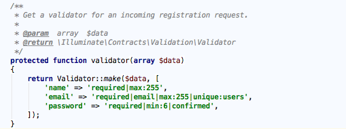
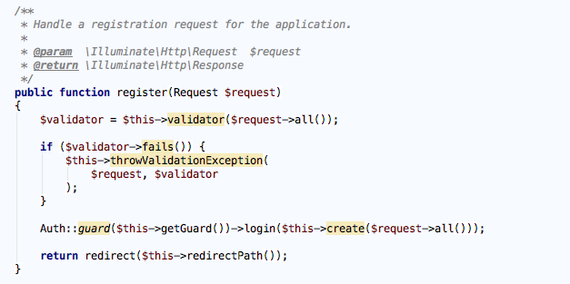
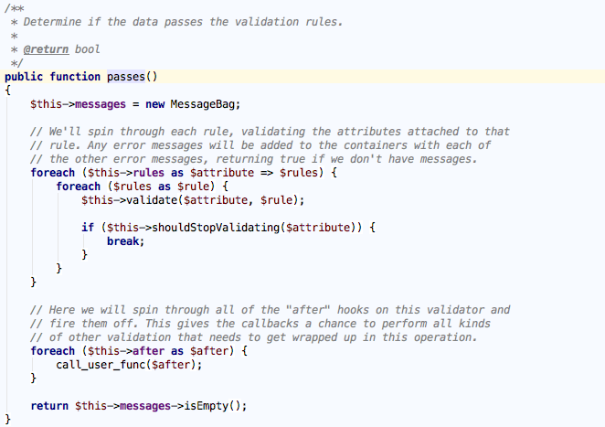
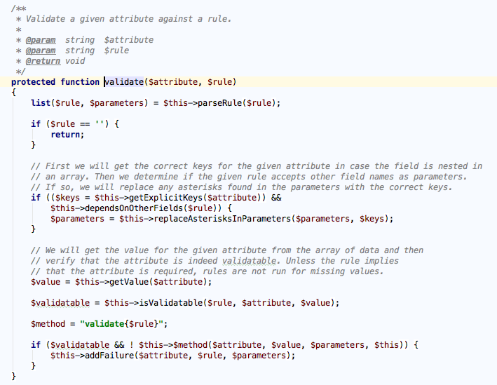
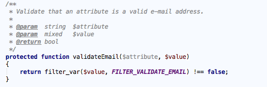

验证数据
========
PHP原生实现
-----------
验证输入数据也很重要，与过滤不同，验证不会从输入数据中删除信息，而只是确认用户输入是否符合预期。如果输入的是电子邮件地址，则确保用户输入的是电子邮件地址；如果需要的是电话号码，则确保用户输入的是电话号码，这就是验证要做的事儿。

验证是为了保证在应用的存储层保存符合特定格式的正确数据，如果遇到无效数据，要中止数据存储操作，并显示相应的错误信息来提醒用户输入正确的数据。验证还能避免数据库出现潜在错误，例如，如果 MySQL 期望使用 ``DATETIME`` 类型的值，而提供的却是 ``DATE`` 字符串，那么 MySQL 会报错或使用默认值，不管哪种处理方式，应用的完整性都受到无效数据的破坏。

要实现输入数据验证，我们可以把某个 ``FILTER_VALIDATE_*`` 标识传递给 ``filter_var`` 函数， PHP 提供了验证布尔值、电子邮件地址、浮点数、整数、IP、正则表达式和 ``URL`` 的标识（详见 http://php.net/manual/en/filter.filters.validate.php ）。下面的示例演示了如何验证电子邮件地址：

.. code-block:: php

    <?php
    $input = 'yaojinbu@163.com';
    $isEmail = filter_var($input, FILTER_VALIDATE_EMAIL);
    if ($isEmail !== FALSE) {
        echo 'success';
    } else {
        echo 'failed';
    }

我们要特别关注 ``filter_var`` 的返回值，如果验证成功，返回的是要验证的值，如果验证失败，返回 ``false`` 。

借助PHP组件
-----------
虽然 ``filter_var`` 函数提供了很多用于验证的标识，但一招鲜，不能吃遍天，我们不能依赖它验证所有数据，除了 ``filter_var`` 函数，还有以下组件可以帮助我们完成更加复杂的验证功能：

- `aura/filter <https://packagist.org/packages/aura/filter>`_
- `respect/validation <https://packagist.org/packages/respect/validation>`_
- `symphony/validator <https://packagist.org/packages/symfony/validator>`_

.. epigraph::

   注：输入数据既要验证也要过滤，以确保其符合预期且安全。

Laraval中的数据验证实现
-----------------------
数据验证的绝大部分场景都在表单提交上， ``Laravel`` 中对用户提交数据的验证也提供了丰富的方法，几乎能够满足任何需求，关于 ``Laravel`` 的数据验证请参考其官方文档： http://laravelacademy.org/post/3279.html 。这里我们简单讨论下其底层实现逻辑，以用户注册为例，在 ``AuthController`` 中定义了一个 ``validator`` 方法：

这段规则在注册新用户时会用到， ``Laravel`` 中通过 ``|`` 来分隔多个验证规则，以 ``email`` 为例，这段规则表明 ``email`` 字段是必须的、必须是电子邮件地址、最大长度为 255 、在 ``users`` 表中是唯一的。我们来看下整个验证过程的实现， ``validator`` 方法是在 ``RegistersUsers Trait`` （ ``Illuminate\Foundation\Auth\RegistersUsers`` ）中被调用的：

该方法首先调用 ``AuthController`` 的 ``validator`` 方法完成 ``Validator`` （ ``Illuminate\Validation\Validator`` ）的初始化工作，然后调用 ``validator`` 实例上的 ``fails`` 方法验证是否失败， ``failes`` 方法又会调用到 ``passes`` 方法：

``passes`` 方法最终会对每个规则（在初始化时被转化为数组了）进行遍历并调用 ``validate`` 方法：

可以看到这里最终组装了每个规则对应的验证方法，并进行调用，以 ``email`` 为例，最终组成的方法是 ``validateEmail`` ，这个验证方法在 ``Validator`` 中是已经定义好了的（事实上，验证文档中的每一个规则在这里都能找到对应的验证方法）：

通过代码我们看到这里调用了 PHP 提供的 ``filter_var`` 并传入 ``FILTER_VALIDATE_EMAIL`` 标识来验证传入字段是否是有效的邮箱地址。关于其它验证规则的实现，有兴趣的同学可以好好研究下 ``Validator`` 这个类。