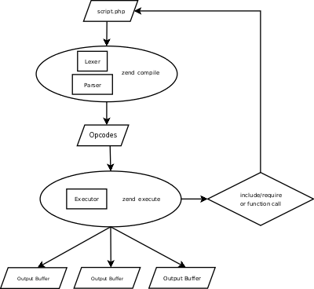

*********
php代码执行流程
*********

从最初我们编写的 PHP脚本->到最后脚本被执行->得到执行结果 ，这个过程，其实可以分为如下几个阶段：

- 首先， ``Zend Engine(ZE)`` ，调用词法分析器( ``Lex`` 生成的，源文件在 ``Zend/zend_language_sanner.l`` ), 将我们要执行的 ``PHP`` 源文件，去掉空格 ，注释，分割成一个一个的 ``token`` 。
- 然后， ``ZE`` 会将得到的 ``token forward`` 给语法分析器( ``yacc`` 生成, 源文件在 ``Zend/zend_language_parser.y`` )，生成一个一个的 ``op code`` ， ``opcode`` 一般会以 ``op array`` 的形式存在，它是 ``PHP`` 执行的中间语言。
- 最后， ``ZE`` 调用 ``zend_executor`` 来执行 ``op array`` ，输出结果。

``ZE`` 是一个虚拟机，正是由于它的存在，所以才能使得我们写 ``PHP`` 脚本，完全不需要考虑所在的操作系统类型是什么。 ``ZE`` 是一个 ``CISC`` （复杂指令处理器）， 它支持 150 条指令（具体指令在 ``Zend/zend_vm_opcodes.h`` ），包括从最简单的 ``ZEND_ECHO(echo)`` 到复杂的 ``ZEND_INCLUDE_OR_EVAL(include,require)`` ，所有我们编写的 ``PHP`` 都会最终被处理为这 150 条指令 ``(op code)`` 的序列，从而最终被执行。

那有什么办法可以看到我们的 ``PHP`` 脚本，最终被“翻译”成什么样的呢？ 也就是说， ``op code`` 长的什么样子呢？ 呵呵，达到这个，我们需要重新编译 ``PHP`` ，修改它的 ``compile_file`` 和 ``zend_execute`` 函数。不过，在 ``PECL`` 中已经有这样的模块，可以让我们直接使用了，那就是由 Derick Rethans 开发的 ``VLD (Vulcan Logic Dissassembler)`` 模块。你只要下载这个模块，并把他载入 ``PHP`` 中，就可以通过简单的设置，来得到脚本翻译的结果了。

接下来，让我们尝试用 ``VLD`` 来查看一段简单的 ``PHP`` 脚本的中间语言。

{"code":1,"msg":"管理员更新成功","data":"","url":"http:\/\/demo.tianyanapp.cn\/index.php\/admin\/admin_user\/update.html?id=8","wait":3}

- PECL：PHP Extension Community Library，他管理着最底层的PHP扩展。这些扩展是用 C 写的。
- PEAR：PHP Extension and Application Repository，他管理着项目环境的扩展。这些扩展是用 PHP 写的。
- composer：他和PEAR都管理着项目环境的依赖，这些依赖也是用 PHP 写的，区别不大。但 composer 却比 PEAR 来的更受欢迎，即使 PEAR 早出来大概十年。

参考：

- php开发组成员博客 http://www.laruence.com/php-internal
