***************
微信公众平台介绍
***************

自从腾讯公司推出微信以后，便如星火燎原之势发展。截止到 2015 年第一季度，微信已经覆盖中国 90% 以上的智能手机，月活跃用户达到 5.49 亿，用户覆盖 200 多个国家、超过 20 种语言。此外，各品牌的微信公众账号总数已经超过 800 万个，移动应用对接数量超过 85000 个，微信支付用户则达到了 4 亿左右。

本章主要介绍微信公众平台的注册及使用。

微信及其平台
===========
微信（英文名：WeChat）是腾讯公司于 2011 年初推出的一款可以发送文字、表情、图片、语音、视频、位置、链接，并支持语音实时对讲的手机聊天软件。用户可以通过“添加QQ好友”，“添加手机联系人”，“摇一摇”、“附近的人”，“一起按”、“搜号码”、“查找公众号”，扫描二维码等多种方式添加好友或关注微信公众账号，也可以将内容发送给好友以及分享到朋友圈。同时微信还提供“微信支付”、“理财通”、“微信红包”、“表情”、“游戏”等贴近生活的功能。

微信由腾讯广州研发中心产品团队开发，该团队经理张小龙被称为“微信之父”，公司总裁马化腾确定该产品的名称为“微信”。

微信的官方网站是： http://weixin.qq.com/ 。

2012年8月23日，腾讯公司推出微信公众平台，其宣传口号是“再小的个体，也有自己的品牌”。微信公众平台是微信公众账号所有者(政府、媒体、企业、组织或个人等)进行品牌推广、减少运营成本、提高影响力、与用户进行互动交流及提供服务的平台，公众账号通过消息、事件、菜单等交互方式为用户提供服务。例如：公众账号“招商银行信用卡中心”为持卡人提供信用卡绑定、查询信用卡账单、额度及积分；快速还款、申请账单分期；微信转接人工服务；信用卡消费，微信免费笔笔提醒等功能，同时还为非持卡人提供微信办卡功能。微信公众平台的官方网址是 https://mp.weixin.qq.com/ 。微信公众平台还有国际版（也称海外版），其官方网址为： https://admin.wechat.com/ 。
除了公众平台以外，主要还有微信开放平台、微信支付平台及微信硬件平台。

微信开放平台是为移动应用开发者提供的内容分享接口，开发者可以在 ``iOS`` 、 ``Android`` 以及 ``WP8`` 平台上使用开放平台的 ``SDK`` 来开发分享功能，使用户可以在 ``APP`` 上分享内容给微信好友和微信朋友圈。微信开放平台的官方网址是 http://open.weixin.qq.com 。

微信支付是腾讯公司的支付业务品牌，微信支付提供公众号支付、APP支付、扫码支付、刷卡支付等支付方式。微信支付结合微信公众账号，全面打通 ``O2O`` 生活消费领域，提供专业的互联网+行业解决方案，微信支付支持微信红包和微信理财通，是移动支付的首选。微信支付的官方网址是 http://pay.weixin.qq.com 。

微信硬件平台是微信继连接人与人，连接企业/服务与人之后，推出连接物与人，物与物的 ``IOT`` 解决方案。微信硬件平台的官方网址是 http://iot.weixin.qq.com/ 。

微信公众账号注册
===============
本章介绍微信公众平台订阅号、服务号、企业号、小程序及测试号等账号的注册过程。

公众账号的注册
-------------
要使用微信公众平台，需要先注册一个微信公众平台账号。目前的公众账号类型为订阅号、服务号、企业号及应用号小程序。

在浏览器中输入微信公众平台的官方网站，网站地址为 https://mp.weixin.qq.com/ 。 进入后如图1-2所示。

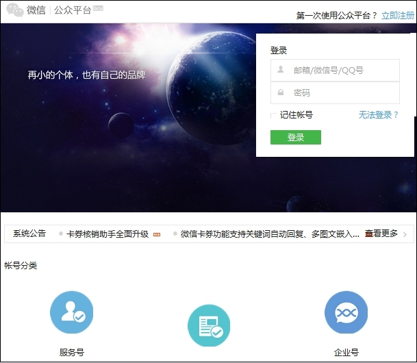

可以看到右上角有 “第一次使用公众平台？立即注册”字样，点击 “立即注册”链接，进入注册页面，如下图所示。

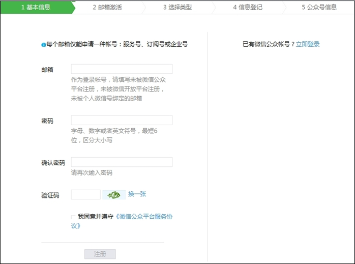

在基本信息界面中填写邮箱、密码、验证码，并勾选同意遵守协议，然后点击注册按钮。将进入邮箱激活界面。如下图所示。

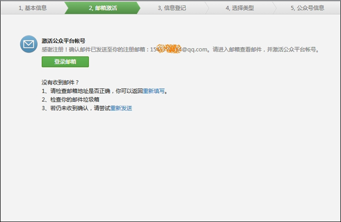

同时邮箱中将收到激活微信公众平台账号的确认邮件，如下图所示。

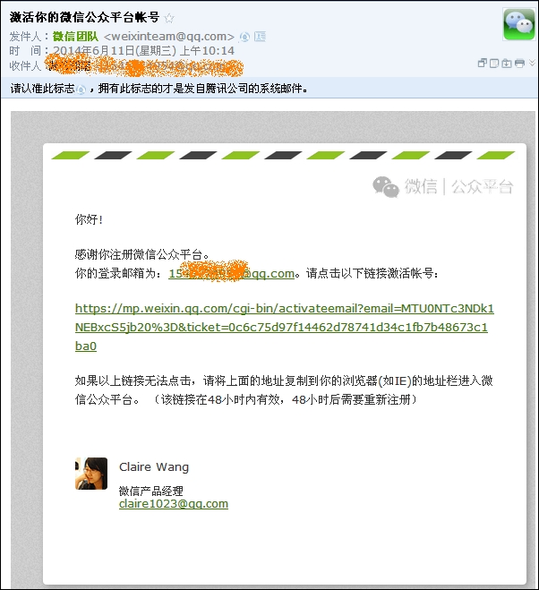

点击邮箱中的链接成功激活账号之后，注册页面自动跳转到信息登记界面。在界面中要求选择相应的运营主体是组织还是个人，其中组织类型又细分为政府、媒体、企业、其他组织等类型。根据运营主体的不同，要求提供不同的资质材料及证明。如下图所示。

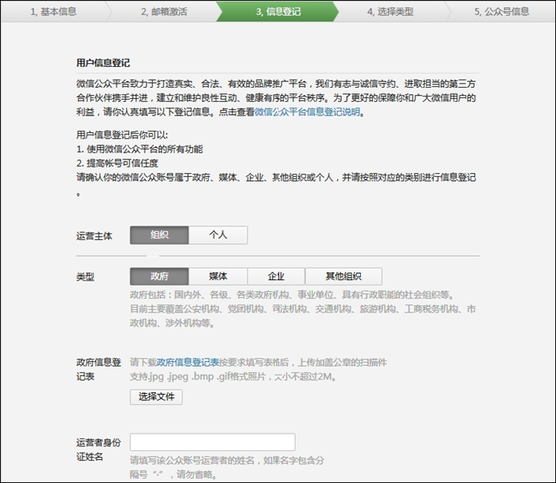

填写完信息登记信息后，再进入选择类型界面。公众账号类型可以选择订阅号和服务号。如下图所示。

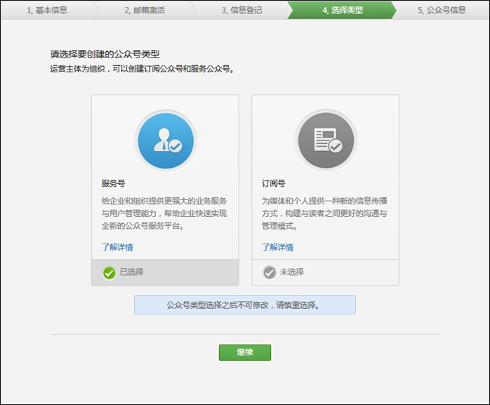

企业和组织一般选择服务号。媒体及个人一般选择订阅号。

服务号每月可群发一条信息给粉丝、群发的消息乃显示在聊天列表、下发消息即时通知粉丝、默认可以自动获得自定义菜单、可以申请微信认证获得高级接口权限，服务号旨在为用户提供服务；订阅号每天可群发一条消息给粉丝、群发消息收至订阅号文件夹、群发消息不会提示推送、认证后可申请自定义菜单，订阅号主要用于提供信息和资讯。如果是企业组织等类型，推荐选择服务号。

选择好类型后，点击继续按钮，弹出公众号信息填写界面。如下图所示。

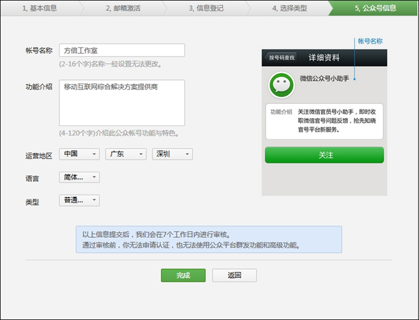

填写好信息之后，点击完成，将提示成功创建公众账号。如下图所示。

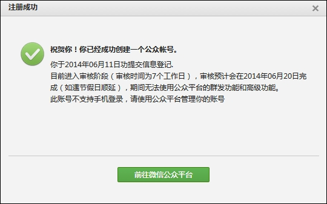

点击“前往微信公众账号”将进入账号信息。在“设置”-“公众号设置”中可以查看到账号的基本信息。如下图所示。

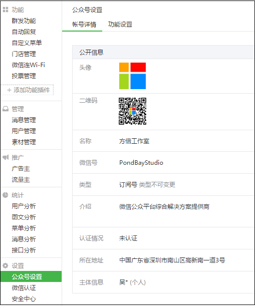

测试号的注册
-----------
除了普通的订阅号及服务号之外，微信公众平台还为开发者提供了测试号的申请，开发者只需要用微信的扫一扫功能扫描二维码即可获得一个使用期限为永久的测试账号，该账号不需要认证即可拥有普通账号认证后才具有的权限。

注册微信测试号的地址是 http://mp.weixin.qq.com/debug/cgi-bin/sandbox?t=sandbox/login 打开该链接后，如下图所示。

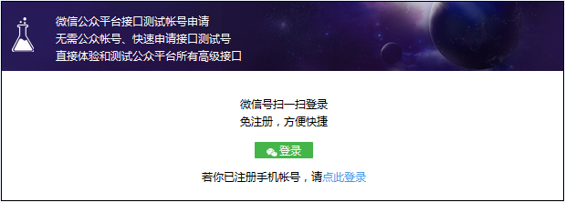

点击图中的“登录”按钮，将跳转到下述链接中，
https://open.weixin.qq.com/connect/qrconnect?appid=wx39c379788eb1286a&scope=snsapi_login&redirect_uri=http%3A%2F%2Fmp.weixin.qq.com%2Fdebug%2Fcgi-bin%2Fsandbox%3Ft%3Dsandbox%2Flogin

网页将显示微信扫描二维码登录页面，如下图所示。

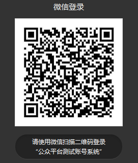

用微信扫描上图中的二维码后，将弹出应用登录框，如下图所示。

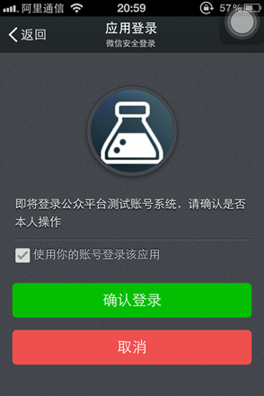

点击“确认登录”按钮后，将得到一个测试账号。该账号拥有 ``appID`` 和 ``appsecret`` ，并且可以对接口进行配置，如下图所示。

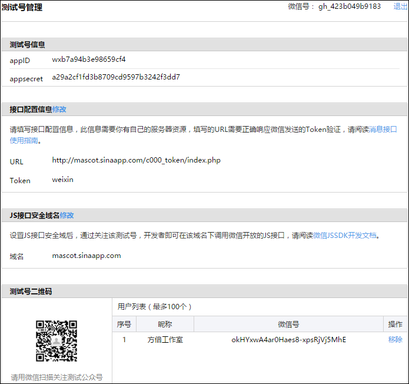

同时，该账号拥有高级接口的权限，如下图所示。

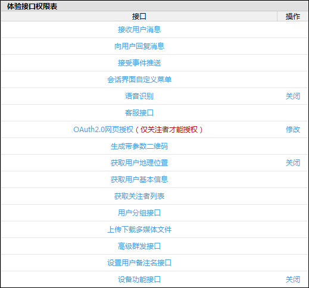

微信公众平台的使用
=================
登录微信公众平台以后，可以看到导航菜单、公众账号类型及名称等基本信息，如下图所示。

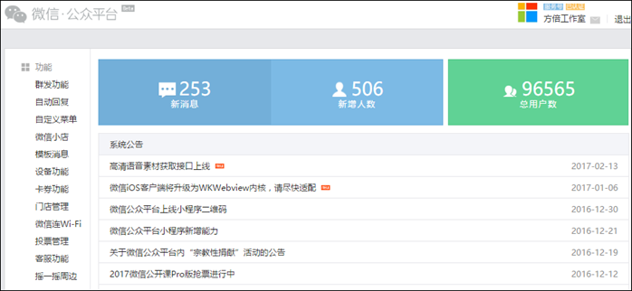

下面以微信公众账号“方倍工作室”为主要例子，介绍微信公众平台的各项菜单及使用。

功能
----

群发功能
^^^^^^^^
群发功能是指微信公众平台最常用也最重要的功能之一。

根据需要，运营人员填写文字(或图片/语音/视频/图文等，需要先上传素材）内容后，选择对群发对象、性别、群发地区发送即可。获得微信支付权限的公众账号还能群发商品信息。

群发功能界面如下图所示。

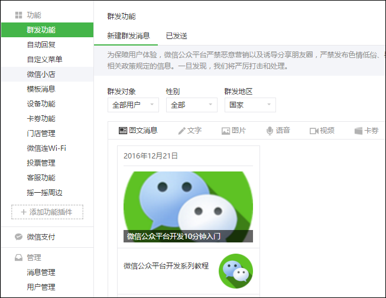

在“已发送”页面中，可以看到已经群发的消息，如下图所示。

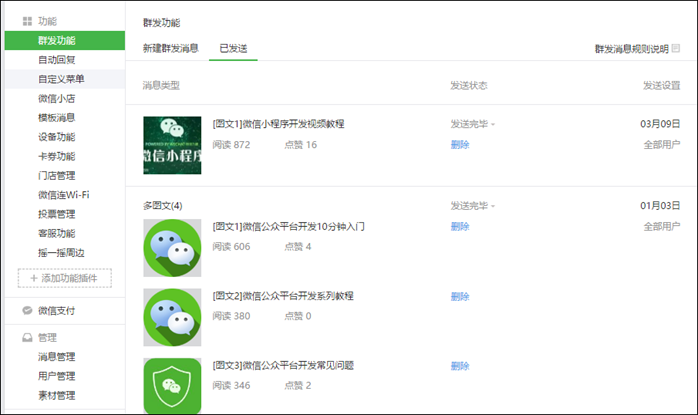

自动回复
^^^^^^^
在自动回复下，可以设置三种类型的自动回复。

- 被添加自动回复：是指当微信用户关注您的微信公众号时自动推送的一条内容，支持文字、图片、语音、视频等类型。
- 消息自动回复：当微信用户发送消息给公众账号时，若未设置关键词自动回复或匹配不到相关的关键词，系统会自动推送该消息给粉丝。该类型信息1个小时内回复1—2条。
- 关键词自动回复：用户发送的消息内如果有已设置的关键字即可把设置在此规则名中回复的内容自动发送给用户。下图展示了关键词自动回复的设置方法。

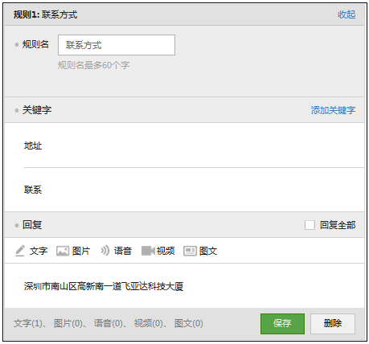

通过设置上面三种类型的自动回复，可以完成一个全面的微信公众账号的内容回复。下图依次展示了三种自动回复的内容。

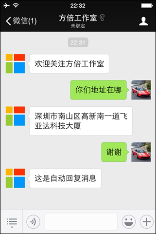

自定义菜单
^^^^^^^^^
拥有自定义菜单权限的账号，也可以创建自定义菜单。最多可以创建3个一级菜单，每个一级菜单下可创建最多5个二级菜单。每个菜单创建后需要为其设置响应动作。响应动作包括发送信息和跳转到网页。其中信息包括文字/图片/语音/视频/图文信息。图1-21展示了自定义菜单设置及其中一个子菜单回复图文消息的设置。

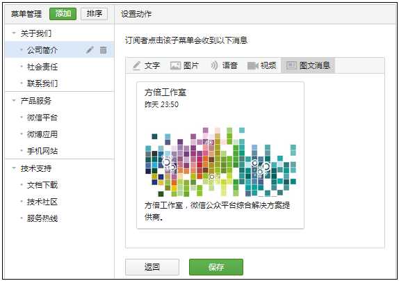

上图的自定义菜单发布后，效果如下图所示：

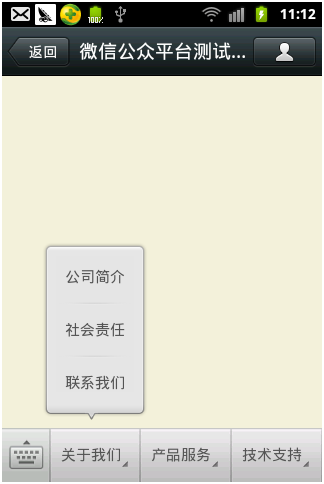

其他功能
^^^^^^^^
其他功能还有微信小店、多客服、模版消息、卡券功能、门店管理、设备功能等。运营者可以通过添加功能插件将其加入到功能列表中，而微信官方也在不断的推出新的功能插件供公众账号使用。下图是微信小店的图示。

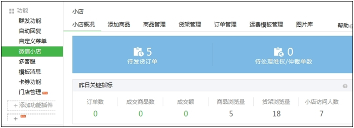

微信支付
--------
微信支付（商户功能），是公众平台向有出售物品需求的公众号提供推广销售、支付收款、经营分析的整套解决方案。商户通过自定义菜单、关键字回复等方式向订阅用户推送商品消息，用户可在微信公众号中完成选购支付的流程。商户也可以把商品网页生成二维码，张贴在线下的场景，如车站和广告海报。用户扫描后可打开商品详情，在微信中直接购买。微信支付的后台界面如下图所示。

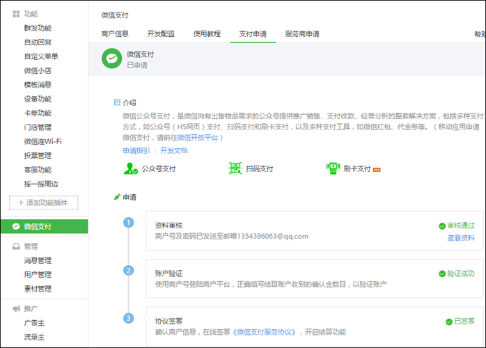

管理
----

消息管理
^^^^^^^^

在消息管理中，可以查看全部消息（最近5天的消息），也可以查看今天、昨天、前天、更早以及星标的消息内容，另外还可以对消息内容进行搜索。鼠标移动到某条消息上，可以对其进行快捷回复以及点击星标收藏该消息，收藏后的消息被在后台被永久保存。如下图所示。

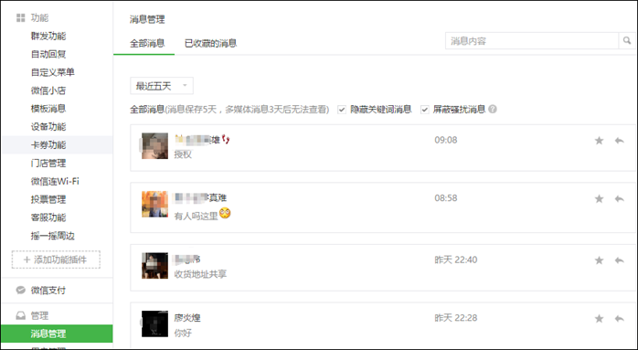

用户管理
^^^^^^^^
用户管理中，可以实现新建用户分组，移动用户至指定分组以及修改用户备注功能。如图1-26所示。鼠标移至用户头像上可以查看用户性别、地区、签名等信息。另外，被移至黑名单的用户将不能获得任何回复。

.. image:: ./images/用户管理.png

素材管理
^^^^^^^^
素材管理中，保存了用户新建的图文消息、图片、语音及视频信息。这些信息可以用于自动回复，也能用于群发功能。如下图所示。

.. image:: ./images/素材管理.png

图文消息包括单图文消息以及多图文消息。图文消息包括以下几个部分：标题、封面图片、作者（选填）、摘要（仅单图文消息）、正文、原文链接（选填）。如下图所示。其中多图文消息最多包含8条图文信息。而在开发模式下，多图文消息最多可以包含10条。

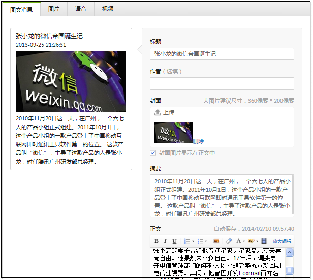

推广
----
微信公众平台推广功能是微信公众平台官方唯一的广告系统，公众帐号运营者通过广告主功能可向不同性别、年龄、地区的微信用户精准推广自己的服务，获得潜在用户，也可通过流量主功能自愿将公众号内指定位置分享给广告主作广告展示，按月获得收入。广告主功能如下图所示。

统计
----

用户分析
^^^^^^^^
用户分析主要分为用户增长和用户属性两大模块。用户增长模块按日、周、月显示新关注人数、取消关注人数、净增关注人数、累积关注人数等几项指标。如下图所示。用户属性模块中，可以根据性别、省份、城市、语言查看分布情况。

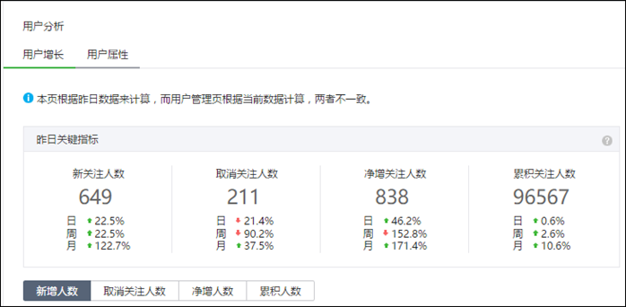

图文分析
^^^^^^^^
图文分析主要分为图文群发和图文统计两大模块。图文群发模块可以查看每篇图文消息的送达人数、图文页阅读人数/次数、原文页阅读人数/次数/转化率、分享转发人数/次数。如下图所示。而图文统计模块中，可以根据周期（日或小时）查看图文页阅读、原文页阅读、分享转发等指标情况。

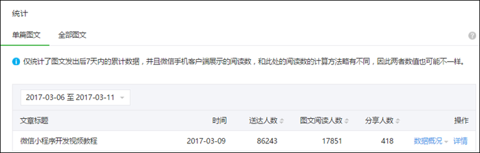

消息分析
^^^^^^^^
消息分析中，可以根据周期（日或小时）查看消息发送人数、消息发送次数、人均发送次数等指标的情况。如下图所示。

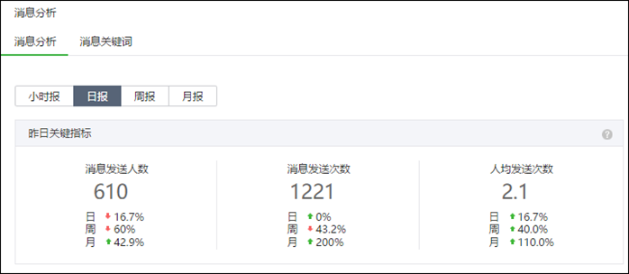

接口分析
^^^^^^^^
使用开发模式的公众账号，可以根据周期（日或小时）查看调用次数、失败率、平均耗时、最大耗时等指标的情况。如下图所示。

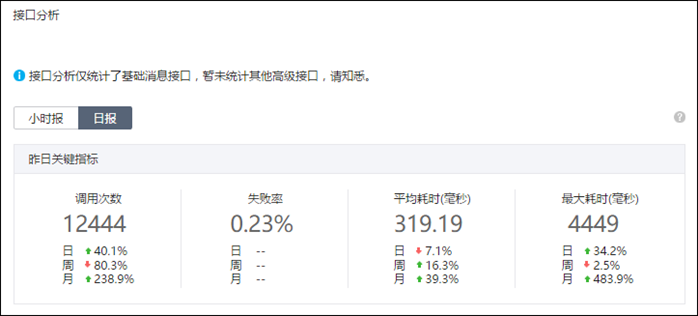

设置
----

账号信息
^^^^^^^^
账号信息页面显示了公众账号的头像、名称、登录邮箱、原始ID、微信号、隐私设置、类型、认证情况、地区、功能介绍、腾讯微博、二维码、图片水印等信息。下图显示了账号的部分信息。

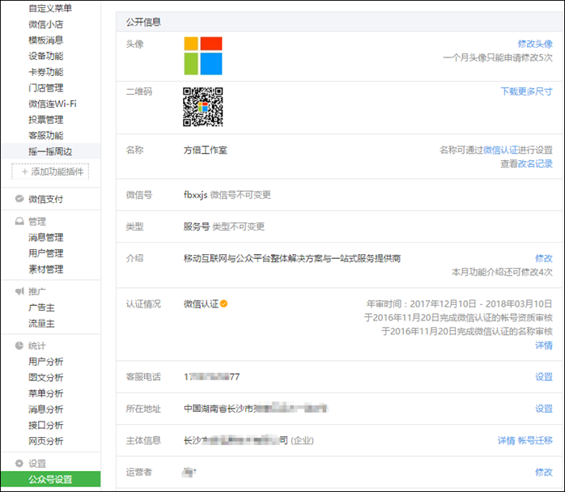

二维码是用户关注公众账号的一个重要入口。也是企业在微信公众平台上对外进行传播推广时的一张重要名片。微信公众平台提供五种不同尺寸的二维码供运营者下载。方倍工作室的二维码图片如图1-35所示。读者可以使用微信的扫一扫功能，扫描二维码关注我们。

微信认证
^^^^^^^^
通过微信认证的账号，可以看到微信认证的日期及已获得的权限列表，如下图所示。

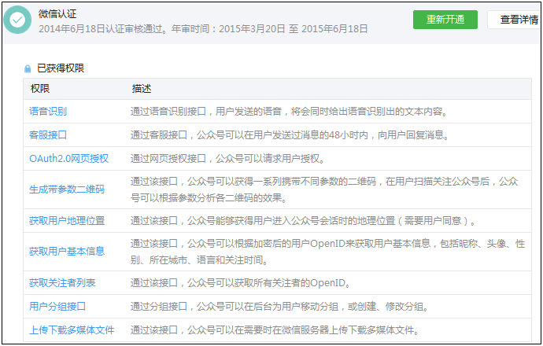

安全中心
^^^^^^^^
安全中心可以开启手机保护功能，开通手机保护后，登录时需要输入手机验证码进行验证后才可正常登录。启用手机保护设置如下图所示。

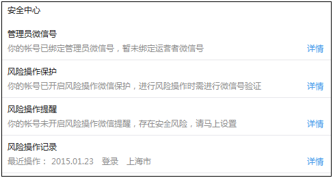

开发
----
开发者中心提供了开发者ID，其中包括 ``AppID`` （应用ID）和 ``AppSecret`` （应用密钥），这些账号用于高级接口及微信支付的开发。同时也可以配置服务器的 ``URL`` （服务器地址）、 ``Token`` （令牌）、 ``EncodingAESKey`` （消息加解密密钥）及消息加解密方式。如下图所示。

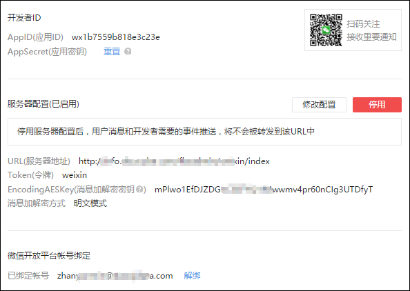

本章小结
========
本章概要介绍了微信及其相关的几大平台，重点且详细介绍了当今最流行最热门的微信公众的注册及使用方法，开发人员及运营人员应该掌握这些基本功能并熟悉他们的使用方法，以便为后续的开发运营打下基础。