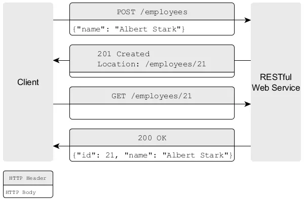
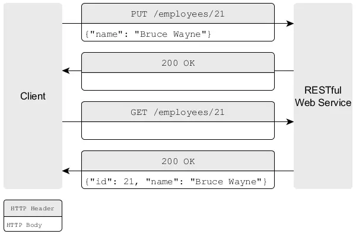
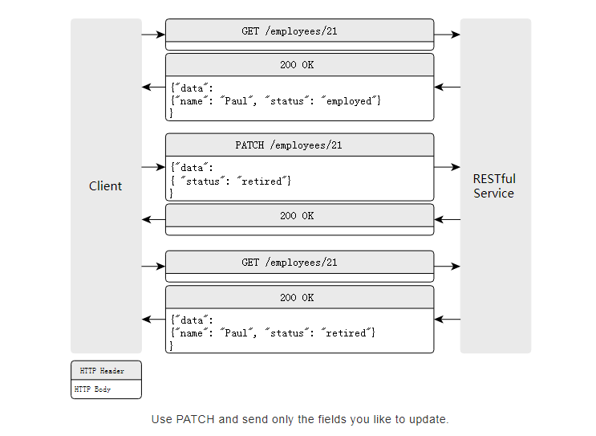

******************
RESTful API 设计最佳实践
******************

项目资源的 ``URL`` 应该如何设计？用名词复数还是用名词单数？一个资源需要多少个 ``URL`` ？用哪种 ``HTTP`` 方法来创建一个新的资源？可选参数应该放在哪里？那些不涉及资源操作的 ``URL`` 呢？实现分页和版本控制的最好方法是什么？因为有太多的疑问，设计 ``RESTful API`` 变得很棘手。在这篇文章中，我们来看一下 ``RESTful API`` 设计，并给出一个最佳实践方案。

我们将讨论 ``URL`` 结构， ``HTTP`` 方法，创建和更新资源，设计关系，有效负载格式，分页，版本控制等等。

每个资源使用两个URL
==================
资源集合用一个 ``URL`` ，具体某个资源用一个 ``URL`` ：

.. code-block:: shell

	/employees         #资源集合的URL
	/employees/56      #具体某个资源的URL

用名词代替动词表示资源
=====================
这让你的 ``API`` 更简洁， ``URL`` 数目更少。不要这么设计：

.. code-block:: shell

	/getAllEmployees
	/getAllExternalEmployees
	/createEmployee
	/updateEmployee

更好的设计：

.. code-block:: shell

	GET /employees
	GET /employees?state=external
	POST /employees
	PUT /employees/56

用HTTP方法操作资源
=================
使用 ``URL`` 指定你要用的资源。使用 ``HTTP`` 方法来指定怎么处理这个资源。使用四种 ``HTTP`` 方法 ``POST`` ， ``GET`` ， ``PUT`` ， ``DELETE`` 可以提供 ``CRUD`` 功能（创建，获取，更新，删除）。

- 获取：使用 ``GET`` 方法获取资源。 ``GET`` 请求从不改变资源的状态。无副作用。 ``GET`` 方法是幂等的。 ``GET`` 方法具有只读的含义。因此，你可以完美的使用缓存。
- 创建：使用 ``POST`` 创建新的资源。
- 更新：使用 ``PUT`` 更新现有资源。
- 删除：使用 ``DELETE`` 删除现有资源。

2个 ``URL`` 乘以 4 个 ``HTTP`` 方法就是一组很好的功能。看看这个表格：

+---------------+----------------+--------------------+--------------------+----------------+
| -             | POST（创建）   | GET（读取）        | PUT（更新）        | DELETE（删除） |
+===============+================+====================+====================+================+
| /employees    | 创建一个新员工 | 列出所有员工       | 批量更新员工信息   | 删除所有员工   |
+---------------+----------------+--------------------+--------------------+----------------+
| /employees/56 | （错误）       | 获取56号员工的信息 | 更新56号员工的信息 | 删除56号员工   |
+---------------+----------------+--------------------+--------------------+----------------+

理解HTTP方法的语义
-----------------
幂等的定义：当我们可以安全地一遍又一遍地执行请求并且所有请求都导致相同的状态时，HTTP方法是幂等的。

- GET

  + 幂等
  + 只读， ``GET`` 永远不会更改服务器端资源的状态。它必须没有副作用。
  + 因此，可以安全地缓存响应。
  + 例子：

    - ``GET /employees`` 列出所有员工
    - ``GET /employees/1`` 显示员工1的详细信息

- PUT

  + 幂等
  + 可用于创建和更新
  + 通常用于更新（完整更新）
  + 要使用 ``PUT`` 进行创建，客户端需要预先知道整个 ``URL`` （包括ID）。这种情况并不常见，因为服务器通常会生成 ``ID`` 。因此，当只有一个元素并且 ``URL`` 是明确的时，通常使用 ``PUT`` 进行创建。

    - 如： ``PUT /employees/1/avatar`` 创建或更新员工1的头像。每个员工只有一个头像。

  + 始终在请求中包含整个有效负载。即全有或全无。 ``PUT`` 不用于部分更新（请参阅PATCH）。

- POST

  + 非幂等
  + 用于创建
  + 如： ``POST /employees`` 创造一个新员工。新 ``URL`` 将在 ``Location`` 标头中传送回客户端（例如， ``Location: /employees/12`` ）。  ``/employees`` 上的多个 ``POST`` 请求导致许多新的不同员工（这就是为什么 ``POST`` 不是幂等的）。

- PATCH

  + 幂等
  + 用于部分更新
  + 如： ``PATCH /employees/1`` 使用有效负载中包含的字段更新员工1。员工1的其他字段不会更改。

- DELETE

  + 幂等
  + 用于删除
  + 如： ``DELETE /employees/1``

对资源集合的URL使用POST方法，创建新资源
=====================================
创建一个新资源的时，客户端与服务器是怎么交互的呢？

在资源集合 ``URL`` 上使用 ``POST`` 来创建新的资源过程：

1. 客户端向资源集合 ``URL/employees`` 发送 ``POST`` 请求。 ``HTTP body`` 包含新资源的属性 “Albert Stark”。
2. RESTful Web 服务器为新员工生成 ``ID`` ，在其内部模型中创建员工，并向客户端发送响应。这个响应的 ``HTTP`` 头部包含一个 ``Location`` 字段，指示创建资源可访问的 ``URL`` 。

对具体资源的URL使用PUT方法，来更新资源
====================================
使用PUT更新已有资源：

1. 客户端向具体资源的 ``URL`` 发送 ``PUT`` 请求 ``/employee/21`` 。请求的 ``HTTP body`` 中包含要更新的属性值（21号员工的新名称“Bruce Wayne”）。
2. ``REST`` 服务器更新 ``ID`` 为 ``21`` 的员工名称，并使用 ``HTTP`` 状态码 ``200`` 表示更改成功。

使用PATCH来部分更新一个资源
==========================
``PUT`` 不应该用于部分更新。 ``PUT`` 应仅用于完全替换资源。每次发送所有字段（尽管您只想更新单个字段）可能会导致在并行更新时意外覆盖。此外，验证的实现很难，因为您必须同时支持两种用例：创建（某些字段不能为 ``null`` ）和更新（ ``null`` 值以标记不应更新的字段）。因此，请勿使用 ``PUT`` 发送部分更新的字段。 PUT 请求中缺少的字段应被视为 ``null`` 值并清空数据库字段或触发验证错误。

而是使用 ``PATCH`` 进行部分更新。仅发送应更新的字段。这样，请求有效负载非常直接，不同字段的并行更新不会覆盖不相关的字段，验证变得更容易， ``null`` 值的语义是明确的（对于 ``PUT`` 和 ``PATCH`` ）并且您节省了带宽。例如，以下 ``PATCH`` 请求仅更新 ``state`` 字段，但不更新 ``name`` 。

.. note:: 除了描述的“只发送您想要更新的内容”方法（ `JSON:API <http://jsonapi.org/format/#crud-updating>`_ 也推荐）之外，还有 `JSON-PATCH <http://jsonpatch.com/>`_ 。它是 ``PATCH`` 请求的有效负载格式，描述了应在资源上执行的一系列更改。但是，对于许多用例来说，实现和过度使用是很棘手的。有关更多详细信息，请查看帖子 `PUT vs PATCH vs JSON-PATCH <https://philsturgeon.uk/api/2016/05/03/put-vs-patch-vs-json-patch/>`_ 。

在 data 字段中封装实际的数据
===========================
``GET /employees`` 在 ``data`` 字段中返回一系列对象。

.. code-block:: json

	{
	  "data": [
	    { "id": 1, "name": "Larry" }
	    , { "id": 2, "name": "Peter" }
	  ]
	}

GET /employees/1 在 data 字段总返回单个对象。

.. code-block:: json

	{
	  "data": {
	    "id": 1,
	    "name": "Larry"
	  }
	}

``PUT`` ， ``POST`` 和 ``PATCH`` 请求的有效负载还应包含具有实际对象的 ``data`` 字段。

好处：

- 还有空间来添加元数据（例如，用于分页，链接，弃用警告，错误消息）
- 一致性
- 与 `JSON:API 标准 <http://jsonapi.org/>`_ 兼容

对可选的、复杂的参数，使用查询字符串（？）
=====================================
不推荐做法：

.. code-block:: shell

	GET /employees
	GET /externalEmployees
	GET /internalEmployees
	GET /internalAndSeniorEmployees

为了让你的 ``URL`` 更小、更简洁。为资源设置一个基本 ``URL`` ，将可选的、复杂的参数用查询字符串表示。

.. code-block:: shell

	GET /employees?state=internal&title=senior
	GET /employees?id=1,2

JSON:API 过滤方式是：

.. code-block:: shell

	GET /employees?filter[state]=internal&filter[title]=senior
	GET /employees?filter[id]=1,2

使用HTTP状态码
==============
``RESTful Web`` 服务应使用合适的 ``HTTP`` 状态码来响应客户端请求

- 2xx - 成功 - 一切都很好
- 4xx - 客户端错误 - 如果客户端发生错误（例如客户端发送无效请求或未被授权）
- 5xx – 服务器错误 - 如果服务器发生错误（例如，尝试处理请求时出错）

参考维基百科上的 ``HTTP``  `状态代码 <http://en.wikipedia.org/wiki/List_of_HTTP_status_codes>`_ 。但是，其中的大部分 ``HTTP`` 状态码都不会被用到，只会用其中的一小部分。通常会用到一下几个：

+-----------+----------------+-----------------+--------------------+
| 2xx：成功 | 3xx：重定向    | 4xx：客户端错误 | 5xx：服务器错误    |
+===========+================+=================+====================+
| 200 成功  | 301 永久重定向 | 400 错误请求    | 500 内部服务器错误 |
+-----------+----------------+-----------------+--------------------+
| 201 创建  | 304 资源未修改 | 401未授权       | -                  |
+-----------+----------------+-----------------+--------------------+
| -         | -              | 403 禁止        | -                  |
+-----------+----------------+-----------------+--------------------+
| -         | -              | 404 未找到      | -                  |
+-----------+----------------+-----------------+--------------------+

不要过度使用 ``404`` 。尽量更精确。如果资源可用，但不允许用户查看它，则返回 ``403 Forbidden`` 。如果资源存在一次但现在已被删除或停用，请使用 ``410 Gone`` 。

返回有用的错误提示
=================
除了合适的状态码之外，还应该在 ``HTTP`` 响应正文中提供有用的错误提示和详细的描述。这是一个例子。

请求：

.. code-block:: shell

    GET /employees?state=super

响应：

.. code-block:: json

	// 400 Bad Request
	{
	  "errors": [
	    {
	      "status": 400,
	      "detail": "Invalid state. Valid values are 'internal' or 'external'",
	      "code": 352,
	      "links": {
	        "about": "http://www.domain.com/rest/errorcode/352"
	      }
	    }
	  ]
	}

建议的错误有效负载结构受 `JSON:API 标准 <http://jsonapi.org/format/#errors>`_ 的启发。

为你的API提供导航链接(HATEOAS)
=============================
理想情况下，您不要让客户构建使用 ``REST API`` 的 ``URL`` 。我们来看一个例子吧。客户想要访问员工的工资报表。因此，他必须知道他可以通过将查询参数 ``salaryStatements`` 附加到员工 ``URL`` （例如 ``/employees/21/salaryStatements`` ）来访问薪水报表。这种字符串连接容易出错，易碎且难以维护。如果您更改了在 ``REST API`` 中访问薪水的方式（例如，现在使用 ``salary-statements`` 或 ``paySlips`` ），则所有客户端都将失效。

最好在您的回复中提供客户可以关注的链接。例如，对 ``GET /employees`` 的回复可能如下所示：

.. code-block:: json

	{
	  "data": [
	    {
	      "id":1,
	      "name":"Paul",
	      "links": [
	        {
	          "salary": "http://www.domain.com/employees/1/salaryStatements"
	        }
	      ]
	    }
	  ]
	}

如果客户端完全依赖链接来获取工资声明，那么如果您更改 ``API`` ，他将不会失效，因为客户端将始终获得有效的 ``URL`` （只要您在 ``URL`` 更改时更新链接）。另一个好处是，您的 ``API`` 变得更具自我描述性，客户端不必经常查找文档。

合适地设计关联链接
=================
我们假设每个员工都有一名经理( ``manager`` )和几名团队成员( ``teamMembers`` )。在 ``API`` 中设计关系基本上有三种常用选项：链接( ``Links`` )，侧载( ``Sideloading`` )和嵌入( ``Embedding`` )。

它们都是有效的，正确的选择取决于用例。基本上， **您应该根据客户端的访问模式以及可容忍的请求数量和有效负载大小来设计关系。**

Links
------

.. code-block:: json

	{
	  "data": [
	    {
	      "id": 1,
	      "name": "Larry",
	      "relationships": {
	        "manager": "http://www.domain.com/employees/1/manager",
	        "teamMembers": [
	          "http://www.domain.com/employees/12",
	          "http://www.domain.com/employees/13"
	        ]
	        //or "teamMembers": "http://www.domain.com/employees/1/teamMembers"
	      }
	    }
	  ]
	}

- 有效载荷小。如果客户端每次都不需要 ``manager`` 和 ``teamManager`` ，这个就很好。
- 许多请求。如果几乎每个客户都需要这些数据，这就很糟糕。在最坏情况下每个员工都需要，这需要许多其他请求。
- 客户端必须将数据拼接在一起才能获得全部数据。

Sideloading
-----------
我们可以通过外键建立关联，并将关联的实体也放在有效载荷中，但是在 ``included`` 专用字段下。这种方法也称为“复合文件”。

.. code-block:: json

	{
	  "data": [
	    {
	      "id": 1,
	      "name": "Larry",
	      "relationships": {
	        "manager":  5 ,
	        "teamMembers": [ 12, 13 ]
	      }
	    }
	  ],
	  "included": {
	    "manager": {
	      "id": 5,
	      "name": "Kevin"
	    },
	    "teamMembers": [
	      { "id": 12, "name": "Albert" }
	      , { "id": 13, "name": "Tom" }
	    ]
	  }
	}

客户端还可以通过诸如 ``GET /employees?include=manager,teamMembers`` 之类的查询参数来控制侧载实体。

- 我们使用一个请求。
- 减小有效载荷大小。没有重复（例如，即使经理被许多员工引用，您也只提供一个经理实例数据）
- 客户端仍然必须将数据拼接在一起以便解析关系，这可能非常麻烦。

Embedding
---------

.. code-block:: json

	{
	  "data": [
	    {
	      "id": 1,
	      "name": "Larry",
	      "manager": {
	        "id": 5,
	        "name": "Kevin"
	      },
	      "teamMembers": [
	        { "id": 12, "name": "Albert" }
	        , { "id": 13, "name": "Tom" }
	      ]
	    }
	  ]
	}

- 对客户来说最方便。是可以直接跟随关联来获取实际数据。
- 如果客户不需要，关联可能会徒劳无功。
- 增加有效负载大小和重复。引用的实体可能多次嵌入。

使用小驼峰命名法
===============
使用小驼峰命名法作为属性标识符。

.. code-block:: shell

    { "yearOfBirth": 1982 }

不要使用下划线( ``year_of_birth`` )或大驼峰命名法( ``YearOfBirth`` )。通常， ``RESTful Web`` 服务将被 ``JavaScript`` 编写的客户端使用。客户端会将 ``JSON`` 响应转换为 ``JavaScript`` 对象（通过调用 ``var person = JSON.parse(response)`` ），然后调用其属性。因此，最好遵循 ``JavaScript`` 代码通用规范。

.. code-block:: js

	person.year_of_birth // 不推荐，违反JavaScript代码通用规范
	person.YearOfBirth // 不推荐，JavaScript构造方法命名
	person.yearOfBirth // 推荐

使用动词进行操作，即非资源请求用动词
=================================
有时，对 ``API`` 调用的响应不涉及资源（如计算，翻译或转换）。例：

.. code-block:: shell

	//Reading
	GET /translate?from=de_DE&to=en_US&text=Hallo
	GET /calculate?para2=23&para2=432

	//Trigger an operation that changes the server-side state
	POST /restartServer
	//no body

	POST /banUserFromChannel
	{ "user": "123", "channel": "serious-chat-channel" }

在这种情况下，不涉及任何资源。相反，服务器执行操作并将结果返回给客户端。因此，您应该在 ``URL`` 中使用动词而不是名词来清楚地区分操作（ RPC-style API ）和 ``REST`` 端点（用于建模域的资源）。

创建这些 RPC-style APIs 比 REST API 更适合于操作。通常，它比尝试RESTful操作更简单，更直观（比如 ``PATCH /server`` 带有 ``{"restart"：true}`` ）。根据经验， ``REST`` 非常适合与域模型交互， ``RPC`` 适合于操作。有关更多详细信息，请查看 `了解RPC与HTTP API的REST <https://www.smashingmagazine.com/2016/09/understanding-rest-and-rpc-for-http-apis/>`_ 。

提供分页信息
============
一次性返回数据库所有资源不是一个好主意。因此，需要提供分页机制。存在两种流行的方式：

- 基于 offset 分页；
- 基于键集的分页又称继续令牌又称光标（推荐）

基于 offset 分页
----------------
通常使用数据库中众所周知的参数 ``offset`` 和 ``limit`` 。

.. code-block:: shell

    /employees?offset=30&limit=15 #返回30 到 45的员工

如果客户端没有传这些参数，则应使用默认值。通常默认值是 ``offset = 0`` 和 ``limit = 10`` 。如果数据库检索很慢，应当减小 ``limit`` 值。

.. code-block:: shell

    /employees   # returns the employees 0 to 100

您可以提供获取下一页或上一页的链接。只需构造具有适当偏移量和限制的 ``URL`` 。

.. code-block:: sehll

    GET /employees?offset=20&limit=10

	{
	  "pagination": {
	    "offset": 20,
	    "limit": 10,
	    "total": 3465,
	  },
	  "data": [
	    //...
	  ],
	  "links": {
	    "next": "http://www.domain.com/employees?offset=30&limit=10",
	    "prev": "http://www.domain.com/employees?offset=10&limit=10"
	  }
	}

基于键集的分页（又名连续令牌，光标）
---------------------------------
上面基于偏移的分页易于实现，但具有严重的 `缺点 <https://blog.philipphauer.de/web-api-pagination-continuation-token/#offset-pagination>`_ 。它们很慢（ ``SQL`` 的 ``OFFSET`` 子句对于大数字变得非常慢）并且不安全（在分页期间发生更改时很容易错过元素）。

这就是使用索引列更好的原因。假设我们的员工有一个索引列 ``data_created`` 和集合资源 ``/employees?pageSize=100`` 返回按此列排序的最早的 ``100`` 名员工。现在，客户端只需要获取最后一个员工的 ``dataCreated`` 时间戳，并使用查询参数 ``createdSince`` 在此时继续。

.. code-block:: shell

	GET /employees?pageSize=100
	# The client receives the oldest 100 employees sorted by `data_created`
	# The last employee of the page has the `dataCreated` field  with 1504224000000 (= Sep 1, 2017 12:00:00 AM)

	GET /employees?pageSize=100&createdSince=1504224000000
	# The client receives the next 100 employees since 1504224000000.
	# The last employee of the page was created on 1506816000000. And so on.

这解决了基于偏移的分页的许多缺点，但它仍然不完美，对客户来说不太方便。

- 最好通过向日期添加附加信息（如id）来创建所谓的 `持续令牌 <https://blog.philipphauer.de/web-api-pagination-timestamp-id-continuation-token/>`_ ，以提高可靠性和效率。
- 此外，您应该在该令牌的有效负载中提供专用字段，以便客户端不必通过查看元素来弄清楚它。您甚至可以进一步提供 ``next`` 链接。

.. code-block:: json

	{
	  "pagination": {
	    "continuationToken": "1504224000000_10",
	  },
	  "data": [
	    // ...
	    // last element:
	    { "id": 10, "dateCreated": 1504224000000 }
	  ],
	  "links": {
	    "next": "http://www.domain.com/employees?pageSize=100&continue=1504224000000_10"
	  }
	}

``next`` 链接使 ``API`` 成为真正 ``RESTful`` ，因为客户端只需按照这些链接（HATEOAS）就可以浏览集合。无需手动构建 ``URL`` 。此外，您可以简单地更改 ``URL`` 结构而不会破坏客户端演进。

有关更多详细信息，请查看有关 ``Web API`` 分页的专用帖子：

- `使用 Timestamp_Offset_Checksum 持续令牌进行 Web Api 分页 <https://blog.philipphauer.de/web-api-pagination-continuation-token/>`_ ——建议的方法不再推荐，但该帖子很好地介绍了整个主题（包括基于偏移的分页）。
- `使用 Timestamp_ID 持续令牌进行 Web Api 分页 <https://blog.philipphauer.de/web-api-pagination-timestamp-id-continuation-token/>`_ ——我建议使用这种方法。它还包含现有基于键集的分页方法的概述。

查看JSON：API
============
您至少应该看看 `JSON:API <http://jsonapi.org/>`_ 。它是 JSON 有效负载和 HTTP 服务资源的标准格式（ MIME 类型： ``application/vnd.api + json`` ）。我个人并没有遵循所有的建议，因为他们中的一些让人觉得有点过于正规化并且对我来说太过分了。在我看来，通常不需要实现灵活性，但它使实施变得复杂而没有提供好处。但这是一个品味问题，遵循标准基本上是一个好主意。我用它作为灵感，挑选那些对我有意义的元素。

确保API的演进
=============

避免由于改变而破坏
-----------------
理想情况下， ``REST API`` （作为每个 ``API`` ）应该是稳定的。基本上，不应该发生破坏性更改（如更改整个有效负载格式或 ``URL`` 方案）。但是，如何在不破坏客户端的情况下继续发展我们的 ``API`` ？

- 进行向后兼容的更改。添加字段没有问题（只要客户端容忍）。
- 复制和弃用。要更改现有字段（重命名或更改结构），可以在旧字段旁边添加新字段，并在文档中弃用旧字段。过了一会儿，你可以删除旧字段。
- 利用超媒体和 ``HATEOAS`` 。只要 ``API`` 客户端使用响应中的链接来浏览 ``API`` （并且不会手动创建 ``URL`` ），您就可以安全地更改 ``URL`` 而不会破坏客户端。
- 使用新名称创建新资源。如果新的业务需求导致全新的域模型和工作流，则可以创建新资源。这通常非常直观，因为域模型无论如何都有一个新名称（从商业名称派生）。示例：租赁服务现在也租用自行车和赛格威。因此，具有资源 ``/cars`` 的旧概念车不删除它。引入了具有新资源 ``/vehicles`` 的新领域模型 ``vehicle`` 。它与旧 ``/cars`` 资源一起提供。

保持业务逻辑在服务器端
--------------------
不要让您的服务成为转储数据访问层，它通过直接公开您的数据库模型（低级 ``API`` ）来提供 ``CRUD`` 功能。这产生了高耦合。

- 业务逻辑转移到客户端，通常在客户端和服务器之间复制（只需考虑验证）。我们必须保持代码同步。
- 通常，客户端耦合服务器的数据库模型。

我们应该避免创建转储数据访问 ``API`` ，因为它们会导致服务器和客户端之间的高度耦合，因为业务工作流在客户端和服务器之间分布。反过来，这又可能使新的业务需求可能需要在客户端和服务器上进行更改并破坏 ``API`` 。所以 API/系统 不可以改进。

因此，我们应该构建基于高层级/工作流的 ``API`` 而不是低级 ``API`` 。示例：不要为数据库中的订单实体提供简单的 ``CRUD`` 服务。不要求客户端知道要取消订单，客户端必须将订单 ``PUT`` 到通用 ``/order/1`` 资源，其中包含特定的取消有效负载（反映数据库模型）。这导致高耦合（客户端的业务逻辑和领域知识，暴露的数据库模型）。相反，提供专用资源 ``/order/1/cancelation`` ，并在订单资源的有效负载中添加链接。客户端可以导航到取消 ``URL`` 并发送定制的取消有效负载。将此有效负载映射到数据库模型的业务逻辑在服务器中完成。此外，服务器可以轻松地更改 ``URL`` 而不会破坏客户端，因为客户端只需获取链接。此外，如果订单可以取消或不被取消，则决策逻辑现在在服务器中：如果取消，则服务器将链接添加到订单有效载荷中的取消资源。因此，客户端只需要检查是否存在取消链接（例如，知道他是否应该取消取消按钮）。因此，我们将域知识从客户端移回服务器。只需操作服务器即可轻松应用取消条件的更改，从而使系统可以进化。无需更改 ``API`` 。

如果您想了解更多有关此主题的内容，我建议查看 `REST beyond the obvious – API design for ever evolving systems <https://www.youtube.com/watch?time_continue=1&v=mQkf85S9UoQ>`_ 。

考虑API版本控制
--------------
然而，您可能最终会遇到上述方法无效的情况，并且您必须提供不同版本的 ``API`` 。通过版本控制，您可以在新版本下发布 ``API`` 的不兼容和重大更改，而不会破坏客户端。他们可以继续使用旧版本。客户端可以以自己的速度迁移到新版本。

该主题在社区中备受争议。您应该考虑到最终可能会长时间构建和维护不同版本的 ``API`` ，这成本很高。

如果您正在构建内部 ``API`` ，那么您很可能了解所有客户。因此，执行重大变更可以再次成为一种选择。但这需要更多的沟通和协调的部署。

不过，以下是两种最流行的版本控制方法：

- 通过 ``URL`` 进行版本控制 : ``/v1/``
- 通过 ``Accept HTTP Header`` 进行版本控制 ： ``Accept: application/vnd.myapi.v1+json`` (内容协商)

通过URL进行版本控制
^^^^^^^^^^^^^^^^^^
只需将 ``API`` 的版本号放在每个资源的 ``URL`` 中即可。

.. code-block::  shell

    /v1/employees

优点：

- 对 ``API`` 开发人员非常简单；
- 对 ``API`` 客户端非常简单；
- 可以复制和粘贴 ``URL`` ；

缺点：

- 不是 ``RESTful`` 规范；
- 破坏 ``URL`` 网址。客户端必须维护和更新 ``URL`` ；

严格来说，这种方法不是 ``RESTful`` ，因为 ``URL`` 永远不会改变。这可以防止容易进化。将版本放在 ``URL`` 中有一天会破坏 ``API`` ，您的客户必须修复 ``URL`` 。问题是，客户需要花多少精力来更新 ``URL`` ？如果答案是“只是一点点”，那么 ``URL`` 版本可能没问题。

由于其简单性， ``URL``  `版本控制 <http://www.lexicalscope.com/blog/2012/03/12/how-are-rest-apis-versioned/>`_ 非常受欢迎，并被 Facebook ， Twitter ， Google YouTube，Bing，Dropbox，Tumblr和Disqus等公司广泛使用。

通过 ``Accept HTTP Header`` 进行版本控制
^^^^^^^^^^^^^^^^^^^^^^^^^^^^^^^^^^^^^^^
版本控制的 ``REST`` 更多方式是通过 ``Accept HTTP`` 请求标头利用内容协商。

.. code-block:: shell

	GET /employees
	Accept: application/vnd.myapi.v2+json

在这种情况下，客户端请求 ``/employees`` 资源的版本 2 。因此，我们将不同的 ``API`` 版本视为 ``/employees`` 资源的不同表示，这非常符合 ``RESTful`` 。当客户端仅使用 ``Accept: application/vnd.myapi+json`` 请求时，您可以使 ``v2`` 可选并默认为最新版本。但应该告诉他，如果他没有固定版本，他的应用程序将来可能会破坏。

优点：

- 网址保持不变；
- 被视为RESTFul；
- HATEOAS友好；

缺点：

- 稍微难以使用。客户必须注意请求头；
- 无法再复制和粘贴网址；

参考 ： https://blog.philipphauer.de/restful-api-design-best-practices/

