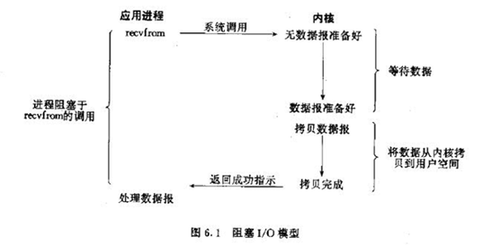
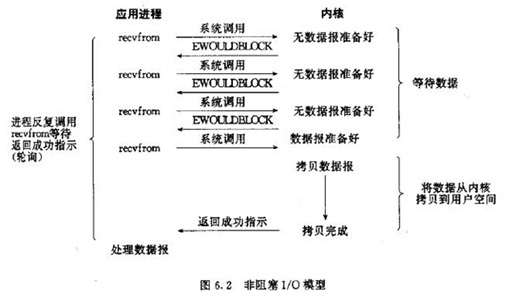
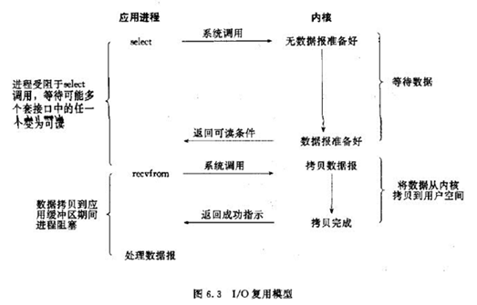

***************************
5种IO模型、阻塞IO和非阻塞IO、同步IO和异步IO
***************************

知识概要
========

.. image:: ./images/io.png

``IO`` ( ``Input/Output`` ，输入/输出)即数据的读取（接收）或写入（发送）操作，通常用户进程中的一个完整 ``IO`` 分为两阶段：用户进程空间<-->内核空间、内核空间<-->设备空间（磁盘、网络等）。 ``IO`` 有内存 ``IO`` 、网络 ``IO`` 和磁盘 ``IO`` 三种，通常我们说的 ``IO`` 指的是后两者。

``LINUX`` 中进程无法直接操作 ``I/O`` 设备，其必须通过系统调用请求 ``kernel`` 来协助完成 ``I/O`` 动作；内核会为每个 ``I/O`` 设备维护一个缓冲区。

对于一个输入操作来说，进程 ``IO`` 系统调用后，内核会先看缓冲区中有没有相应的缓存数据，没有的话再到设备中读取，因为设备 ``IO`` 一般速度较慢，需要等待；内核缓冲区有数据则直接复制到进程空间。

所以，对于一个网络输入操作通常包括两个不同阶段：

1. 等待网络数据到达网卡→读取到内核缓冲区，数据准备好；
2. 从内核缓冲区复制数据到进程空间。

5种IO模型
=========
《UNIX网络编程》说得很清楚，5 种 ``IO`` 模型分别是阻塞 ``IO`` 模型、非阻塞 ``IO`` 模型、 ``IO`` 复用模型、信号驱动的 ``IO`` 模型、异步 ``IO`` 模型；前 4 种为同步 ``IO`` 操作，只有异步 ``IO`` 模型是异步 ``IO`` 操作。下面这样些图，是它里面给出的例子：接收网络 ``UDP`` 数据的流程在 ``IO`` 模型下的分析，在它的基础上再加以简单描述，以区分这些 ``IO`` 模型。

阻塞IO模型
----------

进程发起 ``IO`` 系统调用后，进程被阻塞，转到内核空间处理，整个 ``IO`` 处理完毕后返回进程。操作成功则进程获取到数据。

典型应用：阻塞 ``socket`` 、 ``Java BIO`` ；

特点：

- 进程阻塞挂起不消耗 ``CPU`` 资源，及时响应每个操作；
- 实现难度低、开发应用较容易；
- 适用并发量小的网络应用开发；

不适用并发量大的应用：因为一个请求 ``IO`` 会阻塞进程，所以，得为每请求分配一个处理进程（线程）以及时响应，系统开销大。

非阻塞IO模型
-----------

进程发起 ``IO`` 系统调用后，如果内核缓冲区没有数据，需要到 ``IO`` 设备中读取，进程返回一个错误而不会被阻塞；进程发起 ``IO`` 系统调用后，如果内核缓冲区有数据，内核就会把数据返回进程。

对于上面的阻塞 ``IO`` 模型来说，内核数据没准备好需要进程阻塞的时候，就返回一个错误，以使得进程不被阻塞。

典型应用： ``socket`` 是非阻塞的方式（设置为 ``NONBLOCK`` ）

特点：

- 进程轮询（重复）调用，消耗 ``CPU`` 的资源；
- 实现难度低、开发应用相对阻塞 ``IO`` 模式较难；
- 适用并发量较小、且不需要及时响应的网络应用开发；

IO复用模型
---------

多个的进程的 ``IO`` 可以注册到一个复用器（ ``select`` ）上，然后用一个进程调用该 ``select`` ， ``select`` 会监听所有注册进来的 ``IO`` ；

如果 ``select`` 没有监听的 ``IO`` 在内核缓冲区都没有可读数据， ``select`` 调用进程会被阻塞；而当任一 ``IO`` 在内核缓冲区中有可数据时， ``select`` 调用就会返回；

而后 ``select`` 调用进程可以自己或通知另外的进程（注册进程）来再次发起读取 ``IO`` ，读取内核中准备好的数据。

可以看到，多个进程注册 ``IO`` 后，只有另一个 ``select`` 调用进程被阻塞。

典型应用： ``select`` 、 ``poll`` 、 ``epoll`` 三种方案， ``nginx`` 都可以选择使用这三个方案; ``Java NIO`` ;

特点：

- 专一进程解决多个进程 ``IO`` 的阻塞问题，性能好； ``Reactor`` 模式;
- 实现、开发应用难度较大；
- 适用高并发服务应用开发：一个进程（线程）响应多个请求；

select、poll、epoll

- ``Linux`` 中 ``IO`` 复用的实现方式主要有 ``select`` 、 ``poll`` 和 ``epoll`` ：
- ``Select`` ：注册 ``IO`` 、阻塞扫描，监听的 ``IO`` 最大连接数不能多于 ``FD_SIZE`` ；
- ``Poll`` ：原理和 ``Select`` 相似，没有数量限制，但 ``IO`` 数量大扫描线性性能下降；
- ``Epoll`` ：事件驱动不阻塞， ``mmap`` 实现内核与用户空间的消息传递，数量很大， ``Linux2.6`` 后内核支持；

信号驱动IO模型
--------------

.. image:: ./images/IO-4.png

当进程发起一个 ``IO`` 操作，会向内核注册一个信号处理函数，然后进程返回不阻塞；当内核数据就绪时会发送一个信号给进程，进程便在信号处理函数中调用 ``IO`` 读取数据。

特点：回调机制，实现、开发应用难度大；

异步IO模型
----------

.. image:: ./images/IO-5.png

当进程发起一个 ``IO`` 操作，进程返回（不阻塞），但也不能返回果结；内核把整个 ``IO`` 处理完后，会通知进程结果。如果 ``IO`` 操作成功则进程直接获取到数据。

典型应用： ``JAVA7 AIO`` 、高性能服务器应用

特点：

- 不阻塞，数据一步到位； ``Proactor`` 模式；
- 需要操作系统的底层支持， ``LINUX 2.5`` 版本内核首现，2.6 版本产品的内核标准特性；
- 实现、开发应用难度大；
- 非常适合高性能高并发应用；

IO模型比较
==========

.. image:: ./images/IO-6.png

阻塞IO调用和非阻塞IO调用、阻塞IO模型和非阻塞IO模型
----------------------------------------------

.. note::  注意这里的阻塞IO调用和非阻塞IO调用不是指阻塞IO模型和非阻塞IO模型：

阻塞 ``IO`` 调用 ：在用户进程（线程）中调用执行的时候，进程会等待该 ``IO`` 操作，而使得其他操作无法执行。

非阻塞 ``IO`` 调用：在用户进程中调用执行的时候，无论成功与否，该 ``IO`` 操作会立即返回，之后进程可以进行其他操作（当然如果是读取到数据，一般就接着进行数据处理）。

这个直接理解就好，进程（线程） ``IO`` 调用会不会阻塞进程自己。所以这里两个概念是相对调用进程本身状态来讲的。

从上面对比图片来说，阻塞 ``IO`` 模型是一个阻塞 ``IO`` 调用，而非阻塞 ``IO`` 模型是多个非阻塞 ``IO`` 调用+一个阻塞 ``IO`` 调用，因为多个 ``IO`` 检查会立即返回错误，不会阻塞进程。

而上面也说过了，非阻塞 ``IO`` 模型对于阻塞 ``IO`` 模型来说区别就是，内核数据没准备好需要进程阻塞的时候，就返回一个错误，以使得进程不被阻塞。

同步IO和异步IO
--------------

- 同步 ``IO`` ：导致请求进程阻塞，直到 ``I/O`` 操作完成。
- 异步 ``IO`` ：不导致请求进程阻塞。

上面两个定义是《UNIX网络编程 卷1：套接字联网API》给出的。这不是很好理解，我们来扩展一下，先说说同步和异步，同步和异步关注的是双方的消息通信机制：

- 同步：双方的动作是经过双方协调的，步调一致的。
- 异步：双方并不需要协调，都可以随意进行各自的操作。

这里我们的双方是指，用户进程和 ``IO`` 设备；明确同步和异步之后，我们在上面网络输入操作例子的基础上，进行扩展定义：

同步 ``IO`` ：用户进程发出 ``IO`` 调用，去获取 ``IO`` 设备数据，双方的数据要经过内核缓冲区同步，完全准备好后，再复制返回到用户进程。而复制返回到用户进程会导致请求进程阻塞，直到 ``I/O`` 操作完成。

异步 ``IO`` ：用户进程发出 ``IO`` 调用，去获取 ``IO`` 设备数据，并不需要同步，内核直接复制到进程，整个过程不导致请求进程阻塞。

所以， 阻塞 ``IO`` 模型、非阻塞 ``IO`` 模型、 ``IO`` 复用模型、信号驱动的 ``IO`` 模型者为同步 ``IO`` 模型，只有异步 ``IO`` 模型是异步 ``IO`` 。