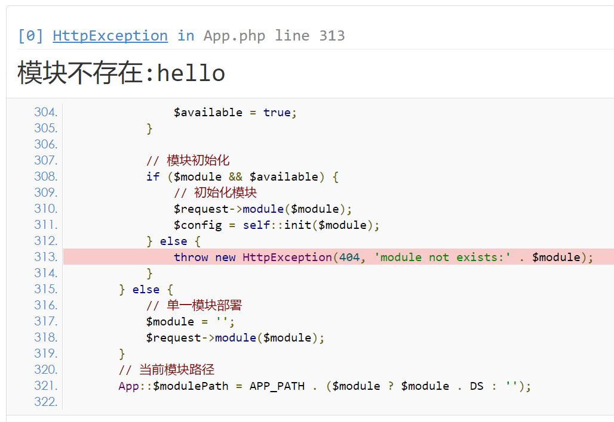
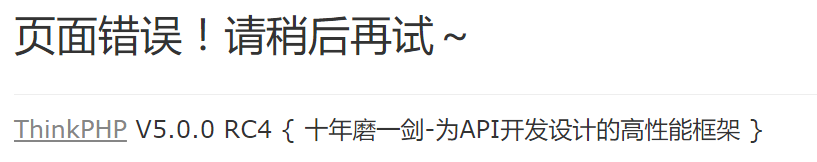
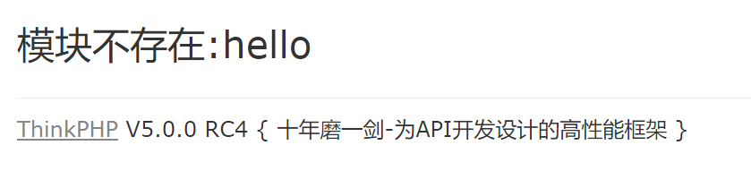
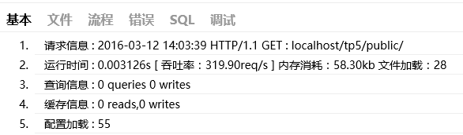
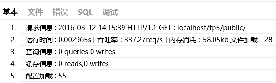
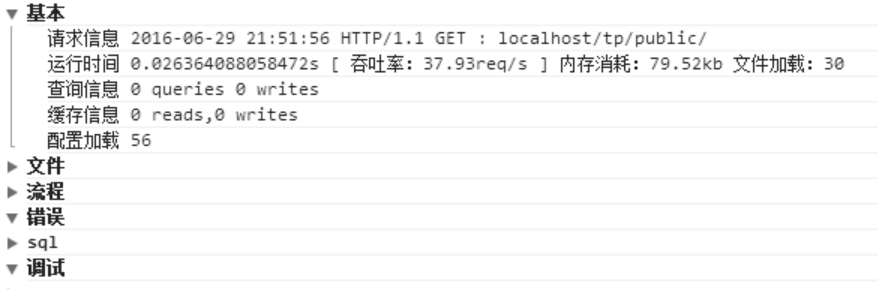
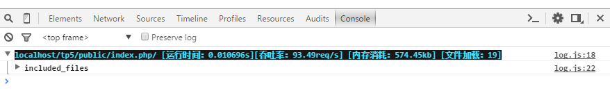
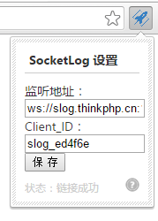

**********
错误和调试
**********

调试模式
========
ThinkPHP 有专门为开发过程而设置的调试模式，开启调试模式后，会牺牲一定的执行效率，但带来的方便和除错功能非常值得。

.. note:: 我们强烈建议 ThinkPHP 开发人员在开发阶段始终开启调试模式（直到正式部署后关闭调试模式），方便及时发现隐患问题和分析、解决问题。

应用默认开启调试模式，在完成开发阶段部署到生产环境后，可以修改应用配置文件的 ``app_debug`` 参数关闭调试模式切换到部署模式。

.. code-block:: php

    <?php
    // 关闭调试模式
    'app_debug' => false,

除此之外，还可以在应用的 ``ROOT_PATH`` 目录下面定义 ``.env`` 文件，并且定义 ``APP_DEBUG`` 配置参数用于替代入口文件的常量定义，这样便于在部署环境中设置环境变量来开启和关闭调试模式。

``.env`` 文件的定义格式如下：

.. code-block:: php

    <?php
    // 设置开启调试模式
    app_debug =  true
    // 其它的环境变量设置

.. note:: 定义了 ``.env`` 文件后，配置文件中定义 ``app_debug`` 参数无效。

调试模式的优势在于：

- 开启日志记录，任何错误信息和调试信息都会详细记录，便于调试；
- 会详细记录整个执行过程；
- 模板修改可以即时生效；
- 记录 SQL 日志，方便分析 SQL ；
- 通过 Trace 功能更好的调试和发现错误；
- 发生异常的时候会显示详细的异常信息；

.. note:: 由于调试模式没有任何缓存，因此涉及到较多的文件 ``IO`` 操作和模板实时编译，所以在开启调试模式的情况下，性能会有一定的下降，但不会影响部署模式的性能。另外需要注意的是，一旦关闭调试模式，项目的调试配置文件即刻失效。

一旦关闭调试模式，发生错误后不会提示具体的错误信息，如果你仍然希望看到具体的错误信息，那么可以如下设置：

.. code-block:: php

    <?php
    // 显示详细错误信息，如果为假，则显示app.error_message定制消息内容
    'show_error_msg'        =>  true,

异常处理
========
和 PHP 默认的异常处理不同， ThinkPHP 抛出的不是单纯的错误信息，而是一个人性化的错误页面。

默认异常处理
------------
在调试模式下，系统默认展示的错误页面：

只有在调试模式下面才能显示具体的错误信息，如果在部署模式下面，你可能看到的是一个简单的提示文字，例如：

.. warning:: 本着严谨的原则，5.0版本默认情况下会对任何错误（包括警告错误）抛出异常，如果不希望如此严谨的抛出异常，可以在应用公共函数文件中或者配置文件中使用 ``error_reporting`` 方法设置错误报错级别（请注意，在入口文件中设置是无效的），例如：

.. code-block:: php

    <?php
    // 异常错误报错级别,
    error_reporting(E_ERROR | E_PARSE );

自定义异常处理
--------------
框架支持异常页面由开发者自定义类进行处理，需要配置参数 ``exception_handle`` 。

.. code-block:: php

    <?php
    // 异常处理handle类 留空使用 \think\exception\Handle
    'exception_handle'       => '\\app\\common\\exception\\Http',

自定义类需要继承 ``Handle`` 并且实现 ``render`` 方法，可以参考如下代码：

.. code-block:: php

    <?php
    namespace app\common\exception;

    use Exception;
    use think\exception\Handle;
    use think\exception\HttpException;
    class Http extends Handle
    {

        public function render(Exception $e)
        {
            // 参数验证错误
            if ($e instanceof ValidateException) {
                return json($e->getError(), 422);
            }

            // 请求异常
            if ($e instanceof HttpException && request()->isAjax()) {
                return response($e->getMessage(), $e->getStatusCode());
            }

            //TODO::开发者对异常的操作
            //可以在此交由系统处理
            return parent::render($e);
        }

    }

.. note:: 需要注意的是，如果配置了 ``exception_handle`` ，且没有再次调用系统 ``render`` 的情况下，配置 ``http_exception_template`` 就不再生效，具体可以参考 ``Handle`` 类内实现的功能。

V5.0.11 版本开始，可以通过闭包定义的方式简化异常自定义处理，例如，上面的自定义异常类可以改为直接配置 ``exception_handle`` 参数：

.. code-block:: php

    <?php
    'exception_handle'  =>  function(Exception $e){
        // 参数验证错误
        if ($e instanceof \think\exception\ValidateException) {
            return json($e->getError(), 422);
        }

        // 请求异常
        if ($e instanceof \think\exception\HttpException && request()->isAjax()) {
            return response($e->getMessage(), $e->getStatusCode());
        }
    }

部署模式显示异常
----------------
一旦关闭调试模式，发生错误后不会提示具体的错误信息，如果你仍然希望看到具体的错误信息，那么可以如下设置：

.. code-block:: php

    <?php
    // 显示错误信息
    'show_error_msg'        =>  true,

异常捕获
--------
可以使用 PHP 的异常捕获进行必要的处理，但需要注意一点，在异常捕获中不要使用 ``think\Controller`` 类的 ``error`` 、 ``success`` 和 ``redirect`` 方法，因为上述三个方法会抛出 ``HttpResponseException`` 异常来中断正常处理流程( ``\traits\controller\Jump`` )，从而影响正常的异常捕获，例如：

.. code-block:: php

    <?php
    try{
        Db::name('user')->find();
        $this->success('执行成功!');
    }catch(\Exception $e){
        $this->error('执行错误');
    }

应该改成

.. code-block:: php

    <?php
    try{
        Db::name('user')->find();
    }catch(\Exception $e){
        $this->error('执行错误');
    }
    $this->success('执行成功!');

抛出异常
========
手动抛出异常
------------
可以使用 ``\think\Exception`` 类来抛出异常

.. code-block:: php

    <?php
    // 使用think自带异常类抛出异常
    throw new \think\Exception('异常消息', 100006);

如果不使用 ``think`` 异常类，也可以定义自己的异常类来抛出异常

.. code-block:: php

    <?php
    throw new \foobar\Exception('异常消息');

也可以使用系统提供的助手函数来简化处理：

.. code-block:: php

    <?php
    exception('异常消息', 100006);

    // 使用自定义异常类
    exception('异常消息', 100006, \foobar\Exceeption);

抛出 HTTP 异常
--------------
可以使用 ``\think\exception\HttpException`` 类来抛出异常

.. code-block:: php

    <?php
    // 抛出 HTTP 异常
    throw new \think\exception\HttpException(404, '异常消息', null, [参数]);

系统提供了助手函数 ``abort`` 简化 ``HTTP`` 异常的处理，例如：

.. code-block:: php

    <?php
    abort(404, '异常消息', [参数])

``HTTP`` 异常可以单独定义异常模板，请参考后面的 ``404`` 页面。

Trace调试
=========
调试模式并不能完全满足我们调试的需要，有时候我们需要手动的输出一些调试信息。除了本身可以借助一些开发工具进行调试外，ThinkPHP 还提供了一些内置的调试工具和函数。例如，Trace 调试功能就是 ThinkPHP 提供给开发人员的一个用于开发调试的辅助工具。可以实时显示当前页面的操作的请求信息、运行情况、SQL执行、错误提示等，并支持自定义显示，5.0版本的 Trace 调试支持没有页面输出的操作调试。

.. note:: ``Trace`` 调试功能对调试模式和部署模式都有效，可以单独开启和关闭。只是在部署模式下面，显示的调试信息没有调试模式完整，通常我们建议 ``Trace`` 配合调试模式一起使用。

开启Trace调试
-------------
默认关闭 ``Trace`` 调试功能，要开启 ``Trace`` 调试功能，只需要配置下面参数：

.. code-block:: php

    <?php
    // 开启应用Trace调试
    'app_trace' =>  true,

.. note:: 如果定义了环境变量 ``app_trace`` ，那么以环境变量配置为准。

页面Trace显示
-------------
要开启页面 ``Trace`` 功能，需要配置 ``trace`` 参数为：

.. code-block:: php

    <?php
    // Trace信息
    'trace'     =>  [
        //支持Html,Console
        'type'  =>  'html',
    ]

设置后并且你的页面有输出的话，页面右下角会显示 ThinkPHP 的 LOGO ：

我们看到的 LOGO 后面的数字就是当前页面的执行时间（单位是秒） 点击该图标后，会展开详细的 Trace 信息，如图：

``Trace`` 框架有6个选项卡，分别是基本、文件、流程、错误、 ``SQL`` 和调试，点击不同的选项卡会切换到不同的 ``Trace`` 信息窗口。

+--------+--------------------------------------------------------------------------+
| 选项卡 | 描述                                                                     |
+========+==========================================================================+
| 基本   | 当前页面的基本摘要信息，例如执行时间、内存开销、文件加载数、查询次数等等 |
+--------+--------------------------------------------------------------------------+
| 文件   | 详细列出当前页面执行过程中加载的文件及其大小                             |
+--------+--------------------------------------------------------------------------+
| 流程   | 会列出当前页面执行到的行为和相关流程                                     |
+--------+--------------------------------------------------------------------------+
| 错误   | 当前页面执行过程中的一些错误信息，包括警告错误                           |
+--------+--------------------------------------------------------------------------+
| SQL    | 当前页面执行到的SQL语句信息                                              |
+--------+--------------------------------------------------------------------------+
| 调试   | 开发人员在程序中进行的调试输出                                           |
+--------+--------------------------------------------------------------------------+

``Trace`` 的选项卡是可以定制和扩展的，默认的配置为：

.. code-block:: php

    <?php
    // 显示Trace信息
    'trace' =>[
        'type'       =>  'Html',
        'trace_tabs' =>  [
             'base'=>'基本',
             'file'=>'文件',
             'info'=>'流程',
             'error|notice'=>'错误',
             'sql'=>'SQL',
             'debug|log'=>'调试'
         ]
    ]

也就是我们看到的默认情况下显示的选项卡，如果你希望增加新的选项卡：用户，则可以修改配置如下：

.. code-block:: php

    <?php
    // 显示Trace信息
    'trace' =>[
        'type'       =>  'Html',
        'trace_tabs' =>  [
             'base'=>'基本',
             'file'=>'文件',
             'info'=>'流程',
             'error'=>'错误',
             'sql'=>'SQL',
             'debug'=>'调试',
             'user'=>'用户'
         ]
    ]

也可以把某几个选项卡合并，例如：

.. code-block:: php

    <?php
    // 显示Trace信息
    'trace' =>[
        'type'       =>  'Html',
        'trace_tabs' =>  [
             'base'=>'基本',
             'file'=>'文件',
             'error|notice'=>'错误',
             'sql'=>'SQL',
             'debug|log|info'=>'调试',
         ]
    ]

更改后的Trace显示效果如图：

浏览器控制台Trace显示
---------------------
``trace`` 功能支持在浏览器的 ``console`` 直接输出，这样可以方便没有页面输出的操作功能调试，只需要设置：

.. code-block:: php

    <?php
    // Trace信息
    'trace' =>[
        // 使用浏览器console输出trace信息
        'type'  =>  'console',
    ]

运行后打开浏览器的 ``console`` 控制台可以看到如图所示的信息：

浏览器控制台 ``Trace`` 输出仍然支持 ``trace_tabs`` 设置。

变量调试
========
除了 ``Trace`` 调试之外，系统还提供了 ``\think\Debug`` 类用于各种调试。

输出某个变量是开发过程中经常会用到的调试方法，除了使用 php 内置的 ``var_dump`` 和 ``print_r`` 之外，ThinkPHP 框架内置了一个对浏览器友好的 ``dump`` 方法，用于输出变量的信息到浏览器查看。

用法：

.. code-block:: php

    <?php
    Debug::dump($var, $echo=true, $label=null)
    或者
    dump($var, $echo=true, $label=null)

相关参数的使用如下：

+---------------+-----------------------------------------------------+
| 参数          | 描述                                                |
+===============+=====================================================+
| var（必须）   | 要输出的变量，支持所有变量类型                      |
+---------------+-----------------------------------------------------+
| echo（可选）  | 是否直接输出，默认为true，如果为false则返回但不输出 |
+---------------+-----------------------------------------------------+
| label（可选） | 变量输出的label标识，默认为空                       |
+---------------+-----------------------------------------------------+

如果 ``echo`` 参数为 ``false`` 则返回要输出的字符串

使用示例：

.. code-block:: php

    <?php
    $blog = Db::name('blog')->where('id', 3)->find();

    Debug::dump($blog);
    // 下面的用法是等效的
    dump($blog);

在浏览器输出的结果是：

.. code-block:: php

    <?php
    array(12) {
       ["id"]            => string(1) "3"
       ["name"]          => string(0) ""
       ["user_id"]       => string(1) "0"
       ["cate_id"]       => string(1) "0"
       ["title"]         => string(4) "test"
       ["content"]       => string(4) "test"
       ["create_time"]   => string(1) "0"
       ["update_time"]   => string(1) "0"
       ["status"]        => string(1) "0"
       ["read_count"]    => string(1) "0"
       ["comment_count"] => string(1) "0"
       ["tags"]          => string(0) ""
    }

如果需要在调试变量输出后中止程序的执行，可以使用 ``halt`` 函数，例如：

.. code-block:: php

    <?php
    $blog = Db::name('blog')->where('id', 3)->find();

    halt($blog);
    echo '这里的信息是看不到的';

执行后会输出

.. code-block:: php

    <?php
    array(12) {
       ["id"]            => string(1) "3"
       ["name"]          => string(0) ""
       ["user_id"]       => string(1) "0"
       ["cate_id"]       => string(1) "0"
       ["title"]         => string(4) "test"
       ["content"]       => string(4) "test"
       ["create_time"]   => string(1) "0"
       ["update_time"]   => string(1) "0"
       ["status"]        => string(1) "0"
       ["read_count"]    => string(1) "0"
       ["comment_count"] => string(1) "0"
       ["tags"]          => string(0) ""
    }

并中止执行后续的程序。

性能调试
========
开发过程中，有些时候为了测试性能，经常需要调试某段代码的运行时间或者内存占用开销，系统提供了 ``think\Debug`` 类可以很方便的获取某个区间的运行时间和内存占用情况。 例如：

.. code-block:: php

    <?php
    Debug::remark('begin');
    // ...其他代码段
    Debug::remark('end');
    // ...也许这里还有其他代码
    // 进行统计区间
    echo Debug::getRangeTime('begin','end').'s';

表示统计 ``begin`` 位置到 ``end`` 位置的执行时间（单位是秒）， ``begin`` 必须是一个已经标记过的位置，如果这个时候 ``end`` 位置还没被标记过，则会自动把当前位置标记为 ``end`` 标签，输出的结果类似于： ``0.0056s``

默认的统计精度是小数点后 4 位，如果觉得这个统计精度不够，还可以设置例如：

.. code-block:: php

    <?php
    echo Debug::getRangeTime('begin','end',6).'s';

可能的输出会变成： ``0.005587s``

如果你的环境支持内存占用统计的话，还可以使用 ``getRangeMem`` 方法进行区间内存开销统计（单位为 kb ），例如：

.. code-block:: php

    <?php
    echo Debug::getRangeMem('begin','end').'kb';

第三个参数使用 ``m`` 表示进行内存开销统计，输出的结果可能是： ``625kb``

同样，如果 ``end`` 标签没有被标记的话，会自动把当前位置先标记位 ``end`` 标签。

助手函数
--------
系统还提供了助手函数 ``debug`` 用于完成相同的作用，上面的代码可以改成：

.. code-block:: php

    <?php
    debug('begin');
    // ...其他代码段
    debug('end');
    // ...也许这里还有其他代码
    // 进行统计区间
    echo debug('begin','end').'s';
    echo debug('begin','end',6).'s';
    echo debug('begin','end','m').'kb';

SQL调试
=======
查看SQL记录
-----------
如果开启了数据库的调试模式的话，可以在日志文件（或者设置的日志输出类型）中看到详细的 SQL 执行记录以及性能分析。

下面是一个典型的 SQL 日志：

.. code-block:: shell

    [ SQL ] SHOW COLUMNS FROM `think_action` [ RunTime:0.001339s ]
    [ EXPLAIN : array ( 'id' => '1', 'select_type' => 'SIMPLE', 'table' => 'think_action', 'partitions' => NULL, 'type' => 'ALL', 'possible_keys' => NULL, 'key' => NULL, 'key_len' => NULL, 'ref' => NULL, 'rows' => '82', 'filtered' => '100.00', 'extra' => NULL, ) ]
    [ SQL ] SELECT * FROM `think_action` LIMIT 1 [ RunTime:0.000539s ]

监听SQL
-------
如果开启数据库的调试模式的话，你可以对数据库执行的任何 SQL 操作进行监听，使用如下方法：

.. code-block:: php

    <?php
    Db::listen(function($sql,$time,$explain){
        // 记录SQL
        echo $sql. ' ['.$time.'s]';
        // 查看性能分析结果
        dump($explain);
    });

.. note:: 默认如果没有注册任何监听操作的话，这些 SQL 执行会被根据不同的日志类型记录到日志中。

调试执行的SQL语句
-----------------
在模型操作中 ，为了更好的查明错误，经常需要查看下最近使用的 SQL 语句，我们可以用 ``getLastsql`` 方法来输出上次执行的 ``sql`` 语句。例如：

.. code-block:: php

    <?php
    User::get(1);
    echo User::getLastSql();

输出结果是 ``SELECT * FROM 'think_user' WHERE 'id' = '1'`` 也可以使用 ``fetchSql`` 方法直接返回当前的查询 SQL 而不执行，例如：

.. code-block:: php

    <?php
    echo User::fetchSql()->find(1);

输出的结果是一样的。

``getLastSql`` 方法只能获取最后执行的 ``SQL`` 记录，如果需要了解更多的 ``SQL`` 日志，可以通过查看当前的 ``Trace`` 信息或者日志文件。

远程调试
========
ThinkPHP5.0 版本开始，提供了 ``SocketLog`` 驱动用于本地和远程调试。

``SocketLog`` 的原理，是在服务器端，应用通过 ``1116`` 端口往 ``WebSocket`` 服务器上写数据，作为客户端的 ``Chrome`` 插件，即通过 ``1229`` 端口能收到数据。所以不管是远程 ``API`` 调用，还是网页访问，只要在程序中往这个 ``WebSocket`` 服务器写了数据，只要监听了这个 ``Websocket`` 服务的客户端都能收到相应的调试日志。

基于 ``websocket`` 实现的远程实时日志系统，可以通过浏览器查看远程移动设备的实时运行日志。

系统由三个部分组成：

1. 服务器：与移动设备和浏览器建立 ``websocket`` 连接，将移动设备 ``websocket`` 上读取的实时日志转发到对应的浏览器的 ``websocket`` 中；
2. 浏览器日志查看页面：与服务器建立 ``websocket`` 连接，通过 ``websocket`` 接收指定设备的实时运行日志并显示；
3. 移动设备：与服务器建立 ``websocket`` 连接，将运行日志通过 ``websocket`` 连接上传至服务器；

Socket调试
----------
只需要在配置文件中设置如下：

.. code-block:: php

    <?php
    'log' =>  [
        'type'                => 'socket',
        'host'                => 'slog.thinkphp.cn', // 这里可以是你安装 WebSocket 服务器的域名或IP
        //日志强制记录到配置的client_id
        'force_client_ids'    => [],
        //限制允许读取日志的client_id
        'allow_client_ids'    => [],
    ]

使用 Chrome 浏览器运行后，打开 ``审查元素->Console`` ，可以看到如下所示：

``SocketLog`` 通过 ``websocket`` 将调试日志打印到浏览器的 ``console`` 中。你还可以用它来分析开源程序，分析 ``SQL`` 性能，结合 ``taint`` 分析程序漏洞。

安装Chrome插件
--------------
``SocketLog`` 首先需要安装 ``chrome`` 插件， ``Chrome`` 插件 `安装页面 <https://chrome.google.com/webstore/detail/socketlog/apkmbfpihjhongonfcgdagliaglghcod>`_

使用方法
--------

1. 首先，请在 ``chrome`` 浏览器上安装好插件。
2. 安装服务端 ``npm install -g socketlog-server`` ， 运行命令 ``socketlog-server`` 即可启动服务。 将会在该服务器中开启一个 ``websocket`` 服务 ，监听端口是 ``1229`` 。以指定的用户在后台运行程序 ``sudo -u nobody socketlog-server > /dev/null &``
3. 如果想服务后台运行: ``socketlog-server > /dev/null &`` 如果你的服务器有防火墙，请开启 ``1229`` 和 ``1116`` 两个端口，这两个端口是 ``socketlog`` 要使用的。
4. ``SocketLog.class.php`` 是发送日志的类库,我们在发送日志的时候，需要载入这个类库然后调用函数 ``slog`` 即可。对于 ThinkPHP5 就不需要了，框架集成了该类。

.. code-block:: php

    <?php
    include './php/slog.function.php';
    slog('hello world');

5. 用 ``slog`` 函数发送日志， 支持多种日志类型：对于ThinkPHP5就不需要了，框架在函数中调用了这些方法。

.. code-block:: php

    <?php
    include './php/slog.function.php';
    slog('msg','log');  //一般日志
    slog('msg','error'); //错误日志
    slog('msg','info'); //信息日志
    slog('msg','warn'); //警告日志
    slog('msg','trace');// 输入日志同时会打出调用栈
    slog('msg','alert');//将日志以alert方式弹出
    slog('msg','log','color:red;font-size:20px;');//自定义日志的样式，第三个参数为css样式

通过上面例子可以看出， slog函数支持三个参数：

- 第一个参数是日志内容，日志内容不光能支持字符串哟，大家如果传递数组,对象等一样可以打印到 ``console`` 中。
- 第二个参数是日志类型，可选，如果没有指定日志类型默认类型为 ``log`` ， 第三个参数是自定样式，在这里写上你自定义 ``css`` 样式即可。

配置参数
--------

- ``client_id`` : 在 chrome 浏览器中，可以设置插件的 ``Client_ID`` ， ``Client_ID`` 是你任意指定的字符串。

- 配置 ``allow_client_ids`` 配置项，让指定的浏览器才能获得日志，这样就可以把调试代码带上线。 普通用户访问不会触发调试，不会发送日志。开发人员访问就能看的调试日志，这样利于找线上 ``bug`` 。 ``Client_ID`` 建议设置为姓名拼命加上随机字符串，这样如果有员工离职可以将其对应的 ``client_id`` 从配置项 ``allow_client_ids`` 中移除。 ``client_id`` 除了姓名拼音，加上随机字符串的目的，以防别人根据你公司员工姓名猜测出 ``client_id`` ,获取线上的调试日志。

.. code-block:: php

    <?php
    slog(array(
      'allow_client_ids'=>array('luofei_zfH5NbLn','easy_DJq0z80H')
      ),'set_config')

- 设置 ``force_client_id`` 配置项，让后台脚本也能输出日志到 ``chrome`` 。网站有可能用了队列，一些业务逻辑通过后台脚本处理， 如果后台脚本需要调试，你也可以将日志打印到浏览器的 ``console`` 中， 当然后台脚本不和浏览器接触，不知道当前触发程序的是哪个浏览器，所以我们需要强制将日志打印到指定 ``client_id`` 的浏览器上面。我们在后台脚本中使用 ``SocketLog`` 时设置 ``force_client_id`` 配置项指定要强制输出浏览器的 ``client_id`` 即可。

.. code-block:: php

    <?php
    slog(array(
      'force_client_id'=>'luofei_zfH5NbLn'
      ),'config');

socketLog ``参考网页 <https://github.com/luofei614/SocketLog>``_ 。

404页面
=======
一旦抛出了 ``HttpException`` 异常，可以支持定义单独的异常页面的模板地址，只需要在应用配置文件中增加：

.. code-block:: php

    <?php
    'http_exception_template'    =>  [
        // 定义404错误的重定向页面地址
        404 =>  APP_PATH.'404.html',
        // 还可以定义其它的HTTP status
        401 =>  APP_PATH.'401.html',
    ]

模板文件支持模板引擎中的标签。

.. note:: ``http_exception_template`` 配置仅在部署模式下面生效。

一般来说 ``HTTP`` 异常是由系统自动抛出的，但我们也可以手动抛出

.. code-block:: php

    throw new \think\exception\HttpException(404, '页面不存在');

或者通过助手函数 ``abort`` 手动抛出 ``HTTP`` 异常，例如：

.. code-block:: php

    abort(404,'页面不存在');

