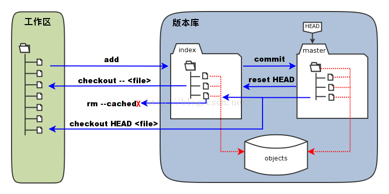

***********
git命令图解
***********

git基本概念
==========

- 工作区(Working directory)：将一个文件夹通过 ``git init`` 设置成一个git可以管理的文件夹时，这个文件夹里的内容就是工作区。
- 暂存区(stage/index)：暂存区，叫 ``stage`` 或者 ``index`` ，是用来暂时存放工作区中修改的内容；

https://www.cnblogs.com/chenwolong/p/GIT.html
https://www.cnblogs.com/toward-the-sun/p/6599656.html
http://marklodato.github.io/visual-git-guide/index-zh-cn.html

