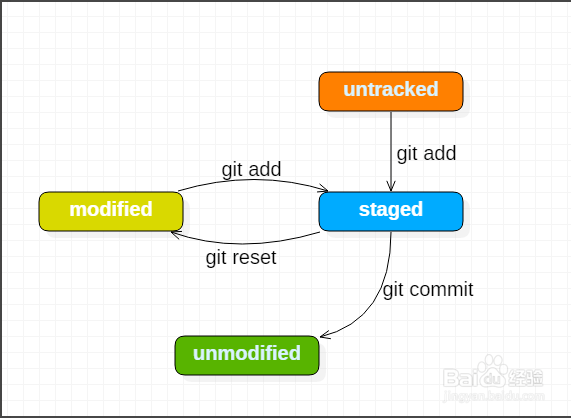
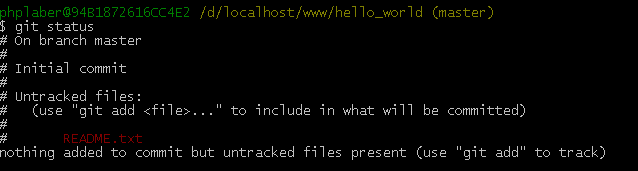
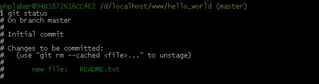
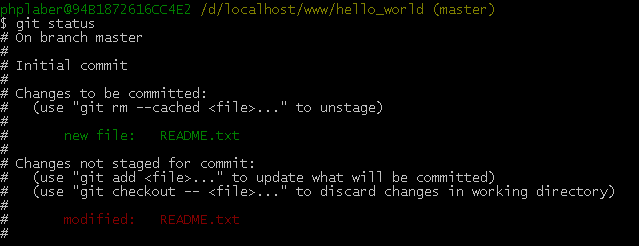

**********
git文件的四种状态
**********

- ``Untracked`` ：未跟踪，此文件在工作目录中，但并没有加入到 ``git`` 库，不参与版本控制。通过 ``git add`` 状态变为 ``Staged`` ；
- ``Unmodify`` ：文件已经入库且未修改，即版本库中的文件快照内容与文件夹中完全一致，这种类型的文件有两种去处， 如果它被修改，而变为 ``Modified`` 。如果使用 ``git rm`` 删除在暂存区的该文件，则成为 ``Untracked`` 文件；
- ``Modified`` ：文件已修改，仅仅是修改，并没有进行其它的操作。这个文件也有两个去处，通过 ``git add`` 可进入暂存 ``staged`` 状态，使用 ``git checkout`` 则丢弃该修改，返回到 ``unmodify`` 状态，这个 ``git checkout`` 即从库中取出文件，覆盖当前修改；
- ``Staged`` ：暂存状态。执行 ``git commit`` 则将修改同步到库中，这时库中的文件和本地文件又变为一致， 文件为 ``Unmodify`` 状态。执行 ``git reset HEAD filename`` 取消暂存，文件状态为 ``Modified`` ；

为了说明的方便，现在初始化一个项目，也就是将项目所在目录纳入 ``Git`` 的管理之下。假设项目目录为 ``hello_world`` ，初始化之后，在目录下新建 ``README.txt`` 文件，接着，使用 ``git status`` 查看文件状态，如图：

可以看到， ``Git`` 友好的标示出 ``README.txt`` 为 ``Untracked files`` ，并且提示使用 ``git add <file>...`` 的命令将文件包含到待提交清单中。按照提示，使用 ``git add README.txt`` 命令，然后，使用 ``git status`` 查看文件状态，如图：

文件 ``README.txt`` 状态变成了 ``Changes to be committed`` ，也就是说 ``README.txt`` 在暂存区域生成了快照，等待被提交。正如 ``Git`` 所提示的那样，通过 ``git rm --cached README.txt`` 命令，不是将文件状态还原为未暂存状态而是将暂存区文件删除。现在， ``README.txt`` 已经可以被提交到 ``git`` 目录中了，但是暂时不提交。打开 ``README.txt`` ，向其中加些内容，保存之后，用 ``git status`` 查看，返回如图信息：

可以看到，除了之前的 ``Changes to be committed`` 状态，现在又多了一条 ``Changes not staged for commit`` 状态，表明文件已经修改，但是还没有放入暂存区域，也就是没生成快照。如果现在进行 ``commit`` 操作，只是将修改之前的文件快照提交到了 ``git`` 目录，一定记住：只有暂存区域的文件（即：文件状态为 ``Changes to be committed`` ）才会被提交。正如提示，通过 ``git add README.txt`` 命令将修改文件更新到暂存区域中，如果想撤销修改，可以使用 ``git checkout -- README.txt`` 命令，该命令将暂存区文件覆盖工作区文件。

- ``git reset --soft HEAD~`` 仅仅是向前移动一个提交；它本质上是撤销了上一次 git commit 命令。 当你在运行 git commit 时，Git 会创建一个新的提交，并移动 HEAD 所指向的分支来使其指向该提交。
- ``git reset HEAD~`` 向前移动一个提交并覆盖暂存区内容；它依然会撤销一上次提交，但还会取消所有暂存。 于是，我们回滚到了所有 git add 和 git commit 的命令执行之前。
- ``git reset --hard HEAD~`` 向前移动一个提交并覆盖暂存区和工作目录内容；它强制覆盖了工作目录中的文件。

- ``git stash`` 会把所有未提交的修改（包括暂存的和非暂存的）都保存起来，然后恢复当前工作目录为版本库中的版本。实际应用中推荐给每个 ``stash`` 加一个 ``message`` ，用于记录版本，使用 ``git stash save 'message'`` 取代 ``git stash`` 命令
- ``git stash pop`` 命令恢复之前缓存的工作目录，好像不会删除？注意，对于暂存区的内容会合并冲突，而对于工作目录的内容，则会放弃恢复，即不会合并。
- ``git stash list`` 查看现有 ``stash`` ；
- 可以使用 ``git stash drop`` 命令删除 ``stash`` ，后面可以跟着 ``stash`` 名字。
- 在使用 ``git stash apply`` 命令时可以通过名字指定使用哪个 ``stash`` ，默认使用最近的 ``stash`` （即 ``stash@{0}`` ）

参考： https://blog.csdn.net/longintchar/article/details/81843048

笔记： https://blog.csdn.net/longintchar/article/category/7883282/1?

