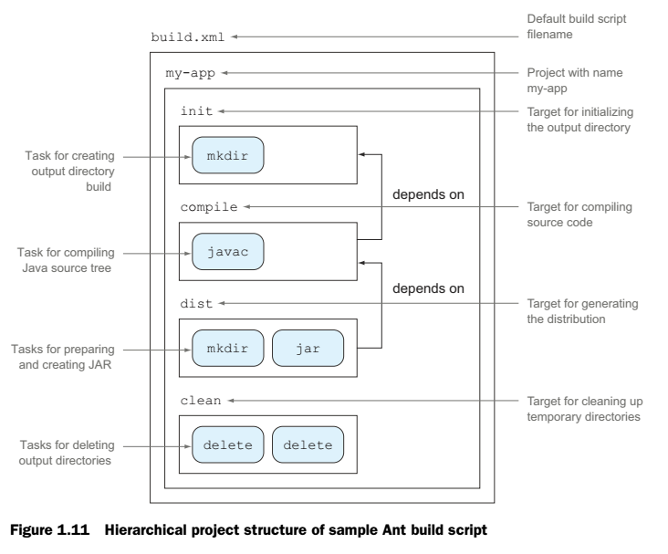
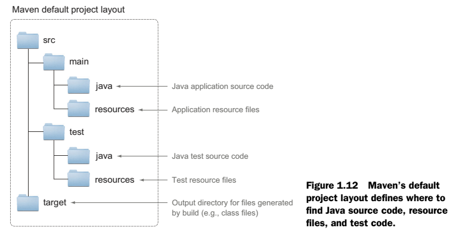
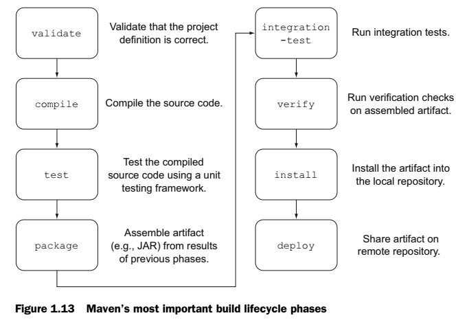
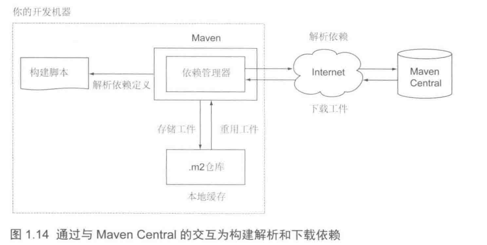

**************
项目自动化介绍
**************

Apache Ant
==========
它是一个而用Java编写的开源构建工具。其主要目的是在Java项目中为常用任务提供自动化，例如编译源代码、运行单元测试、打包JAR文件和生成Javadoc文档。另外，它还为文件系统和存档操作提供了许多不同的预定义任务。如果任何一个任务不满足需求，那么你就可以用Java写新的任务来扩展构建。

虽然Ant的核心是用Java编写的，但是build文件是通过XML表示的，这样就可以在任务运行时环境下使用了。Ant不提供依赖管理器，所以，你需要自己管理外部依赖。然而，Ant可以和另一个Apache项目Ivy很好的集成，它是一个完善且独立的依赖管理器。要集成Ant和Ivy需要一些额外的工作，而且要为每个独立的项目手动配置。

一个构建脚本由三个基本元素组成：一个project、多个target和可用的task。

在Ant中，task是一段可执行的代码——例如，创建一个目录或者移动一个文件。在构建脚本中，通过预定义的XML标签名来使用一个task。task的行为可以由其暴露出来的属性配置。下面的代码片段展示了如何在构建脚本中调用javac的task来编译Java代码：

.. code-block:: xml

    <javac srcdir="src" destdir="dest" />

Ant自身带有许多预定义的task，然而你也可以用Java语言编写自己的task以扩展脚本功能。

target是你想要执行的task的一个集合，可以把它想成一个逻辑组。当在命令行中运行Ant时，提供了你想要运行的target的名字。通过声明target之间的依赖关系，就可以创建一个完整的命令链。如：

.. code-block:: xml

    <target name="init">
        <mkdir dir="build" /> // 这里是创建build文件夹
    </target>

    <target name="compile" depends="init">
        <javac srcdir="src" destdir="build" /> // 这里是编译源代码并依赖于init
    </target>

project 是对于所有Ant项目都必要的容器。它是Ant脚本的顶级元素，包含一个或多个target。在每个构建脚本中，你只能定义一个 project 。如：

.. code-block:: xml

    <project name="example-build">
        <target name="init">
            <mkdir dir="build" />
        </target>

        <target name="compile" depends="init">
            <javac srcdir="src" destdir="build" />
        </target>
    </project>

构建脚本样例
------------
假设你想要写这样一个脚本，用Java编译器去编译src目录下的Java源代码，并将结果放在输出目录build中。Java源代码中有一个类依赖于 Apache Commons Lang 类库。将类库中的JAR文件放置在classpath路径下，这样编译器就知道该类库的存在了。在编译完成之后，你想要组装一个JAR文件。对于每一个工作单元，源代码编译和JAR文件的组装都会被分配到一个独立的target中。你还需要添加另外两个target去做初始化和对输出目录进行清理。

.. code-block:: xml

    <project name="my-app" default="dist" basedir=".">
        <property name="src" location="src" />
        <property name="build" location="build" />
        <property name="dist" location="dist" />
        <property name="version" value="1.0" />

        <target name="init">
            <mkdir dir="${build}" />
        </target>

        <target name="compile" depends="init" description="compile the source">
            <javac srcdir="${src}" destdir="${build}" classpath="lib/commons-lang3-3.1.jar" includeantruntime="false" />
        </target>

        <target name="dist" depends="compile" description="generate the distribution">
            <mkdir dir="${dist}" />
            <jar jarfile="${dist}/my-app-${version}.jar" basedir="${build}" />
        </target>

        <target name="clean" description="clean up">
            <delete dir="${build}" />
            <delete dir="${dist}" />
        </target>
    </project>

Ant没有对如何定义构建的结构强加任何限制。这样让适应一个现有的项目结构变得简单。例如，在样例脚本中，源代码目录和输出目录是随意选择的。通过修改相关的属性可以非常轻松地改变它们。对于target的定义也是一样的；对于每个target，那个逻辑需要被执行，以及它们的执行顺序，你拥有完全灵活的选择性。

缺点
----

- 使用XML作为构建逻辑的定义语言相比于其他更简单的定义语言，会导致构建脚本过于臃肿和啰嗦。
- 复杂的构建逻辑会导致又长又难以维护的构建脚本。当尝试使用标记语言去定义类似if-then/if-then-else的逻辑语句时，它完全就成了一种负担。
- Ant没有提供任何指导来告诉你如何建设项目。在一个企业级配置中，这常常会导致一个build文件每一次看上去都不一样。
- 你想要知道在构建中有多少个类被编译或者多少个task被执行。Ant没有暴露任何的API能够让你在运行时获取内存模型中的信息。
- 在没有Ivy的情况下，使用Ant很难管理依赖。在通常情况下，你需要将JAR文件提交到版本控制系统中，并且手动管理组织结构。

Apache Maven
============
Maven团队认识到标准化项目布局和统一构建生命周期的必要性。Maven选择约定优于配置的思想，这意味着它为你的项目配置和行为提供了有意义的默认值。项目自然而然就知道去那些目录寻找源代码以及构建运行时有那些task去执行。如果你的项目遵循默认值，那么只需要写几行XML就可以构建一个完整的项目。另外，Maven也拥有为应用产生包含Javadoc在内的HTML格式项目文档的能力。

Maven的核心功能可以通过开发定制的插件来扩展。

标准的目录布局
--------------
通过引入一个默认的项目布局，Maven确保每个拥有Maven知识的开发人员可以立刻知道去哪里找什么类型的文件。例如，Java应用程序源代码的目录是 ``src/main/java`` 。所有默认的目录都是可配置的。

构建生命周期
------------
Maven基于构建生命周期的思想。每个项目都确切知道有那些步骤去执行构建、打包和发布应用程序，包括如下功能：

- 编译源代码；
- 运行单元测试和集成测试；
- 组装工件(如，JAR文件)；
- 将工件部署到本地仓库；
- 将工件发布到远程仓库；

在构建生命周期中每个步骤都称作一个阶段。这些阶段会被有序地执行。当在命令行中运行构建时，你想要执行的阶段是固定的。假设你调用打包这个阶段，Maven会自动确定它所依赖的阶段如编译源代码和运行测试事先被执行。如下图所示：

依赖管理
---------
在Maven项目中，所需要的外部依赖库都在构建脚本中定义。例如，如果项目需要Hibernate，那么你可以在依赖配置块中简单地定义它的独立工件坐标，比如组织名、工件名和版本。

.. code-block:: xml

    <dependencies>
        <dependency>
            <groupId>org.hibernate</groupId>
            <artifactId>hibernate-core</artifactId>
            <version>4.1.7.Final</version>
        </dependency>
    </dependencies>

在运行时，声明的类库和它们的传递依赖会由Maven的依赖管理器下载，保存到本地缓存中，这样你的构建就可以使用它们(如，编译源代码)。 Maven 预配置从 Maven Central 下载依赖。接下来构建会从本地缓存中重用已存在的工件，因此不用再连接 Maven Central 。

构建脚本样例
------------
下面是一个Maven构建脚本，名字是pom.xml，它实现了和Ant构建脚本相同的功能。记住，这里要遵循默认约定，所以Maven会去 ``src/main/java`` 目录中寻找源代码，而不是src。

.. code-block:: xml

    <project xmlns="http://maven.apache.org/POM/4.0.0"
            ➥ xmlns:xsi="http://www.w3.org/2001/XMLSchema-instance"
            ➥ xsi:schemaLocation="http://maven.apache.org/POM/4.0.0
            ➥ http://maven.apache.org/xsd/maven-4.0.0.xsd">
        <modelVersion>4.0.0</modelVersion>
        <groupId>com.mycompany.app</groupId>
        <artifactId>my-app</artifactId>
        <packaging>jar</packaging>
        <version>1.0</version>
        <dependencies>
        <dependency>
            <groupId>org.apache.commons</groupId>
            <artifactId>commons-lang3</artifactId>
            <version>3.1</version>
            <scope>compile</scope>
        </dependency>
        </dependencies>
    </project>

缺点
----

- Maven推荐一个默认的结构和生命周期，常常会太过限制，也许不适合你的项目需求；
- 为Maven写定制的扩展过于累赘。你需要去学习Mojos(Maven的内部扩展API)，如何提供一个插件描述符，以及相关的特殊注解，以便提供扩展实现所需的数据；
- Maven的早期版本（低于2.0.9）会自动尝试更新它们自己的核心插件，例如，将单元测试的支持插件升级到最新版本。这可能会导致脆弱和不稳定的构建；

对下一代构建工具的需求
======================
要么你选择完全灵活且可扩展，但很难实现项目标准化，有一段公式化代码，并且没有依赖管理支持的Ant，要么选择Maven，它能提供约定优于配置的方式和无缝的依赖管理器集成，但过于限制思维和拥有臃肿的插件系统。

下面的特性是一个演变的构建工具应该提供的：

- 具有表达性、声明式、可维护的构建语言；
- 标准化的项目布局和生命周期，但是具有完全的灵活性和对默认指定额完全可配置型；
- 拥有易用且灵活的方式去实现定制逻辑；
- 支持构建由多个项目组成的项目结构；
- 支持依赖管理；
- 能很好的集成和迁移现有的构建基础设施，包括能够引入现有的Ant构建脚本和可以将现有的Ant或Maven逻辑转换成其自身规则集的工具；
- 强调可扩展性和高效率的构建。如果你的项目需要长时间构建，这一点很重要，某些大型的企业级项目就是这样；

下一代构建工具Gradle
=====================

为什么使用Gradle
-----------------

.. code-block:: xml

    <project xmlns="http://maven.apache.org/POM/4.0.0"
             xmlns:xsi="http://www.w3.org/2001/XMLSchema-instance"
             xsi:schemaLocation="http://maven.apache.org/POM/4.0.0
    http://maven.apache.org/xsd/maven-4.0.0.xsd">
        <modelVersion>4.0.0</modelVersion>
        <groupId>com.mycompany.app</groupId>
        <artifactId>my-app</artifactId>
        <packaging>jar</packaging>
        <version>1.0-SNAPSHOT</version>
        <dependencies>
            <dependency>
                <groupId>junit</groupId>
                <artifactId>junit</artifactId>
                <version>4.11</version>
                <scope>test</scope>
            </dependency>
        </dependencies>
    </project>

Gradle配置

.. code-block:: groovy

    apply plugin: 'java'
    group = 'com.mycompany.app'
    archivesBaseName = 'my-app'
    version = '1.0-SNAPSHOT'

    repositories {
        mavenCentral()
    }

    dependencies {
        testCompile 'junit:junit:4.11'
    }

安装Gradle
----------
首先，确保你已经安装了JDK1.5或以上版本。创建GRADLE_HOME环境变量，指向gradle二进制文件：

- 在linux系统中，可以在 ``~/.profile`` 文件中。假设你将 Gradle 安装到 ``/opt/gradle`` 目录下

    export GRADLE_HOME=/opt/gradle
    export PATH=$PATH:$GRADLE_HOME/bin

- 在Windows系统中，在环境变量对话框中，定义环境变量 ``GRADLE_HOME`` ，更新路径设置。

然后，运行 gradel -v 命令来查看Gradle、JVM和操作系统的元信息。

.. note:: 设置 Gradle 的 JVM 选项信息，和其它 Java 应用一样， Gradle 同样适用由环境变量 ``JAVA_OPTS`` 设置的 JVM 选项。如果你想要传递特定参数给 Gradle 运行时，则使用环境变量 ``GRADLE_OPTS`` 。假设你想要增加默认的最大堆内存到1GB，则可以这样设置： GRADLE_OPTS="-Xmx1024m" 。更好的方式是将变量添加到 ``$GRADLE_HOME/bin`` 目录下的 Gradle 启动脚本中。

开始使用Gradle
--------------
每个 ``Gradle`` 构建都是以一个脚本开始的。 ``Gradle`` 构建脚本默认的名字是 ``build.gradle`` 。当在 ``shell`` 中执行 ``gradle`` 命令时， ``Gradle`` 会去寻找名字是 ``build.gradle`` 的文件。如果找不到，就会显示一个帮助信息。

