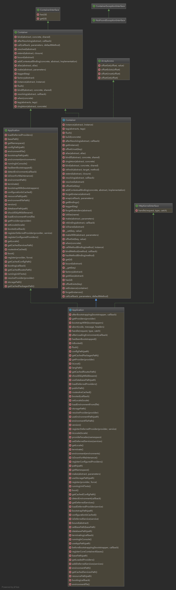

******
容器原理分析
******

``\Psr\Container\ContainerInterface`` 接口方法：

- ``get($id)`` ：通过标识查找容器实体。如果没有该标识，则抛出 ``NotFoundExceptionInterface`` ；如果有该标识，但解析错误，则抛出 ``ContainerExceptionInterface`` ；
- has($id) ：如果容器能够返回指定标识的实体，则返回true，否则返回false。该函数返回真，不代表get()方法一定不会抛出异常，它只是不会抛出 ``NotFoundExceptionInterface`` 异常，但可能抛出 ``ContainerExceptionInterface`` 异常。

``\Illuminate\Contracts\Container\Container`` 接口方法：

- ``addContextualBinding($concrete, $abstract, $implementation)`` ：增加一个上下文绑定到容器；
- ``afterResolving($abstract, Closure $callback = null)`` ：注册一个after解析回调，可以是全局或者指定类型被解析后调用；
- ``alias($abstract, $alias)`` ：给指定抽象类型指定别名；
- ``bind($abstract, $concrete = null, $shared = false)`` ：注册一个绑定到容器；
- ``bindIf($abstract, $concrete = null, $shared = false)`` ：如果没有注册，则注册一个绑定到容器；
- ``bound($abstract)`` ：确定指定的抽象类型是否已经被绑定；
- ``call($callback, array $parameters = [], $defaultMethod = null)`` ：调用给定的闭包/class@method方法并注入参数依赖；
- ``extend($abstract, Closure $closure)`` ：在容器中扩展一个抽象类型；
- ``factory($abstract)`` ：从容器中获取一个闭包来解析给定的类型；
- ``flush()`` ：清空所有绑定和已经解析的实例对象；
- ``instance($abstract, $instance)`` ：在容器中注册一个存在的对象为共享实例；
- ``make($abstract, array $parameters = [])`` ：在容器中解析指定的类型；
- ``resolved($abstract)`` ：确定指定的抽象类型是否已经被解析；
- ``resolving($abstract, Closure $callback = null)`` ：注册一个解析回调；
- ``singleton($abstract, $concrete = null)`` ：注册一个共享绑定；
- ``tag($abstracts, $tags)`` ：将一组标签分配给指定的绑定；
- ``tagged($tag)`` ：解析给定标签中所有的绑定；
- ``when($concrete)`` ：定义一个上下文绑定；

``\Illuminate\Container\Container`` 接口方法：

- ``__get($key)`` ：这个方法用来获取私有成员属性值的,有一个参数，参数传入你要获取的成员属性的名称，返回获取的属性值。如果成员属性不封装成私有的，对象本身就不会去自动调用这个方法。
- ``__set($key, $value)`` ：这个方法用来为私有成员属性设置值的，有两个参数，第一个参数为你要为设置值的属性名，第二个参数是要给属性设置的值，没有返回值。(key=>value)；

支持数组形式访问：

- ``offsetGet($key)`` ：通过类标识来返回实例对象；
- ``offsetSet($key, $value)`` ：绑定实例；
- ``offsetExists($key)`` ：确定给定的抽象类型是否已经绑定；
- ``offsetUnset($key)`` ：清空绑定和已经解析的实例；

实例化方法：

- ``make($abstract, array $parameters = [])`` ：在容器中解析指定的类型；
- ``makeWith($abstract, array $parameters = [])`` ：make方法别名，可以带覆盖参数；
- ``offsetGet($key)`` ：通过类标识来返回实例对象；
- ``call($callback, array $parameters = [], $defaultMethod = null)`` ：调用给定的闭包/class@method方法并注入参数依赖；
- ``tagged($tag)`` ：解析给定标签中所有的绑定；

注册回调：

- ``resolving($abstract, Closure $callback = null)`` ：注册一个解析回调；
- ``afterResolving($abstract, Closure $callback = null)`` ：注册一个after解析回调，可以是全局或者指定类型被解析后调用；
- ``rebinding($abstract, Closure $callback)`` ：为重新绑定事件绑定一个新的回调；

判断状态：

- ``resolved($abstract)`` ：确定指定的抽象类型是否已经被解析；
- ``bound($abstract)`` ：确定指定的抽象类型是否已经被绑定；
- ``isAlias($name)`` ：判断给定的名称是否是别名；
- ``isShared($abstract)`` ：判断给定的类型是否是共享实例；

绑定：

- ``alias($abstract, $alias)`` ：给指定抽象类型指定别名；
- ``bind($abstract, $concrete = null, $shared = false)`` ：注册一个绑定到容器；
- ``bindIf($abstract, $concrete = null, $shared = false)`` ：如果没有注册，则注册一个绑定到容器；
- ``singleton($abstract, $concrete = null)`` ：注册一个共享绑定；
- ``instance($abstract, $instance)`` ：在容器中注册一个存在的对象为共享实例；
- ``when($concrete)`` ：定义一个上下文绑定；
- ``tag($abstracts, $tags)`` ：将一组标签分配给指定的绑定；
- ``offsetSet($key, $value)`` ：绑定实例；
- ``extend($abstract, Closure $closure)`` ：在容器中扩展一个抽象类型；
- ``bindMethod($method, $callback)`` ：

- ``build($concrete)`` ：对于具体类型或者闭包，使用该方法初始化类；
- ``callMethodBinding($method, $instance)`` ：调用给定方法绑定；
- ``forgetExtenders($abstract)`` ：移除给定类型所有扩展回调；
- ``forgetInstance($abstract)`` ：移除一个已经解析的单例；
- ``forgetInstances()`` ：清除所有单例；
- ``get($id)`` ：获取指定实例；
- ``getAlias($abstract)`` ：获取指定类的别名；
- ``getBindings()`` ：获取容器的所有绑定；
- ``getInstance()`` ：获取容器全局可用的实例；
- ``has($id)`` ：指定类型是否已经绑定；
- ``hasMethodBinding($method)`` ：指定的方法是否已经绑定；
- ``refresh($abstract, $target, $method)`` ：刷新给定目标中的实例；
- ``setInstance(ContainerContract $container = null)`` ：设置容器的单例；
- ``wrap(Closure $callback, array $parameters = [])`` ：包装给定的闭包，以便在执行时注入其依赖项。

``\Illuminate\Contracts\Foundation\Application`` 接口方法：

- ``basePath()`` ：获取应用根路径；
- ``boot()`` ：启动应用服务提供器；该函数会标识应用完全启动完成。服务启动之前会触发bootingCallbacks回调，启动之后会触发bootedCallbacks回调；
- ``booted($callback)`` ：注册应用服务启动器启动后的回调函数；
- ``booting($callback)`` ：注册应用服务启动器启动前的回调函数；
- ``environment()`` ：获取或检查当前应用环境；
- ``getCachedPackagesPath()`` ：获取缓存包文件 packages.php 路径；
- ``getCachedServicesPath()`` ：获取缓存服务文件 services.php 路径；
- ``isDownForMaintenance()`` ：判断应用当前是否是维护状态；
- ``register($provider, $options = [], $force = false)`` ：在应用程序中注册服务提供器；
- ``registerConfiguredProviders()`` ：注册所有配置的提供器；
- ``registerDeferredProvider($provider, $service = null)`` ：注册延迟提供器和服务；
- ``runningInConsole()`` ：确定是否运行在控制台中；
- ``version()`` ：当前应用版本；

``\Illuminate\Foundation\Application`` 类实现方法：

- ``abort($code, $message = '', array $headers = [])`` ：抛出带有给定数据的 ``HttpException`` 异常；

- ``beforeBootstrapping($bootstrapper, Closure $callback)`` ：注册一个在启动器运行之前执行的回调；
- ``afterBootstrapping($bootstrapper, Closure $callback)`` ：注册一个在启动器运行之后执行的回调；

- ``bootstrapWith(array $bootstrappers)`` ：运行给定的引导类数组，该函数会标识应用基本启动完成。在每个引导器启动前后都会触发指定的事件；

- ``configureMonologUsing(callable $callback)`` ：定义一个用来配置 Monolog 的回调；
- ``hasMonologConfigurator()`` ：判断是否存在自定义 Monolog 配置器；
- ``getMonologConfigurator()`` ：获取应用自定义 Monolog 配置器；

- ``detectEnvironment(Closure $callback)`` ：检测应用的当前环境；
- ``environmentFile()`` ：获取应用使用的环境文件；
- ``environmentPath()`` ：获取应用使用的环境目录路径；
- ``environmentFilePath()`` ：获取应用环境文件路径；
- ``useEnvironmentPath($path)`` ：设置应用使用的环境目录路径；
- ``loadEnvironmentFrom($file)`` ：设置应用使用的环境文件；
- ``afterLoadingEnvironment(Closure $callback)`` ：注册一个在加载环境之后运行的回调；
- ``isLocal()`` ：判断应用是否运行在本地环境；
- ``runningUnitTests()`` ：判断是否运行在单元测试环境；

- ``setDeferredServices(array $services)`` ：为应用设置延迟服务；
- ``addDeferredServices(array $services)`` ：给应用增加多个延迟服务；
- ``getDeferredServices()`` ：获取应用的延迟服务；
- ``getLoadedProviders()`` ：获取已经加载的服务提供器；
- ``loadDeferredProvider($service)`` ：加载并启动延迟服务提供器；
- ``loadDeferredProviders()`` ：加载并启动所有的延迟服务提供器；
- ``isDeferredService($service)`` ：判断给定的服务是否是延迟服务；

- ``getNamespace()`` ：获取应用的命名空间；
- ``getProvider($provider)`` ：获取注册的服务提供器实例；如果存在多个，只返回第一个。
- ``getProviders($provider)`` ：获取注册的服务提供器实例；如果存在多个，则返回数组。
- ``hasBeenBootstrapped()`` ：判断应用是否基本启动；
- ``isBooted()`` ：判断应用是否完全启动；

- ``isDownForMaintenance()`` ：判断当前应用是否是维护状态；

- ``setLocale($locale)`` ：设置当前应用的语言；
- ``getLocale()`` ：获取应用的语言设置；
- ``isLocale($locale)`` ：判断应用使用的语言是否是给定的语言；
- ``langPath()`` ：获取语言文件的路径；

- ``provideFacades($namespace)`` ：配置实时门面命名空间；

- ``registerConfiguredProviders()`` ：注册配置文件中的服务提供器；
- ``registerCoreContainerAliases()`` ：建立核心类别名映射关系；
- ``resolveProvider($provider)`` ：使用类名来解析服务提供器；

- ``setBasePath($basePath)`` ：为应用所有目录设置基础路径；
- ``path($path = '')`` ：获取app目录路径；
- ``publicPath()`` ：获取public目录路径；
- ``resourcePath($path = '')`` ：获取资源目录路径；
- ``useStoragePath($path)`` ：设置应用存储目录路径；
- ``storagePath()`` ：获取应用存储目录路径；
- ``useDatabasePath($path)`` ：设置数据库目录路径；
- ``databasePath($path = '')`` ：获取数据库目录路径；
- ``bootstrapPath($path = '')`` ：获取 bootstrap 目录路径；
- ``configPath($path = '')`` ：获取配置目录路径；
- ``configurationIsCached()`` ：确定配置是否已经缓存；
- ``routesAreCached()`` ：判断路由是否被缓存；
- ``getCachedConfigPath()`` ：获取配置缓存文件路径；
- ``getCachedPackagesPath()`` ：获取包缓存文件路径；
- ``getCachedRoutesPath()`` ：获取路由缓存文件路径；
- ``getCachedServicesPath()`` ：获取服务缓存文件路径；

- ``terminating(Closure $callback)`` ：注册结束回调到应用；
- ``terminate()`` ：调用结束回调来结束应用；

- ``shouldSkipMiddleware()`` ：判断应用是否跳过中间件；

Laravel服务容器主要承担两个作用：绑定与解析：

绑定
====
所谓的绑定就是将接口与实现建立对应关系。几乎所有的服务容器绑定都是在服务提供者中完成，也就是在服务提供者中绑定。

.. note:: 如果一个类没有基于任何接口那么就没有必要将其绑定到容器。容器并不需要被告知如何构建对象，因为它会使用 PHP 的反射服务自动解析出具体的对象。

也就是说，如果需要依赖注入的外部资源如果没有接口，那么就不需要绑定，直接利用服务容器进行解析就可以了，服务容器会根据类名利用反射对其进行自动构造。

bind绑定
--------
绑定有多种方法，首先最常用的是 ``bind`` 函数的绑定：

绑定自身
^^^^^^^^

.. code-block:: php

    $this->app->bind('App\Services\RedisEventPusher', null);

绑定闭包
^^^^^^^^

.. code-block:: php

	$this->app->bind('name', function () {
	  return 'Taylor';
	});//闭包返回变量

	$this->app->bind('HelpSpot\API', function () {
	  return HelpSpot\API::class;
	});//闭包直接提供类实现类

	$this->app->bind('HelpSpot\API', function () {
	  return new HelpSpot\API();
	});//闭包直接提供类实例

	$this->app->bind('HelpSpot\API', function ($app) {
	  return new HelpSpot\API($app->make('HttpClient'));
	});//闭包返回需要依赖注入的类实例

注意：通过 ``bind`` 方法第二个参数不能直接传入基本类型值。

.. code-block:: php

    $container->bind('test', 'diaomao'); // 错误

绑定接口
^^^^^^^^

.. code-block:: php

	public function testCanBuildWithoutParameterStackWithConstructors()
	{
	  $container = new Container;
	  $container->bind('Illuminate\Tests\Container\IContainerContractStub',
	                   'Illuminate\Tests\Container\ContainerImplementationStub');

	  $this->assertInstanceOf(ContainerDependentStub::class,
	                          $container->build(ContainerDependentStub::class));
	}

	interface IContainerContractStub
	{
	}

	class ContainerImplementationStub implements IContainerContractStub
	{
	}

	class ContainerDependentStub
	{
	  public $impl;
	  public function __construct(IContainerContractStub $impl)
	  {
	      $this->impl = $impl;
	  }
	}

bindif绑定
----------
如果已经绑定，则不会重复绑定。

.. code-block:: php

	public function testBindIfDoesntRegisterIfServiceAlreadyRegistered()
	{
	    $container = new Container;
	    $container->bind('name', function ()
	         return 'Taylor';
	     });

	    $container->bindIf('name', function () {
	         return 'Dayle';
	    });

	    $this->assertEquals('Taylor', $container->make('name'));
	}

singleton绑定
-------------
``singleton`` 方法绑定一个只需要解析一次的类或接口到容器，然后接下来对容器的调用将会返回同一个实例：

.. code-block:: php

	$this->app->singleton('HelpSpot\API', function ($app) {
	    return new HelpSpot\API($app->make('HttpClient'));
	});

值得注意的是， ``singleton`` 绑定在解析的时候若存在参数重载，那么就自动取消单例模式。

.. code-block:: php

	public function testSingletonBindingsNotRespectedWithMakeParameters()
	{
	    $container = new Container;

	    $container->singleton('foo', function ($app, $config) {
	        return $config;
	    });

	    $this->assertEquals(['name' => 'taylor'], $container->makeWith('foo', ['name' => 'taylor']));
	    $this->assertEquals(['name' => 'abigail'], $container->makeWith('foo', ['name' => 'abigail']));
	}

instance绑定
------------
我们还可以使用 ``instance`` 方法绑定一个已存在的对象实例到容器，随后调用容器将总是返回给定的实例：

.. code-block:: php

	$api = new HelpSpot\API(new HttpClient);
	$this->app->instance('HelpSpot\Api', $api);

Context绑定
-----------
有时侯我们可能有两个类使用同一个接口，但我们希望在每个类中注入不同实现，例如，两个控制器依赖 ``IlluminateContractsFilesystemFilesystem`` 契约的不同实现。 ``Laravel`` 为此定义了简单、平滑的接口：

.. code-block:: php

	$this->app->when(StorageController::class)
	          ->needs(Filesystem::class)
	          ->give(function () {
	            Storage::class
	          });//提供类名

	$this->app->when(PhotoController::class)
	          ->needs(Filesystem::class)
	          ->give(function () {
	             return new Storage();
	          });//提供实现方式

	$this->app->when(VideoController::class)
	          ->needs(Filesystem::class)
	          ->give(function () {
	            return new Storage($app->make(Disk::class));
	          });//需要依赖注入

原始值绑定
----------
我们可能有一个接收注入类的类，同时需要注入一个原生的数值比如整型，可以结合上下文轻松注入这个类需要的任何值：

.. code-block:: php

	$this->app->when('App\Http\Controllers\UserController')
	          ->needs('$variableName')
	          ->give($value);

数组绑定
--------
数组绑定一般用于绑定闭包和变量，但是不能绑定接口，否则只能返回接口的实现类名字符串,并不能返回实现类的对象。

.. code-block:: php

	public function testArrayAccess()
	{
	    $container = new Container;
	    $container['test'] = 'demo'; //可以
	    $container['test'] = function() { //也可以
	    	return 'demo';
	    }
	    $container[IContainerContractStub::class] = ContainerImplementationStub::class;

	    $this->assertTrue(isset($container[IContainerContractStub::class]));
	    $this->assertEquals(ContainerImplementationStub::class,
	                        $container[IContainerContractStub::class]);

	    unset($container['something']);
	    $this->assertFalse(isset($container['something']));
	}

标签绑定
--------
少数情况下，我们需要解析特定分类下的所有绑定，例如，你正在构建一个接收多个不同 ``Report`` 接口实现的报告聚合器，在注册完 ``Report`` 实现之后，可以通过 ``tag`` 方法给它们分配一个标签：

.. code-block:: php

	$this->app->bind('SpeedReport', function () {
	  //
	});

	$this->app->bind('MemoryReport', function () {
	  //
	});

	$this->app->tag(['SpeedReport', 'MemoryReport'], 'reports');

这些服务被打上标签后，可以通过 ``tagged`` 方法来轻松解析它们：

.. code-block:: php

	$this->app->bind('ReportAggregator', function ($app) {
	    return new ReportAggregator($app->tagged('reports'));
	});

extend扩展
----------
``extend`` 是在当原来的类被注册或者实例化出来后，可以对其进行扩展，而且可以支持多重扩展：

.. code-block:: php

	public function testExtendInstancesArePreserved()
	{
	    $container = new Container;
	    $container->bind('foo', function () {
	        $obj = new StdClass;
	        $obj->foo = 'bar';

	        return $obj;
	    });

	    $obj = new StdClass;
	    $obj->foo = 'foo';
	    $container->instance('foo', $obj);

	    $container->extend('foo', function ($obj, $container) {
	        $obj->bar = 'baz';
	        return $obj;
	    });

	    $container->extend('foo', function ($obj, $container) {
	        $obj->baz = 'foo';
	        return $obj;
	    });

	    $this->assertEquals('foo', $container->make('foo')->foo);
	    $this->assertEquals('baz', $container->make('foo')->bar);
	    $this->assertEquals('foo', $container->make('foo')->baz);
	}

Rebounds与Rebinding
-------------------
绑定是针对接口的，是为接口提供实现方式的方法。我们可以对接口在不同的时间段里提供不同的实现方法，一般来说，对同一个接口提供新的实现方法后，不会对已经实例化的对象产生任何影响。但是在一些场景下，在提供新的接口实现后，我们希望对已经实例化的对象重新做一些改变，这个就是 ``rebinding`` 函数的用途。
下面就是一个例子：

.. code-block:: php

	abstract class Car
	{
	    public function __construct(Fuel $fuel)
	    {
	        $this->fuel = $fuel;
	    }

	    public function refuel($litres)
	    {
	        return $litres * $this->fuel->getPrice();
	    }

	    public function setFuel(Fuel $fuel)
	    {
	        $this->fuel = $fuel;
	    }

	}

	class JeepWrangler extends Car
	{
	  //
	}

	interface Fuel
	{
	    public function getPrice();
	}

	class Petrol implements Fuel
	{
	    public function getPrice()
	    {
	        return 130.7;
	    }
	}

我们在服务容器中是这样对 ``car`` 接口和 ``fuel`` 接口绑定的：

.. code-block:: php

	$this->app->bind('fuel', function ($app) {
	    return new Petrol;
	});

	$this->app->bind('car', function ($app) {
	    return new JeepWrangler($app['fuel']);
	});

	$this->app->make('car');

如果 ``car`` 被服务容器解析实例化成对象之后，有人修改了 ``fuel`` 接口的实现，从 ``Petrol`` 改为 ``PremiumPetrol`` ：

.. code-block:: php

	$this->app->bind('fuel', function ($app) {
	    return new PremiumPetrol;
	});

由于 ``car`` 已经被实例化，那么这个接口实现的改变并不会影响到 ``car`` 的实现，假若我们想要 ``car`` 的成员变量 ``fuel`` 随着 ``fuel`` 接口的变化而变化，我们就需要一个回调函数，每当对 ``fuel`` 接口实现进行改变的时候，都要对 ``car`` 的 ``fuel`` 变量进行更新，这就是 ``rebinding`` 的用途：

.. code-block:: php

	$this->app->singleton('car', function ($app) {
	    return new JeepWrangler($app->rebinding('fuel', function ($app, $fuel) {
	        $app['car']->setFuel($fuel);
	    }));
	});

服务别名
========
什么是服务别名
-------------
在说服务容器的解析之前，需要先说说服务的别名。什么是服务别名呢？不同于 ``Facade`` 门面的别名(在 ``config/app`` 中定义)，这里的别名服务绑定名称的别名。通过服务绑定的别名，在解析服务的时候，跟不使用别名的效果一致。别名的作用也是为了同时支持全类型的服务绑定名称以及简短的服务绑定名称考虑的。
 
通俗的讲，假如我们想要创建 ``auth`` 服务，我们既可以这样写：

.. code-block:: php

    $this->app->make('auth')

又可以写成：

.. code-block:: php

    $this->app->make('\Illuminate\Auth\AuthManager::class')

还可以写成：

.. code-block:: php

    $this->app->make('\Illuminate\Contracts\Auth\Factory::class')

后面两个服务的名字都是 ``auth`` 的别名，使用别名和使用 ``auth`` 的效果是相同的。

服务别名的递归
--------------
需要注意的是别名是可以递归的：

.. code-block:: php

	app()->alias('service', 'alias_a');
	app()->alias('alias_a', 'alias_b');
	app()-alias('alias_b', 'alias_c');

会得到：

.. code-block:: php

	'alias_a' => 'service'
	'alias_b' => 'alias_a'
	'alias_c' => 'alias_b'

服务别名的实现
-------------
那么这些别名是如何加载到服务容器里面的呢？实际上，服务容器里面有个 ``aliases`` 数组：

.. code-block:: php

	$aliases = [
	  'app' => [\Illuminate\Foundation\Application::class, \Illuminate\Contracts\Container\Container::class, \Illuminate\Contracts\Foundation\Application::class],
	  'auth' => [\Illuminate\Auth\AuthManager::class, \Illuminate\Contracts\Auth\Factory::class],
	  'auth.driver' => [\Illuminate\Contracts\Auth\Guard::class],
	  'blade.compiler' => [\Illuminate\View\Compilers\BladeCompiler::class],
	  'cache' => [\Illuminate\Cache\CacheManager::class, \Illuminate\Contracts\Cache\Factory::class],
	...
	]

而服务容器的初始化的过程中，会运行一个函数：

.. code-block:: php

	$aliases = [
	  'Illuminate\Foundation\Application' = "app"
	  'Illuminate\Contracts\Container\Container' = "app"
	  'Illuminate\Contracts\Foundation\Application' = "app"
	  'Illuminate\Auth\AuthManager' = "auth"
	  'Illuminate\Contracts\Auth\Factory' = "auth"
	  'Illuminate\Contracts\Auth\Guard' = "auth.driver"
	  'Illuminate\View\Compilers\BladeCompiler' = "blade.compiler"
	  'Illuminate\Cache\CacheManager' = "cache"
	  'Illuminate\Contracts\Cache\Factory' = "cache"
	  ...
	］
	$abstractAliases = [
	  app = {array} [3]
	  0 = "Illuminate\Foundation\Application"
	  1 = "Illuminate\Contracts\Container\Container"
	  2 = "Illuminate\Contracts\Foundation\Application"
	  auth = {array} [2]
	  0 = "Illuminate\Auth\AuthManager"
	  1 = "Illuminate\Contracts\Auth\Factory"
	  auth.driver = {array} [1]
	  0 = "Illuminate\Contracts\Auth\Guard"
	  blade.compiler = {array} [1]
	  0 = "Illuminate\View\Compilers\BladeCompiler"
	  cache = {array} [2]
	  0 = "Illuminate\Cache\CacheManager"
	  1 = "Illuminate\Contracts\Cache\Factory"
	  ...
	]

服务解析
========
make/makeWith 解析
------------------
有很多方式可以从容器中解析对象，首先，你可以使用 ``make`` 方法，该方法接收你想要解析的类名或接口名作为参数：

make和makeWith功能相同，都可以使用覆盖参数来覆盖默认值。

.. code-block:: php

	public function testResolvingWithArrayOfParameters()
	{
	  $container = new Container;

	  $instance = $container->makeWith(ContainerDefaultValueStub::class, ['default' => 'adam']);
	  $this->assertEquals('adam', $instance->default);

	  $instance = $container->make(ContainerDefaultValueStub::class);
	  $this->assertEquals('taylor', $instance->default);

	  $container->bind('foo', function ($app, $config) {
	      return $config;
	  });
	  $this->assertEquals([1, 2, 3], $container->makeWith('foo', [1, 2, 3]));
	}

如果你所在的代码位置访问不了 ``$app`` 变量，可以使用辅助函数 ``resolve`` ：

.. code-block:: php

    $api = resolve('HelpSpot\API');

自动注入
--------

.. code-block:: php

	namespace App\Http\Controllers;

	use App\Users\Repository as UserRepository;

	class UserController extends Controller{
	  /**
	  * 用户仓库实例
	  */
	  protected $users;

	  /**
	  * 创建一个控制器实例
	  *
	  * @param UserRepository $users 自动注入
	  * @return void
	  */
	  public function __construct(UserRepository $users)
	  {
	    $this->users = $users;
	  }
	}

call 方法注入
-------------
``make`` 解析是服务容器进行解析构建类对象时所用的方法，在实际应用中，还有另外一个需求，那就是当前已经获取了一个类对象，我们想要调用它的一个方法函数，这时发现这个方法中参数众多，如果一个个的 ``make`` 会比较繁琐，这个时候就要用到 ``call`` 解析了。我们可以看这个例子：

闭包函数注入
^^^^^^^^^^^

.. code-block:: php

	public function testCallWithDependencies()
	  {
	      $container = new Container;
	      $result = $container->call(function (StdClass $foo, $bar = []) {
	          return func_get_args();
	      });

	      $this->assertInstanceOf('stdClass', $result[0]);
	      $this->assertEquals([], $result[1]);

	      $result = $container->call(function (StdClass $foo, $bar = []) {
	          return func_get_args();
	      }, ['bar' => 'taylor']);

	      $this->assertInstanceOf('stdClass', $result[0]);
	      $this->assertEquals('taylor', $result[1]);
	}

普通函数注入
^^^^^^^^^^^^
顶级命名空间定义的函数。

.. code-block:: php

	public function testCallWithGlobalMethodName()
	{
	    $container = new Container;
	    // 直接引用函数名称
	    $result = $container->call('Illuminate\Tests\Container\containerTestInject');
	    $this->assertInstanceOf('Illuminate\Tests\Container\ContainerConcreteStub', $result[0]);
	    $this->assertEquals('taylor', $result[1]);
	}

静态方法注入
^^^^^^^^^^^
服务容器的 ``call`` 解析主要依靠 ``call_user_func_array()`` 函数，这个函数对类中的静态函数和非静态函数有一些区别，对于静态函数来说：

.. code-block:: php

	class ContainerCallTest
	{
	    public function testContainerCallStatic(){
	        App::call(TaskRepository::class.'@testContainerCallStatic');
	        App::call(TaskRepository::class.'::testContainerCallStatic');
	        App::call([TaskRepository::class,'testContainerCallStatic']);
	    }
	}

服务容器调用类的静态方法有三种，注意第三种使用数组的形式，数组中可以直接传类名 ``TaskRepository::class`` ；

非静态方法注入
^^^^^^^^^^^^^^
对于类的非静态方法：

.. code-block:: php

	class ContainerCallTest
	{
	    public function testContainerCall(){
	        $taskRepo = new TaskRepository();
	        App::call(TaskRepository::class.'@testContainerCall');
	        App::call([$taskRepo,'testContainerCall']);
	    }
	}

我们可以看到非静态方法只有两种调用方式，而且第二种数组传递的参数是类对象，原因就是 ``call_user_func_array`` 函数的限制，对于非静态方法只能传递对象。

bindmethod 方法绑定
^^^^^^^^^^^^^^^^^^
服务容器还有一个 ``bindmethod`` 的方法，可以把自定义的函数绑定到类的一个方法：

.. code-block:: php

	public function testContainCallMethodBind(){

	    App::bindMethod(TaskRepository::class.'@testContainerCallStatic',function () {
	         $taskRepo = new TaskRepository();
	         $taskRepo->testCallback();
	    });

	    App::call(TaskRepository::class.'@testContainerCallStatic');
	    App::call(TaskRepository::class.'::testContainerCallStatic'); // 方法无效
	    App::call([TaskRepository::class,'testContainerCallStatic']);

	    App::bindMethod(TaskRepository::class.'@testContainerCall',function (TaskRepository $taskRepo) { $taskRepo->testCallback(); });

	    $taskRepo = new TaskRepository();
	    App::call(TaskRepository::class.'@testContainerCall');
	    App::call([$taskRepo,'testContainerCall']);
	}

从结果上看， ``bindmethod`` 不会对静态的第二种解析方法（ :: 解析方式）起作用，对于其他方式都会调用绑定的函数。

默认函数注入
^^^^^^^^^^^^

.. code-block:: php

	public function testContainCallDefultMethod(){

	    App::call(TaskRepository::class,[],'testContainerCall');

	    App::call(TaskRepository::class,[],'testContainerCallStatic');

	    App::bindMethod(TaskRepository::class.'@testContainerCallStatic',function () {
	        $taskRepo = new TaskRepository();
	        $taskRepo->testCallback();
	    });

	    App::bindMethod(TaskRepository::class.'@testContainerCall',function (TaskRepository $taskRepo) {  $taskRepo->testCallback(); });

	    App::call(TaskRepository::class,[],'testContainerCall');

	    App::call(TaskRepository::class,[],'testContainerCallStatic');

	}

值得注意的是，这种默认函数注入的方法使得非静态的方法也可以利用类名去调用，并不需要对象。默认函数注入也回受到 ``bindmethod`` 函数的影响。

数组解析
-------

.. code-block:: php

    app()['service'];

app($service)的形式
-------------------

.. code-block:: php

    app('service');

装饰函数
========
容器的装饰函数有两种， ``wrap`` 用于装饰 ``call`` ， ``factory`` 用于装饰 ``make`` ：

.. code-block:: php

	public function testContainerWrap()
	{
	      $result = $container->wrap(function (StdClass $foo, $bar = []) {
	          return func_get_args();
	      }, ['bar' => 'taylor']);

	      $this->assertInstanceOf('Closure', $result);
	      $result = $result();

	      $this->assertInstanceOf('stdClass', $result[0]);
	      $this->assertEquals('taylor', $result[1]);
	  }

	public function testContainerGetFactory()
	{
	    $container = new Container;
	    $container->bind('name', function () {
	        return 'Taylor’;
	    });
	    $factory = $container->factory('name');
	    $this->assertEquals($container->make('name'), $factory());
	}

容器重置flush
=============
容器的重置函数 ``flush`` 会清空容器内部的 ``aliases`` 、 ``abstractAliases`` 、 ``resolved`` 、 ``bindings`` 、 ``instances`` 。

.. code-block:: php

	public function testContainerFlushFlushesAllBindingsAliasesAndResolvedInstances()
	{
	    $container = new Container;
	    $container->bind('ConcreteStub', function () {
	        return new ContainerConcreteStub;
	    }, true);
	    $container->alias('ConcreteStub', 'ContainerConcreteStub');

	    $concreteStubInstance = $container->make('ConcreteStub');
	    $this->assertTrue($container->resolved('ConcreteStub'));
	    $this->assertTrue($container->isAlias('ContainerConcreteStub'));
	    $this->assertArrayHasKey('ConcreteStub', $container->getBindings());
	    $this->assertTrue($container->isShared('ConcreteStub'));

	    $container->flush();
	    $this->assertFalse($container->resolved('ConcreteStub'));
	    $this->assertFalse($container->isAlias('ContainerConcreteStub'));
	    $this->assertEmpty($container->getBindings());
	    $this->assertFalse($container->isShared('ConcreteStub'));
	}

服务容器事件
============

解析事件
--------
每当服务容器解析一个对象时就会触发一个事件。你可以使用 ``resolving`` 方法监听这个事件：

.. code-block:: php

	$this->app->resolving(function ($object, $app) {
	  // 解析任何类型的对象时都会调用该方法...
	});
	$this->app->resolving(HelpSpot\API::class, function ($api, $app) {
	  // 解析「HelpSpot\API」类型的对象时调用...
	});
	$this->app->afterResolving(function ($object, $app) {
	  // 解析任何类型的对象后都会调用该方法...
	});
	$this->app->afterResolving(HelpSpot\API::class, function ($api, $app) {
	  // 解析「HelpSpot\API」类型的对象后调用...
	});

服务容器每次解析对象的时候，都会调用这些通过 ``resolving`` 和 ``afterResolving`` 函数传入的闭包函数，也就是触发这些事件。

注意：如果是单例，则只在解析时会触发一次

.. code-block:: php

	public function testResolvingCallbacksAreCalled()
	{
	    $container = new Container;
	    // 注册全局解析回调
	    $container->resolving(function ($object) {
	        return $object->name = 'taylor';
	    });
	    $container->bind('foo', function () {
	        return new StdClass;
	    });
	    $instance = $container->make('foo');

	    $this->assertEquals('taylor', $instance->name);
	}

	public function testResolvingCallbacksAreCalledForType()
	{
	    $container = new Container;
	    // 注册解析类型解析回调
	    $container->resolving('StdClass', function ($object) {
	        return $object->name = 'taylor';
	    });
	    $container->bind('foo', function () {
	          return new StdClass;
	    });
	    $instance = $container->make('foo');

	    $this->assertEquals('taylor', $instance->name);
	}
	public function testResolvingCallbacksShouldBeFiredWhenCalledWithAliases()
	{
	    $container = new Container;
	    $container->alias('StdClass', 'std');
	    // 即使是使用别名，在注册时会替换为StdClass
	    $container->resolving('std', function ($object) {
	        return $object->name = 'taylor';
	    });
	    $container->bind('foo', function () {
	        return new StdClass;
	    });
	    $instance = $container->make('foo');

	    $this->assertEquals('taylor', $instance->name);
	}

重新绑定事件
------------
``instance`` 和 普通 ``bind`` 绑定一样，当重新绑定的时候都会调用 ``rebind`` 回调函数，但是有趣的是，对于普通 ``bind`` 绑定来说， ``rebind`` 回调函数被调用的条件是当前接口被解析过：

.. code-block:: php

	public function testReboundListeners()
	{
	    unset($_SERVER['__test.rebind']);

	    $container = new Container;
	    $container->rebinding('foo', function () {
	        $_SERVER['__test.rebind'] = true;
	    });
	    // 如果已经解析过，才会触发重新绑定回调，这里不会触发
	    $container->bind('foo', function () {
	    });
	    $container->make('foo');
	    // 前面已经解析过，重新绑定则触发重新绑定回调
	    $container->bind('foo', function () {
	    });

	    $this->assertTrue($_SERVER['__test.rebind']);
	}

所以遇到下面这样的情况, ``rebinding`` 的回调函数是不会调用的：

.. code-block:: php

	public function testReboundListeners()
	{
	    unset($_SERVER['__test.rebind']);

	    $container = new Container;
	    $container->rebinding('foo', function () {
	        $_SERVER['__test.rebind'] = true;
	    });
	    $container->bind('foo', function () {
	    });
	    $container->bind('foo', function () {
	    });

	    $this->assertFalse(isset($_SERVER['__test.rebind']));
	}

对于 ``instance`` 绑定：

.. code-block:: php

	public function testReboundListeners()
	{
	    unset($_SERVER['__test.rebind']);

	    $container = new Container;
	    // 如果已经解析过，才会触发重新绑定回调，这里不会触发
	    $container->rebinding('foo', function () {
	        $_SERVER['__test.rebind'] = true;
	    });
	    $container->bind('foo', function () {
	    });
	    // 如果已经绑定过，则会触发重新绑定回调，这里前面绑定了，所以触发
	    $container->instance('foo', function () {
	    });

	    $this->assertTrue(isset($_SERVER['__test.rebind']));
	}

``rebinding`` 回调函数却是可以被调用的。其实原因就是 ``instance`` 源码中 ``rebinding`` 回调函数调用的条件是 ``rebound`` 为真，而普通 ``bind`` 函数调用 ``rebinding`` 回调函数的条件是 ``resolved`` 为真。这是因为 ``instance`` 不会触发解析回调？

在绑定之后调用 rebind
--------------------
为了使得 ``rebind`` 回调函数在下一次的绑定中被激活，在 ``rebind`` 函数的源码中，如果判断当前对象已经绑定过，那么将会立即解析：

.. code-block:: php

	public function rebinding($abstract, Closure $callback)
	{
	    $this->reboundCallbacks[$abstract = $this->getAlias($abstract)][] = $callback;

	    if ($this->bound($abstract)) {
	        return $this->make($abstract);
	    }
	}

单元测试代码：

.. code-block:: php

	public function testReboundListeners1()
	{
	    unset($_SERVER['__test.rebind']);

	    $container = new Container;
	    $container->bind('foo', function () {
	        return 'foo';
	    });

	    $container->resolving('foo', function () {
	        $_SERVER['__test.rebind'] = true;
	    });

	    $container->rebinding('foo', function ($container,$object) {//会立即解析
	        $container['foobar'] = $object.'bar';
	    });

	    $this->assertTrue($_SERVER['__test.rebind']);

	    $container->bind('foo', function () {
	    });

	    $this->assertEquals('bar', $container['foobar']);
	}

resolving 特性
==============
resolving 回调的类型
--------------------
``resolving`` 不仅可以针对接口执行回调函数，还可以针对接口实现的类型进行回调函数。

.. code-block:: php

	public function testResolvingCallbacksAreCalledForType()
	{
	    $container = new Container;
	    $container->resolving('StdClass', function ($object) {
	        return $object->name = 'taylor';
	    });
	    $container->bind('foo', function () {
	          return new StdClass;
	    });
	    $instance = $container->make('foo');

	    $this->assertEquals('taylor', $instance->name);
	}
	public function testResolvingCallbacksShouldBeFiredWhenCalledWithAliases()
	{
	    $container = new Container;
	    $container->alias('StdClass', 'std');
	    // 针对接口实现的类型进行回调
	    $container->resolving('std', function ($object) {
	        return $object->name = 'taylor';
	    });
	    $container->bind('foo', function () {
	        return new StdClass;
	    });
	    $instance = $container->make('foo');

	    $this->assertEquals('taylor', $instance->name);
	}

resolving 回调与 instance
-------------------------
前面讲过，对于 ``singleton`` 绑定来说， ``resolving`` 回调函数仅仅运行一次，只在 ``singleton`` 第一次解析的时候才会调用。如果我们利用 ``instance`` 直接绑定类的对象，不需要解析，那么 ``resolving`` 回调函数将不会被调用：

.. code-block:: php

	public function testResolvingCallbacksAreCalledForSpecificAbstracts()
	{
	    $container = new Container;
	    $container->resolving('foo', function ($object) {
	        return $object->name = 'taylor';
	    });
	    $obj = new StdClass;
	    $container->instance('foo', $obj); // 不会触发解析回调
	    $instance = $container->make('foo');

	    $this->assertFalse(isset($instance->name));
	}

extend 扩展特性
===============
``extend`` 用于扩展绑定对象的功能，对于普通绑定来说，这个函数的位置很灵活：

https://www.cnblogs.com/cxscode/p/7552004.html
https://github.com/LeoYang90/laravel-source-analysis/blob/master/Laravel%20Container%E2%80%94%E2%80%94IoC%20%E6%9C%8D%E5%8A%A1%E5%AE%B9%E5%99%A8%E6%BA%90%E7%A0%81%E8%A7%A3%E6%9E%90(%E6%9C%8D%E5%8A%A1%E5%99%A8%E8%A7%A3%E6%9E%90).md

