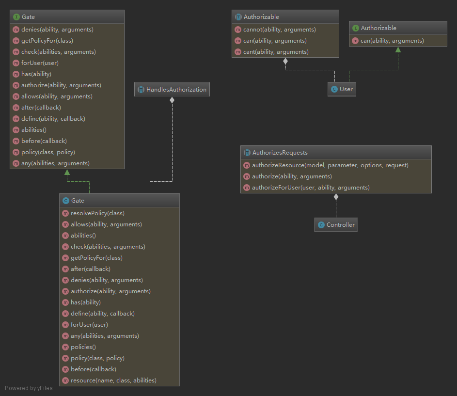

********
用户授权原理分析
********

``\Illuminate\Auth\Access\Gate`` 类定义的方法：

- ``define($ability, $callback)`` ：定义一个权限；
- ``abilities()`` ：返回所有定义的权限；
- ``has($ability)`` ：是否定义了给定权限；
- ``policy($class, $policy)`` ：定义一个策略；
- ``policies()`` ：返回所有定义的策略；
- ``getPolicyFor($class)`` ：获取给定类的策略实例；
- ``before(callable $callback)`` ：注册一个在所有Gate检查之前运行的回调；
- ``after(callable $callback)`` ：注册一个在所有Gate检查之后运行的回调；
- ``forUser($user)`` ：为给定的用户获取一个新的Gate实例；
- ``authorize($ability, $arguments = [])`` ：检查给定的能力是否赋予当前用户，这主要用户中间件调用，返回空响应或者异常；先到策略类中查找，没找到，则到权限里面找；
- ``check($abilities, $arguments = [])`` ：检查多个权限，只有所有权限都存在，则返回真；先到策略类中查找，没找到，则到权限里面找；
- ``any($abilities, $arguments = [])`` ：检查多个权限，只要存在一个，则返回真假；
- ``allows($ability, $arguments = [])`` ：确定给定的能力是否应该授权给当前用户，内部调用check方法；
- ``denies($ability, $arguments = [])`` ：确定给定的能力没有授权给当前用户，内部调用allows方法；
- ``resolvePolicy($class)`` ：初始化一个给定类型策略实例；
- ``resource($name, $class, array $abilities = null)`` ：定义一个资源权限；$abilities是权限名称和验证方法的映射；

``\Illuminate\Foundation\Auth\Access\Authorizable`` 类定义用户模型类辅助方法：

- ``can($ability, $arguments = [])`` ： 判断当前用户模型实例是否具有指定的权限，内部调用check()方法；
- ``cant($ability, $arguments = [])`` ：判断当前用户模型实例是否没有指定的权限，内部调用can方法；
- ``cannot($ability, $arguments = [])`` ：同上方法；

``\Illuminate\Foundation\Auth\Access\AuthorizesRequests`` 类定义控制器辅助方法：

- ``authorize($ability, $arguments = [])`` ：内部调用Gate类的authorize方法；
- ``authorizeForUser($user, $ability, $arguments = [])`` ：内部调用Gate类的forUser和authorize方法；
- ``authorizeResource($model, $parameter = null, array $options = [], $request = null)`` ：自动根据请求方法来检查授权；一般在控制器的构造函数中调用；

定义权限
========
用户可以通过在 ``\App\Providers\AuthServiceProvider`` 类中定义权限或者注册策略类。

.. code-block:: php

	class AuthServiceProvider extends ServiceProvider
	{
	    /**
	     * 应用的策略映射。
	     *
	     * @var array
	     */
	    protected $policies = [
	        Post::class => PostPolicy::class,
	    ];

	    /**
	     * 注册任意应用认证、应用授权服务
	     *
	     * @return void
	     */
	    public function boot()
	    {
	        $this->registerPolicies();

	        Gate::define('update-post', function ($user, $post) {
		        return $user->id == $post->user_id;
		    });

		    Gate::define('update-post', 'App\Policies\PostPolicy@update');
	    }
	}

其中 ``registerPolicies`` 方法是在 ``\Illuminate\Foundation\Support\Providers\AuthServiceProvider`` 类中定义的方法。

.. code-block:: php

	public function registerPolicies()
    {
        foreach ($this->policies as $key => $value) {
            Gate::policy($key, $value);
        }
    }

验证权限
========

手动验证权限
------------
手动使用授权的有四种方式：

- ``Gate`` 门面： ``Gate::allows('update articles', $article)`` 和 ``Gate::denies('update articles', $article)`` ，在控制器各个方法中使用；
- ``Controller：$this->authorize('update articles', $article)`` ，在控制器各个方法中使用；
- ``Blade`` 模板： ``@can('update articles', $article)`` 和 ``@cannot('update articles', $article)`` 指令，在模板中使用；
- User Model 实例： ``$user->can('update articles', $article)`` 和 ``$user->cannot('update articles', $article)`` ，在控制器各个方法中使用；

自动验证权限
-----------
自动使用授权的二种方式：

使用路由中间件
^^^^^^^^^^^^^
``Laravel`` 包含一个可以在请求到达路由或者控制器之前就进行动作授权的中间件。默认情况下， ``Illuminate\Auth\Middleware\Authorize`` 中间件被指定到你的 ``App\Http\Kernel`` 类中的 ``can`` 键上。让我们用一个授权用户更新博客的例子来讲解一下 ``can`` 这个中间件的使用：

.. code-block:: php

	Route::put('/post/{post}', function (Post $post) {
	    // 当前用户可以进行更新操作...
	})->middleware('can:update,post');

	Route::post('/post', function () {
	    // 当前用户可以进行创建操作...
	})->middleware('can:create,App\Post');

使用控制器中间件
^^^^^^^^^^^^^^^
如果你使用的是 资源控制器，那么你就可以在控制器构造方法里使用 ``authorizeResource`` 方法。该方法会把合适 ``can`` 中间件附加到资源控制器相应的方法中。

``authorizeResource`` 方法接收模板类名作为第一个参数，包含模型ID的路由/请求参数的名称作为其第二个参数：

.. code-block:: php

	namespace App\Http\Controllers;

	use App\Post;
	use Illuminate\Http\Request;
	use App\Http\Controllers\Controller;

	class PostController extends Controller
	{
	    public function __construct()
	    {
	        $this->authorizeResource(Post::class, 'post'); //第二个参数完全可以省略
	    }
	}

使用控制器中间件更自动化。

参考：

- https://learnku.com/articles/5479/introduce-laravel-authorization-mode-gate-and-policy
