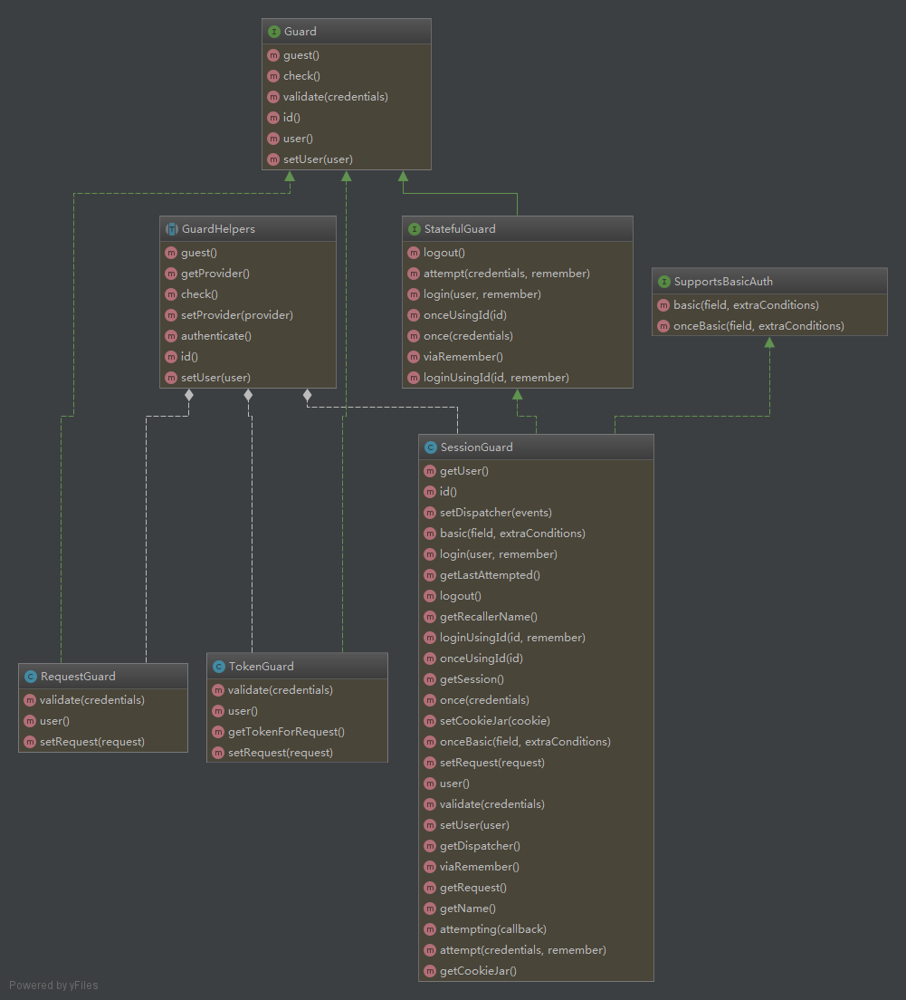
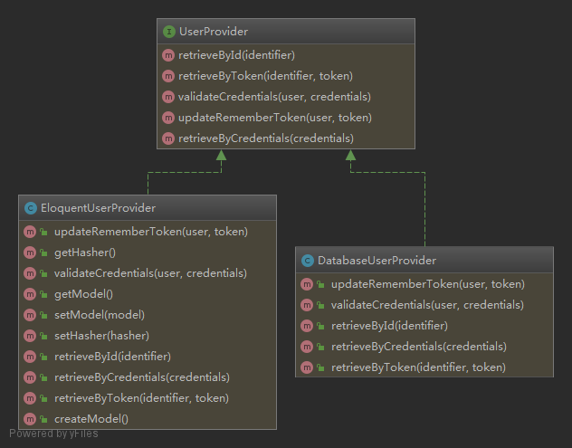
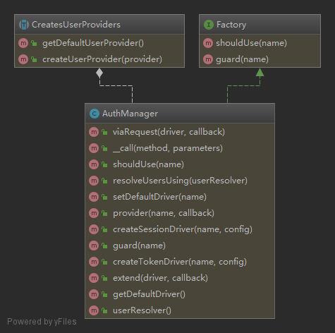

********
用户认证原理分析
********

Laravel 的认证设施由 ``警卫`` 和 ``提供者`` 组成。守卫决定如何对每个请求的用户进行身份验证。比如， ``Laravel`` 带有一个 ``session`` 守护器，它使用会话存储和 ``Cookies`` 来维护状态。

提供者决定如何从持久储存中检索用户。  ``Laravel`` 支持使用 ``Eloquent`` 和数据库查询生成器检索用户。但是，你可以根据应用程序的需要来自由定义其他提供者。

Guard 守护器分析
================

``Guard`` 接口定义了如下方法：

- ``check()`` ：判断当前用户是否已经认证；
- ``guest()`` ：判断当前用户是否是游客（未登录），这和 ``check()`` 相反，如果用户没有登录，则返回 ``true`` ；
- ``user()`` ：获取当前认证的用户
- ``id()`` ：获取当前认证用户的 ``id`` 值，严格来说不一定是 ``id`` 值，应该是模型中定义的主键的字段值
- ``validate(array $credentials = [])`` ：根据提供的凭证验证用户
- ``setUser(Authenticatable $user)`` ：设置当前用户

``StatefulGuard`` 接口继承了 ``Guard`` 接口并定义了如下方法：

- ``attempt(array $credentials = [], $remember = false)`` ：根据提供的凭证(如用户和密码)尝试验证用户是否合法
- ``once(array $credentials = [])`` ：一次性登录，不记录session or cookie
- ``login(Authenticatable $user, $remember = false)`` ：如果用户凭证合法，则登录用户，通常在验证成功后调用该方法记录 session 和记住我 cookie
- ``loginUsingId($id, $remember = false)`` ：只使用用户 id 来登录，该方法记录 session 和记住我 cookie
- ``onceUsingId($id)`` ：只使用用户 ID 登录，但是不记录 session 和 cookie
- ``viaRemember()`` ：指示用户是否通过记住我 cookie 进行身份验证
- ``logout()`` ：注销

``SupportsBasicAuth`` 接口定义了如下方法：

- ``basic($field = 'email', $extraConditions = [])`` ：使用 HTTP Basic Auth 认证，该方法记录 session 和记住我 cookie
- ``onceBasic($field = 'email', $extraConditions = [])`` ： 执行HTTP Basic无状态登录，即不记录 session 和 cookie

``GuardHelpers`` 守护器帮助类：

- ``authenticate()`` ：确定当前用户是否认证，并返回认证的用户对象；
- ``check()`` ：确定当前用户是否认证，返回真假；
- ``guest()`` ：确定当前用户是否是一个游客，就是没有认证的；
- ``id()`` ：获取当前用户标识字段的值；
- ``setUser(AuthenticatableContract $user)`` ：设置当前用户对象；
- ``getProvider()`` ：获取守护器使用的用户提供器；
- ``setProvider(UserProvider $provider)`` ：设置守护器使用的用户提供器；

laravel 自带如下 ``RequestGuard`` 、 ``SessionGuard`` 、 ``TokenGuard`` 守护器。

RequestGuard
------------
实现基于 ``HTTP`` 请求的自定义身份验证系统的最简单方法，是使用 ``Auth::viaRequest`` 方法。此方法允许您使用单个闭包来快速定义身份验证过程。

首先，在 ``AuthServiceProvider`` 的 ``boot`` 方法中调用 ``Auth::viaRequest`` 方法。 ``viaRequest`` 方法接受一个看守器名称作为其第一个参数。此名称可以是描述你自定义看守器的任何字符串。传递给该方法的第二个参数应该是一个闭包函数，它接收传入的 ``HTTP`` 请求和用户提供器并返回一个用户实例，或者，如果验证失败，则为 ``null`` ：

.. code-block:: php

	use App\User;
	use Illuminate\Http\Request;
	use Illuminate\Support\Facades\Auth;

	/**
	 * 注册任意应用认证／授权服务。
	 *
	 * @return void
	 */
	public function boot()
	{
	    $this->registerPolicies();

	    Auth::viaRequest('custom-token', function ($request, $userProvider) {
	        return User::where('token', $request->token)->first();
	    });
	}

当你完成了自定义看守器后，就可以在 ``auth.php`` 配置文件的 ``guards`` 配置中使用这个看守器：

.. code-block:: php

	'guards' => [
	    'api' => [
	        'driver' => 'custom-token',
	    ],
	],

SessionGuard
------------

TokenGuard
-----------
简单的 ``api`` 接口 ``token`` 认证守护器。

默认情况下， ``Laravel`` 为 ``API`` 认证提供了一个简单的解决方案，它通过一个随机令牌分配给应用程序的每个用户。在你的 ``config/auth.php`` 配置文件中，已经定义了一个使用 ``token`` 驱动的 ``api`` 看守器。 这个驱动程序负责检查传入请求上的 ``API`` 令牌，并验证它是否匹配数据库中用户分配的令牌。

配置
^^^^
在使用 ``token`` 驱动程序之前，你需要 创建一个迁移 它会在你的 ``users`` 表中添加一个 ``api_token`` 列：

.. code-block:: php

	Schema::table('users', function ($table) {
	    $table->string('api_token', 80)->after('password')
	                        ->unique()
	                        ->nullable()
	                        ->default(null);
	});

迁移创建后，运行 ``migrate Artisan`` 命令。

令牌生成
^^^^^^^^
将 ``api_token`` 列添加到你的 ``users`` 表之后，你可以将随机 ``API`` 令牌分配给应用程序中的每个用户。 在注册期间创建 ``User`` 模型时，应该分配这些令牌。 当使用 ``make:auth Artisan`` 命令提供的 认证脚手架 , 这可以在 ``RegisterController`` 的 ``create`` 方法中完成：

.. code-block:: php

	use Illuminate\Support\Str;
	use Illuminate\Support\Facades\Hash;

	/**
	 * 在有效注册之后创建一个新用户实例：
	 *
	 * @param  array  $data
	 * @return \App\User
	 */
	protected function create(array $data)
	{
	    return User::create([
	        'name' => $data['name'],
	        'email' => $data['email'],
	        'password' => Hash::make($data['password']),
	        'api_token' => Str::random(60),
	    ]);
	}

哈希令牌
""""""""
在上面的示例中， ``API`` 令牌以纯文本的形式存储在数据库中。如果你希望使用 ``SHA-256`` 散列对 ``API`` 令牌进行散列， 你可以将 ``api`` 看守器配置的 ``hash`` 选项设置为 ``true`` 。  ``api`` 看守器在你的 ``config/auth.php`` 配置文件中定义：

.. code-block:: php

	'api' => [
	    'driver' => 'token',
	    'provider' => 'users',
	    'hash' => true,
	],

生成哈希令牌
""""""""""""
使用哈希令牌时， 你不应该在用户注册期间生成 ``API`` 令牌。 相反， 你需要在应用程序中实现自己的 ``API`` 令牌管理页面。 这个页面应该允许用户初始化和刷新其 ``API`` 令牌。 当用户发出初始化或者刷新令牌请求时，你应该在数据中存储令牌的哈希副本，并将令牌的纯文本副本返回到视图 / 前端客户端进行一次显示。

例如，为给定用户初始化/刷新令牌并将纯文本令牌作为 ``JSON`` 响应返回的控制器方法可能如下所示：

.. code-block:: php

	namespace App\Http\Controllers;

	use Illuminate\Support\Str;
	use Illuminate\Http\Request;

	class ApiTokenController extends Controller
	{
	    /**
	     * 更新已经验证过的用户的 API 令牌。
	     *
	     * @param  \Illuminate\Http\Request  $request
	     * @return array
	     */
	    public function update(Request $request)
	    {
	        $token = Str::random(60);

	        $request->user()->forceFill([
	            'api_token' => hash('sha256', $token),
	        ])->save();

	        return ['token' => $token];
	    }
	}

.. note:: 因为上面例子中的 ``API`` 令牌具有足够的熵，创建一个 "rainbow tables" 来查找散列令牌的原始值是不切实际的。 因此，不需要使用 ``bcrypt`` 之类的慢散列方法

路由保护
^^^^^^^^
``Laravel`` 包含一个 身份认证看守器 可以自动验证传入请求的 ``API`` 令牌。 你只需要在任何需要有效访问令牌的路由上指定 ``auth:api`` 中间件：

.. code-block:: php

	use Illuminate\Http\Request;

	Route::middleware('auth:api')->get('/user', function(Request $request) {
	    return $request->user();
	});

请求中传递令牌
^^^^^^^^^^^^^
有几种方法可以将 ``API`` 令牌传递给你的应用程序。 我们将在使用 ``Guzzle HTTP`` 库演示其用法时去讨论这些方法。 你可以根据应用程序的需要选择其中的任何方法。

请求参数
""""""""
你的应用程序的 ``API`` 使用者可以将其令牌作为 ``api_token`` 查询字符串值：

.. code-block:: php

	$response = $client->request('GET', '/api/user?api_token='.$token);

请求负载
""""""""
应用程序的 ``API`` 使用者可以在请求的表单参数中以 ``api_token`` 的形式包含其 ``API`` 令牌：

.. code-block:: php

	$response = $client->request('POST', '/api/user', [
	    'headers' => [
	        'Accept' => 'application/json',
	    ],
	    'form_params' => [
	        'api_token' => $token,
	    ],
	]);

Bearer 令牌
"""""""""""
应用程序的 ``API`` 使用者可以在请求的 ``Authorization`` 头中提供其 ``API`` 令牌作为 ``Bearer`` 令牌:

.. code-block:: php

	$response = $client->request('POST', '/api/user', [
	    'headers' => [
	        'Authorization' => 'Bearer '.$token,
	        'Accept' => 'application/json',
	    ],
	]);

自定义看守器
------------
你可以使用 ``Auth facade`` (即 ``\Illuminate\Auth\AuthManager`` 类)的 ``extend`` 方法来定义自己的身份验证看守器。你应该在 服务提供器 中调用 ``extend`` 方法。由于 ``Laravel`` 已经附带了 ``AuthServiceProvider`` ，我们可以将代码放在该提供器中：

.. code-block:: php

	namespace App\Providers;

	use App\Services\Auth\JwtGuard;
	use Illuminate\Support\Facades\Auth;
	use Illuminate\Foundation\Support\Providers\AuthServiceProvider as ServiceProvider;

	class AuthServiceProvider extends ServiceProvider
	{
	    /**
	     * 注册任意应用认证／授权服务。
	     *
	     * @return void
	     */
	    public function boot()
	    {
	        $this->registerPolicies();

	        Auth::extend('jwt', function ($app, $name, array $config) {
	            // 返回一个 Illuminate\Contracts\Auth\Guard 实例...

	            return new JwtGuard(Auth::createUserProvider($config['provider']));
	        });
	    }
	}

正如你在上面的示例中所看到的，传递给 ``extend`` 方法的回调应该返回一个实现 ``Illuminate\Contracts\Auth\Guard`` 接口的实例。这个接口包含了一些你需要在自定义的看守器中实现的方法。当你的自定义看守器定义完成之后，你可以在 ``auth.php`` 配置文件的 ``guards`` 配置中使用这个看守器：

.. code-block:: php

	'guards' => [
	    'api' => [
	        'driver' => 'jwt',
	        'provider' => 'users',
	    ],
	],

身份验证接口
============

.. image:: ./images/Authenticatable.png

用户提供器的 ``retrieveById`` 、 ``retrieveByToken`` 和 ``retrieveByCredentials`` 方法将返回此接口的实例。 ``getAuthIdentifierName`` 方法应该返回用户 「主键」 列的名字， ``getAuthIdentifier`` 方法则返回用户 「主键」。在 ``MySQL`` 后台，它会是自增主键。 ``getAuthPassword`` 方法应该返回用户的哈希密码。此接口允许身份验证系统与任一 ``User`` 类一直工作，不管使用的是哪种 ``ORM`` 或抽象存储层。默认情况下， ``Laravel`` 的 ``app`` 目录会包含一个实现了此接口的 ``User`` 类。

用户提供器分析
=============

``UserProvider`` 接口定义了如下方法：

- ``retrieveById($identifier)`` ：通过唯一标示符，即主键，获取 ``Authenticatable`` 类对象；
- ``retrieveByToken($identifier, $token)`` ：通过唯一标示符和 记住我 ``token`` 获取 ``Authenticatable`` 类对象；
- ``updateRememberToken(Authenticatable $user, $token)`` ：通过给定的 ``Authenticatable`` 类对象更新 记住我 ``token`` ；
- ``retrieveByCredentials(array $credentials)`` ：通过给定的凭证获取 ``Authenticatable`` 类对象，比如 ``email`` 或用户名和密码等等；
- ``validateCredentials(Authenticatable $user, array $credentials)`` ：验证给定的用户和给定的凭证是否符合

``DatabaseUserProvider`` 类实现 ``UserProvider`` 接口，它使用数据库表直接查询用户表来提供认证用户信息。 ``EloquentUserProvider`` 类实现 ``UserProvider`` 接口，它使用模型对象来查询用户。

DatabaseUserProvider
---------------------

EloquentUserProvider
---------------------

自定义用户提供器
---------------
如果不使用传统的关系数据库存储用户，就需要使用自己的身份验证用户提供器扩展 ``Lavarel`` 。可以使用 ``Auth facade`` (即 ``\Illuminate\Auth\AuthManager`` 类)的 ``provider`` 方法自定义用户提供器：

.. code-block:: php

	namespace App\Providers;

	use Illuminate\Support\Facades\Auth;
	use App\Extensions\RiakUserProvider;
	use Illuminate\Foundation\Support\Providers\AuthServiceProvider as ServiceProvider;

	class AuthServiceProvider extends ServiceProvider
	{
	    /**
	     * 注册任意应用身份验证 / 授权服务Register any application authentication / authorization services.
	     *
	     * @return void
	     */
	    public function boot()
	    {
	        $this->registerPolicies();

	        Auth::provider('riak', function ($app, array $config) {
	            // 返回 Illuminate\Contracts\Auth\UserProvider 实例...

	            return new RiakUserProvider($app->make('riak.connection'));
	        });
	    }
	}

一旦使用 ``provider`` 方法注册完毕，就可以在 ``auth.php`` 配置文件中切换到新的用户提供器。先定义一个使用新驱动的 ``provider`` ：

.. code-block:: php

	'providers' => [
	    'users' => [
	        'driver' => 'riak',
	    ],
	],

随后就可以在 ``guards`` 配置中使用这个提供器：

.. code-block:: php

	'guards' => [
	    'web' => [
	        'driver' => 'session',
	        'provider' => 'users',
	    ],
	],

用户认证管理器
=============

该管理器提供如下可用方法：

- ``guard($name = null)`` ：获取指定的看守器，不传入参数则使用默认看守器；
- ``shouldUse($name)`` ：设置默认的看守器；
- ``viaRequest($driver, callable $callback)`` ：通过传入一个返回用户对象的闭包来创建一个 RequestGuard 对象；
- ``extend($driver, Closure $callback)`` ：注册一个创建自定义守护器的闭包工厂；
- ``provider($name, Closure $callback)`` ：注册一个创建自定义用户提供器的闭包工厂；
- ``getDefaultDriver()`` ： 获取默认看守器名称；
- ``setDefaultDriver($name)`` ：设置默认看守器名称；
- ``resolveUsersUsing(Closure $userResolver)`` ：设置用来解析用户的闭包；
- ``userResolver()`` ：获取用来解析用户的闭包；
- ``createSessionDriver($name, $config)`` ：创建一个指定名称创建会话守护器；
- ``createTokenDriver($name, $config)`` ：创建一个token守护器；

认证管理器有个 ``__call()`` 方法，代理到当前默认的守护器实例方法中。

如何使用该管理器进行认证
======================

检查用户是否登录
---------------

手动检查
^^^^^^^^
你可以使用 ``Auth facade`` 的 ``check`` 和 ``authenticate`` 方法来检查用户是否已认证：

.. code-block:: php

	use Illuminate\Support\Facades\Auth;

	if (Auth::check()) {
	    // 用户已经登录了...
	}

``check`` 方法返回真假， ``authenticate`` 方法返回用户实例对象。

自动检查
^^^^^^^^
这需要在路由或控制器的构造函数中定义身份认证中间件。路由中间件 可以用于只允许通过认证的用户访问给定的路由。 ``Laravel`` 自带了一个 ``auth`` 中间件, 它定义在 ``Illuminate\Auth\Middleware\Authenticate`` 中。由于这个中间件已经在 ``HTTP`` 内核中注册，你只需把这个中间件附加到路由定义中：

.. code-block:: php

	Route::get('profile', function () {
	    // 只有认证过的用户可以进入...
	})->middleware('auth');

当然，如果你使用 控制器，你可以在控制器的构造函数中调用 ``middleware`` 方法来直接将其附加到路由定义中：

.. code-block:: php

	public function __construct()
	{
	    $this->middleware('auth');
	}

指定看守器
^^^^^^^^^^
当你把 ``auth`` 中间件添加到路由中时，同时也能指定使用哪个看守器进行用户认证。指定的看守器应该对应 ``auth.php`` 配置文件中 ``guards`` 数组中的的一个键：

.. code-block:: php

	public function __construct()
	{
	    $this->middleware('auth:api');
	}

进行登录认证
-----------
可以通过 ``Auth::attempt($credentials)`` 来验证用户名称和密码。

.. code-block:: php

	namespace App\Http\Controllers;

	use Illuminate\Http\Request;
	use Illuminate\Support\Facades\Auth;

	class LoginController extends Controller
	{
	    /**
	     * 处理身份验证尝试。
	     *
	     * @param  \Illuminate\Http\Request $request
	     *
	     * @return Response
	     */
	    public function authenticate(Request $request)
	    {
	        $credentials = $request->only('email', 'password');

	        if (Auth::attempt($credentials)) {
	            // 身份验证通过...
	            return redirect()->intended('dashboard');
	        }
	    }
	}

``attempt`` 方法的每个参数是一个关联数组。数组值用于在数据库中查找用户。在上面的例子中，将通过 ``email`` 列的值查找用户。如果找到该用户，将用存储在数据库中的哈希密码与数组中的 ``password`` 值做比较。不需要对 ``password`` 做哈希运算，框架在与数据库中的哈希密码做比较前自动对此值做哈希运算。如果两个哈希值匹配，将为该用户建立验证通过的 ``session`` 。

如果验证成功， ``attempt`` 方法返回 ``true`` ，否则返回 ``false`` 。

重定向中的 ``intended`` 方法将经由身份验证中间件将用户重定向到身份验证前截获的 ``URL`` 。如果预期目标不存在，可以为此方法指定一个回退 ``URI`` 。

指定额外条件
^^^^^^^^^^^^
除了用户的电子邮件和密码之外，还可以向身份验证查询添加其他条件。例如， 我们可以验证用户是不是已经被标记为 「激活」：

.. code-block:: php

	if (Auth::attempt(['email' => $email, 'password' => $password, 'active' => 1])) {
	    // 用户存在，已激活且未被禁用。
	}

.. note:: 在这些例子中， ``email`` 不是必须的选项，它只用来做示范。你应该使用与你的数据库中 「用户名」 对应的列名。

访问指定的看守器实例
^^^^^^^^^^^^^^^^^^^
可以使用 ``Auth facade`` 的 ``guard`` 方法指定想要使用的看守器实例。这允许你使用完全独立的可验证模型或用户表来管理应用程序各个部分的验证。

传递给 ``guard`` 方法的看守器名称需要与 ``auth.php`` 配置中的配置项之一相匹配：

.. code-block:: php

	if (Auth::guard('admin')->attempt($credentials)) {
	    //
	}

记住用户
^^^^^^^^
如果想在应用中提供 「记住我」功能，可以给 ``attempt`` 方法传递一个布尔值作为其第二个参数，这会无限期保持用户身份验证，直到用户手动登出。用户表需要包含字符串类型的 ``remember_token`` 列用于存储令牌。

.. code-block:: php

	if (Auth::attempt(['email' => $email, 'password' => $password], $remember)) {
	    // 用户被记住...
	}

.. note:: 如果使用了 ``Laravel`` 内置的 ``LoginController`` ，「记住」用户的正确逻辑已经由控制器所用的 ``traits`` 实现。

如果启用了「记住用户」，可以使用 ``viaRemember`` 方法判断是否使用了「记住我」 ``cookie`` 对用户做身份验证：

.. code-block:: php

	if (Auth::viaRemember()) {
	    //
	}

登出
----
用户登出需要使用 ``Auth facade`` 的 ``logout`` 方法。它会清除用户会话（session）中的用户验证信息：

.. code-block:: php

	Auth::logout();

获取认证用户
------------
你可以通过 ``Auth facade`` 来访问已认证的用户：

.. code-block:: php

	use Illuminate\Support\Facades\Auth;

	// 获取当前通过认证的用户...
	$user = Auth::user();

	// 获取当前通过认证的用户 ID...
	$id = Auth::id();

或者，你可以通过 ``Illuminate\Http\Request`` 实例来访问已认证的用户。别忘了，类型提示的类会被自动注入到你的控制器方法中：

.. code-block:: php

	namespace App\Http\Controllers;

	use Illuminate\Http\Request;

	class ProfileController extends Controller
	{
	    /**
	     * 更新用户资料。
	     *
	     * @param  Request  $request
	     * @return Response
	     */
	    public function update(Request $request)
	    {
	        // $request->user() 返回一个认证用户实例...
	    }
	}

``\Illuminate\Auth\AuthServiceProvider`` 类的 ``registerRequestRebindHandler()`` 方法绑定了解析用户的闭包到请求对象中。

laravel是如何引入该认证系统的
============================
通过在 ``config/app.php 的 providers`` 数组中注册 ``\Illuminate\Auth\AuthServiceProvider`` 服务提供者来引入的。

