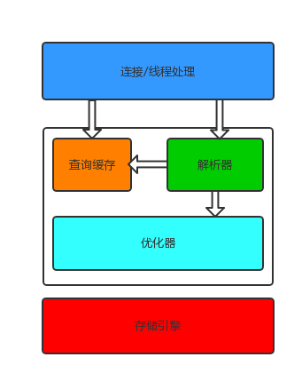

*********
MySQL补充
*********

架构
====
MySQL 的存储引擎架构将查询处理与数据的存储/提取相分离。下面是 MySQL 的逻辑架构图：

.. image:: ./images/mysql_schema.jpg

第一层
------
第一层负责连接管理、授权认证、安全等等。每个客户端的连接都对应着服务器上的一个线程。服务器上维护了一个线程池，避免为每个连接都创建销毁一个线程。当客户端连接到 ``MySQL`` 服务器时，服务器对其进行认证。可以通过用户名和密码的方式进行认证，也可以通过 ``SSL`` 证书进行认证。登录认证通过后，服务器还会验证该客户端是否有执行某个查询的权限。

第二层
------
第二层负责解析查询(编译SQL)，并对其进行优化(如调整表的读取顺序，选择合适的索引等)。对于SELECT语句，在解析查询前，服务器会先检查查询缓存，如果能在其中找到对应的查询结果，则无需再进行查询解析、优化等过程，直接返回查询结果。存储过程、触发器、视图等都在这一层实现。

第三层
------
第三层是存储引擎，存储引擎负责在 MySQL 中存储数据、提取数据、开启一个事务等等。存储引擎通过 API 与上层进行通信，这些 API 屏蔽了不同存储引擎之间的差异，使得这些差异对上层查询过程透明。存储引擎不会去解析 SQL 。

第四层
------
数据存储层，主要是将数据存储在运行于裸设备的文件系统之上，并完成与存储引擎的交互。

Mysql服务器优化详细
===================
在这之前，我们需要掌握以下方法：

查看MySql状态及变量的方法
-------------------------

- Mysql> show status ——显示状态信息（扩展show status like 'XXX'）
- Mysql> show variables ——显示系统变量（扩展show variables like 'XXX'）
- Mysql> show innodb status ——显示InnoDB存储引擎的状态
- Shell> mysqladmin variables -u username -p password——显示系统变量
- Shell> mysqladmin extended-status -u username -p password——显示状态信息

查看状态变量及帮助
------------------

- Shell> mysqld --verbose --help [|more #逐行显示]

首先，让我们看看有关请求连接的变量
----------------------------------
为了能适应更多数据库应用用户， MySql 提供了连接（客户端）变量，以对不同性质的用户群体提供不同的解决方案，笔者就 ``max_connections`` ， ``back_log`` 做了一些细结，如下：

- ``max_connections`` 是指 MySql 的最大连接数，如果服务器的并发连接请求量比较大，建议调高此值，以增加并行连接数量，当然这建立在机器能支撑的情况下，因为如果连接数越多，介于 MySql 会为每个连接提供连接缓冲区，就会开销越多的内存，所以要适当调整该值，不能盲目提高设值。可以过 'conn%' 通配符查看当前状态的连接数量，以定夺该值的大小。

- ``back_log`` 是要求 MySQL 能有的连接数量。当主要 MySQL 线程在一个很短时间内得到非常多的连接请求，这就起作用，然后主线程花些时间(尽管很短)检查连接并且启动一个新线程。 ``back_log`` 值指出在 MySQL 暂时停止回答新请求之前的短时间内多少个请求可以被存在堆栈中。如果期望在一个短时间内有很多连接，你需要增加它。也就是说，如果 MySql 的连接数据达到 ``max_connections`` 时，新来的请求将会被存在堆栈中，以等待某一连接释放资源，该堆栈的数量即 ``back_log`` ，如果等待连接的数量超过 ``back_log`` ，将不被授予连接资源。另外，这值( ``back_log`` )限于您的操作系统对到来的 TCP/IP 连接的侦听队列的大小。你的操作系统在这个队列大小上有它自己的限制（可以检查你的OS文档找出这个变量的最大值），试图设定 ``back_log`` 高于你的操作系统的限制将是无效的。

优化了 MySql 的连接后属性后，我们需要看看缓冲区变量
---------------------------------------------------
使用 MySql 数据库存储大量数据（或使用复杂查询）时，我们应该考虑 MySql 的内存配置。如果配置 MySQL 服务器使用太少的内存会导致性能不是最优的；如果配置了太多的内存则会导致崩溃，无法执行查询或者导致交换操作严重变慢。在现在的 32 位平台下，仍有可能把所有的地址空间都用完，因此需要审视。

计算内存使用的秘诀公式就能相对地解决这一部分问题。不过，如今这个公式已经很复杂了，更重要的是，通过它计算得到的值只是“理论可能”并不是真正消耗的值。事实上，有 8GB 内存的常规服务器经常能运行到最大的理论值（100GB甚至更高）。此外，你轻易不会使用到“超额因素”（它实际上依赖于应用以及配置）。一些应用可能需要理论内存的 10% 而有些仅需 1% 。那么，我们可以做什么呢？

来看看那些在启动时就需要分配并且总是存在的全局缓冲吧！
-----------------------------------------------------
全局缓冲：key_buffer_size, innodb_buffer_pool_size, innodb_additional_mem_pool_size，innodb_log_buffer_size, query_cache_size

注：如果你大量地使用 MyISAM 表，那么你也可以增加操作系统的缓存空间使得 MySQL 也能用得着。把这些也都加到操作系统和应用程序所需的内存值之中，可能需要增加 32MB 甚至更多的内存给 MySQL 服务器代码以及各种不同的小静态缓冲。这些就是你需要考虑的在 MySQL 服务器启动时所需的内存。其他剩下的内存用于连接。

- ``key_buffer_size`` 决定索引处理的速度，尤其是索引读的速度。一般我们设为 ``16M`` ，通过检查状态值 ``Key_read_requests`` 和 ``Key_reads`` ，可以知道 ``key_buffer_size`` 设置是否合理。比例 ``key_reads/key_read_requests`` 应该尽可能的低，至少是 ``1:100`` ， ``1:1000`` 更好（上述状态值可以使用 ``'key_read%'`` 获得用来显示状态数据）。 ``key_buffer_size`` 只对 ``MyISAM`` 表起作用。即使你不使用 ``MyISAM`` 表，但是内部的临时磁盘表是 ``MyISAM`` 表，也要使用该值。可以使用检查状态值 ``'created_tmp_disk_tables'`` 得知详情。

- ``innodb_buffer_pool_size`` 对于 ``InnoDB`` 表来说，作用就相当于 ``key_buffer_size`` 对于 ``MyISAM`` 表的作用一样。 ``InnoDB`` 使用该参数指定大小的内存来缓冲数据和索引。对于单独的 MySQL 数据库服务器，最大可以把该值设置成物理内存的 ``80%`` 。

- ``innodb_additional_mem_pool_size`` 指定 ``InnoDB`` 用来存储数据字典和其他内部数据结构的内存池大小。缺省值是 ``1M`` 。通常不用太大，只要够用就行，应该与表结构的复杂度有关系。如果不够用， MySQL 会在错误日志中写入一条警告信息。

- ``innodb_log_buffer_size`` 指定 InnoDB 用来存储日志数据的缓存大小，如果您的表操作中包含大量并发事务（或大规模事务），并且在事务提交前要求记录日志文件，请尽量调高此项值，以提高日志效率。

- ``query_cache_size`` 是 ``MySql`` 的查询缓冲大小。（从4.0.1开始，MySQL提供了查询缓冲机制）使用查询缓冲， MySQL 将 ``SELECT`` 语句和查询结果存放在缓冲区中，今后对于同样的 ``SELECT`` 语句（区分大小写），将直接从缓冲区中读取结果。根据 MySQL 用户手册，使用查询缓冲最多可以达到 ``238%`` 的效率。通过检查状态值 ``Qcache_%`` ，可以知道 ``query_cache_size`` 设置是否合理：如果 ``Qcache_lowmem_prunes`` 的值非常大，则表明经常出现缓冲不够的情况，如果 ``Qcache_hits`` 的值也非常大，则表明查询缓冲使用非常频繁，此时需要增加缓冲大小；如果 ``Qcache_hits`` 的值不大，则表明你的查询重复率很低，这种情况下使用查询缓冲反而会影响效率，那么可以考虑不用查询缓冲。此外，在 ``SELECT`` 语句中加入 ``SQL_NO_CACHE`` 可以明确表示不使用查询缓冲。

除了全局缓冲，MySql还会为每个连接发放连接缓冲。
----------------------------------------------

连接缓冲：
每个连接到 MySQL 服务器的线程都需要有自己的缓冲。大概需要立刻分配 ``256K`` ，甚至在线程空闲时，它们使用默认的线程堆栈，网络缓存等。事务开始之后，则需要增加更多的空间。运行较小的查询可能仅给指定的线程增加少量的内存消耗，然而如果对数据表做复杂的操作例如扫描、排序或者需要临时表，则需分配大约 ``read_buffer_size`` ， ``sort_buffer_size`` ， ``read_rnd_buffer_size`` ， ``tmp_table_size`` 大小的内存空间。不过它们只是在需要的时候才分配，并且在那些操作做完之后就释放了。有的是立刻分配成单独的组块。 ``tmp_table_size`` 可能高达 MySQL 所能分配给这个操作的最大内存空间了。注意，这里需要考虑的不只有一点 —— 可能会分配多个同一种类型的缓存，例如用来处理子查询。一些特殊的查询的内存使用量可能更大——如果在 ``MyISAM`` 表上做成批的插入时需要分配 ``bulk_insert_buffer_size`` 大小的内存；执行 ``ALTER TABLE`` ， ``OPTIMIZE TABLE`` ， ``REPAIR TABLE`` 命令时需要分配 ``myisam_sort_buffer_size`` 大小的内存。

- ``read_buffer_size`` 是 MySql 读入缓冲区大小。对表进行顺序扫描的请求将分配一个读入缓冲区， MySql 会为它分配一段内存缓冲区。 ``read_buffer_size`` 变量控制这一缓冲区的大小。如果对表的顺序扫描请求非常频繁，并且你认为频繁扫描进行得太慢，可以通过增加该变量值以及内存缓冲区大小提高其性能。

- ``sort_buffer_size`` 是 MySql 执行排序使用的缓冲大小。如果想要增加 ``ORDER BY`` 的速度，首先看是否可以让 MySQL 使用索引而不是额外的排序阶段。如果不能，可以尝试增加 ``sort_buffer_size`` 变量的大小。

- ``read_rnd_buffer_size`` 是 MySql 的随机读缓冲区大小。当按任意顺序读取行时(例如，按照排序顺序)，将分配一个随机读缓存区。进行排序查询时， MySql 会首先扫描一遍该缓冲，以避免磁盘搜索，提高查询速度，如果需要排序大量数据，可适当调高该值。但 MySql 会为每个客户连接发放该缓冲空间，所以应尽量适当设置该值，以避免内存开销过大。

- ``tmp_table_size`` 是 MySql 的heap （堆积）表缓冲大小。所有联合在一个 DML 指令内完成，并且大多数联合甚至可以不用临时表即可以完成。大多数临时表是基于内存的(HEAP)表。具有大的记录长度的临时表 (所有列的长度的和)或包含 BLOB 列的表存储在硬盘上。如果某个内部 heap（堆积）表大小超过 ``tmp_table_size`` ， MySQL 可以根据需要自动将内存中的 ``heap`` 表改为基于硬盘的 ``MyISAM`` 表。还可以通过设置 ``tmp_table_size`` 选项来增加临时表的大小。也就是说，如果调高该值， MySql 同时将增加 ``heap`` 表的大小，可达到提高联接查询速度的效果。

当我们设置好了缓冲区大小之后，再来看看：

``table_cache`` 所有线程打开的表的数目，增大该值可以增加 mysqld 需要的文件描述符的数量。每当 MySQL 访问一个表时，如果在表缓冲区中还有空间，该表就被打开并放入其中，这样可以更快地访问表内容。通过检查峰值时间的状态值 ``Open_tables`` 和 ``Opened_tables`` ，可以决定是否需要增加 ``table_cache`` 的值。如果你发现 ``open_tables`` 等于 ``table_cache`` ，并且 ``opened_tables`` 在不断增长，那么你就需要增加 ``table_cache`` 的值了（上述状态值可以使用 ``Open%tables`` 获得）。注意，不能盲目地把 ``table_cache`` 设置成很大的值。如果设置得太高，可能会造成文件描述符不足，从而造成性能不稳定或者连接失败。

做了以上方面的调优设置之后，MySql 应该基本能满足您需求（当然是建立在调优设置适当的情况下），我们还应该了解并注意：

只有简单查询OLTP（联机事务处理）应用的内存消耗经常是使用默认缓冲的每个线程小于1MB，除非需要使用复杂的查询否则无需增加每个线程的缓冲大小。使用1MB的缓冲来对10行记录进行排序和用16MB的缓冲基本是一样快的（实际上16MB可能会更慢，不过这是其他方面的事了）。

找出MySQL服务器内存消耗的峰值。这很容易就能计算出操作系统所需的内存、文件缓存以及其他应用。在32位环境下，还需要考虑到32位的限制，限制 “mysqld” 的值大约为2.5G（实际上还要考虑到很多其他因素）。现在运行 “ps aux” 命令来查看 “VSZ” 的值（MySQL 进程分配的虚拟内存）。监视着内存变化的值，就能知道是需要增加或减少当前的内存值了。

最后来看看调优设置方法：

安装好 MySql 后，配制文件应该在 ``./share/mysql``  ("./"即MySql安装目录) 目录中，配制文件有几个，有 ``my-huge.cnf my-medium.cnf my-large.cnf my-small.cnf`` 。 ``win`` 环境下即存在于 ``MySql`` 安装目录中的 ``.ini`` 文件。不同的流量的网站和不同配制的服务器环境，当然需要有不同的配制文件了。

一般的情况下， ``my-medium.cnf`` 这个配制文件就能满足我们的大多需要；一般我们会把配置文件拷贝到 ``/etc/my.cnf`` ， ``win`` 环境下则拷备到 ``my.ini`` 下即可，只需要修改这个配置文件就可以了。

