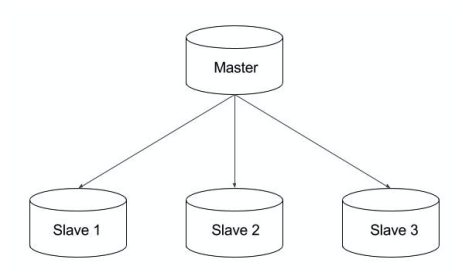
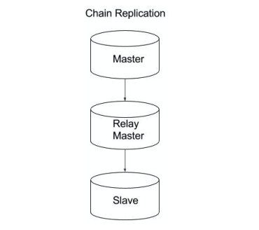
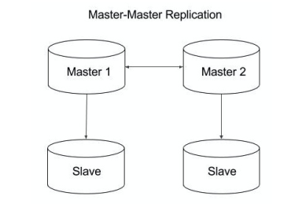
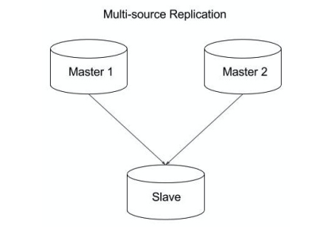

****
复制
****

简介
====
如第6章“二进制日志记录”中所述，复制可以将来自一个MySQL数据库服务器（主服务器）的数据复制到一个或多个MySQL数据库服务器（从服务器）。默认情况下，复制是异步的；从服务器不需要永久连接以从主服务器接收更新。您可以配置为复制数据库中的所有数据库，所选数据库甚至选定的表。

在本章中，您将学习如何设置传统复制；复制选定的数据库和表格；并设置多源复制，链复制，延迟复制和半同步复制。

在底层，复制的工作方式如下：在服务器（主服务器）上执行的所有 ``DDL`` 和 ``DML`` 语句都会记录到二进制日志中，这些日志由连接到它的服务器（称为从服务器）提取。二进制日志只是复制到从服务器并保存为中继日志。该过程由称为 ``IO`` 线程的线程处理。还有一个称为 ``SQL`` 线程的线程，它按顺序执行中继日志中的语句。

下面博客中非常清楚地解释了复制的工作原理： https://www.percona.com/blog/2013/01/09/how-does-mysql-replication-really-work/

复制的优点如下：

- 横向扩展解决方案：在多个从站之间分散负载以提高性能。在此环境中，所有写入和更新都必须在主服务器上进行。但是，读取可以在一个或多个从设备上进行。该模型可以提高写入性能（因为主设备专用于更新），同时显着提高了越来越多的从设备的读取速度。
- 数据安全性：由于数据被复制到从服务器并且从服务器可以暂停复制过程，因此可以在从服务器上运行备份服务而不会破坏相应的主数据。
- 分析：可以在主服务器上创建实时数据，而信息的分析可以在从服务器上进行，而不会影响主服务器的性能。
- 远程数据分发：您可以使用复制为远程站点创建数据的本地副本，而无需永久访问主服务器。

设置复制
========
有许多复制拓扑。其中一些是传统的主从复制，链复制，主-主复制，多源复制等。

传统复制涉及单个主服务器和多个从服务器。

链复制意味着一个服务器从另一个服务器复制，而另一个服务器从另一个服务器复制。中间服务器称为中继主服务器（主服务器 ---> 中继主服务器 ---> 从服务器）。

当您要在两个数据中心之间设置复制时，主要使用此选项。首个主服务器及其从服务器将位于一个数据中心。辅助主服务器（中继）从首个数据中心的主站点复制。其他数据中心的所有从服务器都从辅助主服务器复制。

主-主复制：在此拓扑中，两个主服务器都接受写入并在彼此之间进行复制。

多源复制：在此拓扑中，从属设备将从多个主设备而不是一个主设备进行复制。

在本节中，解释了单个从服务器的设置。可以应用相同的原则来设置链复制。通常，在设置另一个从服务器时，备份将从从服务器获取。

大纲：

1. 在主服务器上开启二进制日志；
2. 在主服务器上创建一个复制用户；
3. 在从服务器上设置唯一的 ``server_id`` ；
4. 在主服务器上进行备份；
5. 在从服务器上进行恢复；
6. 在从服务器上执行 ``CHANGE MASTER TO`` 命令；
7. 开始复制；

步骤：

1. 在主服务器上，开启二进制日志和设置SERVER_ID；
2. 在主服务器上创建一个复制用户；从服务器使用该账号连接主服务器；

.. code-block:: shell

    mysql> GRANT REPLICATION SLAVE ON *.* TO 'binlog_user'@'%' IDENTIFIED BY 'binlog_P@ss12';
    mysql>FLUSH PRIVILEGES;

3. 在从服务器上，设置唯一的 SERVER_ID 选项(它应该与你在 ``master`` 上设置的不同)：

.. code-block:: shell

    mysql> SET @@GLOBAL.SERVER_ID = 32;

4. 在从服务上，通过远程连接获取主服务器的备份。你可以使用 ``mysqldump`` 或者 ``mydumper`` 。 ``mysqlpump`` 无法使用，因为二进制日志位置不一致。

mysqldump：

.. code-block:: shell

    shell> mysqldump -h <master_host> -u backup_user --password=<pass> --all-databases --routines --events --single-transaction --master-data > dump.sql

从另一个从服务器获取备份时，您必须传递 ``--slave-dump`` 选项。????

mydumper:

.. code-block:: shell

    shell> mydumper -h <master_host> -u backup_user --password=<pass> --use-savepoints --trxconsistency-only --kill-long-queries --outputdir /backups

5. 在从服务器上，备份完成后，恢复备份。

mysqldump:

.. code-block:: shell

    shell> mysql -u <user> -p -f < dump.sql

mydumper:

.. code-block:: shell

    shell> myloader --directory=/backups --user=<user> --password=<password> --queries-pertransaction=5000 --threads=8 --overwrite-tables

6. 在从服务器上，在恢复备份后，你可以执行如下命令：

.. code-block:: shell

    mysql> CHANGE MASTER TO
    MASTER_HOST='<master_host>',
    MASTER_USER='binlog_user',
    MASTER_PASSWORD='binlog_P@ss12',
    MASTER_LOG_FILE='<log_file_name>',
    MASTER_LOG_POS=<position>

``mysqldump:<log_file_name>`` 和 ``<position>`` 包含在备份转储文件中。或者在主服务器中执行 ``SHOW MASTER STATUS`` 命令，例如：

.. code-block:: shell

    shell> less dump.sql
    --
    -- Position to start replication or point-intime recovery from (the master of this slave)
    --
    CHANGE MASTER TO MASTER_LOG_FILE='centos7-
    bin.000001', MASTER_LOG_POS=463;

``mydumper:<log_file_name>`` 和 ``<position>`` 被存储在元数据文件中：

.. code-block:: shell

    shell> cat metadata
    Started dump at: 2017-08-26 06:26:19
    SHOW MASTER STATUS:
        Log: server1.000012
        Pos: 154122
        GTID:
    SHOW SLAVE STATUS:
        Host: xx.xxx.xxx.xxx
        Log: centos7-bin.000001
        Pos: 463223
        GTID:
    Finished dump at: 2017-08-26 06:26:24

如果要从从服务器或主服务器备份以设置另一个从服务器，则必须使用 ``SHOW SLAVE STATUS`` 中的位置。如果要设置链复制，可以使用 ``SHOW MASTER STATUS`` 中的位置。

1. 在从服务器上，执行 ``START SLAVE`` 命令启动 ``slave`` 同步进程：

.. code-block:: shell

    mysql> START SLAVE;

2. 你可以通过执行如下命令来检查复制状态：

.. code-block:: shell

    mysql> SHOW SLAVE STATUS\G

您应该查找 ``Seconds_Behind_Master`` ，它显示复制延迟。如果为 0 ，则表示从站与主站同步; 任何非零值表示滞后的秒数，如果为 ``NULL`` ，则表示没有进行复制。当 ``Slave_IO_Running`` 和 ``Slave_SQL_Running`` 都为 ``YES`` 的时候就表示主从同步设置成功了。

设置主主复制
============
由于我们许多人尝试这样做，因此这个主题会让很多人感兴趣。让我们深入了解它的细节。

实现原理
--------
主主复制即在两台 ``MySQL`` 主机内都可以变更数据，而且另外一台主机也会做出相应的变更。聪明的你也许已经想到该怎么实现了。对，就是将两个主从复制有机合并起来就好了。只不过在配置的时候我们需要注意一些问题，例如， **主键重复** ， ``server-id`` 不能重复等等。

配置文件
--------

--192.168.95.11 

.. code-block:: ini

    server-id=11                 #任意自然数n，只要保证两台MySQL主机不重复就可以了。
    log-bin=mysql-bin            #开启二进制日志
    auto_increment_increment=2   #步进值auto_imcrement。一般有n台主MySQL就填n
    auto_increment_offset=1      #起始值。一般填第n台主MySQL。此时为第一台主MySQL
    binlog-ignore=mysql          #忽略mysql库【我一般都不写】
    binlog-ignore=information_schema   #忽略information_schema库【我一般都不写】
    replicate-do-db=aa           #要同步的数据库，默认所有库

--192.168.95.12

.. code-block:: shell

    server-id=12
    log-bin=mysql-bin
    auto_increment_increment=2
    auto_increment_offset=2
    replicate-do-db=aa

开始构建主从复制
----------------
第一步：在 192.168.95.11 中创建一个 192.168.95.12 主机中可以登录的 MySQL 用户。用户：mysql12；密码：mysql12。

.. code-block:: shell

    mysql>GRANT REPLICATION SLAVE ON *.* TO ‘mysql12’@’192.168.95.12’ IDENTIFIED BY ‘mysql12’;
    mysql>FLUSH PRIVILEGES;

第二步：查看 192.168.95.11 MySQL服务器二进制文件名与位置

.. code-block:: shell

    mysql>SHOW MASTER STATUS;

第三步：告知从服务器二进制文件名与位置

在192.168.95.12中执行：

.. code-block:: shell

    mysql>CHANGE MASTER TO MASTER_HOST='192.168.95.11',
    MASTER_USER='mysql12',
    MASTER_PASSWORD='mysql12',
    MASTER_LOG_FILE='mysql-bin.000048',
    MASTER_LOG_POS=432;

完成主从复制配置。

开始构建主主复制
----------------
接着上面主从复制接着配置。

第一步：在 192.168.95.12 中创建一个 192.168.95.11 主机中可以登录的 MySQL 用户。用户：mysql11；密码：mysql11 。

.. code-block:: shell

    mysql>GRANT REPLICATION SLAVE ON *.* TO ‘mysql11’@’192.168.95.11’ IDENTIFIED BY ‘mysql11’;
    mysql>FLUSH PRIVILEGES;

第二步：在 192.168.95.12 查看二进制日志名和位置。

.. code-block:: shell

    mysql>SET @@GLOBAL.READ_ONLY=ON; # 设置为只读
    mysql>show master status;

第三步：告知二进制文件名与位置

在192.168.95.11中执行：

.. code-block:: shell

    mysql>CHANGE MASTER TO MASTER_HOST=’192.168.95.12’,
    MASTER_USER=’mysql11’,
    MASTER_PASSWORD=’mysql11’,
    MASTER_LOG_FILE=’mysql-bin.000084’,
    MASTER_LOG_POS=107;

    mysql> START SLAVE; # 启动从复制
    mysql> SET @@GLOBAL.READ_ONLY=OFF; # 关闭只读

完成主主复制配置。

注意：

- 主主复制配置文件中 ``auto_increment_increment`` 和 ``auto_increment_offset`` 只能保证主键不重复，却不能保证主键有序。
- 当配置完成 ``Slave_IO_Running`` 、 ``Slave_SQL_Running`` 不全为 ``YES`` 时， ``show slave status\G`` 信息中有错误提示，可根据错误提示进行更正。
- ``Slave_IO_Running`` 、 ``Slave_SQL_Running`` 不全为 ``YES`` 时，大多数问题都是数据不统一导致。

设置多源复制
============
MySQL 多源复制使复制从服务器能够同时从多个源接收事务。多源复制可用于将多个服务器备份到单个服务器，合并表分片，以及将来自多个服务器的数据合并到单个服务器。应用事务时，多源复制不会实现任何冲突检测或解决，如果需要，这些任务将留给应用程序。在多源复制拓扑中，从服务器为每个应从其接收事务的主服务器创建复制通道。

在本节中，您将学习如何设置具有多个主服务器的从服务器。此方法与通过通道设置传统复制相同。

假设您将 ``server3`` 设置为 ``server1`` 和 ``server2`` 的从属服务器。您需要通过通道创建从 ``server1`` 到 ``server3`` 的传统复制，并通过另一个通道从 ``server2`` 到 ``server3`` 创建传统复制。要确保从属数据一致，请确保复制不同的数据库集或应用程序处理冲突。

在开始之前，从 ``server1`` 进行备份并在 ``server3`` 上进行恢复；类似地，从 ``server2`` 进行备份并在 ``server3`` 上进行恢复，如第9章“复制”中所述。

1. 在 ``server3`` 上，将复制存储库从 ``FILE`` 修改为 ``TABLE`` 。您可以通过运行以下命令动态更改它：

.. code-block:: shell

    mysql> STOP SLAVE; //If slave is already running
    mysql> SET GLOBAL master_info_repository = 'TABLE';
    mysql> SET GLOBAL relay_log_info_repository = 'TABLE';

同样在配置文件中做出如下修改：

.. code-block:: shell

    shell> sudo vi /etc/my.cnf
    [mysqld]
    master-info-repository=TABLE
    relay-log-info-repository=TABLE

2. 在 ``server3`` 上，执行 ``CHANGE MASTER TO`` 命令，使其成为 ``server1`` 的 ``slave`` ，通过名为 ``master-1`` 的通道。你可以命名它为你想要的：

.. code-block:: shell

    mysql> CHANGE MASTER TO MASTER_HOST='server1',
    MASTER_USER='binlog_user', MASTER_PORT=3306,
    MASTER_PASSWORD='binlog_P@ss12',
    MASTER_LOG_FILE='server1.000017',
    MASTER_LOG_POS=788 FOR CHANNEL 'master-1';

3. 在 ``server3`` 上，执行 ``CHANGE MASTER TO`` 命令，使其成为 ``server2`` 的通道，通过命名通道 ``master-2`` ：

.. code-block:: shell

    mysql> CHANGE MASTER TO MASTER_HOST='server2',
    MASTER_USER='binlog_user', MASTER_PORT=3306,
    MASTER_PASSWORD='binlog_P@ss12',
    MASTER_LOG_FILE='server2.000014',
    MASTER_LOG_POS=75438 FOR CHANNEL 'master-2';

4. 对每个通道执行 ``START SLAVE FOR CHANNEL`` 语句，如下所示：

.. code-block:: shell

    mysql> START SLAVE FOR CHANNEL 'master-1';
    mysql> START SLAVE FOR CHANNEL 'master-2';

5. 通过执行 SHOW SLAVE STATUS 语句来验证从服务器状态：

.. code-block:: shell

    mysql> SHOW SLAVE STATUS\G

6. 要获取特定通道的从服务器状态，请执行：

.. code-block:: shell

    mysql> SHOW SLAVE STATUS FOR CHANNEL 'master-1'\G

7. 下面是使用性能 ``schema`` 来监控指标的另一种方法：

.. code-block:: shell

    mysql> SELECT * FROM performance_schema.replication_connection_status\G

您可以通过附加 ``FOR CHANNEL'channel_name'`` 来为通道指定所有与从服务器相关的命令：

.. code-block:: shell

    mysql> STOP SLAVE FOR CHANNEL 'master-1';
    mysql> RESET SLAVE FOR CHANNEL 'master-2';

设置复制过滤器
==============
您可以控制要复制的表或数据库。在主服务器上，您可以使用 ``--binlog-do-db`` 和 ``--binlog-ignore-db`` 选项控制记录哪些数据库更改，以控制二进制日志记录，如第6章“二进制日志记录”中所述。更好的方法是控制从服务器端。您可以使用 ``--replicate-*`` 选项执行或忽略从主服务器接收的语句，也可以通过创建复制筛选器来动态执行或忽略。

让从节点仅仅复制指定的数据库，或指定数据库的指定数据表。主服务器有10个数据库，而从节点只需要同步其中的一两个数据库。这个时候就需要复制过滤。复制过滤器可以在主节点中实现，也可以在从节点中实现。

主节点：

在主节点的二进制事件日志中仅记录与指定数据库（数据表）相关的事件日志，但是主节点的二进制日志不完整，没有记录所有对主节点的修改操作。（不推荐）
如果要使用该方式，则在主节点的配置文件中添加如下参数：

- binlog_do_db=”XXX,XXX,XXX”; #数据库白名单列表
- binlog_ingore_db=”XXX,XXX,XXX”; #数据库黑名单列表。

但这两个配置参数不要同时使用。

从节点：

从服务器的 ``SQL Thread`` 在 ``Replay`` 中继日志中的事件时，仅读取于特定数据库（数据表）相关的事件，并应用于本地。（但是浪费I/O ,浪费带宽）推荐使用
从节点复制过滤相关设置项：

- replicate_do_db =”“; #复制的白名单
- replicate_ingore_db =”“; #复制的黑名单
- replicate_do_table=”“;
- relicate_ingore_table=”“;
- replicate_wild_do_table=”“; #更高级别的应用，通配符，应用到哪一类表的。

要创建过滤器，您也可以通过执行 ``CHANGE REPLICATION FILTER`` 语句。

复制指定的数据库
----------------
假设您只想复制 ``db1`` 和 ``db2`` 。使用以下语句创建复制过滤器。

.. code-block:: shell

    mysql> CHANGE REPLICATION FILTER REPLICATE_DO_DB = (db1, db2);

复制指定的表
------------
您可以使用 ``REPLICATE_DO_TABLE`` 指定要复制的表：

.. code-block:: shell

    mysql> CHANGE REPLICATION FILTER REPLICATE_DO_TABLE = ('db1.table1');

假设您要对表使用正则表达式; 您可以使用 ``REPLICATE_WILD_DO_TABLE`` 选项：

.. code-block:: shell

    mysql> CHANGE REPLICATION FILTER REPLICATE_WILD_DO_TABLE = ('db1.imp%');

您可以使用各种 ``IGNORE`` 选项提及一些带有正则表达式的数据库或表。

忽略一个数据库
--------------
就像您可以选择复制数据库一样，您可以使用 ``REPLICATE_IGNORE_DB`` 从复制中忽略数据库：

.. code-block:: shell

    mysql> CHANGE REPLICATION FILTER REPLICATE_IGNORE_DB = (db1, db2);

忽略指定的表
------------
您可以使用 ``REPLICATE_IGNORE_TABLE`` 和 ``REPLICATE_WILD_IGNORE_TABLE`` 选项忽略某些表。 ``REPLICATE_WILD_IGNORE_TABLE`` 选项允许使用通配符，而 ``REPLICATE_IGNORE_TABLE`` 只接受完整的表名：

.. code-block:: shell

    mysql> CHANGE REPLICATION FILTER REPLICATE_IGNORE_TABLE = ('db1.table1');
    mysql> CHANGE REPLICATION FILTER REPLICATE_WILD_IGNORE_TABLE = ('db1.new%','db2.new%');

您还可以通过指定频道名称为频道设置过滤器：

.. code-block:: shell

    mysql> CHANGE REPLICATION FILTER REPLICATE_DO_DB = (d1) FOR CHANNEL 'master-1';

关于复制过滤器的更多设置，请查看 https://dev.mysql.com/doc/refman/8.0/en/change-replication-filter.html 。

把主从复制切换为链式复制
========================
如果您设置了主从复制，服务器 B 和 C 从 A 复制：服务器A -->（服务器B，服务器C），并且您希望使服务器 C 成为服务器 B 的从属服务器，则必须停止在服务器 B 和服务器 C 上复制。然后使用 ``START SLAVE UNTIL`` 命令将它们带到相同的主日志位置。之后，您可以从服务器 B 获取主日志坐标，并在服务器 C 上执行 ``CHANGE MASTER TO`` 命令。

1. 在服务器C上：停止从服务然后使用 ``SHOW SLAVE STATUS\G`` 命令查看 ``Relay_Master_Log_File`` 和 ``Exec_Master_Log_Pos`` 位置：

.. code-block:: shell

    mysql> STOP SLAVE;
    mysql> SHOW SLAVE STATUS\G

2. 在服务器B上：停止从服务然后使用 ``SHOW SLAVE STATUS\G`` 命令查看 ``Relay_Master_Log_File`` 和 ``Exec_Master_Log_Pos`` 位置：

.. code-block:: shell

    mysql> STOP SLAVE;
    mysql> SHOW SLAVE STATUS\G

3. 将服务器 ``B`` 日志位置与服务器 ``C`` 进行比较，找出哪个是与服务器 ``A`` 的最新同步。通常，由于您先在服务器 ``C`` 上停止了从服务器，因此服务器 ``B`` 将领先。在我们的例子中，日志位置是：

Server C: (server_A-bin.000023, 2604)
Server B: (server_A-bin.000023, 8250241)

服务器 ``B`` 领先，因此我们必须将服务器 ``C`` 带到服务器 ``B`` 的位置。

4. 在服务器C上：使用 ``START SLAVE UNTIL`` 语句同步到服务器 ``B`` 的位置：

.. code-block:: shell

    mysql> START SLAVE UNTIL MASTER_LOG_FILE='centos7-bin.000023', MASTER_LOG_POS=8250241;
    mysql> SHOW WARNINGS\G

5. 在服务器C上：等待服务器 C 通过在 ``SHOW SLAVE STATUS`` 的输出中检查 ``Exec_Master_Log_Pos`` 和 ``Until_Log_Pos`` （两者应该相同）如果相同，则表示赶上了：

.. code-block:: shell

    mysql> SHOW SLAVE STATUS\G

6. 在服务器B上：找出主服务器状态，启动从复制，并确保它正在复制：

.. code-block:: shell

    mysql> SHOW MASTER STATUS;
    mysql> START SLAVE;
    mysql> SHOW SLAVE STATUS\G

7. 在服务器C上：停止从复制，执行 ``CHANGE MASTER TO`` 命令，并指向服务器 B 。您必须使用上一步中获得的位置：

.. code-block:: shell

    mysql> STOP SLAVE;
    mysql> CHANGE MASTER TO MASTER_HOST = 'ServerB', MASTER_USER = 'binlog_user', MASTER_PASSWORD='binlog_P@ss12', MASTER_LOG_FILE='server_Bbin.000003', MASTER_LOG_POS=36379324;

8. 在服务器C上：启动从复制然后验证从复制状态：

.. code-block:: shell

    mysql> START SLAVE;
    mysql> SHOW SLAVE STATUS\G

从链式复制切换为主从复制
========================
如果您有链复制设置(例如 服务器A --> 服务器B --> 服务器C)并且您希望使服务器 ``C`` 成为服务器 ``A`` 的直接从服务器，则必须停止服务器 ``B`` 上的复制，让服务器 ``C`` 追赶上服务器 ``B`` ，然后找到服务器 ``A`` 的坐标，对应于服务器 ``B`` 停止的位置。使用这些坐标，您可以在服务器 ``C`` 上执行 ``CHANGE MASTER TO`` 命令，并使其成为服务器 ``A`` 的从服务器。

1. 在服务器B上：停止从复制并记下主站状态：

.. code-block:: shell

    mysql> STOP SLAVE;
    mysql> SHOW MASTER STATUS;

2. 在服务器C上：确保从复制延迟被赶上。 ``Relay_Master_Log_File`` 和 ``Exec_Master_Log_Pos`` 应该等于服务器 ``B`` 上主机状态的输出。一旦延迟被赶上，停止从复制：

.. code-block:: shell

    mysql> SHOW SLAVE STATUS\G
    mysql> STOP SLAVE;

3. 在服务器B上：从 ``SHOW SLAVE STATUS`` 输出中获取服务器 ``A`` 的坐标（记下 ``Relay_Master_Log_File`` 和 ``Exec_Master_Log_Pos`` ）并启动从站：

.. code-block:: shell

    mysql> SHOW SLAVE STATUS\G
    mysql> START SLAVE;

4. 在服务器C上：停止从站并执行 ``CHANGE MASTER TO COMMAND`` 指向服务器 A 。使用上一步中记下的位置( server_A-bin.000023 和 16497695 )。 最后启动从复制并验证从服务器状态：

.. code-block:: shell

    mysql> STOP SLAVE;
    mysql> CHANGE MASTER TO MASTER_HOST = 'ServerA', MASTER_USER = 'binlog_user', MASTER_PASSWORD='binlog_P@ss12', MASTER_LOG_FILE='server_Abin.000023', MASTER_LOG_POS=16497695;
    mysql> START SLAVE;
    mysql> SHOW SLAVE STATUS\G

设置延迟复制
============
有时，您需要一个延迟的从服务器用于灾难恢复目的。假设在主服务器上执行了灾难性语句（例如 ``DROP DATABASE`` 命令）。您必须使用备份中的时间点恢复来还原数据库。它将导致巨大的停机时间，具体取决于数据库的大小。为了避免这种情况，您可以使用延迟的从服务器，它将始终从主服务器延迟一段配置的时间。如果发生灾难并且延迟的从服务器未应用该语句，则可以停止从复制并阻止执行灾难性语句。 然后提升它为主服务器。

除了在 ``CHANGE MASTER TO`` 命令中指定 ``MASTER_DELAY`` 之外，该过程与设置正常复制完全相同。

如何测量延迟？在早于 MySQL 8.0 的版本中，延迟是根据 ``Seconds_Behind_Master`` 值测量的。在 MySQL 8.0 中，它是基于 ``original_commit_timestamp`` 和 ``immediate_commit_timestamp`` 来测量的，它们被写入二进制日志。 ``original_commit_timestamp`` 是自事务被写入（提交）到原始主服务器的二进制日志以来的微秒数。 ``immediate_commit_timestamp`` 是自事务被写入（提交）到直接主服务器的二进制日志以来的微秒数。????

1. 停止从复制：

.. code-block:: shell

    mysql> STOP SLAVE;

2. 设置 ``CHANGE MASTER TO MASTER_DELAY`` 然后启动从复制。假设你想要 ``1`` 小时的延迟，你可以将 ``MASTER_DELAY`` 设置为 ``3600`` 秒：

.. code-block:: shell

    mysql> CHANGE MASTER TO MASTER_DELAY = 3600;
    mysql> START SLAVE;

3. 在从服务器中状态检查以下内容： ``SQL_Delay`` ：从站必须滞后主站的秒数。 ``SQL_Remaining_Delay`` ：延迟剩余的秒数。当不存在延迟时，这是 ``NULL`` 。 ``Slave_SQL_Running_State`` ：SQL线程的状态。

.. code-block:: shell

    mysql> SHOW SLAVE STATUS\G

请注意，一旦延迟被开启， ``Seconds_Behind_Master`` 将显示为 0 。????

设置GTID复制
============
全局事务标识符（ ``GTID`` ）是创建的唯一标识符，并与在源服务器（主服务器）上提交的每个事务相关联。此标识符不仅对其发起的服务器是唯一的，而且对于给定复制设置中的所有服务器也是唯一的。所有事务和所有 ``GTID`` 之间都有一对一的映射。 ``GTID`` 表示为一对坐标，用冒号字符（:)分隔：

.. code-block:: shell

    GTID = source_id:transaction_id

``source_id`` 选项标识发起服务器。通常，服务器的 ``server_uuid`` 选项用于此目的。 ``transaction_id`` 选项是由在此服务器上提交事务的顺序确定的序列号。例如，要提交的第一个事务具有 1 作为其 ``transaction_id`` ，并且要在同一始发服务器上提交的第十个事务被分配了一个 10 的 ``transaction_id`` 。

GTID的工作原理
--------------
1. ``master`` 更新数据时，会在事务前产生 ``GTID`` ，一同记录到 ``binlog`` 日志中。
2. ``slave`` 端的 ``i/o`` 线程将变更的 ``binlog`` ，写入到本地的 ``relay log`` 中。
3. ``sql`` 线程从 ``relay log`` 中获取 ``GTID`` ，然后对比 ``slave`` 端的 ``binlog`` 是否有记录。
4. 如果有记录，说明该 ``GTID`` 的事务已经执行， ``slave`` 会忽略。
5. 如果没有记录， ``slave`` 就会从 ``relay log`` 中执行该 ``GTID`` 的事务，并记录到 ``binlog`` 。
6. 在解析过程中会判断是否有主键，如果没有就用二级索引，如果没有索引就用全部扫描。

GTID的优点
----------
1. 一个事务对应一个唯一 ``ID`` ，一个 ``GTID`` 在一个服务器上只会执行一次；
2. ``GTID`` 是用来代替传统复制的方法， ``GTID`` 复制与普通复制模式的最大不同就是不需要指定二进制文件名和位置；
3. 减少手工干预和降低服务故障时间，当主机挂了之后通过软件从众多的备机中提升一台备机为主机；

正如您在以前的方法中看到的那样，您必须提到二进制日志文件并将位置作为复制的起点。如果要将从服务器从一个主服务器切换到另一个主服务器，尤其是在故障切换期间，则必须从新服务器获取位置以同步从服务器，这可能很痛苦。为了避免这些，您可以使用基于 ``GTID`` 的复制，其中 MySQL 使用 ``GTID`` 自动检测二进制日志位置。

1. 在 ``my.cnf`` 开启 ``GTIDs`` ：

.. code-block:: shell

    shell> sudo vi /etc/my.cnf
    [mysqld]
    gtid_mode=ON
    enforce-gtid-consistency=true
    skip_slave_start

2. 将主服务器设置为只读，并确保所有从服务器都跟上主服务器。这非常重要，因为主服务器和从服务器之间不应存在任何数据不一致：

.. code-block:: shell

    #On master
    mysql> SET @@global.read_only = ON;
    #On Slaves (if replication is already setup)
    mysql> SHOW SLAVE STATUS\G

3. 重新启动所有从服务器以使 ``GTID`` 生效。由于 ``skip_slave_start`` 在配置文件中给出，因此在指定 ``START SLAVE`` 命令之前，从复制将不会启动。如果你启动从复制，它将失败并显示此错误 - 复制接收器线程无法启动，因为主服务器具有 ``GTID_MODE = OFF`` 并且此服务器具有 ``GTID_MODE = ON`` ：

.. code-block:: shell

    shell> sudo systemctl restart mysql

4. 重新启动主服务器。当你启动主服务器时，开始在读写模式启动然后以GTID模式接收写：

.. code-block:: shell

    shell> sudo systemctl restart mysql

5. 在从服务器中，执行 ``CHANGE MASTER TO`` 命令以设置 ``GTID`` 复制：

.. code-block:: shell

    mysql> CHANGE MASTER TO MASTER_HOST = <master_host>, MASTER_PORT = <port>, MASTER_USER = 'binlog_user', MASTER_PASSWORD = 'binlog_P@ss12', MASTER_AUTO_POSITION = 1;

您可以观察到没有给出二进制日志文件和位置；相反，给出了 ``MASTER_AUTO_POSITION`` ，它自动找到执行的 ``GTID`` 。

6. 在所有从服务器上启动从复制：

.. code-block:: shell

    mysql> START SLAVE;

7. 验证从服务器是否正在复制：

.. code-block:: shell

    mysql> SHOW SLAVE STATUS\G

查看是否具有 ``Auto_Position: 1`` 输出。更多GTID信息，请参考 https://dev.mysql.com/doc/refman/5.6/en/replication-gtids-concepts.html

设置半同步复制
==============
默认情况下，复制是异步的。主服务器不知道写入是否已到达从服务器。如果主服务器和从服务器之间存在延迟，并且主服务器崩溃，则会丢失未到达从服务器的数据。要克服这种情况，可以使用半同步复制(MySQL 5.5引入)。该模式可以确保从服务器接收完主服务器发送的binlog日志文件并写入自己的中继日志relay log里，然后会给主服务器一个反馈，告诉对方已经接收完毕，这时主库线程才返回给当前session告知操作完成。当出现超时情况时，源主服务器会暂时切换到异步复制模式，直到至少有一台设置为半同步复制模式的从服务器及时接收到信息为止。

半同步复制的目的是保证主从数据的一致性，等待返回的时间长短决定了数据库的更新速度。有利也有弊，利在于数据一致性，弊在于更新、插入、删除的速度要比传统的异步复制稍慢一些，因为多了一个回馈确认步骤。尤其是在网络受到波动的情况下，这时丢包、ping延时、半同步复制和异步复制就会切来切去，这会使主库的更新、插入、删除操作受到影响。异步复制的性能要稍好于半同步复制。

在半同步复制中，主服务器等待，直到至少一个从服务器接收到写入。默认情况下， ``rpl_semi_sync_master_wait_point`` 的值为 ``AFTER_SYNC`` ；这意味着主服务器将事务同步到二进制日志，该日志由从服务器使用。之后，从服务器向主服务器发送确认，然后主服务器提交事务并将结果返回给客户端。因此，如果写入已到达中继日志就足够了；从服务器不需要提交事务。您可以通过将变量 ``rpl_semi_sync_master_wait_point`` 更改为 ``AFTER_COMMIT`` 来更改此行为。在这种情况下，主服务器将事务提交到存储引擎，但不会将结果返回给客户端。一旦在从服务器设备上提交了事务，主服务器就会收到事务确认，然后将结果返回给客户端。

如果希望在更多从服务器上确认事务，则可以增加动态变量 ``rpl_semi_sync_master_wait_for_slave_count`` 的值。您还可以通过动态变量 ``rpl_semi_sync_master_timeout`` 设置主服务器必须等待从从服务器获取确认的毫秒数；默认值为10秒。

在完全同步复制中，主服务器等待，直到所有从服务器都提交了事务。要实现这一点，您必须使用 ``Galera Cluster`` 。

在底层，您需要在主服务器和所有从服务器上安装和启用半同步插件，以便进行半同步复制。您必须重新启动从复制 IO 线程才能使更改生效。您可以根据您的网络和应用程序调整 ``rpl_semi_sync_master_timeout`` 的值。 1 秒的值是一个好的开始：

1. 在主服务器上，安装 ``rpl_semi_sync_master`` 插件：

.. code-block:: shell

    mysql> INSTALL PLUGIN rpl_semi_sync_master SONAME 'semisync_master.so';

验证插件是否激活：

.. code-block:: shell

    mysql> SELECT PLUGIN_NAME, PLUGIN_STATUS FROM INFORMATION_SCHEMA.PLUGINS WHERE PLUGIN_NAME LIKE '%semi%';
    +----------------------+---------------+
    | PLUGIN_NAME          | PLUGIN_STATUS |
    +----------------------+---------------+
    | rpl_semi_sync_master | ACTIVE        |
    +----------------------+---------------+

2. 在主服务器上，开始半同步复制和调整超时时间(一般为1s)：

.. code-block:: shell

    mysql> SET @@GLOBAL.rpl_semi_sync_master_enabled=1;
    mysql> SHOW VARIABLES LIKE 'rpl_semi_sync_master_enabled';
    +------------------------------+-------+
    | Variable_name                | Value |
    +------------------------------+-------+
    | rpl_semi_sync_master_enabled | ON    |
    +------------------------------+-------+
    mysql> SET @@GLOBAL.rpl_semi_sync_master_timeout=1000;
    mysql> SHOW VARIABLES LIKE 'rpl_semi_sync_master_timeout';
    +------------------------------+-------+
    | Variable_name                | Value |
    +------------------------------+-------+
    | rpl_semi_sync_master_timeout | 1000  |
    +------------------------------+-------+

另外，在my.cnf配置文件里加入：

rpl_semi_sync_master_enabled=1
rpl_semi_sync_slave_enabled=1

这样以后启动MySQL时就会自动开启半同步复制功能。

3. 在从服务器上，安装 rpl_semi_sync_slave 插件：

.. code-block:: shell

    mysql> INSTALL PLUGIN rpl_semi_sync_slave SONAME 'semisync_slave.so';
    mysql> SELECT PLUGIN_NAME, PLUGIN_STATUS FROM INFORMATION_SCHEMA.PLUGINS WHERE PLUGIN_NAME LIKE '%semi%';
    +---------------------+---------------+
    | PLUGIN_NAME         | PLUGIN_STATUS |
    +---------------------+---------------+
    | rpl_semi_sync_slave | ACTIVE        |
    +---------------------+---------------+

4. 在从服务器上，开启半同步复制然后重新启动从复制IO线程：

.. code-block:: shell

    mysql> SET GLOBAL rpl_semi_sync_slave_enabled = 1;
    mysql> STOP SLAVE IO_THREAD;
    mysql> START SLAVE IO_THREAD;

5. 您可以通过以下方式监视半同步复制的状态：

**要查找作为半同步主服务器连接的客户端数量，请执行** ：

.. code-block:: shell

    mysql> SHOW STATUS LIKE 'Rpl_semi_sync_master_clients';
    +------------------------------+-------+
    | Variable_name                | Value |
    +------------------------------+-------+
    | Rpl_semi_sync_master_clients | 1     |
    +------------------------------+-------+

当超时发生且从服务器赶上时，主站在异步和半同步复制之间切换。 要检查主服务器正在使用的复制类型，请检查 ``Rpl_semi_sync_master_status`` 的状态( ``on`` 表示半同步， ``off`` 表示异步)：

.. code-block:: shell

mysql> SHOW STATUS LIKE 'Rpl_semi_sync_master_status';
+-----------------------------+-------+
| Variable_name               | Value |
+-----------------------------+-------+
| Rpl_semi_sync_master_status | ON    |
+-----------------------------+-------+

您可以使用以下方法验证半同步复制：

1. 停止从复制：

.. code-block:: shell

    mysql> STOP SLAVE;

2. 在主服务器上，执行任何语句：

.. code-block:: shell

    mysql> USE employees;
    Database changed
    mysql> DROP TABLE IF EXISTS employees_test;
    Query OK, 0 rows affected, 1 warning (0.00 sec)

您会注意到主服务器已切换到异步复制，因为即使在1秒后（ ``rpl_semi_sync_master_timeout`` 的值）它也没有从从服务器获得任何确认：

.. code-block:: shell

    mysql> SHOW STATUS LIKE 'Rpl_semi_sync_master_status';
    +-----------------------------+-------+
    | Variable_name               | Value |
    +-----------------------------+-------+
    | Rpl_semi_sync_master_status | ON    |
    +-----------------------------+-------+
    mysql> DROP TABLE IF EXISTS employees_test;
    mysql> SHOW STATUS LIKE 'Rpl_semi_sync_master_status';
    +-----------------------------+-------+
    | Variable_name               | Value |
    +-----------------------------+-------+
    | Rpl_semi_sync_master_status | OFF   |
    +-----------------------------+-------+

3. 启动从复制：

.. code-block:: shell

    mysql> START SLAVE;

4. 在主服务器上，您会注意到主服务器切换回半同步复制：

.. code-block:: shell

    mysql> SHOW STATUS LIKE 'Rpl_semi_sync_master_status';
    +-----------------------------+-------+
    | Variable_name               | Value |
    +-----------------------------+-------+
    | Rpl_semi_sync_master_status | ON    |
    +-----------------------------+-------+

参数说明
--------
半同步复制的配置参数较少，其中，在 ``master`` 主库上有4个相关参数，如下所示：

- rpl_semi_sync_master_enabled = ON ,表示在 master 上已经开启半同步复制模式；
- rpl_semi_sync_master_timeout = 10000 ,该参数默认为10000毫秒，即10s，不过，这个参数是动态可调的，它用来表示如果主库在某次事务中的等待时间超过10秒，则降级为异步复制模式，不再等待 slave 从库。如果主库再次探测到slave从库恢复了，则会自动再次回到半同步复制模式。
- rpl_semi_master_wait_no_slave，表示是否允许 master 每个事务提交后都要等待 slave 的接收确认信号。默认为ON，即每一个事务都会等待。如果为OFF，则 slave 追赶上后，也不会开启半同步复制模式，需要手工开启。
- rpl_semi_sync_master_trace_level = 32 ，指用于开启半同步复制模式时的调试级别，默认是32。

在 slave 从库上共有两个配置参数，如下所示：

- rpl_semi_sync_slave_enabled = ON，表示在 slave 上已经开启半同步复制模式；
- rpl_semi_sync_slave_trace_level = 32，指用于开启半同步复制模式时的调试级别，默认是32。

