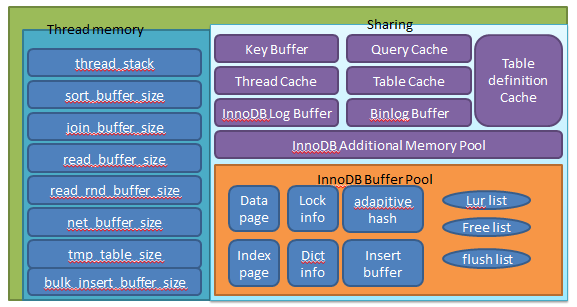

*********
mysql内存分析
*********
``MySQL`` 的内存大体可以分为 共享内存 和 ``session`` 私有内存两部分

共享内存
========
执行如下命令，即可查询示例的共享内存分配情况：

.. code-block:: sql

	show variables where variable_name in (
	'innodb_buffer_pool_size','innodb_log_buffer_size','innodb_additional_mem_pool_size','key_buffer_size','query_cache_size'
	);

如下是内存规格为 240 M 的 RDS 实例的共享内存分配情况的查询结果：

.. code-block:: shell

	+---------------------------------+-----------------+
	| Variable_name                   | Value           |
	+---------------------------------+-----------------+
	| innodb_additional_mem_pool_size | 2097152         |
	| innodb_buffer_pool_size         | 67108864        |
	| innodb_log_buffer_size          | 1048576         |
	| key_buffer_size                 | 16777216        |
	| query_cache_size                | 0               |
	+---------------------------------+-----------------+
	共返回 5 行记录,花费 342.74 ms.

全局内存消耗（共享内存）相关参数

1. innodb_buffer_pool_size

   使用过 ``Innodb`` 的同学都知道，这块内存是 ``Innodb`` 存储引擎最重要的内存，直接关系到 ``MySQL`` 的读写性能。与 ``MyISAM`` 表只缓存索引，数据寄望于 ``OS`` 系统缓存不同。 ``Innodb`` 一般都会关闭 ``OS`` 的缓存，所有读到数据页和索引都直接存在数据库层的 ``innodb_buffer_pool`` 中的。

   ``InnoDB`` 缓冲池缓存着 ``InnoDB`` 表，索引，及其它辅助缓冲器中的数据。为了实现大容量读取操作的效率，缓冲池被分成可以容纳多行的页。为了缓存管理的效率，缓冲池被实现为页面的链接列表，很少使用的数据使用 ``LRU`` 算法的变体进行页面替换。

   其中主要包含数据页、索引页、undo 页、insert buffer、自适应哈希索引、锁信息以及数据字典等信息。在进行 ``SQL`` 读和写的操作时，首先并不是对物理数据文件操作，而是先对 ``buffer_pool`` 进行操作，然后再通过 ``checkpoint`` 等机制写回数据文件。该空间的优点是可以提升数据库的性能、加快 ``SQL`` 运行速度，缺点是故障恢复速度较慢。

   缓冲池的大小对于系统性能很重要：

   - ``InnoDB`` 使用 ``malloc()`` 方法在服务器启动时为整个缓冲池分配内存，通常，推荐 ``innodb_buffer_pool_size`` 值为系统内存的 ``50％`` 至 ``75％`` 。 ``innodb_buffer_pool_size`` 可以在服务器运行时动态配置。
   - 在具有大量内存的系统上，你可以通过将缓冲池划分为多个缓冲池实例来提高并发性，其 ``innodb_buffer_pool_instances`` 系统变量用来定义缓冲池实例的数量。
   - 缓冲池太小可能会导致过多的交换，因为页面从缓冲池中刷新后仅在短时间内可能再次需要。
   - 缓冲池太大可能会因为内存竞争而导致交换。

2. innodb_additional_mem_pool_size

   主要用于存放 ``MySQL`` 内部的数据结构和 ``Innodb`` 的数据字典，所以大小主要与表的数量有关，表越多值越大。庆幸的是这个值是可变的，如果不够用的话， ``MySQL`` 会向操作系统申请的。该值默认 ``8M`` ， ``AWS`` 所有规格都是统一的 ``2M`` ，由于这个值可以动态申请，所以我觉得 ``2M`` 应该是满足需求的。

3. innodb_log_buffer_size

   这个是 ``redolog`` 的缓冲区，为了提高性能， ``MySQL`` 每次写日志都将日志先写到一个内存 ``Buffer`` 中，然后将 ``Buffer`` 按照 ``innodb_flush_log_at_trx_commit`` 的配置刷到 ``disk`` 上。目前，我们所有实例的 ``innodb_flush_log_at_trx_commit`` 设置为了 ``1`` ，即每次事务提交都会刷新 ``Buffer`` 到磁盘，保证已经提交的事务， ``redo`` 是不会丢的。 ``AWS`` 该值也设的是1（为了保证不丢数据），这个值的大小主要影响到刷磁盘的次数，设置的过小， ``Buffer`` 容易满，就会增加 ``fsync`` 的次数，设置过大，占用内存。该值默认是 ``8M`` ， ``AWS`` 所有规格统一 ``128M`` ，我觉得目前每次提交都会刷 ``buffer`` ，所以除非有大事务的情况，一般 ``buffer`` 不太可能被占满，所以没必要开的很大， ``8M`` 应该是满足需求的。

   该空间不需要太大，因为一般情况下该部分缓存会以较快频率刷新至 redo log（Master Thread 会每秒刷新、事务提交时会刷新、其空间少于 1/2 时同样会刷新）。

4. key_buffer_size

   ``MyISAM`` 表的 ``key`` 缓存，这个只对 ``MyISAM`` 存储引擎有效，所以对于我们绝大多数使用 ``Innodb`` 的应用，无需关心。

   该部分是 ``MyISAM`` 表的重要缓存区域，所有实例统一为 ``16M`` 。该部分主要存放 ``MyISAM`` 表的键。 ``MyISAM`` 表不同于 ``InnoDB`` 表，其缓存的索引缓存是放在 ``key_buffer`` 中的，而数据缓存则存储于操作系统的内存中。

5. query_cache_size

   ``MySQL`` 对于查询的结果会进行缓存来节省解析 ``SQL`` 、执行 ``SQL`` 的花销， ``query_cache`` 是按照 ``SQL`` 语句的 ``Hash`` 值进行缓存的，同时 ``SQL`` 语句涉及的表发生更新，该缓存就会失效，所以这个缓存对于特定的读多更新少的库比较有用，对于绝大多数更新较多的库可能不是很适用，比较受限于应用场景，所以 ``AWS`` 也把这个缓存给关了。我觉得这个值默认应该关闭，根据需求调整。

Session 私有内存
================
上面这些就是 ``MySQL`` 主要的共享内存空间，这些空间是在 ``MySQL`` 启动时就分配的，但是并不是立即使用的。 ``MySQL`` 还有一部分内存是在用户连接请求到达时动态分配的，即每个 ``MySQL`` 连接都单独一个缓存，这部分缓存主要包括：而出现 ``OOM`` 异常的实例都是由于下面各个连接私有的内存造成的。

执行如下命令，查询示例的 ``session`` 私有内存分配情况：

.. code-block:: shell

	show variables where variable_name in (
	'read_buffer_size','read_rnd_buffer_size','sort_buffer_size','join_buffer_size','binlog_cache_size','tmp_table_size'
	);

查询结果如下（如下为测试实例配置）：

.. code-block:: shell

	+-------------------------+-----------------+
	| Variable_name           | Value           |
	+-------------------------+-----------------+
	| binlog_cache_size       | 262144          |
	| join_buffer_size        | 262144          |
	| read_buffer_size        | 262144          |
	| read_rnd_buffer_size    | 262144          |
	| sort_buffer_size        | 262144          |
	| tmp_table_size          | 262144          |
	+-------------------------+-----------------+
	共返回 6 行记录,花费 356.54 ms.

1. read_buffer_size

   每个线程连续扫描时为扫描的每个表分配的缓存区的大小（字节）。如果进行多次连续扫描，可能还需要增加该值。默认值为 ``1311072`` ，只有当查询需要的时候，才分配 ``read_buffer_size`` 指定的全部内存。

   分别存放了对顺序和随机扫描（例如按照排序的顺序访问）的缓存， ``RDS`` 给每个 ``session`` 设置 ``256 K`` 的大小。当 ``thread`` 进行顺序或随机扫描数据时会首先扫描该 ``buffer`` 空间以避免更多的物理读。

2. read_rnd_buffer_size

   当以任意顺序读取行时，可以分配随机读取缓冲区，通过该缓冲区读取行，以避免磁盘寻找。 ``read_rnd_buffer_size`` 系统变量决定缓冲器大小。

3. sort_buffer_size

   每一个要做排序的请求，都会分到一个 ``sort_buffer_size`` 大的缓存，用于做 ``order by`` 和 ``group by`` 的排序，如果设置的缓存大小无法满足需要， ``MySQL`` 会将数据写入磁盘来完成排序。因为磁盘操作和内存操作不在一个数量级，所以 ``sort_buffer_size`` 对排序的性能影响很大。由于这部分缓存是即使不用这么大，也会全部分配的，所以对系统内存分配开销是比较大的，如果是希望扩大的话，建议在会话层设置，默认值 ``2M`` ， AWS 也是 ``2M`` 。

4. thread_stack

   默认 ``256K`` ， ``AWS`` 设置为 ``256K`` ， ``MySQL`` 为每个线程分配的堆栈大小，当线程堆栈太小时，这限制了服务器可以处理的 ``SQL`` 语句的复杂性。

   主要用来存放每一个线程自身的标识信息，如线程id，线程运行时基本信息等等，我们可以通过 ``thread_stack`` 参数来设置为每一个线程栈分配多大的内存。

5. join_buffer_size

   每个连接的每次 ``join`` 都分配一个，默认值 ``128K`` ， ``AWS`` 设置为 ``128K`` 。

   ``MySQL`` 仅支持 ``nest loop`` 的 ``join`` 算法， ``RDS`` 设置 ``256 K`` 的大小。处理逻辑是驱动表的一行和非驱动表联合查找，这时就可以将非驱动表放入 ``join_buffer`` ，不需要访问拥有并发保护机制的 ``buffer_pool`` 。

6. binlog_cache_size

   类似于 ``innodb_log_buffer_size`` 缓存事务日志， ``binlog_cache_size`` 缓存 ``Binlog`` ，不同的是这个是每个线程单独一个，主要对于大事务有较大性能提升。默认32K，AWS 32K。

   在一个事务还没有 ``commit`` 之前会先将其日志存储于 ``binlog_cache`` 中，等到事务 ``commit`` 后会将其 ``binlog`` 刷回磁盘上的 ``binlog`` 文件以持久化。

7. tmp_table_size

   默认 ``16M`` ，用户内存临时表的最大值，如果临时表超过该值， ``MySQL`` 就会把临时表转换为一个磁盘上 ``mysiam`` 表。如果用户需要做一些大表的 ``groupby`` 的操作，可能需要较大的该值，由于是与连接相关的，同样建议在会话层设置。

   如果用户在执行事务时遇到类似如下这样的错误，可以考虑增大 ``tmp_table`` 的值。

   .. code-block:: shell

    [Err] 1114 - The table '/home/mysql/data3081/tmp/#sql_6197_2' is full
