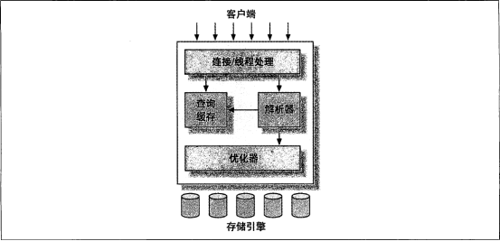

**********
MySQL架构和历史
**********

MySQL逻辑架构
=============

Mysql是三层的逻辑架构，如下图

- 最上层的服务并不是 ``MySQL`` 所独有的，大多数基于网络的客户端/服务器的工具或者服务都有类似的架构。比如连接处理、授权认证、安全等等。
- 第二层架构是 ``MySQL`` 比较有意思的部分。大多数 ``MySQL`` 的核心服务功能都在这一层，包括查询解析、分析、优化、缓存以及所有的内置函数（例如，日期、时间、数学和加密函数），所有跨存储引擎的功能都在这一层实现：存储过程、触发器、视图等。
- 第三层包含了存储引擎。存储引擎负责 ``MySQL`` 中数据的存储和提取。每个存储引擎都有它的优势和劣势。存储引擎 ``API`` 包含了几十个底层函数，但存储引擎不会去解析 ``SQL`` （注释： ``InnoDB`` 是一个例外，它会解析外键定义，因为 ``MySQL`` 服务器本身没有实现该功能，这也是 ``MyISAM`` 和 ``InnoDB`` 不同处之一），不同存储引擎之间也不会相互通信，而只是简单地响应上层服务器的请求。

连接管理与安全性
---------------

- 每个客户端连接都会在服务器进程中拥有一个线程，这个连接的查询只会在这个单独的线程中执行；
- MySQL5.5之后提供线程池插件，可以使用池中少量的线程来服务大量的连接；

当客户端连接到 ``MySQL`` 服务器时，服务器需要对其进行认证。认证基于用户名、原始主机信息和密码。如果使用了安全套接字(SSL)的方式连接，还可以使用 ``X.509`` 证书认证。一旦客户端连接成功，服务器会继续验证客户端是否具有执行某个特定查询的权限。

优化与执行
---------
``MySQL`` 会解析查询，并创建内部数据结构（解析树），然后对其进行各种优化，包括重写查询、决定表的读取顺序，以及选择合适的索引等。用户可以通过特殊的关键字提示优化器，影响它的决策过程。

对于 ``SELECT`` 语句，在解析查询之前，服务器会先检查查询缓存（Query Cache），如果能够在其中找到对应的查询，服务器就不必再执行查询解析、优化和执行的整个过程，而是直接返回查询缓存中的结果集。（第7章详细讨论）

存储引擎对于优化查询是有影响的。

并发控制
========
分为服务器层和存储引擎层的并发控制，读写锁和并发锁。

读写锁
------
读锁是共享的，或者说是相互不阻塞的。多个客户在同一时刻可以同时读取一个资源，且互不干扰。写锁则是排他的，就是说一个写锁会阻塞其他的写锁和读锁，这是出于安全策略的考虑，只有这样，才能确保在给定时间里，只有一个用户能执行写入，并防止其他用户读取正在写入的同一资源。另外在一般情况下，写锁比读锁优先级高。

锁粒度
------
一种提高共享资源并发性的方式就是让锁定对象更有选择性。尽量只锁定需要修改的部分数据，而不是所有的资源。更理想的方式是，只对会修改的数据片进行精确的锁定。

问题是加锁也需要消耗资源。锁的各种操作，包括获得锁、检查锁是否已经解除、释放锁等，都会增加系统的开销。

- 锁策略：就是在锁的开销和数据的安全性之间寻求平衡，这种平衡当然也会影响到性能。
- 表锁（table lock）：表锁是 ``MySQL`` 中最基本的锁策略，并且是开销最小的策略。
- 行级锁（row lock）：行级锁最大程度地支持并发处理（同时也带来了最大的锁开销）。行级锁只在存储引擎层实现，而 ``MySQL`` 服务器层没有实现。

事务
====
事务就是一组原子性的 ``SQL`` 查询，或者说一个独立的工作单元。事务内的语句，要么全部执行成功，要么全部执行失败。

多版本并发控制
=============

MySQL的存储引擎
===============

MySQL时间线
===========

MySQL的开发模式
===============
