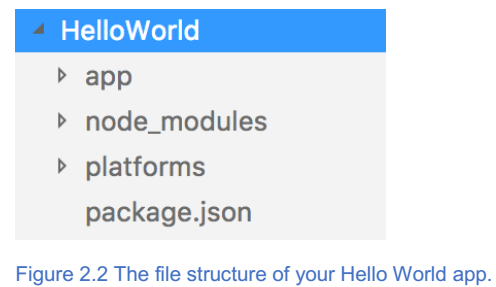
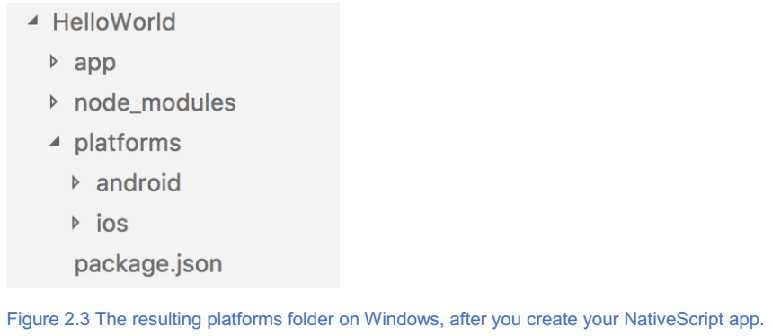
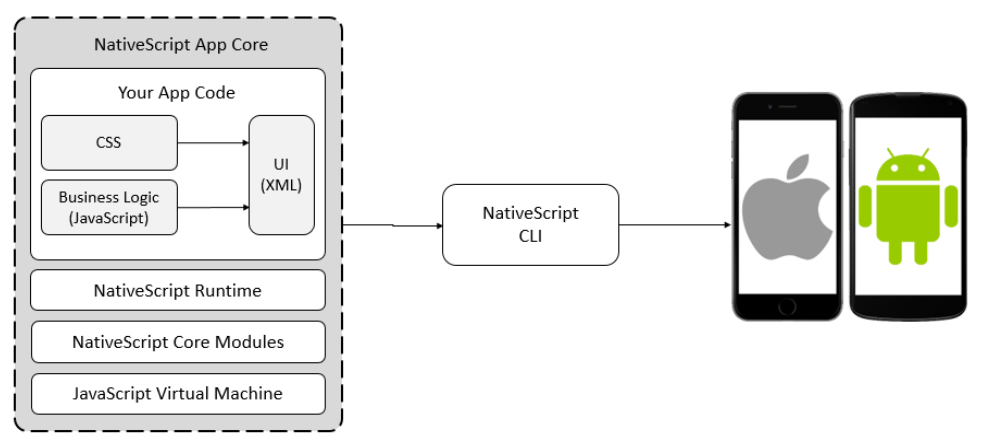
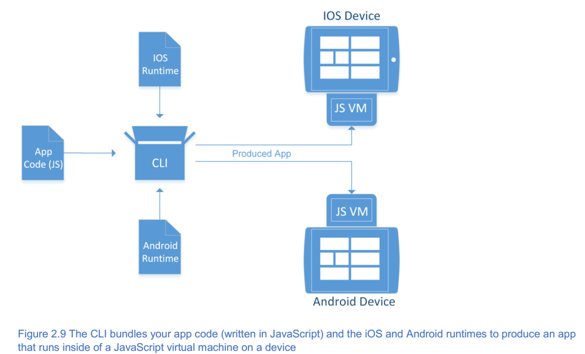
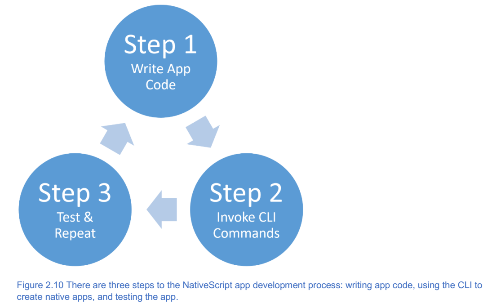
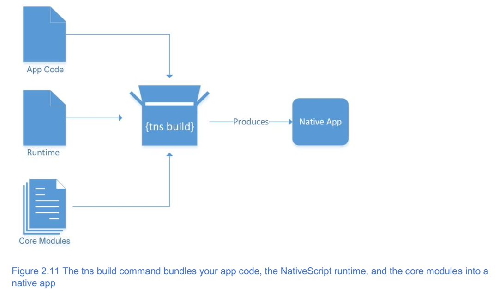

*************
你的第一个App
*************

本章涵盖

- ``NativeScript`` 运行时；
- ``NativeScript`` 开发工作流程；
- ``NativeScript CLI`` ；
- 您的第一个 ``NativeScript`` 应用程序；

在第1章中，为您介绍了 ``NativeScript`` 。您了解到 ``NativeScript`` 为您提供了一种编写应用代码的方法，并将您的应用部署到多个平台（ ``iOS`` 和 ``Android`` ）。您还了解到，您可以使用现有的 ``XML`` ， ``JavaScript`` 和 ``CSS`` 开发知识创建 ``NativeScript`` 应用程序。现在您可以进一步观察 ``NativeScript`` 并编写您的第一个应用程序！

.. tip:: 在学习开发跨平台移动应用程序时，您应该在初始开发期间选择一台设备进行测试。这一点非常重要，因为您不希望一次性在多个平台上测试，从而失去对应用程序创建的关注。在完成开发应用程序的每个功能时，停止并在各种设备上测试您的应用程序。一旦您满意，该功能可在所有平台上运行，然后返回单个设备进行进一步开发。

在整本书中，我们选择在 ``iPhone 6`` 上开发和测试我们的应用程序，所以您可以看到很多 ``iPhone`` 屏幕截图。 有意义的是，我们将包括 ``Android`` 上运行的相同应用程序代码的并排比较。仅仅因为我们开始使用 iPhone 并不意味着您必须使用它：使用您熟悉的平台，因为它会使测试更容易。

在开始开发您的第一个应用程序之前，让我们仔细看看 ``NativeScript`` 应用程序的剖析。

Hello World
===========
这可能有点陈词滥调，但 ``hello world`` 应用程序仍然是开始使用任何新语言的好方法（为什么 ``NativeScript`` 应该有所不同？）在 ``NativeScript`` 中创建 ``hello world`` 应用程序后，您将获得必要的知识以便继续创建更强大的应用程序，例如您将在第4章中构建的商店前端应用程序。让我们开始使用 ``NativeScript`` 命令行界面( ``CLI`` )工具创建 ``hello world`` 应用程序。

NativeScript CLI
----------------
正如您在第1章中学到的， ``NativeScript CLI`` 是您将用来构建和运行 ``NativeScript`` 应用程序的一系列工具。 ``CLI`` 只不过是在为 ``NativeScript`` 配置开发环境时安装到 ``Node.js`` 中的 ``npm`` 软件包。

.. tip:: ``Node.js`` 是一个 ``JavaScript`` 虚拟机（VM）接口，被编写为与桌面和服务器操作系统（如 ``Linux`` 和 ``Microsoft Windows`` ）进行交互。它于2009年创建，允许开发人员使用 ``JavaScript`` 并编写可跨平台运行的软件。像 ``Web`` 浏览器和 ``NativeScript`` 一样， ``Node.js`` 提供接口代码来通知 ``JavaScript VM`` 如何与不同的操作系统进行交互。您可以通过 https://nodejs.org 了解关于 ``Node.js`` 的更多信息。

``NativeScript CLI`` 将在整个开发生命周期中使用，如图2.1所示。

.. image:: ./images/2-1.png

``NativeScript`` 应用程序是用 ``XML`` ， ``JavaScript`` 和 ``CSS`` 编写的代码文件的集合。总体而言，用户界面(UI)，业务逻辑和样式形成应用程序的页面，如 ``HTML`` 应用程序页面。一旦为应用程序编写了页面，就可以使用 ``NativeScript CLI`` 将代码转换为本地应用程序。然后使用 ``CLI`` 在模拟器，模拟器或物理设备上安装并运行应用程序。

您可以通过从您最喜爱的终端或命令行窗口中调用 ``tns <sub-command>`` 命令来使用 ``NativeScript CLI`` 。

.. tip:: ``TNS`` 代表 ``Telerik NativeScript`` 。 ``Telerik`` 是 ``NativeScript`` 项目背后的公司。 选择缩写 ``TNS`` 以避免与 ``NS`` 混淆。缩写 ``NS`` 用于整个 ``Mac OS X`` 和 ``iOS API`` ，代表 ``NextStep`` 。

``CLI`` 中存在各种子命令，所有这些命令都旨在使您可以在 ``Android`` 和 ``iOS`` 平台上轻松构建，部署和运行您的应用。我们不打算深入了解 ``CLI`` 的内部工作原理，但我们认为重要的是了解 ``CLI`` 对 ``NativeScript`` 开发的整体性。没有 ``CLI`` ，你所拥有的只是 ``XML`` ， ``JavaScript`` 和 ``CSS`` 文件，无处可去。在本书中，您会看到我们使用 ``CLI`` 进行以下操作：

- 创建你的应用；
- 将移动平台添加到您的应用程序( ``Android`` 或 ``iOS`` )；
- 将代码构建到本地应用程序(适用于 ``Android`` 的 ``.apk`` 文件和适用于 ``iOS`` 的 ``.ipa`` 应用程序文件)；
- 将您的应用程序部署到移动设备；
- 使用模拟器测试您的代码；
- 在连接到计算机的设备上运行应用程序；

使用CLI搭建您的项目
-------------------
``CLI`` 的核心功能是通过自动执行繁琐的任务来加速您的开发过程。其中一项任务是创建一个新的 ``NativeScript`` 应用程序。 ``NativeScript`` 应用程序必须具备非常特定的文件和文件夹结构，并且 ``CLI`` 通过称为脚手架的处理使此冗长的任务变得轻松。

.. tip:: 脚手架是使用预定义模板生成文件，文件夹和代码的处理。这个处理被称为脚手架，因为它类似于建筑脚手架，它是建筑物外部的临时结构，在工人建造建筑物时使用。就像构建脚手架一样，代码脚手架创建了一个应用程序的基础结构，然后构建和修改它以创建一个可用的应用程序。脚手架工具在软件开发中变得越来越流行，因为它们有助于减少开发人员花时间编写通用，可重复的代码结构的时间。

您可能熟悉类似的脚手架工具，例如内置于 ``Visual Studio`` 中的项目模板或另一个名为 ``Yeoman`` 的 ``Node.js`` 工具。就像这些工具一样， ``NativeScript CLI`` 的脚手架流程以 ``npm`` 包的形式打包一系列在线存储的模板。

.. note:: ``NativeScript`` 模板只是 ``npm`` 包。要找到它们，请转到 ``npm`` 网站 ``https://www.npmjs.com`` ，然后搜索以 ``tns-template`` 开头的软件包。

您将使用 ``hello world`` 模板创建您的第一个 ``NativeScript`` 应用程序。 ``hello world`` 模板是 ``NativeScript`` 用于创建新应用程序的默认模板。要开始使用此模板，请加载您最喜欢的终端。如果您使用 ``Windows`` ，则可以使用命令提示符或 ``PowerShell`` ；在 ``Windows`` 上，我通常坚持使用命令提示符。在 ``Mac OS`` 或 ``Linux`` 上，您可以加载您最喜爱的终端程序。在 ``Mac OS`` 上处理 ``NativeScript`` 应用程序时，我使用默认终端。

在安装 ``NativeScript`` 期间， ``tns`` 命令被添加到您的路径或 ``shell`` 配置文件中（取决于您使用的操作系统）。让我们通过运行 ``tns create HelloWorld`` 来创建您的第一个应用程序。

当您运行 ``tns create {app-name}`` 命令时， ``NativeScript CLI`` 会使用您指定的应用程序名称创建一个新文件夹（在当前文件夹中）。创建该文件夹后，它将构建和运行新的 ``NativeScript`` 应用程序所需的所有代码脚手架！图2.2显示了在运行 ``create`` 命令之后为您创建的结果目录结构。

在本书后面的部分，我们将详细讨论 ``NativeScript`` 应用程序的文件夹结构。现在，请注意，您将为您的应用程序编写的所有代码都将位于应用程序( ``app`` )文件夹中。

.. tip:: 运行 ``tns create`` 命令你只用一个参数： ``HelloWorld`` 。 或者，您可以通过使用 ``--template {template name}`` 参数指定您希望在搭建项目时使用的模板。不指定模板名称， ``create`` 命令将使用默认的 ``hello-world`` 模板。你可以通过运行 ``tns create HelloWorld --template tns-template-hello-world`` 来获得相同的结果。在第3章中，您将学习更多关于模板以及 ``NativeScript CLI`` 如何搭建应用程序的知识。

初始化平台和开发工具
--------------------
在运行 ``hello world`` 应用程序之前，您需要决定是否要初始定位平台 ``iOS`` 或 ``Android`` 。 首先选择一个平台作为目标非常重要，这样您就可以专注于在单个应用程序和单个仿真器或模拟器上测试功能。 一旦你确信你的应用在你的第一个平台上运行良好，你可以在第二个平台上进行测试。

决定你的开发平台可能看起来像一个艰难的决定，但它可能比你想象的更容易，因为这个决定的一部分可能已经为你做了。表2.1显示了您将能够定位的潜在平台（取决于您的操作系统）。不幸的是，除非你有一台 ``Mac`` ，否则你不能定位 ``iOS`` ，所以如果你使用的是 ``Windows`` 或者 ``Linux`` ， ``Android`` 就是你的开始平台。如果你有一台 ``Mac`` ，那么选择是你的。但是，如果您仍然无法决定，我们建议您从您熟悉的平台开始。如果您有 ``iPhone`` ，则定位 ``iOS`` ，否则定位 ``Android`` 。

表2-1 每一个开发操作系统可定位的平台

+------------------+-------------+
| 开发机器操作系统 | 可定位平台  |
+==================+=============+
| Windows          | Android     |
+------------------+-------------+
| Mac OS           | iOS,Android |
+------------------+-------------+
| Linux            | Android     |
+------------------+-------------+

如果您打算将 ``Windows`` 机器用作您的主要开发机器并且希望稍后为 ``iOS`` 构建，请不要担心。在 ``NativeScript`` 中针对不同平台定位和构建您的应用程序非常简单。使用 ``NativeScript`` 时，从一开始就针对一个平台是首选工作流程。 当需要将应用程序安装到另一个平台上时，您总是可以从朋友那里借用 ``Mac`` (或者更好的方式是购买旧的翻新 ``Mac mini`` )！

除了选择目标应用平台之外，您还需要决定要使用的开发编辑器。无论您选择基本的文本编辑器， ``Visual Studio`` 还是其他集成开发环境 ( ``IDE`` )，都不是错误的答案。选择你最喜欢的开发工具。我们最喜欢的 ``Windows`` ， ``Mac OS`` 和 ``Linux`` 上的编辑器之一就是 ``Visual Studio Code`` 。

.. tip:: ``Visual Studio Code`` 是完全免费的，可以从 https://code.visualstudio.com 下载。 ``Visual Studio Code`` 在 ``Mac`` ， ``PC`` 和 ``Linux`` 上都能很好地工作。这是我们用来编写 ``NativeScript`` 应用程序的内容，在学习 ``NativeScript`` 时强烈建议您使用。 ``Visual Studio`` 代码有一个正式的 ``NativeScript`` 扩展，它可以在创建应用时提供更好的智能感知，调试和模拟器支持，从而为您提供帮助。该扩展可从 https://www.nativescript.org/nativescript-for-visual-studio-code 获得。

增加和移除平台
--------------
现在您已经开始创建您的第一个官方 ``NativeScript`` 应用程序，您几乎可以开始测试了！在开始测试您的应用程序之前，您需要确保您的 ``Hello World`` 应用程序运行在您选择的平台（或两者兼而有之）。添加和删除平台很容易。如果您需要添加平台，请运行以下命令。 图2.3显示了生成的平台文件夹：

.. code-block:: shell

    tns platform add android
    tns platform add ios

当您运行 ``tns platform add`` 命令时， ``NativeScript CLI`` 将创建本地 ``Android`` 和 ``iOS`` 项目，并为每个项目添加重要的 ``NativeScript`` 运行时库。这些库（以及您编写的代码）最终将一起捆绑到本地应用程序中，并存储在平台文件夹的子文件夹中。

由于新功能不断添加到 ``NativeScript`` 中，因此 ``NativeScript`` 运行时会定期更新。 ``NativeScript`` 运行时包含在先前安装的 ``NativeScript npm`` 软件包中。我们建议您在学习 ``NativeScript`` 和本书时保持 ``NativeScript`` 版本的最新状态。当新版本可用时，您不必更新 ``NativeScript`` 运行时，但您可能需要。您可以使用 ``--version`` 参数运行 ``tns`` 命令来检查您安装的 ``NativeScript`` 版本。

.. code-block:: shell

    tns --version

您可以通过 https://www.npmjs.com/package/nativescript 在 ``npm`` 上检查 ``NativeScript`` 的最新版本，或者使用 ``npm`` 命令 ``npm view nativescript`` 版本检查 ``NativeScript`` 的最新版本。由于 ``NativeScript`` 只是一个 ``npm`` 包，您可以使用 ``npm`` 命令 ``npm install -g nativescript`` 来更新它。

.. note:: 请记住， ``ativeScript`` 是一个开源项目。 您可以通过 https://github.com/NativeScript/NativeScript/releases 阅读 ``Github`` 上 ``NativeScript`` 的版本历史记录和最新更改。 如果你非常喜欢，你可以通过提交拉请求来为项目做出贡献。

更新 ``NativeScript`` 运行时后，您需要更新应用程序中的运行时文件（但首先您需要删除旧文件）。以下命令显示如何使用 ``tns platform remove`` 命令从项目中删除 ``Android`` 和 ``iOS`` 平台。

.. code-block:: shell

    tns platform remove android
    tns platform remove ios

``NativeScript CLI`` 会告诉您是否成功移除平台。如果该平台不作为项目中的目标存在，则 ``NativeScript CLI`` 将无法将其删除。图2.4显示了运行这两个命令后生成的空平台文件夹。

要使用 ``Android`` 或 ``iOS`` 平台的 ``NativeScript`` 运行时的最新版本更新您的应用程序，请运行以下命令：

.. code-block:: shell

    tns platform add android
    tns platform add ios

.. note:: 如果您在 ``Windows`` 或 ``Linux`` 计算机上开发时尝试将 ``iOS`` 添加为目标平台，则 ``NativeScript CLI`` 将检测到此消息并引发错误消息。（请记住， ``Mac OS`` 是将 ``iOS`` 作为平台定位的先决条件）

正如您现在可能已经想出的那样， ``NativeScript`` 在 ``platforms`` 文件夹下面组织特定平台的文件。当平台添加命令运行时，最新的运行时文件将被复制到平台文件夹下相应的文件夹中。例如，如果您浏览平台下的 android 子文件夹，您会注意到很多文件。被复制的文件包含以下内容：

- 特定平台的文件；
- 平台配置文件；

您将在后面的章节中详细了解特定于平台的文件。

在模拟器中运行你的App
---------------------
现在您已经学会了如何定位平台，现在是时候在模拟器中运行您的应用并对其进行测试！使用以下命令启动您的应用程序，使用 ``Android`` 模拟器或 ``iOS`` 模拟器：

.. code-block:: shell

    tns run ios --emulator
    tns run android --emulator

.. note:: 确保你在 ``HelloWorld`` 项目文件夹的根目录下运行 ``run`` 命令，否则你会得到一个错误。

当您使用 ``run`` 命令时， ``NativeScript CLI`` 将为您自动构建原生 ``Android`` 或 ``iOS`` 应用程序。图2.5显示了特定于平台的文件夹中的文件如何与您的应用程序的代码结合使用，以创建将在 ``Android`` 或 ``iOS`` 上运行的本地应用程序。

.. image:: ./images/2-5.png

如果您使用 ``iOS`` 参数运行应用程序，则 ``iOS`` 文件夹中的 ``iOS`` 平台文件用于创建本地 ``iOS`` 应用程序。同样，如果您为 ``Android`` 运行应用程序，则会使用 ``Android`` 的 ``NativeScript`` 运行时（在 ``android`` 文件夹中）。

NativeScript apps
=================
使用 ``JavaScript`` ， ``XML`` 和 ``CSS`` 编写原生移动应用程序并不是开发人员经常讨论的内容。相反，您听说在 ``Objective C`` ， ``Swift`` 或 ``Java`` 中编写移动应用程序。 ``NativeScript`` 使用 ``JavaScript`` 编写具有多个组件的应用程序成为可能，这些组件包括：您的应用程序代码， ``NativeScript`` 运行时和核心模块， ``JavaScript`` 虚拟机（VM）以及 ``NativeScript`` 命令行界面（CLI）。图2.7显示了 ``NativeScript`` 应用程序的所有部分如何组合在一起。

``NativeScript`` 应用程序的核心来自您编写的代码（使用 ``XML`` ， ``CSS`` 和 ``JavaScript`` ）。您编写的代码还将利用 ``NativeScript`` 核心模块和 ``NativeScript`` 运行时。 ``NativeScript`` 运行时和核心模块是创建 ``NativeScript`` 应用程序时将使用的库。你的应用程序代码和这些库运行在一个 ``JavaScript`` 虚拟机中（我们将稍微详细介绍一下）。通过 ``NativeScript CLI`` 将这四个组件一起捆绑在一起，为 ``Android`` 和 ``iOS`` 创建原生应用程序。

NativeScript 运行时
-------------------
当移动应用程序使用本地代码编写时，它们被编译成特殊的应用程序文件并分发到移动设备。图2.8显示了如何编写本地代码并将其部署到设备。

对于 ``iOS`` ，您在 ``Objective C`` 中编写代码，该代码已编译并构建到 ``.ipa`` 文件中并分发给运行 ``iOS`` 设备。对于 ``Android`` ，您编写 ``Java`` 代码，将代码编译并构建到 ``.apk`` 文件中，然后将 ``.apk`` 文件分发到 ``Android`` 设备。当 ``iOS`` 和 ``Android`` 运行各自的应用程序时，设备本地运行编译的 ``Objective C`` 和 ``Java`` 代码。

在 ``NativeScript`` 中编写应用程序时，您可以使用 ``JavaScript`` 编写应用程序，该应用程序未编译，但与 ``NativeScript`` 运行时一起捆绑到应用程序文件中。图2.9显示了应用程序代码在 ``Android`` 或 ``iOS`` 设备上的运行方式。

正如您所看到的，您使用 ``JavaScript`` 一次性编写应用程序代码，并且 ``NativeScript`` 运行时确保它在 ``Android`` 或 ``iOS`` 上运行。 ``NativeScript`` 运行时是在您的应用程序运行时在设备上发出本机调用的。 运行时通过捆绑到您的本机应用程序中的 ``JavaScript VM`` 执行此操作。

JavaScript虚拟机
----------------
``JavaScript`` 虚拟机是一些专门的软件，它们执行 ``JavaScript`` 代码并在底层环境上运行代码。如果您熟悉网络编程，您将在 ``Web`` 浏览器中使用 ``JavaScript VM`` 。每个浏览器运行一个 ``JavaScript VM`` ，然后运行您编写的 ``JavaScript`` 代码。简而言之， ``JavaScript VM`` 知道如何做一件事：读取和执行 ``JavaScript`` 代码。例如， ``VM`` 知道如何读取和执行 ``JavaScript`` 变量， ``FOR`` 循环和函数。

由于 ``JavaScript VM`` 只知道 ``JavaScript`` ，所以他们不了解 ``Web`` 浏览器。即使它们是浏览器的一部分，但是如果没有帮助，它们本身并不理解浏览器概念，如 DOM（文档对象模型），文档对象或窗口对象。因此，当一个 ``JavaScript`` 虚拟机被包含在 Web 浏览器内时，浏览器制造商会创建接口代码来教会虚拟机如何与浏览器进行交互。这教导了虚拟机存在文档和窗口对象，并分别表示 ``HTML`` 文档和浏览器窗口。

在NativeScript中的JavaScript虚拟机
-----------------------------------
现在您已经介绍了 ``JavaScript VM`` ，并且您了解 ``VM`` 如何与浏览器捆绑在一起，您将了解 ``NativeScript`` 如何利用 ``JavaScript VM`` 。与浏览器类似， ``NativeScript`` 应用程序与 ``JavaScript VM`` 捆绑在一起以读取并运行您的 ``JavaScript`` 代码。就像浏览器中的 ``JavaScript VM`` 一样，与 ``NativeScript`` 应用程序捆绑在一起的 ``JavaScript VM`` 知道如何做一件事 - 读取和执行 ``JavaScript`` 代码。

可是等等！如果 ``NativeScript JavaScript VM`` 只知道如何读取和执行 ``JavaScript`` 变量， ``FOR`` 循环和函数，它如何知道如何与 ``Android`` 手机或 ``iOS`` 平板电脑等移动设备进行交互？ 如果没有帮助，它不会，这就是为什么 ``NativeScript`` 开发团队编写了接口代码（称为 ``NativeScript`` 核心模块和 ``NativeScript`` 运行时）以教授关于移动设备 ``API`` （如 ``Android`` 和 ``iOS`` ）的 ``JavaScript`` 虚拟机。

.. note:: ``NativeScript`` 核心模块是您将在本书中了解的一系列库。 这些库是您用来构建应用程序并指导 ``NativeScript`` 运行时应用程序在设备上执行什么操作的库。核心模块由不同的库组成，如 ``UI`` 组件（按钮，列表视图，标签），导航和应用程序。

.. note:: ``NativeScript`` 运行时是接口代码，它连接 ``JavaScript`` 代码与 ``Android`` 和 ``iOS`` 本机 ``API`` 之间的空隙。就像浏览器制造商通过接口代码教他们关于文档和窗口对象的 ``JavaScript`` 虚拟机一样， ``NativeScript`` 运行时教导它的 ``JavaScript`` 虚拟机关于底层本机设备 ``API`` 。

建立你的开发工作流
==================
现在您对 ``NativeScript`` 的工作原理有了更深入的了解，现在应该为自己建立一个开发工作流程。 在开始创建应用程序之前，建立您的开发工作流程非常重要。由于您只需编写一次代码，并且 ``NativeScript`` 运行时将代码作为本机代码运行，您不必花费大量时间来担心应用程序将如何跨不同平台运行。

.. note:: ``Android`` 中有一些功能可能不适用于 ``iOS`` ，反之亦然。因此，您仍然可能需要编写一些专门针对 ``Android`` 或 ``iOS`` 的代码。幸运的是， ``NativeScript`` 提供了几种在特定平台上代码的机制。 您将在第3章中了解有关平台特定代码的更多信息。

平台特定的实现是一种解脱，因为它允许您专注于应用程序的功能和使其更好。实际上，我不想知道 ``Android`` 和 ``iOS`` 上按钮和文本的显示细节。这就是 ``NativeScript`` 的用途！

现在，我们来了解一下典型的 ``NativeScript`` 开发流程。这一基本过程是您在编写 ``NativeScript`` 应用程序时不断重复的过程。图2.10显示了编写应用程序代码，调用 ``NativeScript CLI`` 命令将代码捆绑到本机应用程序，然后测试应用程序的三个步骤过程。

构建NativeScript app
--------------------
您已经知道 ``NativeScript`` 应用程序是用 ``XML`` ， ``JavaScript`` 和 ``CSS`` 编写的。这是您开发工作流程的第一步。让我们仔细看看步骤2，即 ``NativeScript CLI`` 。 在第2步中， ``NativeScript CLI`` 将您的代码转换为本地应用程序，将应用程序部署到移动设备（或模拟器/模拟器），并运行该应用程序。当我们创建并运行您的第一个应用程序时，您已经看到 ``CLI`` 在行动：hello world。

当您创建 ``hello world`` 应用程序时，您使用了 ``tns run <platform> --emulator`` 命令在模拟器/模拟器中构建，部署和运行应用程序。但是，您可能需要构建应用程序，而不必部署和运行它。您可以使用以下某个 ``tns`` 构建命令为 ``Android`` 或 ``iOS`` 构建您的应用程序：

.. code-block:: shell

    tns build ios
    tns build android

``tns build`` 命令打包您的应用程序代码， ``NativeScript`` 运行时和核心模块打包到本机应用程序中（图2.11）。

每次构建应用程序时，无论是通过 ``tns build`` 还是 ``tns run`` 命令， ``NativeScript CLI`` 都会将您的应用程序代码以及 ``NativeScript`` 运行时和核心模块一起使用，并将其打包到 ``Android`` 或 ``iOS`` 的本机应用程序中。在这一点上，您可能会认为这看起来很多工作，并且您正在浪费大量时间来构建，运行，等待模拟器启动，等等。 如果您认为这是正确的：可能需要很长时间，特别是如果您有大型应用程序。 所以，让我介绍一个更好的方法：实时同步。

实时同步
--------
因为每次要测试更改时都需要构建，部署和重新启动应用程序， ``NativeScript CLI`` 会将更改程序代码快速注入到正在运行的应用程序中。这个过程被称为实时同步，并且它是自动完成的。

.. note:: 在早期版本的 ``NativeScript`` 中，您必须使用特殊的 ``CLI`` 命令才能使用 ``livesync`` 。 但是，它现在已经完全集成到 ``CLI`` 中，并且不需要做任何特殊的事情。使用 ``tns`` 运行，并且应用程序上运行的代码将自动保持最新。即使同步是内置的，我们仍然将同步技术称为实时同步。

当您运行 ``tns run`` 命令时， ``lifeync`` 引擎 ``NativeScript CLI`` 将计算增量文件更改并将文件同步到设备（或模拟器/模拟器）。图2.12显示了如何通过替换正在运行的 ``NativeScript`` 应用程序中的单个文件来实现同步。

快速参考
========
我们已经介绍了本章中的许多概念，如果您是 ``NativeScript`` 的新手，您可能会感到不知所措。有 ``CLI`` 命令需要理解，跨平台编译以及将源代码更改同步到正在运行的应用程序。因为这可能会让人困惑，所以我们为你做了两件事。首先，请查看附录B中的 ``NativeScript CLI`` 快速参考指南：它列出了您在本书中使用的 ``CLI`` 命令。其次，表2.2是一个入门快速参考。 它总结了创建新应用程序并在仿真器/模拟器中运行时需要使用的 ``NativeScript CLI`` 命令。

CLI命令  描述
tns create <app-name>  创建一个名为 ``<app-name>`` 的新的跨平台 ``NativeScript`` 应用程序。 将使用您的应用程序的名称创建一个文件夹，并添加第3章中介绍的 ``NativeScript`` 应用程序结构。 该命令还使用 ``JavaScript`` 创建了一个 ``vanilla NativeScript`` 应用程序。有关其他选项，请参阅附录B。
tns platform add <platform>  将 ``Android`` 和 ``iOS`` 平台添加到您的应用程序。该命令是可选的，因为 ``tns run`` 在构建和部署应用程序之前执行此操作。
tns run <platform>  当你的应用程序已经创建，采取快捷方式并使用 ``tns run android`` 或 ``tns run ios`` 。这将添加本地平台，将您的应用程序的源代码复制到本地项目中，编译您的应用程序，将其安装在设备，模拟器或模拟器上，运行它，然后使用实时同步监视它的更改。

总结
====
在本章中，您了解了以下内容：

- 尽早建立开发工作流程将使您专注于创建应用程序，而不是专注于不同的平台。
- ``NativeScript CLI`` 是开发工作流程的重要组成部分。
- 如何使用 ``NativeScript CLI`` 运行各种命令（创建，平台添加/删除，运行）。
- 当您使用 ``tns run`` 命令运行应用程序时，它会监控应用程序的源代码以进行更改，并将其自动同步到正在运行的设备。

