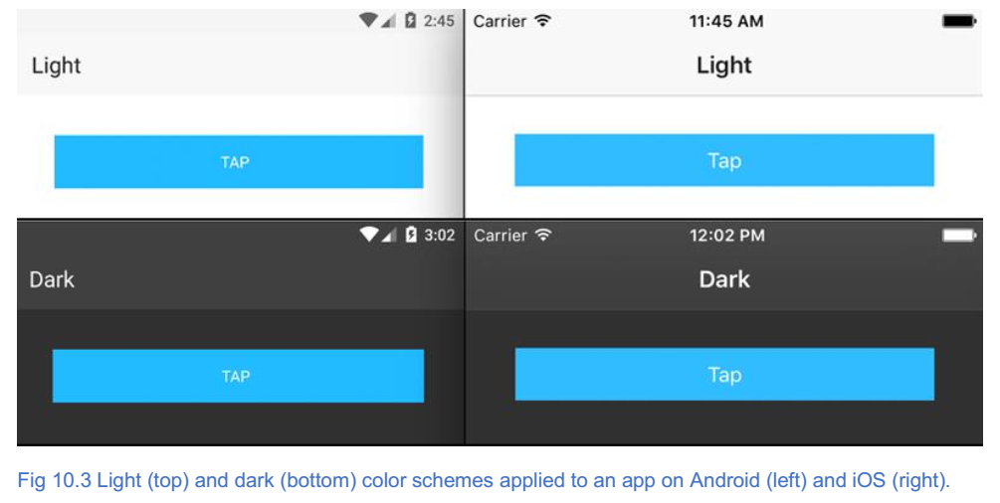
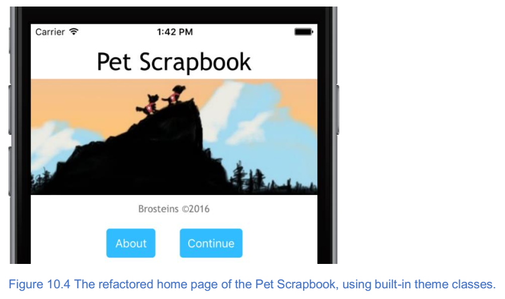
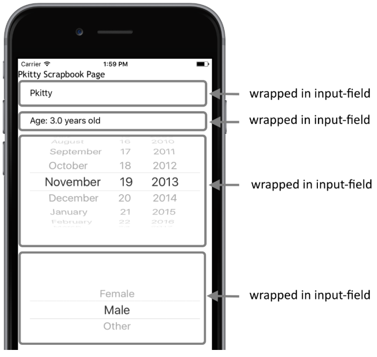

************************
使用主题创建专业用户界面
************************

本章涵盖

- 使用 NativeScript 主题而不是自定义 CSS 为您的应用设计风格
- 创建一致的数据输入表单以改善用户体验

在过去几章中，您已经学习了关于数据绑定以及通过创建 Pet Scrapbook 应用程序与移动设备硬件进行交互的知识。宠物剪贴簿应用程序功能，但它不觉得像一个精心设计的应用程序：它有点笨重。我们忽略了应用程序的视觉设计，细节页面很难使用，而且该应用程序仅适用于手机尺寸的设备。现在是时候解决这些问题，并让应用程序感觉很好。

在接下来的两章中，您将学习如何使用更高级的 UI 设计技术将正常运行的应用程序转变为更加精美的应用程序。什么构成更加精美的应用程序是有点主观的，但有可用于改进应用程序的可靠的 UI 设计模式。在本章中，我们将通过使用 NativeScript 主题来设计 UI 的风格，开始重构和改进 Pet Scrapbook 应用程序。让我们开始吧！

主题
====
我们可能会稍微引申一下，但请耐心等待，因为我们正沿着怀旧之路走一趟。如果你已经完成了一些网页开发，你可能还记得用 CSS ，边距，填充，浮动和清除浮动的旧日子 - 手工编写 UI 。 这是光荣的。然后是 Bootstrap 。以某种方式构建您的 HTML 标记，添加几个类，并且您的应用程序开始看起来不错（至少对于我们来说，非设计者而言）。 当然，每个人的网站看起来都是一样的。

好的，足够回忆。 尽管你是一名设计师，但严肃地说，设计出色的用户界面很难。而且，我们不是设计师，所以我们喜欢使用工具轻松创建出色的应用。这就是主题引入的原因。

.. note:: 主题是可用于快速设计应用程序的预构建 ``CSS`` 样式规则的集合。将主题视为 ``NativeScript`` 应用程序的 ``Bootstrap`` 。

通过遵循一些 ``XML`` 标记约定并应用 ``CSS`` 样式，您的应用程序就可以实现。但让我们清楚：仅仅因为你使用主题并不意味着你将永远不会再为你的应用程序编写 ``CSS`` 。你仍然需要 ``CSS`` ，但几乎没有那么多。

将主题融入您的应用程序
----------------------
我们重构之旅的第一站是用主题重新设计我们的应用程序。我们将通过删除一些自定义 ``CSS`` 来更新每个页面，并添加由 ``NativeScript`` 主题提供的预定义 ``CSS`` 类。我们认为学习新东西的最佳途径是通过练习，让我们开始吧。

正如我们前面所说的，主题是预构建的 ``CSS`` 类选择器的集合。主题集合保持为名为 ``nativescript-theme-core`` 的 ``npm`` 包，如果您使用 ``NativeScript 2.4.0`` 或更高版本创建应用程序，它将自动包含在您的应用程序中。

.. tip:: 如果您不知道最初使用什么版本的 ``NativeScript`` 脚本来支持您的应用，那没关系。 检查应用程序根目录中的 ``package.json`` 文件。如果安装了 ``nativescript-theme-core`` 软件包，则会在依赖项部分中看到它。例如： ``"nativescript-theme-core"："^ 1.0.2"`` 。

如果您没有安装 ``nativescript-theme-core`` 软件包，则可以使用 ``npm`` 从命令行进行安装：

.. code-block:: shell

    npm install nativescript-theme-core --save

在安装过程中， ``npm`` 将 ``nativescript-theme-core`` 添加到 ``node_modules`` 文件夹中，如图10.2所示。

.. image:: ./images/10-1.png

``nativescript-theme-core`` 中包含几种配色方案 - 两种核心方案：明亮和黑暗以及其他十一种颜色（蓝色，灰色，橙色，紫色等）。 所有颜色方案提供相同的功能，但以不同的方式着色 ``UI`` 元素。图10.3显示了 ``Android`` （左）和 ``iOS`` （右）的灯光（顶部）和暗部（底部）配色方案。

要使用颜色方案，请将 ``CSS`` 文件导入 ``app.css`` 文件顶部的应用程序中。要导入灯光主题，请添加以下参考：

.. code-block:: js

    @import 'nativescript-theme-core/css/core.light.css';

.. tip:: 切换配色方案很容易。如果您希望看到使用深色配色方案，请删除 app.css 文件顶部的 ``core.light.css import`` 语句，并添加 ``@import'nativescripttheme-core / css / core.dark.css';`` 。探索 ``nativescript-theme-core`` npm 软件包的 ``css`` 文件夹以获取其他配色方案（例如蓝色）。要切换到备用颜色，请导入颜色： ``@import'nativescript-theme-core / css / blue.css';`` 。

我们将在 Pet Scrapbook 中使用浅色配色。请确保通过在顶部添加 ``import`` 语句将其导入到 ``app.css`` 文件中：

.. code-block:: js

    @import 'nativescript-theme-core/css/core.light.css';

使用文本类，对齐和填充
======================
我们将开始在宠物剪贴簿的主页上使用主题。在第9章的末尾，主页有几个页眉，页脚和标签的自定义 ``CSS`` 类（列表10.1）。

清单10.1 第9章末尾的 home-page.css 中的自定义 CSS 类

.. code-block:: css

    .header {
        font-size: 32px;
    }

    label {
        text-align: center;
        margin-top: 10px;
        margin-bottom: 10px;
    }

    .footer {
        font-size: 10px;
    }

然后， ``home-page.xml`` 页面使用这些类将页面标题大小（32px），页脚标签大小（10px），居中放置两个标签，并在顶部和底部提供10px的边距（列表10.2）。

列表10.2 第9章末尾的 home-page.xml 摘录

.. code-block:: xml

    <StackLayout>
      <Label class="header" text="{{title}}"/>
      <Image src="~/images/home.png"/>
      <Label class="footer" text="{{footer}}"/>
      <StackLayout orientation="horizontal" horizontalAlignment="center">
        <Button style="margin-right: 20px;" text="About"/>
        <Button style="margin-left: 20px;" text="Continue" tap="onContinueTap"/>
      </StackLayout>
    </StackLayout>

在我们继续之前，请从 ``home-page.css`` 文件中删除自定义样式。我们将从此处使用主题包中的内建样式。

.. warning:: 如果您不删除现有样式，则不会遇到任何错误，但您的应用可能与我们的看起来有所不同。

字体大小
--------
让我们开始通过解决标题字体大小来替换 CSS 。用作标题的标签可以用 h1 ， h2 ，...和 h6 CSS 类替换，如 HTML 中的 <h1> ， <h2>  ...和 <h6> 标签。

.. tip:: 使用h1，h2，h3，h4，h5和h6 CSS类来设置用作页面标题的标签。

标题标签旨在成为页面上的主标题，因此让我们将它的类更改为 ``h1`` : ``<Label class ="h1"... />`` 。

另一个常见需求是创建一个图片标题或脚注，通常字体大小比正常页面文本略小，且不那么明显。

.. tip:: 使用 ``footnote`` CSS 类来标记用作图像标题或脚注的标签。

我们现有的页脚类是内置脚注类的替代品，因此请将标签更改为： ``<Label class ="footnote"... />`` 。

文本对齐
--------
尽管使用 ``text-align:center`` 创建 CSS 规则来对齐标签并不需要太多的努力，但我们可以使用内置的 CSS 类 ``text-center`` 来完成同样的事情。所以，我们通过添加 ``text-center`` 类来更新这两个标签：

.. code-block:: xml

    <Label class="h1 text-center" text="{{ title }}" />
    <Label class="footnote text-center" text="{{ footer }}" />

.. tip:: 使用内置的 CSS 类 ``text-center`` ， ``text-left`` 和 ``text-right`` 来对齐应用中的标签。

最后，我们可以使用内置类替换我们对边距和填充CSS规则的使用。内置填充和边距类使用基于约定的方法： ``{margin/padding}-{top/bottom/left/right}-{amount}`` ，其中各种关键字（如 ``margin`` ， ``top`` 和 ``left`` ）均为 仅使用第一个字母缩写。 所以，一个 ``m-t-25`` 的 ``CSS`` 类在元素的顶部添加了一个 ``25px`` 的边距。同样， ``p-b-5`` 在元素的底部添加了 ``5px`` 的填充。

让我们用我们刚刚了解的新的基于惯例的类来替换我们对顶部，底部，左侧和右侧边距规则的现有用法。第一个候选者是具有内联样式规则的关于和继续按钮：

.. code-block:: xml

    <Button class="m-r-20" text="About" />
    <Button class="m-l-20" text="Continue" tap="onContinueTap" />

通过使用 ``m-r-20`` 和 ``m-l-20`` 类，在 ``About`` 按钮的右侧添加了 ``20px`` 的边距，并在 ``Continue`` 按钮的左侧添加了 ``20px`` 的边距。要将 ``10px`` 页边距的样式规则替换为标签的顶部和底部，我们可以使用内置类 ``m-t-10`` 和 ``m-b-10`` ，但有一条捷径。

.. tip:: 当您想要对同一轴上的元素应用相同的边距或填充（顶部/底部被认为是 ``y`` 轴，左/右是 ``x`` 轴）时，您可以使用单个类。 将 ``x`` 或 ``y`` 替换为类的方向组件。例如， ``m-t-10`` 和 ``m-b-10`` 可以合并为 ``m-y-10`` 。

使用这个新约定，我们可以通过添加 ``m-y-10`` 类来快速将 ``10px`` 的边距应用于标签的顶部和底部：

.. code-block:: xml

    <Label class="h1 text-center m-y-10" text="{{ title }}" />
    <Label class="footnote text-center m-y-10" text="{{ footer }}" />

样式化按钮
==========
我们将在主页上进行的最后更改是关于我们的关于和继续按钮。 ``NativeScript`` 的一大优点是，在 ``UI`` 上放置一个按钮会创建一个原生的 ``Android`` 和 ``iOS`` 按钮 - 其中包含原生按钮的默认样式。所以，你可能会问，为什么我想要以不同的方式设计我的按钮？

在很多情况下，你可能不想。原生的外观和感觉正是你想要的。毕竟， ``Android`` 应用程序应该看起来像 ``Android`` 应用程序， ``iOS`` 应用程序应该像 ``iOS`` 应用程序一样。同时，我们与很多开发人员进行了交流，我们听到了以下三件事情：

1. 为所有应用程序提供统一的外观和感觉非常重要。
2. 默认的 iOS 按钮看起来不像一个按钮(它看起来像一个链接)，并且经常会让新开发的 iOS 开发人员感到困惑。
3. 应用程序用户经常抱怨按钮尺寸太小，当他们点击按钮时，他们经常会错过按钮的点击框，导致他们多次点击按钮以使其工作。

.. note:: 按钮或链接的点击框是按钮周围的用于检测用户是否点击了按钮的屏幕区域。 较小的按钮（其固有地具有较小的点击框）更难以点击。创建更大的按钮是增加用户在第一次尝试时轻按按钮的可能性的一种方式。

通过使用主题内置的按钮类别，您可以解决以上三点。让我们开始将基本 ``CSS`` 类 ``btn`` 添加到我们的按钮中：

.. code-block:: xml

    <Button class="btn m-r-20" text="About" />
    <Button class="btn m-l-20" text="Continue" ... />

此基类应用按钮的默认样式，包括元素之间的大小和间距。

.. tip:: 虽然不是必需的，但我们建议您在设计按钮样式时从此类开始。

您的下一个选择是该按钮是纯色还是透明的。 ``btn-primary`` 类使用主题的主色调来设置按钮，而 ``btn-outline`` 使用带有细边轮廓的透明背景。我们喜欢彩色按钮的外观，所以让我们将 ``btn-primary`` 类添加到我们的按钮中：

.. code-block:: xml

    <Button class="btn btn-primary m-r-20" text="About" />
    <Button class="btn btn-primary m-l-20" text="Continue" ... />

.. warning:: 不要将 ``btn-primary`` 和 ``btn-outline`` 类应用于同一个按钮。只能选一个。

下一个按钮样式选项可以选择是否按钮带有圆角。如果你想要一个更平滑的设计，你可能会喜欢圆润的边缘，但如果你的应用的设计有更多的硬边缘和角度，方角可能会更好。

默认的按钮样式是方形的角落。要添加圆角，请使用 ``btn-rounded-sm`` 或 ``btn-rounded-lg`` 类，它们将小（sm）或大（lg）圆角添加到按钮。我们喜欢小圆角的外观，所以我们将这些添加到我们的按钮中：

.. code-block:: xml

    <Button class="btn ... btn-rounded-sm" text="About" />
    <Button class="btn ... btn-rounded-sm" text="Continue" ... />

最后，您可以为按钮添加一个特殊效果，使它们在出现时高亮显示，通过添加 ``btn-active`` 类来点击。我们喜欢微妙的效果，所以我们将它添加到按钮中：

.. code-block:: xml

    <Button class="btn ... btn-active" text="About" />
    <Button class="btn ... btn-active" text="Continue" ... />

清理
----
我们对主页进行了很多更改，并学习了如何设置文本和按钮的样式。在更改之前，请删除 ``home-page.css`` 文件; 我们不需要它，因为我们用内置类替换了它的全部功能！

如果您一直关注， ``home-page.xml`` 文件应该看起来像列表10.3，您的应用应该如图10.4所示。

清单10.3 使用内置主题类重构 home-page.xml 后的摘录

.. code-block:: xml

    <StackLayout>
      <Label class="h1 text-center m-y-10" text="{{ title }}"/>
      <Image src="~/images/home.png"/>
      <Label class="footnote text-center m-y-10" text="{{ footer }}"/>
      <StackLayout orientation="horizontal" horizontalAlignment="center">
        <Button class="btn btn-primary btn-rounded-sm btn-active m-r-20" text="About"/>
        <Button class="btn btn-primary btn-rounded-sm btn-active m-l-20" text="Continue" tap="onContinueTap"/>
      </StackLayout>
    </StackLayout>

样式化列表视图
==============
现在我们已经使用内置的 ``CSS`` 类重构了 Pet Scrapbook 的主页，接下来让我们进入剪贴簿页面。您会记得，此页面是剪贴簿页面（或条目）的列表。 清单10.4,10.5和图10.5显示了第9章之后剪贴簿页面的相关代码。

清单10.4 在第9章之后来自 scrapbook-page.xml 的摘录

.. code-block:: xml

    <ListView items="{{ pages }}" itemTap="onItemTap">
      <ListView.itemTemplate>
        <StackLayout orientation="horizontal">
          <Image src="{{ image }}"/>
          <Label text="{{ title, title + ' Scrapbook Page' }}"/>
        </StackLayout>
      </ListView.itemTemplate>
    </ListView>

清单10.5 样式在第9章之后形成 scrapbook-page.css

.. code-block:: css

    label {
        text-align: center;
        margin-top: 10px;
        margin-bottom: 10px;
    }

    image {
        height: 50px;
        width: 50px;
    }

.. image:: ./images/10-4.png

我们并未完全否认此页面的风格，但我们可以做得更好一点。就像文本和按钮具有内置的类规则一样，可以使用主题来设置列表视图的样式。列表视图使用 ``list-group`` 和 ``list-group-item`` 类进行样式化。 ``list-group`` 类应用于 ``ListView`` 元素，而 ``listgroup-item`` 类应用于列表视图项目模板内的顶级布局容器。清单10.6展示了如何应用这些类。

清单10.6 将 list-group 和 list-group-item 添加到 scrapbook-page.xml

.. code-block:: xml

    <ListView items="{{ pages }}" itemTap="onItemTap" class="list-group">//列表组类被应用于ListView元素
      <ListView.itemTemplate>
        <StackLayout orientation="horizontal" class="list-group-item">//列表组项目类应用于项目模板的布局容器
          <Image src="{{ image }}"/>
          <Label text="{{ title, title + ' Scrapbook Page' }}"/>
        </StackLayout>
      </ListView.itemTemplate>
    </ListView>

在我们向您展示结果之前，让我们做一些更多的事情，从项目模板的标签开始。列表视图主题有两个文本类： ``list-group-item-heading`` 和 ``list-group-item-text`` 。它们一起用于列表视图中的标题和普通文本。我们没有真正的标题，所以我们将坚持使用标签上的普通文本类：

.. code-block:: xml

    <Label text="{{ title, title + ' Scrapbook Page' }}" class="list-group-item-text" />

我们要做的最后一项改变就是我们的图片。移动应用习惯在列表视图中在文本旁边放置图像或图标，而列表视图主题不会让人失望。

.. tip:: 将 ``thumb`` 类应用于列表视图项目模板中的图像以将图像转换为缩略图。

让我们更新我们的图像以包含 ``thumb`` 类：

.. code-block:: xml

    <Image src="{{ image }}" class="thumb" />

我们完成了！ 图10.6显示了添加几个主题样式的结果。

.. image:: ./images/10-5.png

使用图片
========
宠物剪贴簿列表视图已经足够好了，但我们无法拒绝为缩略图图像添加最后一项变更。内置主题有两个漂亮的类： ``img-rounded`` 和 ``img-circle`` ，它们允许您将圆角添加到图像，甚至使图像成为圆形。我们是圆形图像外观的粉丝，所以让我们将 ``img-circle`` 类添加到缩略图图像：

.. code-block:: xml

    <Image src="{{ image }}" class="thumb img-circle" />

.. warning:: 在幕后， ``img-rounded`` 和 ``img-circle`` 类将 ``border-radius`` CSS 属性应用于图像。``Border-radius``（通过 ``img-rounded`` 和 ``img-circle`` 的扩展）要求图像具有明确的高度和宽度设置。我们的例子的工作原理是因为 ``thumb`` 类为我们明确地设置了宽度和高度，但是您应该记住这一点，因为很容易忘记。

添加 ``img-circle`` 类后，我们来看看（图10.7）。

.. image:: ./images/10-6.png

剪贴簿列表视图看起来很棒！现在是时候进入剪贴簿更新页面，在那里您将学习如何使用主题包中的几个类来设置数据输入表单的样式。

.. note:: 不要忘记删除 ``scrapbook-page.css`` 文件。 现在我们已经使用了内置主题，不需要自定义 ``CSS`` 样式。

样式化数据输入表单
==================
到目前为止，我们应用到宠物剪贴簿的主题样式是快速变化，不需要我们修改 ``UI`` 结构。我们所要做的就是将类应用于现有的元素。但是，我们将通过添加几个结构化 ``XML`` 元素来改变它，以帮助我们重构和设计剪贴簿的更新页面。这些修改不是广泛的或者是侵入性的，但我们会做出一些修改。坚信我们，因为它是值得的。

宠物剪贴簿的更新页面旨在成为一个简单的数据输入表单，但第9章的产品与简单数据（图10.8）相差甚远。

.. image:: ./images/10-7.png

我们可以做得更好。清单10.7是我们的出发点 - 第9章末尾的 scrapbookUpdate-page.xml 。

清单10.7 第9章末尾的 scrapbookUpdate-page.xml 文件

.. code-block:: xml

    <Page loaded="onLoaded">
      <StackLayout>
        <Label text="{{ title, title + ' Scrapbook Page' }}"/>
        <TextField class="header" text="{{ title }}" hint="Enter title..."/> 页面的标题（或名称）数据条目
        <Label text="{{ 'Age: ' + calcAge(year, month, day) + ' years old'}}"/> 出生日期选择
        <DatePicker year="{{ year }}" month="{{ month }}" day="{{ day }}"/> #B
        <ListPicker items="{{ genders }}" selectedIndex="{{ gender }}"/> 性别选择
        <Image src="{{ image }}" stretch="none"/> 图片选择
        <StackLayout orientation="horizontal">#D
          <Label text="{{ (lat, long), 'Picture taken at ' + #D lat + ', ' + long }}"/> #D
        </StackLayout> #D
        <Button tap="onAddImageTap" text="Add Image"/>
        <Button tap="onDoneTap" text="Done"/>
      </StackLayout>
    </Page>

像大多数数据输入页面一样，更新页面被分成我们正在收集的每个数据点的离散区域：标题，出生日期，性别和图片。但是，存在一个问题 - 在用户界面中的所有内容都融合在一起。这不是非常用户友好的。我们通过使用数据表单主题类来解决这个问题。

正如我们前面提到的，数据表单主题类在您的用户界面上强加了一个 ``XML`` 结构，以确保一致性和一致性。总之，一个数据表由一个主堆栈布局和一系列子堆栈布局组成。主布局被分配了类 ``form`` ，并且每个子布局系列都被分配了类 ``input-field`` 。让我们通过使用这个结构包装每个数据输入字段来看到这一点（列表10.8）。

清单10.8 使用表单主题类重构 scrapbookUpdate-page.xml 文件

.. code-block:: xml

    <Page loaded="onLoaded">
      <StackLayout>
        <Label text="{{ title, title + ' Scrapbook Page' }}"/>
        <StackLayout class="form">//主栈布局随表单类一起添加
          <StackLayout class="input-field">//每个数据字段标签和控件都包装在输入字段类中
            <TextField class="header" text="{{ title }}" hint="Enter title..."/>
          </StackLayout>
          <StackLayout class="input-field">
            <Label text="{{ 'Age: ' + calcAge(year, month, day) + ' years old'}}"/>
            <DatePicker year="{{ year }}" month="{{ month }}" day="{{ day }}"/>
          </StackLayout>
          ....//剩余字段未显示，但会用输入字段类包装成堆栈布局
          <Button tap="onAddImageTap" text="Add Image"/>
          <Button tap="onDoneTap" text="Done"/>
        </StackLayout>
      </StackLayout>
    </Page>

我们对更新页面进行了若干结构性更改，但它们很简单。我们添加了一个具有表单类的主栈布局。 此堆栈布局包含数据输入表单。在主堆栈布局中，我们使用另一个堆栈布局来封装每个数据输入字段。输入字段类然后应用于堆栈布局。

这并不会从根本上改变页面的外观，如图10.9所示，在应用了输入字段类的每个元素之间和周围都会添加额外的空间。

构建数据输入字段
----------------
标准数据输入字段由两个元素组成：用于描述数据输入字段的标签和数据输入控件（如文本字段，日期选择器等）。

.. tip:: 创建数据输入页面时，将标签和数据输入元素组合在一起以创建一致的用户界面。

查看标题，出生日期和性别字段，我们没有遵循这种模式。用户应该如何知道日期选择器是出生日期？ 有些用户在将年龄标签与下面的日期选择器连接时可能没有问题，但 ``UI`` 中的统一性可创建一致的用户体验。

我们通过为标题，出生日期和性别以及图像字段添加一致的标签来解决此问题。在向输入字段堆栈布局添加标签时，我们将应用两个类： ``label`` 和 ``input`` 。

.. note::  ``label`` 和 ``input`` 类用于设置输入字段标签和文本字段的样式。它们是主题样式的一部分，有助于创建更一致的 ``UI`` 体验。

从标题字段开始，我们将添加带有 ``label`` 类的标签。我们还将字段的名称更改为 ``name`` ，因为它更具描述性：

.. code-block:: xml

    <Label class="label" text="Name:" />

接下来是出生日期标签。现有的标签显示年龄，但可能会造成混淆。让我们称它为什么 - 出生日期，但也显示计算的年龄（列表10.9）

清单10.9 更新了 scrapbookUpdate-page.xml 文件中的出生日期标签

.. code-block:: xml

    <Label class="label" text="{{ (year, month, day), 'Birth date: ' + //始终显示出生日期字段标签
    (year === null ? //如果数据绑定年份字段为空，则不显示任何内容
    '' : '(' + calcAge(year, month, day) + ' years old)' ) }}" //选择日期时有条件地显示计算的年龄
    />

我们对标签的文本值使用了稍微更高级的数据绑定表达式，所以我们一步一步分解它。首先，我们总是希望显示 ``Birth date:`` ，所以这是数据绑定表达式的一部分。其次，我们要有条件地显示使用 ``calcAge()`` 函数计算的年龄。为了有条件地显示年龄，我们使用三元运算符。

.. note:: 三元运算符是通过使用 ``{conditional-statement} ? {evaluate-if-true}:{evaluate-if-false}`` 的语法来执行。例如， ``if-then-else`` 语句如果 ``x`` ，则 ``y`` ，否则 ``z`` 的 ``if-then-else`` 语句表示为 ``x ? y : z`` 使用三元运算符。

.. tip:: 避免在用户界面中显示未定义或空数据值 - 这会分散给用户。 在数据绑定表达式中使用三元运算符来控制数据绑定字段的条件显示。

最后两个字段与名称字段相似。我们会将标签添加到其输入字段堆栈布局中并应用 ``label`` 类。

.. code-block:: xml

    <Label text="Gender:" class="label" />
    <Label text="Image:" class="label" />

在我们处理图像数据输入字段时，让我们重新使用您之前了解的 ``footnote`` 类，并使用三元运算符将经度和纬度标签更改为脚注，以便仅在经度和纬度不是经度和纬度时显示位置未定义（清单10.10）。

清单10.10 使用 scrapbookUpdatepage.xml 文件中的三元运算符重构的图像位置标签

.. code-block:: xml

    <Label class="footnote"
    text="{{ (lat, long),
    (lat === undefined || long === undefined) ?
    '' :'Picture taken at ' + lat + ', ' + long }}"
    />

如果你一直在跟随，你的更新页面应该如清单10.11和图10.10所示。

.. note:: 在运行应用程序之前，不要忘记从 ``scrapbookUpdate-page.css`` 文件中删除自定义标签样式。如果你不这样做，你的应用程序将看起来不像我们的。

清单10.11 使用表单主题类重构 scrapbookUpdate 页面

.. code-block:: xml

    <Page loaded="onLoaded">
      <StackLayout>
        <Label text="{{ title, title + ' Scrapbook Page' }}"/>
        <StackLayout class="form">
          <StackLayout class="input-field">
            <Label text="Name:" class="label"/>
            <TextField class="header" text="{{ title }}" hint="Enter title..."/>
          </StackLayout>
          <StackLayout class="input-field">
            <Label class="label" text="{{ 'Birth date: ' + (year === null ? '' : '(' + calcAge(year, month, day) + ' years old)') }}"/>
            <DatePicker year="{{ year }}" month="{{ month }}" day="{{ day }}"/>
          </StackLayout>
          <StackLayout class="input-field">
            <Label text="Gender:" class="label"/>
            <ListPicker items="{{ genders }}" selectedIndex="{{ gender }}"/>
          </StackLayout>
          <StackLayout class="input-field">
            <Label text="Image:" class="label"/>
            <Image src="{{ image }}" stretch="none"/>
            <Label text="{{ (lat, long), (lat === undefined || long === undefined) ? '' : 'Picture taken at ' + lat + ', ' + long }}"/>
          </StackLayout>
        </StackLayout>
        <Button tap="onAddImageTap" text="Add Image"/>
        <Button tap="onDoneTap" text="Done"/>
      </StackLayout>
    </Page>

.. image:: ./images/10-9.png

我们已经涵盖了很多主题背景，并且您已经学会了如何将内置主题类集成到您的应用中，以节省时间并制作更一致的 ``UI`` 。还有更多需要了解主题的知识，为文本和其他 ``UI`` 元素着色的附加类。本章中我们不会专门介绍这些内容，但我们将在本书的其余部分中以随机的方式向您介绍这些内容。如果您现在有兴趣了解更多信息， ``NativeScript`` 文档将包含主题包中包含的每个类的完整列表。在 https://docs.nativescript.org/ui/theme 查看。

当我们离开主题时，更新页面似乎还不完整。事实上，它不起作用，看起来很混乱。出生日期选择器和性别列表选取器占用大量空间，这会导致用户向下滚动页面。我们可以做得更好。在下一章中，您将学习如何清理 ``UI`` 并使其更加实用。

总结
====
在本章中，您了解了以下内容：

- 通过安装 ``nativescript-themecore``  npm 软件包，您可以使用预构建的 ``CSS`` 样式包对应用程序进行样式设置。
- ``CSS`` 边距和填充可应用于具有 ``{m/p}-{t/b/l/r}-{＃}`` 的简短类名称语法的元素，其中 ``m/p`` 代表边距和填充， ``t/b/l/r`` 代表顶部，底部，左侧和右侧， ``＃`` 代表像素的数量。
- 使用主题 ``CSS`` 类 ``form`` ， ``input-field`` ， ``label`` 和 ``input`` ，您可以创建一致的数据输入表单。
- 三元运算符( ``{if-conditional}?{return-if-true}:{return-if-false}`` )是一种可以代替 ``if-then-else`` 语句的简写逻辑表达式。

