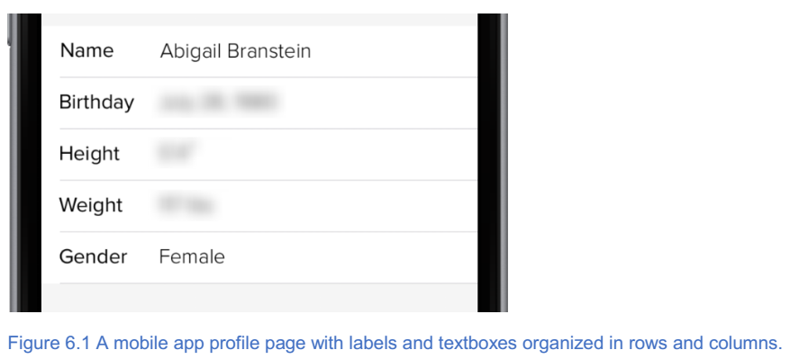
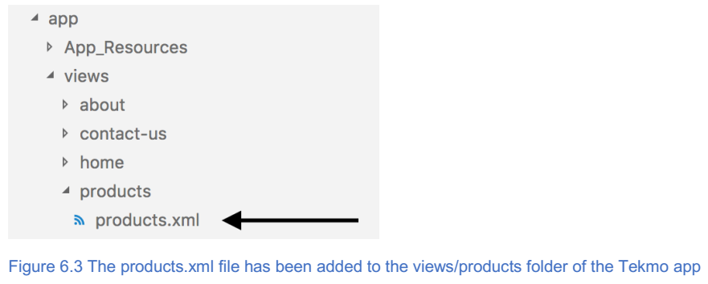
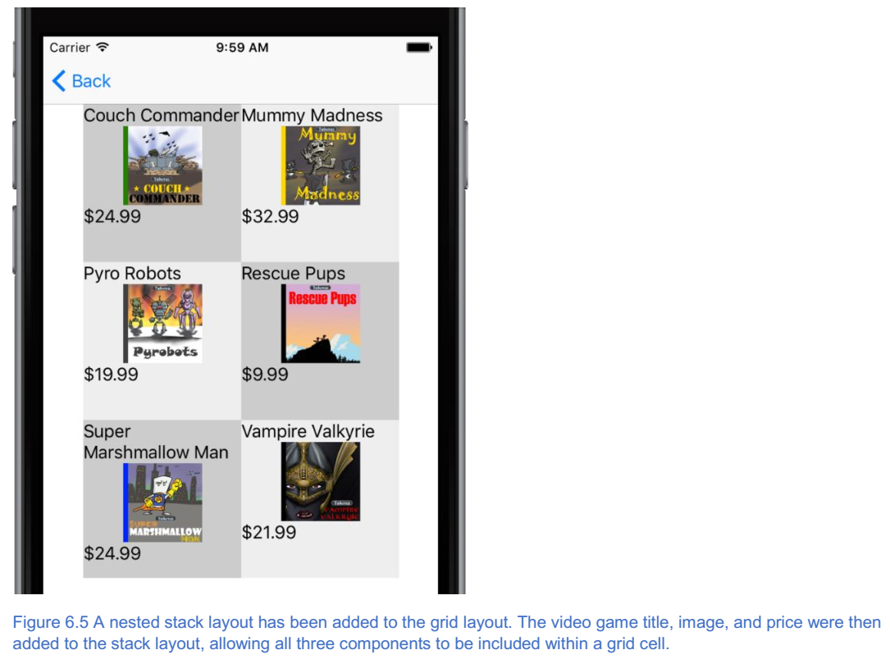
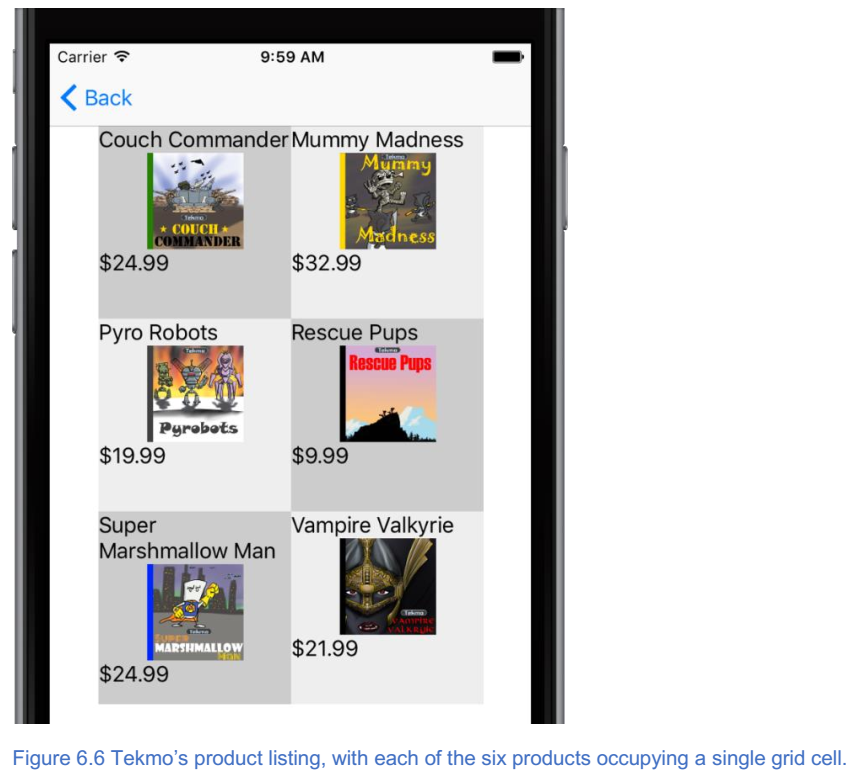
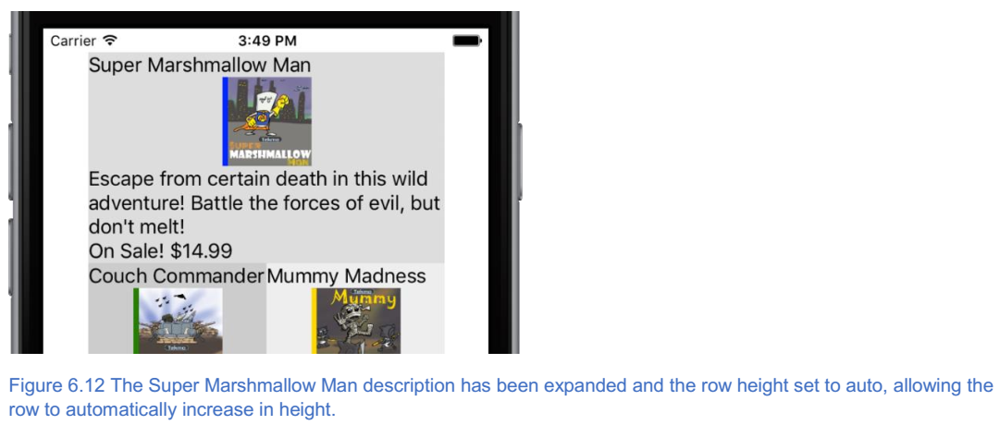

************
使用高级布局
************

本章涵盖

- 如何使用网格布局来组织您的应用程序用户界面( ``UI`` )；
- 布局容器如何嵌套在一起以创建更高级的 ``UI`` 设计；
- 如何使用网格布局来创建大小一致的行和列；
- 您可以指定网格布局行和列的大小（宽度和高度）的三种不同方式；

在第5章中，您了解了堆栈布局以及它如何让您将 ``UI`` 组件堆叠在一起。这个布局是一个基本的布局容器，它会出现在你写的每个应用程序中；然而，它是有限制的。在本章中，您将介绍一个额外的布局：网格布局。在了解了网格布局后，您将能够构建更高级和复杂的 ``UI`` 设计。事实上，只有堆栈和网格布局，您将能够创建几乎任何 UI 。这似乎是一个延伸，但根据我们的经验，我们已经能够通过使用这两种布局来构建大约95％的应用布局。

介绍网格布局
============
想象一下，您正在开发一系列以行和列排列的标签和文本字段的移动应用程序。图6.1中的配置文件页面显示了一个这样的 ``UI`` 的例子。

使用堆栈布局，您已经知道如何创建具有堆叠在一起的各种元素的 ``UI`` ，但堆栈布局并不适合网格的 ``UI`` 。网格布局非常合适！

.. note:: 网格布局是一个布局容器，可以将 ``UI`` 元素组织为一组行和列。

列表6.1显示了用于在屏幕上显示网格布局的 ``XML`` 代码。

清单6.1将网格布局添加到页面

.. code-block:: xml

    <Page>
        <GridLayout rows=”*,*,*” columns=”*,*”  // 这将创建一个三行两列的网格布局。 现在不要担心行和列的语法，我会在后面介绍。
                    width=”300” height=”450”> // 栅格被强制为300像素宽，450像素高
            ... #C // 嵌套的UI控件在这里。
        </GridLayout>
    </Page>

要将网格布局添加到页面，请添加 ``<GridLayout rows ="..." columns ="...">`` 元素。您还会注意到 ``width ="300"`` 和 ``height ="450"`` 属性。你还没有了解这些属性，但它们的名字很好且不言自明。宽度和高度描述了它们的确切目的：将布局的宽度和高度设置为给定数量的像素。

如您所见，网格布局元素语法很简单; 但是，在定义布局时，还需要包含 ``rows`` 和 ``columns`` 属性。

.. note:: 网格布局的行和列属性定义了布局容器中的行数和列数。

在清单6.1中，我们创建了一个三行两列的网格布局。您可以通过查看每个属性中逗号分隔值的数量来知道这一点。 ``rows`` 属性有三个逗号分隔值（ ``rows = "*，*，*"`` ），表示网格布局有三行。 ``columns`` 属性有两个以逗号分隔的值（ ``columns = "*，*"`` ），表示网格布局有两行。现在，了解这些以逗号分隔的值是什么意思并不重要。我们将在本章后面介绍。 相反，请记住，对于每个逗号分隔的值，都有一行或一列。

给网格布局添加内容
==================
在前面的章节中，您学习了如何创建三行两列的网格布局。在我们教你如何在网格布局中组织 ``UI`` 元素之前，让我们看一个三行高两列的网格（图6.2）。

.. image:: ./images/6-2.png

三行两列的网格布局共有六个单元格，单元格坐标为（0,0），（0,1），（1,0），（1,1），（2,0）， 和（2,1）。

.. note:: 单元格是指网格中特定行和列的交集。单元格是创造网格的天然副产品。单元术语并非特定于 NativeScript ，而是在谈论网格的特定行和列时，是一个普遍接受的术语。就像屏幕上的像素一样，可以使用坐标符号（行＃，列＃）来引用单元格。使用这种符号，一个两行两列的网格，总共有四个单元格：左上角的单元格（0,0），右上角的单元格（0,1），左下角的单元格（1,0） ，和右下角的单元格（1,1）。

在您学习如何将 ``UI`` 元素添加到网格布局时，请务必牢记我们 3 x 2 网格中每个单元格的单元格坐标。就像堆栈布局一样，网格布局是一个容器，这意味着嵌套在布局内部的 ``UI`` 元素受布局规则的支配。网格布局的规则很容易记住，因为只有一个规则：每个 ``UI`` 元素必须标识组件将出现的单元格。

将单个 UI 组件添加到网格单元格中
---------------------------------
使用此规则，让我们将产品页面添加到 ``Tekmo`` 应用程序，然后在页面中添加网格布局。您将在前面的章节中回想起一个页面由 ``XML`` ， ``JavaScript`` 和 ``CSS`` 文件组成。现在，我们将添加 ``XML`` 文件，并将其命名为 ``products.xml`` 。将 ``products.xml`` 页面放入应用程序的 ``views/products`` 文件夹中，如图6.3所示。

一旦我们完成了产品页面，它将展示 ``Tekmo`` 出售的六款复古视频游戏： Couch Commander ，疯狂木乃伊， Pyro机器人 ， Rescue Pups ， 超级棉花糖男人 和 Vampire Valkyrie 。我们首先在 ``Products.xml`` 文件中添加 ``Page`` 和 ``GridLayout`` 元素。网格将是 3 x 2 （三行两列）。在每个网格单元格中，我们将放置一个 ``Label`` 元素，表示每个游戏的标题（列表6.2和图6.4）。

列表6.2一个三行两列的网格布局，每个单元格都有一个标签

.. code-block:: xml

    <Page>
        <GridLayout rows=”*,*,*” columns=”*,*” width=”300” height=”450”>
            <Label row=”0” col=”0” text=”Couch Commander” textWrap=”true” style=”background-color: #CCCCCC” />
            <Label row=”0” col=”1” text=”Mummy Madness” textWrap=”true” style=”background-color: #EEEEEE” />
            <Label row=”1” col=”0” text=”Pyro Robots” textWrap=”true” style=”background-color: #EEEEEE” />
            <Label row=”1” col=”1” text=”Rescue Pups” textWrap=”true” style=”background-color: #CCCCCC” />
            <Label row=”2” col=”0” text=”Super Marshmallow Man” textWrap=”true” style=”background-color: #CCCCCC” />
            <Label row=”2” col=”1” text=”Vampire Valkyrie” textWrap=”true” style=”background-color: #EEEEEE” /> // 每个单元格都包含一个标签。 行和列属性被添加到每个标签以告诉GridLayout放置组件的位置。 网格单元坐标总是基于零的数字。
        </GridLayout>
    </Page>

.. image:: ./images/6-4.png

将 UI 元素添加到网格布局时，必须指定将放置组件的网格单元坐标。这是通过向组件添加 ``row = "row＃"`` 和 ``col = "column＃"`` 属性来完成的。清单6.2显示了添加到网格布局的六个 ``Label`` 元素。要将疯狂木乃伊标签放置在第一行第二列（网格单元格坐标为 0,1 ）中，请将 ``row = "0"`` 和 ``col = "1"`` 添加到 ``Label XML`` 元素中。

.. warning:: 网格单元坐标始终为零，意味着（0，0）表示第一行和第一列。如果您不习惯从零开始考虑数字，或者习惯于使用不使用基于零的索引的语言进行编程，这可能会造成混淆。 小心！

您可能已经注意到列表6.2中的每个标签添加了 ``style = "background-color：..."`` 属性。它看起来就像一个 ``CSS`` 样式属性的 ``HTML`` 标签，用于更改每个网格单元格的背景颜色。那么，这正是它所做的。但是，等一下，这不是 HTML ，它是 NativeScript ！ 我们还没准备好谈论 ``CSS`` ，所以我们现在要跳过细节（和解释）。不过不要担心。我们将在下一章详细介绍这一点。 现在，只需忽略样式属性即可。

将多个 UI 元素添加到网格单元格
------------------------------
在某些情况下，将单个 ``UI`` 控件添加到网格单元就足够了。复杂的用户界面可能会要求您将两个，三个或更多的组件添加到单元格中。例如，如果我们想为 ``Tekmo`` 产品页面上显示的每个游戏添加图像和价格，该怎么办？起初，您可能会考虑将这些额外组件添加到网格布局，并为它们分别提供行和列值。不幸的是，这是行不通的。 但为什么？

.. warning:: 您只能将一个 ``UI`` 组件分配给网格单元格。

虽然我们没有具体指出如何将多个项目添加到网格单元格，但您已经学会了所有需要了解的内容。回到第5章，您了解了如何使用堆栈布局将多个 ``UI`` 元素添加到页面。堆栈布局（和其他布局）只是 ``UI`` 元素，允许您在屏幕上组织其他 ``UI`` 元素。让我们回到最初的问题，“如何将多个 ``UI`` 组件添加到网格单元格？”答案是在每个网格单元格中使用另一个布局容器（如堆栈布局）。

.. tip:: 要将多个UI元素添加到网格单元格中，请使用另一个布局容器。

让我们应用您刚刚了解的有关嵌套布局容器的知识，并修改 ``Tekmo`` 应用程序的产品页面。在清单6.3和图6.5中，我们为每个产品添加了一张图片和价格给网格布局。

列表6.3 使用嵌套布局将多个组件添加到网格单元格

.. code-block:: xml

    <GridLayout rows= ”*,*,*” columns= ”*,*” width=”300” height=”450”> // 嵌套多个组件时，GridLayout定义不会改变
        <StackLayout row=”0” col=”0” style=”background-color: #CCCCCC”> // 嵌套布局添加了以前包含在标签中的row =“0”和col =“0”属性
            <Label text=”Couch Commander” textWrap=”true” />
            <Image src=”res://couchcommander” width=”75” height=”75” /> // 请注意，嵌套在Stack Layout下的组件不需要row和col属性定义，因为堆栈布局已经定义了这些值
            <Label text=”$24.99” />
        </StackLayout>
        <StackLayout row=”0” col=”1” style=”background-color: #EEEEEE”>
            <Label text=”Mummy Madness” textWrap=”true” />
            <Image src=”res://mummymadness” width=”75” height=”75” />
            <Label text=”$32.99” />
        </StackLayout>
        ... // 剩余的网格单元组件定义在此处遵循相同的模式
    </GridLayout>

产品页面的 ``XML`` 代码中有很多内容，因此我们将从 ``GridLayout`` 元素开始逐步分解。当更改此代码以在每个网格单元中包含多个组件时，网格布局的元素不会更改。

在网格布局下方，我们添加了一系列堆栈布局元素。在本章的前面，您会回想起在网格单元中包含多个组件的提示是将另一个布局容器嵌套在网格布局中。 ``<StackLayout row = "0" col = "0"> XML`` 代码是我们的第一个嵌套布局。在元素的开始标记中，您会看到网格中的位置已通过包含 ``row = "0"`` 和 ``col = "0"`` 来标识。这个特定的堆栈布局将位于第一行和第一列。列表6.3中的下几行 XML 代码是产品标题，图像和价格。用于标题和价格的代码应该看起来很熟悉，因为您已经了解了标签。但是，我们对每个标题标签元素进行了细微的更改。以 Couch Commander 标题为例。在添加嵌套堆栈布局之前，标题标签是 ``<Label text = "Couch Commander" textWrap = "true" row = "0" col = "0" />`` 。之后，标签是 ``<Label text = "Couch Commander" textWrap = "true" />`` 。当我将标签移动到堆栈布局的内部时，我删除了 ``row = "0"`` 和 ``col = "0"`` 属性，并将它们放置在堆栈布局元素上。为什么？

.. note:: 网格布局允许您只为每个网格单元分配一个嵌套的 ``XML`` 元素。当您在网格布局下嵌套另一个布局容器时，嵌套布局是唯一需要使用 ``row`` 和 ``col`` 属性分配给网格单元格的 XML 元素。嵌套布局的子元素不需要指定这些属性。

我们想要在清单6.3中强调的最后一段代码是每个堆栈布局中的图像元素。例如， Couch Commander 图像元素是 ``<Image src = "res://couchcommander" width = "75" height = "75" />``  。虽然你还没有了解图像元素，但你可以猜测它的功能。

.. note:: 图像元素在屏幕上显示图像。 您可以使用宽度和高度属性来设置显示图像的宽度和高度。

现在，我们不想详细解释图像，所以请记住，图像元素在应用程序运行时在屏幕上显示产品图像。我们将在后面的章节更详细地介绍 ``Image`` 元素。

跨多行和多列 UI 元素
---------------------
到目前为止，您已经学会了如何在网格单元格中显示 ``UI`` 元素，但每个元素都占用一个网格单元格。 ``UI`` 元素一次可以占用多个网格单元。以 ``Tekmo`` 产品页面为例。当前页面有六个产品的网格（图6.6），每个产品占用一个网格单元格。

假设 ``Tekmo`` 想要宣传产品，并且产品的标题，图像，价格和产品简要说明显示得更加突出？采用特色产品并将其内容扩展到网格的整个第一行不是很好吗？ 您可以在行和列之间拉伸元素，并称其为跨越。

.. note:: 跨度是指跨多行和多列扩展 ``UI`` 元素。 ``UI`` 元素的跨度是指元素占据的网格单元（行和列）的数量。 ``UI`` 元素可以独立地跨越网格布局中的任意数量的行和列。默认情况下，它们的跨度是单行和列。

跨越元素很容易，并使用 ``rowSpan`` 和 ``colSpan`` 属性来定义元素占用的行数和列数。清单6.4和图6.7展示了如何在产品页面上展示 Super Marshmallow Man 游戏，并跨越第一行。

清单6.4 跨越多个网格布局列提供一个产品

.. code-block:: xml

    <GridLayout rows=”*,*,*,*” columns=”*,*” width=”300” height=”600”> // 当其中一种特色产品出现时，它将占据整行，需要四排产品才能显示所有内容。 注意行属性中的附加行。
        <StackLayout row=”0” col=”0” rowSpan=”1” colSpan=”2” style=”background-color: #DDDDDD /> // 从网格单元格（0，0）开始，此元素跨越一行和两列
        <Label text=”Super Marshmallow Man” textWrap=”true” /> // 添加额外内容以突出显示特色产品
        <Image src=”res://super-marshmallow-man” width=”75” height=”75” />
        <Label text=”Escape from certain death in...” />
        <Label text=”On Sale! $14.99” />
        </StackLayout>
        <StackLayout row=”1” col=”0” style=”background-color: #CCCCCC”> // 剩余的产品行和列属性会根据占用更多空间的第一个产品进行调整
            <Label text=”Couch Commander” textWrap=”true” width=”75” height=”75” />
            <Image src=”res://couch-commander” />
            <Label text=”$24.99” />
        </StackLayout>
        <StackLayout row=”1” col=”1” style=”background-color: #EEEEEE”>
            <Label text=”Mummy Madness” textWrap=”true” />
            <Image src=”res://mummy-madness” width=”75” height=”75” />
            <Label text=”$32.99” />
        </StackLayout>
        ... // 剩余的产品在这里
    </GridLayout>

.. image:: ./images/6-7.png

跨多行和多列 ``UI`` 元素很容易。在产品页面上，超级棉花糖男子游戏的特色是横跨两列。当 Super Marshmallow Man 的堆栈布局横跨两列时，``row = "0"`` 和 ``col = "0"`` 属性表示 ``UI`` 元素应该从第一行和第一列开始。从该起点开始，元素应该跨越一行和两列，如 ``rowSpan = "1"`` 和 ``colSpan = "2"`` 所定义。

.. warning:: 当您首次开始跨越多行和多列 ``UI`` 元素时，可以很容易地在视觉上显示不同元素的显示位置。但是，如果您有多个分别跨越行和列的元素集，这可能会很快变得令人困惑。如果你感到困惑，不要惊慌。 放下你的键盘，拿起你的铅笔和纸。在您的应用中绘制具有相同行数和列数的网格，并手动布置 ``UI`` 元素。在本章的后面，我们会为您提供关于如何规划用户界面的更多提示。请记住，简单和低科技可以成为强大的盟友。

控制网格布局的行和列
====================
在本章中，我们有意避开教你如何指定网格布局中的行数和列数。现在您已经了解了使用行和列属性来组织 ``UI`` 元素的基本知识，现在是时候深入探讨这个主题。但是，在我们进入之前，我们想让你知道指定行数和列数可能会令人困惑。 我们会放慢速度，并沿途给你举例，所以要耐心等待。

我们再来看看你已经看到的基本的行和列定义语法。例如，使用 ``<GridLayout rows = "*，*，*，*" columns = "*，*" >``定义的网格布局具有四行两列，因为行和列属性中的每个逗号分隔值都对应于离散的行或列。换言之，逗号分隔值的数量是行数或列数。

.. tip:: 要将行或列添加到网格布局，请将逗号分隔的值添加到行或列属性。具有 4 行的网格布局将有 4 个以逗号分隔的值： ``rows = "*，*，*，*"`` 。 如果删除逗号分隔值，则网格布局将有 3 行： ``rows = "*，*，*"`` 。

这不是太混乱，对吧？ 如果这是行和列属性做的唯一的事情，我会是对的。但是，你只学习了行和列属性控制的一半。除了指定行数和列数之外，这些属性还会描述每行和列的大小（宽度和高度）。

.. note:: 行和列属性的逗号分隔值描述每个行和列的数量和大小。

每个以逗号分隔的值都有特殊含义，并描述如何确定行或列的大小。在前面的网格布局示例中，您已经看到每个行和列使用的 ``*`` 值。 ``*`` 值是可用于描述行和列大小的三个特殊值之一。其他两种类型的值是 **整数** 和 **单词** ``auto`` 。

这三种指定行和列大小的方法可以使理解网格布局具有挑战性。但别担心，因为我们会慢慢解释，并在产品页面上使用它。如果您匆忙，想要在行和列大小调整方法中简明课程， NativeScript 文档是一个很好的资源。您可以在 http://docs.nativescript.org/ui/layout-containers#gridlayout 找到网格布局文档。

让我们开始看表6.1，其中概述了三种调整方法以及如何使用该值来确定行和列的宽度和高度。

表6.1 指定网格布局中行或列的大小的不同方法。

+------------+------+--------------------------------------------------------------------------------------------------------------------------------------------------------------------+
| 方法       | 值   | 描述                                                                                                                                                               |
+============+======+====================================================================================================================================================================+
| pixel      | ＃   | 通过指定一个精确的像素数（或者固定）来设置行或列的宽度和高度                                                                                                       |
+------------+------+--------------------------------------------------------------------------------------------------------------------------------------------------------------------+
| percentage | \*   | 在网格布局的所有可用空间中分布行和列。可用空间按比例分成所有百分比行和列。百分比大小总是使用网格布局中可用的最大空间量。                                           |
+------------+------+--------------------------------------------------------------------------------------------------------------------------------------------------------------------+
| automatic  | auto | 根据网格单元格中 UI 元素的大小设置行和列的大小。行高设置为行中最高网格单元格的高度。列宽设置为列中最宽的网格单元格的宽度。自动调整大小使用其内容所需的最小空间量。 |
+------------+------+--------------------------------------------------------------------------------------------------------------------------------------------------------------------+

像素大小调整方法是三种调整大小方法中最简单的方法：通过指定整数作为大小调整值，可以设置行和列的高度和宽度。您可以在 http://docs.nativescript.org/ui/layout-containers#gridlayout 查看官方的 NativeScript 文档，了解更多信息。

了解 Tekmo 应用程序中的百分比大小
---------------------------------
当我们上次更新 ``Tekmo`` 应用程序时，我们在网格布局中添加了第四行，因此可以在页面顶部突出显示超级棉花糖人游戏（列表6.5）。

清单6.5 包含四行的产品页面，突出显示了第一行中的超级棉花糖人

.. code-block:: xml

    <GridLayout rows= ”*,*,*,*” columns= ”*,*” width=”300” height=”600”> // 网格布局为4行和2列使用百分比大小
        <StackLayout row=”0” col=”0” rowSpan=”1” colSpan=”2” style=”background-color: #DDDDDD” />
        <Label text=”Super Marshmallow Man” textWrap=”true” />
        <Image src=”res://super-marshmallow-man” />
        <Label text=”Escape from certain death in...” />
        <Label text=”On Sale! $14.99” />
        </StackLayout>
        ...
    </GridLayout>

产品页面上的网格布局针对 4 行和 2 列中的每一行使用百分比调整方法。但是，这到底意味着什么？

.. note:: 百分比大小是一种通过使用该方法按比例在每行或每列分配可用网格空间来确定行和列大小的方法。

.. warning:: 在我们进一步讨论之前，我们希望您知道百分比大小可能会令人困惑，因为它不直观（至少对我们而言）。 我们认为基于百分比的直观尺寸语法会包含百分比符号。例如， ``rows = "25％，25％，25％，25％"`` 表示有 4 行，每行占 25％ 的空间。但是，这不是 NativeScript 的工作原理。相反，您必须使用星号语法。

因为我们觉得百分比调整很混乱，所以我们花了一点时间仔细解释调整百分比的方法。我们还专注于本节中的主题，并故意忽略百分比大小如何应用于行（因为它们的工作方式相同）。

网格空间与可用网格空间
^^^^^^^^^^^^^^^^^^^^^^
要充分了解百分比大小，了解网格空间和可用网格空间之间的差异非常重要。 NativeScript 在页面上显示网格时，首先会确定网格在页面上占用的总大小。总大小被称为网格空间。

.. note:: 网格空间是网格在页面上占用的总大小。

确定网格空间后， NativeScript 使用像素和自动调整大小方法将空间从网格空间分配到行和列。在这些列已被赋予一部分网格空间后，剩余空间被称为可用网格空间。

.. note:: 可用的网格空间是在显示像素和自动列后，网格空间外的宽度和高度。

现在，我们将使用网格空间和可用网格空间相同的示例：网格的整个宽度和高度。稍后，我们将整合一个更复杂的例子。

将百分比尺寸应用于TEKMO APP
^^^^^^^^^^^^^^^^^^^^^^^^^^^
最简单的百分比调整示例是具有单列的网格，例如 ``columns = "*"`` 。正如您所了解的，百分比大小按比例分配可用网格空间中的百分比列。可用的网格空间是 100％ 。这导致单个列为网格宽度的 100％ 。

现在，让我们看看 ``Tekmo`` 应用程序的产品页面，其中包含两列，分别是使用百分比大小： ``columns = "*，*"`` 。您还会记得，网格布局设置为宽度为 300 像素，宽度属性为： ``width =“300”`` 。根据列和宽度属性，您知道可用的网格空间是 100％ 或 300 像素。使用两个百分比大小的列，每列将获得网格宽度的 50％ ，即 150 像素。图6.8显示了两个产品页面列，每个列消耗 50％ 的网格宽度。

.. image:: ./images/6-8.png

现在您已掌握了列的大小，让我们将其转换为行。产品页面有四行，网格布局中定义的高度为 600 像素： ``<GridLayout rows = "*，*，*，*" height = "600" >`` 。行的可用网格空间为 100％ 或 600 像素。4行，每行将获得 25％ 的网格高度，或 150 像素。图6.9显示了四行的大小如何均匀。

.. image:: ./images/6-9.png

``Tekmo`` 的产品页面行和列使用百分比方法大小是百分比方法工作原理的基本示例。如果您对更复杂的场景感兴趣，请查看本章中的大小调整深度边栏的百分比，或者查看 NativeScript 文档中 https://docs.nativescript.org/ui/layout-containers#gridlayout 。

    百分比大小深入了解

    您已经看到了百分比大小的基本示例，其中每列的大小相同，例如 ``columns = "*，*"`` 。在这种情况下，确定可用网格空间的百分比很容易，所以我没有费心绘制完整的图片。当 ``NativeScript`` 显示具有使用百分比大小调整约定定义的列的网格布局时，结果列宽使用计算来确定。

    要使用百分比方法计算列的宽度， ``NativeScript`` 会将星的总数加在一起，然后将每列的星数除以该总数。由此产生的结果转换为百分比。例如， ``column = "*，*，*"`` 有3颗星。第一列的宽度通过将 1 除以 3 ​​并将结果转换成百分比（33.3％）来计算。 1 除以 3，因为第一列中定义了 1 个星号，并且所有百分比大小的列中共有 3 个星号。第二栏和第三栏的计算也是相同的。

    了解百分比计算可能看起来微不足道，因为您一直在学习具有大小相同的列的网格。但是，通过在每个 ``*`` 之前放置一个数字，网格列的大小可以不同。例如， ``columns = "2*，*"`` 定义了 2 列，但第 1 列（66.6％）按比例是第 2 列大小的两倍，即 33.3％ 。

    让我们回到百分比计算来理解为什么第一列是 66.6％ ，第二列是 33.3％ 。你会记得这个计算增加了所有列中星的总数，这是 3 星（因为 ``2*`` 表示 2 个星和 ``2* + * = 3`` 星）。每列的星号除以星的总数并更改为百分比。这意味着第一列的宽度是 ``2*`` （2星）除以 ``3*`` （3星）= 66.6％，第二列的宽度是 ``*`` （1星）除以 ``3*`` （3星）= 33.3％ 。

    正如你所看到的，百分比法的计算可能会令人困惑。如果您确实在此页面上感到困惑，请将此侧边栏作为参考点。

对行和列使用自动调整大小
------------------------
在上一节中，您了解了 ``Tekmo`` 应用程序的产品页面如何使用百分比方法创建 4 行和 2 列，所有宽度和高度都相等。当您希望多个列或行的大小成比例时，百分比方法是一个很好的选择。

当 ``UI`` 元素不适合在相同大小的行和列中时会发生什么？例如，让我们看一下超级棉花糖男子游戏，该游戏在产品页面的顶部突出显示（图6.10）。

.. image:: ./images/6-10.png

现在，``"Escape from certain death in this wild adventure"`` 的文字非常适合2行，而不会把 "On Sale! $14.99" 文本排除在第一个网格行之外。但如果描述变得更长一些，如图6.11所示。

.. image:: ./images/6-11.png

理想情况下，我们希望包含超级棉花糖人的行可以扩展并自动适应更长的文本。不幸的是，因为第一行使用百分比方法来确定大小： ``rows = "*，*，*，*"`` ，强制行的高度与第二行，第三行和第四行相同。 所以，我们能做些什么？ 自动调整大小可以拯救！

.. note:: 自动调整大小的方法根据网格单元格内 UI 元素的大小设置行和列的大小。行高设置为行中最高网格单元格的高度。 列宽设置为列中最宽的网格单元格的宽度。自动调整大小使用其内容所需的最小空间量。

自动调整大小是我的问题的一个很好的解决方案，因为它会自动增加行的大小，以适应超级棉花糖人的更长描述。首先，我们将第一行的大小调整方法从百分比更改为自动。我们将通过将网格布局的 ``rows`` 属性从 ``rows = "*，*，*，*"`` 更改为 ``rows = "auto，*，*，*"`` 来完成此操作。由于我们进行了自动行大小更改，第一行将自动展开，以显示添加到描述标签的以下文本： ``<Label text = "Escape from certain death in this wild adventure! Battle the
forces of evil, but don't melt!" />`` 图6.12显示了结果的变化。

在本节中，我们对产品页面进行了很多更改。如果您无法遵循，您可以查看列表6.6，其中包含产品页面的最终版本。

列表6.6 产品页面的最终版本

.. code-block:: xml

    <Page>
        <GridLayout rows=”auto,*,*,*” columns=”*,*” width=”300” height=”600”>
            <StackLayout row=”0” col=”0” rowSpan=”1” colSpan=”2” style=”background-color: #DDDDDD” >
                <Label text=”Super Marshmallow Man” textWrap=”true” />
                <Image src=”res://super-marshmallow-man” />
                <Label text=”Escape from certain death in this wild adventure! Battle the forces of evil, but don't melt!” textWrap=”true” />
                <Label text=”On Sale! $14.99” />
            </StackLayout>
            <StackLayout row="1" col="0" style="background-color: #CCCCCC;">
                <Label text="Couch Commander" textWrap="true" />
                <Image src="res://game" width="75" height="75" stretch="aspectFill" />
                <Label text="$24.99" />
            </StackLayout>
            <StackLayout row="1" col="1" style="background-color: #EEEEEE;">
                <Label text="Mummy Madness" textWrap="true" />
                <Image src="res://game" width="75" height="75" stretch="aspectFill" />
                <Label text="$32.99" />
            </StackLayout>
            <StackLayout row="2" col="0" style="background-color: #EEEEEE;">
                <Label text="Pyro Robots" textWrap="true" />
                <Image src="res://game" width="75" height="75" stretch="aspectFill" />
                <Label text="$19.99" />
            </StackLayout>
            <StackLayout row="2" col="1" style="background-color: #CCCCCC;">
                <Label text="Rescue Pups" textWrap="true" />
                <Image src="res://game" width="75" height="75" stretch="aspectFill" />
                <Label text="$9.99" />
            </StackLayout>
            <StackLayout row="3" col="0" style="background-color: #CCCCCC;">
                <Label text="Vampire Valkyrie" textWrap="true" />
                <Image src="res://game" width="75" height="75" stretch="aspectFill" />
                <Label text="$21.99" />
            </StackLayout>
        </GridLayout>
    </Page>

其它的布局容器
--------------
在过去的两章中，您了解了两种最常见的布局容器：堆栈布局和网格布局。通过使用这些布局和嵌套布局的实践，您可以创建复杂的布局。但是，有时你需要更多灵活性的东西。

``NativeScript`` 有三个额外的布局可用于构建更复杂（和灵活）的用户界面：绝对( ``absolute`` )，停靠( ``dock`` )和封装( ``wrap`` )布局。我们希望让您了解这些布局，但除了上面提到的内容之外，我们不打算讨论这些布局。为什么？在实践中，您将在 NativeScript 应用程序中创建的 95％ 布局将使用堆栈和网格布局。事实上，在我们编写的所有应用程序中，我们只需要使用一次不同的布局。当然，你的里程可能会有所不同，我们不希望将你锁定在堆栈和网格布局上，但同时，不要因为你只知道两种布局而轻视。

在开始开发应用程序时，您可以通过 https://docs.nativescript.org/ui/layout-containers 阅读正式的 NativeScript 文档来了解绝对，停靠和换行布局的工作方式。

总结
====
在本章中，您了解到：

- 网格布局是行和列的集合，允许您在网格中组织 ``UI`` 元素；；
- 您可以在网格布局的行和列属性的逗号分隔值中定义行和列的数量和方法；
- 有三种方法可用于指定网格布局中的列和行的宽度和高度：按像素，百分比和自动；
- 使用百分比大小方法的行和列，仅在使用像素和自动调整大小方法显示行和列后才会显示；

