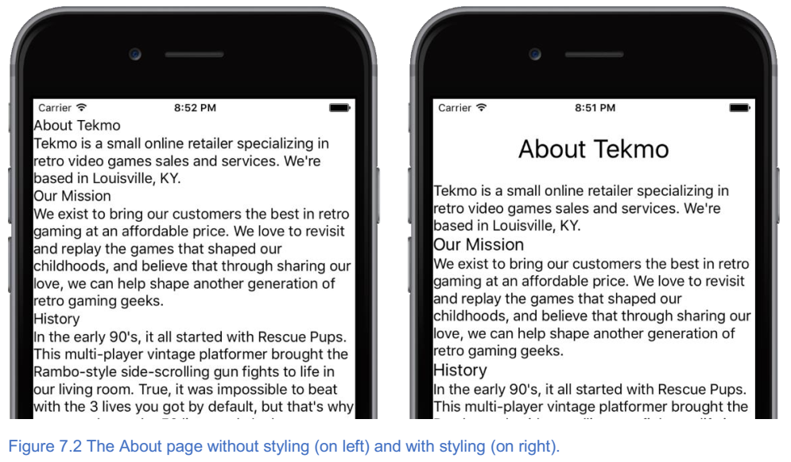
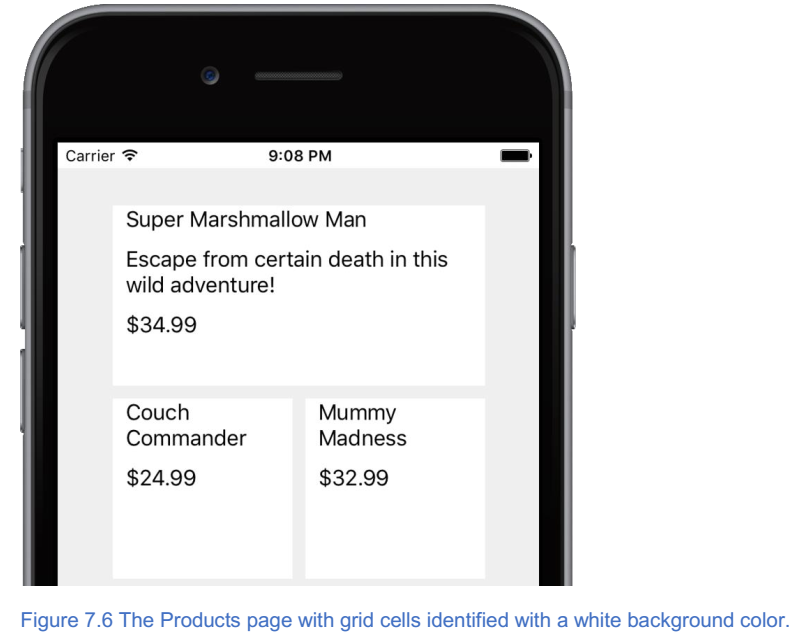
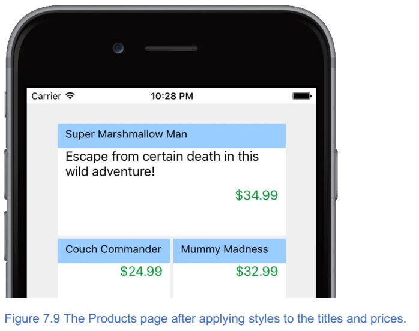
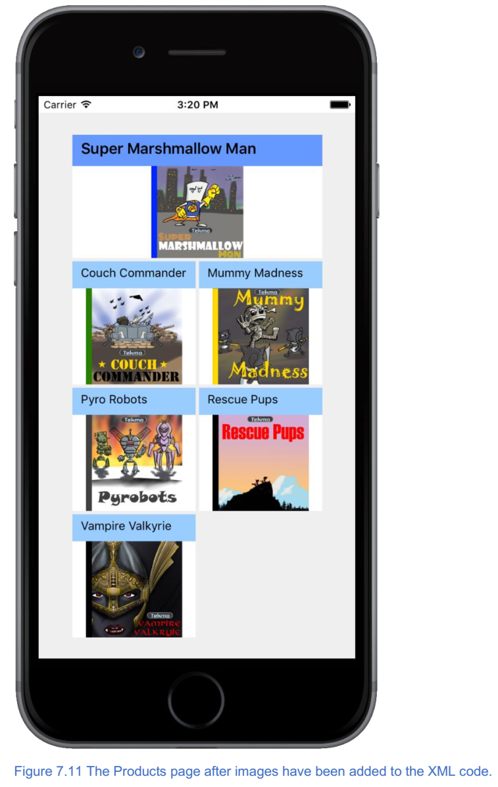
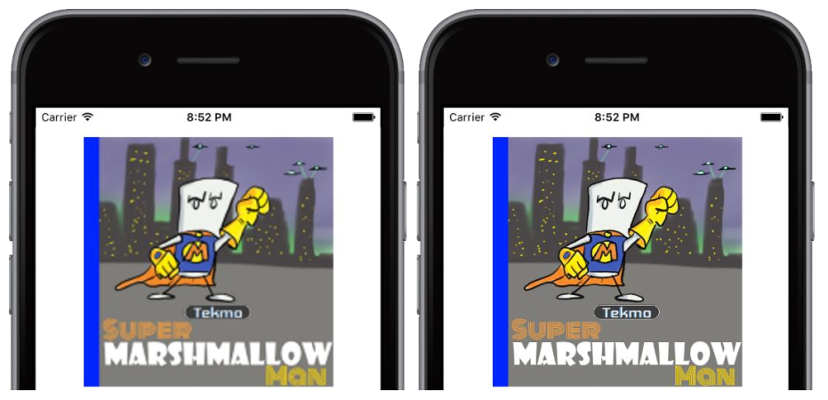
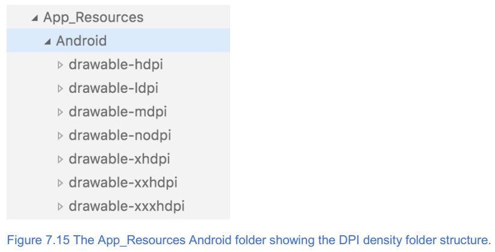
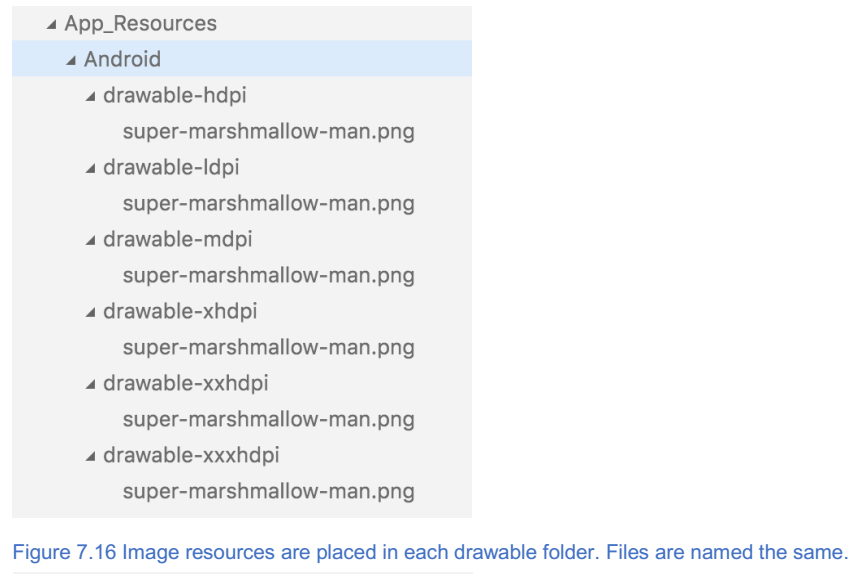
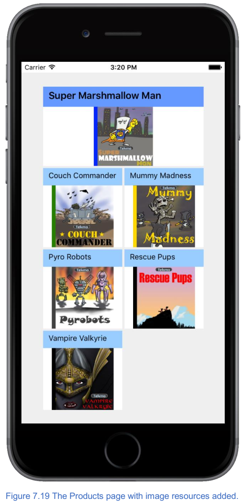
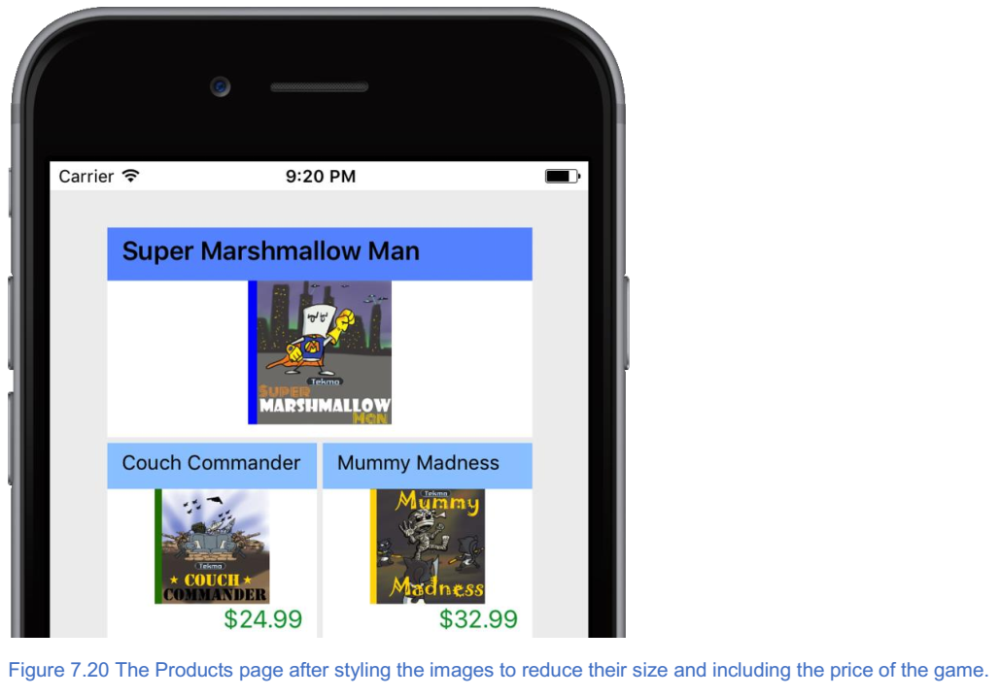

****************
样式NativeScript应用
****************

本章涵盖

- 使用 ``CSS`` 来设置 ``NativeScript`` 应用程序的样式；
- 在各种尺寸的移动设备上显示可视化大小相同的图像；
- 显示图像时考虑变化的 ``DPI`` 密度；

开发移动应用程序不仅仅是技术技巧。移动应用程序开发还涉及创建漂亮的应用程序，并提供出色的用户体验和惊人的视觉效果。换句话说，应用程序让移动开发人员突出了他们的创意能力。到目前为止，我一直专注于创建内容和组织 UI 的技术方面；说实话： ``Tekmo`` 应用看起来平淡无奇。我无视使用户界面看起来很吸引人，而是专注于功能。是时候改变了。

为了使应用感觉功能强大，用户界面需要具有视觉吸引力。想一想： ``Google Play`` 和 ``iTunes`` 商店中有多少个应用程序？数百万个下载量达数十亿的应用程序。你如何区分你的应用程序和数百万其他应用程序？什么使你的应用特别？精心设计和周到的功能是一个步骤，一个引人注目的用户界面是另一个。

在本章中，你将学会如何改变你的应用的工具！但是，我不是在骗你：创建漂亮的应用程序并不简单。它需要规划和一些艺术能力。说实话，我没有这些艺术能力；但是，当我在应用程序中看到令人惊叹的事物时，我知道它。通常很难描述为什么我觉得它很震撼，但当我看到它时我就知道它。

如果你像我一样，现在是时候结伙了。找一个具有艺术风格的朋友或同事，并勾画出一些基本概念。良好的视觉效果和坚实的用户界面不会偶然发生的，因此在一切准备好之前可能需要几杯咖啡。要有耐心。

回到第3章，我说过敏捷。这个技巧在这里仍然适用。当您开始创建应用程序时，从草图开始。但在开始编码之前，不要花费几个月时间来细化这些草图。毕竟，如果你不开始编写代码，应用程序将永远不会掌握在某人的手中。简单地计划一个大概的想法，然后编码。在实现功能应用程序的路上，您的应用程序的设计将发现您没有预料到的。让我们开始吧！

使用级联样式表
==============
我一直在和 ``HTML`` 比较 ``NativeScript`` 应用程序开发，因为它们是相似的。 ``NativeScript`` 应用程序样式是进行此比较的另一个机会，因为您必须使用级联样式表（ ``CSS`` ）来设置样式。

样式基础
--------
如果您回顾前几章， ``NativeScript`` 页面包含三个组件：一个 ``XML`` 文件，一个 ``JavaScript`` 文件和一个 ``CSS`` 文件（图7.1）。

.. image:: ./images/7-1.png

我们想回到我原来的声明中，您使用 ``CSS`` 来设计您的 NativeScript 应用程序： **有一些例外** 。

.. note:: ``NativeScript`` 应用程序可以使用 ``CSS`` 的一个子集进行样式化。换句话说，并非 ``CSS`` 的所有方面都可以用于（或应用于） ``NativeScript`` 应用程序。

    CSS 规范

    ``CSS`` 是一个令人难以置信的广泛术语，指的是关于如何定义样式（例如，字体，颜色，间距等）的各种规范的集合，并且适用于 ``HTML`` 。尽管 ``NativeScript`` 应用程序就像 ``HTML`` 应用程序，但它们不是同一种技术。

    一个被称为 ``CSS`` 工作组的小组定期开会讨论和定义一组官方的规范，这些规范构成了大多数人通常称之为 ``CSS`` 的规范。规格非常详细，分为各种子领域，包括媒体查询，颜色模块，框对齐，滚动对齐，选择器，样式属性，文本模块等。这些规范正在不断发展。 您可以通过访问 https://www.w3.org/Style/CSS/current-work 找到 ``CSS`` 的当前状态和这些规范。

当 ``NativeScript`` 加载页面时，这三个文件会自动加载。所以，通过创建一个名为 ``page-name.css`` 的文件，您可以创建页面特定的 ``CSS`` 样式规则。除了创建页面特定的 ``CSS`` 样式外，您还可以为整个应用程序和各个 ``UI`` 元素指定 ``CSS`` 样式。表7.1描述了指定样式的三种方式。

表7.1 用于在应用程序中指定 CSS 样式的不同方法和位置

+--------------------+----------------------------------------+-------------------------------------------------------------------------------------------------------------------------------------+
| 方法               | 位置                                   | 描述                                                                                                                                |
+====================+========================================+=====================================================================================================================================+
| global             | app.css                                | 为整个应用程序设置 ``CSS`` 样式规则。 所有页面都将继承 ``app.css`` 文件中的样式规则。                                               |
+--------------------+----------------------------------------+-------------------------------------------------------------------------------------------------------------------------------------+
| 特定于页面的       | <page-name>.css                        | 为特定页面设置 ``CSS`` 样式规则。要使用此方法，请创建一个与该页面具有相同名称的 ``CSS`` 文件，并将 ``CSS`` 样式规则添加到该文件中。 |
+--------------------+----------------------------------------+-------------------------------------------------------------------------------------------------------------------------------------+
| （内联）UI元素特定 | ``UI`` 元素上的 ``style = "..."`` 属性 | 为单个 ``UI`` 元素设置 ``CSS`` 样式规则。为任何 ``UI`` 元素的声明添加 ``style =“...”`` 属性，并在属性值中包含样式规则。             |
+--------------------+----------------------------------------+-------------------------------------------------------------------------------------------------------------------------------------+

当样式化一个app的时候，你可以组合使用这些方法，所以保持组织结构很重要。

.. tip:: 如果你和其它人开发一个app，确定使用三个样式方法中的哪一个时很重要的。在你的团队项目的早期讨论它并通过文档来确定。

当您开始向应用程序添加 ``CSS`` 样式规则时，可能会混淆使用三种 ``CSS`` 样式化方法中的某一种：它应该是全局的，特定于页面的还是在 ``UI`` 元素上定义的？如果您不确定，请考虑以下建议：

1. 避免内联 ``UI`` 元素特定的样式规则。尽管可以使用这种方法，但它并不是一个普遍接受的良好做法。 ``CSS`` 样式意味着独立于 ``UI`` 。
2. 首先将所有样式规则放置在页面特定的 ``CSS`` 文件中。
3. 如果您发现要在多个页面上重复样式规则（或者如果您怀疑该样式将在多个页面上使用），请考虑从特定于页面的 ``CSS`` 文件中删除样式规则并创建一个 ``app.css`` 文件中的全局样式规则。

支持的样式选择器和属性
^^^^^^^^^^^^^^^^^^^^^^
``NativeScript`` 支持 ``CSS`` 选择器语法的子集。您可以使用 5 种不同的 ``CSS`` 选择器：类型选择器，类选择器，ID选择器，层次选择器和属性选择器。你应该熟悉这些选择器，所以我不会更详细地解释它们。如果您想快速回顾一下，官方的 ``NativeScript`` 文档 http://docs.nativescript.org/ui/styling 上可以很好地介绍选择器。

.. note:: 您可能会想为什么 ``NativeScript`` 不支持每个 ``CSS`` 选择器。 并非所有 ``CSS`` 属性都适用于移动应用程序。例如，当鼠标悬停在它上面时，使用 ``:hover`` 选择器来选择一个元素。 这不适用于移动设备。

与 ``NativeScript`` 支持的 ``CSS`` 选择器的子集一样，您只能在 ``NativeScript`` 应用程序中使用 ``CSS`` 属性的子集。支持的属性包括许多与颜色，字体，背景图像，文本，对齐，间距（边距和填充）以及大小（宽度和高度）有关的常用属性。受支持的属性的完整列表在 http://docs.nativescript.org/ui/styling 上在线提供。

.. note:: 就像选择器一样，并非所有属性都适用于移动设备。例如，``nav- {up | down | left | right}`` 属性适用于键盘导航，因此 ``NativeScript`` 不支持这些属性。

使用全局 CSS 样式
-----------------
让我们开始在 ``Tekmo`` 应用程序中添加一些 ``CSS`` 样式规则。我们将首先对应用程序进行几次全局样式更改。

.. note:: 请记住，全局 ``CSS`` 更改将应用于整个应用程序，因此这些规则应针对我们预期适用于多个页面的样式。

大多数应用页面都有标题文本，应与页面上的其他文本分开。通过向 ``app.css`` 文件添加 ``CSS`` 类选择器来为标题文本创建样式规则。 清单7.1展示了如何将选择器添加到 ``app.css`` 文件，指定字体大小为 30 ，中心对齐，并在所有边上指定 20 。 还指定了字幕选择器，使字幕的字体大小为 20 。

列表7.1 添加一个类选择器和属性以在所有应用程序页面上设置文本样式

.. code-block:: css

    .title {
        font-size: 30;
        horizontal-align: center;
        margin: 20;
    }
    .sub-title {
        font-size: 20;
    }

添加全局 ``.title`` 类选择器后，您需要将 ``class = "title"`` 属性添加到 ``Home`` ， ``About`` 和 ``Products`` 页面上的标题标签元素。例如，添加 ``class`` 属性后，主页的标题标签将是 ``<Label textWrap = "true" text = "Welcome to Tekmo！" class = "title" />`` 。 ``About`` 页面也有几个标签作为子标题。更改 ``About`` 页面上的两个子标题标签以包含子标题类名称。

``<Label text = "Our Mission" class = "sub-title" />``

``<Label text = "History" class = "sub-title" />``

让我们看看这是如何改变你的应用的。图7.2 显示了关于页面的前后快照图。



要对标题进行更改，请为所有标签提供默认样式，以便它们在元素周围留出更多空间（列表7.2）。这是一种全局风格，所以它应该被添加到 ``app.css`` 文件中。

列表7.2 一个用于在所有标签和居中按钮周围应用空白的类型选择器

.. code-block:: css

    Label {
        margin-left: 10;
        margin-right: 10;
        margin-bottom: 10;
    }

最后，让我们减少主页上按钮的大小，在整个应用程序中创建一个通用大小的按钮（ 42 ）。你会记得从第3章我们使用默认的 ``NativeScript`` 应用程序模板来创建 ``Tekmo`` 应用程序。因为我们使用了这个模板， ``app.css`` 文件中已经有一个按钮类型选择器，如清单7.3所示。

.. warning:: 我们依赖于已经有按钮类型选择器的默认应用程序模板，但默认模板可能随时间而改变。别担心 - 如果默认模板已更改并且您的 app.css 文件没有包含按钮选择器，则可以添加它。

列表7.3 app.css文件中的默认按钮类型选择器

.. code-block:: css

    button {
        font-size: 42;
        horizontal-align: center;
    }

此默认代码样式按钮的大小对于我们的目的来说太大了。让我们通过删除 ``font-size:42`` 更新按钮样式属性。

有了这些最新补充，如图7.3所示， ``Home`` 和 ``About`` 页面看起来更具有代表性。

.. image:: ./images/7-3.png

现在您已经学习了使用 ``CSS`` 设计样式化应用程序的一些基本知识，接下来让我们继续在产品页面上设计网格布局的样式。

使用页面特定的 CSS 设计网格布局的样式
-------------------------------------
在开始设计产品页面网格布局的样式之前，让我们看一下页面的当前状态。图7.4显示了产品页面，截至第6章末尾。

.. image:: ./images/7-4.png

正如您所看到的，产品页面非常简单。我们来做一些改变：

- 为所有应用程序页面提供默认背景颜色，而不是白色。
- 删除交替的网格单元颜色。
- 使网格单元格变为白色并在它们之间添加间距，以便应用程序用户可以直观地确定一个图块的结束位置和另一个图块的开始位置
- 在每个网格单元的顶部添加一个固定的颜色带（又名标题横幅）以环绕游戏标题。
- 将游戏样式化与固定的颜色带区分开来。
- 右对齐价格并添加一些颜色。
- 突出显示超级棉花糖人格网格，使其与其他单元格比较突出。

这一次有很多改变，所以我们会一起走过它们。但是如果你喜欢挑战，可以自己尝试一下。在我们通过这些变化进行工作时，我不会给出每个步骤，但是您会看到主要里程碑的步骤。

设置应用程序范围的背景颜色
^^^^^^^^^^^^^^^^^^^^^^^^^^
我们首先将 ``app.css`` 文件中的所有应用程序页面设置默认背景。 代码清单7.4 显示了这些增加。

代码清单7.4 添加了 app.css 文件，将应用程序的背景色改为浅灰色

.. code-block:: css

    Page {
        background-color: #EFEFEF;
    }

从网格中内联样式
^^^^^^^^^^^^^^^^
接下来，让我们从 ``Products`` 页面上的网格单元中删除内联样式属性( ``style = "background-text:..."`` )。 一旦你删除了这些属性，你的网格布局就应该和列表7.5中的代码一致。

清单7.5 删除内联样式属性后生成的文件

.. code-block:: xml

    <GridLayout rows="*,*,*,*" columns="*,*" width="300" height="600">
        <StackLayout row="0" col="0" colSpan="2">
            <Label text="Super Marshmallow Man" textWrap="true" />
            <Label textWrap="true" text="Escape from certain death in this wild adventure!" />
            <Label text="$34.99" />
        </StackLayout>
        <StackLayout row="1" col="0">
            <Label text="Couch Commander" textWrap="true" />
            <Label text="$24.99" />
        </StackLayout>
        <StackLayout row="1" col="1">
            <Label text="Mummy Madness" textWrap="true" />
            <Label text="$32.99" />
        </StackLayout>
        <StackLayout row="2" col="0">
            <Label text="Pyro Robots" textWrap="true" />
            <Label text="$19.99" />
        </StackLayout>
        <StackLayout row="2" col="1">
            <Label text="Rescue Pups" textWrap="true" />
            <Label text="$9.99" />
        </StackLayout>
        <StackLayout row="3" col="0">
            <Label text="Vampire Valkyrie" textWrap="true" />
            <Label text="$21.99" />
        </StackLayout>
    </GridLayout>

在做出这些更改后，产品页面看起来会更加“晦涩”，如图7.5所示。 没关系，但是，我们准备开始给它一些样式。

.. image:: ./images/7-5.png

添加空白和背景颜色
^^^^^^^^^^^^^^^^^^
我们的下一个任务是将网格单元格的背景颜色设置为白色，并在每个单元格之间添加一个边距。这些更改不一定适用于整个应用程序，因此它们应该进入特定于页面的 ``CSS`` 文件。创建一个名为 ``product.css`` 的新文件，并将其放在与 ``products.xml`` 文件相同的目录中。在创建页面特定的 CSS 文件后，创建一个将用于表示每个网格单元的 ``tile`` 类选择器。将 ``background-color`` 和 ``margin`` 属性添加到 ``tile`` 类选择器，如清单7.6所示

代码清单7.6 增加了 products.css 文件以使网格单元格脱颖而出

.. code-block:: css

    .tile {
        background-color: #FFFFFF;
        margin: 2;
    }

让我们使用刚刚创建的 ``tile`` 类将这些样式应用到每个网格单元格。将 ``class = "tile"`` 添加到 ``Products`` 页面上的每个 ``StackLayout`` 元素。这种改变对 ``Tekmo`` 应用程序产生了巨大的影响，如图7.6所示。



添加一个标题栏
^^^^^^^^^^^^^^
标题横幅是在每个网格单元的顶部包含游戏标题的实心带或颜色条。起初，这个改变看起来很简单：设置标题标签的背景颜色，但是图7.7显示了当我们采用这种方法时会发生什么。这不是我们想要的结果。

.. image:: ./images/7-7.png

当您设置标签的背景颜色时， ``NativeScript`` 从字面上就是这样做的：它设置标签的背景。不幸的是，标签的背景只属于内部文本。设置背景颜色所产生的效果在技术上是正确的，但它看起来不具有视觉吸引力。我们真正想要的是一种颜色横幅，它延伸了每个网格单元格的整个宽度。幸运的是，有一个简单的方法来做到这一点。

.. tip:: 要向页面添加实心的横幅或颜色块，请添加堆叠布局并设置堆叠布局的背景颜色。

使用这个技巧，在标题标签周围堆叠堆栈布局，并通过类选择器应用背景颜色。清单7.7 显示了对 ``products.css`` 文件所做的更改以及如何通过将标题标签封装在具有 ``tile-title`` CSS 类的堆栈布局中来更改 ``Products`` 页面中的一个网格单元格。

代码清单7.7 添加了产品页面文件来设置 tile 横幅的背景颜色

.. code-block:: xml

    .tile-title { // 添加到products.css文件
        background-color: #99ccff;
    }
    <StackLayout row="0" col="0" colSpan="2" class="tile"> // 更新products.xml文件以将tile-title类添加到包装标题标签的堆栈布局
        <StackLayout class="tile-title">
            <Label text="Super Marshmallow Man" textWrap="true" />
        </StackLayout>
        <Label textWrap="true" text="Escape from certain death in #B
    this wild adventure!" />
        <Label text="$34.99" />
    </StackLayout>

将相同的堆叠布局包装策略应用于 ``Products`` 页面上的其余网格单元后，您将获得所需的效果，如图7.8所示。

.. image:: ./images/7-8.png

样式网格单元文本
^^^^^^^^^^^^^^^^
我们要做的下一个改变是通过向 ``products.css`` 文件添加样式规则来调整标题横幅标签和价格标签的颜色和位置。为每个价格标签添加一个 ``price`` 类属性，然后添加列表7.8中列出的 ``CSS`` 样式。图7.8显示了最终的 ``UI`` 更改。

代码清单7.8 增加了 ``products.css`` 文件来设置 ``tile`` 横幅的背景颜色

.. code-block:: css

    .tile-title Label {
        font-size: 14;
        color: black;
        margin-top: 5;
    }
    .price {
        color: #009933; // 绿色
        text-align: right;
    }



突出特色产品
^^^^^^^^^^^^
现在我们已经为每个网格单元格添加了样式，让我们将注意力转向特色产品：超级棉花糖人。将网格单元从其他单元中脱颖而出会很好。使网格单元格脱颖而出的一种方法是对其添加类，然后使用该附加类来覆盖已应用的样式。

.. note:: 覆盖 ``CSS`` 样式是定义一般样式规则的过程（如所有具有 ``small`` 类的标签都是字体大小 14），并在某些情况下选择性地更改一般样式规则的值。例如，如果一个带有 ``small`` 类的标签也有一个 heading 类，那么字体大小应该是 16 ，而不是默认的 14 。

让我们在特色产品网格单元格中添加一个名为 ``highlight`` 的额外类，然后在 ``tiles`` 也应用 ``highlight`` 类时为每个 ``tile`` 相关类添加规则，然后覆盖 ``products.css`` 文件中的一些样式属性。代码清单7.9概述了 ``CSS`` 的增加，列表7.10显示了向 ``UI`` 中添加突出显示类。

.. note:: 覆盖 ``CSS`` 样式的一种方法是将附加类应用于父元素。 ``highlight`` 在清单7.9中。

列表7.9 添加到 ``products.css`` 文件以突出显示特色产品

.. code-block:: css

    .highlight .tile-title { // 将标题横幅更改为粗体文本和稍暗的背景颜色
        font-weight: bold;
        background-color: #6699ff;
    }

    .highlight .tile-title Label { // 稍微增加标题字体大小
        font-size: 18;
    }

    .highlight .price { // 通过加粗和红色使价格突出
        font-weight: bold;
        color: red;
    }

清单7.10 添加到 products.xml 文件以突出显示特色产品

.. code-block:: xml

    <StackLayout row="0" col="0" colSpan="2" class="tile highlight">
        <StackLayout class="tile-title">
            <Label text="Super Marshmallow Man" textWrap="true" />
        </StackLayout>
        <Label textWrap="true" text="Escape from certain death in this wild adventure!" />
        <Label text="$34.99" class="price" />
    </StackLayout>

在图7.10中，您会注意到这些样式更改的结果：标题横幅稍暗，标题文字较大且粗体，价格文本粗体且颜色不同。

.. image:: ./images/7-10.png

做得好！ 用于对 ``Tekmo`` 应用程序进行样式设计的 ``CSS`` 样式绝不是 ``NativeScript`` 中仅有的功能，但它们应作为开始点，让您感觉有权试用您自己的一些想法。

将图像添加到应用程序
====================
除了样式化文字，添加背景颜色以及创造性地安排具有边框和边距的 ``UI`` 元素之外，图像是您的工具带中另一个强大的工具，用于将“垃圾”应用转化为美丽的东西。在本节中，您将学习如何通过进一步改进 ``Tekmo`` 应用程序的产品页面来将图像添加到应用程序。

使用Image元素
-------------
通过向每个网格单元格添加一个 ``<Image />`` 元素，让我们通过它将图像添加到 ``Products`` 页面上的每个网格单元格。

.. note:: 图像是将在应用程序的用户界面中显示的 ``JPEG`` 或 ``PNG`` 图形。要添加图像，请使用 ``<Image />`` 元素。

清单7.11 包含要添加到 ``Products`` 页面的图像。添加图像时，将它们放置在具有 tile 类的堆栈布局中，直接放置在具有 tile-title 类的堆栈布局下方。

.. note:: 您可以通过从 https://github.com/mikebranstein/TheNativeScriptBook/blob/master/Chapter7/Tekmo/app/images/high-res-game-images.zip 下载包含图像的zip文件来查找本节中使用的图像。

列表7.11 将图像添加到 products.xml 文件中的每个网格单元格

.. code-block:: xml

    <Page xmlns="http://schemas.nativescript.org/tns.xsd">
        <GridLayout rows="*,*,*,*" columns="*,*" width="300" height="600">
            <StackLayout row="0" col="0" colSpan="2" class="tile highlight">
                <StackLayout class="tile-title"> // 将图像直接放置在使用tile-title的类属性的堆栈布局下
                    <Label text="Super Marshmallow Man" textWrap="true" />
                </StackLayout>
                <Image src="~/images/super-marshmallow-man.png" /> // 来自上方的游戏图像放置在堆叠布局下方
                <Label text="$34.99" class="price" />
            </StackLayout>
            <StackLayout row="1" col="0" class="tile">
                <StackLayout class="tile-title">
                    <Label text="Couch Commander" textWrap="true" />
                </StackLayout>
                <Image src="~/images/couch-commander.png" />
                <Label text="$24.99" class="price" />
            </StackLayout>
            <StackLayout row="1" col="1" class="tile">
                <StackLayout class="tile-title">
                    <Label text="Mummy Madness" textWrap="true" />
                </StackLayout>
                <Image src="~/images/mummy-madness.png" />
                <Label text="$32.99" class="price" />
            </StackLayout>
            <StackLayout row="2" col="0" class="tile">
                <StackLayout class="tile-title">
                    <Label text="Pyro Robots" textWrap="true" />
                </StackLayout>
                <Image src="~/images/pyro-robots.png" />
                <Label text="$19.99" class="price" />
            </StackLayout>
            <StackLayout row="2" col="1" class="tile">
                <StackLayout class="tile-title">
                    <Label text="Rescue Pups" textWrap="true" />
                </StackLayout>
                <Image src="~/images/rescue-pups.png" />
                <Label text="$9.99" class="price" />
            </StackLayout>
            <StackLayout row="3" col="0" class="tile">
                <StackLayout class="tile-title">
                    <Label text="Vampire Valkyrie" textWrap="true" />
                </StackLayout>
                <Image src="~/images/vampire-valkyrie.png" />
                <Label text="$21.99" class="price" />
            </StackLayout>
        </GridLayout>
    </Page>

将图像添加到 ``Products`` 页面后，它开始聚集在一起，如图7.11所示。



我想把你的注意力放在图像元素的标记上。 ``NativeScript`` 图像像 ``HTML`` 图像，特别是它们如何引用图像文件以使用 ``src`` 属性加载。您可以通过在同一文件夹中使用文件的文件名（例如， ``image-name.png`` ），在不同文件夹中的图像的相对文件路径和文件名（ ``..\..\image-name.png`` ）或 ``URL`` 。其语法与 ``HTML`` 中的图像加载方式类似，并在表7.2中作为参考点加以总结。

表7.2 加载图像资源的不同方法

+--------------+------------------------------------------------+---------------------------------------------------------------------------+
| 方法         | 语法                                           | 描述                                                                      |
+==============+================================================+===========================================================================+
| 相对文件路径 | src = "{image-file-path}"                      | 从应用程序中的某个位置加载相对于页面所在文件夹的图像                      |
+--------------+------------------------------------------------+---------------------------------------------------------------------------+
| URL          | src="http://image-url" src="https://image-url" | 使用 ``HTTP`` 或 ``HTTPS`` 从 ``URL`` 加载图像                            |
+--------------+------------------------------------------------+---------------------------------------------------------------------------+
| resource     | src="res://image-name"                         | 与相对文件路径类似，但从 App_Resources 文件夹加载图像。不需要文件扩展名。 |
+--------------+------------------------------------------------+---------------------------------------------------------------------------+

与 HTML 图像语法不同的是，您将注意到用于加载图像的 **资源方法** 。

.. note:: 通过资源加载图像是一种基于设备分辨率加载图像的不同版本的方法。

了解这种方法非常重要，因为它是一种非常强大的 NativeScript 功能（并且在开发跨平台应用程序时使您的生活更轻松）。

但是，在了解资源加载的具体情况之前，您需要在移动设备上提供更多背景信息。在第3章中，您了解了不同的屏幕分辨率和 ``DPI`` 。 您需要在下一节中学习过去的知识，所以让我们先回顾一下 ``DPI`` 的含义。

.. note:: 每英寸点数（DPI）是网点密度的度量，并且通常用于印刷行业来描述出现在印刷书籍或杂志的平方英寸中的印刷点的数量。 当提到屏幕时，“点”的概念经常与“像素”混淆。屏幕具有像素，而不是点；因此，它们的密度是以每英寸像素（PPI）的像素来衡量的。 尽管新闻部和生产者价格指数在技术上有所不同，但大多数人并没有区分这两者。事实上， ``Android`` 平台更喜欢 ``DPI`` 与 ``PPI`` 的术语。通过这本书，我将使用术语 ``DPI`` 。

在移动设备上显示图像的挑战
---------------------------
了解（高层次）在各种移动设备上持续显示图像所面临的挑战非常重要。

.. warning:: 本节最初可能会吓到你，这是因为跨平台设备 ``DPI`` 以及 ``Android`` 和 ``iOS`` 的各种要求可能令人困惑。但别担心： ``NativeScript`` 在抽象化跨平台图像的复杂性方面做得很好。

显示图像的核心问题之一是移动设备数量庞大，每种设备都具有不同的屏幕尺寸，分辨率和 ``DPI`` 。我们以 iOS 设备生态系统为例。 iOS 设备是高度控制的硬件生态系统的一部分，从而减少了模型间的差异。现在，考虑到2016年年中的不同 iPhone 型号：2G，3G，3Gs，4,4s，5s，5c，6，6 plus，6s，6s plus，7和SE。本书时有 13 种不同的型号，其中有四种或七种不同的屏幕分辨率（取决于您的计算方式），并以三种不同的 DPI 密度显示。

.. note:: 如果您有兴趣了解更多关于各种 ``iPhone`` 屏幕分辨率和 ``DPI`` 的信息，请查看 https://www.paintcodeapp.com/news/ultimate-guide-to-iphone-resolutions 。本指南提供了一个很好的图像解释 ``iOS`` 如何映射和转换图像到不同的屏幕尺寸和 ``DPI`` 设置。

这仅仅是最标准化的硬件设备生态系统。 ``Android`` 具有类似的差异，但它跨越了更大的硬件空间，具有五种不同的 ``DPI`` 密度。我不想让你听到所有的悲观和忧郁，所以让我回踩。在 ``Android`` 和 ``iOS`` 平台上都有明确的图像显示标准和准则，所以我的观点不是要吓跑你，只是说明一些复杂性和挑战。

变化的屏幕DPI的影响
^^^^^^^^^^^^^^^^^^^
所以这对于你来说意味着什么？ 不幸的是，很多。作为移动开发人员，了解平台之间的差异至关重要，因为这是跨平台移动开发的重要方面。

开发用于多种 DPI 密度的图像的核心挑战是满足用户的期望。较旧的移动设备往往具有较低的 DPI 显示。您可以设计和制作漂亮的高分辨率图像，但屏幕无法显示图像，因此看起来很清晰。以超级棉花糖人图像为例（图7.12），显示在低 DPI 屏幕（163 DPI）和高 DPI 屏幕（401 DPI）上。



图像之间的差异很微妙，但如果仔细观察文字，很容易看出。图7.13显示放大的图像以获得清楚的视图。

.. image:: ./images/7-13.png

从这仔细观察，您可以看到左侧的低 ``DPI`` 显示比右侧的图像要模糊得多。有一款较旧的 ``DPI`` 手机，我预计手机上的所有内容都会显得模糊不清，但如果我拥有高 ``DPI`` 手机，我希望我的图像始终保持清晰明了。

因此，在各种 ``DPI`` 上开发图像的核心问题之一是确保您的图像在每个设备上看起来尽可能好。

DPI密度差异的解决方案
---------------------
让我们回顾一下这个问题。 在 ``Android`` 和 ``iOS`` 之间，总共有九种不同的屏幕 ``DPI`` ，并且当我们在这些设备中显示图像时，我们希望图像清晰明了（或者清晰明了，因为它们可以基于设备 ``DPI`` ）。

有很多方法可以解决这个问题，但我将重点关注两个：简单的方法和暴力方式。我们首先解决这个简单的方法，然后讨论为什么你不想使用这个解决方案。然后，我们将讨论我称之为蛮力的解决方案，因为它需要很多工作，但会为用户提供更好的体验。

简单的解决方案
^^^^^^^^^^^^^^
简单的解决方案是始终在您的应用中使用高分辨率图像。这可以保证使用较低 ``DPI`` 电话的用户可以获得每种设备的最佳体验。当您使用此方法时，您还需要指定图像的显示大小。让我们继续使用超级棉花糖人形象作为例子，拉伸它以填满屏幕。程序清单7.12包含用于显示图像的代码。

代码清单7.12 显示一个图像以跨越任何设备填满整个屏幕

.. code-block:: xml

    <Page>
        <GridLayout rows=”*” columns=”*”> // 将1行1列设置为*的网格布局将展开以填充整个屏幕
            <Image src=”~/images/super-marshmallow-man.png” />
        </GridLayout>
    </Page>

通过创建一行和一列设置为默认（ ``*`` ）大小选项的网格布局将扩展网格的内容以填充整个页面。网格内的图像将展开为屏幕的整个大小。图7.14显示了在 iPhone 3GS（163 DPI）和 6 Plus（401 DPI）上显示的图像。请注意，我已经放大了 3GS ，因此其物理尺寸看起来与 6 Plus 相同（假设您将它贴近脸部）。 iPhone 3G 的屏幕分辨率远远小于 iPhone 6 Plus ，因此图像会显得模糊（但它仍然是两款设备上最好的结果）。

.. image:: ./images/7-14.png

这种方法很简单，它可以提供最佳的用户体验（视觉效果），但是您需要在低分辨率显示器上加载高分辨率图像。这是低效率的，并可能导致性能问题。您真的想要加载足够高分辨率的图像，以便在每个设备上正确显示。

.. warning:: 请勿在低 ``DPI`` 设备上加载高分辨率图像。具有低分辨率显示器的设备通常具有较少的处理能力和内存，因此，尽可能优化您的应用将导致整体更好的行为。现在，这是一种泛化，可能不适用于所有情况，但比抱歉更安全。

解决多DPI设备问题
^^^^^^^^^^^^^^^^^
由于简单的解决方案可能导致糟糕的用户体验，让我们讨论一个更好的方法。对这个问题的答案很简单，但却是蛮力。

.. note:: 如果您有 9 个不同的 ``DPI`` ，请为每个图像创建 9 个不同的版本（每个 ``DPI`` 有一个不同的版本）。

看，我说这是蛮力。由于这个解决方案如此劳动密集，我们将解释如何在高层次上做到这一点，然后给你一个方法来作弊和跳过手动步骤：

- 确定您将支持的最高 ``DPI`` （例如， iPhone 6 Plus 的 401 DPI ）。
- 决定显示图像的最大视觉尺寸（例如1英寸）。
- 计算图像的最小尺寸（例如，对于方形图像，1英寸x 401 DPI = 401 x 401像素）。
- 使用最小尺寸创建清晰的图像，将其保存为原始基础图像。
- 根据不同的设备 DPI 计算所需的不同缩小的图像尺寸（例如，对于 iOS，您还需要 326 DPI 和 163 DPI ，导致另外2个图像为 326 x 326 像素和 163 x 163 像素）。
- 使用基本图像，将基本图像缩小到上一步计算出的其他大小，确保每次缩小到另一个 DPI 时从保存的基础图像开始。

多么痛苦！ 您必须最多执行 9 次才能支持 ``Android`` 和 ``iOS`` 的所有各种 ``DPI`` 。但是，不用恐惧，我们已经帮助了你。我们建立了一个网站，专门为 Android 和 iOS 调整图片大小： http://nsimage.brosteins.com 。要使用该网站，请上传一张高分辨率图片。上传后，图像被调整为 Android 和 iOS 所需的各种图像分辨率。然后下载包含所有变体的 zip 文件。

.. tip:: 不要手动缩小图像，请使用在线服务，如 Brostein 的图像创建器 http://nsimage.brosteins.com 。

如果您坚持使用此解决方案，可以保证在您的应用中显示清晰明了的图像。

在NativeScript应用程序中显示多分辨率图像
----------------------------------------
现在，您已经学会了使图像变得清晰明了的过程，您已经获得了九个不同的图像！如何在各种设备上显示这些图像，并知道在哪种情况下使用哪个图像？ 不要担心： NativeScript 使用图像资源让这变得简单。

.. note:: 图像资源可以轻松为每个平台加载正确的图像。像 NativeScript 的其他方面一样，图像资源依赖于惯例。如果您使用特定的文件命名约定将图像集合命名并将它们放在应用程序的 App_Resources 文件夹中， NativeScript 将自动加载正确的图像。

在几分钟之后我将解释如何以及在何处放置图像资源，现在我们先介绍一下简单的部分：引用图像元素中的图像资源。要添加对图像资源的引用，请将图像元素的 ``src ="{image-file-name}"`` 属性更改为 ``src = "res:// {imagefile-name-without-extension}"`` 。代码清单7.13显示了您必须对 Products 页面进行的更改以切换每个图像。

代码清单7.13 使用图像资源加载图像

.. code-block:: xml

    <Image src="res://super-marshmallow-man" /> // 用图像资源版本替换现有的图像元素
    <Image src="res://couch-commander" />
    <Image src="res://mummy-madness" />
    <Image src="res://pyro-robots" />
    <Image src="res://rescus-pups" />
    <Image src="res://vampire-valkyries" />

当你添加一个引用图像资源的图像元素时，你不需要指定文件扩展名，只需要以 ``res://`` 开头的文件名，如清单7.12所示。

现在您已经学会了如何引用图像资源，接下来我们来解决更加麻烦的部分：为 ``Android`` 和 ``iOS`` 创建多个图像版本。在第3章中，您了解到 ``App_Resources`` 文件夹包含特定于平台的文件。 ``Android`` 自定义位于 ```Android``` 文件夹内， ``iOS`` 自定义位于 ``iOS`` 文件夹内。不幸的是，每个平台都以不同的方式组织他们的平台特定文件，所以我们会从 ``Android`` 开始分别查看每个平台。

ANDROID图像资源
^^^^^^^^^^^^^^^
让我们花点时间研究一下 ``App_Resources`` 文件夹中特定于 ``Android`` 的内容（图7.15）。



在 ``Android`` 文件夹内，请注意名为 ``drawable-{size}`` dpi的六个文件夹。这些文件夹对应于 Android 平台上的六种不同设备 DPI 密度。

.. note:: 由于 ``Android`` 设备的庞大生态系统，这六个 ``DPI`` 密度并不准确。相反，使用近似的 ``DPI`` ，因为它们可以在类似设备之间变化。

表7.3 总结了六个类别中每一类的近似 DPI 。

表7.3 近似的 Android 设备 DPI 密度和相应的 App_Resources 文件夹

+------------------------+---------------------+----------+
| 大小                   | App_Resources文件夹 | 近似DPI  |
+========================+=====================+==========+
| low                    | drawable-ldpi       | ~120 DPI |
+------------------------+---------------------+----------+
| medium                 | drawable-mdpi       | ~160     |
+------------------------+---------------------+----------+
| high                   | drawable-hdpi       | ~240     |
+------------------------+---------------------+----------+
| extra-high             | drawable-xhdpi      | ~320     |
+------------------------+---------------------+----------+
| extra-extra-high       | drawable-xxhdpi     | ~480     |
+------------------------+---------------------+----------+
| extra-extra-extra-high | drawable-xxxhdpi    | ~640     |
+------------------------+---------------------+----------+

要在 ``Android`` 上使用图片资源，请在每个 ``drawable-{size}dpi`` 文件夹中放置适当尺寸的图片。这些文件应该全部命名相同（见图7.15）。

让我们使用本章前面的超级棉花糖人形象，并为每个 ``Android DPI`` 密度创建一个图像。

- 从 ``super-marshmallow-man.png`` 文件的高 ``DPI`` 版本开始。您可以从以下网址下载: https://github.com/mikebranstein/TheNativeScriptBook/blob/master/Chapter7/Tekmo/app/images/high-res-game-images.zip
- 使用我们的网站 http://nsimage.brosteins.com 为 zip 文件中的每个高分辨率图像创建各种设备特定的分辨率。如果你是一位设计师，并且宁愿手动手动转换图像，那么抓住你最喜欢的图像编辑器并且在图像编辑器中找到它（你可以参考表7.3为每张图像获得正确的 DPI ）
- 将每个图像保存到 ``NativeScript`` 应用程序的 ``App_Resources/Android`` 文件夹中的相应文件夹中。确保名称完全相同（例如， ``super-marshmallow-man.png`` ）

完成从原始 ``super-marshmallow-man.png`` 文件创建六个图像后，您应该在每个文件夹中有一个名为 ``super-marshmallow-man.png`` 的文件（图7.16）。



如果您要并排打开几张图像，则会看到不同的尺寸。图7.17显示了低分辨率，高分辨率和超高分辨率版本。正如您所期望的那样，超高版本的尺寸约为低分辨率版本的四倍（ 〜480 dpi / 〜120 dpi = 〜4x ）。

.. image:: ./images/7-17.png

IOS图像资源
^^^^^^^^^^^
与 ``Android`` 文件夹相比， ``App_Resources/iOS`` 文件夹的组织方式不同。图7.18显示了 ``Tekmo`` 应用程序的 ``iOS`` 文件夹。

.. image:: ./images/7-18.png

首先，您会注意到没有与图像和设备 ``DPI`` 密度相关的文件夹层次结构。相反，所有 ``DPI`` 特定的图像都放置在 ``iOS`` 文件夹的根目录中。

其次， ``iOS`` 的图像资源命名不同，并且与 ``iOS`` 上的各种 ``DPI`` 密度相对应。与 ``Android`` 的 ``ldpi`` ， ``mdpi`` ，...， ``xxxhdpi`` 约定一样， ``iOS`` 有三种不同的设备 ``DPI`` 密度（ 163 ， 326 和 401 DPI ）。这些密度对应于特定的文件命名约定。表7.4详细列出了每个 ``DPI`` 密度和相关的文件名。

表7.4 iOS 设备 DPI 密度和相应的 App_Resources 文件名

+------+-----------------------------+---------+
| 大小 | 文件名称                    | DPI     |
+======+=============================+=========+
| 1x   | {file-name}.{extension}     | 163 DPI |
+------+-----------------------------+---------+
| 2x   | {file-name}\@2x.{extension} | 326     |
+------+-----------------------------+---------+
| 3x   | {file-name}\@3x.{extension} | 401     |
+------+-----------------------------+---------+

让我们用我们之前使用的相同的超级棉花糖人图片来创建特定于 ``iOS`` 的图像。

- 先从同一个高 ``DPI`` 版本的 ``super-marshmallow-man.png`` 文件下载： https://github.com/mikebranstein/TheNativeScriptBook/blob/master/Chapter7/Tekmo/app/images/high-res-game-images.zip
- 创建三张图像，每张图像都有相应的目标 ``DPI`` ，如表7.4所示。同样，欢迎您使用您选择的图像编辑程序，但我们更愿意使用 http://nsimage.brosteins.com 上的图像缩放器来自动执行该过程。
- 将三张图像保存到 ``NativeScript`` 应用程序的 ``App_Resources/iOS`` 文件夹中。图片应该命名为： ``super-marshmallow-man.png`` ， ``super-marshmallow-man@2x.png`` 和 ``super-marshmallow-man@3x.png`` 。

现在我们已经为 ``Android`` 和 ``iOS`` 生成了图像资源，正确命名了这些文件，将它们添加到了正确的 ``App_Resources`` 文件夹中，并将图像元素更改为使用 ``res://`` 语法，我们已准备好检查结果。图7.19显示了添加图像后的产品页面。



正如你所看到的那样，这不太正确，因为图像填充了网格单元，挤出了价格，所以我们需要添加一些样式。如果你还没有跟上，我已经在列表7.14中包含了产品页面的 XML 代码。使用此代码作为参考，以便我们可以完成产品页面的样式设计。

代码清单7.14 添加了图像资源的完整产品页面代码

.. code-block:: xml

    <GridLayout rows="*,*,*,*" columns="*,*" width="300" height="600">
        <StackLayout row="0" col="0" colSpan="2" class="tile highlight">
            <StackLayout class="tile-title">
                <Label text="Super Marshmallow Man" textWrap="true" />
            </StackLayout>
            <Image src="res://super-marshmallow-man" />
            <Label textWrap="true" text="Escape from certain death in this wild adventure!" />
            <Label text="$34.99" class="price" />
        </StackLayout>
        <StackLayout row="1" col="0" class="tile">
            <StackLayout class="tile-title">
                <Label text="Couch Commander" textWrap="true" />
            </StackLayout>
            <Image src="res://couch-commander" />
            <Label text="$24.99" class="price" />
        </StackLayout>
        <StackLayout row="1" col="1" class="tile">
            <StackLayout class="tile-title">
                <Label text="Mummy Madness" textWrap="true" />
            </StackLayout>
            <Image src="res://mummy-madness" />
            <Label text="$32.99" class="price" />
        </StackLayout>
        <StackLayout row="2" col="0" class="tile">
            <StackLayout class="tile-title">
                <Label text="Pyro Robots" textWrap="true" />
            </StackLayout>
            <Image src="res://pyro-robots" />
            <Label text="$19.99" class="price" />
        </StackLayout>
        <StackLayout row="2" col="1" class="tile">
            <StackLayout class="tile-title">
                <Label text="Rescue Pups" textWrap="true" />
            </StackLayout>
            <Image src="res://rescue-pups" />
            <Label text="$9.99" class="price" />
        </StackLayout>
        <StackLayout row="3" col="0" class="tile">
            <StackLayout class="tile-title">
                <Label text="Vampire Valkyrie" textWrap="true" />
            </StackLayout>
            <Image src="res://vampire-valkyrie" />
            <Label text="$21.99" class="price" />
        </StackLayout>
    </GridLayout>

样式化图像
----------
现在我们已经将图像添加到 ``Tekmo`` 应用程序中，我们有一些清理工作要做。我们应该做的第一件事是将图像缩小到合理的大小（ 〜80 像素）。添加 ``Image {width:80; height:80; }`` 样式到 ``products.css`` 文件。结果如图7.20所示。



改变图像大小看起来不错，但超级棉花糖人的文本和价格已经挤出了网格单元。突出显示的图像应该左对齐，说明和价格与图像右侧对齐。

有很多方法可以完成这种风格。有两种方法可以做到以下几点：

- 在堆叠面板内嵌入 1 行 2 列网格布局。
- 使用一系列嵌套堆栈布局，一个水平堆叠 ``UI`` 元素，另一个垂直堆叠 ``UI`` 。

您可能会想到组织 ``UI`` 的第三种或第四种方式，但让我们使用堆栈布局方法，因为它可以帮助您了解堆栈布局的另一个方面：方向( ``orientation`` )。

.. note:: 堆栈布局的 orientation 属性告诉 NativeScript 是垂直还是水平渲染布局的内容。默认情况下，内容是垂直渲染的，但您可以通过添加 ``orientation ="horizontal"`` 属性将其更改为水平渲染。

将多个堆栈布局添加到 Super Marshmallow Man XML 代码中，如清单7.15所示。

代码清单7.15 添加了图像资源的产品页面代码

.. code-block:: xml

    <StackLayout row="0" col="0" colSpan="2" class="tile highlight">
        <StackLayout class="tile-title">
            <Label text="Super Marshmallow Man" textWrap="true" />
        </StackLayout>
        <StackLayout orientation=”horizontal”> // 在图像和标签周围环绕水平堆叠布局
            <Image src="res://super-marshmallow-man" />
            <StackLayout> // 第二个垂直堆栈布局将包装标签
                <Label textWrap="true" text="Escape from certain death in this wild adventure!" />
                <Label text="$34.99" class="price" />
            </StackLayout>
        </StackLayout>
    </StackLayout>

现在，让我们通过将突出显示的图像的图像元素样式更改为 ``.highlight Image {width:100; height:100;}`` 。通过这些更改，我们有产品页面的最终版本（图7.21）。

.. image:: ./images/7-21.png

第7章代码的最终版本可以在这里找到 https://github.com/mikebranstein/TheNativeScriptBook/tree/master/Chapter7 。

总结
====
在本章中，您了解到：

- ``CSS`` 样式属性的子集可用于设置 ``NativeScript`` 应用程序的 ``UI`` ；
- 样式可以全局设置(在 ``app.css`` 文件中)，逐页设置(使用 ``page-name.css`` 文件)，并且内联 ``XML`` 代码( ``style="..."`` 属性）；
- 可以通过三种方式将图像添加到 ``NativeScript`` 应用程序：本地（通过相对路径和文件名），联机（通过 ``http`` 或 ``https`` ）以及资源引用（使用 ``App_Resources`` 文件夹中的 res:// 和图像资源）
- 从 ``App_Resources`` 文件夹加载图像时，需要最多9个不同的图像来支持 ``Android`` 和 ``iOS`` 上的所有设备 ``DPI`` 密度（ ``Android`` 需要6个， ``iOS`` 需要3个）
- 您可以使用您首选的图像编辑工具或 http://nsimage.brosteins.com 上的自动图像缩放器手动创建 ``App_Resources`` 图像。

