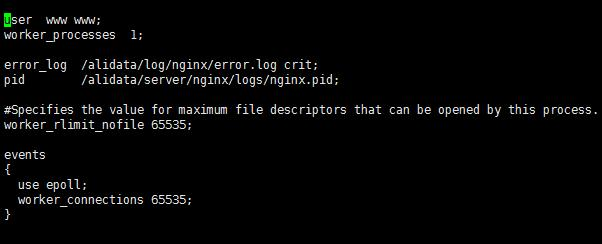
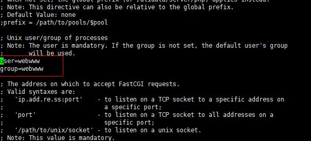

******************
Nginx环境中配置网站目录权限设置
******************

配置权限的原则是，在保证网站正常运行下，尽量给最低权限。

要设置安全的权限系统，你要先弄清楚以下几个问题：

1.　网站的文件所有者帐号是什么？

2.   ``apache/php-fpm`` 以什么帐号身份运行？

3.　网站哪些目录需要有写入权限（如日志生成、附件上传等）

针对这个问题，建议的设置如下：

1.　网站所有者，可设置为 ``ftp`` , ``www`` 帐号；

网站目录基本的权限设置(目录 755 ,文件 644 )：

- find -type d -exec chmod 755 {} \;
- find -type f -exec chmod 644 {} \;

也就是说 ``Nginx`` 和 ``PHP-FPM`` 只能读文件和访问目录。

2.　``nginx/php-fpm/apache`` ，建议以 ``nobody`` 帐号运行(不要建立那么多帐号，使用默认的nobody就行了)，反正不能使用网站文件所有者帐号。

当我们访问网站时，浏览器发出请求，服务端相应的资源处理请求，如果涉及到文件的修改或新建操作时，服务端程序负责执行，由于服务端程序是由 ``nginx`` 和相应的语言解释模块负责执行的，所以首先服务器要有权限修改网站目录，我们打开 ``nginx`` 服务器下的配置文件 ``nginx.conf`` ，第一行就是 ``nginx`` 执行的用户和组的设置：

然后重启 ``nginx`` 服务器。如果是 ``php`` 的话，那么目前比较常用的是 ``nginx`` 会交由 ``php-fpm`` 模块去执行相应的操作，所以还应该在 ``php-fpm.conf`` 中修改 ``user=www group=www`` 。

修改之后重启 ``php-fpm`` 模块，到这里用户配置就完成了，然后我们可以新建一个专门用于网站和 ``ftp`` 上传文件的用户，该用户是不登录的所以建立的时候要使用 ``/sbin/nologin`` 来建。

网站文件所有者和 ``php-fpm`` 进程用户设为不同的好处是在 ``PHP`` 程序中无法对网站文件进行修改，这样即使网站被挂马了，也能降低很多损失，例如，对方无法在你的正常代码里混入后门。

3.　需要可写权限的目录，手工设置权限为 777 即可。

对于特别的目录，比如文件上传目录，需要给 ``apach/Nginx`` 写权限，这时可以设为 777 ： ``chmod 777 www/uploads`` 但注意配置该目录不做 PHP 解析，比如：

.. code-block:: ini

    location ~ \.php$ {
        include fastcgi_params;
        if ($uri !~ "^/uploads/") {
        fastcgi_pass 127.0.0.1:9000;
        }
        fastcgi_index index.php;
        fastcgi_param SCRIPT_FILENAME /path/to/www$fastcgi_script_name;
    }

进一步精确控制：

假设网站缓存目录名为 ``cache`` ，其所有者为 ``ftp`` 。缓存文件是由 ``php-fpm`` 进程执行写入，相当于用户 ``nobody`` 要在用户 ``ftp`` 的目录 ``cache`` 里写文件，不被允许的!因此，要分配给 ``nobody`` 对 ``cache`` 目录的写权限， ``chmod o+w -R cache`` 即可，如果 ``ftp`` 与 ``nobody`` 同一个用户组，就 ``chmod g+w -R cache`` 。缓存目录不需要执行权限，所以以往设置 ``777`` 权限的做法相当粗糙，不过在使用虚拟主机的时候，自己无法把握服务器上各种设置， ``777`` 也是最便捷做法了。

缓存目录需要 ``o+wx`` ，添加 ``x`` 的原因是读取子目录的时候需要执行权限，否则文件是写不成功的。除非要生成的文件和写文件的脚本在同一个目录内，不需要读取目录的权限，也就不需要执行权限。

4.　``php`` 生成的日志、附件文件的所有者会是 ``nobody`` , 这时 ``www`` , ``ftp`` 帐号却无法修改、删除这些文件。那么在 ``php`` 生成文件时，可调用 ``chmod($filename, 0777)`` 。

