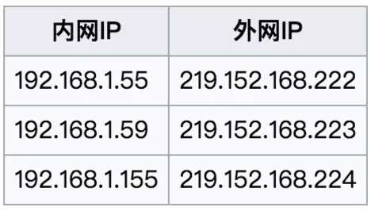
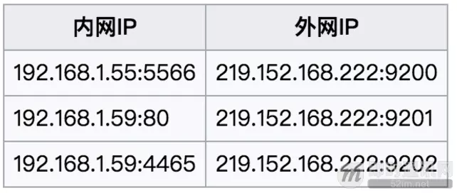
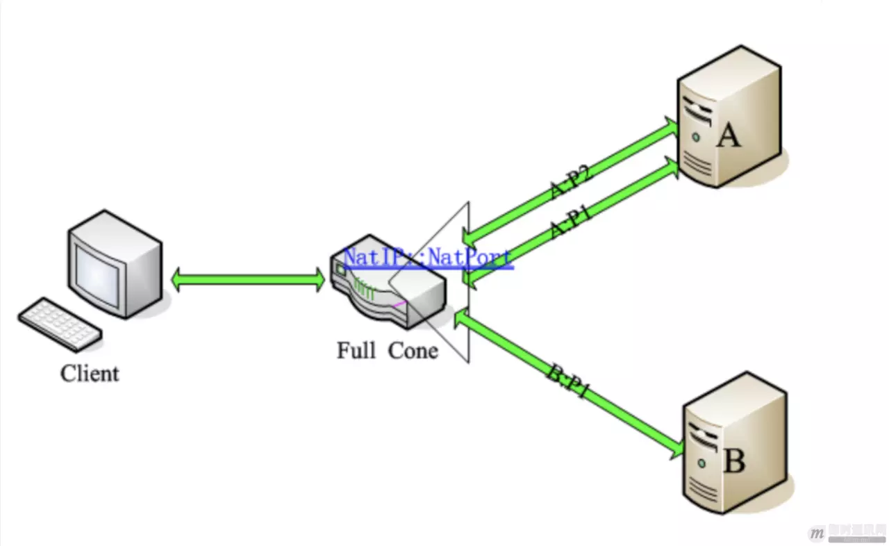
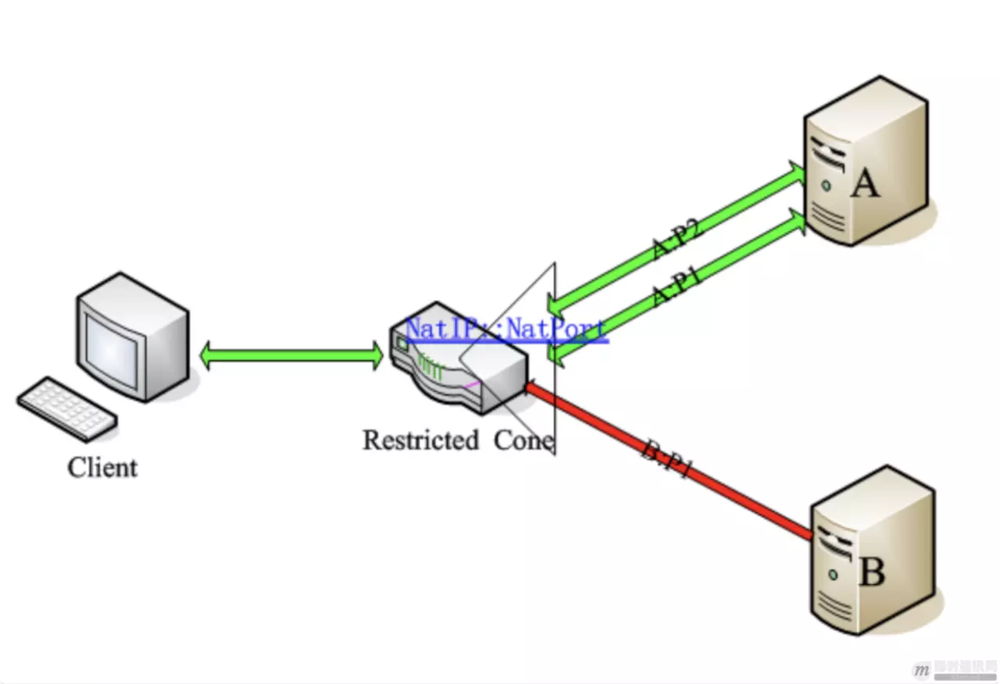
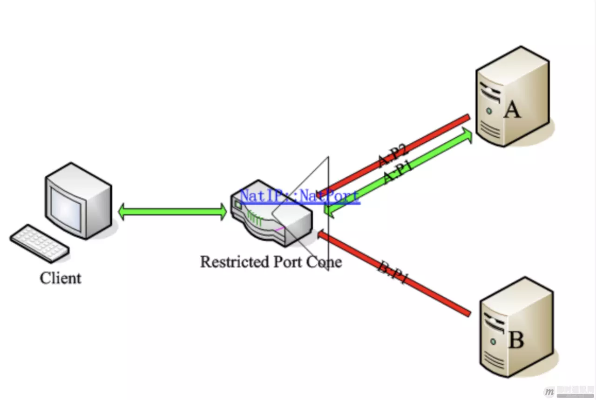
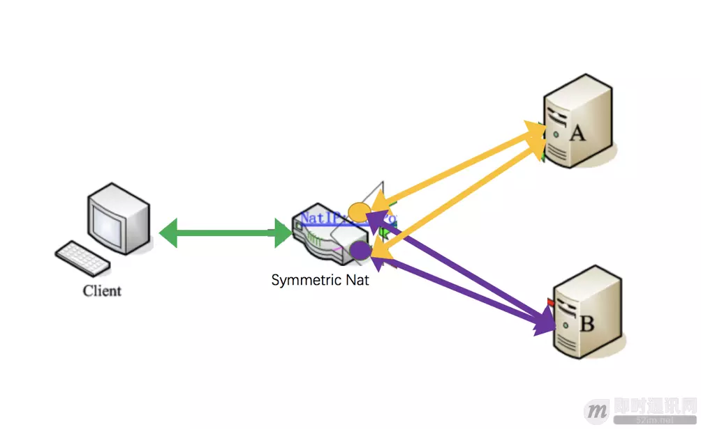
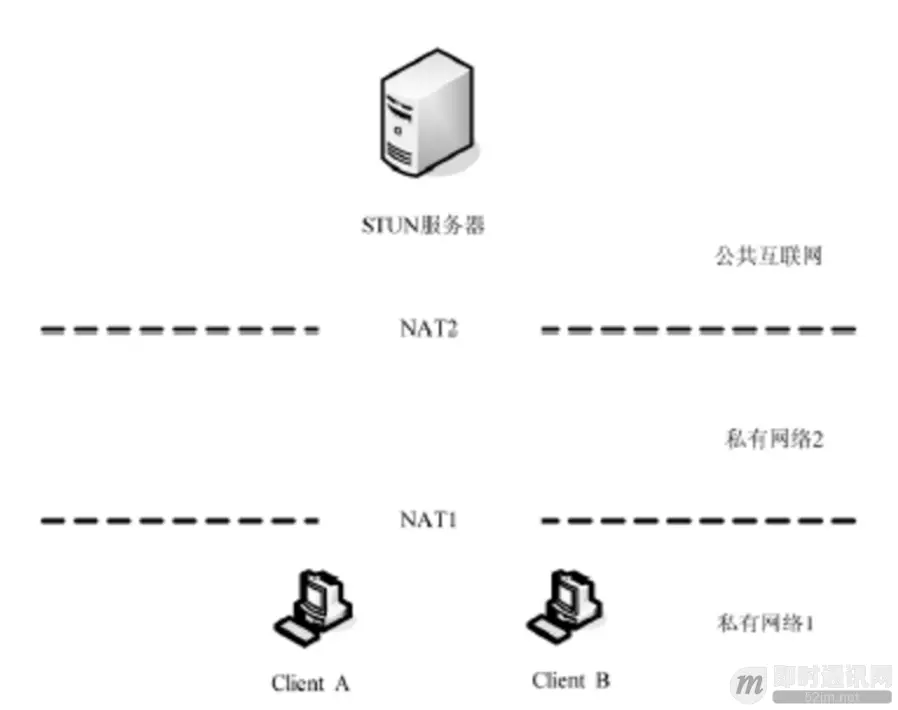

**************
P2P技术中的NAT穿透原理
**************

前言
====

``P2P`` 技术在现实的应用场景中，主要用于诸如 ``IM`` （尤其移动端 ``IM`` ）、在线直播、在线教育等（这些应用里的实时音视频功能通常都会涉及到 ``P2P`` ），了解 ``P2P`` 的原理对于开发相关的应用来说还是很有必要的。

基础知识
========

什么是NAT？
-----------
``NAT`` （ ``Network Address Translation`` ，网络地址转换），也叫做网络掩蔽或者 ``IP`` 掩蔽。 ``NAT`` 是一种网络地址翻译技术，主要是将内部的私有 ``IP`` 地址（ ``private IP`` ）转换成可以在公网使用的公网 ``IP`` （ ``public IP`` ）。

为什么会有NAT？
--------------
时光回到上个世纪 ``80`` 年代，当时的人们在设计网络地址的时候，觉得再怎么样也不会有超过 ``32bits`` 位长即 ``2`` 的 ``32`` 次幂台终端设备连入互联网，再加上增加 ``ip`` 的长度（即使是从 ``4`` 字节增到 ``6`` 字节）对当时设备的计算、存储、传输成本也是相当巨大的。后来逐渐发现 ``IP`` 地址不够用了，然后就 ``NAT`` 就诞生了！（虽然 ``ipv6`` 也是解决办法，但始终普及不开来，而且未来到底 ``ipv6`` 够不够用仍是未知）。

因此， ``NAT`` 技术能够兴起的原因还是因为在我们国家公网 ``IP`` 地址太少了，不够用，所以才会采取这种地址转换的策略。可见， ``NAT`` 的本质就是让一群机器公用同一个 ``IP`` ，这样就暂时解决了 ``IP`` 短缺的问题。

NAT有什么优缺点？
----------------
优势其实上面已经刚刚讨论过了，根据定义，比较容易看出， ``NAT`` 可以同时让多个计算机同时联网，并隐藏其内网 ``IP`` ，因此也增加了内网的网络安全性；此外， ``NAT`` 对来自外部的数据查看其 ``NAT`` 映射记录，对没有相应记录的数据包进行拒绝，提高了网络安全性。

那么， ``NAT`` 与此同时也带来一些弊端：首先是， ``NAT`` 设备会对数据包进行编辑修改，这样就降低了发送数据的效率；此外，各种协议的应用各有不同，有的协议是无法通过 ``NAT`` 的（不能通过 ``NAT`` 的协议还是蛮多的），这就需要通过穿透技术来解决。我们后面会重点讨论穿透技术。

简单的背景了解过后，下面介绍下 ``NAT`` 实现的主要方式，以及 ``NAT`` 都有哪些类型。

NAT的实现方式
-------------

静态NAT
^^^^^^^
也就是静态地址转换。是指一个公网 ``IP`` 对应一个私有 ``IP`` ，是一对一的转换，同时注意，这里只进行了 ``IP`` 转换，而没有进行端口的转换。

举个例子：

NAPT
^^^^
端口多路复用技术。与静态 ``NAT`` 的差别是， ``NAPT`` 不但要转换 ``IP`` 地址，还要进行传输层的端口转换。具体的表现形式就是，对外只有一个公网 ``IP`` ，通过端口来区别不同私有 ``IP`` 主机的数据。

再举个例子：

通过上面 ``NAT`` 实现方式的介绍，我们其实不难看出，现实环境中 ``NAPT`` 的应用显然是更广泛的。因此下面就重点介绍下 ``NAPT`` 的主要类型有哪些。

NAT的主要类型
-------------
对于 ``NAPT`` 我们主要分为两大类：锥型 ``NAT`` 和对称型 ``NAT`` 。其中锥型 ``NAT`` 又分：完全锥型，受限锥型和端口受限锥型。

概括的说：对称型 ``NAT`` 是一个请求对应一个端口；锥型 ``NAT`` （非对称 ``NAT`` ）是多个请求（外部发向内部）对应一个端口，只要源 ``IP`` 端口不变，无论发往的目的 ``IP`` 是否相同，在 ``NAT`` 上都映射为同一个端口，形象的看起来就像锥子一样。

下面分别介绍这四种类型及其差异。

完全锥型NAT（Full Cone NAT，后面简称FC）
^^^^^^^^^^^^^^^^^^^^^^^^^^^^^^^^^^^^^^
特点： ``IP`` 和端口都不受限。任何外部 ``IP`` 地址或端口都可以访问公网映射端口。

表现形式：将来自内部同一个 ``IP`` 地址同一个端口号（ ``IP_IN_A:PORT_IN_A`` ）的主机监听/请求，映射到公网 ``IP`` 某个端口（ ``IP_OUT_B:PORT_OUT_B`` ）的监听。任意外部 ``IP`` 地址与端口对其自己公网的 ``IP`` 这个映射后的端口访问（ ``IP_OUT_B:PORT_OUT_B`` ），都将重新定位到内部这个主机（ ``IP_IN_A:PORT_IN_A`` ）。该技术中，基于 ``C/S`` 架构的应用可以在任何一端发起连接。是不是很绕啊。再简单一点的说，就是，只要客户端，由内到外建立一个映射（ ``NatIP:NatPort -> A1`` ）之后，其它 ``IP`` 的主机 ``B`` 或端口 ``A2`` 都可以使用这个洞给客户端发送数据。见下图（图片来自网络）。

受限锥型NAT（Restricted Cone NAT）
^^^^^^^^^^^^^^^^^^^^^^^^^^^^^^^^^
特点： ``IP`` 受限，端口不受限。只有公网映射连接过的 ``IP`` 地址才可以访问公网映射端口。

表现形式：与完全锥形 ``NAT`` 不同的是，在公网映射端口后，并不允许所有 ``IP`` 进行对于该端口的访问，要想通信必需内部主机对某个外部 ``IP`` 主机发起过连接，然后这个外部 ``IP`` 主机就可以与该内部主机通信了，但端口不做限制。举个例子。当客户端由内到外建立映射( ``NatIP:NatPort –> A1`` )， ``A`` 机器可以使用他的其他端口（ ``P2`` ）主动连接客户端，但 ``B`` 机器则不被允许。因为 ``IP`` 受限啦，但是端口随便。见下图（绿色是允许通信，红色是禁止通信）。

端口受限锥型NAT（Port Restricted Cone NAT）
^^^^^^^^^^^^^^^^^^^^^^^^^^^^^^^^^^^^^^^
特点： ``IP`` 和端口都受限。只有曾经公网映射连接过的 ``IP`` 地址和端口才可以访问公网映射端口。

表现形式：该技术与受限锥形 ``NAT`` 相比更为严格。除具有受限锥形 ``NAT`` 特性，对于回复主机的端口也有要求。也就是说：只有当内部主机曾经发送过报文给外部主机（假设其 ``IP`` 地址为 ``A`` 且端口为 ``P1`` ）之后，外部主机才能以公网 ``IP:PORT`` 中的信息作为目标地址和目标端口，向内部主机发送 ``UDP`` 报文，同时，其请求报文的 ``IP`` 必须是 ``A`` ，端口必须为 ``P1`` （使用 ``IP`` 地址为 ``A`` ，端口为 ``P2`` ，或者 ``IP`` 地址为 ``B`` ，端口为 ``P1`` 都将通信失败）。例子见下图。这一要求进一步强化了对外部报文请求来源的限制，从而较 ``Restrictd Cone`` 更具安全性。

对称型NAT（Symmetric NAT）
^^^^^^^^^^^^^^^^^^^^^^^^
特点：对每个外部主机或端口的会话都会映射为不同的端口（洞）。

表现形式：只有来自同一内部 ``IP:PORT`` 、且针对同一目标 ``IP:PORT`` 的请求才被 ``NAT`` 转换至同一个公网（外部） ``IP:PORT`` ，否则的话， ``NAT`` 将为之分配一个新的外部（公网） ``IP:PORT`` 。并且，只有曾经收到过内部主机请求的外部主机才能向内部主机发送数据包。内部主机用同一 ``IP`` 与同一端口与外部多 ``IP`` 通信。客户端想和服务器 ``A`` （ ``IP_A:PORT_A`` ）建立连接，是通过 ``NAT`` 映射为 ``NatIP:NatPortA`` 来进行的。而客户端和服务器 ``B`` （ ``IP_B:PORT_B`` ）建立连接，是通过 ``NAT`` 映射为 ``NatIP:NatPortB`` 来进行的。即同一个客户端和不同的目标 ``IP:PORT`` 通信，经过 NAT 映射后的公网 ``IP:PORT`` 是不同的。此时，如果 ``B`` 想要和客户端通信，也只能通过 ``NatIP:NatPortB`` （也就是紫色的洞洞）来进行，而不能通过 ``NatIP:NatPortA`` （也就是黄色的洞洞）。

以上，就是 ``NAPT`` 的四种 ``NAT`` 类型。可以看出从类型 ``1`` 至类型 ``4`` ， ``NAT`` 的限制是越来越大的。

NAT路由类型判断
--------------
根据上面的介绍，我们可以了解到，在实际的网络情况中，各个设备所处的网络环境是不同的。那么，如果这些设备想要进行通信，首先判断出设备所处的网络类型就是非常重要的一步。

举个例子来说：对于 ``IM`` 中的实时音视频功能和 ``VoIP`` 软件，对位于不同 ``NAT`` 内部的主机通信需要靠服务器来转发完成，这样就会增加服务器的负担。为了解决这种问题，要尽量使位于不同 ``NAT`` 内部的主机建立直接通信，其中，最重要的一点就是要判断出 ``NAT`` 的类型，然后才能根据 ``NAT`` 的类型，设计出直接通信方案。不然的话，两个都在 ``NAT`` 的终端怎么通信呢？我们不知道对方的内网 ``IP`` ，即使把消息发到对方的网关，然后呢？网关怎么知道这条消息给谁，而且谁允许网关这么做了？

为了解决这个问题，也就是处于内网的主机之间能够穿越它们之间的 ``NAT`` 建立直接通信，已经提出了许多方法， ``STUN`` （ ``Session Traversal Utilities for NAT`` ， ``NAT`` 会话穿越应用程序）技术就是其中比较重要的一种解决方法，并得到了广泛的应用。在这个部分，我们将重点介绍下 ``STUN`` 技术的原理。（ PS：除此之外，还有 ``UPNP`` 技术， ``ALG`` 应用层网关识别技术， ``SBC`` 会话边界控制， ``ICE`` 交互式连接建立， ``TURN`` 中继 ``NAT`` 穿越技术等等，本文不一一做介绍。）

STUN协议介绍
------------

STUN基本介绍
^^^^^^^^^^^^
``STUN`` 是一种网络协议，它允许位于 ``NAT`` （或多重 ``NAT`` ）后的客户端找出自己的公网地址，查出自己位于哪种类型的 ``NAT`` 之后以及 ``NAT`` 为某一个本地端口所绑定的 ``Internet`` 端端口。这些信息被用来在两个同时处于 ``NAT`` 路由器之后的主机之间建立 ``UDP`` 通信。该协议由 `RFC 5389 <https://link.juejin.im/?target=https%3A%2F%2Ftools.ietf.org%2Fhtml%2Frfc5389>`_ 定义。该协议由 RFC 3489 定义。目前 RFC 3489 协议已被 RFC 5389 协议所取代，新的协议中，将 STUN 定义为一个协助穿越 NAT 的工具，并不独立提供穿越的解决方案。它还有升级版本 RFC 7350 ，目前正在完善中。

``STUN`` 由三部分组成：

- ``STUN`` 客户端；
- ``STUN`` 服务器端；
- ``NAT`` 路由器；

``STUN`` 服务端部署在一台有着两个公网IP的服务器上，大概的结构参考下图。 ``STUN`` 客户端通过向服务器端发送不同的消息类型，根据服务器端不同的响应来做出相应的判断，一旦客户端得知了 ``Internet`` 端的 ``UDP`` 端口，通信就可以开始了。

STUN的检测过程
^^^^^^^^^^^^^^

``STUN`` 协议定义了三类测试过程来检测 ``NAT`` 类型：

- ``Test1`` ： ``STUN Client`` 通过端口 ``{IP-C1:Port-C1}`` 向 ``STUN Server {IP-S1:Port-S1}`` 发送一个 ``Binding Request`` （没有设置任何属性）。 ``STUN Server`` 收到该请求后，通过端口 ``{IP-S1:Port-S1}`` 把它所看到的 ``STUN Client`` 的 ``IP`` 和端口 ``{IP-M1,Port-M1}`` 作为 ``Binding Response`` 的内容回送给 ``STUN Client`` 。
- ``Test1#2`` ： ``STUN Client`` 通过端口 ``{IP-C1:Port-C1}`` 向 ``STUN Server {IP-S2:Port-S2}`` 发送一个 ``Binding Request`` （没有设置任何属性）。 ``STUN Server`` 收到该请求后，通过端口 ``{IP-S2:Port-S2}`` 把它所看到的 ``STUN Client`` 的 ``IP`` 和端口 ``{IP-M1#2,Port-M1#2}`` 作为 ``Binding Response`` 的内容回送给 ``STUN Client`` 。
- ``Test2`` ： ``STUN Client`` 通过端口 ``{IP-C1:Port-C1}`` 向 ``STUN Server {IP-S1:Port-S1}`` 发送一个 ``Binding Request`` （设置了 ``Change IP`` 和 ``Change Port`` 属性）。 ``STUN Server`` 收到该请求后，通过端口 ``{IP-S2:Port-S2}`` 把它所看到的 ``STUN Client`` 的 ``IP`` 和端口 ``{IP-M2,Port-M2}`` 作为 ``Binding Response`` 的内容回送给 ``STUN Client`` 。
- ``Test3`` ： ``STUN Client`` 通过端口 ``{IP-C1:Port-C1}`` 向 ``STUN Server {IP-S1:Port-S1}`` 发送一个 ``Binding Request`` （设置了 ``Change Port`` 属性）。 ``STUN Server`` 收到该请求后，通过端口 ``{IP-S1:Port-S2}`` 把它所看到的 ``STUN Client`` 的 ``IP`` 和端口 ``{IP-M3,Port-M3}`` 作为 ``Binding Response`` 的内容回送给 ``STUN Client`` 。

``STUN`` 协议的输出是：

1. 公网 ``IP`` 和 ``Port`` ；
2. 防火墙是否设置；
3. 客户端是否在 ``NAT`` 之后，及所处的 ``NAT`` 的类型；

因此我们进而整理出，通过 ``STUN`` 协议，我们可以检测的类型一共有以下七种：

- A：公开的互联网 IP ：主机拥有公网IP，并且没有防火墙，可自由与外部通信；
- B：完全锥形 NAT ；
- C：受限制锥形 NAT ；
- D：端口受限制形 NAT ；
- E：对称型 UDP 防火墙：主机出口处没有 NAT 设备，但有防火墙，且防火墙规则如下：从主机 UDP 端口 A 发出的数据包保持源地址，但只有从之前该主机发出包的目的 IP/PORT 发出到该主机端口 A 的包才能通过防火墙；
- F：对称型 NAT ；
- G：防火墙限制 UDP 通信；

STUN协议的判断过程
^^^^^^^^^^^^^^^^^^
输入和输出准备好后，附上一张维基百科的流程图，就可以描述 ``STUN`` 协议的判断过程了。

.. image:: ./images/stun_flow.png

**STEP1** ：检测客户端是否有能力进行 ``UDP`` 通信以及客户端是否位于 ``NAT`` 后 -- Test1

客户端建立 ``UDP socket`` ，然后用这个 ``socket`` 向服务器的 ``(IP-1，Port-1)`` 发送数据包要求服务器返回客户端的 ``IP`` 和 ``Port`` ，客户端发送请求后立即开始接受数据包。重复几次。

a. 如果每次都超时收不到服务器的响应，则说明客户端无法进行 ``UDP`` 通信，可能是： ``G`` 防火墙阻止 ``UDP`` 通信；
b. 如果能收到回应，则把服务器返回的客户端的 ``(IP:PORT)`` 同 ``(Local IP:Local Port)`` 比较：
  - 如果完全相同则客户端不在 ``NAT`` 后，这样的客户端是： ``A`` 具有公网 ``IP`` 可以直接监听 ``UDP`` 端口接收数据进行通信或者 ``E`` 。
  - 否则客户端在 ``NAT`` 后要做进一步的 ``NAT`` 类型检测（继续）。

**STEP2** ：检测客户端防火墙类型 -- Test2

``STUN`` 客户端向 ``STUN`` 服务器发送请求，要求服务器从其它 ``IP`` 和 ``PORT`` 向客户端回复包：

a. 收不到服务器从其他 ``IP`` 地址的回复，认为包被前置防火墙阻断，网络类型为 ``E`` ；
b. 收到则认为客户端处在一个开放的网络上，网络类型为 ``A`` 。

**STEP3** ：检测客户端 ``NAT`` 是否是 FULL CONE NAT -- Test2

客户端建立 ``UDP socket`` 然后用这个 ``socket`` 向服务器的 ``(IP-1，Port-1)`` 发送数据包要求服务器用另一对 ``(IP-2，Port-2)`` 响应客户端的请求往回发一个数据包，客户端发送请求后立即开始接受数据包。 重复这个过程若干次。

a. 如果每次都超时，无法接受到服务器的回应，则说明客户端的 ``NAT`` 不是一个 ``Full Cone NAT`` ，具体类型有待下一步检测（继续）；
b. 如果能够接受到服务器从 ``(IP-2，Port-2)`` 返回的应答 ``UDP`` 包，则说明客户端是一个 ``Full Cone NAT`` ，这样的客户端能够进行 ``UDP-P2P`` 通信。

**STEP4** ：检测客户端 ``NAT`` 是否是 SYMMETRIC NAT -- Test1#2

客户端建立 ``UDP socket`` 然后用这个 ``socket`` 向服务器的 ``(IP-1，Port-1)`` 发送数据包要求服务器返回客户端的 ``IP`` 和 ``Port`` ，客户端发送请求后立即开始接受数据包。 重复这个过程直到收到回应（一定能够收到，因为第一步保证了这个客户端可以进行 ``UDP`` 通信）。

用同样的方法用一个 ``socket`` 向服务器的 ``(IP-2，Port-2)`` 发送数据包要求服务器返回客户端的 ``IP`` 和 ``Port`` 。

比较上面两个过程从服务器返回的客户端 ``(IP，Port)`` ，如果两个过程返回的 ``(IP，Port)`` 有一对不同则说明客户端为 ``Symmetric NAT`` ，这样的客户端无法进行 ``UDP-P2P`` 通信（检测停止）因为对称型 ``NAT`` ，每次连接端口都不一样，所以无法知道对称 ``NAT`` 的客户端，下一次会用什么端口。否则是 ``Restricted Cone NAT`` ，是否为 ``Port Restricted Cone NAT`` 有待检测（继续）。

**STEP5** ：检测客户端 ``NAT`` 是 Restricted Cone 还是 Port Restricted Cone -- Test3

客户端建立 ``UDP socket`` 然后用这个 ``socket`` 向服务器的 ``(IP-1，Port-1)`` 发送数据包要求服务器用 ``IP-1`` 和一个不同于 ``Port-1`` 的端口发送一个 ``UDP`` 数据包响应客户端，客户端发送请求后立即开始接受数据包。重复这个过程若干次。如果每次都超时，无法接受到服务器的回应，则说明客户端是一个 ``Port Restricted Cone NAT`` ，如果能够收到服务器的响应则说明客户端是一个 ``Restricted Cone NAT`` 。以上两种 ``NAT`` 都可以进行 ``UDP-P2P`` 通信。

通过以上过程，至此，就可以分析和判断出客户端是否处于 ``NAT`` 之后，以及 ``NAT`` 的类型及其公网 ``IP`` ，以及判断客户端是否具备 ``P2P`` 通信的能力了。

- http://www.52im.net/thread-542-1-1.html

