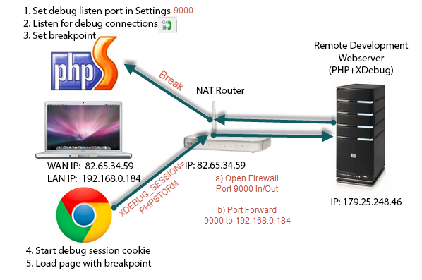
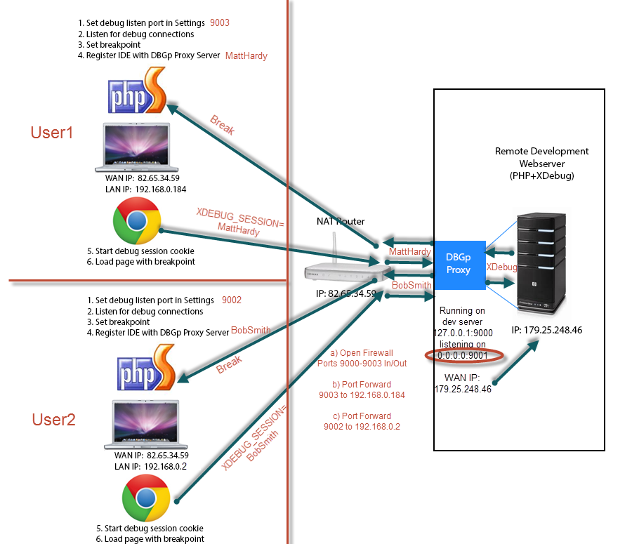

********************************
PhpStorm, XDebug, and DBGp Proxy
********************************

phpstorm 利用 xdebug、dbgp-proxy配置远程调试

单客户机远程调试
================

服务器端配置
------------

1. 安装xdebug库文件(windows:php_xdebug.dll;linux:php_xdebug.so)
2. 修改php.ini(php源码运行环境)

   .. code-block:: ini

        ;xdebug库文件
        zend_extension = "d:/wamp/bin/php/php5.3.10/zend_ext/php_xdebug.dll"
        ;开启远程调试
        xdebug.remote_enable = On
        ;客户机ip
        xdebug.remote_host = localhost
        ;客户机xdebug监听端口
        xdebug.remote_port = 9000
        xdebug.remote_handler = dbgp
        ;idekey,只有带有指定XDEBUG_SESSION=PhpStorm的请求才能唤起调试
        xdebug.idekey = PhpStorm

客户机(IDE运行环境)配置
-----------------------

1. 配置php程序远程服务, ``phpstorm:File>Settings>Languages & Frameworks>PHP>Servers`` apache服务:其中 ``use path mappings`` 用于将本地代码与远程服务主机代码映射，然后跟踪。
2. 配置xdebug， ``phpstorm:File>Settings>Languages & Frameworks>PHP>Debug`` Debug port:默认9000，与 ``xdebug.remote_port`` 一致。
3. 单击 ``edit configurations`` ，选择服务器。
4. 在phpStorm里打开监听，就是一个电话一样的按钮。
5. 打开debug，就是那个像甲壳虫的小按钮(此操作会打开一个链接然后将连接后的参数 ``XDEBUG_SESSION_START`` 注入到 ``cookie:XDEBUG_SESSION`` ,该值唯一标示一个ide)。

多客户机远程调试
================

**该图片有点错误，就是浏览器请求不会通过DBGP Proxy软件。只有调试插件返回的请求才会通过DBGP Proxy软件。**

服务器端配置
------------

1. 在远程服务主机上，安装 ``Komodo Remote Debugging`` (http://code.activestate.com/komodo/remotedebugging/)　
2. 输入 ``pydbgpproxy.exe --help`` ，

   .. code-block:: shell

    控制台输出：

    -i hostname:port listener port for IDE processes(defaults to '127.0.0.1:9001')
    -d hostname:port listener port for debug processes(defaults to '127.0.0.1:9000')
　　　　

3. 启动 ``pydbgpproxy.exe -i 0.0.0.0:9001 -d 9000``

   .. code-block:: shell

      控制台输出：

      INFO: dbgp.proxy: starting proxy listeners. appid: 10814
      INFO: dbgp.proxy: dbgp listener on 127.0.0.1:9000
      INFO: dbgp.proxy: IDE listener on 0.0.0.0:9001

   则成功启动。dbgp proxy server监听9000与远程主机服务通信，监听9001与IDE(phpstorm)通信。

4. 安装xdebug库文件(windows:php_xdebug.dll;linux:php_xdebug.so)
5. 修改php.ini(php源码运行环境)

   .. code-block:: ini

    ;xdebug库文件
    zend_extension = "d:/wamp/bin/php/php5.3.10/zend_ext/php_xdebug.dll"
    ;开启远程调试
    xdebug.remote_enable = On
    ;DBGP PROXY SERVER所在主机ip
    xdebug.remote_host=localhost
    ;DBGP PROXY SERVER监听端口
    xdebug.remote_port=9000
    ;代理协议
    xdebug.remote_handler=dbgp
    ;此种模式下该项不在起作用，可以取消
    ;xdebug.idekey=PhpStorm

客户机(IDE运行环境)配置
-----------------------

1. 配置php程序远程服务， ``phpstorm:File>Settings>Languages & Frameworks>PHP>Servers`` apache服务:其中 ``use path mappings`` 用于将本地代码与远程服务主机代码映射，然后跟踪。
2. 配置xdebug， ``phpstorm:File>Settings>Languages & Frameworks>PHP>Debug``

   - Debug port:xdebug的监听端口xx(其中xx根据自己选择)，listening for connections from 'xdebug'。
   - DBGP Proxy:

     - IDE Key(IDE的唯一key，一定不要与其他客户机的key相同，否则不能注册)。
     - Host(DBGP Proxy server 的主机ip)。
     - Port(DBGP Proxy server与IDE通信的监听端口，与-i 0.0.0.0:9001里设置一致)。

3. 将IDE的配置注入到 ``DBGP Proxy server`` 。单击工具栏"Tools",选择"Register IDE"进行注册(若果没有配置IDE，可以选择"configurations"进行配置，然后注册)。
4. 单击 ``edit configurations`` ，选择服务器。
5. 在phpStorm里打开监听，就是一个电话一样的按钮。
6. 打开debug，就是那个像甲壳虫的小按钮(此操作会打开一个链接然后将连接后的参数 ``XDEBUG_SESSION_START`` 注入到 ``cookie:XDEBUG_SESSION`` ,该值唯一标示一个ide)，将 ``XDEBUG_SESSION_START`` 参数值修改为 ``IDE Key`` 。

