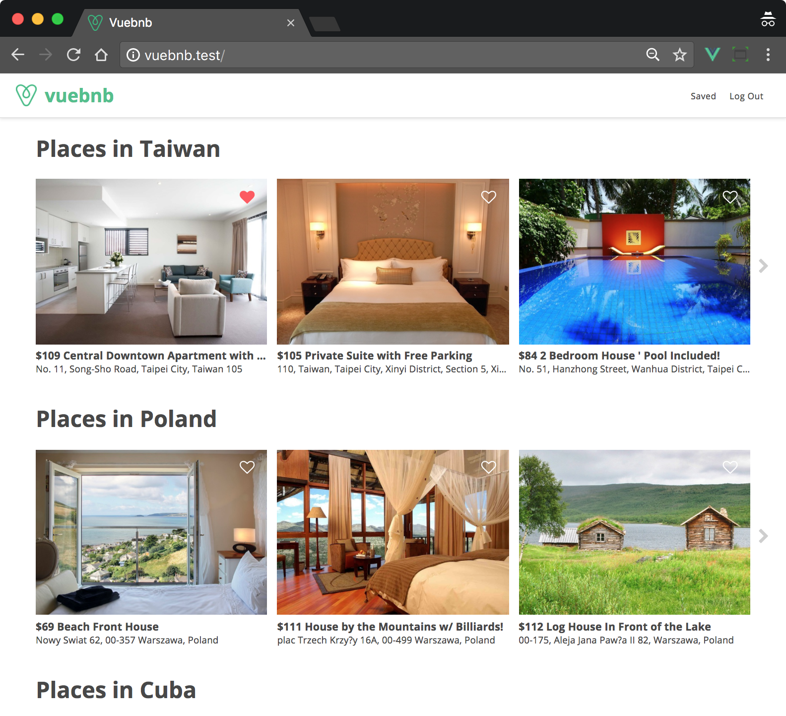
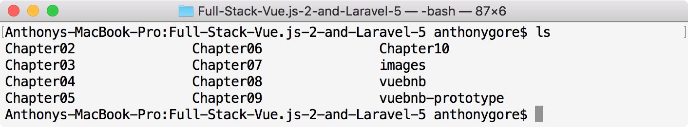

*************************************
Hello Vue – An Introduction to Vue.js
*************************************

欢迎来到 ``Full-Stack Vue.js2`` 和 ``Laravel5`` ！ 在第一章中，我们将对 ``Vue.js`` 进行概述，让您了解它的功能，为接下来的学习做好准备。

我们将会熟悉本书中主要的案例研究项目 ``Vuebnb`` 。

本章涵盖以下主题：

- Vue的基本功能，包括模板，指令和组件
- Vue的高级功能包括单文件组件和服务器端渲染
- Vue生态系统中的工具包括 ``Vue Devtools`` ， ``Vue Router`` 和 ``Vuex``
- 主要案例研究项目，您将在本书 ``Vuebnb`` 的基础上完成
- 有关安装项目代码的说明

Vue.js 简介
============
在2017年末编写时， ``Vue.js`` 的版本为2.5。从第一次发布，不到四年的时间里， ``Vue`` 已经成为 ``GitHub`` 上最受欢迎的开源项目之一。这种受欢迎程度的部分原因是其强大的功能，但也强调开发者的体验和易于采用。

``Vue.js`` 的核心库，如 ``React`` ，仅用于从MVC体系结构模式中操作视图层。然而， ``Vue`` 有两个官方支持库， ``Vue Router`` 和 ``Vuex`` ，分别负责路由和数据管理。

``Vue`` 不像 ``React`` 和 ``Angular`` 那样由技术巨人支持，而是依靠少数企业用户和专业 ``Vue`` 用户的捐赠。更令人印象深刻的是， ``Evan You`` 目前是唯一的全职 ``Vue`` 开发人员，尽管来自世界各地的20多位开发人员组成的核心团队将协助开发，维护和文档编制工作。

``Vue`` 的关键设计原则如下：

- 专注： ``Vue`` 选择了一个专注于 ``API`` 的小型应用程序，其唯一目的是创建用户界面
- 简单： ``Vue`` 的语法简洁易懂
- 紧凑性：核心库脚本缩小了〜25 KB，使其比 ``React`` 甚至 ``jQuery`` 更小
- 速度：渲染基准击败了许多主要框架，包括 ``React``
- 多功能性： ``Vue`` 适用于通常使用 ``jQuery`` 的小型作业，但可以作为合法的 ``SPA`` 解决方案进行扩展

基本功能
========
现在让我们对 ``Vue`` 的基本功能进行高度概述。 如果你愿意，你可以像下面这样在你的计算机上创建一个 ``HTML`` 文件，在你的浏览器中打开它，并且与下面的例子一样编码。

.. code-block:: html

    <!DOCTYPE html>
    <html lang="en">
    <head>
      <meta charset="utf-8">
      <meta http-equiv="X-UA-Compatible" content="IE=edge">
      <title>Hello Vue</title>
    </head>
    <body>
      <!--We'll be adding stuff here!-->
    </body>
    </html>

安装
-----
尽管 ``Vue`` 可以以更复杂设置用作 ``JavaScript`` 模块，但它也可以简单地作为 ``HTML`` 文档主体中的外部脚本包含在内：

.. code-block:: html

    

模板
----
默认情况下， ``Vue`` 将使用 ``HTML`` 文件为其模板。 包含的脚本将声明 ``Vue`` 的实例并使用配置对象中的 ``el`` 属性来告诉 ``Vue`` 应用程序将在模板中的哪个位置进行挂载：

.. code-block:: html

    

      <!--Vue has dominion within this node-->
    

    

我们可以通过创建 ``data`` 属性并使用 ``musache`` 语法将其绑定到模板到页面中：

.. code-block:: html

    

      {{ message }}
      <!--Renders as "Hello World"-->
    

    

指令
----
与 ``Angular`` 类似，我们可以使用指令为我们的模板添加功能。 这些是我们添加到以 ``v-`` 前缀开头的 ``HTML`` 标记中的特殊属性。

假设我们有一组数据。 我们可以通过使用 ``v-for`` 指令将这些数据作为有序 ``HTML`` 元素呈现给页面：

.. code-block:: html

    

      <h3>Grocery list</h3>
      <ul>
        <li v-for="grocery in groceries">{{ grocery }}</li>
      </ul>
    

    

上面的代码渲染如下：

.. code-block:: html

    

      <h3>Grocery list</h3>
      <ul>
        <li>Bread</li>
        <li>Milk</li>
      </ul>
    

反应
-----
``Vue`` 设计的一个关键特征是其反应性系统。 修改数据时，视图会自动更新以反映该更改。

例如，如果我们创建一个函数，在页面已经被渲染后将另一个 ``item`` 推送到我们的食品商品数组，页面将自动重新渲染以反映该变化：

.. code-block:: javascript

    setTimeout(function() {
      app.groceries.push('Apples');
    }, 2000);

初始化渲染2秒后，我看到这些：

.. code-block:: html

    

      <h3>Grocery list</h3>
      <ul>
        <li>Bread</li>
        <li>Milk</li>
        <li>Apples</li>
      </ul>
    

组件
----
组件扩展了基本的 ``HTML`` 元素，并允许您创建自己的可重用自定义元素。

例如，在这里我创建了一个自定义元素， ``grocery-item`` ，它呈现为 ``li`` 。 该节点的文本子节点源自定制的 ``HTML`` 属性 ``title`` ，可以从组件代码中访问：

.. code-block:: html

    

      <h3>Grocery list</h3>
      <ul>
        <grocery-item title="Bread"></grocery-item>
        <grocery-item title="Milk"></grocery-item>
      </ul>
    

    

渲染结果如下：

.. code-block:: html

    

      <h3>Grocery list</h3>
      <ul>
        <li>Bread</li>
        <li>Milk</li>
      </ul>
    

但是使用组件的主要原因可能是它可以更容易地构建一个更大的应用程序。 功能可以分解为可重复使用的自包含组件。

高级功能
========
如果您目前一直在编写示例代码，请立即关闭浏览器，直到下一章为止，因为以下高级代码段不能简单地包含在浏览器脚本中。

单文件组件
----------
使用组件的一个缺点是你需要在你的主 ``HTML`` 文件之外的 ``JavaScript`` 字符串中编写你的模板。 有一些方法可以在 ``HTML`` 文件中编写模板定义，但是在标记和逻辑之间存在尴尬的分离。

一个方便的解决方案是单文件组件：

.. code-block:: html

  <template>
    <li v-on:click="bought = !bought" v-bind:class="{ bought: bought }">
      
{{ title }}

    </li>
  </template>
  
  

这些文件具有 ``.vue`` 扩展名，并将组件模板，JavaScript配置和样式封装在一个文件中。

当然， ``Web`` 浏览器无法读取这些文件，因此需要先使用 ``Webpack`` 等构建工具进行处理。

模块构建
--------
正如我们前面看到的， ``Vue`` 可以作为一个外部脚本放到项目中直接在浏览器中使用。 ``Vue`` 也可作为 ``NPM`` 模块用于更复杂的项目，包括 ``Webpack`` 等构建工具。

如果您对 ``Webpack`` 不熟悉，那么它就是一个模块捆绑器，它将您所有的项目资产捆绑到一起，并将其捆绑到您可以提供给浏览器的东西中。 在捆绑过程中，您也可以转换这些资产。

使用 ``Vue`` 作为模块并引入 ``Webpack`` 将具有以下能力：

- 单文件组件；
- 目前浏览器不支持ES功能提案；
- 模块化代码；
- 预处理器，如 ``SASS`` 和 ``Pug`` ；

.. note:: 我们将在第5章“使用 ``Webpack`` 集成 ``Laravel`` 和 ``Vue.js`` ”中更广泛地探索 ``Webpack`` 。

服务端渲染
-----------
服务器端渲染是增加全栈应用中加载速度的理想方法。 用户在加载站点时会获得包含可见内容的完整页面，而不是在 ``JavaScript`` 运行之前才会填充的空白页面。

假设我们有一个用组件构建的应用程序。如果我们使用我们的浏览器开发工具在页面加载后查看页面 ``DOM`` ，我们将看到我们完全渲染的应用程序：

.. code-block:: html

  

    <ul>
      <li>Component 1</li>
      <li>Component 2</li>
      <li>
        
Component 3

      </li>
    </ul>
  

但是，如果我们查看文档的源码，即 ``index.html`` ，就像服务器发送的那样，您会看到它只有我们的 ``mount`` 元素：

.. code-block:: html

    

为什么？ 因为 ``JavaScript`` 负责构建我们的页面，并且事实上 ``JavaScript`` 必须在页面构建之前运行。 但是在服务器端渲染时，我们的 ``index`` 文件包含浏览器在 ``JavaScript`` 下载并运行之后构建 ``DOM`` 所需的 ``HTML`` 。 该应用加载不会更快，但内容显示更快。

Vue共生系统
============
虽然 ``Vue`` 是一个独立的库，但当它与其生态系统中的一些可选工具结合使用时，它更加强大。 对于大多数项目，您将在前端堆栈中包含 ``Vue Router`` 和 ``Vuex`` ，并使用 ``Vue Devtools`` 进行调试。

Vue开发工具
------------
``Vue Devtools`` 是一个浏览器扩展，可以帮助您开发 ``Vue.js`` 项目。 除此之外，它允许您查看应用程序中组件的层次结构以及组件的状态，这对调试非常有用：

.. figure:: ./images/1-1.png
   :align: center

   图1.1 Vue Devtools组件层次结构

我们将在本节后面看看它还能做些什么。

Vue路由
--------
``Vue`` 路由器允许您将 ``SPA`` 的不同状态映射到不同的 ``URL`` ，为您提供虚拟页面。 例如， ``mydomain.com/`` 可能是博客的首页，并具有如下的组件层次结构：

.. code-block:: html

    

      <my-header></my-header>
      <blog-summaries></blog-summaries>
      <my-footer></my-footer>
    

而 ``mydomain.com/post/1`` 可能是博客中的单个帖子，如下所示：

.. code-block:: html

    

      <my-header></my-header>
      <blog-post post-id="id">
      <my-footer></my-footer>
    

从一个页面切换到另一个页面不需要重新加载页面，只需切换中间组件即可反映 ``URL`` 的状态，这正是 ``Vue Router`` 所做的。

Vuex存储管理
------------
通过将应用程序的数据集中到一个 ``store`` 中， ``Vuex`` 提供了一种强大的方式来管理应用程序的数据，因为 ``UI`` 的复杂性增加了。

我们可以通过检查 ``Vue Devtools`` 中的 ``store`` 来获取应用程序状态的快照：

.. figure:: ./images/1-2.png
   :align: center

   图1.2 Vue Devtools Vuex选项卡

左栏跟踪对应用程序数据所做的更改。 例如，假设用户保存或取消保存项目。 您可以将此事件命名为 ``toggleSaved`` 。  ``Vue Devtools`` 让你看到事件发生的细节。

我们还可以恢复到以前的任何数据状态，而无需触摸代码或重新加载页面。 这个功能称为 **时间旅行调试** ，对于调试复杂用户界面非常有用。

案例研究项目
============
在对 ``Vue`` 的主要功能进行了旋风式的概述之后，我相信您现在很想开始正确学习 ``Vue`` 并将其付诸实践。 我们先来看看你将在整本书中构建的案例研究项目。

Vuebnb
------
``Vuebnb`` 是一个真实的，全栈式的 ``Web`` 应用程序，它利用了 ``Vue`` ， ``Laravel`` 的许多主要功能，以及本书中介绍的其他工具和设计模式。

从用户的角度来看， ``Vuebnb`` 是一个在线市场，用于在世界各地的城市租用短期住宿。 您可能会注意到 ``Vuebnb`` 和其他在线市场之间有类似名称的住宿的相似之处！

您可以在这里查看完整版本的 `Vuebnb <http://vuebnb.vuejsdevelopers.com>`_  。

如果您现在无法访问互联网，这里是两个主要页面的屏幕截图。 首先，用户可以在其中搜索或浏览住宿选项的主页：

   图1.3 Vuebnb主页

其次，在列表页面中，用户查看他们可能有兴趣租用的单个住宿信息：

.. figure:: ./images/1-4.png
   :align: center

   图1.4 Vuebnb列表页面

代码库
------
案例研究项目贯穿本书的整个过程，因此一旦创建了代码库，您可以逐章添加。 到最后，您将从头开始构建并部署一个全栈应用程序。

代码库位于 ``GitHub`` 存储库中。 将它下载到计算机上通常放置项目的任何文件夹中，例如 ``~/Projects`` ：

.. code-block:: shell

    $ cd ~/Projects
    $ git clone https://github.com/PacktPublishing/Full-Stack-Vue.js-2-and-Laravel-5
    $ cd Full-Stack-Vue.js-2-and-Laravel-5

.. note:: 不要直接克隆这个存储库，你可以先制作一个分支并克隆它。 这将允许您进行任何您喜欢的更改并将您的工作保存到您自己的远程存储库中。 以下是在 ``GitHub`` 上创建存储库的指南： https://help.github.com/articles/fork-a-repo/ 。

文件夹
^^^^^^
代码库包含如下文件夹：

   图1.5 代码库目录内容

以下是每个文件夹的用途：

- ``Chapter02`` 至 ``Chapter10`` 包含每章的代码的完整状态（不包括这一章）
- 图像目录包含用于 ``Vuebnb`` 的示例图像。 这将在第4章“使用 ``Laravel`` 构建 ``Web`` 服务”中进行解释
- ``vuebnb`` 是您将用于主要案例研究项目的项目代码，我们将在第3章“设置 ``Laravel`` 开发环境”中开始工作
- ``vuebnb-prototype`` 是我们将在第2章构建 ``Vuebnb`` 原型的项目代码， ``Vuebnb`` 原型，您的第一个 ``Vue.js`` 项目

总结
====
在第一章中，我们对 ``Vue.js`` 进行了高级介绍，涵盖了模板，指令和组件等基本功能以及单个文件组件和服务器端呈现等高级功能。 我们还查看了 ``Vue`` 生态系统中的工具，包括V ``ue Router`` 和 ``Vuex`` 。

然后，我们对 ``Vuebnb`` 进行了概述，这是您在完成本书时将要构建的全栈项目，并了解了如何从 ``GitHub`` 安装代码库。

在下一章中，我们将熟悉 ``Vue`` 的基本功能，并开始通过构建 ``Vuebnb`` 的原型来使用它们。