************************
使用Vuex管理你的应用状态
************************
在上一章中，您了解了如何使用 ``Vue Router`` 将虚拟页面添加到 ``Vue.js`` 单页面应用程序。我们现在将向 ``Vuebnb`` 添加组件，这些组件跨页面共享数据，因此不能依赖于瞬态本地状态。为此，我们将利用 ``Vuex`` ，一个针对 ``Vue.js`` 的灵感来自 ``Flux`` 的库，提供管理全局应用程序状态的强大方法。

本章涉及的主题：

- ``Flux`` 应用程序体系结构的介绍以及它对构建用户界面有用的原因；
- ``Vuex`` 概述及其主要功能，包括状态和突变；
- 如何安装 ``Vuex`` 并设置可由 ``Vue.js`` 组件访问的全局存储；
- ``Vuex`` 如何通过变异记录和时间旅行调试实现 Vue Devtools 的高级调试；
- 为 ``Vuebnb`` 列表和已保存的列表页面创建保存功能；
- 将页面状态移动到 ``Vuex`` 以最小化从服务器检索不必要的数据；

Flux应用架构
============
想象一下，您已经开发了一个多用户聊天应用程序。该界面具有用户列表，私人聊天窗口，具有聊天历史记录的内嵌窗口以及通知用户未读消息的通知栏。

数百万用户每天都在通过您的应用聊天。但是，有人抱怨一个恼人的问题：应用程序的通知栏偶尔会发出虚假通知；也就是说，用户将收到新的未读消息的通知，但当他们检查它是什么时，它只是他们已经看到的消息。

我所描述的是几年前 ``Facebook`` 开发人员使用聊天系统的真实场景。解决这个问题的过程激发了他们的开发人员创建了一个名为 ``Flux`` 的应用程序架构。 ``Flux`` 构成了 ``Vuex`` ， ``Redux`` 和其他类似库的基础。

一段时间以来， ``Facebook`` 开发人员一直在努力解决这个僵尸通知错误。他们最终意识到它的持久性不仅仅是一个简单的 ``bug`` ；它指出了应用程序架构的潜在缺陷。

摘要中最容易理解缺陷：当共享数据的应用程序中有多个组件时，其互连的复杂性将增加到数据状态不再可预测或可理解的程度。当不可避免地出现类似于所描述的错误时，应用数据的复杂性使得它们几乎无法解决：

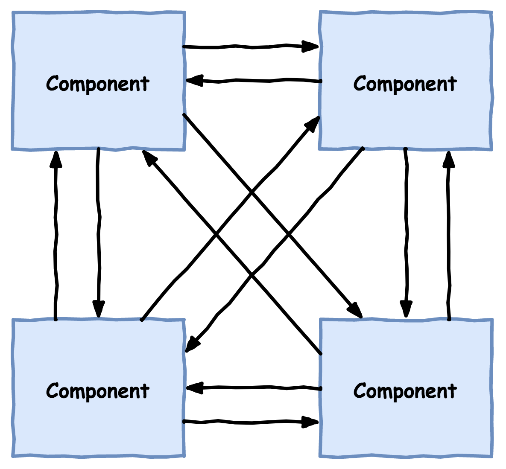

图 8.1 组件之间的通信复杂性随着每个额外组件而增加

``Flux`` 不是库。 你不能去 ``GitHub`` 下载它。 ``Flux`` 是一套指导原则，描述了可扩展的前端架构，足以缓解这一缺陷。它不仅适用于聊天应用，而且适用于任何具有共享状态的组件的复杂 ``UI`` ，例如 ``Vuebnb`` 。

现在让我们探讨一下 ``Flux`` 的指导原则。

原则1——单一的事实来源
---------------------
组件可能只有他们需要了解的本地数据。例如，用户列表组件中滚动条的位置可能对其他组件不感兴趣：

.. code-block:: js

    Vue.component('user-list', {
      data() {
        scrollPos: ...
      }
    });

但是，要在组件之间共享的任何数据（例如应用程序数据）都需要保存在一个位置，与使用它的组件分开。 这个位置被称为 ``store`` 。组件必须从此位置读取应用程序数据，而不是保留自己的副本以防止冲突或分歧：

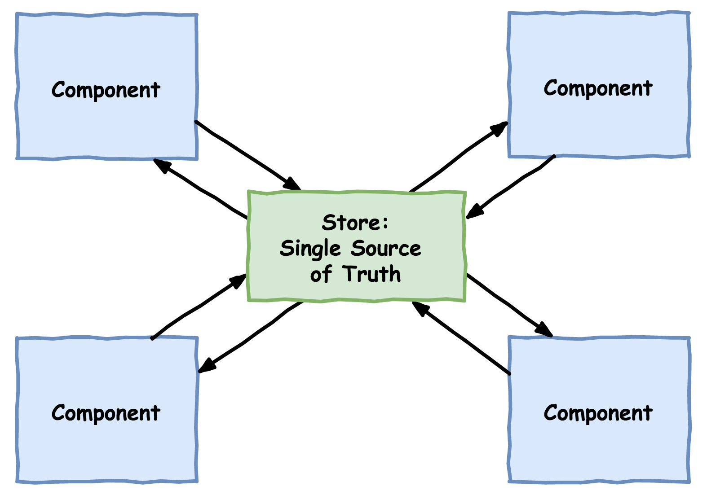

图8.2 集中数据简化了应用程序状态

原则2——数据仅可读
-----------------
组件可以从 ``store`` 中自由读取数据。 但他们无法改变 ``store`` 中的数据，至少不能直接改变。

相反，他们必须通知 ``store`` 他们改变数据的意图， ``store`` 将负责通过一组称为 ``mutator`` 方法的定义函数进行更改。

为什么这种做法？如果我们集中数据更改逻辑，那么就不存在数据不一致的问题。我们正在尽量减少某些随机组件（可能在第三方模块中）以意想不到的方式更改数据的可能性：

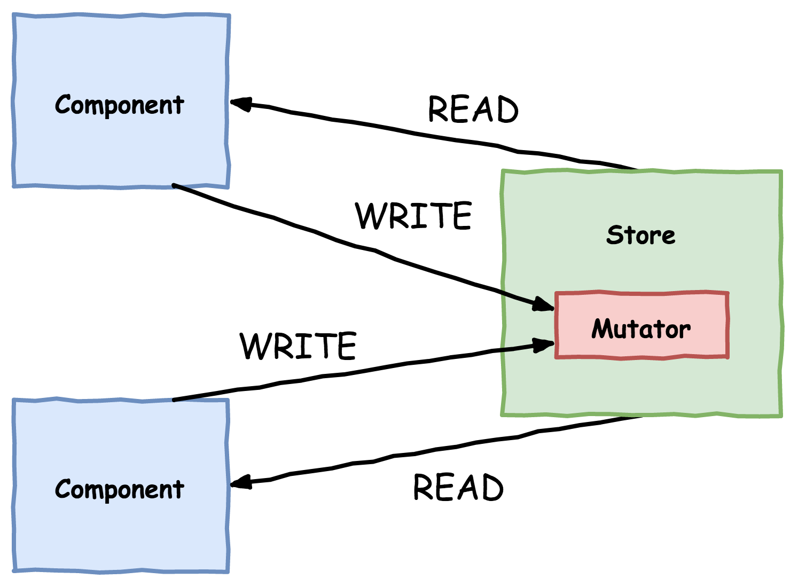

图8.3 状态是只读的 Mutator 方法用于写入 store

原则3——突变(Mutations)是同步的
------------------------------
调试在其体系结构中实现上述两个原则的应用程序中的状态不一致要容易得多。您可以记录提交并观察状态如何响应变化（这将自动发生在 Vue Devtools 中）。

但是如果我们的突变是异步应用的话，这种能力就会受到破坏。我们知道我们的提交顺序，但我们不知道我们的组件提交它们的顺序。同步突变确保状态不依赖于不可预测事件的序列和时间。

Vuex
====
``Vuex`` （通常发音为 ``veweks`` ）是 ``Flux`` 架构的官方 ``Vue.js`` 实现。通过实施前面描述的原则， ``Vuex`` 可以使您的应用程序数据保持透明和可预测的状态，即使这些数据是在许多组件之间共享的。

``Vuex`` 包含一个具有 ``state`` 和 ``mutator`` 方法的 ``store`` ，并将反应性地更新从 ``store`` 读取数据的任何组件。 它还允许方便的开发功能，如热模块重新加载（更新正在运行的应用程序中的模块）和时间旅行调试（通过突变来回溯跟踪错误）。

在本章中，我们将为 ``Vuebnb`` 列表添加一个保存功能，以便用户可以跟踪他们最喜欢的列表。与我们的应用程序中的其他数据不同，保存的状态必须在跨多个页面中保持不变；例如，当用户从一个页面更改为另一个页面时，应用程序必须记住用户已保存的项目。我们将使用 ``Vuex`` 来实现这一目标：

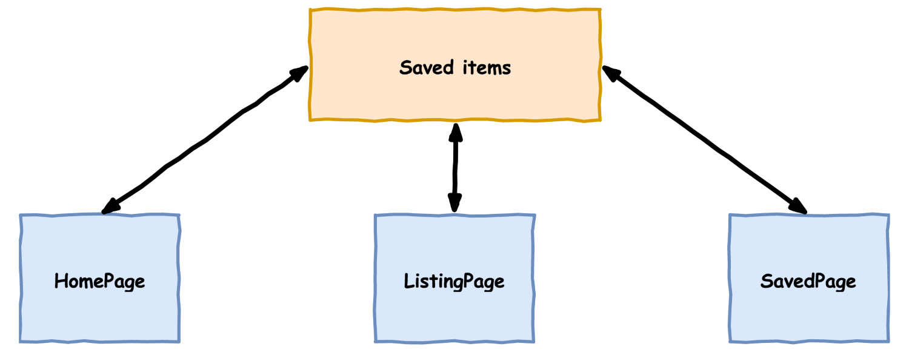

图8.4 保存的状态可用于所有页面组件

安装Vuex
--------
``Vuex`` 是一个 ``NPM`` 包，可以从命令行安装：

.. code-block:: shell

    $ npm i --save-dev vuex

我们将把我们的 ``Vuex`` 配置放到一个新的模块文件 ``store.js`` 中：

.. code-block:: shell

    $ touch resources/assets/js/store.js

我们需要在此文件中导入 ``Vuex`` ，并且像 Vue Router 一样，使用 ``Vue.use`` 安装它。 这为 ``Vue`` 提供了特殊属性，使其与 ``Vuex`` 兼容，例如允许组件通过 ``this.$store`` 访问 ``store`` 。

resources/assets/js/store.js:

.. code-block:: js

    import Vue from 'vue';
    import Vuex from 'vuex';
    Vue.use(Vuex);

    export default new Vuex.Store();

然后，我们将在主应用程序文件中导入 ``store`` 模块，并将其添加到我们的 ``Vue`` 实例中。

resources/assets/js/app.js:

.. code-block:: js

    import router from './router';
    import store from './store';

    var app = new Vue({
      el: '#app',
      render: h => h(App),
      router,
      store
    });

保存功能
========
如上所述，我们将为 ``Vuebnb`` 列表添加 ``save`` 功能。此功能的 ``UI`` 是一个小的可点击图标，覆盖在列表摘要的缩略图图像的右上角。它的行为与复选框类似，允许用户切换任何指定列表项的已保存状态：

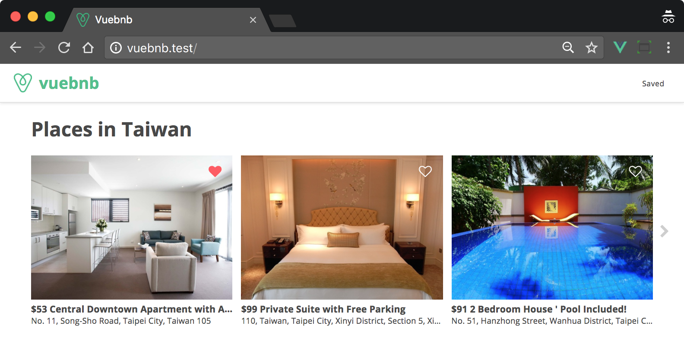

图8.5 列表摘要中显示的保存功能

保存功能也将作为按钮添加到列表项页面的标题图像中：

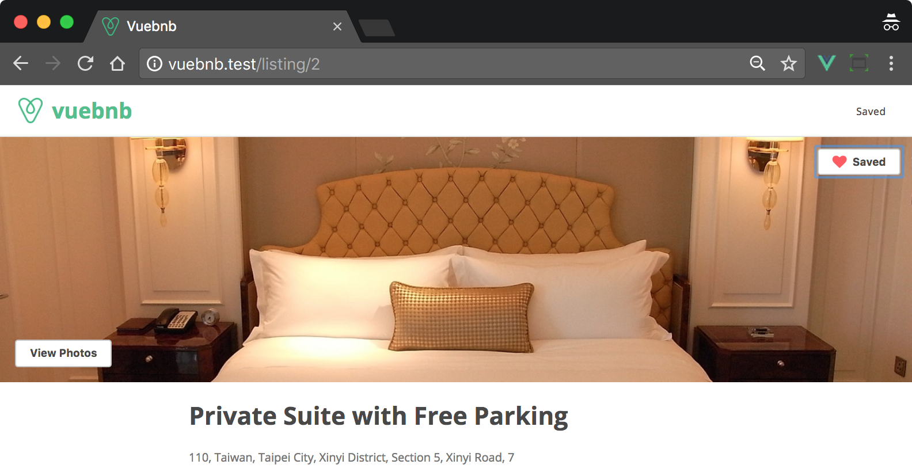

图8.6 列表项页面上显示的保存功能

ListingSave组件
---------------
让我们通过创建新的组件开始：

.. code-block:: shell

    $ touch resources/assets/components/ListingSave.vue

该组件的模板将包含 Font Awesome 心形图标。它还将包含一个单击处理程序，用于切换已保存的状态。由于此组件将始终是列表或列表摘要的子项，因此它将接收列表 ``ID`` 作为插值。该插值将很快用于保存 ``Vuex`` 中的状态。

resources/assets/components/ListingSave.vue:

.. code-block:: html

    <template>
      

        <i class="fa fa-lg fa-heart-o"></i>
      

    </template>
    
    

.. tip:: 请注意，单击处理程序具有 ``stop`` 修饰符。此修饰符可防止 ``click`` 事件冒泡到祖先元素，尤其是可能触发页面更改的任何锚标记！

我们现在将 ``ListingSave`` 添加到 ``ListingSummary`` 组件中。请记住将列表的 ID 作为插值传递。当我们处理它时，让我们在 ``listing-summary`` 类规则中添加 ``position: relative`` ，以便可以绝对定位 ``ListingSave`` 。

resources/assets/components/ListingSummary.vue:

.. code-block:: html

    <template>
      

        <router-link :to="{ name: 'listing', params: {listing: listing.id}}">
            ...
        </router-link>
        <listing-save :id="listing.id"></listing-save>
      

    </template>
    
    

完成后，我们现在将看到每个摘要上呈现的 ``ListingSave`` 心脏图标：

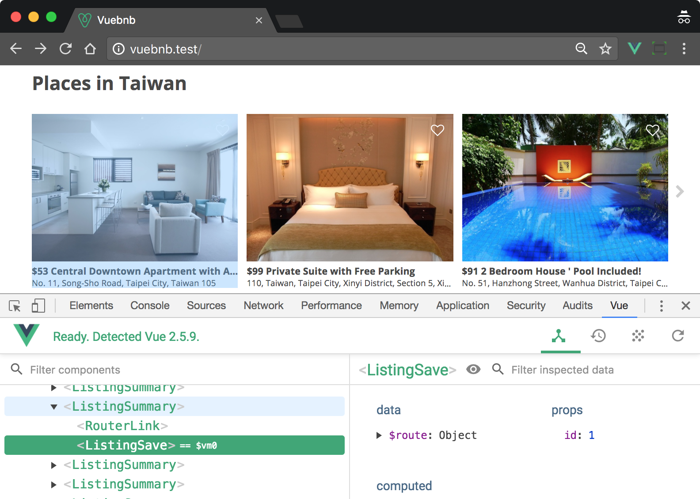

保存状态
--------
``ListingSave`` 组件没有任何本地数据；我们会将所有已保存的列表项信息保存在我们的 ``Vuex store`` 中。为此，我们将在 ``store`` 中创建一个名为 ``saved`` 的数组。每次用户切换列表项的已保存状态时，都会在此数组中添加或删除其 ``ID`` 。

首先，让我们将一个 ``state`` 属性添加到我们的 ``Vuex store`` 。此对象将保存我们希望全局可用于我们应用程序组件的任何数据。我们将 ``saved`` 属性添加到此对象并为其分配一个空数组。

resources/assets/js/store.js:

.. code-block:: js

    export default new Vuex.Store({
      state: {
        saved: []
      }
    });

Mutator方法
-----------
我们在 ``ListingSave`` 组件中为 ``toggleSaved`` 方法创建了 ``stub`` 。此方法应在 ``store`` 中的 ``saved`` 状态中添加或删除商品的 ``ID`` 。 组件可以像 ``this.$store`` 访问 ``store`` 。 更具体地说，可以用 ``this.$store.state.saved`` 访问 ``saved`` 数组。

resources/assets/components/ListingSave.vue:

.. code-block:: js

    methods: {
      toggleSaved() {
        console.log(this.$store.state.saved);
        /* Currently an empty array.
          []
        */
      }
    }

请记住，在 ``Flux`` 架构中，状态是只读的。这意味着我们无法直接修改组件 ``saved`` 的内容。相反，我们必须在 ``store`` 中创建一个 ``mutator`` 方法，为我们进行修改。

让我们在 ``store`` 配置中创建一个 ``mutations`` 属性，并在 ``methods`` 中添加一个函数属性 ``toggleSaved`` 。 Vuex mutator 方法接收两个参数：存储状态和有效负载。此有效负载可以是您希望从组件传递到 ``mutator`` 的任何内容。对于目前的情况，我们将发送列表 ``ID`` 。

``toggleSaved`` 的逻辑是检查列表 ID 是否已经存储在 ``saved`` 数组中，如果是，则删除它，如果没有，则添加它。

resources/assets/js/store.js:

.. code-block:: js

    export default new Vuex.Store({
      state: {
        saved: []
      },
      mutations: {
        toggleSaved(state, id) {
          let index = state.saved.findIndex(saved => saved === id);
          if (index === -1) {
            state.saved.push(id);
          } else {
            state.saved.splice(index, 1);
          }
        }
      }
    });

我们现在需要从 ``ListingSave`` 中提交这个访问器。 ``Commit`` 是 ``Flux`` 行话，与 ``call`` 或 ``trigger`` 同义。提交看起来像一个自定义事件，第一个参数是 ``mutator`` 方法的名称，第二个参数是有效负载。

resources/assets/components/ListingSave.vue:

.. code-block:: js

    export default {
      props: [ 'id' ],
      methods: {
        toggleSaved() {
          this.$store.commit('toggleSaved', this.id);
        }
      }
    }

在 ``store`` 架构中使用 ``mutator`` 方法的要点是状态一致地改变。但还有一个好处：我们可以轻松记录这些更改以进行调试。如果在单击其中一个保存按钮后检查 Vue Devtools 中的 ``Vuex`` 选项卡，您将看到该突变的条目：

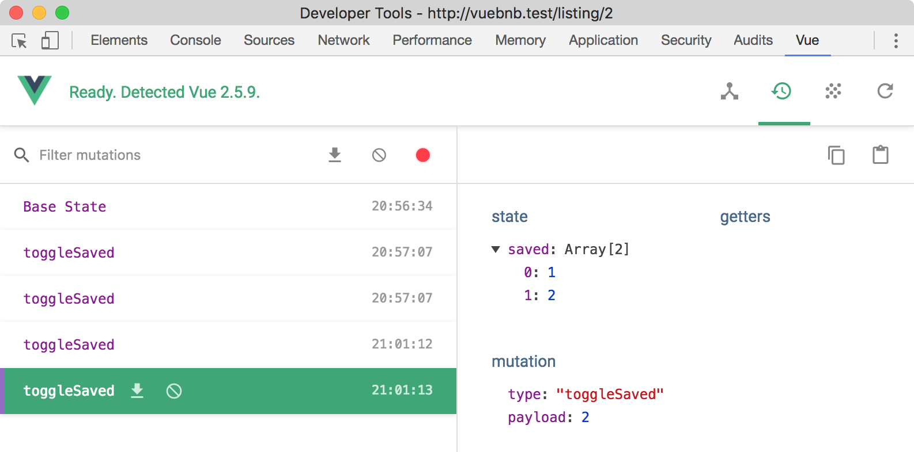

日志中的每个条目都可以告诉您更改提交后的状态，以及变异的详细信息。

.. tip:: 如果双击已记录的变异，Vue Devtools 会将应用程序的状态恢复为更改后的状态。 这称为时间旅行调试，可用于细粒度调试。

改变icon来反映状态
------------------
我们的 ListingSave 组件的图标将以不同的方式显示，具体取决于是否保存了列表项；如果列表项被保存，心形图标它将是不透明的，如果不是，则它是透明的。由于组件不在本地存储其状态，因此我们需要从存储中检索状态以实现此功能。

通常应通过计算属性检索 ``Vuex`` 存储状态。这可以确保组件不保留自己的副本，这将违反单一的事实原则，并且当该组件或其他组件突变状态时，组件将被重新渲染。 ``Vuex`` 状态是反应性运行的！

让我们创建一个计算属性 ``isListingSaved`` ，它将返回一个布尔值，反映该特定列表项是否已保存。

resources/assets/components/ListingSave.vue:

.. code-block:: js

    export default {
      props: [ 'id' ],
      methods: {
        toggleSaved() {
          this.$store.commit('toggleSaved', this.id);
        }
      },
      computed: {
        isListingSaved() {
          return this.$store.state.saved.find(saved => saved === this.id);
        }
      }
    }

我们现在可以使用此计算属性来更改图标。目前我们正在使用 Font Awesome 图标 ``fa-heart-o`` 。 这应该代表 ``unsaved`` 的状态。保存列表后，我们应该使用图标 ``fa-heart`` 。 我们可以使用动态类绑定来实现它。

resources/assets/components/ListingSave.vue:

.. code-block:: html

    <template>
      

        <i :class="classes"></i>
      

    </template>
    
    

现在，用户可以直观地识别哪些列表已被保存，哪些列表尚未保存。由于反应性 ``Vuex`` 数据，当从应用程序中的任何位置更改 ``saved`` 状态时，图标将立即更新：

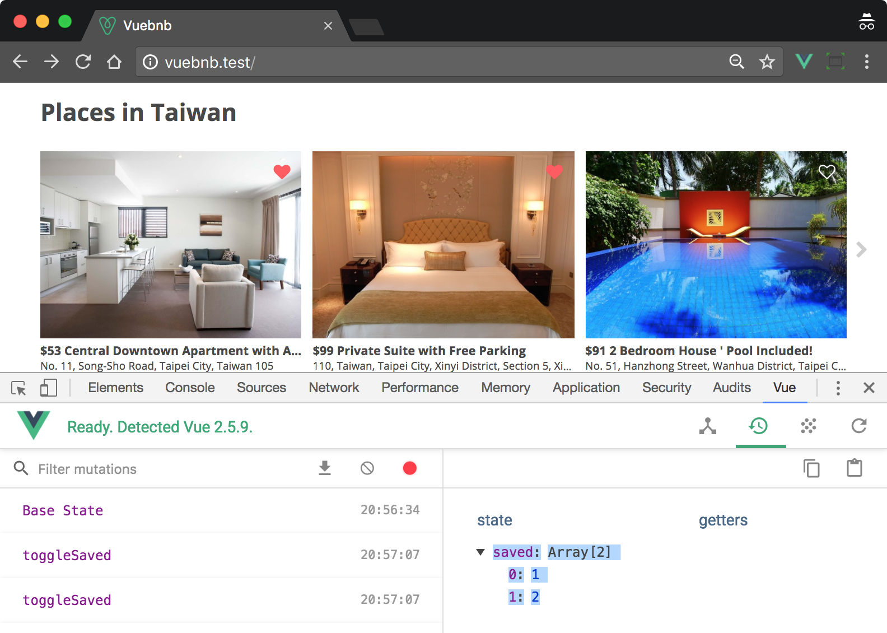

增加到ListingPage
-----------------
我们还希望保存功能显示在列表页面上。它将与 View Photos 按钮一起放在 HeaderImage 组件内部，这样，与列表摘要一样，按钮会覆盖在列表的主图像上。

resources/assets/components/HeaderImage.vue:

.. code-block:: html

    <template>
      

        

          <listing-save :id="id"></listing-save>
          <button class="view-photos">View Photos</button>
        

      

    </template>
    
    

请注意， ``HeaderImage`` 在其范围内没有列表 ``ID`` ，因此我们必须将它作为来自 ``ListingPage`` 的 ``prop`` 传递。 ``id`` 当前不是 ``ListingPage`` 的数据属性，但是，如果我们声明它，它将工作。

这是因为 ``ID`` 已经是组件接收的初始状态/ AJAX数据的属性，因此当路由器加载组件时， ``id`` 将自动由 ``Object.assign`` 填充。

resources/assets/components/ListingPage.vue:

.. code-block:: html

    <template>
      

        <header-image
          v-if="images[0]"
          :image-url="images[0]"
          @header-clicked="openModal"
          :id="id"
        ></header-image>
        ...
      

    </template>
    
    

完成后，保存功能现在将显示在列表页面上：

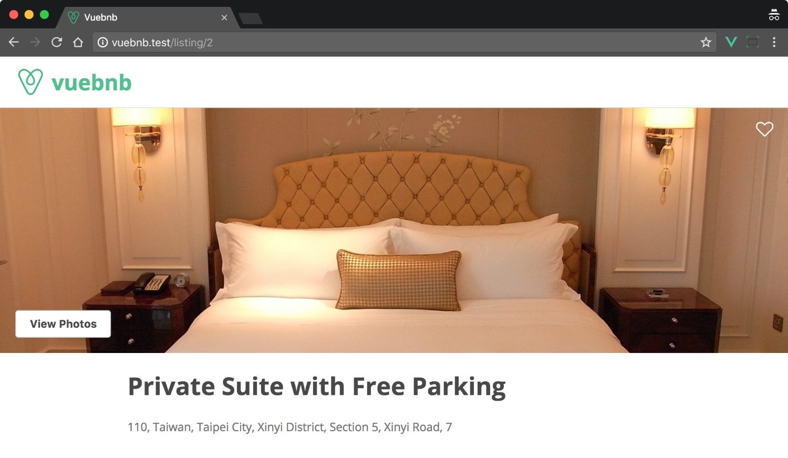

.. tip:: 如果您通过列表项页面保存列表项，然后返回主页，将保存等效的列表摘要。 这是因为我们的 ``Vuex`` 状态是全局的，并且会在页面更改后保持不变（尽管还有没有页面刷新...）。

创建ListingSave按钮
^^^^^^^^^^^^^^^^^^^
实际上， ``ListingSave`` 功能在列表页面标题中显得太小，很容易被用户忽略。 让它成为一个合适的按钮，类似于标题左下角的 View Photos 按钮。

为此，我们将修改 ``ListingSave`` 以允许父组件发送 ``button`` 插值。此布尔插值将指示组件是否应包含围绕图标的按钮元素。

此按钮的文本将是 ``message`` 计算属性，根据 ``isListingSaved`` 的值，该消息将从 ``Save`` 更改为 ``Saved`` 。

resources/assets/components/ListingSave.vue:

.. code-block:: html

    <template>
      

        <button v-if="button">
          <i :class="classes"></i>
          {{ message }}
        </button>
        <i v-else :class="classes"></i>
      

    </template>
    
    

我们现在将在 ``HeaderImage`` 中将 ``button`` 插值设置为 ``true`` 。尽管该值不是动态的，但我们使用 ``v-bind`` 来确保将值解释为 ``JavaScript`` 值，而不是字符串。

resources/assets/components/HeaderImage.vue:

.. code-block:: js

    <listing-save :id="id" :button="true"></listing-save>

有了它， ``ListingSave`` 将在我们的列表页面上显示为一个按钮：

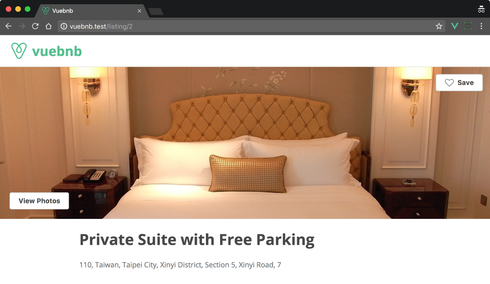

移动页面状态到store
===================
既然用户可以保存他们喜欢的任何列表项，我们将需要一个保存项的列表页面，他们可以一起查看这些已保存的列表。我们将很快构建这个新页面，它看起来像这样：

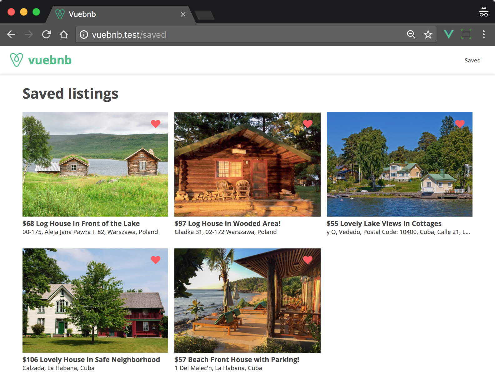

但是，实现保存项的列表页面需要增强我们的应用程序架构。让我们快速回顾一下如何从服务器检索数据以了解原因。

我们的应用程序中的所有页面都需要服务器上的路由才能返回视图。该视图包括文档头中内联的相关页面组件的数据。或者，如果我们通过应用内链接导航到该页面，则 ``API`` 端点将提供相同的数据。我们在第7章使用 ``Vue`` 路由器构建多页面应用程序中设置了这种机制。

保存的页面将需要与主页相同的数据（列表摘要数据），因为保存的页面实际上只是主页上的略微变化。因此，在主页和已保存页面之间共享数据是有意义的。换句话说，如果用户从主页加载 ``Vuebnb`` ，然后导航到保存的页面，反之亦然，则多次加载列表摘要数据将是浪费。

让我们将页面状态从页面组件分离出来，然后将其移动到 ``Vuex`` 中。这样它可以被任何页面需要使用它，并避免不必要的重新加载：

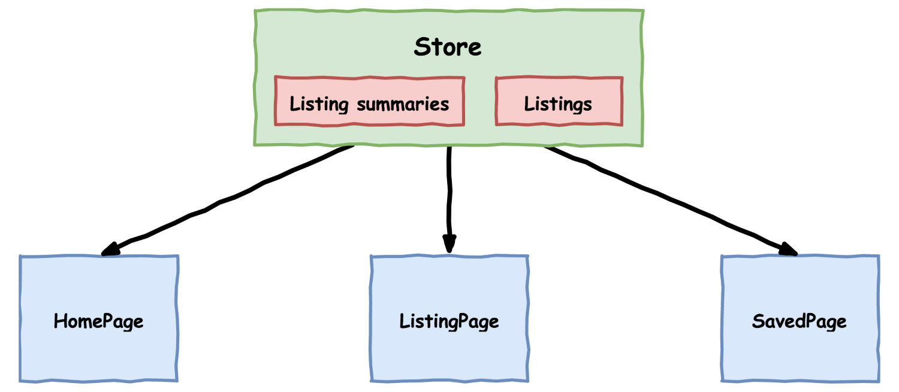

State和mutator方法
------------------
让我们为 ``Vuex store`` 添加两个新的状态属性： ``listing`` 和 ``listing_summaries`` 。这些将是分别存储我们的列表项和列表摘要的数组。首次加载页面时，或者路径更改并调用 ``API`` 时，加载的数据将被放入这些数组中，而不是直接分配给页面组件。页面组件将改为从 ``store`` 中检索此数据。

我们还将添加一个 ``mutator`` 方法 ``addData`` ，用于填充这些数组。它将接受具有两个属性的有效负载对象： ``route`` 和 ``data`` 。 ``route`` 是路由的名称，例如 ``listing`` ， ``home`` 等。 ``data`` 是从文档头或 ``API`` 检索的列表或列表摘要数据。

resources/assets/js/store.js:

.. code-block:: js

    import Vue from 'vue';
    import Vuex from 'vuex';
    Vue.use(Vuex);

    export default new Vuex.Store({
      state: {
        saved: [],
        listing_summaries: [],
        listings: []
      },
      mutations: {
        toggleSaved(state, id) { ... },
        addData(state, { route, data }) {
          if (route === 'listing') {
            state.listings.push(data.listing);
          } else {
            state.listing_summaries = data.listings;
          }
        }
      }
    });

Router
------
检索页面状态的逻辑位于 ``mixin`` 文件 ``route-mixin.js`` 中。此 ``mixin`` 将一个 ``beforeRouteEnter`` 挂钩添加到页面组件，该页面组件在可用时将页面状态应用于组件实例。

现在我们将页面状态存储在 ``Vuex`` 中，我们将使用不同的方法。首先，我们不再需要 ``mixin`` 了；我们现在将这个逻辑放入 ``router.js`` 。其次，我们将使用不同的导航防护装置 ``beforeEach`` 。这不是组件钩子，而是可以应用于路由器本身的钩子，它在每次导航之前触发。

你可以在下面的代码块中看到我是如何在 ``router.js`` 中实现它的。请注意，在调用 ``next()`` 之前，我们将页面状态提交给 ``store`` 。

resources/assets/js/router.js:

.. code-block:: js

    import axios from 'axios';
    import store from './store';

    let router = new VueRouter({
      ...
    });

    router.beforeEach((to, from, next) => {
      let serverData = JSON.parse(window.vuebnb_server_data);
      if (!serverData.path || to.path !== serverData.path) {
        axios.get(`/api${to.path}`).then(({data}) => {
          store.commit('addData', {route: to.name, data});
          next();
        });
      }
      else {
        store.commit('addData', {route: to.name, data: serverData});
        next();
      }
    });

    export default router;

完成后，我们现在可以删除路由 ``mixin`` ：

.. code-block:: shell

    $ rm resources/assets/js/route-mixin.js

从Vuex检索页面状态
------------------
现在我们已经将页面状态移动到 ``Vuex`` 中，我们需要修改页面组件以检索它。从 ``ListingPage`` 开始，我们必须做的更改是：

- 删除本地数据属性。
- 添加计算属性 ``listing`` 。 这将根据路由从 ``store`` 中找到正确的列表数据。
- 删除 ``mixin`` 。
- 更改模板变量，使其成为 ``listing`` 的属性：示例为 ``{{title}}`` ，将成为 ``{{listing.title}}`` 。不幸的是，所有变量现在都是 ``listing`` 的属性，这使得我们的模板稍微冗长一些。

resources/assets/components/ListingPage.vue:

.. code-block:: html

    <template>
      

        <header-image
          v-if="listing.images[0]"
          :image-url="listing.images[0]"
          @header-clicked="openModal"
          :id="listing.id"
        ></header-image>
        

          

            <h1>{{ listing.title }}</h1>
            
{{ listing.address }}

          

          

          

            <h3>About this listing</h3>
            <expandable-text>{{ listing.about }}</expandable-text>
          

          

            <feature-list title="Amenities" :items="listing.amenities">
              ...
            </feature-list>
            <feature-list title="Prices" :items="listing.prices">
              ...
            </feature-list>
          

        

        <modal-window ref="imagemodal">
          <image-carousel :images="listing.images"></image-carousel>
        </modal-window>
      

    </template>
    

对 ``HomePage`` 的更改要简单得多；只需删除 ``mixin`` 和本地状态，并将其替换为计算属性 ``listing_groups`` ，它将从 ``store`` 中检索所有列表摘要。

resources/assets/components/HomePage.vue:

.. code-block:: js

    export default {
      computed: {
        listing_groups() {
          return groupByCountry(this.$store.state.listing_summaries);
        }
      },
      components: { ... }
    }

进行这些更改后，重新加载应用程序，您应该看到行为没有明显变化。但是，检查 Vue Devtools 的 ``Vuex`` 选项卡，您将看到页面数据现在位于 ``store`` 中：

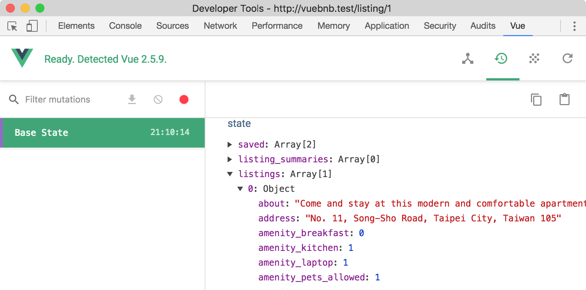

Getters
-------
有时我们想从 ``store`` 获得的不是直接值，而是衍生值。例如，假设我们只想获得用户保存的那些列表摘要。 为此，我们可以定义一个 ``getter`` ，它相当于 ``store`` 的计算属性：

.. code-block:: js

    state: {
      saved: [5, 10],
      listing_summaries: [ ... ]
    },
    getters: {
      savedSummaries(state) {
        return state.listing_summaries.filter(
          item => state.saved.indexOf(item.id) > -1
        );
      }
    }

现在，任何需要 ``getter`` 数据的组件都可以从 ``store`` 中检索它，如下所示：

.. code-block:: js

    console.log(this.$store.state.getters.savedSummaries);

    /*
    [
      5 => [ ... ],
      10 => [ ... ]
    ]
    */

通常，在多个组件需要相同的派生值时定义一个 ``getter`` ，以重构重复的代码。让我们创建一个检索特定列表的 ``getter`` 。 我们已经在 ``ListingPage`` 中创建了这个功能，但由于我们在路由器中也需要它，我们将把它重构为 ``getter`` 。

关于 ``getter`` 的一件事是他们不接受像 ``mutations`` 一样的有效载荷参数。如果要将值传递给 ``getter`` ，则需要返回一个函数，其中 ``payload`` 是该函数的参数。

resources/assets/js/router.js:

.. code-block:: js

    getters: {
      getListing(state) {
        return id => state.listings.find(listing => id == listing.id);
      }
    }

现在让我们在 ``ListPage`` 中使用这个 ``getter`` 来替换以前的逻辑。

resources/assets/components/ListingPage.vue:

.. code-block:: js

    computed: {
      listing() {
        return populateAmenitiesAndPrices(
          this.$store.getters.getListing(this.$route.params.listing)
        );
      }
    }

检查页面状态是否在store中
-------------------------
我们已成功将页面状态移动到 ``store`` 中。现在在导航防护中，我们将检查是否已存储页面所需的数据，以避免两次检索相同的数据：

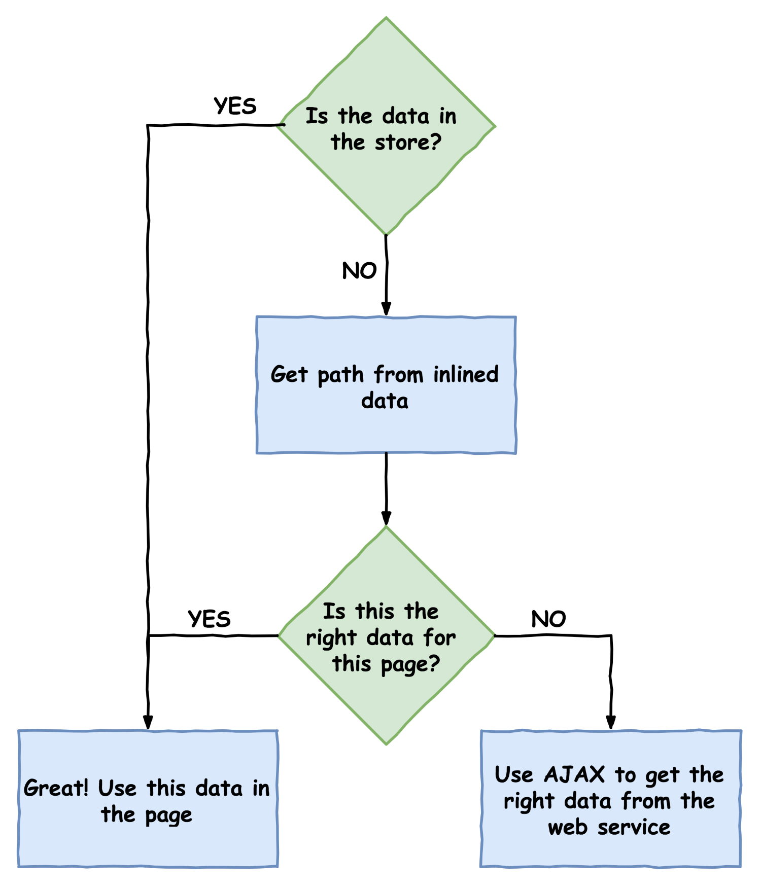

图8.15 获取页面数据的决策逻辑

让我们在 ``router.js`` 的 ``beforeEach`` 钩子中实现这个逻辑。我们将在开始时添加一个 ``if`` 块，如果数据已存在，将立即解析钩子。 ``if`` 使用具有以下逻辑的三元函数：

- 如果路由名称是 ``listing`` ，请使用 ``getListing`` getter 查看该指定的列表是否可用（如果不是，则此 ``getter`` 返回 ``undefined`` ）。
- 如果路线名称不是 ``listing`` ，请检查 ``store`` 是否有可用的列表摘要。列表摘要总是一次性检索，所以如果至少存在一个，你可以假设它们都在那里。

resources/assets/js/router.js:

.. code-block:: js

    router.beforeEach((to, from, next) => {
      let serverData = JSON.parse(window.vuebnb_server_data);
      if (
        to.name === 'listing'
          ? store.getters.getListing(to.params.listing)
          : store.state.listing_summaries.length > 0
      ) {
        next();
      }
      else if (!serverData.path || to.path !== serverData.path) {
        axios.get(`/api${to.path}`).then(({data}) => {
          store.commit('addData', {route: to.name, data});
          next();
        });

      }
      else {
        store.commit('addData', {route: to.name, data: serverData});
        next();
      }
    });

完成后，如果应用程序内导航用于从主页导航到列表1，然后返回主页，然后返回到列表1，应用程序将仅从API检索列表1 一次。在之前的架构下它会检索两次！

保存的列表项页面
================
我们现在将保存的页面添加到 ``Vuebnb`` 。 让我们从创建组件文件开始：

.. code-block:: shell

    $ touch resources/assets/components/SavedPage.vue

接下来，我们将在路径 ``/saved`` 时创建一个包含此组件的新路由。

resources/assets/js/router.js:

.. code-block:: js

    ...

    import SavedPage from '../components/SavedPage.vue';

    let router = new VueRouter({
      ...
      routes: [
        ...
        { path: '/saved', component: SavedPage, name: 'saved' }
      ]
    });

我们还将一些服务器端路由添加到 Laravel 项目中。如上所述，保存的页面使用与主页完全相同的数据。这意味着我们可以调用用于主页的相同控制器方法。

routes/web.php:

.. code-block:: php

    <?php
    Route::get('/saved', 'ListingController@get_home_web');

routes/api.php:

.. code-block:: php

    <?php
    Route::get('/saved', 'ListingController@get_home_api');

现在我们将定义 ``SavedPage`` 组件。 从脚本标记开始，我们将导入我们在第6章使用 Vue.js 组件构建小部件时创建的 ``ListingSummary`` 组件。我们还将创建一个 ``listings`` 计算属性，它将从 ``store`` 返回列表摘要，并根据它们是否已保存进行过滤。

resources/assets/components/SavedPage.vue:

.. code-block:: html

    <template></template>
    
    

接下来，我们将添加到 ``SavedPage`` 的模板标记。主要内容包括检查由 ``listing`` 计算属性返回的数组的长度。 如果为 0 ，则尚未保存任何项目。在这种情况下，我们会显示一条消息来通知用户。但是，如果保存了列表，我们将遍历它们并使用 ``ListingSummary`` 组件显示它们。

resources/assets/components/SavedPage.vue:

.. code-block:: html

    <template>
      

        <h2>Saved listings</h2>
        

          <listing-summary
            v-for="listing in listings"
            :listing="listing"
            :key="listing.id"
          ></listing-summary>
        

        
No saved listings.

      

    </template>
    
    

最后，我们将添加样式标记。这里要注意的主要是我们正在使用 ``flex-wrap:wrap`` 规则并向左对齐。这可以确保我们的列表摘要能够无差别地按行组织。

resources/assets/components/SavedPage.vue:

.. code-block:: html

    <template>...</template>
    
    

我们还在我们的全局 ``CSS`` 文件中添加 ``.saved-container`` CSS规则。这可以确保我们的自定义页脚也可以访问这些规则。

resources/assets/css/style.css:

.. code-block:: css

    .saved-container {
      margin: 0 auto;
      padding: 0 25px;
    }

    @media (min-width: 1131px) {
      .saved-container {
        width: 1095px;
        padding-left: 40px;
        margin-bottom: -10px;
      }
    }

最后的任务是将一些默认保存的列表添加到 ``store`` 。我随机选择了1和15，但你可以添加你想要的任何东西。当我们使用 Laravel 将保存的列表项保存到数据库时，我们将在下一章中再次删除它们。

resources/assets/js/store.js:

.. code-block:: js

    state: {
      saved: [1, 15],
      ...
    },

完成后，这是我们保存的页面的样子：

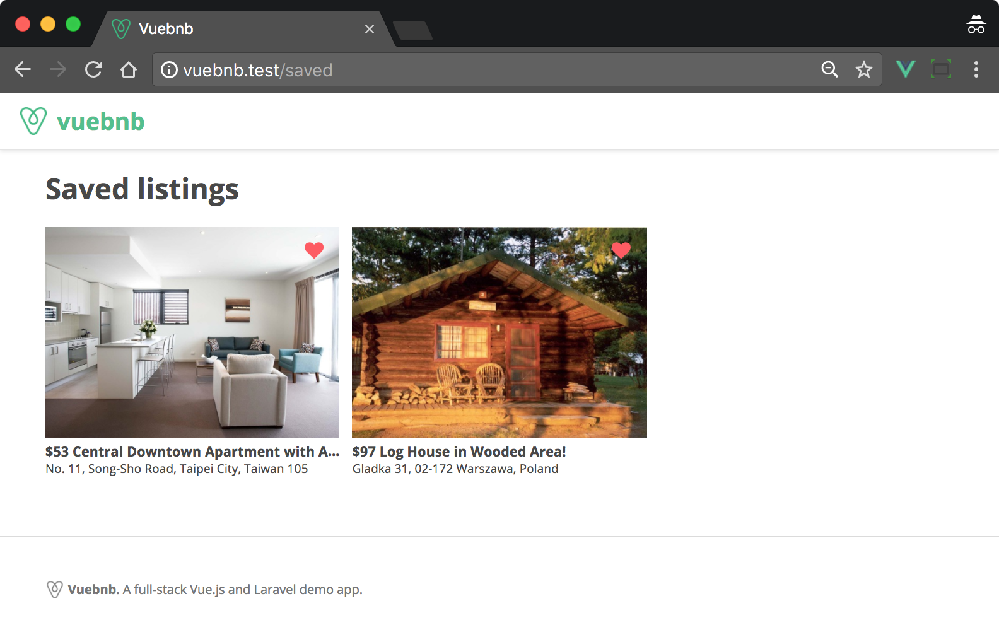

如果我们删除所有已保存的商家信息，我们会看到以下内容：

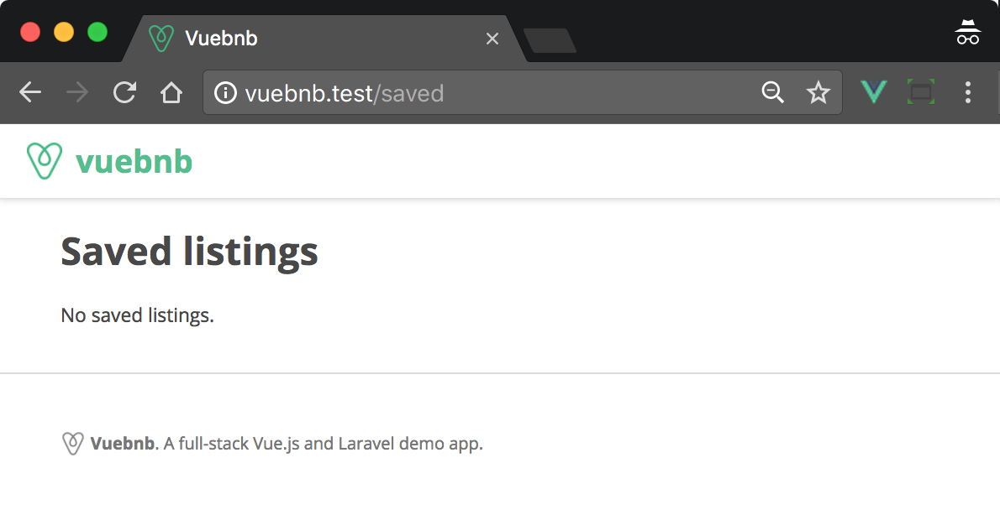

工具栏链接
----------
我们在本章中要做的最后一件事是在工具栏中添加指向已保存页面的链接，以便可以从任何其他页面访问已保存的页面。为此，我们将添加一个内联 ``ul`` ，其中链接包含在子 ``li`` 中（我们将在第9章“使用 ``Passport`` 添加用户登录和 ``API`` 身份验证”中添加更多指向工具栏的链接）。

resources/assets/components/App.vue:

.. code-block:: html

    

      <router-link :to="{ name: 'home' }">
        
        <h1>vuebnb</h1>
      </router-link>
      <ul class="links">
        <li>
          <router-link :to="{ name: 'saved' }">Saved</router-link>
        </li>
      </ul>
    

要正确显示，我们必须添加一些额外的 ``CSS`` 。首先，我们将修改 ``#toolbar`` 声明，以便工具栏使用 ``flex`` 进行显示。我们还将在下面添加一些用于显示链接的新规则。

resources/assets/components/App.vue:

.. code-block:: html

    

我们现在有一个指向工具栏中已保存页面的链接：

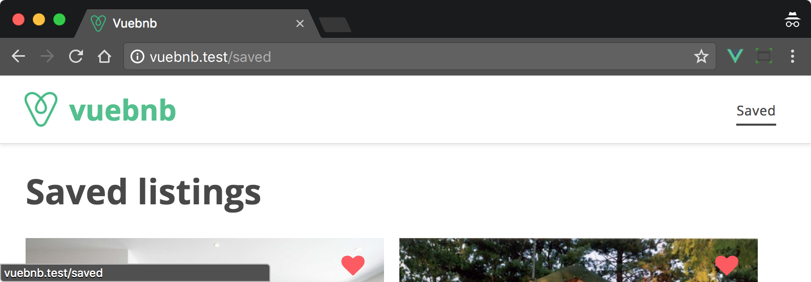

总结
====
在本章中，我们了解了 ``Vue`` 的官方状态管理库 ``Vuex`` ，该库基于 ``Flux`` 架构。我们在 ``Vuebnb`` 中安装了 ``Vuex`` 并建立了一个可以编写和检索全局状态的 ``store`` 。

然后我们学习了 ``Vuex`` 的主要功能，包括 ``state`` ， ``mutator`` 方法和 ``getter`` ，以及我们如何使用 Vue Devtools 调试 ``Vuex`` 。我们使用这些知识来实现列表保存组件，然后我们将其添加到主页中。

最后，我们与 Vuex 和 Vue Router 结合使用，以便在路由更改时更有效地存储和检索页面状态。

在下一章中，我们将介绍全栈应用程序中最棘手的主题之一 - 身份验证。我们将向 ``Vuebnb`` 添加用户信息文件，以便用户可以将 ``saved`` 项目持久化到数据库中。我们还将继续利用其一些更高级的功能来增加我们对 ``Vuex`` 的了解。

