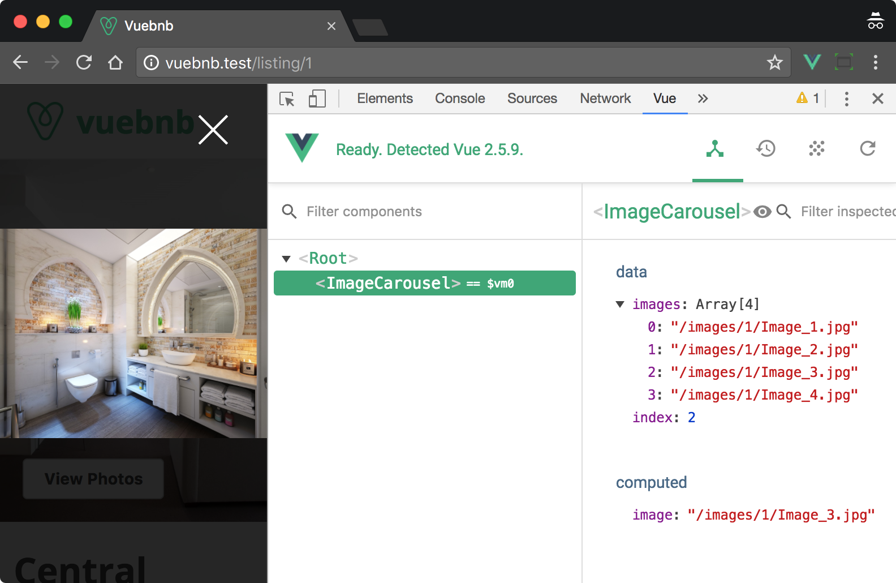
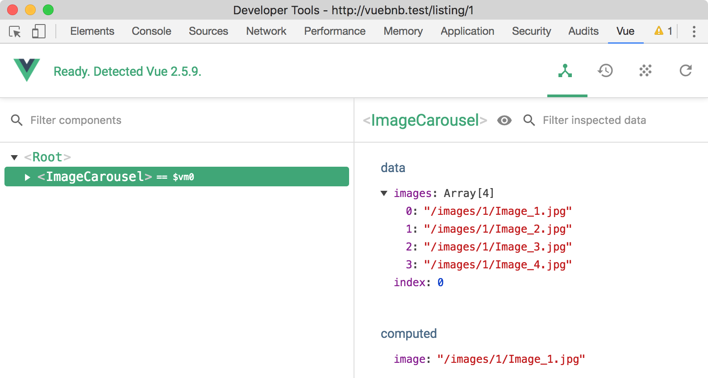
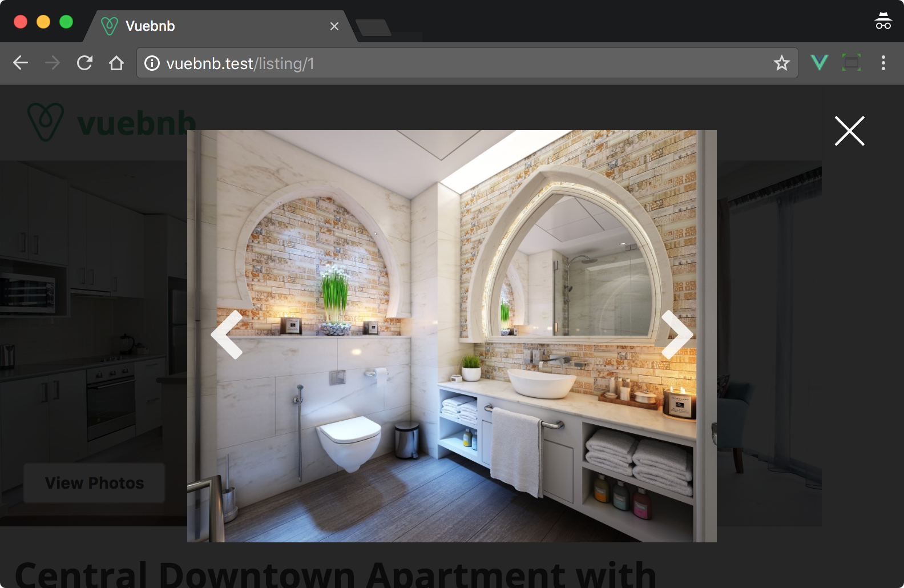
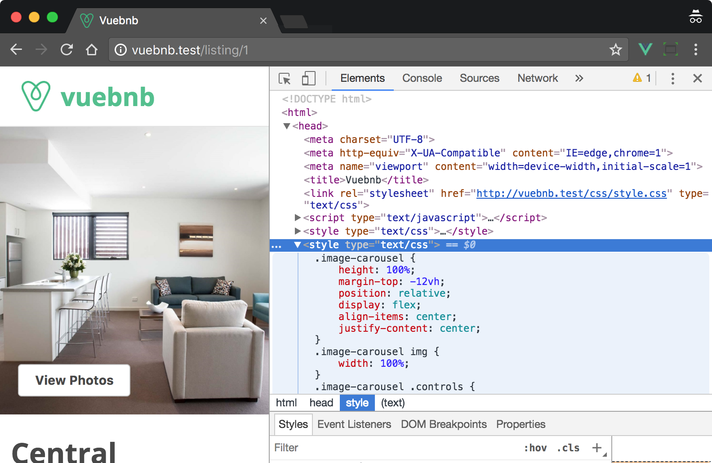
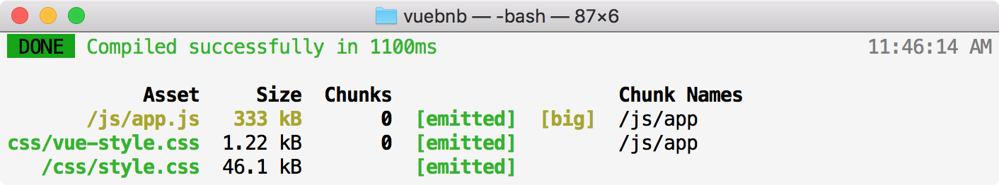
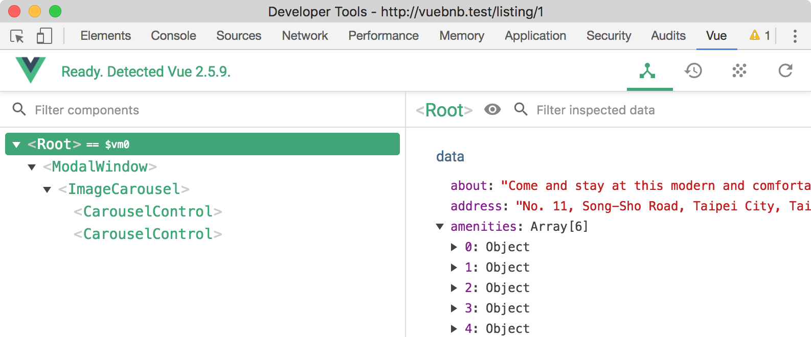
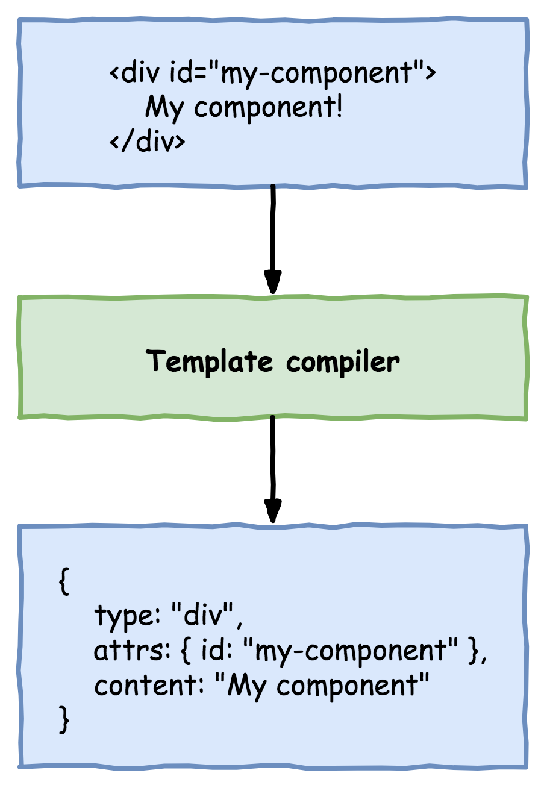

*************
使用Vue组件来组合小部件
*************

组件正在成为前端开发的一个重要方面，并且是大多数现代前端框架的一个特性，包括 ``Vue`` ， ``React`` ， ``Angular`` ， ``Polymer`` 等等。 组件甚至通过称为 ``Web`` 组件的新标准成为 ``Web`` 本地。

在本章中，我们将使用组件为 ``Vuebnb`` 创建一个图像传送带，它允许用户细读房间列表的不同照片。 我们还会重构 ``Vuebnb`` 以符合基于组件的体系结构。

本章涵盖的主题：

- 什么组件以及如何使用 ``Vue.js`` 创建它们；
- 通过 ``props`` 和事件进行组件沟通；
- 单文件组件 ``Vue`` 最有用的功能之一；
- 将自定义内容添加到带插槽的组件；
- 完全从组件构建应用程序的好处；
- 如何使用渲染函数来跳过模板编译器；
- 使用 ``Vue`` 的仅运行时版本来减轻包的大小；

组件
====
当我们为 ``Web`` 应用程序构建模板时，我们可以使用 ``HTML`` 元素，例如 ``div`` ， ``table`` 和 ``span`` 。 这些元素的种类很容易创建我们需要的任何结构来组织页面上的内容。

如果我们可以通过例如 ``my-element`` 创建自己的自定义元素呢？ 这将允许我们创建专门为我们的应用程序设计的可重用结构。

组件是用于在 ``Vue.js`` 中创建自定义元素的工具。 当我们注册一个组件时，我们定义了一个呈现为一个或多个标准 ``HTML`` 元素的模板：

.. figure:: ./images/6-1.png

   图6.1 组件便于可重用的标记并作为标准HTML呈现

注册
----
注册组件有很多方法，但最简单的方法是使用组件 ``API`` 方法。 第一个参数是要给组件的名称，第二个参数是配置对象。 配置对象通常会包含一个 ``template`` 属性来使用字符串声明组件的标记：

.. code-block:: js

    Vue.component('my-component', {
      template: '<div>My component!</div>'
    });

    new Vue({
      el: '#app'
    });

一旦我们注册了这样的组件，我们就可以在我们的项目中使用它：

.. code-block:: html

    <div id="app">
      <my-component></my-component>
      <!-- Renders as <div>My component!</div> -->
    </div>

数据
----
除了可重用的标记之外，组件还允许我们重用 ``JavaScript`` 功能。 配置对象不仅可以包含模板，还可以包含自己的状态，就像 ``Vue`` 实例一样。 实际上，每个组件都可以被认为是 ``Vue`` 的一个小实例，具有自己的数据，方法，生命周期钩子等等。

因为组件数据可以重复使用，但我们将组件数据略微不同于Vue实例中的数据。 例如，我们可能会创建一个空的 ``check-box`` 复选框组件，如下所示：

.. code-block:: html

    <div id="app">
      <check-box></check-box>
      <check-box></check-box>
      <check-box></check-box>
    </div>
    <script>
      Vue.component('check-box', {
        template: '<div v-on:click="checked = !checked"></div>'
        data: {
          checked: false
        }
      });
    </script>

就这一点而言，如果用户点击复选框 ``div`` ，则对于每个复选框，选中状态将同时从 ``true`` 切换到 ``false`` ！ 这不是我们想要的，但却会发生，因为组件的所有实例都引用相同的数据对象，因此具有相同的状态。

为了让每个实例具有唯一的状态， ``data`` 属性不应该是一个对象，而是一个返回对象的工厂函数。 这样，每次组件实例化时，它都会链接到一个新的数据对象。 实现这一点很简单：

.. code-block:: js

    data() {
      return {
        checked: false
      }
    }

轮播图片
========
让我们使用组件为 ``Vuebnb`` 前端应用程序构建一个新功能。 从前面的章节可以回忆，我们的每个模拟数据列表都有四个不同的图像，我们将这些 ``URL`` 传递给前端应用程序。

为了让用户仔细阅读这些图像，我们将创建一个图像轮播。 这个轮播将替换当前占用您点击列表标题时弹出的模式窗口的静态图片。

首先打开应用程序视图。 删除静态图像并将其替换为自定义 ``HTML`` 元素 ``image-carousel`` 。

resources/views/app.blade.php:

.. code-block:: html

    <div class="modal-content">
      <image-carousel></image-carousel>
    </div>

.. tip:: 组件可以通过 ``kebab-case`` 命名（如 ``my-component`` ）， ``PascalCase`` 名称（如 ``MyComponent`` ）或 ``camelCase`` 命名（如 ``myComponent`` ）在您的代码中引用。 ``Vue`` 将这些看作是相同的组件。 但是，在 ``DOM`` 或字符串模板中，组件应始终为 ``kebab-cased`` 。 ``Vue`` 不强制执行此操作，但在 ``Vue`` 开始使用它之前，浏览器会对页面中的标记进行解析，因此它应该符合 ``W3C`` 的命名规则，否则解析器可能会删除它。

现在让我们在我们的入口文件中注册组件。 这个新组件的模板将只是我们从视图中移除的图像标签，用 ``div`` 封装。 我们添加这个包装元素，因为组件模板必须有一个根元素，我们很快会在其中添加更多元素。

作为概念证明，组件数据将包含硬编码图像 ``URL`` 数组。 一旦我们学会了如何将数据传递到组件中，我们将删除这些硬编码的 ``URL`` 并将其替换为我们模型中的动态 ``URL`` 。

resources/assets/js/app.js:

.. code-block:: js

    Vue.component('image-carousel', {
      template: `<div class="image-carousel">
                  
                </div>`,
      data() {
        return {
          images: [
            '/images/1/Image_1.jpg',
            '/images/1/Image_2.jpg',
            '/images/1/Image_3.jpg',
            '/images/1/Image_4.jpg'
          ]
        }
      }
    });

    var app = new Vue({
      ...
    });

在测试这个组件之前，让我们对我们的 ``CSS`` 进行一次调整。 我们以前有一个规则，通过使用 ``.modal-content img`` 选择器来确保模式窗口内的图像被拉伸到全宽。让我们使用 ``.image-carousel`` 选择器来实现这个规则，因为我们将图像从模态窗口中解耦出来。

resources/assets/css/style.css:

.. code-block:: css

    .image-carousel img {
      width: 100%;
    }

在代码重建后，浏览器浏览至 ``/listing/1`` ，您应该看到没有区别，因为组件应该以与之前标记完全相同的方式呈现。

但是，如果我们检查 ``Vue Devtools`` ，并打开“组件”选项卡，则会看到我们现在将 ``ImageCarousel`` 组件嵌套在 ``Root`` 实例下面。 选择 ``ImageCarousel`` ，我们甚至可以检查它的状态：

.. figure:: ./images/6-2.png

   图6.2 显示图像轮播组件的Vue Devtools

改变图片
--------
轮播的要点是允许用户浏览图像集合而无需滚动页面。 为了允许这个功能，我们需要创建一些 ``UI`` 控件。

但首先，我们添加一个新的数据属性 ``index`` 到我们的组件，它将指示当前显示的图像。 它将被初始化为 ``0`` ，并且 ``UI`` 控件将稍后能够增加或减少该值。

我们将图像源绑定到位置索引处的数组项。

resources/assets/js/app.js:

.. code-block:: js

    Vue.component('image-carousel', {
      template: `<div class="image-carousel">
                  
                </div>`,
      data() {
        return {
          images: [
            '/images/1/Image_1.jpg',
            '/images/1/Image_2.jpg',
            '/images/1/Image_3.jpg',
            '/images/1/Image_4.jpg'
          ],
          index: 0
        }
      }
    });

页面刷新应该再次显示您在屏幕上看到的内容没有任何变化。 但是，如果将索引的值初始化为 ``1`` , ``2`` 或 ``3`` ，则在重新打开模式窗口时会看到不同的图像：



   图 6.3 设置索引为2 来选择不同的URL，然后显示不同的图片

computed属性
------------
将逻辑直接写入我们的模板作为表达式很方便，例如， ``v-if ="myExpression"`` 。 但是更复杂的逻辑不能被定义为一个表达式，或者简单地变得对模板来说太冗长了？

对于这种情况，我们使用 ``computed`` 属性。这些属性是我们添加到 ``Vue`` 配置中的属性，可以认为这些属性是反应式方法，只要依赖值发生变化就会重新运行。

在以下示例中，我们已经在 ``computed`` 的配置部分下声明了计算属性 ``message`` 。 注意该函数依赖于 ``val`` ，也就是说，随着 ``val`` 更改， ``message`` 的返回值将会不同。

当这个脚本运行时， ``Vue`` 会注意到 ``message`` 的任何依赖关系，并将设置反应性绑定，因此，与常规方法不同，只要依赖性发生变化，函数就会重新运行：

.. code-block:: html

    <script>
      var app = new Vue({
        el: '#app',
        data: {
          val: 1
        },
        computed: {
          message() {
            return `The value is ${this.val}`
          }
        }
      });

      setTimeout(function() {
        app.val = 2;
      }, 2000);
    </script>
    <div id="app">
      <!--Renders as "The value is 1"-->
      <!--After 2 seconds, re-renders as "The value is 2"-->
      {{ message }}
    </div>

回到图像轮播，让我们通过将绑定到图像 ``src`` 的表达式抽象为一个计算属性来使模板变得清晰。

resources/assets/js/app.js:

.. code-block:: js

    Vue.component('image-carousel', {
      template: `<div class="image-carousel">
                  
                </div>`,
      data() { ... },
      computed: {
        image() {
          return this.images[this.index];
        }
      }
    });

组合组件
========
组件可以嵌套在其他组件中，就像标准 ``HTML`` 元素可以嵌套一样。 例如，如果组件 ``A`` 在其模板中声明了组件 ``B`` ，组件 ``B`` 可以是组件 ``A`` 的子组件：

.. code-block:: html

    <div id="app">
      <component-a></component-a>
    </div>
    <script>
      Vue.component('component-a', {
        template: `
          <div>
            <p>Hi I'm component A</p>
            <component-b></component-b>
          </div>`
      });

      Vue.component('component-b', {
        template: `<p>And I'm component B</p>`
      });

      new Vue({
        el: '#app'
      });
    </script>

渲染结果为：

.. code-block:: html

    <div id="app">
      <div>
        <p>Hi I'm component A</p>
        <p>And I'm component B</p>
      </div>
    </div>

组件注册范围
------------
虽然某些组件设计用于应用程序中的任何位置，但其他组件可能会设计为更具体的用途。 当我们使用 ``API`` 注册组件时，即 ``Vue.component`` ，该组件是全局注册的，并且可以在任何其他组件或实例中使用。

我们也可以在组件内部注册一个组件，方法是在根实例或其他组件中声明组件的 ``components`` 选项：

.. code-block:: js

    Vue.component('component-a', {
      template: `
        <div>
          <p>Hi I'm component A</p>
          <component-b></component-b>
        </div>`,
      components: {
        'component-b': {
          template: `<p>And I'm component B</p>`
        }
      }
    });

轮播控件
--------
为了允许用户更改轮播中当前显示的图像，我们创建一个新组件 ``CarouselControl`` 。 该组件将呈现为浮动在轮播上的箭头，并将响应用户的点击。 我们将使用两个实例，因为会有一个左右箭头来减少或增加图像索引。

我们将在 ``ImageCarousel`` 组件内注册 ``CarouselControl`` 。 ``CarouselControl`` 模板将呈现为 ``i`` 标签，通常用于显示图标。 轮播的一个很好的图标是 ``Font Awesome chevron`` 图标，它是一个优雅的箭头形状。 目前，我们没有办法区分左侧和右侧，因此目前这两个实例都有一个左侧的图标。

resources/assets/js/app.js:

.. code-block:: js

    Vue.component('image-carousel', {
      template: `
        <div class="image-carousel">
          
          <div class="controls">
            <carousel-control></carousel-control>
            <carousel-control></carousel-control>
          </div>
        </div>
      `,
      data() { ... },
      computed: { ... },
      components: {
        'carousel-control': {
          template: `<i class="carousel-control fa fa-2x fa-chevron-left"></i>`
        }
      }
    });

为了让这些控件漂浮在我们的图像轮播上，我们也会为我们的 ``CSS`` 文件添加一些新规则。

resources/assets/css/style.css:

.. code-block:: css

    .image-carousel {
      height: 100%;
      margin-top: -12vh;
      position: relative;
      display: flex;
      align-items: center;
      justify-content: center;
    }

    .image-carousel .controls {
      position: absolute;
      width: 100%;
      display: flex;
      justify-content: space-between;
    }

    .carousel-control {
      padding: 1rem;
      color: #ffffff;
      opacity: 0.85
    }

    @media (min-width: 744px) {
      .carousel-control {
          font-size: 3rem;
      }
    }

添加该代码后，打开模式窗口以查看我们迄今为止的手工作业：

.. figure:: ./images/6-4.png

   图6.4 传送带控件添加到图像传送带

组件之间的通信
==============
组件的一个关键方面是它们是可重用的，这就是为什么我们给它们自己的状态以使它们独立于应用程序的其余部分。 但是，我们可能仍然希望发送数据或发送出去。 组件具有用于与应用程序的其他部分进行通信的接口，我们现在将探讨这些接口。

Props
-----
我们可以通过一个称为 ``prop`` 的自定义 ``HTML`` 属性将数据发送到组件。 我们还必须在组件的配置中将这个自定义属性注册为数组，道具。 在下面的例子中，我们创建了一个道具，标题：

.. code-block:: html

    <div id="app">
      <!-- 该title属性不会根据父变量更改而变动 -->
      <my-component title="My component!"></my-component>
      <!-- Renders as <div>My component!</div> -->
    </div>
    <script>
      Vue.component('my-component', {
        template: '<div>{{ title }}</div>',
        props: ['title']
      });

      new Vue({
        el: '#app'
      });
    </script>

可以像使用组件的任何数据属性一样使用 ``prop`` ，您可以在模板中插入它，在 ``methods`` 和 ``computed`` 属性中使用它，依此类推。 但是，你不应该改变 ``prop`` 数据。 将 ``prop`` 数据视为从另一个组件或实例中借用 - 只有所有者能够更改它。

.. tip:: ``props`` 就像数据属性一样代理实例的属性，这意味着您可以在该组件的代码中将 ``this`` 引用为 ``this.myprop`` 。 请务必将您的 ``props`` 唯一地命名为您的数据属性以避免冲突！

单方向数据量
^^^^^^^^^^^^
由于必须在使用组件的模板中声明 ``props`` ，因此道具数据只能从父项传递给子项。 这就是为什么你不应该改变一个 ``prop`` 的原因 - 因为数据流向下，这个改变不会反映在父项中，因此你会得到不同版本的状态。

如果您确实需要告诉该数据的所有者更改数据，那么会有一个独立的接口将数据从一个孩子传递给父母，稍后我们会看到这一点。

动态Props
---------
我们可以使用 ``v-bind`` 指令将数据反应性地绑定到组件。 当父数据发生变化时，数据会自动流向孩子。

在以下示例中，根实例中的 ``title`` 值在两秒后以编程方式更新。 此更改将自动流向 ``MyComponent`` ，它将反应式重新呈现以显示新值：

.. code-block:: html

    <div id="app">
      <my-component :title="title"></my-component>
      <!-- Renders initially as <div>Hello World</div> -->
      <!-- Re-renders after two seconds as <div>Goodbye World</div> -->
    </div>
    <script>
      Vue.component('my-component', {
        template: '<div>{{ title }}</div>',
        props: [ 'title' ]
      });

      var app = new Vue({
        el: '#app',
        data: {
          title: 'Hello World'
        }
      });

      setTimeout(() => {
        app.title = 'Goodbye World'
      }, 2000);
    </script>

.. tip:: 由于模板中常常使用 ``v-bind`` 指令，因此可以省略指令名称作为缩写： ``<div v-bind :title = "title">`` 可以缩写为 ``<div :title = "title">`` 。

图像URLs
--------
当我们创建 ``ImageCarousel`` 时，我们对图片网址进行了硬编码。 使用 ``props`` ，我们现在有一种机制，可以将动态数据从根实例发送到组件。 让我们将根实例数据属性 ``images`` 绑定到 ``ImageCarousel`` 声明中的 ``prop`` 。

resources/views/app.blade.php:

.. code-block:: html

    <div class="modal-content">
      <image-carousel :images="images"></image-carousel>
    </div>

现在，删除 ``ImageCarousel`` 组件中的数据属性 ``images`` ，并将 ``images`` 声明为 ``prop`` 。

resources/assets/js/app.js:

.. code-block:: js

    Vue.component('image-carousel', {
      props: ['images'],
      data() {
        return {
          index: 0
        }
      },
      ...
    }

根实例现在将负责图像 ``URL`` 的状态，图像轮播组件将负责显示它们。

使用 ``Vue Devtools`` ，我们可以检查图像轮播组件的状态，该组件现在包含 ``image``  作为 ``prop`` 值而不是数据值：



   图6.5 图片网址是发送到ImageCarousel组件的props

现在图像 ``URL`` 来自模型，我们可以访问其他列表路由，例如 ``/listing/2`` ，并再次在模式窗口中看到正确的图像显示。

区分轮播控件
------------
``CarouselControl`` 组件应该有两种可能的状态：左箭头或右箭头。 当用户点击时，前者将通过可用图像索引减小，后者将增大。

此状态不应在内部确定，而应从 ``ImageCarousel`` 传递。 为此，让我们向 ``CarouselControl`` 添加一个 ``prop`` ``dir`` ，该变量需要一个字符串值，并且应该是左侧或右侧。

使用 ``dir prop`` ，我们现在可以将正确的图标绑定到 ``i`` 元素。 这是通过计算属性来完成的，该属性将 ``prop`` 的值附加到字符串 ``fa-chevron-`` ，从而生成 ``fa-chevron-left`` 或 ``fa-chevron-right`` 。

resources/assets/js/app.js:

.. code-block:: js

    Vue.component('image-carousel', {
      template: `
        <div class="image-carousel">
          
          <div class="controls">
            <carousel-control dir="left"></carousel-control>
            <carousel-control dir="right"></carousel-control>
          </div>
        </div>
      `,
      ...
      components: {
        'carousel-control': {
          template: `<i :class="classes"></i>`,
          props: [ 'dir' ],
          computed: {
            classes() {
              return 'carousel-control fa fa-2x fa-chevron-' + this.dir;
            }
          }
        }
      }
    }

现在我们可以看到正确导向的轮播控制图标：



   图6.6 轮播控制图标现在正确指示

定制事件
--------
我们的轮播控件显示得很好，但他们仍然没有做任何事情！当它们被点击时，我们需要它们告诉 ``ImageCarousel`` 增加或减少它的索引值，这将导致图像被改变。

动态 ``props`` 不适用于此任务，因为道具只能将数据从父母发送给孩子。当孩子需要将数据发送给父母时，我们该怎么办？

自定义事件可以从子组件发出并由其父节点进行侦听。为了实现这一点，我们在子节点中使用 ``$emit`` 实例方法，该方法将事件名称作为第一个参数，并将任意数据的任意数量的附加参数与事件一起发送，例如 ``this.$emit('my-event'，'My event payload');``

父母可以在声明组件的模板中使用 ``v-on`` 指令来侦听此事件。如果使用方法处理事件，则随事件一起发送的任何参数将作为参数传递给此方法。

考虑这个例子，其中一个子组件 ``MyComponent`` 发出一个名为 ``toggle`` 的事件来告诉父级的根实例改变一个 ``data`` 属性的值 ``toggle`` ：

.. code-block:: html

    <div id="app">
      <my-component @toggle="toggle = !toggle"></my-component>
      {{ message }}
    </div>
    <script>
      Vue.component('my-component', {
        template: '<div v-on:click="clicked">Click me</div>',
        methods: {
          clicked: function() {
            this.$emit('toggle');
          }
        }
      });

      new Vue({
        el: '#app',
        data: {
          toggle: false
        },
        computed: {
          message: function() {
            return this.toggle ? 'On' : 'Off';
          }
        }
      });
    </script>

改变轮播图像
------------
回到 ``CarouselControl`` ，让我们通过使用 ``v-on`` 指令来响应用户的点击并触发一个方法， ``clicked`` 。 此方法将依次发出自定义事件 ``change-image`` ，其中包含 ``-1`` 或 ``1`` 的有效负载，具体取决于组件的状态是 ``left`` 还是 ``right`` 。

.. tip:: 就像 ``v-bind`` 一样， ``v-on`` 也有一个简写。 只需用 ``@`` 替换 ``v-on`` ：即可; 例如， ``<div @click ="handler"></div>`` 相当于 ``<div v-on:click ="handler"></div>`` 。

resources/assets/js/app.js:

.. code-block:: js

    components: {
      'carousel-control': {
        template: `<i :class="classes" @click="clicked"></i>`,
        props: [ 'dir' ],
        computed: {
          classes() {
            return 'carousel-control fa fa-2x fa-chevron-' + this.dir;
          }
        },
        methods: {
          clicked() {
            this.$emit('change-image', this.dir === 'left' ? -1 : 1);
          }
        }
      }
    }

打开 ``Vue Devtools`` 到事件标签，同时点击轮播控件。 自定义事件在这里被记录下来，所以我们可以验证正在发送的 ``change-image`` ：

.. figure:: ./images/6-7.png

   图6.7 屏幕截图显示自定义事件及其有效载荷

``ImageCarousel`` 现在需要通过 ``v-on`` 指令来侦听 ``change-image`` 事件。 该事件将通过 ``changeImage`` 方法处理，该方法将具有单个参数 ``val`` ，以反映在事件中发送的有效载荷。 然后该方法将使用 ``val`` 来逐步索引的值，以确保如果它超出了它索引的数组边界，它就会循环到开始或结束。

resources/assets/js/app.js:

.. code-block:: js

    Vue.component('image-carousel', {
      template: `
        <div class="image-carousel">
          
          <div class="controls">
            <carousel-control
              dir="left"
              @change-image="changeImage"
            ></carousel-control>
            <carousel-control
              dir="right"
              @change-image="changeImage"
            ></carousel-control>
          </div>
        </div>
      `,
      ...
      methods: {
        changeImage(val) {
          let newVal = this.index + parseInt(val);
          if (newVal < 0) {
            this.index = this.images.length -1;
          } else if (newVal === this.images.length) {
            this.index = 0;
          } else {
            this.index = newVal;
          }
        }
      },
      ...
    }

通过这样做，图像轮播现在可以完美工作：

.. figure:: ./images/6-8.png

   图6.8 图像改变后图像轮播的状态

单文件组件
==========
单文件组件（SFCs）是一个带有 ``.vue`` 扩展名的文件，它包含单个组件的完整定义，并且可以导入到您的 ``Vue.js`` 应用程序中。 ``SFCs`` 使创建和使用组件变得非常简单，并带来了我们即将探索的各种其他好处。

``SFCs`` 与 ``HTML`` 文件类似，但最多有三个根元素：

- template；
- script；
- style；

组件定义进入 ``script`` 标签内部，并且与其他组件定义完全相同，除了：

- 将会导出 ``ES`` 模块；
- 不需要 ``template`` 属性(或者一个 ``render`` 函数；稍后会有更多介绍)

组件的模板将在 ``template`` 标签内声明为 ``HTML`` 标记。 这应该是写繁琐的模板字符串的一个很好的解决办法！

``style`` 标签是 ``SFCs`` 特有的功能，可以包含组件需要的任何 ``CSS`` 规则。 这大部分只是帮助您组织 ``CSS`` 。

以下是单个文件组件的声明和使用示例。

MyComponent.vue:

.. code-block:: html

    <template>
      <div id="my-component">{{ title }}</div>
    </template>
    <script>
      export default {
        data() {
          title: 'My Component'
        }
      };
    </script>
    <style>
      .my-component {
        color: red;
      }
    </style>

app.js:

.. code-block:: js

    import 'MyComponent' from './MyComponent.vue';

    new Vue({
      el: '#app',
      components: {
        MyComponent
      }
    });

变形
----
要在您的应用中使用单个文件组件，只需将其 ``import`` 它就像 ``ES`` 模块。 但 ``.vue`` 文件不是有效的 ``JavaScript`` 模块文件。 就像我们使用 ``Webpack Babel`` 插件将 ``ES2015`` 代码转换为 ``ES5`` 代码一样，我们必须使用 ``Vue Loader`` 将 ``.vue`` 文件转换为 ``JavaScript`` 模块。

``Vue Loader`` 已经由 ``Laravel Mix`` 默认配置，所以在这个项目中我们不需要做任何事情; 我们导入的任何 ``SFCs`` 都能正常工作！

.. tip:: 要了解更多关于 ``Vue Loader`` 的信息，请查看 https://vue-loader.vuejs.org/ 上的文档。

重构组件为SFCs
--------------
我们的 ``resource/assets/js/app.js`` 文件现在几乎是100行。 如果我们不断添加组件，它将开始变得难以管理，所以现在是时候考虑将其拆分了。

首先将我们现有的组件重构为 ``SFCs`` 。 首先，我们将创建一个新的目录，然后我们将创建 ``.vue`` 文件：

.. code-block:: shell

    $ mkdir resources/assets/components
    $ touch resources/assets/components/ImageCarousel.vue
    $ touch resources/assets/components/CarouselControl.vue

从 ``ImageCarousel.vue`` 开始，第一步是创建三个根元素。

resources/assets/components/ImageCarousel.vue:

.. code-block:: html

    <template></template>
    <script></script>
    <style></style>

现在，我们将 ``template`` 字符串移动到 ``template`` 标记中，并将组件定义移动到 ``script`` 标记中。 组件定义必须作为模块导出。

resources/assets/components/ImageCarousel.vue:

.. code-block:: html

    <template>
      <div class="image-carousel">
        
        <div class="controls">
          <carousel-control
            dir="left"
            @change-image="changeImage"
          ></carousel-control>
          <carousel-control
            dir="right"
            @change-image="changeImage"
          ></carousel-control>
        </div>
      </div>
    </template>
    <script>
      export default {
        props: [ 'images' ],
        data() {
          return {
            index: 0
          }
        },
        computed: {
          image() {
            return this.images[this.index];
          }
        },
        methods: {
          changeImage(val) {
            let newVal = this.index + parseInt(val);
            if (newVal < 0) {
              this.index = this.images.length -1;
            } else if (newVal === this.images.length) {
              this.index = 0;
            } else {
              this.index = newVal;
            }
          }
        },
        components: {
          'carousel-control': {
            template: `<i :class="classes" @click="clicked"></i>`,
            props: [ 'dir' ],
            computed: {
              classes() {
                return 'carousel-control fa fa-2x fa-chevron-' + this.dir;
              }
            },
            methods: {
              clicked() {
                this.$emit('change-image', this.dir === 'left' ? -1 : 1);
              }
            }
          }
        }
      }
    </script>
    <style></style>

现在我们可以将该文件导入到我们的应用程序中，并在根实例中进行本地注册。 如前所述， ``Vue`` 能够在 ``kebab-case`` 组件名称和 ``Pascal-case`` 组件名称之间自动切换。 这意味着我们可以在组件配置中使用对象简写语法， ``Vue`` 会正确解析它。

resources/assets/js/app.js:

.. code-block:: js

    import ImageCarousel from '../components/ImageCarousel.vue';

    var app = new Vue({
      ...
      components: {
        ImageCarousel
      }
    });

在继续之前，请确保从 ``app.js`` 中原始 ``ImageCarousel`` 组件定义中删除剩余的代码。

CSS
^^^
``SFCs`` 允许我们为组件添加样式，帮助更好地组织我们的 ``CSS`` 代码。 让我们将我们为图像轮播创建的 ``CSS`` 规则移动到这个新的 ``SFC`` 样式标记中：

.. code-block:: html

    <template>...</template>
    <script>...</script>
    <style>
      .image-carousel {
        height: 100%;
        margin-top: -12vh;
        position: relative;
        display: flex;
        align-items: center;
        justify-content: center;
      }

      .image-carousel img {
        width: 100%;
      }

      .image-carousel .controls {
        position: absolute;
        width: 100%;
        display: flex;
        justify-content: space-between;
      }
    </style>

当项目建立时，你会发现它看起来仍然是一样的。 不过有趣的是， ``CSS`` 在构建中已经结束了。 如果你检查 ``public/css/style.css`` ，你会发现它不在那里。

它实际上作为一个字符串包含在 ``JavaScript`` 包中：

.. figure:: ./images/6-9.png

   图6.9 CSS作为字符串存储在JavaScript包文件中

要使用它， ``Webpack`` 的引导代码将在应用程序运行时将此 ``CSS`` 字符串嵌入文档的头部：



   图6.10 在文档头中内联CSS

内联 ``CSS`` 实际上是 ``Vue Loader`` 的默认行为。 但是，我们可以覆盖它并让 ``Webpack`` 将 ``SFC`` 样式写入它们自己的文件。 将以下内容添加到 ``Mix`` 配置的底部。

webpack.mix.js:

.. code-block:: js

    mix.options({
      extractVueStyles: 'public/css/vue-style.css'
    });

现在将在构建中输出一个额外的文件 ``public/css/vue-style.css`` ：



   图6.11 Webpack输出包括单文件组件样式

resources/views/app.blade.php:

.. code-block:: html

    <head>
      ...
      <link rel="stylesheet" href="{{ asset('css/style.css') }}" type="text/css">
      <link rel="stylesheet" href="{{ asset('css/vue-style.css') }}" type="text/css">
      ...
    </head>

轮播控件
^^^^^^^^
现在我们将我们的 ``CarouselControl`` 组件抽象为一个 ``SFC`` ，并将资源 ``/assets/ css/style.css`` 中的任何相关 ``CSS`` 规则也删除。

resources/assets/components/CarouselControl.vue:

.. code-block:: html

    <template>
      <i :class="classes" @click="clicked"></i>
    </template>
    <script>
      export default {
        props: [ 'dir' ],
        computed: {
          classes() {
            return 'carousel-control fa fa-2x fa-chevron-' + this.dir;
          }
        },
        methods: {
          clicked() {
            this.$emit('change-image', this.dir === 'left' ? -1 : 1);
          }
        }
      }
    </script>
    <style>
      .carousel-control {
        padding: 1rem;
        color: #ffffff;
        opacity: 0.85
      }

      @media (min-width: 744px) {
        .carousel-control {
          font-size: 3rem;
        }
      }
    </style>

现在可以通过 ``ImageCarousel`` 组件导入此文件。

resources/assets/components/ImageCarousel.vue:

.. code-block:: html

    <template>...</style>
    <script>
      import CarouselControl from '../components/CarouselControl.vue';

      export default {
        ...
        components: {
          CarouselControl
        }
      }
    </script>
    <style>...</style>

完成之后，我们现有的组件已经被重构为 ``SFCs`` 。这对我们的应用程序的功能没有任何明显的区别（虽然稍快，稍后我会解释），但随着我们的继续，它会使开发更容易。

内容分发
========
想象一下，您将要构建一个类似于以下结构的基于组件的 ``Vue.js`` 应用程序：

.. figure:: ./images/6-12.png

    图6.12 基于组件的Vue.js应用程序

请注意，在上图的左侧分支中， ``ComponentC`` 由 ``ComponentB`` 声明。 但是，在右分支中， ``ComponentD`` 由 ``ComponentB`` 的不同实例声明。

根据目前为止所了解的组件，如果您需要声明两个不同的组件，那么您将如何为 ``ComponentB`` 创建模板？ 也许它会包含一个 ``v-if`` 指令来使用 ``ComponentC`` 或 ``ComponentD`` ，这取决于某些从 ``ComponentA`` 传递给 ``prop`` 的变量。 这种方法可行，但是，它使 ``ComponentB`` 非常不灵活，限制了它在应用程序其他部分的可重用性。

插槽
----
到目前为止，我们已经了解到，组件的内容是由其自己的模板定义的，而不是由它的父级定义的，所以我们不希望以下内容起作用：

.. code-block:: html

    <div id="app">
      <my-component>
        <p>Parent content</p>
      </my-component>
    </div>

但是如果 ``MyComponent`` 有一个插槽，它将会工作。 插槽是组件内的分配插座，由特殊 ``slot`` 元素定义：

.. code-block:: js

    Vue.component('my-component', {
      template: `
        <div>
          <slot></slot>
          <p>Child content</p>
        </div>`
    });

    new Vue({
      el: '#app'
    });

渲染结果为：

.. code-block:: html

    <div id="app">
      <div>
        <p>Parent content</p>
        <p>Child content</p>
      </div>
    </div>

如果 ``ComponentB`` 在模板中具有一个插槽，像这样：

.. code-block:: js

    Vue.component('component-b', {
      template: '<slot></slot>'
    });

我们可以解决刚才陈述的问题，而无需使用繁琐的 ``v-if`` ：

.. code-block:: html

    <component-a>
      <component-b>
        <component-c></component-c>
      </component-b>
      <component-b>
        <component-d></component-d>
      </component-b>
    </component-a>

重要的是要注意，在父模板中的组件内声明的内容将被编译在父组件的范围内。 虽然它在孩子内部呈现，但它不能访问孩子的任何数据。 以下示例应该区分这一点：

.. code-block:: html

    <div id="app">
      <my-component>
        <!--This works-->
        <p>{{ parentProperty }}</p>

        <!--This does not work. childProperty is undefined, as this content-->
        <!--is compiled in the parent's scope-->
        <p>{{ childProperty }}
      </my-component>
    </div>
    <script>
      Vue.component('my-component', {
        template: `
          <div>
            <slot></slot>
            <p>Child content</p>
          </div>`,
        data() {
          return {
            childProperty: 'World'
          }
        }
      });

      new Vue({
        el: '#app',
        data: {
          parentProperty: 'Hello'
        }
      });
    </script>

模态窗口
--------
在我们的根 ``Vue`` 实例中存在的许多功能都涉及模态窗口。 我们把它抽象成一个单独的组件。 首先，我们将创建新的组件文件：

.. code-block:: shell

    $ touch resources/assets/components/ModalWindow.vue

现在，我们将把视图中的标记移植到组件中。 为了确保轮播保持与模式窗口分离，我们将用插槽替换标记中的 ``ImageCarousel`` 声明。

resources/assets/components/ModalWindow.vue:

.. code-block:: html

    <template>
      <div id="modal" :class="{ show : modalOpen }">
        <button @click="modalOpen = false" class="modal-close">&times;</button>
        <div class="modal-content">
          <slot></slot>
        </div>
      </div>
    </template>
    <script></script>
    <style></style>

我们现在可以在视图中创建的位置中声明 ``ModalWindow`` 元素，并将 ``ImageCarousel`` 作为插槽的内容。

resources/views/app.blade.php:

.. code-block:: html

    <div id="app">
      <div class="header">...</div>
      <div class="container">...</div>
      <modal-window>
        <image-carousel :images="images"></image-carousel>
      </modal-window>
    </div>

现在我们将从根实例移动所需的功能，并将其放置在 ``script`` 标记内。

resources/assets/components/ModalWindow.vue:

.. code-block:: html

    <template>...</template>
    <script>
      export default {
        data() {
          return {
            modalOpen: false
          }
        },
        methods: {
          escapeKeyListener(evt) {
            if (evt.keyCode === 27 && this.modalOpen) {
              this.modalOpen = false;
            }
          }
        },
        watch: {
          modalOpen() {
            var className = 'modal-open';
            if (this.modalOpen) {
              document.body.classList.add(className);
            } else {
              document.body.classList.remove(className);
            }
          }
        },
        created() {
          document.addEventListener('keyup', this.escapeKeyListener);
        },
        destroyed() {
          document.removeEventListener('keyup', this.escapeKeyListener);
        },
      }
    </script>
    <style></style>

接下来，我们在入口文件中引入 ``ModalWindow`` 中。

resources/assets/js/app.js:

.. code-block:: js

    import ModalWindow from '../components/ModalWindow.vue';

    var app = new Vue({
      el: '#app',
      data: Object.assign(model, {
        headerImageStyle: {
          'background-image': `url(${model.images[0]})`
        },
        contracted: true
      }),
      components: {
        ImageCarousel,
        ModalWindow
      }
    });

最后，让我们将任何与模态相关的 ``CSS`` 规则移到 ``SFC`` 中：

.. code-block:: html

    <template>...</template>
    <script>...</script>
    <style>
      #modal {
        display: none;
        position: fixed;
        top: 0;
        right: 0;
        bottom: 0;
        left: 0;
        z-index: 2000;
        background-color: rgba(0,0,0,0.85);
      }

      #modal.show {
        display: block;
      }

      body.modal-open {
        overflow: hidden;
        position: fixed;
      }

      .modal-close {
        cursor: pointer;
        position: absolute;
        right: 0;
        top: 0;
        padding: 0px 28px 8px;
        font-size: 4em;
        width: auto;
        height: auto;
        background: transparent;
        border: 0;
        outline: none;
        color: #ffffff;
        z-index: 1000;
        font-weight: 100;
        line-height: 1;
      }

      .modal-content {
        height: 100%;
        max-width: 105vh;
        padding-top: 12vh;
        margin: 0 auto;
        position: relative;
      }
    </style>

项目构建完成后，您会注意到模式窗口无法打开。 我们将在下一节中解决这个问题。

如果您检查 ``Vue Devtools`` ，您现在可以在组件层次结构中看到一个 ``ModalWindow`` 组件：



   图6.13 显示组件层次结构的Vue Devtools


.. tip:: 我们在 ``Vue Devtools`` 的应用程序的表现有点误导。 使得它看起来好像 ``ImageCarousel`` 是 ``ModalWindow`` 的一个孩子。 即使 ``ImageCarousel`` 由于插槽而在 ``ModalWindow`` 中呈现，但这些组件实际上是兄弟！

Refs
----
在其初始状态下，模式窗口隐藏着一个 ``display:none`` CSS规则。要打开模式，用户必须单击标题图像。然后，点击事件侦听器将根实例数据属性 ``modelOpen`` 设置为 ``true`` ，然后向模式添加类以覆盖 ``display:none`` to ``display:block`` 。

然而，在重构之后， ``modalOpen`` 和其余的模态逻辑一起被移植到 ``ModalWindow`` 组件中，因此模式打开功能当前被破坏。解决此问题的一种可能方法是让根实例通过将逻辑移回根实例来管理模式的打开/关闭状态。然后，我们可以使用 ``prop`` 通知模态何时需要打开。当模式关闭时（这发生在模式组件的范围内，关闭按钮所在的位置），它会向根实例发送一个事件来更新状态。

这种方法是可行的，但这不是为了使我们的组件解耦和可重用；模态组件应该管理自己的状态。那么，我们可以如何让模态保持其状态，但让根实例（父对象）改变它？一个事件不会起作用，因为 **事件只能流向上而不是向下。** 

``ref`` 是一个特殊的属性，允许您直接引用子组件的数据。要使用它，请声明 ``ref`` 属性并为其指定一个唯一值，如 ``imagemodal`` 。

resources/views/app.blade.php:

.. code-block:: html

    <modal-window ref="imagemodal">
      ...
    </modal-window>

现在，根实例可以通过 ``$refs`` 对象访问这个特定的 ``ModalWindow`` 组件的数据。 这意味着我们可以在根实例方法中更改 ``modalOpen`` 的值，就像我们可以在 ``ModalWindow`` 中一样。

resources/assets/js/app.js:

.. code-block:: js

    var app = new Vue({
      ...
      methods: {
        openModal() {
          this.$refs.imagemodal.modalOpen = true;
        },
      }
    });

现在，我们可以在标题图像的点击侦听器中调用 ``openModal`` 方法，从而恢复模态打开功能。

resources/views/app.blade.php:

.. code-block:: html

    <div id="app">
      <div class="header">
        <div class="header-img" :style="headerImageStyle" @click="openModal">
          <button class="view-photos">View Photos</button>
        </div>
      </div>
      ...
    </div>

.. tip:: 当与组件， ``props`` 和事件交互的正常方法足够时，使用 ``ref`` 是一种反模式。 通常情况下，通常不在页面正常流程之外的元素，如模态窗口，进行通信时才需要 ``ref`` 。

标题图片
--------
现在让我们将标题图像抽象成一个组件。 首先，创建一个新的 ``.vue`` 文件：

.. code-block:: shell

    $ touch resources/assets/components/HeaderImage.vue

现在进入标记，数据和 ``CSS`` 。 请注意以下修改：

- 必须发出一个 ``header-clicked`` 事件。 这将用于打开模式；
- 图像 ``URL`` 作为 ``prop`` ( ``image-url`` )传递，然后通过 ``computed`` 属性转换为内联样式规则；

resource/assets/components/HeaderImage.vue:

.. code-block:: html

    <template>
      <div class="header">
        <div
          class="header-img"
          :style="headerImageStyle"
          @click="$emit('header-clicked')"
        >
          <button class="view-photos">View Photos</button>
        </div>
      </div>
    </template>
    <script>
      export default {
        computed: {
          headerImageStyle() {
            return {
              'background-image': `url(${this.imageUrl})`
            };
          }
        },
        props: [ 'image-url' ]
      }
    </script>
    <style>
      .header {
        height: 320px;
      }

      .header .header-img {
        background-repeat: no-repeat;
        -moz-background-size: cover;
        -o-background-size: cover;
        background-size: cover;
        background-position: 50% 50%;
        background-color: #f5f5f5;
        height: 100%;
        cursor: pointer;
        position: relative;
      }

      .header .header-img button {
        font-size: 14px;
        padding: 7px 18px;
        color: #484848;
        line-height: 1.43;
        background: #ffffff;
        font-weight: bold;
        border-radius: 4px;
        border: 1px solid #c4c4c4;
      }

      .header .header-img button.view-photos {
        position: absolute;
        bottom: 20px;
        left: 20px;
      }
    </style>

一旦你将这个组件导入到 ``resources/assets/js/app.js`` 中，在主模板中声明它。 确保绑定 ``image-url`` prop并处理 ``click`` 事件。

resources/views/app.blade.php:

.. code-block:: html

<div id="app">
  <header-image
    :image-url="images[0]"
    @header-clicked="openModal"
  ></header-image>
  <div class="container">...</div>
  <modal-window>...</modal-window>
</div>

功能列表
--------
让我们继续将 ``Vuebnb`` 重构为组件，然后抽象出设施和价目表。 这些列表具有相似的目的和结构，因此我们为两者创建一个单一的多功能组件。

让我们回顾一下目前列表的标记。

resources/views/app.blade.php:

.. code-block:: html

    <div class="lists">
      <hr>
      <div class="amenities list">
        <div class="title"><strong>Amenities</strong></div>
        <div class="content">
          <div class="list-item" v-for="amenity in amenities">
            <i class="fa fa-lg" :class="amenity.icon"></i>
            <span>@{{ amenity.title }}</span>
          </div>
        </div>
      </div>
      <hr>
      <div class="prices list">
        <div class="title"><strong>Prices</strong></div>
        <div class="content">
          <div class="list-item" v-for="price in prices">
            @{{ price.title }}: <strong>@{{ price.value }}</strong>
          </div>
        </div>
      </div>
    </div>

这两个列表之间的主要区别在于 ``<div class ="content"> ... </ div>`` 部分，因为每个列表中显示的数据具有稍微不同的结构。 这些设施有一个图标和一个标题，而价格有一个标题和一个值。 我们将在此部分使用插槽，以允许父级为每个内容定制内容。

但首先，我们来创建新的 ``FeatureList`` 组件文件：

.. code-block:: shell

    $ touch resources/assets/components/FeatureList.vue

我们将移动其中一个列表的标记，使用插槽替换列表内容。 我们还会为标题添加一个 ``prop`` 并移动任何与列表相关的 ``CSS`` 。

resources/assets/components/FeatureList.vue:

.. code-block:: html

    <template>
      <div>
        <hr>
        <div class="list">
          <div class="title"><strong>{{ title }}</strong></div>
          <div class="content">
            <slot></slot>
          </div>
        </div>
      </div>
    </template>
    <script>
      export default {
        props: ['title']
      }
    </script>
    <style>
      hr {
        border: 0;
        border-top: 1px solid #dce0e0;
      }
      .list {
        display: flex;
        flex-wrap: nowrap;
        margin: 2em 0;
      }

      .list .title {
        flex: 1 1 25%;
      }

      .list .content {
        flex: 1 1 75%;
        display: flex;
        flex-wrap: wrap;
      }

      .list .list-item {
        flex: 0 0 50%;
        margin-bottom: 16px;
      }

      .list .list-item > i {
        width: 35px;
      }

      @media (max-width: 743px) {
        .list .title {
          flex: 1 1 33%;
        }

        .list .content {
          flex: 1 1 67%;
        }

        .list .list-item {
          flex: 0 0 100%;
        }
      }
    </style>

继续并将 ``FeatureList`` 导入 ``resources/assets/js/app.js`` ，并将其添加到本地注册的组件。 现在我们可以在我们的主模板中使用 ``FeatureList`` ，每个列表都有一个单独的实例。

resources/views/app.blade.php:

.. code-block:: html

    <div id="app">
      ...
      <div class="container">
        ...
        <div class="lists">
          <feature-list title="Amenities">
            <div class="list-item" v-for="amenity in amenities">
              <i class="fa fa-lg" :class="amenity.icon"></i>
              <span>@{{ amenity.title }}</span>
            </div>
          </feature-list>
          <feature-list title="Prices">
            <div class="list-item" v-for="price in prices">
              @{{ price.title }}: <strong>@{{ price.value }}</strong>
            </div>
          </feature-list>
        </div>
      </div>
    </div>

范围插槽
--------
``FeatureList`` 组件可以工作，但功能很弱。 大部分内容都来自插槽，所以看起来父组件做的太多了，而孩子太少了。 鉴于组件声明中存在重复的代码（ ``<div class = "list-item" v-for = "...">`` ），将其委派给子组件会很好。

为了让我们的组件模板更加通用，我们可以使用 ``scoped`` 插槽而不是常规插槽。 范围插槽允许您将模板传递给插槽，而不是传递渲染的元素。 当此模板在父级中声明时，它将有权访问在该子级中提供的任何 ``props`` 。

例如，具有作用域插槽的组件 ``child`` 项可能如下所示：

.. code-block:: html

    <div>
      <slot my-prop="Hello from child"></slot>
    </div>

使用此组件的父组件将声明一个 ``template`` 元素，该模板元素将具有一个用于命名别名对象的属性 ``slot-scope`` 。 任何添加到子模板槽中 ``props`` 都可以作为别名对象的属性使用：

.. code-block:: html

    <child>
      <template slot-scope="props">
        <span>Hello from parent</span>
        <span>{{ props.my-prop }}</span>
      </template>
    </child>

渲染结果为：

.. code-block:: html

    <div>
      <span>Hello from parent</span>
      <span>Hello from child</span>
    </div>

让我们看看为 ``FeatureList`` 组件包含范围插槽的步骤。 目标是能够将列表项数组作为 ``prop`` 传递并让 ``FeatureList`` 组件来迭代它们。 这样， ``FeatureList`` 即可获得任何重复功能的所有权。 父组件然后将提供一个模板来定义每个列表项应该如何显示。

resources/views/app.blade.php:

.. code-block:: html

    <div class="lists">
      <feature-list title="Amenities" :items="amenities">
        <!--template will go here-->
      </feature-list>
      <feature-list title="Prices" :items="prices">
        <!--template will go here-->
      </feature-list>
    </div>

现在关注 ``FeatureList`` 组件，请按照下列步骤操作：

1. 将 ``item`` 添加到配置对象中的 ``props`` 数组中；
2. ``items`` 将是我们在 ``<div class ="content">`` 部分中迭代的数组；
3. 在循环中， ``item`` 是任何特定列表项的别名。 我们可以创建一个插槽，并使用 ``v-bind ="item"`` 将该列表项绑定到插槽。 （我们之前没有使用 ``v-bind`` 而没有参数，但是这会将整个对象的属性绑定到元素上，这很有用，因为便利设施和价格对象具有不同的属性，我们现在不必指定它们。）

resources/assets/components/FeatureList.vue:

.. code-block:: html

    <template>
      <div>
        <hr>
        <div class="list">
          <div class="title"><strong>{{ title }}</strong></div>
          <div class="content">
            <div class="list-item" v-for="item in items">
              <slot v-bind="item"></slot>
            </div>
          </div>
        </div>
      </div>
    </template>
    <script>
      export default {
        props: ['title', 'items']
      }
    </script>
    <style>...</style>

现在我们将回到我们的视图。 我们先来看一下设施清单：

1. 在 ``FeatureList`` 声明中声明一个 ``template`` 元素。
2. 模板必须包含我们为其分配别名， ``slot-scope`` 属性值 ``amenity`` 。 这个别名允许我们访问范围内的 ``props`` 。
3. 在模板内部，我们可以使用完全相同的标记来显示我们的 ``amenity`` 列表项目。

resources/views/app.blade.php:

.. code-block:: html

    <feature-list title="Amenities" :items="amenities">
      <template slot-scope="amenity">
        <i class="fa fa-lg" :class="amenity.icon"></i>
        <span>@{{ amenity.title }}</span>
      </template>
    </feature-list>

下面是完整的价格主模板。

resources/views/app.blade.php:

.. code-block:: html

    <div id="app">
      ...
      <div class="container">
        ...
        <div class="lists">
          <feature-list title="Amenities" :items="amenities">
            <template slot-scope="amenity">
              <i class="fa fa-lg" :class="amenity.icon"></i>
              <span>@{{ amenity.title }}</span>
            </template>
          </feature-list>
          <feature-list title="Prices" :items="prices">
            <template slot-scope="price">
              @{{ price.title }}: <strong>@{{ price.value }}</strong>
            </template>
          </feature-list>
        </div>
      </div>
    </div>

尽管这种方法与以前一样多，但它已经将更多的通用功能委托给组件，这使得设计更加健壮。

可扩展文本
----------
我们在第2章原型 ``Vuebnb`` （您的第一个 ``Vue.js`` 项目）中创建了功能，在页面加载时关于文本部分收缩，并通过单击按钮展开到全长。 让我们将这个功能抽象成一个组件：

.. code-block:: shell

    $ touch resources/assets/components/ExpandableText.vue

将所有标记，配置和 ``CSS`` 移入新组件。 请注意，我们使用插槽来显示文字内容。

resources/assets/components/ExpandableText.vue:

.. code-block:: html

    <template>
      <div>
        <p :class="{ contracted: contracted }">
          <slot></slot>
        </p>
        <button v-if="contracted" class="more" @click="contracted = false">
          + More
        </button>
      </div>
    </template>
    <script>
      export default {
        data() {
          return {
            contracted: true
          }
        }
      }
    </script>
    <style>
      p {
        white-space: pre-wrap;
      }

      .contracted {
        height: 250px;
        overflow: hidden;
      }

      .about button.more {
        background: transparent;
        border: 0;
        color: #008489;
        padding: 0;
        font-size: 17px;
        font-weight: bold;
      }

      .about button.more:hover,
      .about button.more:focus,
      .about button.more:active {
        text-decoration: underline;
        outline: none;
      }
    </style>

一旦你将这个组件导入到 ``resources/assets/js/app.js`` 中，在主模板中声明它，记住在插槽中插入 ``about`` 数据属性。

resource/views/app.blade.php:

.. code-block:: html

    <div id="app">
      <header-image>...</header-image>
      <div class="container">
        <div class="heading">...</div>
        <hr>
        <div class="about">
          <h3>About this listing</h3>
          <expandable-text>@{{ about }}</expandable-text>
        </div>
        ...
      </div>
    </div>

通过这样做， ``Vuebnb`` 客户端应用程序的大部分数据和功能都被抽象为组件。 让我们来看看 ``resources/assets/js/app.js`` ，看看它变得如此光鲜！

resources/assets/js/app.js:

.. code-block:: js

    ...

    import ImageCarousel from '../components/ImageCarousel.vue';
    import ModalWindow from '../components/ModalWindow.vue';
    import FeatureList from '../components/FeatureList.vue';
    import HeaderImage from '../components/HeaderImage.vue';
    import ExpandableText from '../components/ExpandableText.vue';

    var app = new Vue({
      el: '#app',
      data: Object.assign(model, {}),
      components: {
        ImageCarousel,
        ModalWindow,
        FeatureList,
        HeaderImage,
        ExpandableText
      },
      methods: {
        openModal() {
          this.$refs.imagemodal.modalOpen = true;
        }
      }
    });

虚拟DOM
=======
现在我们来修改一下，讨论 ``Vue`` 如何呈现组件。 看看这个例子：

.. code-block:: js

    Vue.component('my-component', {
      template: '<div id="my-component">My component</div>'
    });

为了使 ``Vue`` 能够将该组件呈现给页面，它将首先使用内部模板编译器库将模板字符串转换为 ``JavaScript`` 对象：



   图6.14 模板编译器如何将模板字符串转换为对象

模板编译完成后，任何状态或指令都可以轻松应用。 例如，如果模板包含 ``v-for`` ，则可以使用简单的 ``for-loop`` 将节点相乘并插入正确的变量。

之后， ``Vue`` 可以与 ``DOM API`` 进行交互，以将页面与组件的状态同步。


渲染函数
--------
您可以提供 ``render`` 功能，而不是为您的组件提供字符串模板。 如果不理解语法，您可以从以下示例中看出， ``render`` 函数正在为上一示例中的字符串模板生成语义上等效的模板。 两者都定义了一个 ``div`` ，其 ``id`` 属性为 ``my-component`` ，内部文本为 ``My component`` ：

.. code-block:: js

    Vue.component('my-component'</span>, {
      render(createElement) {
        createElement('div', {attrs:{id:'my-component'}}, 'My component');
        // Equivalent to <div id="my-component">My component</div>
      }
    })

渲染函数效率更高，因为它们不需要 ``Vue`` 首先编译模板字符串。 不过，不足之处在于，编写渲染函数并不像标记语法那样容易或不具表现力，并且一旦使用大型模板，将很难处理。

Vue Loader
----------
如果我们可以在开发中创建 ``HTML`` 标记模板，那么获得 ``Vue`` 的模板编译器将它们转换为渲染函数作为构建步骤的一部分，这不是很好吗？ 这将是两全其美的。

当 ``Webpack`` 通过 ``Vue Loader`` 转换它们时，这正是单文件组件发生的情况。 看看下面的 ``JavaScript`` 包的片段，你可以在 ``Webpack`` 已经转换和捆绑它之后看到 ``ImageCarousel`` 组件：

.. figure:: ./images/6-15.png

   图6.15 图像轮播组件中的文件

将主模板重构为单个文件组件
--------------------------
我们应用根实例的模板是应用视图中 ``#app`` 元素的内容。 像这样的 ``DOM`` 模板需要 ``Vue`` 模板编译器，就像任何字符串模板一样。

如果我们能够将这个 ``DOM`` 模板抽象到 ``SFC`` 中，那么这意味着我们所有的前端应用程序模板都将被构建为渲染函数，并且不需要在运行时调用模板编译器。

让我们为主模板创建一个新的 ``SFC``` ，并将其称为 ``ListingPage`` ，因为这部分应用程序是我们的列表页面：

.. code-block:: shell

    $ touch resources/assets/components/ListingPage.vue

我们将把主模板，根配置和任何相关的 ``CSS`` 移动到这个组件中。 请注意以下几点：

- 我们需要将模板放入包装 ``div`` 中，因为组件必须具有单个根元素；
- 我们现在可以删除 ``@`` 转义，因为这个文件不会被 ``Blade`` 处理；
- 该组件现在与我们创建的其他组件相邻，所以一定要更改导入的相对路径；

resource/assets/components/ListingPage.vue:

.. code-block:: html

    <template>
      <div>
        <header-image
          :image-url="images[0]"
          @header-clicked="openModal"
        ></header-image>
        <div class="container">
          <div class="heading">
            <h1>{{ title }}</h1>
            <p>{{ address }}</p>
          </div>
          <hr>
          <div class="about">
            <h3>About this listing</h3>
            <expandable-text>{{ about }}</expandable-text>
          </div>
          <div class="lists">
            <feature-list title="Amenities" :items="amenities">
              <template slot-scope="amenity">
                <i class="fa fa-lg" :class="amenity.icon"></i>
                <span>{{ amenity.title }}</span>
              </template>
            </feature-list>
            <feature-list title="Prices" :items="prices">
              <template slot-scope="price">
                {{ price.title }}: <strong>{{ price.value }}</strong>
              </template>
            </feature-list>
          </div>
        </div>
        <modal-window ref="imagemodal">
          <image-carousel :images="images"></image-carousel>
        </modal-window>
      </div>
    </template>
    <script>
      import { populateAmenitiesAndPrices } from '../js/helpers';

      let model = JSON.parse(window.vuebnb_listing_model);
      model = populateAmenitiesAndPrices(model);

      import ImageCarousel from './ImageCarousel.vue';
      import ModalWindow from './ModalWindow.vue';
      import FeatureList from './FeatureList.vue';
      import HeaderImage from './HeaderImage.vue';
      import ExpandableText from './ExpandableText.vue';

      export default {
        data() {
          return Object.assign(model, {});
        },
        components: {
          ImageCarousel,
          ModalWindow,
          FeatureList,
          HeaderImage,
          ExpandableText
        },
        methods: {
          openModal() {
            this.$refs.imagemodal.modalOpen = true;
          }
        }
      }
    </script>
    <style>
      .about {
        margin: 2em 0;
      }

      .about h3 {
        font-size: 22px;
      }
    </style>

使用渲染函数挂载根级组件
------------------------
现在，我们主模板中的 ``mount`` 元素将是空的。 我们需要声明 ``Listing`` 组件，但我们不想在视图中执行它。

resources/views/app.blade.php:

.. code-block:: html

    <body>
    <div id="toolbar">
      
      <h1>vuebnb</h1>
    </div>
    <div id="app">
      <listing></listing>
    </div>
    <script src="{{ asset('js/app.js') }}"></script>
    </body>

如果我们这样做，我们不会完全消除我们的应用程序中的所有字符串和 ``DOM`` 模板，所以我们将保持 ``mount`` 元素为空。

resources/views/app.blade.php:

.. code-block:: html

    <div id="app"></div>

我们现在可以在根实例中使用渲染函数来声明 ``Listing`` 。

resources/assets/js/app.js:

.. code-block:: js

    import "core-js/fn/object/assign";
    import Vue from 'vue';

    import ListingPage from '../components/ListingPage.vue';

    var app = new Vue({
      el: '#app',
      render: h => h(ListingPage)
    });

.. tip:: 为避免引入歧途，我不会在这里解释渲染函数的语法，因为这是我们在本书中唯一写的。 如果您想了解更多关于渲染函数的信息，请查看 https://vuejs.org/ 上的 ``Vue.js`` 文档。

现在 ``Vuebnb`` 不再使用字符串或 ``DOM`` 模板，我们不再需要模板编译器功能。 我们可以使用 ``Vue`` 的特殊版本，即不包含模板编译器！

Vue.js构建
----------
运行 ``Vue.js`` 有许多不同的环境和用例。 在一个项目中，您可能直接在浏览器中加载 ``Vue`` ，而在另一个项目中，您可以将其加载到 ``Node.js`` 服务器上以用于服务器渲染。 因此， ``Vue`` 提供了不同的版本，因此您可以选择最合适的版本。

查看 ``Vue NPM`` 软件包的 ``dist`` 文件夹，我们可以看到八个不同的 ``Vue.js`` 版本：

.. figure:: ./images/6-16.png

   图6.16 node_modules/vue/dist文件夹中的各种构建

``Vue.js`` 网站提供了一个表格来解释这八种不同的版本：

+---------------------------+--------------------+-----------------------+--------------------+
| -                         | UMD                | CommonJS              | ES Module          |
+===========================+====================+=======================+====================+
| Full                      | vue.js             | vue.common.js         | vue.esm.js         |
+---------------------------+--------------------+-----------------------+--------------------+
| Runtime-only              | vue.runtime.js     | vue.runtime.common.js | vue.runtime.esm.js |
+---------------------------+--------------------+-----------------------+--------------------+
| Full (production)         | vue.min.js         | -                     | -                  |
+---------------------------+--------------------+-----------------------+--------------------+
| Runtime-only (production) | vue.runtime.min.js | -                     | -                  |
+---------------------------+--------------------+-----------------------+--------------------+

模块系统
^^^^^^^^
表中的列将构建分类为 ``UMD`` ， ``CommonJS`` 或 ``ES`` 模块。 我们在第五章，使用 ``Webpack`` 集成 ``Laravel`` 和 ``Vue.js`` 时讨论了 ``CommonJS`` 和 ``ES`` 模块，但我们没有提到 ``UMD`` （通用模块定义）。 关于 ``UMD`` 你需要知道的主要事情是它是另一个模块模式，并且它在浏览器中运行良好。 如果您直接链接到 ``script`` 标记中的 ``Vue`` ， ``UMD`` 是您的选择。

生产构建
^^^^^^^^
表中的行分为两种类型：完整或运行时，以及是否有生产。

生产版本用于已部署的应用程序，而不是正在开发的应用程序。 它已被缩小，任何警告，评论或其他开发选项都被关闭或删除。 问题的关键在于尽可能使构建尽可能小而安全，这正是您在生产中需要的。

请注意，由于只有 ``UMD`` 直接在浏览器中运行，因此只有 ``UMD`` 版本的生产版本。 ``CommonJS`` 和 ``ES`` 模块将与构建工具一起使用，如 ``Webpack`` ，它提供自己的生产处理。

完全构建vs仅限运行时
^^^^^^^^^^^^^^^^^^^^
正如我们一直在讨论的， ``Vue`` 包含一个模板编译器，用于在运行时转换任何字符串或 ``DOM`` 模板以渲染函数。 完整版本包含模板编译器，并且是您通常使用的内容。 但是，如果您已经将模板转换为开发中的渲染函数，则可以使用仅运行时版本，该版本会丢弃编译器，体积缩小约30％！

选择一个构建
------------
``Vuebnb`` 的良好构建是 ``vue.runtime.esm.js`` ，因为我们使用的是 ``Webpack`` ，而且我们不需要模板编译器。 我们也可以使用 ``vue.runtime.common.js`` ，但这与我们在项目其他地方使用 ``ES`` 模块不一致。 但实际上， ``Webpack`` 将以相同的方式处理它们并没有什么不同。

请记住，我们在入口文件的顶部包含 ``Vue`` ， ``import Vue from 'vue'`` 。 最后一个 ``'vue'`` 是 ``Webpack`` 在运行时解析的 ``Vue`` 构建的别名。 目前，这个别名是在默认的 ``Mix`` 配置中定义的，并且被设置为 ``vue.common.js`` 。 我们可以通过将以下内容添加到 ``webpack.mix.js`` 文件的底部来覆盖该配置。

webpack.mix.js:

.. code-block:: js

    mix.webpackConfig({
      resolve: {
        alias: {
          'vue$': 'vue/dist/vue.runtime.esm.js'
        }
      }
    });

在新的构建之后，由于模板编译器被删除，我们将看到更小的包的大小。

请记住，如果没有模板编译器，我们不能再为组件提供字符串模板。 这样做会在运行时导致错误。 这应该不是问题，因为我们已经拥有了更强大的 ``SFC`` 选项。

总结
====
在本章中，我们看到了如何使用组件来创建可重用的自定义元素。 然后我们注册了我们的第一个 ``Vue.js`` 组件，用模板字符串定义它们。

接下来，我们考察了 ``props`` 和自定义事件的组件通信。 我们使用这些知识在列表页面模式窗口中构建图像轮播。

在本章的后半部分，我们介绍了单个文件组件，我们用它来将 ``Vuebnb`` 重构为基于组件的体系结构。 然后我们了解了插槽如何通过结合父母和孩子的内容来帮助我们制作更多功能的组件。

最后，我们看到了如何使用仅运行时版本为 ``Vue`` 应用程序提供更小的尺寸。

在下一章中，我们将通过构建主页并使用 ``Vue`` 路由器允许 ``Vuebnb`` 成为一个多页面应用程序，以允许在不重新加载页面之间进行导航。

