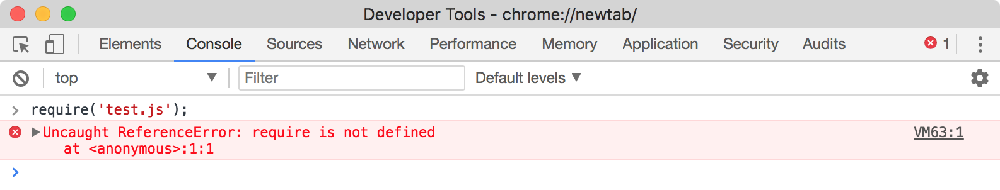
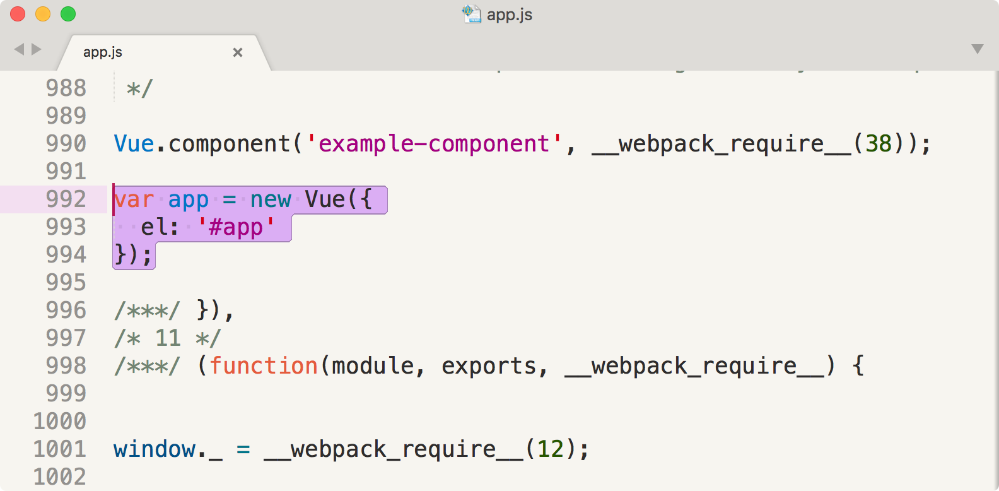
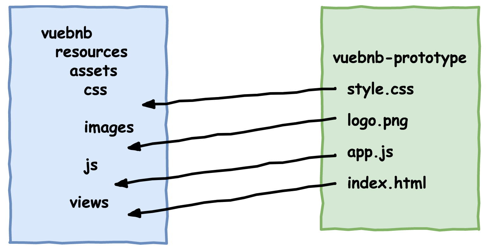
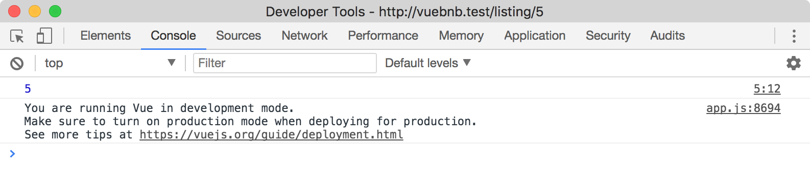

**********************
使用Webpack整合Laravel和Vue
**********************
在本章中，我们将把 ``Vuebnb`` 前端原型迁移到我们的主 ``Laravel`` 项目中，实现 ``Vuebnb`` 的第一个完整全栈迭代。 这个完全集成的环境将包括 ``Webpack`` 构建步骤，使我们能够在继续构建前端时融入更复杂的工具和技术。

本章涵盖的主题：

- 介绍 ``Laravel`` 的开箱即用前端应用程序；
- ``Webpack`` 的高级概述；
- 如何配置 ``Laravel Mix`` 以编译前端资产；
- 将 ``Vuebnb`` 原型迁移到全栈的 ``Laravel`` 环境中；
- 使用 ``ES2015`` 和 ``Vue.js`` ，包括旧版浏览器的语法和 ``polyfills`` ；
- 将前端应用程序中的硬编码数据切换到后端数据；

Laravel前端
===========
我们认为 ``Laravel`` 是一个后端框架，但是一个新的 ``Laravel`` 项目也包含一个前端应用程序的样板代码和配置。

开箱即用的前端包括 ``JavaScript`` 和 ``Sass`` 资产文件，以及指定诸如 ``Vue.js`` ， ``jQuery`` 和 ``Bootstrap`` 之类的依赖关系的 ``package.json`` 文件。

让我们来看看这个样板代码和配置，以便我们了解在开始迁移时 ``Vuebnb`` 前端应用程序如何适合我们的 ``Laravel`` 项目。

JavaScript
==========
``JavaScript`` 资源保存在 ``resources/assets/js`` 文件夹中。 这个目录中有几个 ``.js`` 文件，以及一个带有 ``.vue`` 组件的子目录。 后面的文件将在另一章中解释，所以我们现在将忽略它。

主要的 ``JavaScript`` 文件是 ``app.js`` 。 你会在这个文件中看到熟悉的 ``Vue`` 构造函数，但也有一些语法可能不太熟悉。 第一行是 ``require`` 函数，用于导入相邻文件 ``bootstrap.js`` ，后者又加载其他库，包括 ``jQuery`` 和 ``Lodash`` 。

``require`` 不是一个标准的 ``JavaScript`` 函数，在浏览器中使用此代码之前必须先解析。

resources/assets/js/app.js:

.. code-block:: js

    require('./bootstrap');

    window.Vue = require('vue');

    Vue.component('example', require('./components/Example.vue'));

    const app = new Vue({
      el: '#app'
    });

CSS
---
如果您之前没有听说过 ``Sass`` ，那么这个 ``CSS`` 扩展，可以更轻松地开发 ``CSS`` 。 默认的 ``Laravel`` 安装包含 ``resources/assets/sass`` 目录，其中包含两个样板 ``Sass`` 文件。

主要的 ``Sass`` 文件是 ``app.scss`` 。 它的工作是导入其他 ``Sass`` 文件，包括 ``Bootstrap CSS`` 框架。

resources/assets/sass/app.scss:

.. code-block:: scss

    // Fonts
    @import url("https://fonts.googleapis.com/css?family=Raleway:300,400,600");

    // Variables
    @import "variables";

    // Bootstrap
    @import "~bootstrap-sass/assets/stylesheets/bootstrap";

Node modules
------------
``Laravel`` 前端的另一个关键方面是项目目录根目录中的 ``package.json`` 文件。 与 ``composer.json`` 类似，此文件用于配置和依赖关系管理，仅用于 ``Node`` 模块而非 ``PHP`` 。

``package.json`` 的一个属性是 ``devDependencies`` ，它指定了开发环境中所需的模块，包括 ``jQuery`` ， ``Vue`` 和 ``Lodash`` 。

package.json:

.. code-block:: json

    {
      ...
      "devDependencies": {
        "axios": "^0.17",
        "bootstrap-sass": "^3.3.7",
        "cross-env": "^5.1",
        "jquery": "^3.2",
        "laravel-mix": "^1.4",
        "lodash": "^4.17.4",
        "vue": "^2.5.3"
      }
    }

视图
----
为了在 ``Laravel`` 中提供前端应用程序，它需要包含在视图中。 唯一提供的开箱即用视图是欢迎视图，位于 ``resources/views/welcome.blade.php`` ，它被用作主页样板。

欢迎视图实际上并不包括前端应用程序，而是由用户自己安装。 我们将在本章后面讨论如何做到这一点。

Asset编译
=========
``resources/assets`` 中的文件包括不能在浏览器中直接使用的函数和语法。 例如，``app.js`` 中用于导入 ``JavaScript`` 模块方式，它使用的 ``require`` 方法不是本地 ``JavaScript`` 方法，也不是标准 ``Web API`` 的一部分：

   图5.1 require 未在浏览器中定义

构建工具使用这些资产文件，解析任何非标准函数和语法，并输出浏览器可以使用的代码。 有许多流行的前端资产构建工具，包括 ``Grunt`` ， ``Gulp`` 和 ``Webpack`` ：

.. figure:: ./images/5-2.png

   图5.2 资产编译过程

我们努力使用这个资产编译过程的原因是我们可以编写我们的前端应用程序，而不受浏览器允许的限制。 我们可以引入各种方便的开发工具和功能，使我们能够更轻松地编写代码并修复问题。

Webpack
=======
``Webpack`` 是 ``Laravel 5.5`` 提供的默认构建工具，我们将在 ``Vuebnb`` 的开发中使用它。

使 ``Webpack`` 与其他流行的构建工具（如 ``Gulp`` 和 ``Grunt`` ）不同的是，它首先是一个模块打包器。 让我们通过了解模块捆绑过程的工作原理来开始我们对 ``Webpack`` 的概述。

依赖
----
在前端应用程序中，我们可能会与第三方 ``JavaScript`` 库或其他文件中存在依赖关系。 例如， ``Vuebnb`` 原型依赖于 ``Vue.js`` 和模拟列表数据文件：

.. figure:: ./images/5-3.png

   图5.3 Vuebnb原型依赖关系

除了确保任何共享函数和变量都具有全局范围并且脚本以正确的顺序加载之外，在浏览器中没有真正的管理这些依赖关系的方法。

例如，由于 ``node_modules/vue/dist/vue.js`` 定义了一个全局的 ``Vue`` 对象且首先被加载，所以我们可以在我们的 ``app.js`` 脚本中使用 ``Vue`` 对象。 如果这两个条件中的任何一个都不符合，则在 ``app.js`` 运行时不会定义 ``Vue`` ，从而导致错误：

.. code-block:: html

    
    
    

这个系统有许多缺点：

- 全局变量引入了命名碰撞和意外突变的可能性；
- 脚本加载顺序很脆弱，随着应用程序的增长可轻松破解；
- 我们无法利用性能优化，例如异步加载脚本；

模块
----
依赖性管理问题的解决方案是使用模块系统，例如 ``CommonJS`` 或本地 ``ES`` 模块。 这些系统允许 ``JavaScript`` 代码被模块化并导入到其他文件中。

这是一个 ``CommonJS`` 示例：

.. code-block:: js

    // moduleA.js
    module.exports = function(value) {
      return value * 2;
    }

    // moduleB.js
    var multiplyByTwo = require('./moduleA');
    console.log(multiplyByTwo(2));

    // Output: 4

这里有一个 ``Native ES`` 模块示例：

.. code-block:: js

    // moduleA.js
    export default function(value) {
      return value * 2;
    }

    // moduleB.js
    import multiplyByTwo from './moduleA';
    console.log(multiplyByTwo(2));

    // Output: 4

问题是 ``CommonJS`` 不能在浏览器中使用（它是为服务器端 ``JavaScript`` 设计的），只有本地 ``ES`` 模块现在获得浏览器支持。 如果我们想在项目中使用模块系统，我们需要一个构建工具： ``Webpack`` 。

打包
----
将模块解析为浏览器友好代码的过程称为捆绑。 ``Webpack`` 以入口文件作为起点开始捆绑过程。 在 ``Laravel`` 前端应用程序中， ``resources/assets /js/app.js`` 是入口文件。

``Webpack`` 分析入口文件以查找任何依赖关系。 在 ``app.js`` 的情况下，它会找到： ``bootstrap`` ， ``vue`` 和 ``Example.vue`` 这三个文件。

resources/assets/js/app.js:

.. code-block:: js

    require('./bootstrap');

    window.Vue = require('vue');

    Vue.component('example', require('./components/Example.vue'));

``Webpack`` 将解决这些依赖关系，然后分析它们以查找它们可能具有的任何依赖关系。 这个过程一直持续到找到项目的所有依赖关系。 结果是一个依赖关系图，在一个大型项目中，可能包含数百个不同的模块。

``Webpack`` 使用这个依赖关系图作为将所有代码捆绑到单个浏览器友好文件中的蓝图：

.. code-block:: html

    

加载器
------
使 ``Webpack`` 如此强大的部分原因是，在捆绑过程中，它可以用一个或多个 ``Webpack`` 加载器来转换模块。

例如， ``Babel`` 是一种编译器，可将下一代 ``JavaScript`` 语法（如 ``ES2015`` ）转换为标准 ``ES5`` 。  ``Webpack Babel`` 加载器是最受欢迎的之一，因为它允许开发人员使用模块功能编写他们的代码，但仍旧在旧版浏览器中提供支持。

例如，在入口文件中，我们看到 ``IE10`` 不支持的 ``ES2015`` 常量声明。

resources/assets/js/app.js:

.. code-block:: js

    const app = new Vue({
      el: '#app'
    });

如果使用 ``Babel`` 加载器，那么在将它添加到包中之前， ``const`` 将被转换为 ``var`` 。

public/js/app.js:

.. code-block:: js

    var app = new Vue({
      el: '#app'
    });

Laravel Mix
===========
``Webpack`` 的一个缺点是配置它很艰难。 为了使事情更容易， ``Laravel`` 包含一个名为 ``Mix`` 的模块，它采用最常用的 ``Webpack`` 选项，并将它们放在一个简单的 ``API`` 后面。

``Mix`` 配置文件可以在项目目录的根目录中找到。 ``Mix`` 配置包含声明应用程序的基本构建步骤的混合对象 ``mix`` 以及对应的链式方法。 例如， ``js`` 方法接受两个参数，即入口文件和输出目录，默认情况下应用 ``Babel`` 加载器。 ``sass`` 方法以同样的方式工作。

webpack.mix.js:

.. code-block:: js

    let mix = require('laravel-mix');
    mix.js('resources/assets/js/app.js', 'public/js')
      .sass('resources/assets/sass/app.scss', 'public/css');

运行Webpack
===========
现在我们对 ``Webpack`` 有了更高层次的理解，让我们来运行它，看看它如何捆绑默认的前端资产文件。

首先，确保安装了所有的开发依赖项：

.. code-block:: shell

    $ npm install

CLI
---
``Webpack`` 通常从命令行运行，例如：

.. code-block:: shell

    $ webpack [options]

我们可以使用 ``package.json`` 中预定义的一个 ``Weback`` 脚本，而不是自己找出正确的 ``CLI`` 选项。 例如， ``development`` 脚本将运行带有适合创建开发版本选项的 ``Webpack`` 。

package.json:

.. code-block:: php

    "scripts": {
      ...
      "development": "cross-env NODE_ENV=development node_modules/webpack/bin/webpack.js --progress --hide-modules --config=node_modules/laravel-mix/setup/webpack.config.js",
      ...
    }

第一次构建
----------
现在运行 ``dev`` 脚本（ ``development`` 脚本的快捷方式）：

.. code-block:: shell

    $ npm run dev

运行后，您应该在终端中看到类似于以下内容的输出：

.. figure:: ./images/5-4.png

   图5.4 Webpack终端输出

这个输出告诉我们很多东西，但最重要的是构建是成功的，在输出中创建了哪些文件，包括字体， ``JavaScript`` 和 ``CSS`` 。 请注意，输出文件路径不是相对于项目根目录，而是相对于公共目录，所以 ``js/apps.js`` 文件将在 ``public/js/app.js`` 中找到。

JavaScript
^^^^^^^^^^
检查输出的 ``JavaScript`` 文件 ``public/js/app.js`` ，我们会看到很多代码 - 大约42,000行！ 这是因为 ``jQuery`` ， ``Lodash`` ， ``Vue`` 和其他 ``JavaScript`` 依赖关系已经被捆绑到这个文件中。 这也是因为我们使用了不包含缩小或丑化的开发版本。

如果您通过文件进行搜索，您会发现来自入口文件 ``app.js`` 的代码已按预期转换为 ``ES5`` ：

   图5.5 捆绑文件 public/js/app.js

CSS
^^^^
我们也有一个 ``CSS`` 包文件 ``public/css/app.css`` 。 如果你检查这个文件，你会发现已经包含了导入的 ``Bootstrap CSS`` 框架，并且 ``Sass`` 语法已经被编译为纯 ``CSS`` 。

Fonts
^^^^^
你可能会奇怪的是输出中有字体，因为 ``Mix`` 没有包含任何明确的字体配置。 这些字体是 ``Bootstrap CSS`` 框架和 ``Mix`` 的依赖项，默认情况下，它们将单独输出，而不是以字体包的形式输出。

迁移Vuebnb
===========
既然我们熟悉默认的 ``Laravel`` 前端应用程序代码和配置，我们已经准备好将 ``Vuebnb`` 原型迁移到主项目中。 此迁移将使我们可以将所有源代码放在一个地方，此外，我们可以利用这个更复杂的开发环境来构建 ``Vuebnb`` 的其余部分。

迁移将涉及：

- 删除任何不必要的模块和文件；
- 将原型文件移动到 ``Laravel`` 项目结构中；
- 修改原型文件以使其适应新的环境；

   图5.6 Vuebnb原型迁移

移除没有必要依赖和文件
----------------------
我们首先删除我们不再需要的节点依赖关系。 我们将保留 ``axis`` ，因为它将在后面的章节中使用，和 ``cross-env`` 因为它确保我们的 ``NPM`` 脚本可以在各种环境中运行。 我们会去除其余的：

.. code-block:: shell

    $ npm uninstall bootstrap-sass jquery lodash --save-dev

这个命令会让你的 ``dev`` 依赖看起来像这样。

package.json:

.. code-block:: json

    "devDependencies": {
      "axios": "^0.17",
      "cross-env": "^5.1",
      "laravel-mix": "^1.4",
      "vue": "^2.5.3"
    }

接下来，我们将删除我们不需要的文件。 这包括一些 ``JavaScript`` 资产，所有 ``Sass`` 以及 ``welcome`` 视图：

.. code-block:: shell

    $ rm -rf \
    resources/assets/js/app.js \
    resources/assets/js/bootstrap.js \
    resources/assets/js/components/* \
    resources/assets/sass \
    resources/views/welcome.blade.php

由于我们删除了所有 ``Sass`` 文件，因此我们还需要删除 ``Mix`` 配置中的 ``sass`` 方法。

webpack.mix.js:

.. code-block:: js

    let mix = require('laravel-mix');
    mix.js('resources/assets/js/app.js', 'public/js');

现在我们的前端应用程序没有混乱，我们可以将原型文件移到他们的新家。

HTML
----
现在让我们将我们在第2章原型 ``Vuebnb`` （您的第一个 ``Vue.js`` 项目）中完成的原型项目中的 ``index.html`` 内容复制到一个新文件 ``app.blade.php`` 中。 这将允许模板用作 ``Laravel`` 视图：

.. code-block:: shell

    $ cp ../vuebnb-prototype/index.html ./resources/views/app.blade.php

我们还会更新主页的路由以指向这个新视图，而不是欢迎视图。

routes/web.php:

.. code-block:: php

    <?php
    Route::get('/', function () {
      return view('app');
    });

语法冲突
^^^^^^^^
使用原型模板文件作为视图会导致一个小问题，因为 ``Vue`` 和 ``Blade`` 共享一个通用语法。 例如，查看 ``Vue.js`` 插入列表的标题和地址的标题部分。

resources/views/app.blade.php:

.. code-block:: html

    

      <h1>{{ title }}</h1>
      
{{ address }}

    

当 ``Blade`` 处理它时，它会认为双括号是它自己的语法，并且会产生一个 ``PHP`` 错误，因为标题和地址都不是被定义的函数。

有一个简单的解决方案：转义这些双花括号让 ``Blade`` 知道忽略它们。 这可以通过将 ``@``符号作为前缀来完成。

resources/views/app.blade.php:

.. code-block:: html

    

      <h1>@{{ title }}</h1>
      
@{{ address }}

    

一旦你完成了文件中每个双括号的设置，在浏览器中加载 ``home`` 路由以测试新的视图。 没有 ``JavaScript`` 或 ``CSS`` ，它看起来不太好，但至少我们可以确认它的工作的。

JavaScript
-----------
现在让我们将原型的主脚本文件 ``app.js`` 移动到 ``Laravel`` 项目中：

.. code-block:: shell

    $ cp ../vuebnb-prototype/app.js ./resources/assets/js/

鉴于当前的 ``Mix`` 设置，这将成为 ``JavaScript`` 打包的入口文件。 这意味着视图底部的 ``JavaScript`` 依赖关系可以用包来替代，也就是说。

resources/views/app.blade.php:

.. code-block:: html

    
    
    

可以被替换为：

resources/views/app.blade.php:

.. code-block:: html

    

模拟数据依赖
^^^^^^^^^^^^
让我们将模拟数据依赖项复制到项目中：

.. code-block:: shell

    $ cp ../vuebnb-prototype/sample/data.js ./resources/assets/js/

目前，这个文件声明了一个全局变量 ``sample`` ，然后在入口文件中找到它。 让我们通过用 ``ES2015`` ``export default`` 替换变量声明来使该文件成为模块。

resources/assets/js/data.js:

.. code-block:: js

    export default {
     ...
    }

我们现在可以将该模块导入到我们的入口文件的顶部。 请注意， ``Webpack`` 可以在导入语句中猜测文件扩展名，以便从 ``data.js`` 中省略 ``.js`` 。

resources/assets/js/app.js:

.. code-block:: js

    import sample from './data';

    var app = new Vue({
      ...
    });

.. tip:: 虽然 ``Laravel`` 可选择使用 ``CommonJS`` 语法来包含模块，即 ``require`` ，但是我们将使用本地 ``ES`` 模块语法，即 ``import`` 。 这是因为 ``ES`` 模块正在进入 ``JavaScript`` 标准，并且与 ``Vue`` 使用的语法更加一致。

使用Webpack显示模块
^^^^^^^^^^^^^^^^^^^
让我们运行一个 ``Webpack`` 构建以确保 ``JavaScript`` 迁移到目前为止正在工作：

.. code-block:: shell

    $ npm run dev

如果一切正常，您将看到正在输出的 ``JavaScript`` 打包文件。

知道添加了模拟数据依赖性，而无需手动检查该包以查找代码看起来很好。 我们可以通过告诉 ``Webpack`` 打印它在终端输出中处理的模块来做到这一点。

在我们的 ``package.json`` 的 ``development`` 脚本中，已经设置了 ``--hide-modules`` 标志，因为一些开发者更喜欢简洁的输出消息。 现在让我们删除它，并添加 ``--display-modules`` 标志，以便脚本如下所示：

.. code-block:: js

    "scripts": {
      ...
      "development": "cross-env NODE_ENV=development node_modules/webpack/bin/webpack.js --progress --display-modules --config=node_modules/laravel-mix/setup/webpack.config.js",
      ...
    }

现在再次运行构建，我们得到这个更详细的终端输出。

Vue.js依赖
^^^^^^^^^^
现在让我们导入 ``Vue.js`` 作为我们入口文件的依赖关系。

resources/assets/js/app.js:

.. code-block:: js

    import Vue from 'vue';
    import sample from './data';

    var app = new Vue({
      ...
    });

再次运行构建，现在我们将在 ``Terminal`` 输出中的模块列表中看到 ``Vue.js`` ，以及它引入的一些依赖关系。

您可能想知道 ``import Vue from 'vue'`` 如何解析的，因为它似乎不是一个适当的文件应用。 缺省情况下， ``Webpack`` 将检查项目中的 ``node_modules`` 文件夹是否存在任何依赖关系，从而让你不必从 ``'node_modules/vue';`` 中引入 ``Vue`` 。

但是，怎么知道这个包的入口文件？ 查看前面屏幕截图中的 ``Webpack`` 终端输出，可以看到它包含了 ``node_modules/vue/dist/vue.common.js`` 。 它知道使用这个文件是因为当 ``Webpack`` 添加节点模块作为依赖关系时，它会检查它们的 ``package.json`` 文件并查找在 ``Vue`` 模块中的 ``main`` 属性。

node_modules/vue/package.json:

.. code-block:: js

    {
      ...
      "main": "dist/vue.runtime.common.js",
      ...
    }

然而， ``Laravel Mix`` 覆盖了这个强制不同的 ``Vue`` 版本。

node_modules/laravel-mix/setup/webpack.config.js:

.. code-block:: js

    alias: {
      'vue$': 'vue/dist/vue.common.js'
    }

简而言之， ``import Vue from 'vue'`` 与从 ``import Vue from 'node_modules/vue/dist/vue.common.js'`` 导入 ``Vue`` 实际上是一样的。

.. tip:: 我们将在第6章中解释不同的 ``Vue`` 构建，使用 ``Vue.js`` 组件构建构件。

完成后，我们的 ``JavaScript`` 已成功迁移。 再次加载主页路由，我们可以更好地使用现在包含的 ``JavaScript`` 来制作 ``Vuebnb`` 的列表页面。

CSS
---
为了迁移 ``CSS`` ，我们将把 ``style.css`` 从原型复制到 ``Laravel`` 项目中。 默认的 ``Laravel`` 前端应用程序使用 ``Sass`` 而不是 ``CSS`` ，所以我们需要首先为 ``CSS`` 资源创建一个目录：

.. code-block:: shell

    $ mkdir ./resources/assets/css
    $ cp ../vuebnb-prototype/style.css ./resources/assets/css/

然后，让我们在我们的 ``Mix`` 配置文件中创建一个新声明，以使用 ``styles`` 方法获取 ``CSS`` 包。

webpack.mix.js:

.. code-block:: js

    mix.js('resources/assets/js/app.js', 'public/js')
       .styles('resources/assets/css/style.css', 'public/css/style.css');

我们现在通过更新链接的 ``href`` 链接到我们视图中的 ``CSS`` 打包文件。

resources/views/app.blade.php:

.. code-block:: html

    <link rel="stylesheet" href="{{ asset('css/style.css') }}" type="text/css">

字体样式
^^^^^^^^
我们还有 ``Open Sans`` 和 ``Font Awesome`` 样式表需要包含。 首先，使用 ``NPM`` 安装字体包：

.. code-block:: shell

    $ npm i --save-dev font-awesome open-sans-all

我们将修改我们的 ``Mix`` 配置，将我们的应用 ``CSS`` ， ``Open Sans`` 和 ``Font Awesome CSS`` 捆绑在一起。 我们可以通过将数组传递给样式方法的第一个参数来完成此操作。

webpack.mix.js:

.. code-block:: js

    mix
      .js('resources/assets/js/app.js', 'public/js')
      .styles([
        'node_modules/open-sans-all/css/open-sans.css',
        'node_modules/font-awesome/css/font-awesome.css',
        'resources/assets/css/style.css'
      ], 'public/css/style.css');

``Mix`` 会将关于 ``CSS`` 包的统计信息附加到终端输出中。

请记住删除视图中字体样式表的链接，因为这些链接现在位于 ``CSS`` 包中。

Fonts
-----
``Open Sans`` 和 ``Font Awesome`` 都需要一个 ``CSS`` 样式表和相关的字体文件。 像 ``CSS`` 一样， ``Webpack`` 可以将字体作为模块捆绑在一起，但我们目前不需要利用这一点。 相反，我们将使用复制方法，该方法告诉 ``Mix`` 将字体从其主目录复制到 ``public`` 文件夹，这样前端应用程序可以访问它们。

webpack.mix.js:

.. code-block:: js

    mix
      .js('resources/assets/js/app.js', 'public/js')
      .styles([
        'node_modules/open-sans-all/css/open-sans.css',
        'node_modules/font-awesome/css/font-awesome.css',
        'resources/assets/css/style.css'
      ], 'public/css/style.css')
      .copy('node_modules/open-sans-all/fonts',  'public/fonts')
      .copy('node_modules/font-awesome/fonts',  'public/fonts');

再次构建后，您将在项目结构中看到一个 ``public/fonts`` 文件夹。

Images
------
我们现在将迁移图像，包括工具栏的徽标和模拟数据标题图像：

.. code-block:: shell

    $ cp ../vuebnb-prototype/logo.png ./resources/assets/images/
    $ cp ../vuebnb-prototype/sample/header.jpg ./resources/assets/images/

让我们链接另一种复制方法，将其包含在 ``public/images`` 目录中。

webpack.mix.js:

.. code-block:: js

    mix
      .js('resources/assets/js/app.js', 'public/js')
      .styles([
        'node_modules/open-sans-all/css/open-sans.css',
        'node_modules/font-awesome/css/font-awesome.css',
        'resources/assets/css/style.css'
      ], 'public/css/style.css')
      .copy('node_modules/open-sans-all/fonts',  'public/fonts')
      .copy('node_modules/font-awesome/fonts',  'public/fonts')
      .copy('resources/assets/images', 'public/images');

我们还需要确保视图指向图像的正确文件位置。

resources/views/app.blade.php:

.. code-block:: html

    

      
      <h1>vuebnb</h1>
    

    

      
    

不要忘记，入口文件中的 ``headerImageStyle`` 数据属性也需要更新。

resources/assets/js/app.js:

.. code-block:: js

    headerImageStyle: {
      'background-image': 'url(/images/header.jpg)'
    },

虽然不完全是图片，但我们也会迁移 ``favicon`` 。 这可以直接放入 ``public`` 文件夹中：

.. code-block:: shell

    $ cp ../vuebnb-prototype/favicon.ico ./public

再次构建之后，我们现在将完全迁移完成 ``Vuebnb`` 客户端应用程序原型。

开发工具
========
我们可以利用一些方便的开发工具来改进我们的前端工作流程，包括：

- 观察模式；
- BrowserSync；

Watch模式
---------
到目前为止，我们每次进行更改时都会使用 ``npm run dev`` 手动运行我们的应用程序的构建。 ``Webpack`` 还有一个监视模式，在依赖关系发生变化时它会自动运行构建。 由于 ``Webpack`` 的设计，它能够通过重建已更改的模块来高效地完成这些自动构建。

要使用监视模式，请运行 ``package.json`` 中包含的 ``watch`` 脚本：

.. code-block:: shell

    $ npm run watch

要测试它已经工作，请在 ``resources/assets/js/app.js`` 的底部添加它：

.. code-block:: js

    console.log("Testing watch");

如果 ``watch`` 模式正常运行，保存此文件将触发构建，并且您将在终端中看到更新的构建统计信息。 如果您刷新页面，您将在控制台中看到测试观察消息。

要关闭监视模式，请在终端中按 ``Ctrl+C`` 。 它可以随时重新启动。 一旦你满意的观察模式正在工作，不要忘记删除 ``console.log`` 。

.. tip:: 我会假设在本书的其余部分你正在使用 ``watch`` ，所以我不会提醒你在发生变化后再构建你的项目！

BrowserSync
-----------
另一个有用的开发工具是 ``BrowserSync`` 。与观察模式类似， ``BrowserSync`` 监视您更改的文件，并在发生更改时将更改插入浏览器。这样可以避免您在每次构建后都必须手动执行浏览器刷新。

要使用 ``BrowserSync`` ，您需要安装 ``Yarn`` 软件包管理器。如果您正在 ``Vagrant Box`` 内运行终端命令，那么您已经设置好了，因为 ``Yarn`` 预装在 ``Homestead`` 中。否则，请按照 ``Yarn`` 的安装说明进行操作： https://yarnpkg.com/en/docs/install 。

``BrowserSync`` 已经集成在 ``Mix`` 中，并可通过在 ``Mix`` 配置中链式对 ``browserSync`` 方法进行调用。将选项对象与应用程序的 ``URL`` 作为代理属性传递，例如 ``browserSync({proxy: http://vuebnb.test})`` 。

我们将应用程序的 ``URL`` 作为环境变量存储在 ``.env`` 文件中，因此我们从那里获取它，而不是硬编码到我们的 ``Mix`` 文件中。首先，安装 ``NPM dotenv`` 模块，该模块将 ``.env`` 文件读取到 ``Node`` 项目中：

.. code-block:: shell

    $ npm i dotenv --save-devpm

在 ``Mix`` 配置文件顶部 ``require`` 的 ``dotenv`` 模块，并使用 ``config`` 方法加载 ``.env`` 。 任何环境变量都将作为 ``process.env`` 对象的属性可用。

我们现在可以将选项对象传递给 ``browserSync`` 方法，并将 ``process.env.APP_URL`` 分配给 ``proxy`` 。 我也喜欢使用 ``open:false`` 选项，以防止 ``BrowserSync`` 自动打开选项卡。

webpack.mix.js:

.. code-block:: js

    require('dotenv').config();
    let mix = require('laravel-mix');
    mix
      ...
      .browserSync({
        proxy: process.env.APP_URL,
        open: false
      });

``BrowserSync`` 默认运行在其自己的端口上， ``3000`` 。 当您再次运行 ``npm run watch`` 时，在 ``localhost:3000`` 上打开一个新选项卡。 在对代码进行更改后，您会发现它们会自动反映在此 ``BrowserSync`` 选项卡中！

请注意，如果您在 ``Homestead`` 框中运行 ``BrowserSync`` ，则可以在 ``vuebnb.test:3000`` 上访问它。

.. tip:: 即使 ``BrowserSync`` 服务器运行在与 ``Web`` 服务器不同的端口上，我仍将继续引用应用程序中的 ``URL`` ，而不指定端口来避免混淆，例如 ``vuebnb.test`` 而不是 ``localhost:3000`` 或 ``vuebnb.test:3000`` 。

ES2015
======
``js Mix`` 方法将 ``Babel`` 插件应用于 ``Webpack`` ，确保在添加到 ``bundle`` 文件之前，将任何 ``ES2015`` 代码转换为适合浏览器的 ``ES5`` 。

我们仅使用 ``ES5`` 语法编写了 ``Vuebnb`` 前端应用程序原型，因为我们直接在浏览器中运行它，而无需任何构建步骤。 但是现在我们可以利用 ``ES2015`` 语法，其中包含许多便利的功能。

例如，我们可以使用简写来为对象属性分配函数。

resources/assets/js/app.js:

.. code-block:: js

    escapeKeyListener: function(evt) {
      ...
    }

改变为：

.. code-block:: js

    escapeKeyListener(evt) {
      ...
    }

在 ``app.js`` 中有几个我们可以改变的实例。 在我们的代码中没有任何其他机会使用 ``ES2015`` 语法，但在接下来的章节中我们会看到更多。

Polyfills
---------
``ES2015`` 提案包括新的语法，但也包括新的 ``APIs`` ，如 ``Promise`` ，以及对现有 ``APIs`` 的补充，如 ``Array`` 和 ``Object`` 。

``Webpack Babel`` 插件可以转变 ``ES2015`` 语法，但是新的 ``API`` 方法需要填充。 ``polyfill`` 是一个在浏览器中运行的脚本，用于涵盖可能会丢失的 ``API`` 或 ``API`` 方法。

例如， ``Object.assign`` 是 ``Internet Explorer 11`` 不支持的新 ``API`` 方法。如果我们想在前端应用程序中使用它，我们必须在脚本的顶部检查是否存在 ``API`` 方法，如果不存在 ，我们用 ``polyfill`` 手动定义它：

.. code-block:: js

    if (typeof Object.assign != 'function') {
      // Polyfill to define Object.assign
    }

说到这一点， ``Object.assign`` 是一种合并对象的方便方式，在我们的前端应用程序中会很有用。 让我们在我们的代码中使用它，然后添加一个 ``polyfill`` 以确保代码将在较旧的浏览器中运行。

查看我们的入口文件 ``resources/assets/js/app.js`` 中的 ``data`` 对象。 我们手动将 ``sample`` 对象的每个属性分配给 ``data`` 对象，并赋予它相同的属性名称。 为了不必自己重复，我们可以使用 ``Object.assign`` 并简单地合并这两个对象。 在实践中，这没有什么不同，它只是更简洁的代码。

resources/assets/js/app.js:

.. code-block:: js

    data: Object.assign(sample, {
      headerImageStyle: {
        'background-image': 'url(/images/header.jpg)'
      },
      contracted: true,
      modalOpen: false
    }),

为了填充 ``Object.assign`` ，我们必须安装一个新的 ``core-js`` 依赖项，它是大多数新的 ``JavaScript API`` 的一个 ``polyfills`` 库。 我们稍后会在项目中使用一些其他 ``core-js`` 的 ``polyfills`` ：

.. code-block:: shell

    $ npm i --save-dev core-js

在 ``app.js`` 的顶部，添加这一行以包含 ``Object.assign`` 补充：

.. code-block:: js

    import "core-js/fn/object/assign";

在此版本之后，刷新页面以查看它是否有效。 除非您可以在旧版浏览器（如 ``Internet Explorer`` ）上测试此功能，否则很可能您不会注意到任何区别，但现在您可以确保此代码几乎可以在任何地方运行。

模拟数据
========
我们现在已经完全将 ``Vuebnb`` 原型迁移到我们的 ``Laravel``项目中，此外我们还添加了构建步骤。 前端应用程序中的所有内容都与第2章原型 ``Vuebnb`` ，您的第一个 ``Vue.js`` 项目一样。

但是，我们仍然将模拟数据硬编码到前端应用程序中。 在本章的最后部分，我们将删除硬编码数据，并用后端数据替换它。

路由
----
目前，主页路由，即 ``/`` ，加载我们的前端应用程序。 但是到目前为止，我们为前端应用程序构建的内容并不意味着成为主页！ 我们将在未来的章节中进行构建。

我们已经构建的是列表页面，该页面应该位于 ``/listing/5`` 这样的路径中，其中 ``5`` 是正在使用的模拟数据列表的 ``ID`` 。

+----------+--------------------+
| 页面     | 路由               |
+==========+====================+
| 主页     | /                  |
+----------+--------------------+
| 列表页面 | /listing/{listing} |
+----------+--------------------+

修改路由来反应该设置：

routes/web.php:

.. code-block:: php

    <?php
    use App\Listing;

    Route::get('/listing/{listing}', function ($id) {
      return view('app');
    });

就像在我们的 ``api/listing/{listing}`` 路由中一样，动态部分是为了匹配我们的某个模拟数据列表的 ``ID`` 。 如果您回想上一章，我们创建了30个模拟数据列表， ``ID`` 范围为1到30。

如果我们现在在闭包函数的配置文件中键入提示 ``Listing`` 模型，则 ``Laravel`` 的服务容器将传入一个模型，该模型的 ``ID`` 与动态路径段相匹配。

routes/web.php:

.. code-block:: php

    <?php
    Route::get('/listing/{listing}', function (Listing $listing) {
      // echo $listing->id // will equal 5 for route /listing/5
      return view('app');
    });

一个很酷的内置功能是，如果动态段与模型不匹配，例如 ``/listing/50`` 或 ``/listing/somestring`` ，则 ``Laravel`` 将中止路由并返回 ``404`` 。

架构
----
考虑到我们可以在路由处理程序中检索正确的列表模型，并且因为 ``Blade`` 模板系统，我们可以动态地将内容插入到应用程序视图中，出现了一个明显的体系结构：我们可以将模型注入页面的头部。 这样，当 ``Vue`` 应用程序加载时，它可以立即访问模型：

.. figure:: ./images/5-14.png

   图5.14 内联列表模型到页面的头部

注入数据
--------
将模拟列表数据导入客户端应用程序需要几个步骤。 我们将开始将模型转换为数组。 然后可以使用视图助手在运行时在模板中使模型可用。

routes/web.php:

.. code-block:: php

    <?php
    Route::get('/listing/{listing}', function (Listing $listing) {
      $model = $listing->toArray();
      return view('app', [ 'model' => $model ]);
    });

现在，在 ``Blade`` 模板中，我们将在文档的头部创建一个脚本。 通过使用双括号，我们可以将模型直接插入到脚本中。

resources/views/app.blade.php:

.. code-block:: html

    <head>
      ...
      
    </head>

如果我们现在转到 ``/listing/5`` 路由，我们将在我们的页面源中看到以下内容：

.. code-block:: js

    

您将在我们的控制台中看到以下内容：

   图5.15 注入模型ID后控制台输出

JSON
----
现在我们将在视图中将整个模型编码为 ``JSON`` 。 ``JSON`` 格式很好，因为它可以作为字符串存储，并且可以通过 ``PHP`` 和 ``JavaScript`` 进行解析。

在我们的内联脚本中，让我们将模型格式化为 ``JSON`` 字符串并分配给 ``model`` 变量。

resources/views/app.blade.php:

.. code-block:: js

    

注意我们还必须将 ``json_encode`` 包装在另一个全局函数 ``addslashes`` 中。 这个函数会在任何需要转义的字符之前添加反斜杠。 有必要这样做，因为 ``JavaScript JSON`` 解析器不知道字符串中的哪些引号是 ``JavaScript`` 语法的一部分，哪些是 ``JSON`` 对象的一部分。

我们还必须使用不同类型的 ``Blade`` 语法进行插值。 ``Blade`` 的一项功能是通过 ``PHP`` 的 ``htmlspecialchars`` 函数处理双括号 ``{{}}`` 中的语句，以防止 ``XSS`` 攻击。 不幸的是，这会使我们的 ``JSON`` 对象无效。 解决方案是使用替代 ``{!! !!}`` 语法，它不验证内容。 在这种情况下这是安全的，因为我们确信我们没有使用任何用户提供的内容。

现在，如果我们刷新页面，我们会在控制台中看到 ``JSON`` 对象的字符串形式。

如果我们将 ``log`` 命令更改为 ``console.log(JSON.parse(model))`` ，我们将模型看作不是字符串，而是 ``JavaScript`` 对象。

我们现在已经成功地将我们的模型从后端引入前端应用程序！

脚本之间共享数据
----------------
我们现在有另一个需要克服的问题。 文档头部的内联脚本（这是我们的模型对象所在的位置）与我们的客户端应用程序脚本不同。

正如我们在前一节中讨论的那样，多个脚本和全局变量通常不是首选，因为它们会使应用程序变得脆弱。 但在这种情况下，他们是必要的。 在两个脚本之间共享对象或函数的最安全方法是使其成为全局 ``window`` 对象的属性。 这样，从代码中可以明显看出，您有意使用全局变量：

.. code-block:: js

    // scriptA.js
    window.myvar = 'Hello World';

    // scriptB.js
    console.log(window.myvar); // Hello World

如果您为项目添加其他脚本，特别是第三方脚本，它们也可能添加到 ``window`` 对象中，并有可能导致命名冲突。 为了尽可能避免这种情况，我们将确保我们使用非常具体的属性名称。

resources/views/app.blade.php:

.. code-block:: html

    

现在，在前端应用程序的入口文件中，我们可以在脚本中使用此 ``window`` 属性。

resources/assets/js/app.js:

.. code-block:: js

    let model = JSON.parse(window.vuebnb_listing_model);

    var app = new Vue({
      ...
    });

替换硬编码模式
--------------
我们现在可以在入口文件中访问我们的列表模型，所以让我们在数据属性赋值中使用我们的硬编码模型进行切换。

resources/assets/js/app.js:

.. code-block:: js

    let model = JSON.parse(window.vuebnb_listing_model);

    var app = new Vue({
      el: '#app'
      data: Object.assign(model, {
        ...
      })
      ...
    });

完成后，我们现在可以从 ``app.js`` 顶部的声明中移除 ``import sample from './data';`` 。 我们也可以删除示例数据文件，因为它们不会在项目中进一步使用：

.. code-block:: shell

    $ rm resources/assets/js/data.js resources/assets/images/header.jpg

设施和价格
----------
如果你现在刷新页面，它会加载，但脚本会有一些错误。 问题在于，应用程序中的设施和价格在前端和后端数据结构不同。 这是因为该模型最初来自我们的数据库，该数据库存储标量值。 在 ``JavaScript`` 中，我们可以使用更丰富的对象，这些对象允许我们嵌套数据，使其更容易处理和操作。

以下是模型对象当前的外观。 请注意，设施和价格是标量值：

.. figure:: ./images/5-18.png

   图5.18 列表模式当前结构

下面就是我们需要的样子，以设施和价格作为数组：

.. figure:: ./images/5-19.png

   图5.19 列表模式当前结构

为了解决这个问题，我们需要在将模型传递给 ``Vue`` 之前对模型进行转换。 为了节省您对此的太多思考，我已经将转换函数放到了一个文件 ``resources/assets/js/helpers.js`` 中。 这个文件是一个 ``JavaScript`` 模块，我们可以将它导入到我们的入口文件中，并通过将模型对象传递给函数来使用。

resources/assets/js/app.js:

.. code-block:: js

    import Vue from 'vue';
    import { populateAmenitiesAndPrices } from './helpers';

    let model = JSON.parse(window.vuebnb_listing_model);
    model = populateAmenitiesAndPrices(model);

一旦我们添加并刷新页面，我们应该在页面的文本部分看到新的模型数据（尽管仍然使用硬编码的图像）。

图形URLs
--------
最后要做的是在前端应用程序中替换硬编码图像的 ``URL`` 。 这些 ``URL`` 目前不是模型的一部分，因此需要在将模型注入模板之前手动添加到模型中。

在第4章“使用 ``Laravel`` 构建 ``Web`` 服务”中，我们已经完成了一项非常类似的工作，以获取 ``API`` 列表路由。

app/Http/Controllers/ListingController.php:

.. code-block:: php

    <?php
    public function get_listing_api(Listing $listing)
    {
      $model = $listing->toArray();
      for($i = 1; $i <=4; $i++) {
        $model['image_' . $i] = asset(
          'images/' . $listing->id . '/Image_' . $i . '.jpg'
        );
      }
      return response()->json($model);
    }

事实上，我们的 ``web`` 路由最终会使用与此 ``API`` 路由相同的代码，而不是返回 ``JSON`` ，它将返回一个视图。

让我们分享共同的逻辑。 首先将列表控制器中的路由闭包函数移至新的 ``get_listing_web`` 方法中。

app/Http/Controllers/ListingController.php:

.. code-block:: php

    <?php
    namespace App\Http\Controllers;

    use Illuminate\Http\Request;
    use App\Listing;

    class ListingController extends Controller
    {
      public function get_listing_api(Listing $listing)
      {
        ...
      }

      public function get_listing_web(Listing $listing)
      {
        $model = $listing->toArray();
        return view('app', ['model' => $model]);
      }
    }

然后调整路由以调用这个新的控制器方法。

routes/web.php:

.. code-block:: php

    <?php
    Route::get('/listing/{listing}', 'ListingController@get_listing_web');

现在让我们更新控制器，以便 ``Web`` 和 ``API`` 路由都可以将图像的 ``URL`` 添加到其模型中。 我们将首先创建一个新的 ``add_image_urls`` 方法，它抽取 ``get_listing_api`` 中使用的逻辑。 现在这两种路由处理方法都会调用这个新的方法。

app/Http/Controllers/ListingController.php:

.. code-block:: php

    <?php
    namespace App\Http\Controllers;

    use Illuminate\Http\Request;
    use App\Listing;

    class ListingController extends Controller
    {
      private function add_image_urls($model, $id)
      {
        for($i = 1; $i <=4; $i++) {
          $model['image_' . $i] = asset(
            'images/' . $id . '/Image_' . $i . '.jpg'
          );
        }
        return $model;
      }

      public function get_listing_api(Listing $listing)
      {
        $model = $listing->toArray();
        $model = $this->add_image_urls($model, $listing->id);
        return response()->json($model);
      }

      public function get_listing_web(Listing $listing)
      {
        $model = $listing->toArray();
        $model = $this->add_image_urls($model, $listing->id);
        return view('app', ['model' => $model]);
      }
    }

完成后，如果我们刷新应用并打开 ``Vue Devtools`` ，我们应该看到我们将图像 ``URL`` 作为图像数据属性：

替换硬编码图形URLs
^^^^^^^^^^^^^^^^^^
最后一步是从后端使用这些图片 ``URL`` ，而不是硬编码的 ``URL`` 。 记住 ``images`` 是 ``URL`` 数组 ，我们将使用第一个图像作为默认值，即 ``images[0]`` 。

首先，我们将更新入口文件。

resources/assets/js/app.js:

.. code-block:: js

    headerImageStyle: {
      'background-image': `url(${model.images[0]})`
    }

然后是模态图像视图。

resources/views/app.blade.php:

.. code-block:: html

    

      
    

完成之后，在重建和页面刷新之后，您将在页面中看到模拟数据列表 ``＃5`` 的内容：

.. figure:: ./images/5-22.png

   图5.22 使用模拟数据的列表页面

总结
====
在本章中，我们熟悉了 ``Laravel`` 的默认前端应用程序的文件和配置。然后，我们将 ``Vuebnb`` 客户端应用程序原型迁移到我们的 ``Laravel`` 项目中，实现了 ``Vuebnb`` 的第一次全栈迭代。

我们还了解了 ``Webpack`` ，看看它如何通过将模块绑定到适合浏览器的构建文件来解决 ``JavaScript`` 依赖性管理问题。我们通过 ``Laravel Mix`` 在我们的项目中设置了 ``Webpack`` ，它为常见构建场景提供了一个简单的 ``API`` 。

然后，我们调查了使前端开发过程更简单的工具，包括 ``Webpack`` 监视模式和 ``BrowserSync`` 。

最后，我们看到了如何通过将数据注入到文档头中来从后端获取数据到前端应用程序。

在第6章中，使用 ``Vue.js`` 组件编写小部件组件，我们将介绍使用 ``Vue.js`` ：组件构建用户界面的最重要和最强大的工具之一。我们将为 ``Vuebnb`` 构建一个图像传送带，并使用组件知识将 ``Vuebnb`` 客户端应用程序重构为灵活的基于组件的架构。

