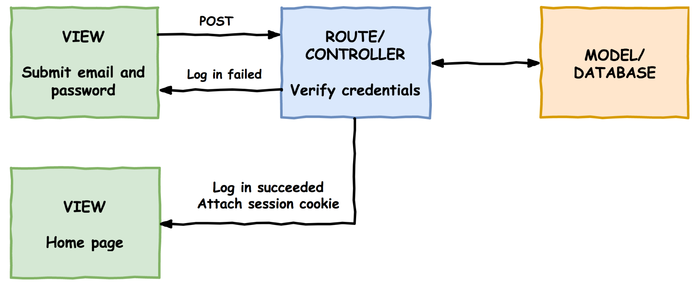
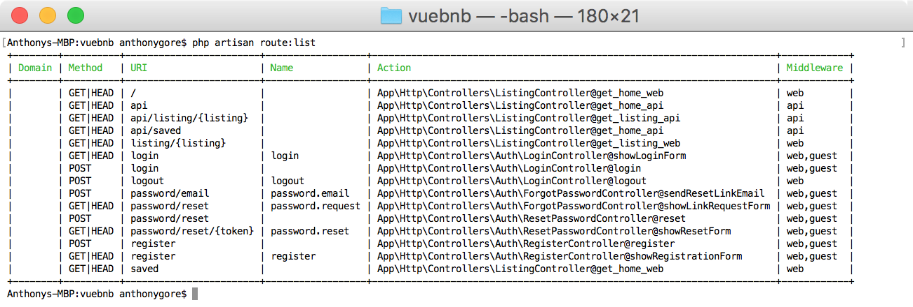
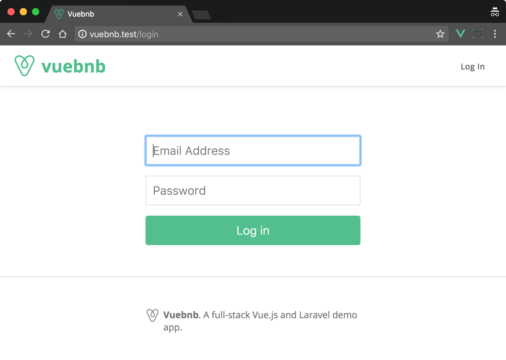
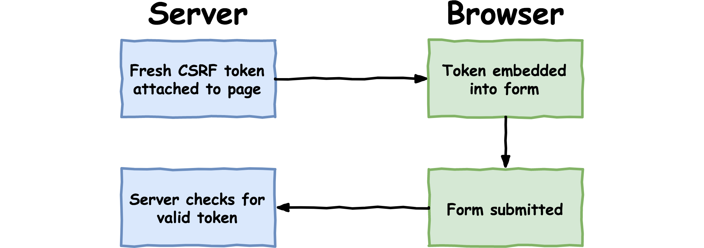
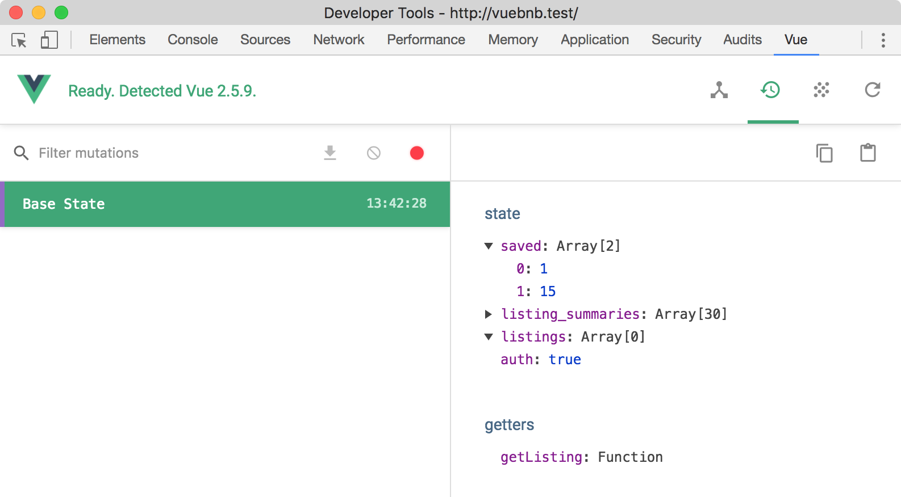
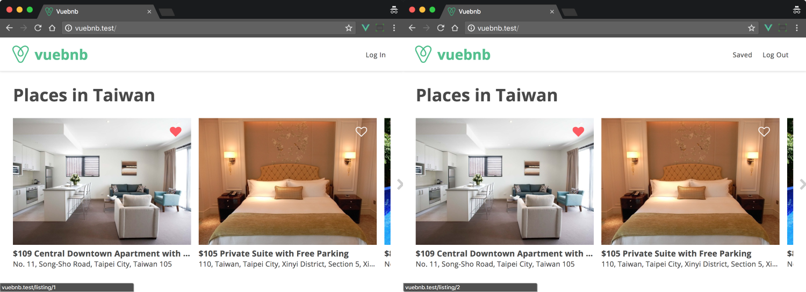
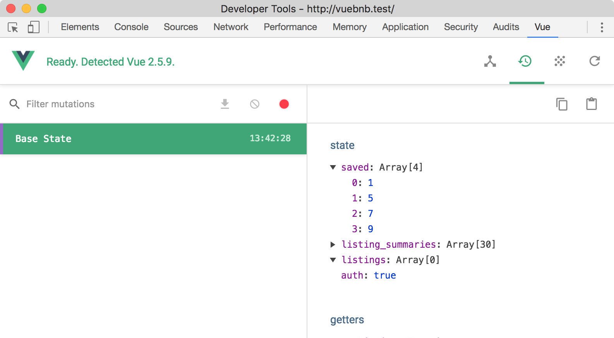
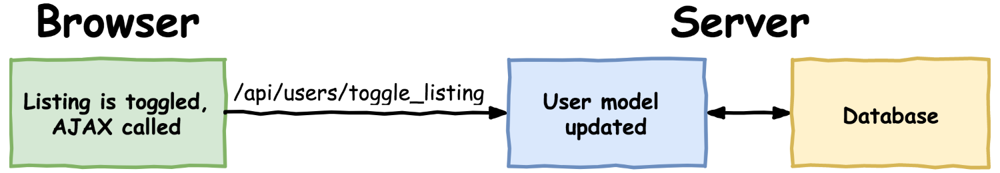
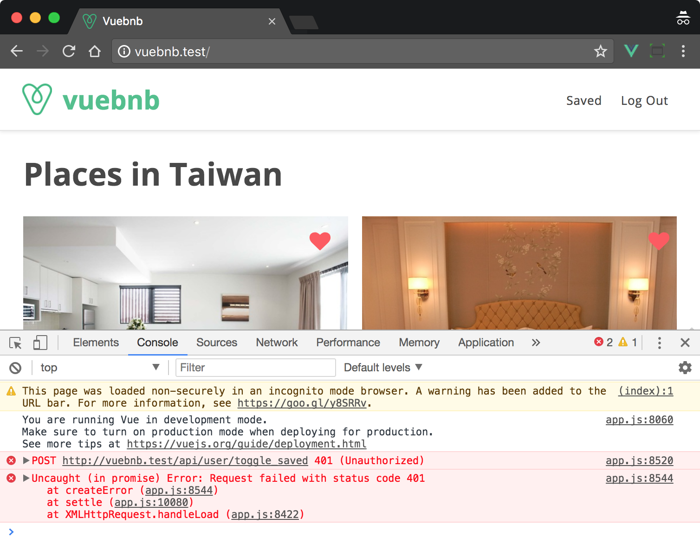

*************************************************
增加一个用户登陆和使用passport创建认证用户身份API
*************************************************

在上一章中，我们允许用户保存他们最喜欢的 ``Vuebnb`` 列表。此功能仅在前端应用程序中实现，因此如果用户重新加载页面，则其选择将丢失。

在本章中，我们将创建一个用户登录系统，并将保存的项目保存到数据库中，以便在页面刷新后检索它们。

本章涉及的主题：

- 使用 Laravel 的内置身份验证功能设置用户登录系统；
- 创建具有 ``CSRF`` 保护的登录表单；
- 将 ``Vuex`` 操作用于存储中的异步操作；
- ``API`` 身份验证的 ``OAuth`` 协议简介；
- 设置 Laravel Passport 以允许经过身份验证的 ``AJAX`` 请求；

用户模型
========
为了将列表项保存到数据库，我们首先需要一个用户模型，因为我们希望每个用户都有自己的唯一列表。添加用户模型意味着我们还需要一个身份验证系统，以便用户可以登录和注销。幸运的是， Laravel 提供了一个功能齐全的用户模型和开箱即用的身份验证系统。

现在让我们看看用户模型样板文件，看看为了我们的目的需要进行哪些修改。

迁移
----
首先查看数据库迁移，用户表模式已包含ID，名称，电子邮件和密码列。

database/migrations/2014_10_12_000000_create_users_table.php:

.. code-block:: php

    <?php

    use Illuminate\Support\Facades\Schema;
    use Illuminate\Database\Schema\Blueprint;
    use Illuminate\Database\Migrations\Migration;

    class CreateUsersTable extends Migration
    {
      public function up()
      {
        Schema::create('users', function (Blueprint $table) {
          $table->increments('id');
          $table->string('name');
          $table->string('email')->unique();
          $table->string('password');
          $table->rememberToken();
          $table->timestamps();
        });
      }

      public function down()
      {
        Schema::dropIfExists('users');
      }
    }

如果我们添加一个用于存储已保存列表IDs的附加列，则此架构将足以满足我们的需求。 理想情况下，我们将它们存储在一个数组中，但由于关系数据库没有数组列类型，我们将它们存储为序列化字符串，例如，在 ``text`` 列中 ``[1,5,10]`` 。

database/migrations/2014_10_12_000000_create_users_table.php:

.. code-block:: php

    <?php
    Schema::create('users', function (Blueprint $table) {
      ...
      $table->text('saved');
    });

模型
----
现在让我们来看看 Laravel 提供的 ``User`` 模型类。

app/User.php:

.. code-block:: php

    <?php

    namespace App;

    use Illuminate\Notifications\Notifiable;
    use Illuminate\Foundation\Auth\User as Authenticatable;

    class User extends Authenticatable
    {
      use Notifiable;

      protected $fillable = [
        'name', 'email', 'password',
      ];

      protected $hidden = [
        'password', 'remember_token',
      ];
    }

默认配置很好，但是允许通过将 ``saved`` 属性添加到 ``$fillable`` 数组来进行批量赋值。

当我们读取或写入时，我们还会让我们的模型序列化和反序列化 ``saved`` 文本。为此，我们可以向模型添加 ``$casts`` 属性，并转换 ``saved`` 为数组。

app/User.php:

.. code-block:: php

    <?php
    class User extends Authenticatable
    {
      ...

      protected $fillable = [
        'name', 'email', 'password', 'saved'
      ];

      ...

      protected $casts = [
        'saved' => 'array'
      ];
    }

现在我们可以将 ``saved`` 的属性视为数组，即使它作为字符串存储在数据库中：

.. code-block:: php

    <?php
    echo gettype($user->saved());

    // array

填充数据
--------
在具有登录系统的普通 ``Web`` 应用程序中，您将拥有一个注册页面，以便用户可以创建自己的帐户。为了确保本书不会太长，我们将跳过该功能，而是使用数据库播种器生成用户帐户：

.. code-block:: shell

    $ php artisan make:seeder UsersTableSeeder

.. tip:: 如果需要，您可以自己为 ``Vuebnb`` 实施注册页面。 Laravel 文档在 https://laravel.com/docs/5.5/authentication 中详细介绍了它。

让我们创建至少一个帐户，其中包含姓名，电子邮件，密码和已保存列表的数组。 请注意，我使用了 ``Hash`` 外观的 ``make`` 方法来哈希密码，而不是将其存储为纯文本。 Laravel 的默认 ``LoginController`` 将在登录过程中自动验证哈希的纯文本密码。

database/seeds/UsersTableSeeder.php:

.. code-block:: php

    <?php

    use Illuminate\Database\Seeder;
    use App\User;
    use Illuminate\Support\Facades\Hash;

    class UsersTableSeeder extends Seeder
    {
      public function run()
      {
        User::create([
          'name'      => 'Jane Doe',
          'email'     => 'test@gmail.com',
          'password'  => Hash::make('test'),
          'saved'     => [1,5,7,9]
        ]);
      }
    }

要运行播种器，我们需要从主 ``DatabaseSeeder`` 类中调用它。

database/seeds/DatabaseSeeder.php:

.. code-block:: php

    <?php
    use Illuminate\Database\Seeder;

    class DatabaseSeeder extends Seeder
    {
      public function run()
      {
        $this->call(ListingsTableSeeder::class);
        $this->call(UsersTableSeeder::class);
      }
    }

现在让我们重新运行我们的迁移和播种器，使用以下命令安装用户表和数据：

.. code-block:: shell

    $ php artisan migrate:refresh --seed

为了确认我们的用户表和数据是否正确创建，我们将使用 ``Tinker`` 查询表。您应该获得类似于以下内容的输出：

.. code-block:: shell

    $ php artisan tinker

    >>> DB::table('users')->get();

    /*
    {
      "id": 1,
      "name": "Jane Doe",
      "email": "test@gmail.com",
      "password": "...",
      "remember_token": null,
      "created_at": "2017-10-27 02:30:31",
      "updated_at": "2017-10-27 02:30:31",
      "saved": "[1,5,7,9]"
    }
    */

登陆系统
========
现在我们已经创建了用户模型，我们可以实现其余的登录系统。同样， Laravel 将其作为开箱即用的功能包含在内，因此我们只需要进行少量配置即可。

以下是登录系统的工作原理概述：

1. 用户在登录表单提供他们的电子邮件和密码。我们将使用 ``Vue`` 创建此表单；
2. 表单将提交到 ``/login POST`` 路由；
3. 然后， ``LoginController`` 将根据数据库验证用户的凭据；
4. 如果登录成功，则将用户重定向到主页。会话 ``cookie`` 附加到响应，然后传递给所有验证用户的请求；

以下是登录系统的图解表示，以进一步明确：

图 9.1 登陆流程

登陆页面组件
------------
我们需要一个应用程序的登录页面，所以让我们创建一个新的页面组件：

.. code-block:: shell

    $ touch resources/assets/components/LoginPage.vue

我们首先定义模板标记，其中包括一个包含电子邮件和密码字段的表单，以及一个提交按钮。 表单使用 ``HTTP POST`` 方法并发送到 ``/login`` 路径。我已经使用 ``div`` 元素将表单元素包装在其中并设置 ``.form-controller`` 样式。

resources/assets/components/LoginPage.vue:

.. code-block:: html

    <template>
      

        <form role="form" method="POST" action="/login">
          

            <input id="email" type="email" name="email"
              placeholder="Email Address" required autofocus>
          

          

            <input id="password" type="password" name="password"
              placeholder="Password" required>
          

          

            <button type="submit">Log in</button>
          

        </form>
      

    </template>

我们还不需要任何 JavaScript 功能，所以现在让我们添加 ``CSS`` 规则。

resources/assets/components/LoginPage.vue:

.. code-block:: css

    <template>...</template>
    

我们将向我们的全局 ``CSS`` 文件添加一个 ``login-container`` 类，以便该页面的页脚正确对齐。我们还将添加一个 ``CSS`` 规则，以确保在 ``iPhone`` 上正确显示文本输入。登录页面将是我们唯一可以输入文本的地方，但是如果您决定稍后添加其他表单，我们将其添加为全局规则。

resources/assets/css/style.css:

.. code-block:: css

    .login-container {
      margin: 0 auto;
      padding: 0 12px;
    }

    @media (min-width: 374px) {
      .login-container {
        width: 350px;
      }
    }

    input[type=text] {
      -webkit-appearance: none;
    }

最后，让我们将这个新的页面组件添加到我们的路由器中。我们首先导入组件，然后将其添加到路由器配置中的 ``routes`` 数组中。

请注意，登录页面不需要来自服务器的任何数据，不像 ``Vuebnb`` 的其他页面。这意味着我们可以通过修改导航防护中第一个 ``if`` 语句的逻辑来跳过数据获取步骤。如果路由的名称是 ``login`` ，它现在应该立即解析。

resources/assets/js/router.js:

.. code-block:: js

    ...

    import LoginPage from '../components/LoginPage.vue';

    let router = new VueRouter({
      ...
      routes: [
        ...
        { path: '/login', component: LoginPage, name: 'login' }
      ],
      ...
    });

    router.beforeEach((to, from, next) => {
      ...
      if (
        to.name === 'listing'
          ? store.getters.getListing(to.params.listing)
          : store.state.listing_summaries.length > 0
        || to.name === 'login'
      ) {
        next();
      }
      ...
    });

    export default router;

服务器端路由
------------
现在我们已经在 ``/login`` 路由添加了一个登录页面，我们需要创建一个匹配的服务器端路由。我们还需要一个登录到同一``/login`` 路径的登录表单的路由。

事实上，这两条路由都是由 Laravel 开箱即用的，作为其默认登录系统的一部分。我们要激活路由所需要做的就是将以下行添加到 ``Web`` 路由文件的底部。

routes/web.php:

.. code-block:: php

    <?php
    ...

    Auth::routes();

要查看此代码的效果，我们可以使用 ``Artisan`` 在我们的应用中显示路由列表：

.. code-block:: shell

    $ php artisan route:list

输出：

图 9.2 显示路由列表的终端输出

您将看到我们手动创建的所有路由，以及一些我们没有创建的路由，例如登录，注销和注册。 这些是我们刚刚激活的 Laravel 认证系统使用的路由。

查看 ``GET/HEAD /login`` 路由，您将看到它指向 ``LoginController`` 控制器。我们来看看那个文件。

App\Http\Controllers\Auth\LoginController.php:

.. code-block:: php

    <?php
    namespace App\Http\Controllers\Auth;

    use App\Http\Controllers\Controller;
    use Illuminate\Foundation\Auth\AuthenticatesUsers;

    class LoginController extends Controller
    {
      use AuthenticatesUsers;

      protected $redirectTo = '/home';

      public function __construct()
      {
        $this->middleware('guest')->except('logout');
      }
    }

此类使用 ``AuthenticatesUsers`` trait ，它定义 ``/login`` 路由处理程序引用的 ``showLoginForm`` 方法。让我们覆盖该方法，以便它只返回我们的应用程序视图。 由于视图的这个实例不需要在头部内联任何数据（登录表单没有状态），我们将空数组传递给 ``data`` 模板变量。

App\Http\Controllers\Auth\LoginController.php:

.. code-block:: php

    <?php
    class LoginController extends Controller
    {
      ...

      public function showLoginForm()
      {
        return view('app', ['data' => []]);
      }
    }

完成后，我们现在可以通过浏览器导航到 ``/login`` 来查看完整的登录页面：

图 9.3 登陆页面

CSRF保护
--------
``CSRF`` （跨站点请求伪造）是一种恶意攻击，攻击者会让用户在他们当前登录的服务器上不知不觉地执行操作。此操作将更改服务器上对攻击者有利的内容，例如，转移资金，将密码更改为攻击者知道的密码等等。

例如，攻击者可能会隐藏网页或电子邮件中的脚本，并以某种方式将用户引导至该网页。执行时，此脚本可以向 ``importantwebsite.com/updateEmailAndPassword`` 发出 ``POST`` 请求。如果用户登录到此站点，则该请求可能会成功。

防止此类攻击的一种方法是以用户可能提交的任何表单嵌入特殊 ``token`` ，实质上是随机字符串。提交表单时，将根据用户的会话检查令牌以确保其匹配。攻击者无法在其脚本中伪造此令牌，因此应该被此功能阻止。

在 Laravel 中， ``CSRF`` 令牌创建和验证由默认情况下添加到 ``Web`` 路由的 ``VerifyCsrfToken`` 中间件管理：

图 9.4 CSRF保护过程

要在表单中包含 ``CSRF`` 令牌，只需在表单标记中添加 ``{{ csrf_field（）}}`` 即可。 这将生成包含有效 ``CSRF`` 令牌的隐藏输入字段，例如：

.. code-block:: html

    <input type="hidden" name="_token" value="3B08L3fj...">

但是，这在我们的场景中不起作用，因为我们的表单不在 ``Blade`` 视图中，而是在单个文件组件内部，不会被 ``Blade`` 处理。作为替代方案，我们可以将 ``CSRF`` 令牌添加到页面的头部并将其分配给 ``window`` 对象。

resources/views/app.blade.php:

.. code-block:: html

    

我们现在可以从我们的 ``Vue.js`` 应用程序中检索它并手动将其添加到登录表单中。让我们修改 LoginPage 以在表单中包含隐藏的 ``input`` 字段。我们现在将向该组件添加一些状态，其中令牌作为数据属性包含在内并绑定到隐藏字段。

resources/assets/js/components/LoginPage.vue:

.. code-block:: html

    <template>
      

        <form role="form" method="POST" action="/login">
          <input type="hidden" name="_token" :value="csrf_token">
          ...
        </form>
      

    </template>
    
    

如果我们现在尝试使用我们在播种机中创建的用户的凭据登录我们的应用程序，我们将收到此错误页面。查看地址栏，您会看到我们所在的路由是 ``/home`` ，这不是我们应用中的有效路由，因此 ``NotFoundHttpException`` ：

Post登陆重定向
--------------
当用户登录后， Laravel 会将它们重定向到登录控制器中 ``$redirectTo`` 属性定义的页面。让我们把 ``/home`` 更改为 ``/`` 。

app/Http/Auth/Controllers/LoginController.php:

.. code-block:: php

    <?php
    class LoginController extends Controller
    {
      ...

      protected $redirectTo = '/';

      ...
    }

我们还要更新 ``RedirectIfAuthenticated`` 中间件类，以便如果登录用户尝试查看登录页面，则会将其重定向到 ``/``（而不是默认 ``/home`` 值）。

app/Http/Middleware/RedirectIfAuthenticated.php:

.. code-block:: php

    <?php
    ...

    if (Auth::guard($guard)->check()) {
      return redirect('/');
    }

完成后，我们的登录过程现在可以正常工作。

增加认证链接到工具栏
--------------------
现在让我们在工具栏中添加登录和注销链接，以便 ``Vuebnb`` 用户可以轻松访问这些功能。

登录链接只是指向 ``login`` 路由的 ``RouterLink`` 。

注销链接更有趣：我们从此链接捕获 ``click`` 事件并触发隐藏表单的提交。此表单向 ``/logout`` 服务器路由发送 ``POST`` 请求，该路由将用户注销并将其重定向回主页。请注意，我们必须将 ``CSRF`` 令牌作为隐藏输入包含在内。

resources/assets/components/App.vue:

.. code-block:: html

    <template>
      ...
      <ul class="links">
        <li>
          <router-link :to="{ name: 'saved' }">
            Saved
          </router-link>
        </li>
        <li>
          <router-link :to="{ name: 'login' }">
            Log In
          </router-link>
        </li>
        <li>
          <a @click="logout">Log Out</a>
          <form
            style="display: hidden"
            action="/logout"
            method="POST"
            id="logout"
          >
            <input type="hidden" name="_token" :value="csrf_token"/>
          </form>
        </li>
      </ul>
      ...
    </template>
    

保护保存的路由
--------------
我们现在可以使用我们的登录系统来保护来自访客的某些路由，即未经身份验证的用户。 Laravel 提供 ``auth`` 中间件，可以应用于任何路由，并且如果访客用户尝试访问它，则会将访客用户重定向到登录页面。让我们将其应用于我们保存的页面路由。

routes/web.php:

.. code-block:: php

    <?php
    Route::get('/saved', 'ListingController@get_home_web')->middleware('auth');

如果您退出应用程序并尝试从浏览器的导航栏访问此路由，您会发现它会将您重定向回 ``/login`` 。

将身份验证状态传递给前端
========================
我们现在有一个完整的机制来记录用户进出 ``Vuebnb`` 。但是，前端应用程序尚未了解用户的身份验证状态。让我们现在解决这个问题，以便我们可以在前端添加基于身份验证的功能。

auth元数据属性
--------------
我们首先将身份验证状态添加到我们在每个页面的头部传递的元信息中。我们将使用 ``Auth facade check`` 方法，如果用户通过身份验证，则返回 ``true`` ，并将其分配给新的 ``auth`` 属性。

app/Http/Controllers/ListingController.php:

.. code-block:: php

    <?php
    use Illuminate\Support\Facades\Auth;

    class ListingController extends Controller
    {
      ...

      private function add_meta_data($collection, $request)
      {
        return $collection->merge([
          'path' => $request->getPathInfo(),
          'auth' => Auth::check()
        ]);
      }
    }

我们还将为我们的 ``Vuex store`` 添加 ``auth`` 属性。我们将从 ``addData`` 方法改变它，正如您在上一章中所回忆的那样，我们从文档头或 ``API`` 中检索数据。由于 ``API`` 不包含元数据，因此我们将有条件地改变 ``auth`` 属性以避免访问可能未定义的对象属性。

resources/assets/js/store.js:

.. code-block:: js

    export default new Vuex.Store({
      state: {
        ...
        auth: false
      },
      mutations: {
        ...
        addData(state, { route, data }) {
          if (data.auth) {
            state.auth = data.auth;
          }
          if (route === 'listing') {
            state.listings.push(data.listing);
          } else {
            state.listing_summaries = data.listings;
          }
        }
      },
      getters: { ... }
    });

完成后， ``Vuex`` 现在正在跟踪用户的身份验证状态。请务必通过登录和注销来测试这一点，并在 Vue Devtools 的 ``Vuex`` 选项卡中注意 ``auth`` 的值：

图9.6 autue在Vue Devtools中的值

认证状态响应
------------
现在我们正在跟踪用户的身份验证状态，我们可以让 ``Vuebnb`` 对其进行响应。首先，让我们这样做，以便除非用户登录，否则用户无法保存列表。为此，我们将修改 ``toggleSaved`` ``mutator`` 方法的行为，以便在用户登录时可以保存 ``item`` ，但如果不是，则通过 ``Vue Router`` 的 ``push`` 方法将它们重定向到登录页面。

请注意，我们必须在文件顶部导入路由器模块才能访问其功能。

resources/assets/js/store.js:

.. code-block:: js

    import router from './router';

    export default new Vuex.Store({
      ...
      mutations: {
        toggleSaved(state, id) {
          if (state.auth) {
            let index = state.saved.findIndex(saved => saved === id);
            if (index === -1) {
              state.saved.push(id);
            } else {
              state.saved.splice(index, 1);
            }
          } else {
            router.push('/login');
          }
        },
        ...
      },
      ...
    });

我们还可以使登录链接或注销链接显示在工具栏中，而不是两者都显示。这可以通过在工具栏中使用依赖于 ``$store.state.auth`` 值的 ``v-if`` 和 ``v-else`` 指令来实现。

除非用户已登录，否则隐藏已保存项的页面链接也是有意义的，所以我们也这样做。

resources/assets/components/App.vue:

.. code-block:: html

    <ul class="links">
      <li v-if="$store.state.auth">
        <router-link :to="{ name: 'saved' }">
          Saved
        </router-link>
      </li>
      <li v-if="$store.state.auth">
        <a @click="logout">Log Out</a>
        <form
          style="display: hidden"
          action="/logout"
          method="POST"
          id="logout"
        >
          <input type="hidden" name="_token" :value="csrf_token"/>
        </form>
      </li>
      <li v-else>
        <router-link :to="{ name: 'login' }">
          Log In
        </router-link>
      </li>
    </ul>

这是工具栏现在的样子，具体取决于用户是登录还是退出：

图9.8 工具栏中登录和注销状态的比较

从数据库检索保存项
==================
现在让我们从数据库中检索已保存的项目并在前端显示它们。首先，我们将向文档头中放置的元数据添加一个新 ``saved`` 属性。如果用户已注销，则该数组将为空数组，如果已登录，则为与该用户关联的已保存列表 ``IDs`` 数组。

app/Http/Controllers/ListingController.php:

.. code-block:: php

    <?php
    private function add_meta_data($collection, $request)
    {
      return $collection->merge([
        'path' => $request->getPathInfo(),
        'auth' => Auth::check(),
        'saved' => Auth::check() ? Auth::user()->saved : []
      ]);
    }

回到前端，我们将把用于检索已保存项目的逻辑放在 ``beforeEach`` 路由器导航防护中。我们把它放在这里而不是 ``addData`` 变异的原因是我们不想直接将数据分配给存储状态，而是为每个列表调用 ``toggleSaved`` 变异。您不能从另一个突变中提交突变，因此必须在 ``store`` 外部进行。

resources/assets/js/router.js:

.. code-block:: js

    router.beforeEach((to, from, next) => {
      let serverData = JSON.parse(window.vuebnb_server_data);
      if ( ... ) { ... }
      else if ( ... ) { ... }
      else {
        store.commit('addData', {route: to.name, data: serverData});
        serverData.saved.forEach(id => store.commit('toggleSaved', id));
        next();
      }
    });

我们还删除我们在上一章中保存的占位符列表 ``IDs`` ，以便初始化时存储为空。

resources/assets/js/store.js:

.. code-block:: js

    state: {
      saved: [],
      listing_summaries: [],
      listings: [],
      auth: false
    }

完成后，如果我们检查 Vue Devtools ，我们应该发现数据库中保存的列表现在与前端中的列表匹配：

.. code-block:: shell

    $ php artisan tinker
    >>> DB::table('users')->select('saved')->first();
    # "saved": "[1,5,7,9]"

持久化保存项列表
================
持久保存列表项的机制如下：当在前端应用程序中切换喜欢的列表项时，我们触发一个 ``AJAX`` 请求，将 ``ID`` 发送到后端的路由。此路由调用将更新模型的控制器：

我们现在实现这个机制。

创建一个API路由
---------------
我们将从服务器端开始，并添加路由让前端 ``POST`` 列表 ``IDS`` 到它。我们需要添加 ``auth`` 中间件，以便只有经过身份验证的用户才能访问此路由（我们将很快讨论： ``api`` 的含义）。

routes/api.php:

.. code-block:: php

    <?php
    Route::post('/user/toggle_saved', 'UserController@toggle_saved')
      ->middleware('auth:api');

由于这是一个 ``API`` 路由，因此其完整路径为 ``/api/user/toggle_saved`` 。 我们还没有创建这个路由调用的控制器， ``UserController`` ，所以我们现在创建它：

.. code-block:: shell

    $ php artisan make:controller UserController

在这个新的控制器中，我们将添加 ``toggled_saved`` 处理方法。由于这是一个 ``HTTP POST`` 路由，因此该方法可以访问表单数据。我们将这样做，以便前端 ``AJAX`` 调用此路由包括一个 ``id`` 字段，它将是我们要切换的列表 ``ID`` 。要访问此字段，我们可以使用 ``Input`` facade ，即 ``Input::get('id')`` 。

由于我们在此路由上使用 ``auth`` 中间件，因此我们可以使用 ``Auth::user()`` 方法检索与请求关联的用户模型。然后，我们可以在用户保存的列表中添加或删除 ``ID`` ，就像我们在 ``Vuex store`` 中的 ``toggledSaved`` 方法中做的一样。

一旦切换 ``ID`` 后，我们可以使用模型的 ``save`` 方法将更新持久化到数据库。

app/Http/Controllers/UserController.php:

.. code-block:: php

    <?php

    ...

    use Illuminate\Support\Facades\Auth;
    use Illuminate\Support\Facades\Input;

    class UserController extends Controller
    {
      public function toggle_saved()
      {
        $id = Input::get('id');
        $user = Auth::user();
        $saved = $user->saved;
        $key = array_search($id, $saved);
        if ($key === FALSE) {
            array_push($saved, $id);
        } else {
            array_splice($saved, $key, 1);
        }
        $user->saved = $saved;
        $user->save();
        return response()->json();
      }
    }

Vuex动作
--------
在第8章“使用 ``Vuex`` 管理应用程序状态”中，我们讨论了 ``Flux`` 模式的关键原则，包括突变必须同步的原则，以避免使我们的应用程序数据无法预测的竞争条件。

如果您需要在 ``mutator`` 方法中包含异步代码，则应该创建一个 ``action`` 。行为就像突变，但不是直接改变状态，而是提交突变。 例如：

.. code-block:: js

    var store = new Vuex.Store({
      state: {
        val: null
      },
      mutations: {
        assignVal(state, payload) {
          state.val = payload;
        }
      },
      actions: {
        setTimeout(() => {
          commit('assignVal', 10);
        }, 1000)
      }
    });

    store.dispatch('assignVal', 10);

通过将异步代码抽象为动作，我们仍然可以将任何状态改变逻辑集中在 ``store`` 中，而不会通过竞争条件污染我们的应用程序数据。

AJAX请求
--------
现在让我们使用 ``AJAX`` 在保存列表项时向 ``/api/user/toggle_saved`` 发出请求。我们将此逻辑放入 ``Vuex`` 操作( ``actions`` )中，以便在 ``AJAX`` 调用解析之前不会提交 ``toggleSaved`` 突变。 我们将 ``Axios HTTP`` 库导入到 ``store`` 中以促进这一点。

另外，让我们将身份验证检查从突变移动到操作，因为在启动 ``AJAX`` 调用之前进行此检查是有意义的。

resources/assets/js/store.js:

.. code-block:: js

    import axios from 'axios';

    export default new Vuex.Store({
      ...
      mutations: {
        toggleSaved(state, id) {
          let index = state.saved.findIndex(saved => saved === id);
          if (index === -1) {
            state.saved.push(id);
          } else {
            state.saved.splice(index, 1);
          }
        },
        ...
      },
      ...
      actions: {
        toggleSaved({ commit, state }, id) {
          if (state.auth) {
            axios.post('/api/user/toggle_saved', { id }).then(
              () => commit('toggleSaved', id)
            );
          } else {
            router.push('/login');
          }
        }
      }
    });

我们现在需要从 ``ListingSave`` 组件中调用 ``toggledSaved`` 操作，而不是变异。调用操作的方式与突变完全相同，只有术语从 ``commit`` 更改为 ``dispatch`` 。

resources/assets/components/ListingSave.vue:

.. code-block:: js

    toggleSaved() {
      this.$store.dispatch('toggleSaved', this.id);
    }

前端中此功能的代码是正确的，但如果我们测试它并尝试保存项目，我们会从服务器获得 401 Unauthenticated 错误：

API身份认证
===========
我们将 ``auth`` 中间件添加到 ``/api/user/toggle_saved`` 路由以保护其免受 ``guest`` 用户的攻击。我们还为这个中间件指定了 ``api`` guard ，即 ``auth:api`` 。

``Guards`` 定义用户的身份验证方式，并在以下文件中进行配置。

config/auth.php:

.. code-block:: php

    <?php
    return [
      ...
      'guards' => [
        'web' => [
          'driver' => 'session',
          'provider' => 'users',
        ],
        'api' => [
          'driver' => 'token',
          'provider' => 'users',
        ],
      ],
      ...
    ];

我们的 ``Web`` 路由使用会话驱动程序，它使用会话 ``cookie`` 维护身份验证状态。会话驱动程序随 Laravel 一起提供，并且可以开箱即用。但是， ``API`` 路由默认使用令牌保护。我们还没有实现这个驱动程序，因此我们的 ``AJAX`` 调用是未经授权的。

我们也可以将会话驱动程序用于 ``API`` 路由，但不建议这样做，因为会话身份验证不足以支持 ``AJAX`` 请求。我们将使用实现 ``OAuth`` 协议的 ``passport`` guard。

.. tip:: 你可能会看到 ``auth`` 被用作 ``auth:web`` 的简写，因为 ``web guard`` 是默认的。

OAuth
-----
``OAuth`` 是一种授权协议，允许第三方应用程序在不泄露密码的情况下访问服务器上的用户数据。访问此受保护数据是通过交换授予应用程序的特殊令牌，并且用户已将自己标识给服务器。 ``OAuth`` 的典型用例是社交登录，例如，当您将 ``Facebook`` 或 ``Google`` 登录用于您自己的网站时。

制作安全 ``AJAX`` 请求的一个挑战是您无法在前端源代码中存储任何凭据，因为攻击者找到这些凭据是很容易的。 ``OAuth`` 的简单实现，其中第三方应用程序实际上是您自己的前端应用程序，是一个很好的解决方案。 这是我们现在为 ``Vuebnb`` 采取的方法。

.. tip:: 虽然 ``OAuth`` 是 ``API`` 身份验证的绝佳解决方案，但它也是我在本书中无法完全涵盖的深入主题。 我建议您阅读本指南以获得更好的理解： https://www.oauth.com/ 。

Laravel Passport
----------------
Laravel Passport 是 ``OAuth`` 的一种实现，可以在 Laravel 应用程序中轻松设置。我们现在安装它以便在 ``Vuebnb`` 中使用。

首先，使用 ``Composer`` 安装 ``Passport`` ：

.. code-block:: shell

    $ composer require laravel/passport

``Passport`` 包括新的数据库迁移，这些迁移生成存储 ``OAuth tokens`` 所需的表。我们来运行迁移：

.. code-block:: shell

    $ php artisan migrate

以下命令将安装生成安全令牌所需的加密密钥：

.. code-block:: shell

    $ php artisan passport:install

运行此命令后，将 ``Laravel\Passport\HasApiTokens`` trait 添加到用户模型。

app/User.php:

.. code-block:: php

    <?php
    use Laravel\Passport\HasApiTokens;

    class User extends Authenticatable
    {
      use HasApiTokens, Notifiable;

      ...
    }

最后，在 ``config/auth.php`` 配置文件中，让我们将 ``API guard`` 的驱动程序选项设置为 ``passport`` 。这确保了 ``auth`` 中间件将使用 ``Passport`` 作为 ``API`` 路由的保护。

config/auth.php:

.. code-block:: php

    <?php
    'guards' => [
      'web' => [
        'driver' => 'session',
        'provider' => 'users',
      ],

      'api' => [
        'driver' => 'passport',
        'provider' => 'users',
      ],
    ],

关联tokens
----------
``OAuth`` 要求在用户登录时将访问令牌发送到前端应用程序。 ``Passport`` 包含一个可以为您处理此问题的中间件。将 ``CreateFreshApiToken`` 中间件添加到 ``Web`` 中间件组，然后 ``laravel_token`` ``cookie`` 将附加到传出响应。

app/Http/Kernel.php:

.. code-block:: js

    protected $middlewareGroups = [
      'web' => [
        ...
        // 注意这是在web中而不是api路由组中
        \Laravel\Passport\Http\Middleware\CreateFreshApiToken::class,
      ],

上面的中间件目的是，当在访问 ``web`` 页面时，如果用户已经登陆，则把用户 ``id`` 和 ``crsf token`` 封装到 ``api token`` 中。并通过 ``cookie`` 返回给客户端。

当客户单通过 ``AJAX`` 来访问 ``api`` 接口时， ``TokenGuard`` 会检索 ``cookie`` 中的 ``token`` 来获取用户 ``id`` 和 ``csrf token`` 。如果 ``csrf token`` 验证(通过验证请求头中的 ``token`` 和 ``cookie`` 中的 ``token`` 是否相等)通过，则使用用户 ``id`` 来检索用户。

对于传出请求，我们需要为 ``AJAX`` 调用添加一些标头。我们可以让 ``Axios`` 默认自动附加这些。 ``'X-Requested-With':'XMLHttpRequest'`` 确保 Laravel 知道请求来自 ``AJAX`` ，而 ``'X-CSRF-TOKEN':window.csrf_token`` 附加 ``CSRF`` 令牌。

resources/assets/js/store.js:

.. code-block:: js

    axios.defaults.headers.common = {
      'X-Requested-With': 'XMLHttpRequest',
      'X-CSRF-TOKEN': window.csrf_token
    };

    export default new Vuex.Store({
      ...
    });

完成后，我们的 ``API`` 请求现在应该进行正确的身份验证。为了测试这一点，让我们使用 ``Tinker`` 查看我们为第一个种子用户保存的项目：

.. code-block:: shell

    $ php artisan tinker

    >>> DB::table('users')->select('saved')->first();

    # "saved": "[1,5,7,9]"

确保您以该用户身份登录并在浏览器中加载 ``Vuebnb`` 。切换一些已保存的列表选项，然后重新运行上面的查询。您应该发现数据库现在持久保存已保存的列表项 ``ID`` 。

总结
====
在本章中，我们了解了全栈 Vue/Laravel 应用程序中的身份验证，包括基于会话的 ``Web`` 路由身份验证，以及使用 Laravel Passport 的 ``API`` 路由的基于令牌的身份验证。

我们利用这些知识为 ``Vuebnb`` 建立登录系统，并允许将保存的房间列表项保存到数据库中。

在此过程中，我们还学习了如何利用 ``CSRF`` 令牌来保护表单，以及如何使用 ``Vuex`` 操作将异步代码添加到 ``store`` 。

在接下来的最后一章中，我们将学习如何通过将 ``Vuebnb`` 部署到免费的 Heroku PHP 服务器来将全栈 Vue 和 Laravel 应用程序部署到生产环境中。我们还将开始从免费 ``CDN`` 提供图像和其他静态内容。

