*******************
用Vue路由器构建一个多页面的应用程序
*******************

.. contents:: 目录
   :depth: 4

在上一章中，我们了解了 ``Vue.js`` 组件，并将 ``Vuebnb`` 转换为基于组件的体系结构。 现在我们已经完成了这个工作，我们可以使用 ``Vue Router`` 轻松地将新页面添加到我们的应用程序中。

在本章中，我们将为 ``Vuebnb`` 创建一个主页，其中包括一个可点击缩略图库，展示全套模拟列表。

本章涵盖的主题：

- 解释什么是路由器库，以及它们为什么是单页应用程序的关键部分；
- ``Vue`` 路由器及其主要特性概述；
- ``Vue Router`` 的安装和基本配置；
- 使用 ``RouterLink`` 和 ``RouterView`` 特殊组件来管理页面导航；
- 在 ``Vue`` 中使用 ``AJAX`` 可以在不刷新页面的情况下从 ``Web`` 服务中检索数据；
- 在加载新页面之前使用路由导航警卫来检索数据；

单页面应用
==========
大多数网站都被分成多个网页，以便使他们所包含的信息更易于使用。传统上，这是通过服务器/客户端模型完成的，其中每个页面必须使用不同的 ``URL`` 从服务器加载。要导航到新页面，浏览器必须向该页面的 ``URL`` 发送请求。服务器将发回数据，浏览器可以卸载现有页面并加载新页面。对于普通的互联网连接，这个过程可能需要几秒钟的时间，在此期间用户必须等待新页面加载。

通过使用强大的前端框架和 ``AJAX`` 工具，可以使用不同的模型：浏览器可以加载初始网页，但导航到新页面不需要浏览器卸载页面并加载新页面。相反，新页面所需的任何数据都可以使用 ``AJAX`` 异步加载。从用户的角度来看，这样一个网站看起来像其他网页一样，但从技术角度来看，这个网站实际上只有一个页面。因此，名称，单页面应用程序（SPA）。

单页应用程序体系结构的优点是可以为用户创建更加无缝的体验。新页面的数据仍然需要检索，并且因此会对用户的流程造成一些小的中断，但是由于数据检索可以异步完成并且 ``JavaScript`` 可以继续运行，所以这种中断被最小化了。而且，由于 ``SPA`` 页面由于重新使用某些页面元素而通常需要较少的数据，因此页面加载更快。

``SPA`` 体系结构的缺点是，由于增加了功能，它使得客户端应用程序变得笨重，因此用户必须在第一次加载页面时下载大型应用程序，否则加速页面更改的收益可能会被抵消。此外，处理路由会增加应用程序的复杂性，因为必须管理多个状态，必须处理 ``URL`` 以及必须在应用程序中重新创建大量浏览器默认功能。

路由器
======
如果您打算使用 ``SPA`` 架构，并且您的应用设计包含多个页面，则需要使用路由器。在这种情况下，路由器是一个库，它将通过 ``JavaScript`` 和各种本机 ``API`` 模拟浏览器导航，以便用户获得类似于传统多页应用的体验。 路由器通常会包含以下功能：

- 处理页面内的导航操作
- 将应用程序的部分与路由匹配
- 管理地址栏
- 管理浏览器历史记录
- 管理滚动条行为

Vue路由器
=========
一些前端框架（如 ``Angular`` 或 ``Ember`` ）包括一个开箱即用的路由器库。 指导这些框架的理念是开发人员可以更好地为他们的 ``SPA`` 提供完整的集成解决方案。

其他框架/库，如 ``React`` 和 ``Vue.js`` ，不包括路由器。 相反，你必须安装一个单独的库。

在 ``Vue.js`` 的情况下，可以使用称为 ``Vue`` 路由器的官方路由器库。该库由 ``Vue.js`` 核心团队开发，因此针对 ``Vue.js`` 的使用进行了优化，充分利用了基本的 ``Vue`` 特性，如组件和反应性。

使用 ``Vue`` 路由器，应用程序的不同页面由不同的组件表示。 当你设置 ``Vue`` 路由器时，你会通过配置告诉它哪个 ``URL`` 映射到哪个组件。 然后，当在应用程序中点击链接时， ``Vue`` 路由器将切换活动组件以匹配新的 ``URL`` ，例如：

.. code-block:: js

    let routes = [
      { path: '/', component: HomePage },
      { path: '/about', component: AboutPage },
      { path: '/contact', component: ContactPage }
    ];

由于在一般情况下渲染组件几乎是一个瞬间过程，因此使用 ``Vue Router`` 进行页面之间的转换也是如此。 但是，如果您的不同页面需要加载数据，则可以调用异步挂钩以使您有机会从服务器加载新数据。

具体的组件
----------
当您安装 ``Vue`` 路由器时，将在您的应用中全局注册两个组件： ``RouterLink`` 和 ``RouterView`` 。

通常使用 ``RouterLink`` 代替 ``a`` 标签，并让您的链路访问 ``Vue Router`` 的特殊功能。

如上所述， ``Vue`` 路由器将切换指定的页面组件作为模仿浏览器导航的方式。 `` RouterView`` 是发生此组件切换的出口。 就像插槽一样，您可以将它放在主页面模板的某个位置。 例如：

.. code-block:: html

    

      <header></header>
      <router-view>
        // This is where different page components display
      </router-view>
      <footer></footer>
    

Vuebnb路由
==========
``Vuebnb`` 从未成为单页应用程序的既定目标。 事实上， ``Vuebnb`` 将会偏离纯粹的 ``SPA`` 架构，我们将在本书后面看到。

也就是说，整合 ``Vue`` 路由器对于用户在应用中导航的体验非常有益，因此我们将在本章中将其添加到 ``Vuebnb`` 。

当然，如果我们要添加路由器，我们将需要一些额外的页面！到目前为止，在该项目中，我们一直在研究 ``Vuebnb`` 的列表页面，但尚未开始在应用的首页上工作。因此，除了安装 ``Vue`` 路由器之外，我们还将开始 ``Vuebnb`` 主页的工作，该主页会显示缩略图和指向我们所有模拟列表的链接：

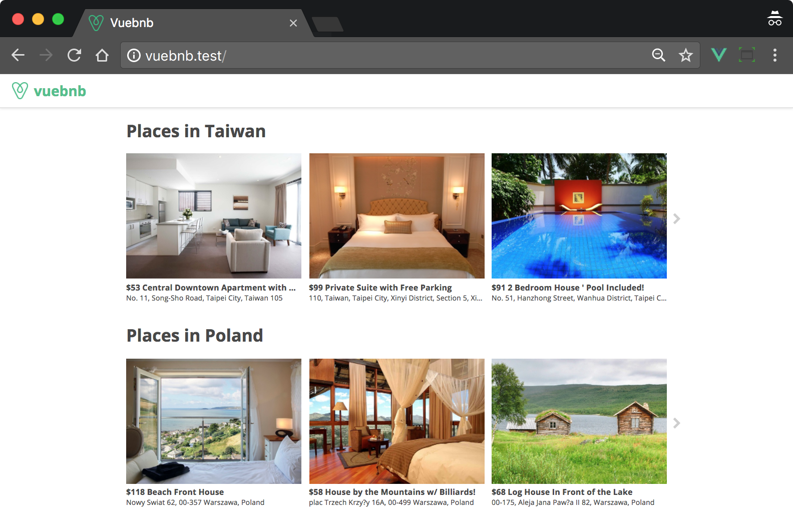

   图7.1 Vuebnb前端页面

安装Vue路由器
=============
``Vue Router`` 是一个 ``NPM`` 软件包，可以在命令行上安装：

.. code-block:: shell

    $  npm i --save-dev vue-router

创建路由配置文件 ``router.js``

.. code-block:: shell

    $ touch resources/assets/js/router.js

要将 ``Vue Router`` 添加到我们的项目中，我们必须导入该库，然后使用 ``Vue.use``  API方法使 ``Vue`` 与 ``Vue Router`` 兼容。这将给 ``Vue`` 一个新的配置属性， ``router`` ，我们可以用它来连接一个新的路由器。

然后我们用新的 ``VueRouter()`` 创建一个 ``Vue`` 路由器的实例。

resources/assets/js/router.js:

.. code-block:: js

    import Vue from 'vue';
    import VueRouter from 'vue-router';
    Vue.use(VueRouter);

    export default new VueRouter();

通过从这个新文件中导出我们的路由器实例，我们已经将它创建为一个可以在 ``app.js`` 中导入的模块。 如果我们命名导入的模块为 ``router`` ，则可以使用对象解构来简洁地将其连接到我们的主配置对象。

resources/assets/js/app.js:

.. code-block:: js

    import "core-js/fn/object/assign";
    import Vue from 'vue';

    import ListingPage from '../components/ListingPage.vue';
    import router from './router'

    var app = new Vue({
      el: '#app',
      render: h => h(ListingPage),
      router
    });

创建路由
========
``Vue Router`` 的最基本配置是提供一个 ``routes`` 数组，它将 ``URL`` 映射到相应的页面组件。该数组将包含具有至少两个属性的对象： ``path`` 和 ``component`` 。

.. note:: 请注意，通过页面组件，我只是指用来在我们的应用中表示页面的任何组件。 它们是任何形式的常规组件。

现在，我们只会在我们的应用中使用两条路由，一条用于我们的主页，另一条用于我们的列表页面。 ``HomePage`` 组件尚不存在，因此我们将保留其路由注释，直到我们创建它。

resources/assets/js/router.js:

.. code-block:: js

    import ListingPage from '../components/ListingPage.vue';

    export default new VueRouter({
      mode: 'history',
      routes: [
        // { path: '/', component: HomePage }, // doesn't exist yet!
        { path: '/listing/:listing', component: ListingPage }
      ]
    });

您会注意到我们的 ``ListingPage`` 组件的路径包含一个动态细分 ``:listing`` ，以便此路由将匹配路径，包括 ``/listing/1`` ， ``listing/2 ... listing/whatever`` 。

.. note::  ``Vue`` 路由器有两种模式：哈希模式和历史模式。 哈希模式使用 ``URL`` 哈希模拟完整的 ``URL`` ，以便在哈希更改时不会重新加载页面。 历史记录模式具有真实 ``URL`` ，并利用 ``history.pushState`` API更改 ``URL`` 而不会导致页面重新加载。 历史模式唯一的缺点是应用程序外部的 ``URL`` （例如 ``/some/weird/path`` ）不能由 ``Vue`` 处理，必须由服务器处理。 这对我们来说没有问题，所以我们将使用 ``Vuebnb`` 的历史记录模式。

App组件
=======
为了让路由器工作，我们需要在我们页面模板中某个地方声明一个 ``RouterView`` 组件。否则，页面没有地方来渲染组件。

我们将会稍微重构我们的应用。事实上， ``ListingPage`` 组件是应用程序的 ``root`` 组件，因为它位于组件层次结构的顶部，并加载我们使用的所有其他组件。

因为我们想要基于 ``URL`` 在 ``ListingPage`` 和 ``HomePage`` 之间切换，我们需要另一个位于 ``ListingPage`` 层次之上的组件，以便让它工作。我们叫这个新的根组件为 ``App`` :

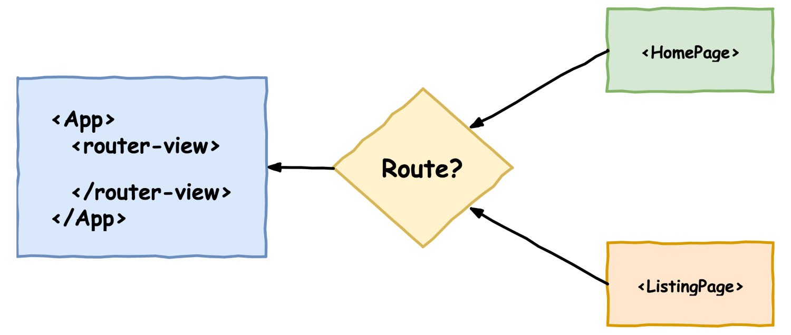

图 7.2 APP，ListingPage和HomePage之间的关系

让我们创建 ``App`` 组件文件：

.. code-block:: shell

    $ touch resources/assets/components/App.vue

当 ``Vue`` 的根实例加载的时候，应该把它渲染为页面，而不是 ``ListingPage`` 。

resources/assets/js/app.js:

.. code-block:: js

  import App from '../components/App.vue';

  ...

  var app = new Vue({
    el: '#app',
    render: h => h(App),
    router
  });

接下来使 ``App`` 组件的内容。我们已经增加特殊的 ``RouterView`` 组件到模板中，这是 ``HomePage`` 或 ``ListingPage`` 组件将渲染的位置。

您还会注意到我已将工具栏从 ``app.blade.php`` 移动到 ``App`` 的模板中。这样工具栏就在 ``Vue`` 的域中; 之前它在装载点之外，因此 ``Vue`` 无法触及。我这样做以便我们可以使用 ``RouterLink`` 使主 ``logo`` 链接到主页，因为这是大多数网站的惯例。我已将任何与工具栏相关的 ``CSS`` 移动到样式元素中。

resources/assets/components/App.vue:

.. code-block:: html

  <template>
    

      

        
        <h1>vuebnb</h1>
      

      <router-view></router-view>
    

  </template>
  

完成后，如果您现在将浏览器导航到像 ``/listing/1`` 这样的 ``URL`` ，您将看到所有内容与之前相同。但是，如果您查看 ``Vue Devtools`` ，您将看到组件层次结构已更改，反映了 ``App`` 组件的添加。

还有一个指示器，它告诉我们 ``ListingPage`` 组件是 ``Vue Router`` 的活动页面组件：

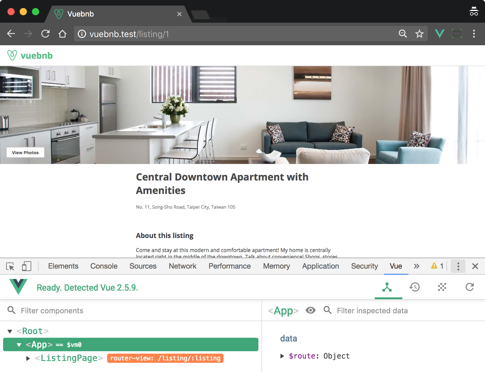

Home页面
=========
我们现在开始创建主页面。首先我们创建一个新的组件， ``HomePage`` ：

.. code-block:: shell

    $ touch resources/assets/components/HomePage.vue

现在，在正确设置之前，让我们在组件中添加占位符标记。

resources/assets/components/HomePage.vue:

.. code-block:: html

  <template>
    
Vuebnb home page

  </template>

确保在 ``router`` 文件中引入该组件，然后配置路由映射。

resources/assets/js/router.js:

.. code-block:: js

  ....

  import HomePage from '../components/HomePage.vue';
  import ListingPage from '../components/ListingPage.vue';

  export default new VueRouter({
    mode: 'history',
    routes: [
      { path: '/', component: HomePage },
      { path: '/listing/:listing', component: ListingPage }
    ]
  });

.. tip:: 您可能想通过将 URL(http://vuebnb.test/) 放入浏览器地址栏来测试这条新路线。 但是，您会发现它会导致 404 错误。请记住，我们还没有在我们的服务器上为此创建路由。 虽然 Vue 正在管理应用程序内的路由，但任何地址栏导航请求必须由 Laravel 提供。

现在让我们使用 ``RouterLink`` 组件在工具栏中创建指向主页的链接。该组件类似于增强 ``a`` 标签。例如，如果为路由指定 ``name`` 属性，则只需使用 ``to`` 属性而不必提供 ``href`` 。 ``Vue`` 会在渲染时将其解析为正确的 ``URL`` 。

resources/assets/components/App.vue:

.. code-block:: html

  

    <router-link :to="{ name: 'home' }">
      
      <h1>vuebnb</h1>
    </router-link>
  

我们需要添加 ``name`` 属性到我们的路由，以便让它工作。

resources/assets/js/app.js:

.. code-block:: js

  routes: [
    { path: '/', component: HomePage, name: 'home' },
    { path: '/listing/:listing', component: ListingPage, name: 'listing' }
  ]

因为我们使用另外标签封装了 ``logo`` ，我们同样需要修改我们 ``CSS`` 。修改的工具栏 ``CSS`` 规则匹配如下：

resources/assets/components/App.vue:

.. code-block:: html

  <template>...</template>
  

现在，我们打开列表页面，如 ``/listing/1`` 。如果你监控DOM，你会看到我们的工具栏里面有一个新的 ``a`` 标签，其中有一个正确解析的链接指向主页：

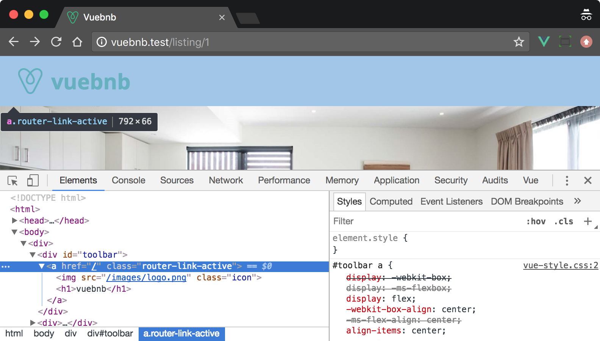

如果单击该链接，您将进入主页！ 请记住，页面实际上没有改变； ``Vue`` 路由器只是在 ``RouterView`` 中切换了 ``ListPage`` 为 ``HomePage`` 页面，并通过 ``history.pushState`` API 更新了浏览器 ``URL`` ：

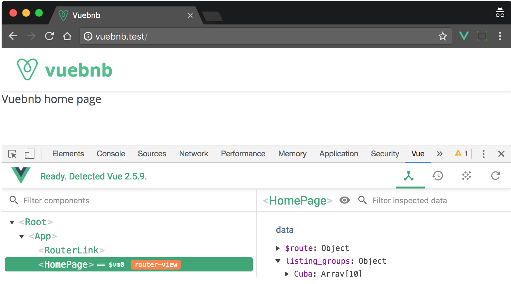

Home路由
========
现在让我们为主页添加服务器端路由，以便我们可以从根路径加载我们的应用程序。这个新路由将指向 ``ListingController`` 类中的 ``get_home_web`` 方法。

routes/web.php:

.. code-block:: php

  <?php
  Route::get('/', 'ListingController@get_home_web');

  Route::get('/listing/{listing}', 'ListingController@get_listing_web');

现在转到控制器，我们将使它成为 ``get_home_web`` 方法返回 ``app`` 视图，就像它对列表 ``Web`` 路由一样。 ``app`` 视图包含一个模板变量模型，我们用它来传递初始应用程序状态，如第5章“将 ``Laravel`` 和 ``Vue.js`` 与 ``Webpack`` 整合”中所述。现在，只需将空数组指定为占位符即可。

app/Http/Controllers/ListingController.php:

.. code-block:: php

  <?php
  public function get_home_web()
  {
    return view('app', ['model' => []]);
  }

完成后，我们现在可以导航到 ``http://vuebnb.test/`` ，它将工作！ 当 ``Vue`` 应用程序启动时， Vue Router 将检查 ``URL`` 值，并且看到路径为 ``/``，将在 ``RouterView`` 插座内加载 ``HomePage`` 组件，以便首次渲染应用程序。

查看此页面的源码，它与我们加载列表路径时的页面完全相同，因为它是相同的视图，即 ``app.blade.php`` 。 唯一的区别是初始状态是一个空数组：

.. image:: ./images/7-6.png

初始状态
--------
就像我们的列表页面一样，我们的主页需要初始状态。查看完成的产品，我们可以看到主页显示了我们所有模拟列表的摘要，其中包含缩略图，标题和简短描述：

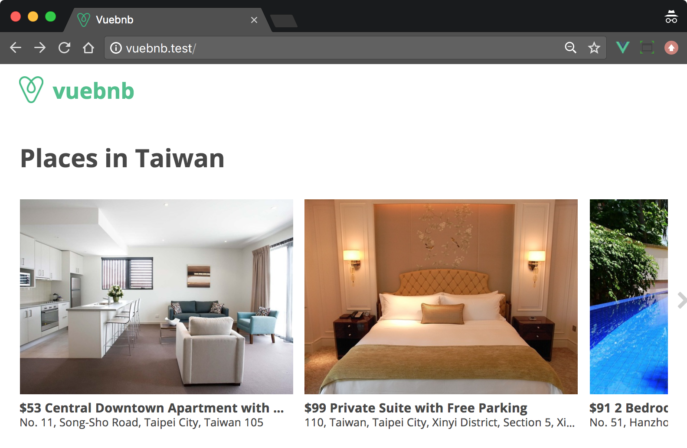

重构
^^^^^
在我们将初始状态注入主页之前，让我们对代码进行一些小的重构，包括重命名一些变量并重构一些方法。这将确保代码语义能够反映不断变化的需求，并使代码可读且易于理解。

首先，让我们将模板变量 ``$model`` 重命名为更通用的 ``$data`` 。

resources/views/app.blade.php:

.. code-block:: html

  

在我们的列表控制器中，我们现在要将列表路由方法中的任何常见逻辑抽象为一个名为 ``get_listing`` 的新辅助方法。在这个帮助器方法中，我们将 ``Listing`` 模型嵌入在 ``listing`` 键下的 Laravel Collection 中。 ``Collection`` 是 Eloquent 模型的类似数组的包装器，它提供了一系列方便的方法，我们很快就会使用它们。 ``get_listing`` 将包含 ``add_image_urls`` 帮助器方法中的逻辑，现在可以安全地删除它。

当我们调用 ``view`` 方法时，我们还需要反映模板变量的变化。

app/Http/Controllers/ListingController.php:

.. code-block:: php

  <?php
  private function get_listing($listing)
  {
    $model = $listing->toArray();
    for($i = 1; $i <=4; $i++) {
      $model['image_' . $i] = asset(
        'images/' . $listing->id . '/Image_' . $i . '.jpg'
      );
    }
    return collect(['listing' => $model]);
  }

  public function get_listing_api(Listing $listing)
  {
    $data = $this->get_listing($listing);
    return response()->json($data);
  }

  public function get_listing_web(Listing $listing)
  {
    $data = $this->get_listing($listing);
    return view('app', ['data' => $data]);
  }

  public function get_home_web()
  {
    return view('app', ['data' => []]);
  }

最后，我们需要更新我们的 ListingPage 组件来反应我们注入的服务器端数据的名称和结构。

resources/assets/components/ListingPage.vue:

.. code-block:: html

  

主页初始状态
^^^^^^^^^^^^
使用 Eloquent ORM ，使用 ``Listing::all`` 方法检索所有列表条目是微不足道的。此方法在 ``Collection`` 对象中返回多个 ``Model`` 实例。

请注意，我们不需要模型上的所有字段，例如， ``amenities`` ， ``about`` 等等，不会在填充主页的列表摘要中使用。为了确保我们的数据尽可能精简，我们可以将一个字段数组传递给 ``Listing::all`` 方法，该方法将告诉数据库仅包含明确提到的那些字段。

app/Http/Controllers/ListingController.php:

.. code-block:: php

  <?php
  public function get_home_web()
  {
    $collection = Listing::all([
      'id', 'address', 'title', 'price_per_night'
    ]);
    $data = collect(['listings' => $collection->toArray()]);
    return view('app', ['data' => $data]);
  }

  /*
    [
      "listings" => [
        0 => [
          "id" => 1,
          "address" => "...",
          "title" => "...",
          "price_per_night" => "..."
        ]
        1 => [ ... ]
        ...
        29 => [ ... ]
      ]
    ]
  */

增加缩略图
^^^^^^^^^^
每个模拟列表都有第一个图像的缩略图版本，可用于列表摘要。缩略图比我们用于列表页面标题的图像小得多，非常适合主页上的列表摘要。 缩略图的 ``URL`` 是 ``public/images/{x}/Image_1_thumb.jpg`` ，其中 ``{x}`` 是列表的 ``ID`` 。

``Collection`` 对象有一个辅助方法 ``transform`` ，我们可以使用它来将缩略图图像 ``URL`` 添加到每个列表中。 ``transform`` 接受一个每个项目调用一次的回调闭包函数，允许您修改该项目并将其返回到集合中。

app/Http/Controllers/ListingController.php:

.. code-block:: php

  <?php
  public function get_home_web()
  {
    $collection = Listing::all([
      'id', 'address', 'title', 'price_per_night'
    ]);
    $collection->transform(function($listing) {
      $listing->thumb = asset(
        'images/' . $listing->id . '/Image_1_thumb.jpg'
      );
      return $listing;
    });
    $data = collect(['listings' => $collection->toArray()]);
    return view('app', ['data' => $data]);
  }

  /*
    [
      "listings" => [
        0 => [
          "id" => 1,
          "address" => "...",
          "title" => "...",
          "price_per_night" => "...",
          "thumb" => "..."
        ]
        1 => [ ... ]
        ...
        29 => [ ... ]
      ]
    ]
  */

在客户端接收
^^^^^^^^^^^^
现在初始状态已准备就绪，让我们将其添加到 ``HomePage`` 组件中。在我们使用它之前，我们需要考虑另外一个方面：列表摘要按国家/地区分组。 再看一下图7.7，看看这些组是如何显示的。

在我们解析了注入的数据之后，让我们修改对象，以便按国家/地区对列表进行分组。 我们可以很容易地创建一个函数来执行此操作，因为每个列表对象都具有一个地址属性，其中该国家总是被明确命名，例如，台湾市台湾市万华区汉中街51号108。

为了节省你必须编写这个函数，我在 ``helper`` 模块中提供了一个名为 ``groupByCountry`` 的模块，它可以在组件配置的顶部导入。

resources/assets/components/HomePage.vue:

.. code-block:: js

  ...

  

我们现在将通过 Vue Devtools 看到 ``HomePage`` 已成功加载列表摘要，按国家/地区分组并准备显示：

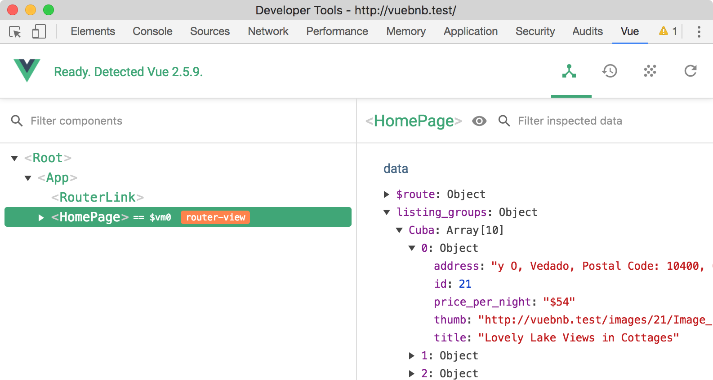

ListingSummary组件
==================
既然 ``HomePage`` 组件有可用的数据，我们可以继续显示它。

首先，清除组件的现有内容并将其替换为 ``div`` 。这个 ``div`` 将以 ``v-for`` 指令来遍历每个列表组。由于 ``listing_groups`` 是一个具有键/值对的对象，因此我们将给出 ``v-for`` 两个别名： ``group`` 和 ``country`` ，它们分别是每个对象项的值和键。

我们将在标题内插入 ``country`` 。 ``group`` 将在下一节中使用。

resources/assets/components/HomePage.vue:

.. code-block:: html

  <template>
    

      

        <h1>Places in {{ country }}</h1>
        

            Each listing will go here
        

      

    

  </template>
  

这就是主页现在的样子：

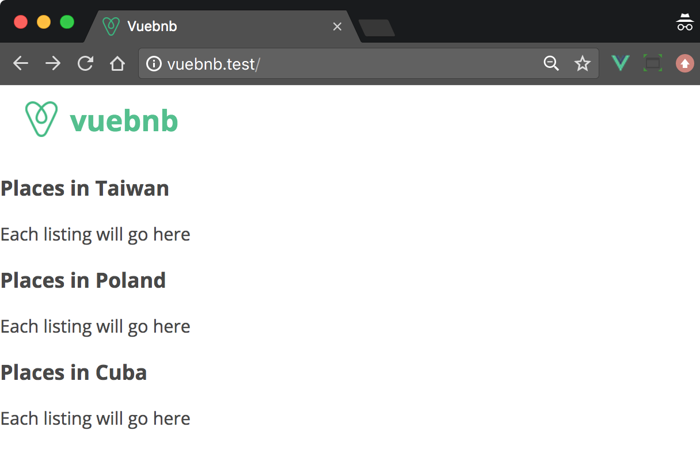

图7.9 迭代HomePage组件中的列表摘要组

由于每个列表摘要都会有一些复杂性，我们将创建一个单独的组件 ``ListingSummary`` 来显示它们：

.. code-block:: shell

    $ touch resources/assets/components/ListingSummary.vue

让我们在 ``HomePage`` 模板中声明 ``ListingSummary`` 。 我们将再次使用 ``v-for`` 指令迭代 ``group`` (一个数组)，为每个成员创建一个新的 ``ListingSummary`` 实例。 每个成员的数据将绑定到一个插值 ``listing`` 。

resources/assets/components/HomePage.vue:

.. code-block:: html

  <template>
    

      

        <h1>Places in {{ country }}</h1>
        

          <listing-summary
            v-for="listing in group"
            :key="listing.id"
            :listing="listing"
          ></listing-summary>
        

      

    

  </template>
  

让我们为 ``ListingSummary`` 组件创建一些简单的内容，只是为了测试我们的方法。

resources/assets/components/ListingSummary.vue:

.. code-block:: html

  <template>
    

      {{ listing.address }}
    

  </template>
  

刷新我们的页面，我们现在将看到我们的列表摘要的原型：

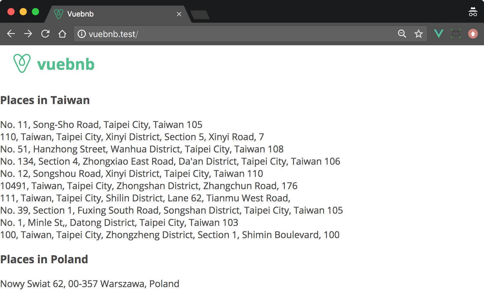

图 7.10 ListingSummary组件原型

由于这种方法有效，现在让我们完成 ``ListingSummary`` 组件的结构。要显示缩略图，我们将其绑定为固定宽度/高度 div 的背景图像。 我们还需要一些 CSS 规则才能很好地显示它。

resources/assets/components/ListingSummary.vue:

.. code-block:: html

  <template>
    

      

        

        

          {{ listing.price_per_night }}
          {{ listing.title }}
        

        
{{ listing.address }}

      

    

  </template>
  
  

添加该代码后，您的商家信息摘要将如下所示：

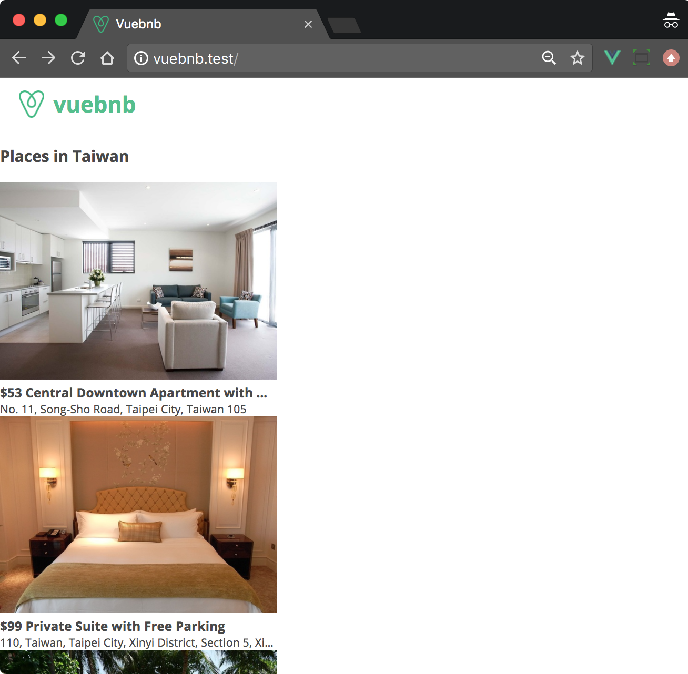

我们为每个列表摘要提供了固定的宽度/高度，以便我们可以在整齐的网格中显示它们。 目前，它们显示在一个高列中，因此我们将一些 ``CSS flex`` 规则添加到 ``HomePage`` 组件以将摘要放入行中。

我们将向包含摘要的元素添加类 ``listing-summary-group`` 。我们还将向根 ``div`` 添加一个类 ``home-container`` ，以约束页面的宽度并使内容居中。

resources/assets/components/HomePage.vue:

.. code-block:: html

  <template>
    

      

        ...
      

    

  </template>
  
  

最后，我们需要添加规则以防止列表强制文档边缘超出视口。将其添加到主 ``CSS`` 文件中。

resources/assets/css/style.css:

.. code-block:: css

  html, body {
    overflow-x: hidden;
  }

有了它，我们得到一个漂亮的主页：

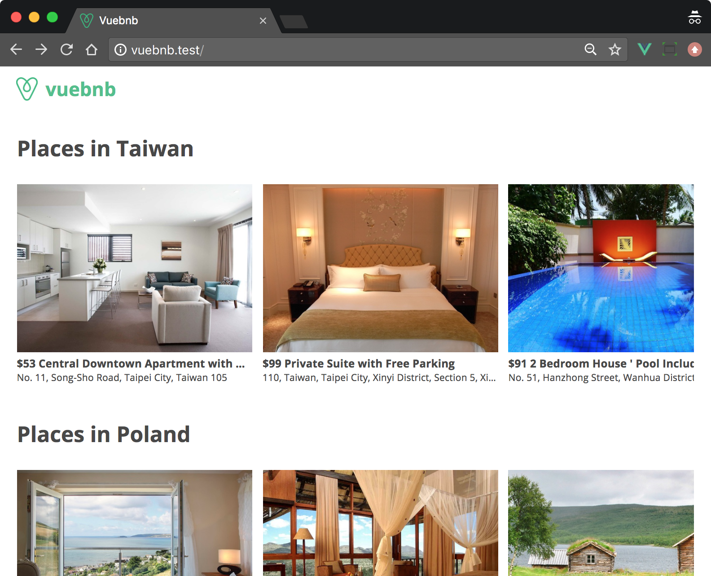

图 7.12 行中列表摘要

您会注意到，在整页宽度，我们只能看到每个国家/地区组中的三个列表。其他七个被CSS ``overflow:hidden`` 。 很快，我们将为每个组添加图像滑块功能，以允许用户浏览所有列表。

app内导航
=========
如果我们使用浏览器的地址栏导航到主页 ``http://vuebnb.test/`` ，它的工作原理是因为Laravel现在正在这条路由上提供一个页面。 但是，如果我们从列表页面导航到主页，则不再有任何页面内容：

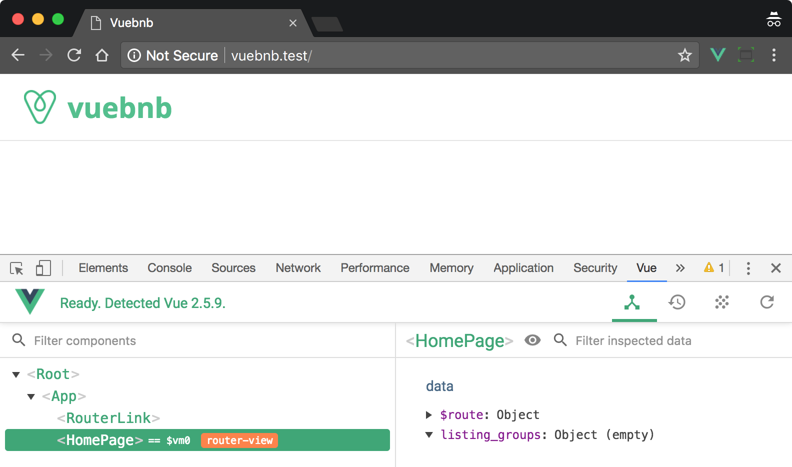

图7.13 当从列表页面导航到主页后，主页为空

我们目前在主页上没有任何指向列表页面的链接，但如果我们这样做，我们会遇到类似的问题。

原因是我们的页面组件当前从我们注入文档头部的数据中获得了初始状态。 如果我们使用不调用页面刷新的 ``Vue Router`` 导航到不同的页面，则下一页面组件将合并错误的初始状态。

我们需要改进我们的架构，以便在导航页面时检查注入头部的模型是否与当前页面匹配。 为此，我们将向模型添加 ``path`` 属性，并检查它是否与活动 ``URL`` 匹配。如果没有，我们将使用 ``AJAX`` 从 ``Web`` 服务获取正确的数据：

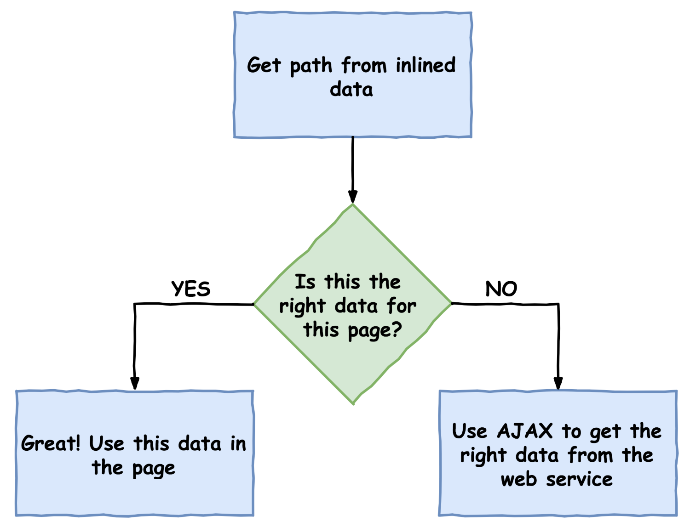

图 7.14 一个页面如何确定需要什么数据

.. tip:: 如果您有兴趣阅读有关此设计模式的更多信息，请查看文章 https://vuejsdevelopers.com/2017/08/06/vue-js-laravel-full-stack-ajax/ 中的避免在全栈应用程序中的这种常见反模式。

给模型增加一个路径
------------------
让我们转到列表控制器，并为注入我们视图头部的数据添加 ``path`` 属性。为此，我们将添加一个名为 ``add_meta_data`` 的辅助函数，它将在后面的章节中添加路径以及其他一些元属性。

请注意，当前路由的路径可以由 ``Request`` 对象确定。 此对象可以声明为任何 ``route-handling`` 函数的最后一个参数，并由服务容器在每个请求中提供。

app/Http/Controllers/ListingController.php:

.. code-block:: php

  <?php
  private function add_meta_data($collection, $request)
  {
    return $collection->merge([
      'path' => $request->getPathInfo()
    ]);
  }

  public function get_listing_web(Listing $listing, Request $request)
  {
    $data = $this->get_listing($listing);
    $data = $this->add_meta_data($data, $request);
    return view('app', ['data' => $data]);
  }

  public function get_home_web(Request $request)
  {
    $collection = Listing::all([
      'id', 'address', 'title', 'price_per_night'
    ]);
    $collection->transform(function($listing) {
      $listing->thumb = asset(
        'images/' . $listing->id . '/Image_1_thumb.jpg'
      );
      return $listing;
    });
    $data = collect(['listings' => $collection->toArray()]);
    $data = $this->add_meta_data($data, $request);
    return view('app', ['data' => $data]);
  }

  /*
    [
      "listings" => [ ... ],
      "path" => "/"
    ]
  */

路由导航卫士
------------
与生命周期钩子类似，导航卫士允许您在生命周期的特定点拦截 ``Vue`` 路由器导航。 这些卫士可以应用于特定组件，特定路由或所有路由。

例如， ``afterEach`` 是在导航离开任何路由后调用的导航卫士。 您可以使用此挂钩来存储分析信息，例如：

.. code-block:: js

  router.afterEach((to, from) => {
    storeAnalytics(userId, from.path);
  })

如果头部中的数据不合适，我们可以使用 ``beforeRouteEnter`` 导航卫士来从我们的 ``Web`` 服务获取数据。考虑以下伪代码，了解我们如何实现这一点：

.. code-block:: js

  beforeRouteEnter(to, from, next) {
    if (to !== injectedData.path) {
      getDataWithAjax.then(data => {
        applyData(data)
      })
    } else {
      applyData(injectedData)
    }
    next()
  }

next
^^^^^
导航卫士的一个重要功能是它们将停止导航，直到调用 ``next`` 函数。这允许在导航解决之前执行异步代码：

.. code-block:: js

  beforeRouteEnter(to, from, next) {
    new Promise(...).then(() => {
      next();
    });
  }

您可以将 ``false`` 传递给 ``next`` 函数以阻止导航，或者您可以传递不同的路径来重定向它。 如果您未传递任何内容，则会认为导航已确认。

``beforeRouteEnter`` 卫士是一个特例。首先， ``this`` 未定义的，因为它是在创建下一个页面组件之前调用的：

.. code-block:: js

  beforeRouteEnter(to, from, next) {
    console.log(this); // undefined
  }

但是， ``beforeRouteEnter`` 中的 ``next`` 函数可以接受回调函数作为参数，例如 ``next(component => {...});``  ``component`` 是页面组件实例。

在确认路由并创建组件实例之前，不会触发此回调。由于 JavaScript 闭包的工作方式，回调函数可以访问调用它的周围代码的范围：

.. code-block:: js

  beforeRouteEnter(to, from, next) {
    var data = { ... }
    next(component => {
      component.$data = data;
    });
  }

主页组件
--------
让我们将 ``beforeRouteEnter`` 添加到 ``HomePage`` 组件。首先，将用于从文档头检索数据的任何逻辑移动到该钩子中。然后，我们检查数据的 ``path`` 属性，看它是否与当前路由匹配。如果是这样，我们调用 ``next`` 并传递一个回调函数，该函数将数据应用于组件的实例。如果没有，我们需要使用 ``AJAX`` 来获取正确的数据。

resources/assets/components/HomePage.vue:

.. code-block:: js

  export default {
    data() {
      return {
        listing_groups: []
      };
    },
    components: {
      ListingSummary
    },
    beforeRouteEnter(to, from, next) {
      let serverData = JSON.parse(window.vuebnb_server_data);
      if (to.path === serverData.path) {
        let listing_groups = groupByCountry(serverData.listings);
        next(component => component.listing_groups = listing_groups);
      } else {
        console.log('Need to get data with AJAX!')
        next(false);
      }
    }
  }

.. hint:: 我已将 ``listing_groups`` 添加为数据属性。之前，我们在创建组件实例时将其应用于组件实例。现在，我们在创建组件后应用数据。为了设置反应数据， ``Vue`` 必须知道数据属性的名称，因此我们使用空值初始化，并在需要使用该数据时更新它。

主页API接口
-----------
我们现在将实现 ``AJAX`` 功能。 但是，在我们开始之前，我们需要在 ``Web`` 服务中添加主页端点。

我们首先添加主页 ``API`` 路由。

routes/api.php:

.. code-block:: php

  Route::get('/', 'ListingController@get_home_api');

现在看一下 ``ListingController`` 类，我们将把 ``get_home_web`` 中的大部分逻辑抽象为一个新函数 ``get_listing_summaries`` 。 然后我们将在 ``get_home_api`` 方法中使用此函数并返回 ``JSON`` 响应。

app/Http/Controllers/ListingController.php:

.. code-block:: php

  <?php
  private function get_listing_summaries()
  {
    $collection = Listing::all([
      'id', 'address', 'title', 'price_per_night'
    ]);
    $collection->transform(function($listing) {
      $listing->thumb = asset(
        'images/' . $listing->id . '/Image_1_thumb.jpg'
      );
      return $listing;
    });
    return collect(['listings' => $collection->toArray()]);
  }

  public function get_home_web(Request $request)
  {
    $data = $this->get_listing_summaries();
    $data = $this->add_meta_data($data, $request);
    return view('app', ['data' => $data]);
  }

  public function get_home_api()
  {
    $data = $this->get_listing_summaries();
    return response()->json($data);
  }

Axios
-----
要对 ``Web`` 服务执行 ``AJAX`` 请求，我们将使用 ``Axios`` ``HTTP`` 客户端，该客户端包含在 Laravel 的默认前端代码中。 ``Axios`` 有一个非常简单的 ``API`` ，允许我们向 GET URL 发出如下请求：

.. code-block:: js

    axios.get('/my-url');

``Axios`` 是一个基于 ``Promise`` 的库，因此为了检索响应，您可以简单地链接一个 ``then`` 回调：

.. code-block:: js

  axios.get('/my-url').then(response => {
    console.log(response.data); // Hello from my-url
  });

由于已经安装了 Axios NPM 软件包，我们可以继续导入 ``HomePage`` 组件。然后我们可以使用它来执行对主 ``API`` 端点 ``/api/`` 的请求。在 ``then`` 回调中，我们将返回的数据应用到组件实例，就像我们对内联模型所做的那样。

resources/assets/components/HomePage.vue:

.. code-block:: js

  ...
  import axios from 'axios';

  export default {
    data() { ... },
    components: { ... },
    beforeRouteEnter (to, from, next) {
      let serverData = JSON.parse(window.vuebnb_server_data);
      if (to.path === serverData.path) {
        let listing_groups = groupByCountry(serverData.listings);
        next(component => component.listing_groups = listing_groups);
      } else {
        axios.get(`/api/`).then(({ data }) => {
          let listing_groups = groupByCountry(data.listings);
          next(component => component.listing_groups = listing_groups);
        });
      }
    }
  }

有了它，我们现在可以通过两种方式导航到主页，通过地址栏，或从列表页面的链接。 无论哪种方式，我们都能获得正确的数据！

Mixins
------
如果您具有组件之间通用的任何功能，则可以将其放在 ``mixin`` 中以避免重写相同的功能。

``Vue mixin`` 是与组件配置对象相同形式的对象。要在组件中使用它，请在数组中声明并将其分配给配置属性 ``mixins`` 。实例化此组件时， ``mixin`` 的任何配置选项都将与您在组件上声明的内容合并：

.. code-block:: js

  var mixin = {
    methods: {
      commonMethod() {
        console.log('common method');
      }
    }
  };

  Vue.component('a', {
    mixins: [ mixin ]
  });

  Vue.component('b', {
    mixins: [ mixin ]
    methods: {
      otherMethod() { ... }
    }
  });

您可能想知道如果组件配置具有与 ``mixin`` 冲突的方法或其他属性会发生什么。答案是 ``mixins`` 有一个合并策略，可以确定任何冲突的优先级。通常，组件的指定配置优先。合并策略的细节在 http://vuejs.org 的 ``Vue.js`` 文档中进行了解释。

将解决方案移至mixin中
---------------------
让我们概括一下将正确的数据输入主页的解决方案，以便我们也可以在列表页面上使用它。为此，我们将 ``Axios`` 和 ``beforeRouteEnter`` 挂钩从 ``HomePage`` 组件移动到 ``mixin`` 中，然后可以将其添加到两个页面组件中：

.. code-block:: shell

    $ touch resources/assets/js/route-mixin.js

同时，让我们通过删除 ``next`` 函数重复调用来改进代码。为此，我们将创建一个新方法 ``getData`` ，它将负责确定从哪里获取页面的正确数据以及获取它。 请注意，此方法将是异步的，因为它可能需要等待 ``AJAX`` 解析，因此它将返回 ``Promise`` 而不是实际值。然后在导航防护中解决此 ``Promise`` 。

resources/assets/js/route-mixin.js:

.. code-block:: js

  import axios from 'axios';

  function getData(to) {
    return new Promise((resolve) => {
      let serverData = JSON.parse(window.vuebnb_server_data);
      if (!serverData.path || to.path !== serverData.path) {
        axios.get(`/api${to.path}`).then(({ data }) => {
          resolve(data);
        });
      } else {
        resolve(serverData);
      }
    });
  }

  export default {
    beforeRouteEnter: (to, from, next) => {
      getData(to).then((data) => {
        next(component => component.assignData(data));
      });
    }
  };

.. tip:: 我们不需要 ``Promise`` 的 ``polyfill`` ，因为它已在 ``Axios`` 库中提供。

assignData
^^^^^^^^^^
您会注意到，在 ``next`` 回调中，我们在目标组件上调用一个名为 ``assignData`` 的方法，将数据对象作为参数传递。我们需要在使用此 ``mixin`` 的任何组件中实现 ``assignData`` 方法。 我们这样做，以便组件可以在应用到组件实例之前处理数据（如有必要）。 例如， ``ListingPage`` 组件必须通过 ``populateAmenitiesAndPrices`` 帮助函数处理数据。

resources/assets/components/ListingPage.vue:

.. code-block:: js

  import routeMixin from '../js/route-mixin';

  export default {
    mixins: [ routeMixin ],
    data() {
      return {
        title: null,
        about: null,
        address: null,
        amenities: [],
        prices: [],
        images: []
      }
    },
    components: { ... },
    methods: {
      assignData({ listing }) {
        Object.assign(this.$data, populateAmenitiesAndPrices(listing));
      },
      openModal() {
        this.$refs.imagemodal.modalOpen = true;
      }
    }
  }

我们还需要将 ``assignData`` 添加到 ``HomePage`` 组件。

resources/assets/components/HomePage.vue:

.. code-block:: html

  

链接到列表详情页面
------------------
上面代码应该可以工作但我们无法测试它，因为还没有任何应用程序链接到列表详情页面！

我们的每个 ``ListingSummary`` 实例都代表一个列表，因此应该是该列表详情页面的可点击链接。让我们使用 ``RouterLink`` 组件来实现这一目标。请注意，我们绑定到 ``to`` 插值的对象包括路由的名称以及 ``params`` 对象，该对象包括路由的动态段的值，列表 ``ID`` 。

resources/assets/components/ListingSummary.vue:

.. code-block:: html

  

    <router-link :to="{ name: 'listing', params: { listing: listing.id } }">
      

        

        

          {{ listing.price_per_night }}
          {{ listing.title }}
        

        
{{ listing.address }}

      

    </router-link>
  

完成后，列表摘要现在将成为链接。 点击一个到列表页面，我们看到：

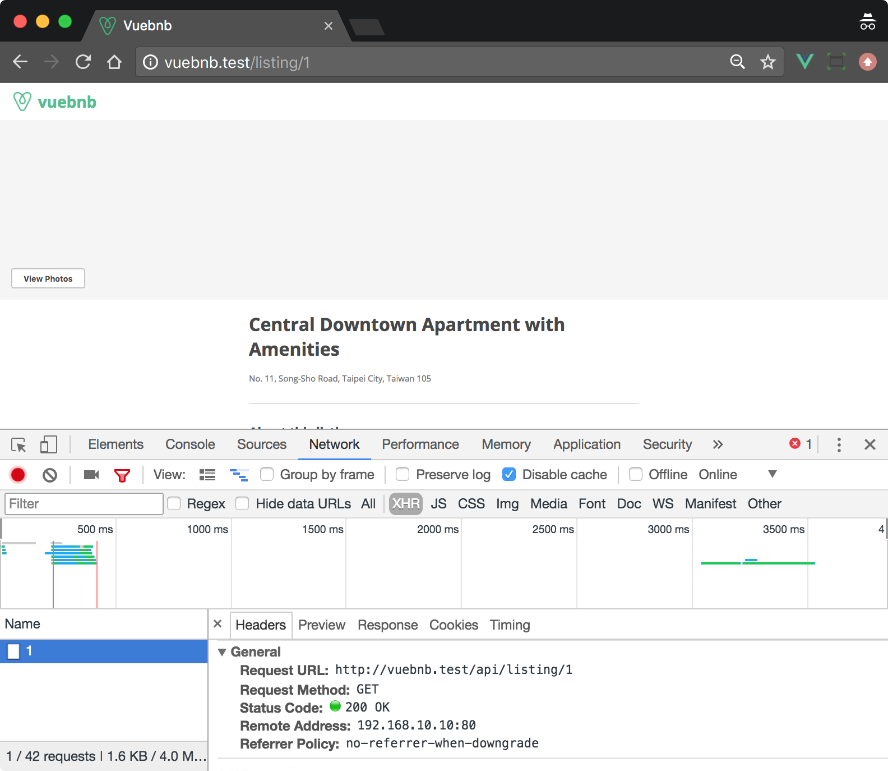

图 7.15 导航到列表页面后成功进行AJAX调用

我们可以在图7.15中看到对列表 ``API`` 的 ``AJAX`` 调用是成功的，并返回了我们想要的数据。如果我们还查看 Vue Devtools 选项卡以及 Dev Tools 控制台，我们可以在组件实例中看到正确的数据。 问题是我们现在文件图像有一个未处理的 404 错误：

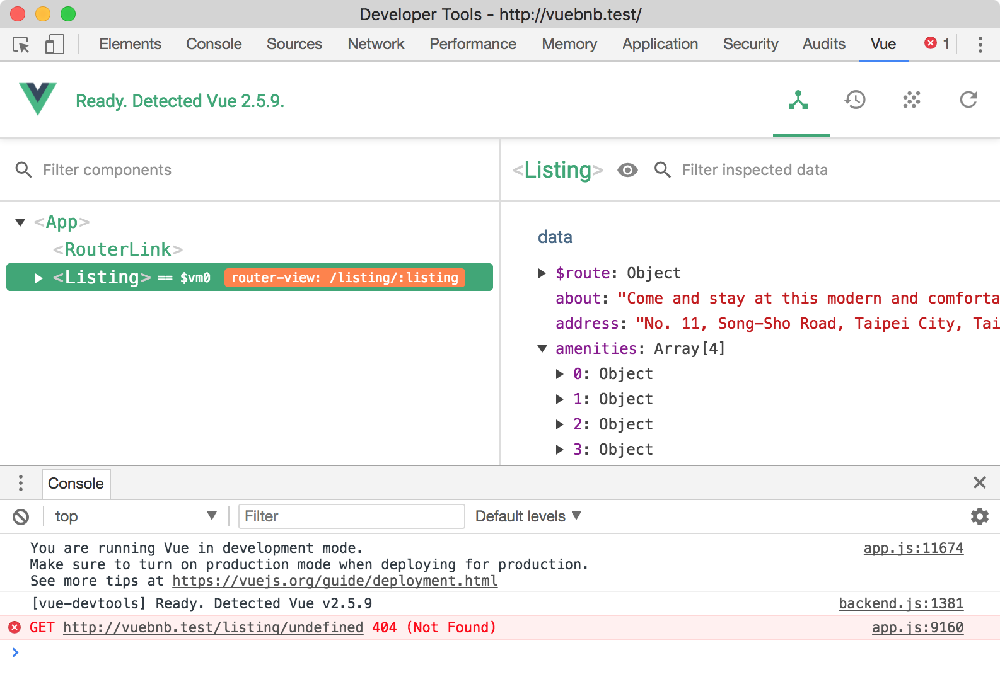

滚动行为
========
浏览器自动管理的网站导航的另一个方面是滚动行为。例如，如果滚动到页面底部，然后导航到新页面，则重置滚动位置。但是，如果您返回上一页，浏览器会记住滚动位置，您将被带回底部。

当我们用 Vue Router 劫持导航时，浏览器无法执行此操作。因此，当您滚动到 Vuebnb 主页的底部并单击( ``Cuba`` )古巴中的列表时，假设在加载列表页面组件时滚动位置保持不变。这对用户来说真的很不自然，他们希望被带到新页面的顶部：

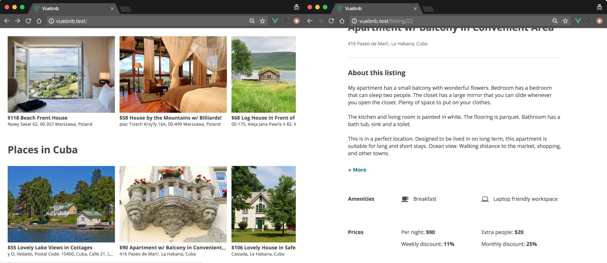

图7.17 使用Vue Router导航后滚动位置问题

Vue Router 有一个 ``scrollbehavior`` 方法，通过简单地定义水平和垂直滚动条的 ``x`` 和 ``y`` 位置，您可以在更改路径时调整页面滚动的位置。为了保持简单，并且仍然保持用户体验的自然，让我们这样做，以便在加载新页面时我们始终位于页面顶部。

resources/assets/js/router.js:

.. code-block:: js

  export default new VueRouter({
    mode: 'history',
    routes: [ ... ],
    scrollBehavior (to, from, savedPosition) {
      return { x: 0, y: 0 }
    }
  });

添加页脚
========
为了改进 Vuebnb 的设计，让我们在每个页面的底部添加一个页脚。我们将它变成一个可重用的组件，所以让我们从创建它开始：

.. code-block:: shell

    $ touch resources/assets/components/CustomFooter.vue

这是标记。 目前，它只是一个无状态组件。

resources/assets/js/CustomFooter.vue:

.. code-block:: html

    <template>
      

        

        

          

            
            
              <strong>Vuebnb</strong>. A full-stack Vue.js and Laravel demo app
            
          

        

      

    </template>
    

让我们将页脚添加到 ``App`` 组件，就在输出页面的 ``RouterView`` 下面。

resources/assets/js/App.vue:

.. code-block:: html

    <template>
      

        
...

        <router-view></router-view>
        <custom-footer></custom-footer>
      

    </template>
    
    

以下是它在列表页面上的显示方式：

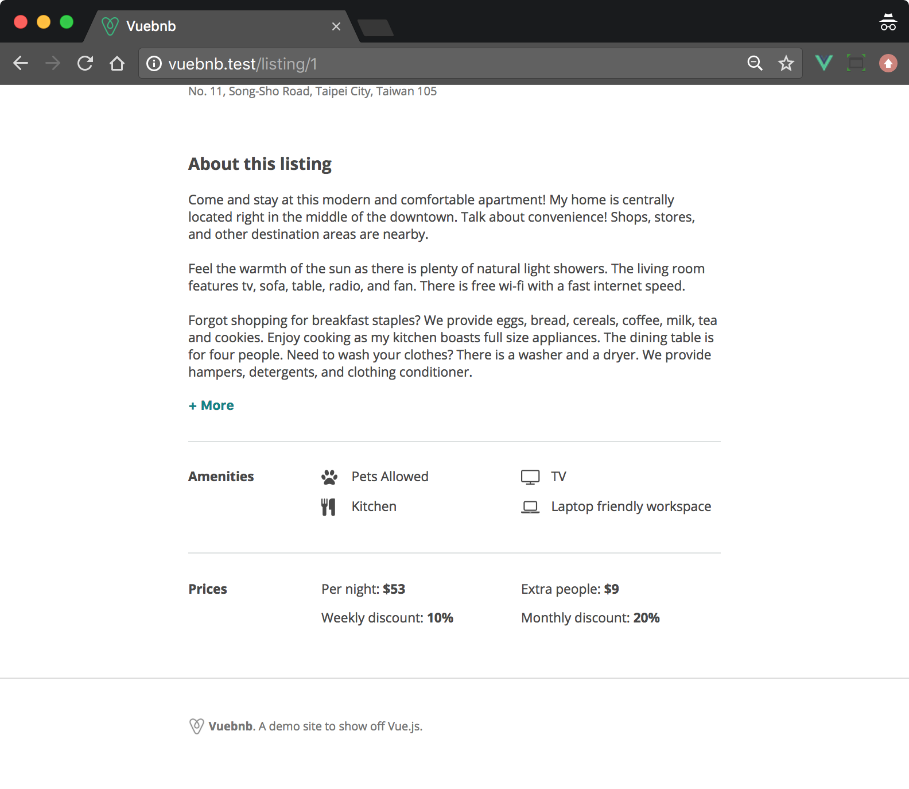

图 7.18 列表页面的自定义页脚

现在这是它在主页上的样子。它看起来不太好，因为文本没有像你期望的那样对齐。这是因为此页面上使用的容器约束与我们添加到页脚的 ``.container`` 类不同：

图 7.19 在主页自定义页脚

实际上， ``.container`` 是专门为列表页面设计的，而 ``.home-container`` 是为主页设计的。为了解决这个问题，并减少混乱，我们首先将 ``.container`` 类重命名为 ``.listing-container`` 。 您还需要更新 ``ListingPage`` 组件以确保它使用此新类名。

其次，让我们将 ``.home-container`` 移动到主 ``CSS`` 文件中，因为我们也将开始全局使用它。

resources/assets/css/style.css:

.. code-block:: css

    .listing-container {
      margin: 0 auto;
      padding: 0 12px;
    }

    @media (min-width: 744px) {
      .listing-container {
        width: 696px;
      }
    }

    .home-container {
      margin: 0 auto;
      padding: 0 25px;
    }

    @media (min-width: 1131px) {
      .home-container {
        width: 1080px;
      }
    }

现在我们将 ``.home-container`` 和 ``.listing-container`` 作为我们的自定义页脚组件的两个可能的容器。让我们根据路由动态选择类，以便页脚始终正确对齐。

路由对象
--------
路由对象表示当前活动路由的状态，可以在根实例或组件实例内访问，如此。 ``$route`` 。 该对象包含当前 ``URL`` 的解析信息以及 ``URL`` 匹配的路由记录：

.. code-block:: js

    created() {
      console.log(this.$route.fullPath); // /listing/1
      console.log(this.$route.params); // { listing: "1" }
    }

动态选择容器类
--------------
为了在 ``custom-footer`` 中选择正确的容器类，我们可以从 ``route`` 对象中获取当前路由的名称，并在模板文字中使用它。

resources/assets/components/CustomFooter.vue:

.. code-block:: html

    <template>
      

        

        

          
...

        

      

    </template>
    
    

现在页脚将在主页上显示时使用 ``.home-container`` ：

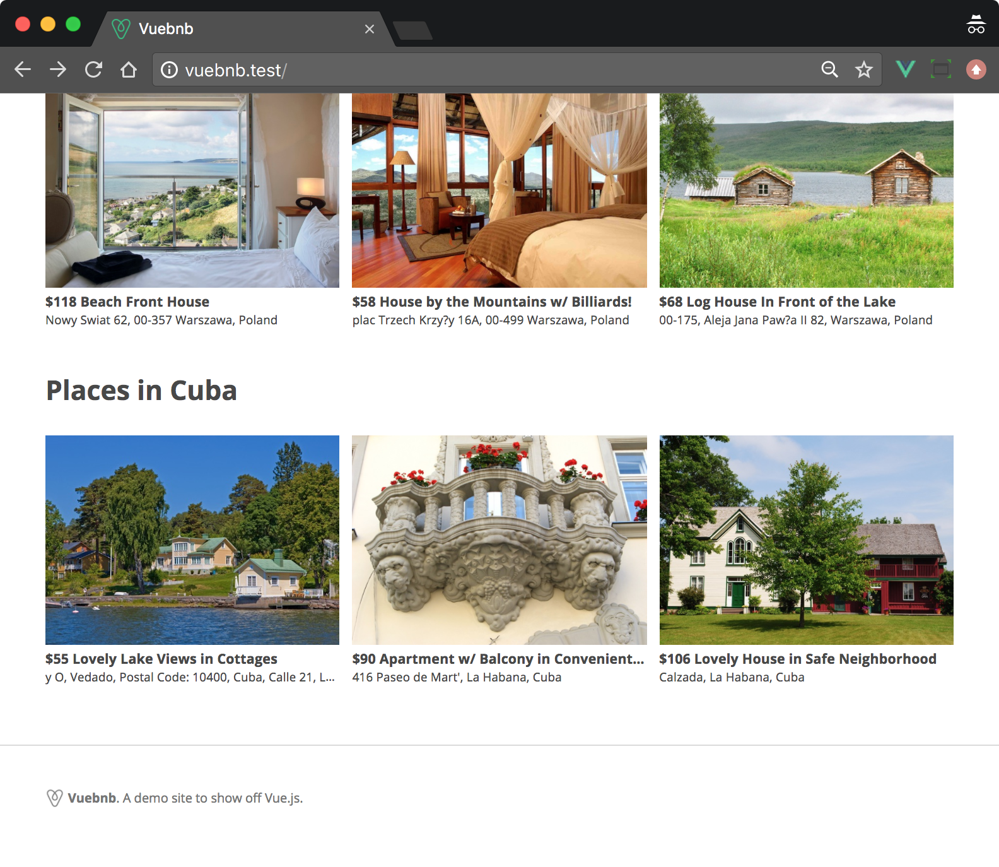

列出摘要图像滑块
================
在我们的主页上，我们需要这样做，以便用户可以看到每个国家/地区可能的 10 个列表中的三个。 为此，我们将每个列表摘要组转换为图像滑块。

让我们创建一个新组件来容纳每个列表摘要组。然后，我们将箭头添加到此组件的两侧，以便用户轻松浏览其列表：

.. code-block:: shell

    $ touch resources/assets/components/ListingSummaryGroup.vue

我们现在将用于在 HomePage 中显示列表摘要的标记和逻辑抽象为这个新组件。每个小组都需要知道国家名称和包含的列表，因此我们将这些数据添加为插值。

resources/assets/components/ListingSummaryGroup.vue:

.. code-block:: html

    <template>
      

        <h1>Places in {{ country }}</h1>
        

          <listing-summary
            v-for="listing in listings"
            :key="listing.id"
            :listing="listing"
          ></listing-summary>
        

      

    </template>
    
    

回到 ``HomePage`` ，我们将使用 ``v-for`` 声明 ``ListingSummaryGroup`` ，迭代每个国家/地区组。

resources/assets/components/HomePage.vue:

.. code-block:: html

    <template>
      

        <listing-summary-group
          v-for="(group, country) in listing_groups"
          :key="country"
          :listings="group"
          :country="country"
          class="listing-summary-group"
        ></listing-summary-group>
      

    </template>
    

.. tip:: 大多数开发人员将交替使用术语图像轮播(image carousel)和图像滑块(image slider)。在本书中，我略有区别，轮播包含一个完全与另一个图像切换的图像，而滑块则移动图像的位置，一次可见几个。

增加滑块
--------
我们现在将滑块功能添加到 ``ListingSummaryGroup`` 。为此，我们将重用我们在第6章使用 ``Vue.js`` 组件构建小部件时所做的 ``CarouselControl`` 组件。我们要在组的任一侧显示一个，所以让我们将它们放入模板中，记住声明 ``dir`` 属性。我们还将添加一些结构标记和 ``CSS`` 来显示控件。

resources/assets/components/ListingSummaryGroup.vue:

.. code-block:: html

    <template>
      

        <h1>Places in {{ country }}</h1>
        

          

            <carousel-control dir="left"></carousel-control>
            <carousel-control dir="right"></carousel-control>
          

          

            

              <listing-summary
                v-for="listing in listings"
                :listing="listing"
                :key="listing.id"
              ></listing-summary>
            

          

        

      

    </template>
    
    

添加此代码后，您的主页将如下所示：

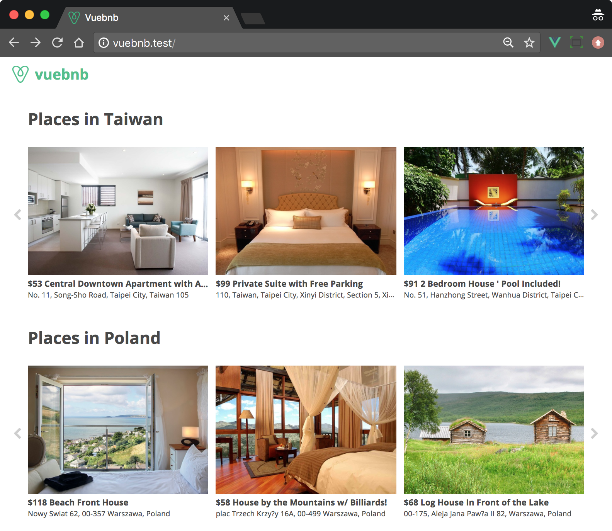

过渡
----
为了转换我们的列表摘要以响应被点击的轮播控件，我们将使用名为 ``translate`` 的 ``CSS`` 转换。这会将受影响的元素从其当前位置移动一个以像素为单位指定的量。

每个列表摘要的总宽度为 365px（ 350px 固定宽度加 15px 边距）。这意味着如果我们将组向左移动 365px ，它将产生将所有图像的位置移动一个的效果。你可以看到我在这里添加了 ``translate`` 作为内联样式来测试它是否有效。请注意，我们向负方向转换以使组向左移动：

.. image:: ./images/7-22.png

通过使用 ``listing-summary`` 类将内联样式绑定到元素，我们可以从 JavaScript 控制转换。让我们通过计算属性来做这个，这样我们就可以动态地计算 ``translate`` 量。

resources/assets/components/ListingSummaryGroup.vue:

.. code-block:: html

    <template>
      

        <h1>Places in {{ country }}</h1>
        

          
...

          

            <listing-summary...>...</listing-summary>
          

        

      

    </template>
    

现在我们所有的摘要组都将被转移：

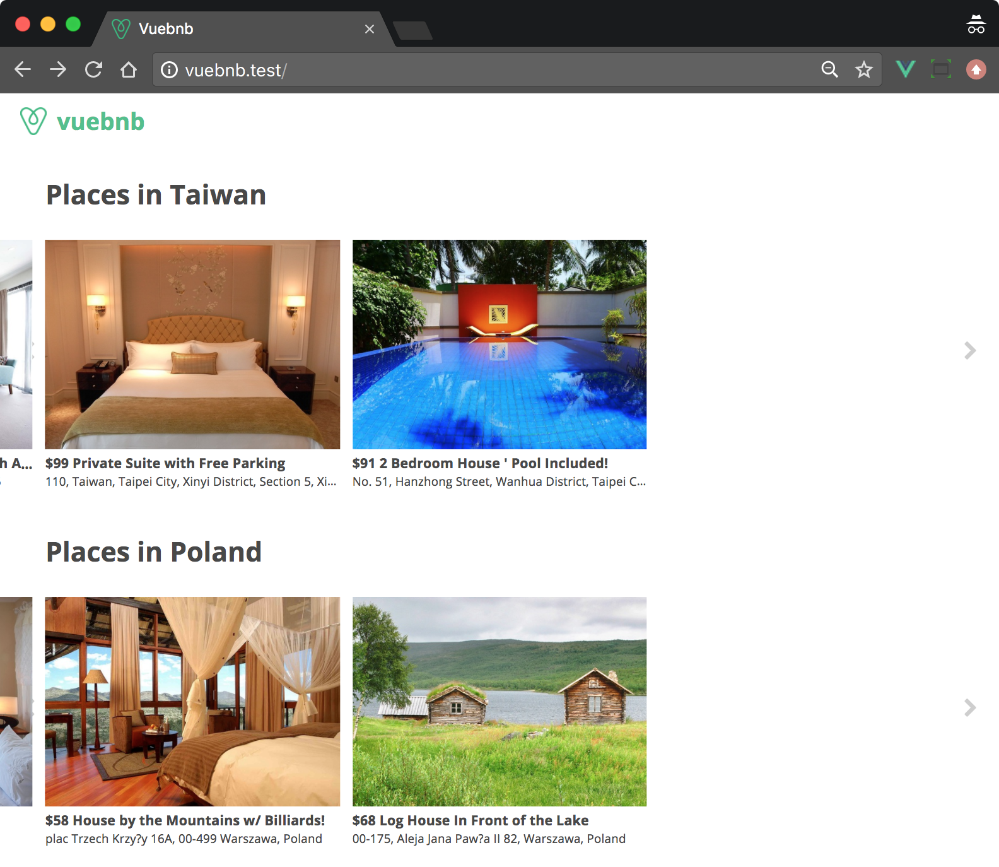

图7.23中显而易见的问题是，我们一次只能看到三个图像，并且它们从容器溢出到页面的其他部分。

为了解决这个问题，我们将把 ``CSS`` ``overflow: hidden`` 从 ``listing-summaries`` 移动到 ``listing-summaries-wrapper`` 。

resources/assets/components/ListingSummaryGroup.vue:

.. code-block:: html

    .listing-summaries-wrapper {
      overflow: hidden;
    }

    .listing-summaries {
      display: flex;
      flex-direction: row;
      justify-content: space-between;
    }

轮播控制
--------
我们现在需要轮播控件来更改 ``translate`` 的值。为此，我们将一个数据属性 ``offset`` 添加到 ``ListingSummaryGroup`` 。这将跟踪我们已经移动了多少图像，也就是说，它将从零开始，并且最多可以达到 7（不是 10，因为我们不希望移动到所有图像都移除屏幕）。

我们还将添加一个 ``change`` 方法，它将作为轮播控件组件发出的自定义事件的事件处理函数。此方法接受一个参数 ``val`` ，它将为 -1 或 1 ，具体取决于是否触发了左侧或右侧轮播控件。

``change`` 将增加 ``offset`` 的值，然后乘以每个列表的宽度（365px）来计算 ``translate`` 。

resources/assets/components/ListingSummaryGroup.vue:

.. code-block:: html

    const rowSize = 3;
    const listingSummaryWidth = 365;

    export default {
      props: [ 'country', 'listings' ],
      data() {
        return {
          offset: 0
        }
      },
      methods: {
        change(val) {
          let newVal = this.offset + parseInt(val);
          if (newVal >= 0 && newVal <= this.listings.length - rowSize) {
            this.offset = newVal;
          }
        }
      },
      computed: {
        style() {
          return {
            transform: `translateX(${this.offset * -listingSummaryWidth}px)`
          }
        }
      },
      components: { ... }
    }

最后，我们必须在模板中使用 ``v-on`` 指令为 ``CarouselControl`` 组件的 ``change-image`` 事件注册一个监听器。

resources/assets/components/ListingSummaryGroup.vue:

.. code-block:: html

    

      <carousel-control dir="left" @change-image="change"></carousel-control>
      <carousel-control dir="right" @change-image="change"></carousel-control>
    

完成后，我们为每个列表组都有一个工作图像滑块！

结束触发
--------
还有两个小功能可添加到这些图像滑块，为 ``Vuebnb`` 用户提供最佳体验。首先，让我们添加一个 CSS 过渡，在半秒的时间内为平移变化设置动画，并给出一个很好的滑动效果。

resources/assets/components/ListingSummaryGroup.vue:

.. code-block:: css

    .listing-summaries {
      display: flex;
      flex-direction: row;
      justify-content: space-between;
      transition: transform 0.5s;
    }

可悲的是，你无法在书中看到这种效果，所以你必须亲自尝试一下！

最后，与我们的图像轮播不同，这些滑块不是连续的; 它们具有最小值和最大值。 如果达到最小值或最大值，让我们隐藏相应的箭头。 例如，当滑块加载时，左箭头应该被隐藏，因为用户不能将偏移量进一步减小到零以下。

为此，我们将使用样式绑定动态添加 ``visibility:hidden`` 的 ``CSS`` 规则。

resources/assets/components/ListingSummaryGroup.vue:

.. code-block:: html

    

      <carousel-control
        dir="left"
        @change-image="change"
        :style="leftArrowStyle"
      ></carousel-control>
      <carousel-control
        dir="right"
        @change-image="change"
        :style="rightArrowStyle"
      ></carousel-control>
    

和计算的属性。

resources/assets/components/ListingSummaryGroup.vue:

.. code-block:: js

    computed: {
      ...
      leftArrowStyle() {
        return { visibility: (this.offset > 0 ? 'visible' : 'hidden') }
      },
      rightArrowStyle() {
        return {
          visibility: (
            this.offset < (this.listings.length - rowSize)
            ? 'visible' : 'hidden'
          )
        }
      }
    }

完成后，我们可以看到在页面加载时隐藏左箭头，如预期的那样：

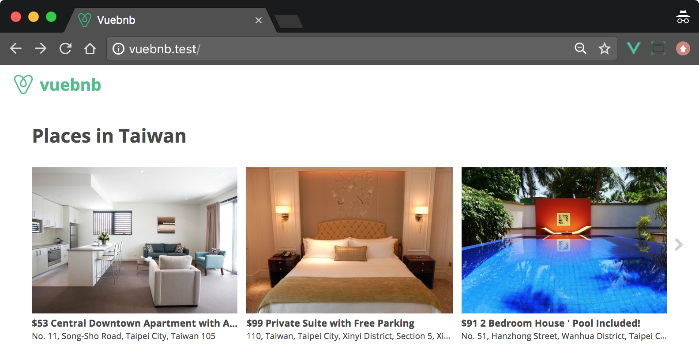

总结
====
在本章中，我们了解了路由器库如何工作以及为什么它们是 ``SPA`` 的重要补充。 然后我们熟悉了 Vue Router 的主要功能，包括路由对象，导航防护，以及 ``RouterLink`` 和 ``RouterView`` 特殊组件。

将这些知识付诸实践，我们安装了 Vue Router 并将其配置为在我们的应用程序中使用。 然后，我们为 ``Vuebnb`` 构建了一个主页，其中包括在图像滑块中组织的列表摘要库。

最后，我们实现了一个体系结构，用于正确匹配页面与可用的本地数据或通过 ``AJAX`` 从 ``Web`` 服务检索的新数据。

现在我们的应用程序中有大量组件，其中许多组件之间相互通信，是时候调查另一个关键的 Vue.js 工具: ``Vuex`` 。 ``Vuex`` 是一个基于 ``Flux`` 的库，提供了一种管理应用程序状态的卓越方式。

