****************
HTTP和WebSocket通讯
****************

.. contents:: 目录
   :depth: 4

在本章中，我们将探讨如何使用 ``HTTP`` 与我们的服务器端 ``API`` 进行交互。 我们将使用我们自己的离线 ``API`` 的 ``HTTP GET`` ， ``POST`` ， ``PUT`` ， ``PATCH`` 和 ``DELETE`` 创建一个应用程序。 除此之外，我们将创建一个内存中的实时聊天应用程序，它利用带有 ``Socket.io`` 库的 ``WebSockets`` 。

在本章的最后，你将会知道如何：

- 用 ``json-server`` 创建一个模拟数据库 ``API`` ；
- 使用 ``Axios`` 创建 ``HTTP`` 请求；
- 使用 ``WebSockets`` 和 ``Socket.io`` 实现跨客户端的实时通信；

HTTP
====
我们首先创建一个新的 ``Vue.js`` 项目，我们可以将其用作游乐场项目。 在终端中键入以下内容：

.. code-block:: shell

    # Create a new Vue project
    $ vue init webpack-simple vue-http

    # Navigate to directory
    $ cd vue-http

    # Install dependencies
    $ npm install

    # Run application
    $ npm run dev

有很多方法可以在 ``JavaScript`` 中创建 ``HTTP`` 请求。 我们将使用 ``Axios`` 库在我们的项目中使用简单的基于承诺的方法。 让我们通过在我们的终端中输入以下内容来安装它：

.. code-block:: shell

    # Install Axios to our project
    $ npm install axios --save

我们现在有能力创建 ``HTTP`` 请求；我们只需要一个 ``Axios`` 请求的 ``API`` 。 我们来创建一个模拟 ``API`` 。

安装JSON服务器
--------------
为了创建一个模拟 ``API`` ，我们可以使用 ``json-server`` 库。 这使我们能够通过在我们的项目中创建一个 ``db.json`` 文件来快速启动并运行。 它有效地创建了一个 ``GET`` ， ``POST`` ， ``PUT`` ， ``PATCH`` 和 ``DELETE`` ``API`` ，并将数据存储在最初的 ``JSON`` 文件中。

我们可以在我们的终端中运行以下代码来安装它：

.. code-block:: shell

    # Install the json-server module globally
    $ npm install json-server -g

正如我们添加了 ``-g`` 标志，我们将能够在整个终端全局访问 ``json-server`` 模块。

接下来我们需要做的是在我们项目的根目录下创建我们的 ``db.json`` 文件。 尽可能创造您想要的数据集; 我们只是简单地列出我们可能感兴趣或可能不感兴趣的课程列表：

.. code-block:: json

    {
        "courses": [
            {
                "id": 1,
                "name": "Vue.js Design Patterns"
            },
            {
                "id": 2,
                "name": "Angular: From Beginner to Advanced"
            },
            {
                "id": 3,
                "name": "Cross Platform Native Applications with Fuse"
            }
        ]
    }

然后，我们可以在终端中运行以下命令来运行我们的数据库：

.. code-block:: shell

    # Run the database based on our db.json file
    $ json-server db.json --watch

如果我们已经成功完成了所有工作，就可以通过 ``http:// localhost:3000`` 访问我们的数据库，如以下表示成功消息：

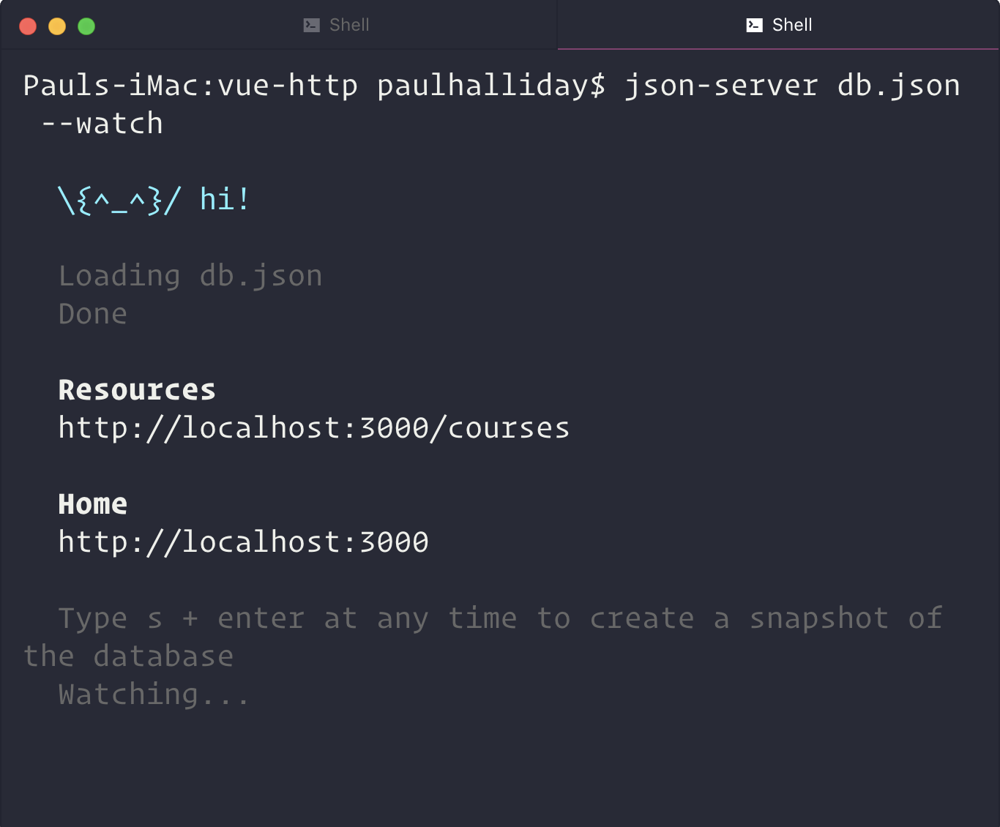

HTTP GET
--------
我们需要做的第一件事是将 ``Axios`` 导入我们的 ``App.vue`` 组件。 我们还可以在此实例中设置 ``ROOT_URL`` ，因此我们只会查找 ``/courses`` 端点：

.. code-block:: js

    

这样就可以让我们挂钩到诸如 ``created()`` 之类的生命周期钩子中，并调用一个请求我们课程的API方法：

.. code-block:: js

    export default {
        data() {
            return {
                ROOT_URL: 'http://localhost:3000/courses',
                courses: []
            }
        },
        created() {
            this.getCourseList();
        },
        methods: {
            getCourseList() {
                axios
                    .get(this.ROOT_URL)
                    .then(response => {
                        this.courses = response.data;
                    })
                    .catch(error => console.log(error));
            }
        }
    }

这里发生了什么事？ 我们调用 ``getCoursesList`` 函数，它向我们的 ``http:// localhost:3000/courses`` 端点发出 ``HTTP GET`` 请求。 然后，这会将 ``courses`` 数组设置为响应的数据（即， ``db.json`` 中的所有内容），或者仅在出现错误时才会记录错误。

然后我们可以使用 ``v-for`` 指令在屏幕上显示它：

.. code-block:: html

    <template>
        

            <h1>Courses</h1>
            

                

                    {{course.name}}
                

            

        

    </template>

加上一点样式，我们得到：

.. code-block:: css

    

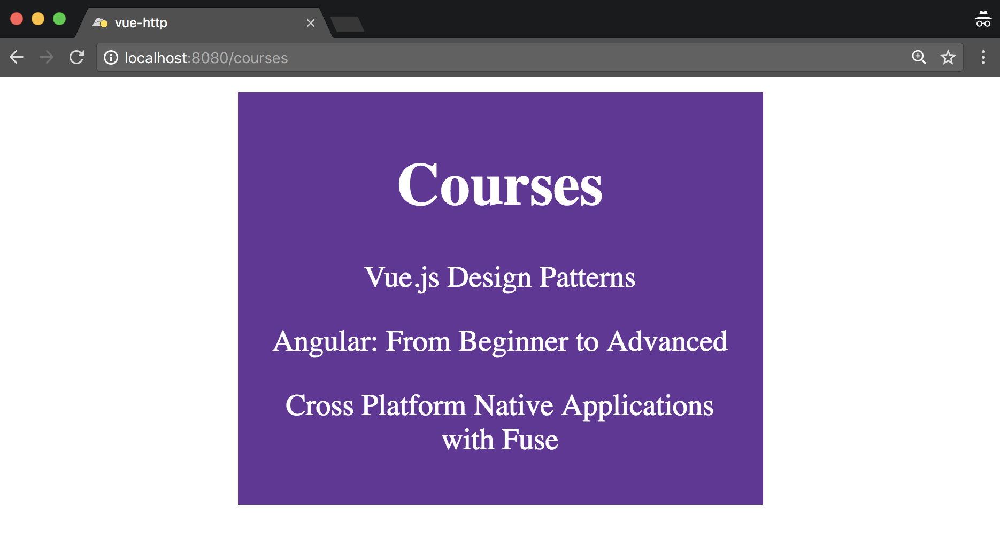

HTTP POST
---------
我们可以在 ``courseName div`` 后添加一个输入框和按钮，允许用户在其学习列表中输入一个新课程：

.. code-block:: html

    

        <input type="text" v-model="courseName" placeholder="Course name">
        <button @click="addCourse(courseName)">Add</button>
    

这要求我们将 ``courseName`` 变量添加到我们的数据对象中：

.. code-block:: js

    data() {
        return {
            ROOT_URL: 'http://localhost:3000/courses/',
            courses: [],
            courseName: '',
        };
    },

然后，我们可以创建一个名为 ``addCourse`` 的类似方法，将 ``courseName`` 作为参数：

.. code-block:: js

    methods: {
    // Omitted
        addCourse(name) {
            axios
                .post(this.ROOT_URL, { name })
                .then(response => {
                    this.courses.push(response.data);
                    this.courseName = '';
                })
                .catch(error => console.log(error));
        }
    }

您可能会注意到它与前面的 ``HTTP`` 调用非常相似，但是这一次，而不是 ``.get`` ，我们使用 ``.post`` ，并且使用名称的键和值传递一个对象。

在发送 ``POST`` 请求之后，我们使用 ``this.courses.push(response.data)`` 更新客户端数组，但是当服务器端（我们的客户端 ``db.json`` 文件）更新时，客户端状态没有更新。

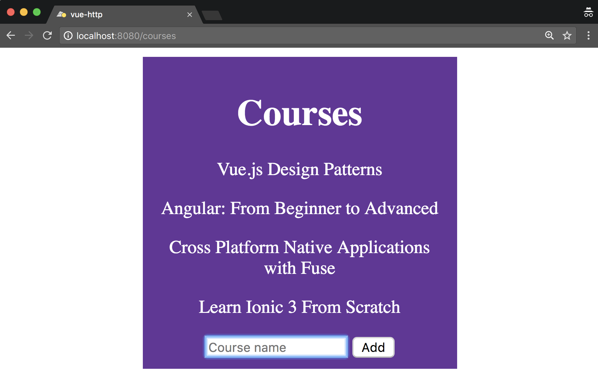

HTTP PUT
--------
我们希望能够做的下一件事是更改我们列表中的项目。 也许我们在提交该项目时犯了一个错误，因此我们想编辑它。 让我们添加该功能。

首先，让我们告诉 ``Vue`` 随时跟踪我们编辑课程的时间。 用户的编辑意图是每当他们点击课程名称时； 然后我们可以将编辑布尔值添加到我们的数据对象中：

.. code-block:: js

    data() {
        return {
            ROOT_URL: 'http://localhost:3000/courses/',
            courses: [],
            courseName: '',
            editing: false,
        };
    },

我们的模板可以改变以反映这一点：

.. code-block:: html

    <template>
        

            <h1>Courses</h1>
            

                

                    {{course.name}}
                

                

                    <input type="text" v-model="course.name">
                    <button @click="saveCourse(course)">Save</button>
                

            

            

                <input type="text" v-model="courseName" placeholder="Course name">
                <button @click="addCourse(courseName)">Add</button>
            

        

    </template>

到底发生了什么？ 那么，我们已经改变了我们的 ``courseName`` ，只在我们没有编辑时显示课程名称（也就是说，我们没有点击课程的名称）。 相反，使用 ``v-else`` 指令，我们正在显示一个输入框和按钮，它允许我们保存新的 ``CourseName`` 。

此时我们也隐藏了添加课程按钮以简化操作。

代码如下所示：

.. code-block:: js

    setEdit(course) {
        this.editing = !this.editing;
    },
    saveCourse(course) {
        this.setEdit();
        axios
            .put(`${this.ROOT_URL}/${course.id}`, { ...course })
            .then(response => {
                console.log(response.data);
            })
            .catch(error => console.log(error));
    }

在这里我们使用 ``axios`` 实例上的 ``.put`` 方法指向我们所选课程的端点。 作为数据参数，我们使用 ``{... course}`` 的 ``spread`` 运算符(把逗号隔开的值序列组合成一个数组)来解构课程变量以使用我们的 ``API`` 。

在此之后，我们只需将结果记录到控制台。 下面是我们编辑 ``Vue.js设计模式`` 字符串修改为 ``Vue.js`` 时的样子：

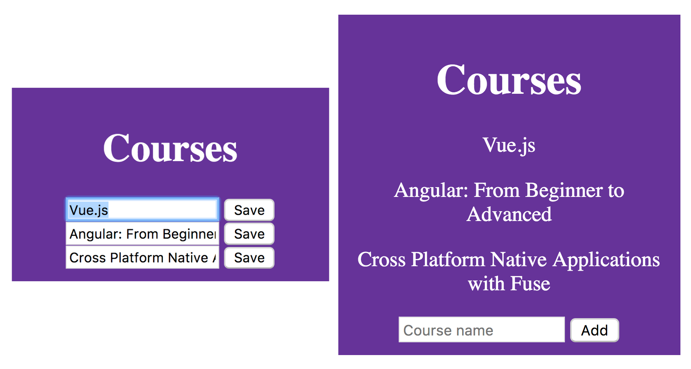

HTTP DELETE
-----------
要从我们的列表中删除项目，我们添加一个按钮，以便当用户进入编辑模式（通过单击项目）时，他们可以删除该特定课程：

.. code-block:: html

    

        <input type="text" v-model="course.name">
        <button @click="saveCourse(course)">Save</button>
        <button @click="removeCourse(course)">Remove</button>
    

我们的 ``removeCourse`` 功能如下所示：

.. code-block:: js

    removeCourse(course) {
        axios
            .delete(`${this.ROOT_URL}/${course.id}`)
            .then(response => {
                this.setEdit();
                this.courses = this.courses.filter(c => c.id != course.id);
            })
            .catch(error => console.error(error));
    },

我们调用 ``axios.delete`` 方法，然后过滤我们的每门课程的课程列表，去除已经删除的那门课程。 这会更新我们的客户端状态并使其与数据库保持一致。

.. image:: ./images/9-5.png

在本章的这一节中，我们基于 ``REST API`` 为自己创建了一个简单的“我想学习的课程”列表。 它当然可以抽象为多个组件，但由于这不是应用程序的核心重点，所以我们只是将它集于一身。

接下来，我们来创建一个使用 ``Node`` 和 ``Socket.io`` 的实时聊天应用程序。

使用Node和Socket.io实时聊天应用程序
===================================
在本节中，我们将使用 ``Node`` 和 ``Socket.io`` 创建一个实时聊天应用程序。 我们将用 ``Node.js`` 和 ``Express`` 框架编写少量代码，但它们都是您熟悉并喜爱的 ``JavaScript`` 。

在终端中运行以下内容以创建一个新项目：

.. code-block:: shell

    # Create a new Vue project
    $ vue init webpack-simple vue-chat

    # Navigate to directory
    $ cd vue-chat

    # Install dependencies
    $ npm install

    # Run application
    $ npm run dev

然后，我们可以创建一个服务器文件夹并为特定于服务器的依赖项初始化一个 ``package.json`` ，如下所示：

.. code-block:: shell

    # Create a new folder named server
    $ mkdir server

    # Navigate to directory
    $ cd server

    # Make a server.js file
    $ touch server.js

    # Initialise a new package.json
    $ npm init -y

    # Install dependencies
    $ npm install socket.io express --save

什么是Socket.io
---------------
在我们之前的例子中，如果我们想从服务器获取新数据，我们需要另外创建一个 ``HTTP`` 请求，然而使用 ``WebSockets`` ，我们可以拥有一个一致的事件侦听器，该事件侦听器在事件触发时发生反应。

为了在我们的聊天应用程序中充分利用该协议，我们将使用 ``Socket.io`` 。 这是一个客户端和服务器端库，可以让我们快速轻松地使用 ``WebSockets`` 。 它允许我们定义和提交我们可以收听的事件和随后执行操作。

服务器设置
----------
然后，我们可以使用 ``Express`` 创建一个新的 ``HTTP`` 服务器，并通过将以下内容添加到 ``server.js`` 来使用 ``Socket.io`` 来监听应用程序连接：

.. code-block:: js

    const app = require('express')();
    const http = require('http').Server(app);
    const io = require('socket.io')(http);
    const PORT = 3000;

    http.listen(PORT, () => console.log(`Listening on port: ${PORT}`));

    io.on('connection', socket => {
        console.log('A user connected.');
    });

如果我们从服务器文件夹内的终端内运行 ``node server.js`` ，我们应该看到在端口 ``3000`` 上 ``Listening`` 的消息。这意味着一旦我们在客户端应用程序内部实现了 ``Socket.io`` ，我们就能够随时监控有人连接到应用程序。

客户端连接
----------
要捕获客户端连接，我们需要将 ``Socket.io`` 安装到我们的 ``Vue`` 应用程序中。 我们还将使用另一个名为 ``vue-socket.io`` 的依赖项，它可以在我们的 ``Vue`` 应用程序中为我们提供更平滑的实现。

在终端中运行以下命令，确保您位于根目录中（即不在 ``server`` 文件夹中）：

.. code-block:: shell

    # Install socket.io-client and vue-socket.io
    $ npm install socket.io-client vue-socket.io --save

设置Vue和Socket.io
^^^^^^^^^^^^^^^^^^
让我们来看看我们的 ``main.js`` 文件，以便我们可以注册 ``Socket.io`` 和 ``Vue-Socket.io`` 插件。 你可能还记得以前的章节如何做到这一点：

.. code-block:: js

    import Vue from 'vue';
    import App from './App.vue';
    import SocketIo from 'socket.io-client';
    import VueSocketIo from 'vue-socket.io';

    export const Socket = SocketIo(`http://localhost:3000`);

    Vue.use(VueSocketIo, Socket);

    new Vue({
      el: '#app',
      render: h => h(App),
    });

在前面的代码块中，我们正在导入必要的依赖关系，并创建对当前在端口 ``3000`` 上运行的 ``Socket.io`` 服务器的引用。然后，我们使用 ``Vue.use`` 添加 ``Vue`` 插件。

如果我们操作正确，我们的客户端和服务器应该互相交流。 我们应该在我们的终端里面得到以下内容：

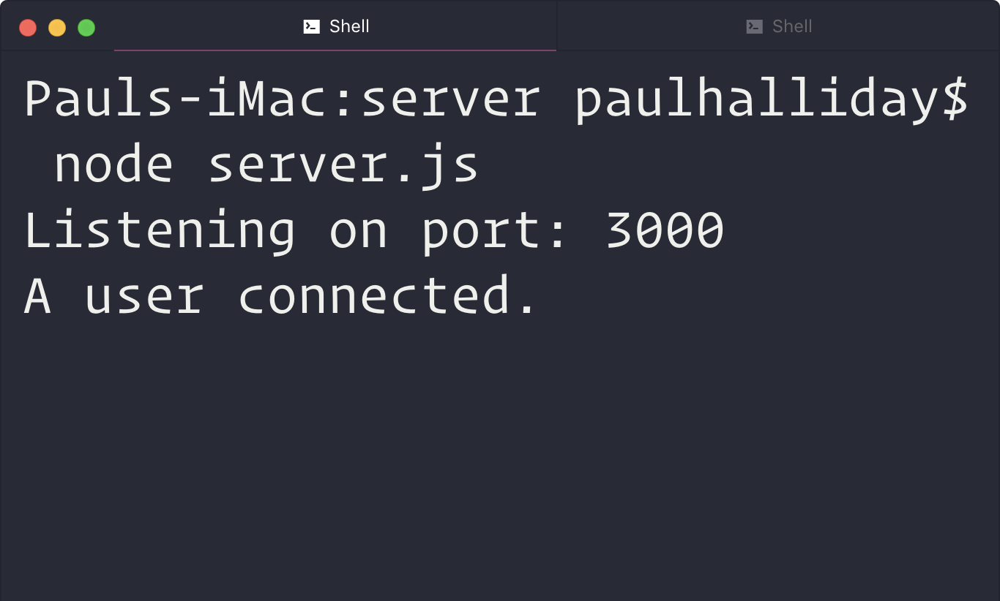

确定连接状态
------------
现在我们添加了 ``Vue-Socket.io`` 插件，我们可以访问 ``Vue`` 实例中的套接字对象。 这允许我们监听特定的事件，并确定用户是否连接到 ``WebSocket`` 或与 ``WebSocket`` 断开连接。

在 ``App.vue`` 的内部，如果我们从服务器连接/断开连接，让我们在屏幕上显示一条消息：

.. code-block:: html

    <template>
        

            <h1 v-if="isConnected">Connected to the server.</h1>
            <h1 v-else>Disconnected from the server.</h1>
        

    </template>

    

除了套接字对象之外，这里没有太多新的东西。 无论何时我们连接到套接字，我们都可以在 ``connect()`` 钩子中运行我们想要的任何代码， ``disconnect()`` 也是如此。 我们只是翻转一个布尔值，在 ``v-if`` 和 ``v-else`` 指令的屏幕上显示不同的消息。

最初，我们在服务器运行时连接到服务器。 如果我们在终端窗口中用 ``CTRL + C`` 停止服务器，我们的标题将会改变，以反映我们不再有 ``WebSocket`` 连接的事实。

创建一个连接状态栏
^^^^^^^^^^^^^^^^^^
让我们玩这个概念。 我们可以创建一个组件文件夹，然后创建一个名为 ``ConnectionStatus.vue`` 的新组件。 在该文件的内部，我们可以创建一个状态栏，显示用户联机或脱机状态：

.. code-block:: html

    <template>
        

        
          Connected to the server.
        
            
          Disconnected from the server.
        
        

    </template>

    

    

虽然我们目前的应用程序中只使用一次，但我们可能希望跨多个组件使用此组件，因此我们可以在 ``main.js`` 中全局注册它：

.. code-block:: js

    import App from './App.vue';
    import ConnectionStatus from './components/ConnectionStatus.vue';

    Vue.component('connection-status', ConnectionStatus);

然后，我们可以编辑我们的 ``App.vue`` 模板以使用此组件并将当前连接状态作为一个 ``prop`` 传递：

.. code-block:: html

    <template>
      

        <connection-status :isConnected="isConnected" />
      

    </template>

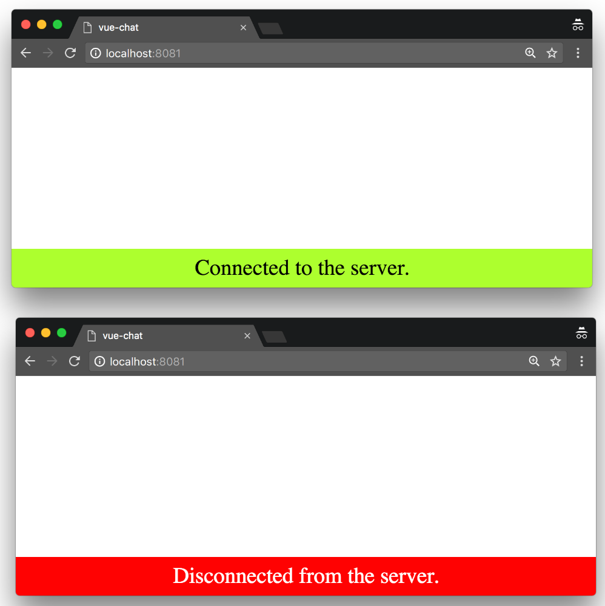

接下来，我们可以制作一个导航栏组件，以使我们的 ``UI`` 更加完整。

导航条
------
除了简单地显示我们的应用程序的名称之外，导航栏组件不会有很多用途。 您可以更改此功能以包含其他功能，例如登录/注销，添加新聊天频道或任何其他聊天特定的用户操作。

让我们在组件文件夹中创建一个名为 ``Navbar.vue`` 的新组件：

.. code-block:: html

    <template>
        

            <nav class="navbar">
                Socket Chat
            </nav>
        

    </template>

    

    

您可能会注意到 ``v-once`` 指令已添加到此 ``div`` 上。 这是我们第一次看到它，但由于这个组件完全是静态的，我们可以告诉 ``Vue`` 不要听任何改变，只渲染一次。

然后，我们必须删除 ``HTML`` 主体内部的任何默认填充或边距。 在包含这些属性的根目录内创建一个名为 ``styles.css`` 的文件：

.. code-block:: css

    body {
        margin: 0px;
        padding: 0px;
    }

然后，我们可以将它添加到我们的 ``index.html`` 文件中，如下所示：

.. code-block:: html

    <head>
        <meta charset="utf-8">
        <title>vue-chat</title>
        <link rel="stylesheet" href="styles.css">
    </head>

接下来，我们需要全局注册该组件。 如果你觉得可以的话，请在 ``main.js`` 中尝试自己做。

这需要我们导入 ``Navbar`` 并像这样注册它：

.. code-block:: js

    import Navbar from './components/Navbar.vue'

    Vue.component('navigation-bar', Navbar);

然后，我们可以将其添加到我们的 ``App.vue`` 文件中：

.. code-block:: html

    <template>
        

            <navigation-bar />
            <connection-status :isConnected="isConnected" />
        

    </template>

接下来，让我们创建 ``MessageList`` 组件来保存消息列表。

消息列表
--------
我们可以在屏幕上显示消息列表，方法是使用支持消息数组的 ``prop`` 来创建新组件。 在名为 ``MessageList.vue`` 的组件文件夹内创建一个新组件：

.. code-block:: html

    <template>
        

      
      <strong>{{message.username}}: </strong> {{message.message}}
      
        

    </template>

    

    

这个组件相当简单；它所做的只是使用 ``v-for`` 指令遍历我们的 ``messages`` 数组。 我们使用适当的 ``prop`` 将消息数组传递给这个组件。

我们不是全局注册该组件，而是专门在我们的 ``App.vue`` 组件内注册它。 但我们也可以在 ``messages`` 数组中添加一些虚拟数据：

.. code-block:: js

    import MessageList from './components/MessageList.vue';

    export default {
        data() {
            return {
                isConnected: false,
                messages: [
                    {
                        id: 1,
                        username: 'Paul',
                        message: 'Hey!',
                    },
                    {
                        id: 2,
                        username: 'Evan',
                        message: 'How are you?',
                    },
                ],
            };
        },
        components: {
            MessageList,
        },

然后，我们可以将 ``message-list`` 组件添加到我们的模板中：

.. code-block:: html

     

        <message-list :messages="messages" />
     

我们基于数据对象内部的消息数组传递消息作为 ``prop`` 。 我们还可以添加以下样式：

.. code-block:: html

    

这样做会将我们的消息框居中在屏幕上，并为了演示的目的而限制宽度。

我们正在取得进展！ 这是我们的消息框：

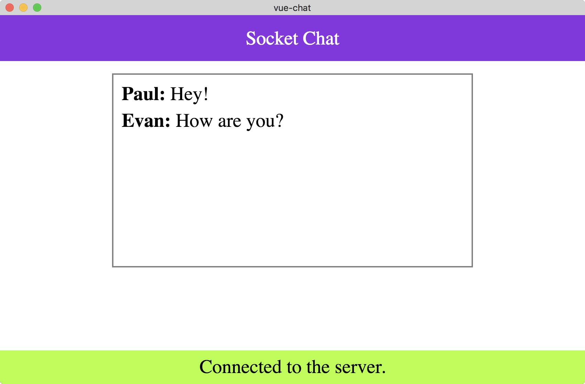

接下来是什么？ 那么，我们仍然需要能够将消息添加到我们的列表中。 接下来我们来研究一下。

增加消息到列表
--------------
在名为 ``MessageForm.vue`` 的组件文件夹内创建一个新组件。 这将用于将消息输入到列表中。

我们可以从下面开始：

.. code-block:: html

    <template>
        <form @submit.prevent="sendMessage">
            

                <label for="username">Username:</label>
                <input type="text" name="username" v-model="username">
            

            

                <label for="message">Message:</label>
                <textarea name="message" v-model="message"></textarea>
            

            <button type="submit">Send</button>
        </form>
    </template>

    

    

这基本上允许我们为选定的 ``username`` 和 ``message`` 捕获用户输入。 然后，我们可以使用这些信息在 ``sendMessage`` 函数内将数据发送到我们的 ``Socket.io`` 服务器。

通过将 ``\@submit.prevent`` 添加到我们的表单而不是 ``@submit`` ，我们确保我们覆盖提交表单的默认行为；这是必要的，否则我们的页面会重新加载。

让我们在 ``App.vue`` 中注册我们的表单，尽管我们还没有将任何操作连接起来：

.. code-block:: js

    import MessageList from './components/MessageList.vue';

    export default {
        // Omitted
        components: {
            MessageList,
            MessageForm,
        },
    }

然后我们可以将其添加到我们的模板中：

.. code-block:: html

    <template>
        

            <navigation-bar />
            

                <message-list :messages="messages" />
                <message-form />
            

            <connection-status :isConnected="isConnected" />
        

    </template>

以下是我们的应用程序现在的样子：

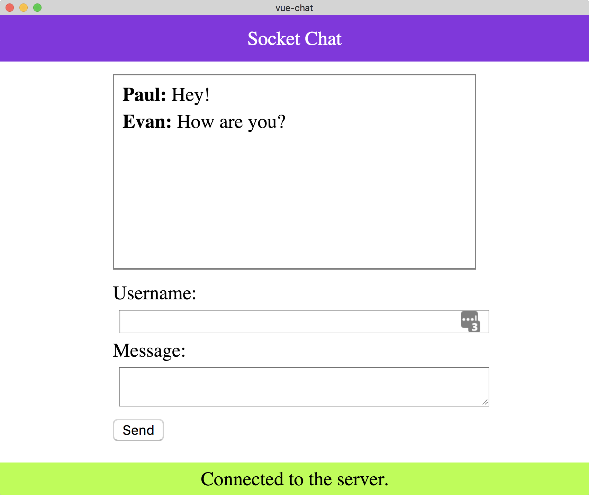

使用Socket.io的服务器端事件
^^^^^^^^^^^^^^^^^^^^^^^^^^^
为了发送新消息，我们可以在我们的 ``server.js`` 文件中侦听名为 ``chatMessage`` 的事件。

这可以在我们最初的连接事件中完成，确保我们逐个套接字地监听事件：

.. code-block:: js

    io.on('connection', socket => {
        console.log('A user connected.');

        socket.on('chatMessage', message => {
            console.log(message);
        })
    });

如果我们从我们的客户端发送 ``chatMessage`` 事件，随后在我们的终端内记录此消息。 让我们试试吧！

由于我们对 ``server.js`` 文件进行了更改，因此我们需要重新启动 ``Node`` 实例。 在运行 ``server.js`` 的终端窗口内击 ``CTRL + C`` 并再次运行节点 ``server.js`` 。

Nodemon
"""""""
或者，您可能希望使用名为 ``nodemon`` 的模块在发生任何更改时自动执行此操作。

在终端中运行以下内容：

.. code-block:: shell

    # Install nodemon globally
    $ npm install nodemon -g

然后运行：

.. code-block:: shell

    # Listen for any changes to our server.js file and restart the server
    $ nodemon server.js

让我们回到我们的 ``MessageForm`` 组件并创建 ``sendMessage`` 函数：

.. code-block:: js

    methods: {
        sendMessage() {
            this.socket.emit('chatMessage', {
                username: this.username,
                message: this.message,
            });
        },
    },

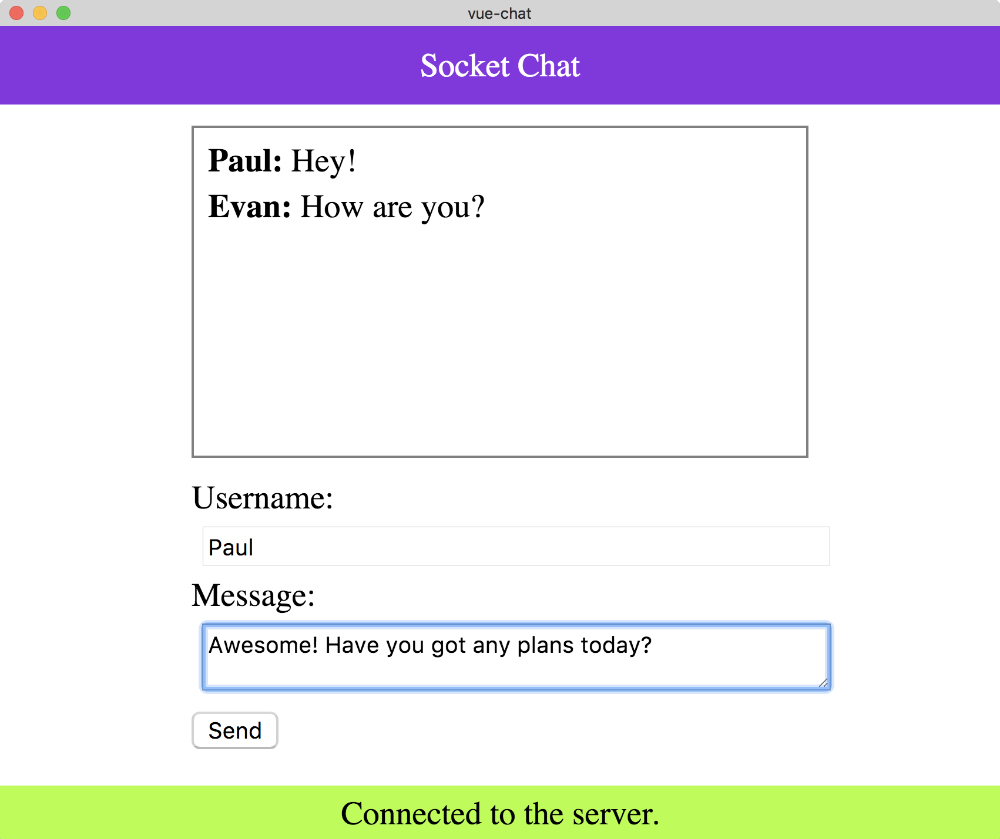

此时点击发送不会将消息添加到数组中，但它确实会将发送的消息发送给我们的终端！ 让我们来看看：

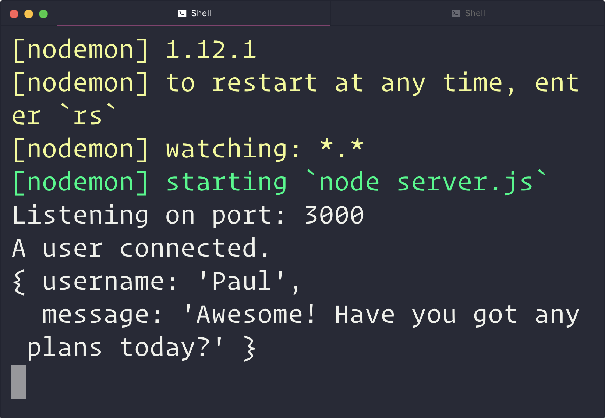

事实证明，我们不必编写更多的代码来利用我们的 ``WebSockets`` 。 让我们回头看看 ``App.vue`` 组件，并将函数添加到名为 ``chatMessage`` 的套接字对象中。 注意这与事件名称是完全相同的，这意味着每次这个事件被触发时，我们都可以运行一个指定的方法：

.. code-block:: js

    export default {
    // Omitted
        sockets: {
            connect() {
                this.isConnected = true;
            },
            disconnect() {
                this.isConnected = false;
            },
            chatMessage(messages) {
                this.messages = messages;
            },
        },
    }

我们的客户端代码现在已经连接起来并监听 ``chatMessage`` 事件。 问题是我们的服务器端代码当前没有发送任何东西给客户端！ 我们通过从套接字中发出一个事件来解决这个问题：

.. code-block:: js

    const app = require('express')();
    const http = require('http').Server(app);
    const io = require('socket.io')(http);
    const PORT = 3000;

    http.listen(PORT, () => console.log(`Listening on port: ${PORT}`));

    const messages = []; // 保存接受的消息

    const emitMessages = () => io.emit('chatMessage', messages);

    io.on('connection', socket => {
        console.log('A user connected.');

        emitMessages(messages); // 发送消息

        socket.on('chatMessage', message => {
            messages.push(message); // 接受消息

            emitMessages(messages); // 然后发送消息
        });
    });

我们使用名为 ``messages`` 的数组将消息保存在内存中。 当客户端连接到我们的应用程序时，我们也会向下游发送这些消息（所有先前的消息都将显示）。 除此之外，任何时候有新消息添加到数组中，我们也会将此消息发送给所有客户端。

如果我们打开两个 ``Chrome`` 标签，我们应该可以进行自我对话！

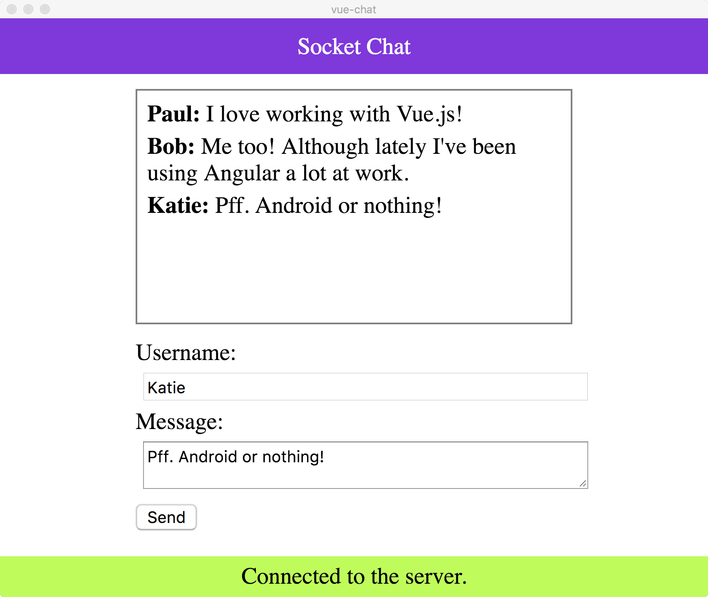

然后，我们可以在另一个标签中与我们自己交谈！

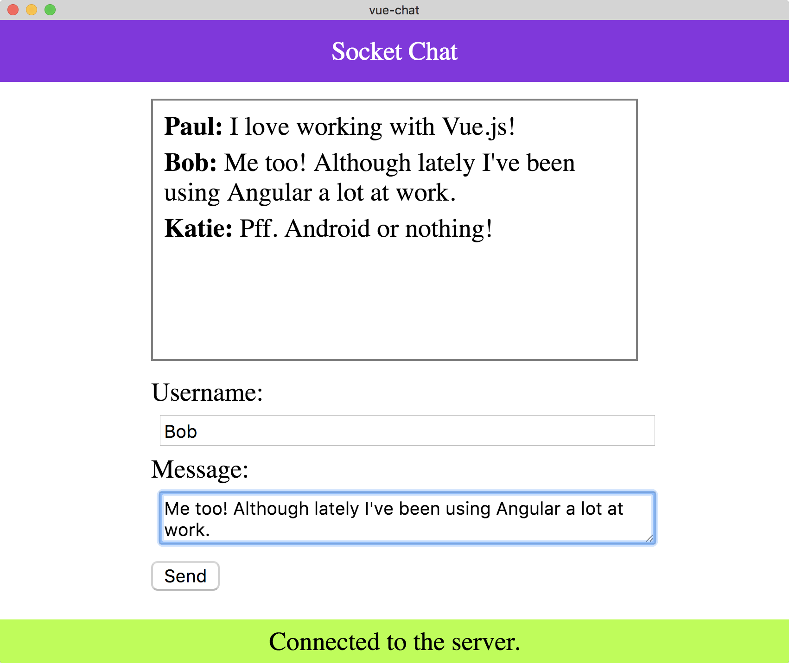

总结
====
在本章中，我们学习了如何使用 ``Axios`` 库和 ``json-server`` 使用 ``Vue`` 创建 ``HTTP`` 请求。 这使我们能够与第三方 ``API`` 进行交互，并增强我们的 ``Vue`` 应用程序。

我们还研究了如何使用 ``WebSockets`` 和 ``Socket.io`` 创建更大的应用程序。 这使我们能够与连接到我们应用程序的其他客户端进行实时通信，从而提供更多的可能性。

我们走过了很长一段路！ 为了真正地利用 ``Vue`` ，我们需要掌握路由器并研究高级状态管理概念。 这一切都将在下一章中提出！
