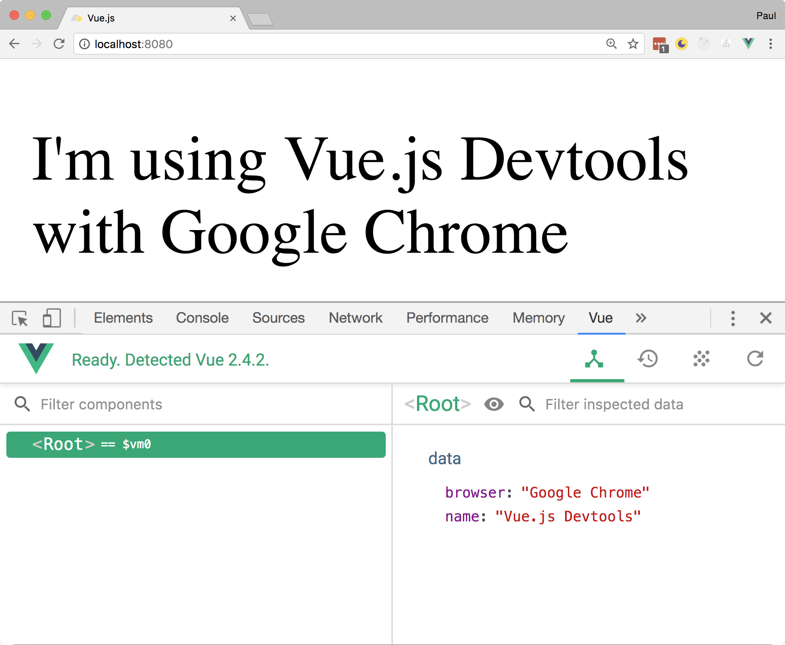

***********
Vue.js原理和比较
***********
在本章中，我们将探讨为什么 ``Vue`` 是一个重要的 ``Web`` 开发框架，同时也考虑设置我们的开发环境。 如果我们希望将 ``Vue`` 用于我们的下一个项目，那么当我们意识到，时间投入和学习曲线，对我们的影响很重要。 你会考虑 ``Vue`` 如何构建其他前端开发项目，以及如何使用 ``Vue`` 创建你的第一个应用程序。

总之，我们将考虑以下几点：

- 满足本书的先决条件；
- 了解 ``Vue`` 在哪里适用于前端框架；
- 为什么你应该考虑使用 ``Vue`` 作为你的下一个项目的框架；
- 调查 ``Vue`` 的灵活性及其在移动开发中的作用；

先决条件
========
虽然您可以在不使用 ``Node`` 的情况下开发 ``Vue`` 应用程序，但我们将在本书中使用 ``Node.js`` 来管理依赖关系并与 ``Vue`` 命令行界面( ``CLI`` )进行交互。 这使我们可以更快地启动项目，并为我们提供更好的开发体验，因为我们可以默认使用 ``ECMAScript 2015`` 。 让我们快速回顾一下设置您的开发环境。

Windows
-------
在 ``window`` 中安装 ``Node`` ，只需要简单地访问 ``https://nodejs.org`` 并下载最新版本。 确保在执行安装步骤时选择添加到 ``PATH`` ，因为这将允许我们访问我们的终端中的 ``node`` 命令。

完成之后，通过输入 ``node -v`` 和 ``npm -v`` 来检查节点安装的工作情况。 如果你有两个版本号（也就是每个一个版本号），那么你就可以继续阅读本书的其余部分了！

Mac
---
安装适用于 ``Mac`` 的 ``Node`` 需要比简单地从 ``Node`` 网站下载安装程序更多的工作。 尽管可以使用 ``https://nodejs.org`` 中的安装程序，但由于 ``sudo`` 的要求，建议不要这么做。

如果我们这样做，我们必须在 ``npm`` 命令前面中加上 ``sudo`` 前缀，这可能会让我们的系统容易受到潜在的脚本攻击，并且不方便。 相反，我们可以通过 ``Homebrew`` 软件包管理器来安装 ``Node`` ，然后我们可以与 ``npm`` 进行交互，而不用担心必须以 ``sudo`` 的方式运行。

使用 ``Homebrew`` 安装 ``Node`` 的另一个好处是它会自动添加到我们的 ``PATH`` 中。 这意味着我们可以输入 ``node`` 命令，而无需摆弄我们的环境文件。

通过Homebrew安装Node
^^^^^^^^^^^^^^^^^^^^
获得 ``Homebrew`` 最快的方法是访问 http://brew.sh 并获取安装脚本。 它应该看起来像这样：

.. code-block:: shell

    /usr/bin/ruby -e "$(curl -fsSL https://raw.githubusercontent.com/Homebrew/install/master/install)"

只需将其粘贴到终端中，它就会将 ``Homebrew`` 软件包管理器下载到 ``Mac`` 。 然后，我们可以使用 ``brew`` 安装 ``node`` 到我们的系统上，而不用关心其它的。

完成之后，通过输入 ``node -v`` 和 ``npm -v`` 来检查节点安装的工作情况。 如果你有两个版本号（也就是每个一个版本号），那么你就可以继续阅读本书的其余部分了！

为了管理不同的 ``Node`` 版本，我们还可以安装 ``Node`` 版本管理器( ``NVM`` )。 但请注意，目前这只支持 ``Mac`` ，而不支持 ``Windows`` 。 要安装 ``NVM`` ，我们可以像这样使用 ``Homebrew`` ：

.. code-block:: shell

    --use Brew to install the NVM
    brew install nvm

    --File directory
    mkdir ~/.nvm

    --Install latest version
    nvm install --lts

    --Ensure latest version is used
    nvm use node

    --Remember details across sessions
    nano ~/.bash_profile

    --Execute in every session
    export NVM_DIR="$HOME/.nvm"
      . "$(brew --prefix nvm)/nvm.sh"

编辑器
------
可以使用各种编辑器，例如 ``Visual Studio Code`` ， ``Sublime Text`` ， ``Atom`` 和 ``WebStorm`` 。 我推荐 ``Visual Studio Code`` (https://code.visualstudio.com)，因为它有一个频繁的发布周期和丰富的 ``Vue`` 扩展，我们可以用它来改进我们的工作流程。

浏览器
------
我们将使用谷歌浏览器来运行我们的项目，因为它有一个名为 ``Vue devtools`` 的扩展，这对我们的开发工作流程很有帮助。 如果您不使用谷歌浏览器，请确保您的浏览器具有可供使用的相同 ``Vue devtools`` 扩展。

安装Vue devtools工具
^^^^^^^^^^^^^^^^^^^^^
进入 ``Google Chrome`` 扩展程序商店并下载 ``Vue.js devtools`` (https://goo.gl/Sc3YU1)。 安装完成后，您可以访问开发工具中的 ``Vue`` 面板。 在下面的例子中，我们可以看到 ``Vue`` 实例中的数据对象：

.. code-block:: html

    <!DOCTYPE html>
    <html lang="en">
    <head>
      <meta charset="UTF-8">
      <meta name="viewport" content="width=device-width, initial-
      scale=1.0">
      <meta http-equiv="X-UA-Compatible" content="ie=edge">
      <title>Vue.js</title>
    </head>
    <body>
      

      
      
    </body>
    </html>

如果我们回到浏览器并打开 ``devtools`` ，我们可以看到 ``Vue`` 已被检测到，并且我们的消息已经输出到屏幕上：

我们将在整本书中使用它来更深入地了解我们的应用程序。 请注意，开发工具只会识别您的由本地服务器提供服务的 ``Vue`` 项目。

Vue CLI
-------
为了充分利用 ``Vue`` 的所有功能，我们将使用 ``Vue CLI`` 。 这使我们能够创建具有适当捆绑/转发配置的各种入门模板的项目。 在终端中输入以下内容，确保节点已安装：

.. code-block:: shell

    $ npm install vue-cli -g

这为我们未来的部分提供了帮助，因为使用入门模板显著增强了我们的工作流程。

Vue.js与其它框架比较
====================
本书旨在概述如何使用常见的开发模式，最佳实践和避免反模式来最好地构建 ``Vue`` 应用程序。

我们的旅程首先看看 ``Vue`` 如何适应其他常见项目，如果您通过 ``GitHub`` 明星衡量框架， ``Vue`` 显然是未来的赢家。根据 https://bestof.js.org ，2017年，它与 ``React`` 76和 ``Angular`` 32的测试结果相比，目前每天增加 114 颗星。

谈论现代 ``Web`` 开发技术时的框架讨论是一个有趣的问题。你很少发现一个真实的，没有偏见的比较......但没关系！这不是关于哪个框架或库最好，而是最适合你的团队，项目目标，消费者和数百个其他变量。作为一名 ``Vue`` 开发人员，您可能是希望使用简单易用的 ``API`` 构建响应式 ``Web`` 应用程序的人员。

正是这种适应性强，易于使用的 ``API`` 使得 ``Vue`` 能够愉快地工作，也许 ``Vue`` 最强大的一点就是简单，专注的文档。它的入门门槛非常低：只需从 ``CDN`` 添加一个脚本文件，初始化一个新的 ``Vue`` 实例...然后你就没事了！当然， ``Vue`` 比这个可能要多，但是与 ``Angular`` 等一些完全成熟的框架相比，你会因为认为它很容易而被原谅。

``Vue`` 使用模板，声明性绑定和基于组件的架构来分隔关注点并使项目更容易维护。当考虑在企业内部使用哪个框架时，这变得尤为重要。这就是， ``Angular`` 发光的原因，它能够在整个项目中强制实施标准。

我们已经确立了它的易用性，但 ``Vue`` 相对于竞争对手来说相当年轻......我们怎么知道这不是炒作呢？它被任何人用于生产吗？必然是！ ``GitLab`` 最近写了一篇关于他们为什么选择 ``Vue.js`` 的文章 (https://about.gitlab.com/2016/10/20/why-we-chose-vue/)，他们引用的主要好处是易用性，更少的代码和更少的假设。其他公司如 ``Laravel`` ，任天堂， ``Sainsbury`` 和阿里巴巴都遵循这一路线，甚至 ``Rever Shine`` 等公司也将他们的 ``web`` 客户端从 ``Angular 2.x`` 改写为 ``Vue 2.x`` (https://medium.com/reverdev/why-we-moved-from-angular-2-to-vue-js-and-why-we-didnt-choose-react-ef807d9f4163)。

它不仅仅是公开的 提高 ``NativeScript`` 开发体验的 ``NativeScript Sidekick`` (https://www.nativescript.org/blog/announcing-the-nativescript-sidekick-public-preview) 项目，更是使用 ``Electron`` 和 ``Vue.js`` 构建的。

我们还有哪些其他选项可作为前端开发人员使用？ 他们如何塑造 ``Vue`` ？ 我们从 ``React`` 开始。

React
-----
``React`` 是一个由 ``Facebook`` 开发和维护的 ``JavaScript`` 库，与 ``Vue`` 最为相似，因为它们的目标非常相似。 像 ``Vue`` 一样， ``React`` 是基于组件的，并且利用了虚拟 ``DOM`` 概念。 这允许执行 ``DOM`` 节点的高性能渲染，因为使用不同的算法来确定 ``DOM`` 的哪些部分已经改变以及如何在改变时更好地呈现/更新它们。

谈到模板时， ``React`` 使用 ``JSX`` 在屏幕上渲染项目。 它使用 ``React.createElement`` 这种详细地方式创建 ``DOM`` 元素的并使用如下所示方式简化它：

这是没有 ``JSX`` 的情况下的样子：

.. code-block:: js

    React.createElement( MyButton, {color: 'red', shadowSize: 5}, 'Click Me' )

以下是 ``JSX`` 的外观。 正如你所看到的，这两者看起来彼此非常不同：

.. code-block:: html

    <MyButton color="red" shadowSize={5}>
     Click Me
    </MyButton>

对于新开发人员来说，与 ``Vue`` 简单的 ``HTML`` 模板相比，这会增加一些额外的学习开销，但这也给 ``React`` 声明的能力。它有一个使用 ``setState()`` 的状态管理系统，但也有与第三方兼容的状态容器（如 ``Redux`` 和 ``MobX`` ）。  ``Vue`` 也具有类似的功能的 ``Vuex`` 库，我们将在本书后面的章节中详细介绍这一点。

使用 ``React`` 的最近常见问题之一是 ``BSD +`` 专利许可协议，如果您是企业的一员，请务必记住这一点。由于这个许可证， ``Apache`` 最近宣称没有 ``Apache`` 软件产品会使用 ``React`` 。另一个例子是 ``Wordpress.com`` 宣布他们不再使用 ``React`` 作为他们的 ``Gutenberg`` 项目(https://ma.tt/2017/09/on-react-and-wordpress/)。这并不一定意味着你不应该在你的项目中使用 ``React`` ，但是值得注意。

一些有关开发人员选择使用 ``Preact`` 等替代方案，但更多地选择了 ``Vue.js`` ，因为它满足了 ``React`` 开发人员在开发应用程序时寻找的许多目标。为此，微软(http://dev.office.com/fabric#/components)，苹果公司(https://developer.apple.com/documentation)以及无数其他公司都有使用 ``Vue`` 发布的产品。

Angular
-------
``Angular`` 是一个由 ``Google`` 开发和维护的可选的 ``JavaScript`` 框架。在撰写本文时，它正在接近第5版，并为网站开发提供了一种结构化的基于标准的方法。它使用 ``TypeScript`` 来强化类型安全性和 ``ECMAScript 2015 +`` 支持。

与 ``Angular`` 相比， ``Vue`` 看起来强制执行一组较小的约束，并允许开发人员进行更多选择。 ``Angular`` 的核心竞争力之一就是 ``TypeScript`` 。来自 ``Angular.js`` 的大多数开发人员在 ``Angular 2`` 被宣布时第一次听说了 ``TypeScript`` ，并且由于需要“学习一种新语言”，我注意到了相当多的反对。问题是， ``JavaScript`` 为 ``TypeScript`` ，增加的工具（自动完成，重构，类型安全等等）的价值不容忽视。

随着随着项目复杂性和团队规模的增加，入职挑战越来越难，因此在开展企业项目时尤其如此。使用 ``TypeScript`` ，我们能够更好地推理我们的代码之间的关系。正是这种结构化的开发经验是 ``Angular`` 的主要优势。这就是 ``Angular`` 团队选择 ``TypeScript`` 作为主要开发工具的原因。 ``TypeScript`` 的好处不仅限于 ``Angular`` ;我们将研究如何将 ``Vue`` 与 ``TypeScript`` 相结合，以便在后面的章节中获得这些相同的好处。

当我们将它与 ``Vue`` 进行比较时，新员工培训体验是截然不同的。

Mobile开发
----------
在开发移动应用程序时， ``Angular`` 和 ``React`` 等项目是开发移动优先应用程序的绝佳选择。 ``NativeScript`` ， ``React Native`` 和 ``Ionic Framework`` 项目的成功推动了这些框架的显著普及。 例如， ``Ionic Framework`` 目前在 ``GitHub`` 上拥有比 ``Angular`` 更多的星星！

``Vue`` 正在通过诸如 ``NativeScript Vue`` ， ``Weex`` 和 ``Quasar Framework`` 等项目在这一领域引起轰动。 所有列出的项目都是比较新的，但只需要一个真正激发 ``Vue`` 在生产中的普及。 以 ``NativeScript Vue`` 为例，它只需要43行代码就可以创建一个跨平台的移动应用程序，该应用程序连接到 ``REST API`` 并在屏幕上显示结果。 如果您想亲自跟随，请运行：

.. code-block:: shell

    # Install the NativeScript CLI
    npm install nativescript -g

    # New NativeScript Vue project
    tns create NSVue --template nativescript-vue-template

    # Change directory
    cd NSVue

    # Run on iOS
    tns run ios

然后，我们可以在 ``app/app.js`` 中放置以下内容：

.. code-block:: js

    const Vue = require('nativescript-vue/dist/index');
    const http = require('http');
    Vue.prototype.$http = http;

    new Vue({
        template: `
        <page>
            <action-bar class="action-bar" title="Posts"></action-bar>
            <stack-layout>
                <list-view :items="posts">
                    <template scope="post">
                        <stack-layout class="list">
                            <label :text="post.title"></label>
                            <label :text="post.body"></label>
                        </stack-layout>
                    </template>
                </list-view>
            </stack-layout>
        </page>
        `,
        data: {
            posts: []
        },
        created(args) {
            this.getPosts();
        },
        methods: {
            getPosts() {
                this.$http
                    .getJSON(`https://jsonplaceholder.typicode.com/posts`)
                    .then(response => {
                        this.posts = response.map(
                            post => {
                                return {
                                    title: post.title,
                                    body: post.body
                                }
                            }
                        )
                    });
            }
        }
    }).$start();

如果我们运行我们的代码，我们可以看到一个帖子列表。 您会注意到我们的 ``Vue`` 代码是声明式的，我们可以使用更大的框架和更少的代码来处理。

服务器端渲染
-------------
服务器端渲染允许我们使用我们的前端 ``JavaScript`` 应用程序并将其呈现为服务器上的静态 ``HTML`` 。 这一点很重要，因为它使我们能够显著加快我们的应用程序，因为浏览器只需解析关键的 ``HTML/CSS`` 。 性能最大化是现代 ``Web`` 应用程序的关键组件，并且随着渐进式 ``Web`` 应用程序和项目（如AMP）的期望值不断提高。 ``React`` ， ``Angular`` 和 ``Vue`` 都可以使用各种不同的模式进行 ``SSR`` 。

让我们来看看如何实现一个简单的服务器端渲染的 ``Vue`` 应用程序：

.. code-block:: shell

    # Create a new folder named vue-ssr:
    $ mkdir vue-ssr
    $ cd vue-ssr

    # Create a new file named server.js
    $ touch server.js

    # Install dependencies
    $ npm install vue vue-server-renderer express

在 ``server.js`` 中，我们可以创建一个新的 ``Vue`` 实例，并使用 ``Vue`` 渲染器以 ``HTML`` 格式输出实例的内容：

.. code-block:: js

    const Vue = require("vue");
    const server = require("express")();
    const renderer = require("vue-server-renderer").createRenderer();

    server.get("*", (req, res) => {
      const app = new Vue({
        data: {
          date: new Date()
        },
        template: `
        

        The visited time: {{ date }}
        
`
      });

      renderer.renderToString(app, (err, html) => {
        if (err) {
          res.status(500).end("Internal Server Error");
          return;
        }
        res.end(`
          <!DOCTYPE html>
          <html lang="en">
            <head><title>Hello</title></head>
            <body>${html}</body>
          </html>
        `);
      });
    });

    server.listen(8080);

要运行该应用程序，请在终端中键入以下内容：

.. code-block:: shell

    $ node server.js

然后我们可以在我们的浏览器中打开 http://localhost:8080 ，我们会在屏幕上看到当前的日期和时间。 这是一个简单的例子，但我们能够看到我们的应用程序使用 ``vue-server-renderer`` 渲染。 注意怎么我们没有定义一个目标元素来在我们的 ``Vue`` 实例中渲染内容; 这由 ``renderer.renderToString`` 函数处理。

您还会注意到，我们在我们的 ``DOM`` 节点上有 ``data-server-rendered ="true"`` 属性，这在客户端呈现的 ``Vue`` 应用程序中不存在。 这允许我们用我们的服务器端实例来保存我们的客户端实例，我们将在后面的 ``Nuxt`` 章节(https://nuxtjs.org/)中详细讨论。

结论
----
``Web`` 框架在企业中的选择总是取决于项目，团队和组织优先级的目标。 没有一个框架是正确的选择，因为优化意味着不同的事情取决于上下文。 每个框架或库都有其独特的优点，缺点和优先事项。 如果您的首要任务是快速大规模地创建 ``Web`` 应用程序， ``Vue`` 可以与其他市场解决方案进行竞争。

``Vue`` 功能丰富，声明性，清晰易读。 尽管它是一个简单的框架，但 ``Vue`` 的声明性质使我们能够以极快的速度起步并运行，而不必担心过于复杂的模式。

总结
====
在本章中，我们研究了如何建立我们的开发环境，以及如何在整个行业的许多产品中使用 ``Vue`` 。 我们了解到 ``Vue`` 是一个简单但功能强大的前端开发框架。 除此之外，我们还考虑了与其他流行项目（如 ``Angular`` 和 ``React`` ）相比 ``Vue`` 的特点。 我们还研究了 ``Vue`` 如何与其他技术（如 ``NativeScript`` ）协同工作来创建跨平台的原生移动应用程序。 最后，我们已经对 ``SSR`` 进行了高层次的调查，并为后面的章节设定了舞台。 希望现在你确信 ``Vue`` 值得学习，并且期待着充分利用它所提供的一切！

在下一章中，我们将介绍 ``Vue CLI`` 以及如何利用 ``Webpack`` 等工具来创建我们的 ``Vue`` 项目。 除此之外，我们还将了解如何利用 ``TypeScript`` 中的静态类型和工具，以及 ``Vue`` 中的 ``RxJS`` 反应可观察模式。
