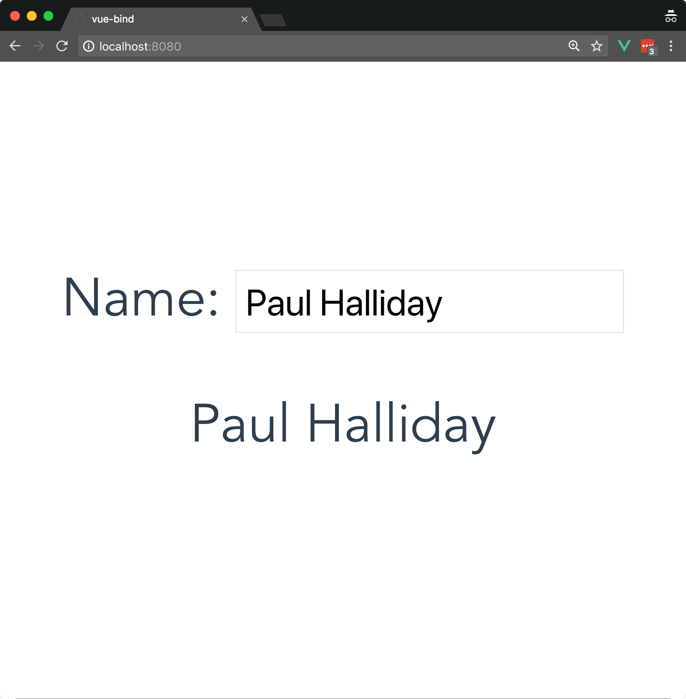
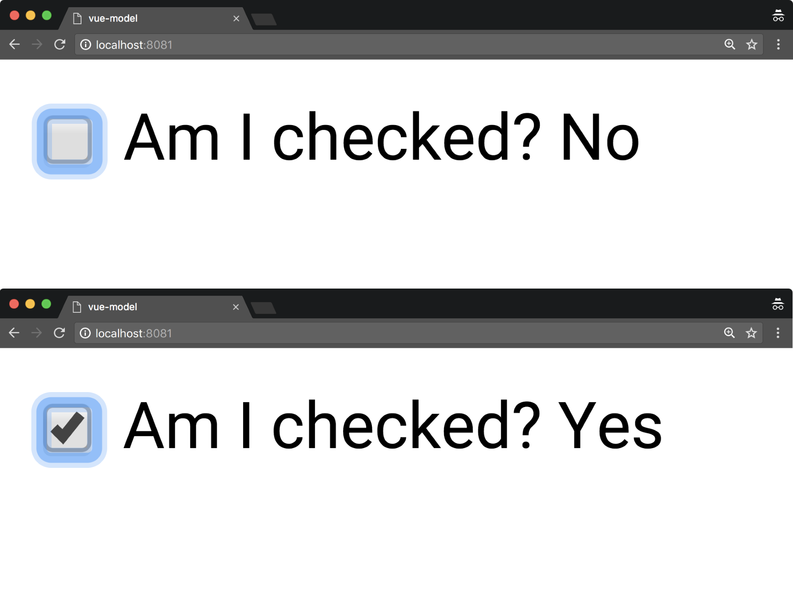
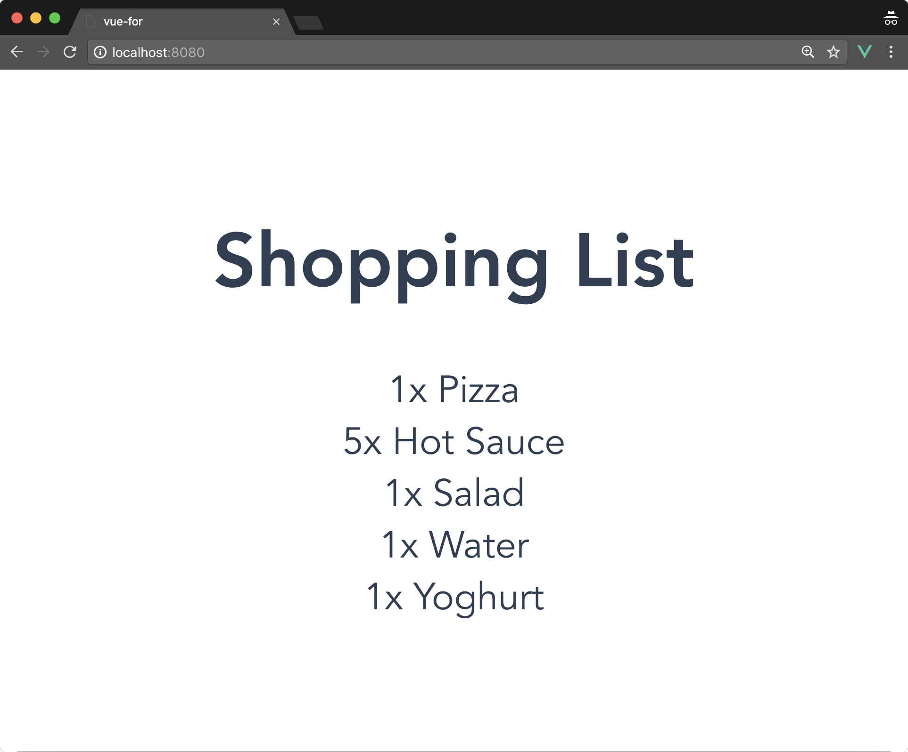
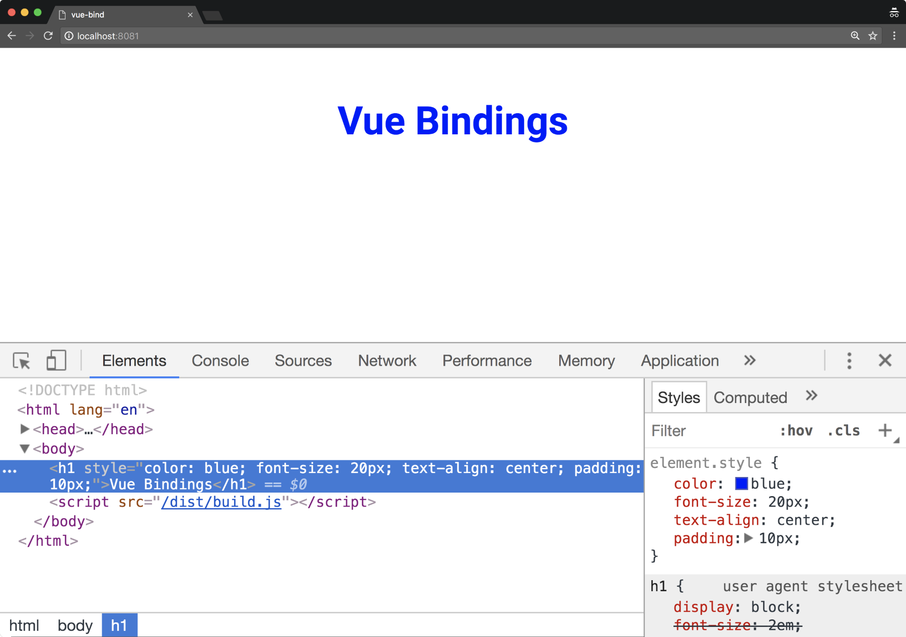
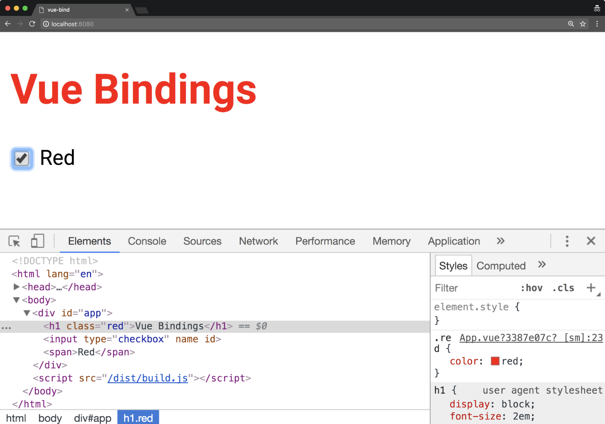
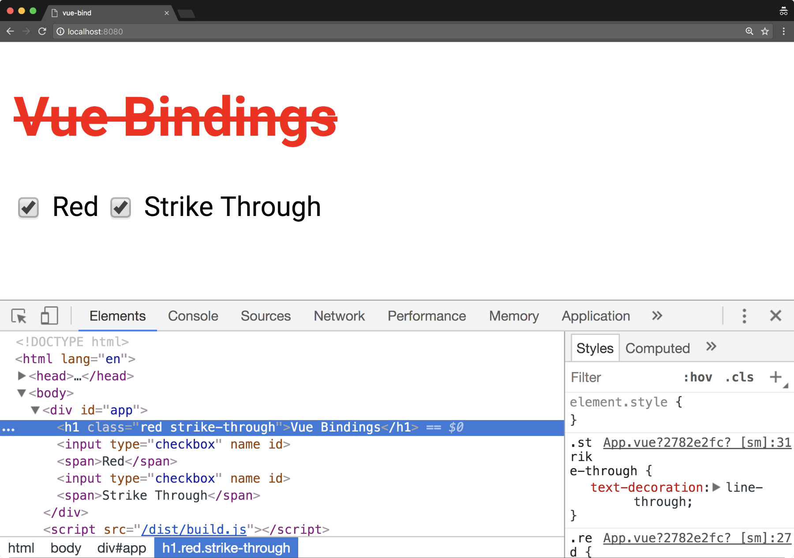
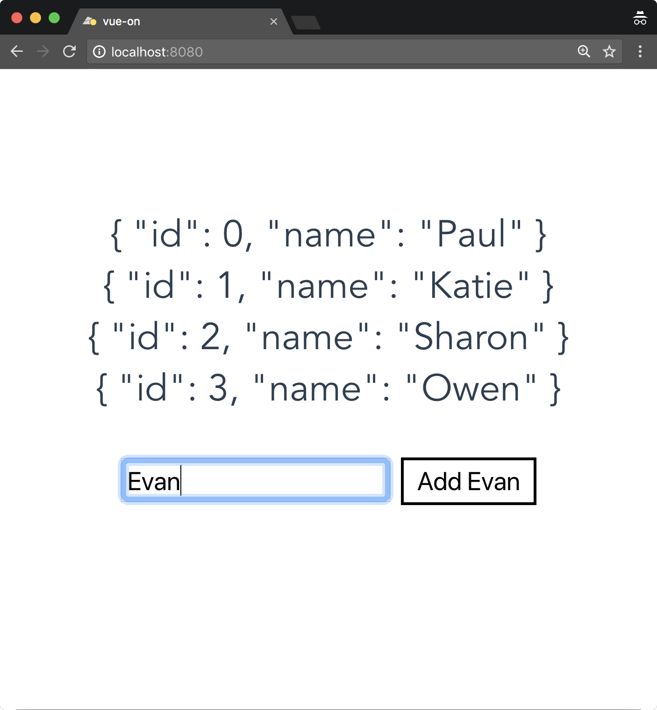
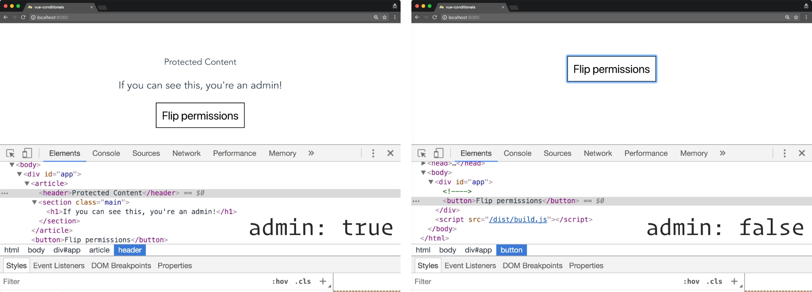
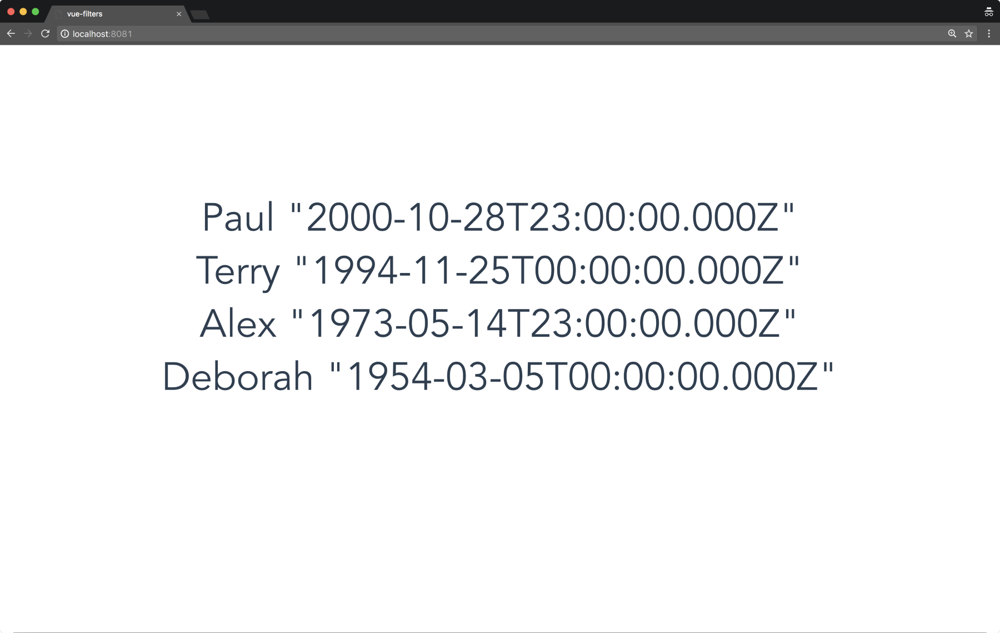
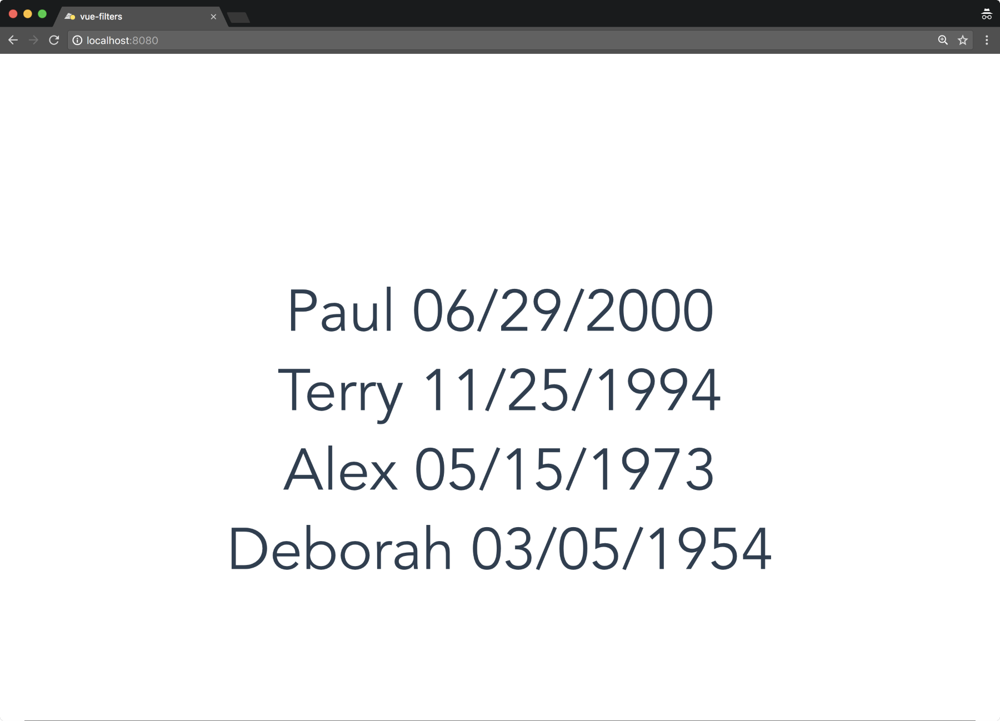

********
Vue.js指令
********
在编写 ``Vue`` 应用程序时，我们可以访问各种强大的指令，这些指令允许我们调整内容在屏幕上显示的方式。 这使我们能够创建与 ``HTML`` 模板高度互动的用户体验。 本章将详细讨论这些指令中的每条指令，以及任何允许我们改进工作流程的捷径和模式。

在本章的最后，你将会得到：

- 使用属性绑定来有条件地更改元素行为；
- 研究使用 ``v-model`` 的双向绑定；
- 使用 ``v-if`` ， ``v-else`` 和 ``v-if-else`` 有条件地显示信息；
- 用 ``v-for`` 迭代集合中的项目；
- 用 ``v-on`` 监听事件（如键盘/输入）；
- 使用事件修饰符来更改指令的绑定；
- 使用过滤器来更改绑定的视图数据；
- 看看我们如何使用简写语法来节省时间并更具说明性；

模型
====
任何商业应用程序最常见的要求之一就是文本输入。 ``Vue`` 通过 ``v-model`` 指令帮助我们满足这一需求。 它使我们能够在表单输入事件上创建反应式双向数据绑定，从而轻松处理表单。 这是一个受欢迎的抽象概念，否则这将是一种乏味的方式来获取表单值和输入事件。 为了探索这个，我们可以创建一个新的 ``Vue`` 项目：

.. code-block:: shell

    # Create a new Vue project
    $ vue init webpack-simple vue-model

    # Navigate to directory
    $ cd vue-model

    # Install dependencies
    $ npm install

    # Run application
    $ npm run dev

我们可以转到我们的根 ``App.vue`` 文件并从模板中删除所有内容，然后添加一个包含标签和表单输入的新 ``div`` ：

.. code-block:: html

    <template>
     <div id="app">
      <label>Name:</label>
      <input type="text">
     </div>
    </template>

这使我们能够将文本添加到我们的输入元素，也就是说，提示用户输入他们的名字。 为了演示，我想捕获该值并将其显示在 ``name`` 元素下面。 为了做到这一点，我们需要将 ``v-model`` 指令添加到输入元素；这将允许我们捕获用户输入事件并将该值放入一个变量中。 我们将调用这个变量名称，然后将其添加到我们的 ``Vue`` 实例中的数据对象中。 由于该值现在作为变量捕获，因此我们可以使用插值绑定将其显示在我们的模板中：

.. code-block:: js

    <template>
    <div id="app">
        <label>Name:</label>
    <input type="text" v-model="name">
        <p>{{name}}</p>
    </div>
    </template>

    <script>
    export default {
        data () {
            return {
                name: ''
            }
        }
    }
    </script>

结果可以在以下屏幕截图中看到：



我们不限于在文本输入中使用 ``v-model`` ，我们还可以在选中时捕获单选按钮或复选框。 以下示例显示了这一点：

.. code-block:: html

    <input type="checkbox" v-model="checked">
    <span>Am I checked? {{checked ? 'Yes' : 'No' }}</span>

这会在我们的浏览器中显示如下：



关于 ``v-model`` 的好处是它能够很好地适应各种表单控件，给我们在 ``HTML`` 模板的声明能力。

使用v-for迭代
=============
如果我们想要重复一定数量的内容，我们可以使用 ``v-for`` 。 这通常用于使用数据集填充模板。 例如，假设我们有杂货清单，我们希望在屏幕上显示此列表；我们可以用 ``v-for`` 做到这一点。 我们可以创建一个新项目来实现这一点：

.. code-block:: shell

    # Create a new Vue project
    $ vue init webpack-simple vue-for

    # Navigate to directory
    $ cd vue-for

    # Install dependencies
    $ npm install

    # Run application
    $ npm run dev

首先，让我们创建一个包含我们可以在屏幕上显示的杂货列表的数组。 每件商品都有一个 ``id``, ``name`` 和 ``quantity`` ：

.. code-block:: js

    <script>
    export default {
      name: 'app',
      data () {
        return {
          groceries: [
            {
              id: 1,
              name: 'Pizza',
              quantity: 1
            },
            {
              id: 2,
              name: 'Hot Sauce',
              quantity: 5
            },
            {
              id: 3,
              name: 'Salad',
              quantity: 1
            },
            {
              id: 4,
              name: 'Water',
              quantity: 1
            },
            {
              id: 4,
              name: 'Yoghurt',
              quantity: 1
            }
          ]
        }
      }
    }
    </script>

    <style>
    #app {
      font-family: 'Avenir', Helvetica, Arial, sans-serif;
      -webkit-font-smoothing: antialiased;
      -moz-osx-font-smoothing: grayscale;
      text-align: center;
      color: #2c3e50;
      margin-top: 60px;
    }

    ul {
      list-style-type: none;
      padding: 0;
    }

    li {
      display: block;
    }

    </style>

然后，我们可以遍历杂货清单中的每个项目，并修改 ``DOM`` 以在屏幕上显示它们：

.. code-block:: html

    <template>
      <div id="app">
        <h1>Shopping List</h1>
        <ul>
          <li v-for="item in groceries" v-bind:key="item.id">
            {{item.name}}
          </li>
        </ul>
      </div>
    </template>

注意我们在 ``li`` 元素上有一个 ``v-bind:key ="item.id"`` 。 这使得 ``Vue`` 可以随着时间的推移而更好地工作，并且在可能的情况下应该添加一个关键字：



绑定
====
在本节中，我们将看看如何在 ``Vue`` 应用程序中动态切换 ``CSS`` 类。 我们将通过研究 ``v-bind`` 指令开始，我们将看到如何将它应用于 ``class`` 和 ``style`` 属性。 这对于根据特定业务逻辑有条件地应用样式非常有用。 我们来为这个例子创建一个新的 ``Vue`` 项目：

.. code-block:: shell

    # Create a new Vue project
    $ vue init webpack-simple vue-bind

    # Navigate to directory
    $ cd vue-bind

    # Install dependencies
    $ npm install

    # Run application
    $ npm run dev

在我们的项目内部，我们可以使复选框代表我们应用程序的不同状态。 我们将从一个名为 ``red`` 的开始。 正如你可以推断出的那样，通过检查这一点，我们可以将一段特定的文本变成 ``red`` ，然后通过取消选中它变成黑色。

在 ``App.vue`` 中创建一个名为 ``red`` 的值为 ``false`` 的数据对象：

.. code-block:: js

    <script>
    export default {
     data () {
      return {
       red: false
      }
     }
    }
    </script>

这表示我们复选框的值，我们可以使用 ``v-model`` 指令设置它：

.. code-block:: html

    <template>
     <div id="app">
      <h1>Vue Bindings</h1>

      <input type="checkbox" v-model="red" >
      <span>Red</span>
     </div>
    </template>

现在，我们可以为我们的颜色创建一个新的 ``CSS`` 类：

.. code-block:: css

    <style>
        .red {
         color: red;
        }
    </style>

正如您在浏览器中看到的，如果我们打开开发工具，我们可以看到文本的颜色目前设置为蓝色：



最后，要根据上下文的红色变量添加/删除类，我们需要像下面这样将 ``v-bind:class`` 指令添加到我们的 ``h1`` 中：



增加辅助属性
------------
如果我们还想添加另一个属性到我们的类绑定中，我们需要添加另一个属性（如 ``strikeThrough`` ）到我们的数据对象中，如下所示：

.. code-block:: js

    data () {
        return {
            red: false,
            strikeThrough: false
        }
    }

然后，我们增加另一个 ``checkbox`` :

.. code-block:: html

    <input type="checkbox" v-model="strikeThrough">
    <span>Strike Through</span>

使用合适的 ``style`` ：

.. code-block:: css

    <style>
    .red {
        color: red;
    }

    .strike-through {
        text-decoration: line-through;
    }
    </style>

最后，我们需要调整绑定来添加额外的类，如下所示：

.. code-block:: html

    <h1 v-bind:class="{ 'red': red, 'strike-through': strikeThrough }">Vue Bindings</h1>

以下是选择两个复选框的结果：



样式绑定
--------
我们可能想在我们的标题中添加各种样式，所以我们可以使用 ``v-bind:style`` 。 我们可以通过在 ``data`` 对象内创建一个名为 ``headingStyles`` 的新对象来看到这一点：

.. code-block:: js

    data () {
        return {
            headingStyles: {
                color: 'blue',
                fontSize: '20px',
                textAlign: 'center'
            }
        }
    }

任何时候我们添加的 ``CSS`` 类都是 ``kebab-case`` （例如， ``text-align`` ），现在它们变成了我们的 ``JavaScript`` 中的骆驼案例（ ``textAlign`` ）。

让我们将样式添加到模板中的标题中：

.. code-block:: html

    <h1 v-bind:style="headingStyles">Vue Bindings</h1>

每当编译器看到一个 ``v-bind`` 或 ``:`` 时，引号内部的内容被视为带有隐含 ``this``的 ``JavaScript`` 。

我们也可以拆分它来添加 ``layoutStyles`` 作为一个单独的对象，例如：

.. code-block:: js

    data () {
        return {
            headingStyles: {
                color: 'blue',
                fontSize: '20px',
            },
            layoutStyles: {
                textAlign: 'center',
                padding: '10px'
            }
        }
    }

因此，我们现在要做的就是使用 ``v-bind`` 将样式添加到模板中的数组中，就像在 ``<h1>`` 标记中一样：

.. code-block:: html

    <template>
     <h1 v-bind:style="[headingStyles, layoutStyles]">Vue Bindings</h1>
    </template>


您现在可以在屏幕上看到我们样式的结果。 请注意，数组中的多个项目时都会对首先声明的样式优先被采用。

DOM事件和v-on
=============
我们可以使用 ``v-on`` 来处理 ``Vue`` 中的 ``DOM`` 事件。 通过监听 ``DOM`` 事件，我们可以对用户输入做出反应，包括从按键事件（例如，单击“输入”按钮）到按钮点击事件等等的所有内容。

让我们做一个游乐场项目，在我们自己的项目中尝试：

.. code-block:: shell

    # Create a new Vue project
    $ vue init webpack-simple vue-on

    # Navigate to directory
    $ cd vue-on

    # Install dependencies
    $ npm install

    # Run application
    $ npm run dev

让我们想象一个输入框，当我们点击添加按钮或者按下回车键时，输入被添加到数组中：

.. code-block:: html

    <template>
    <div id="app">
        <ul>
        <li v-for="(p, index) in person" :key="index">
        {{p}}
    </li>
    </ul>
    <input type="text" v-model="person" v-on:keyup.enter="addPerson" />
        <button v-on:click="addPerson">Add {{ person}} </button>
    </div>
    </template>

    <script>
    export default {
        name: 'app',
        data () {
            return {
                person: '',
                people: []
            }
        },
        methods: {
            addPerson() {
                this.people = this.people.concat(
                    {id: this.people.length, name: this.person}// 复制对象
                );
                this.person = '';
            }
        }
    }
    </script>

到底发生了什么？ 我们使用 ``v-model`` 指令捕获用户输入的值；在此之后，我们正在侦听 ``keyup.enter`` 和 ``v-on:click`` ，这两个事件都调用 ``addPerson`` 函数，随后将该 ``person`` 添加到数组中。 之后，使用 ``v-for`` 指令，我们可以输出这个人员列表到页面：



按键修饰器
----------
我们并不局限于简单地使用 ``enter`` 修饰符，我们还可以访问各种简写修饰符，例如使用 ``@`` 符号和缩短 ``v-on:event.name`` ``v-on:`` 将其替换为 ``@`` 符号。 其他缩短方法包括：

- ``@`` 与 ``v-on:`` 相同；
- ``@keyup.13`` 与 ``@keyup.enter`` 相同；
- ``@key*`` 组合按键，比如 ``@keyup.ctrl.alt.delete`` ；

其他修饰符可以在下表中看到：

+---------+-------------------------------+------------------------------------------+
| 名称    | 描述                          | 代码样例                                 |
+=========+===============================+==========================================+
| .enter  | 当回车键被按下                | <input v-on:keyup.enter="myFunction" />  |
+---------+-------------------------------+------------------------------------------+
| .tab    | 当Tab键被按下                 | <input v-on:keyup.tab="myFunction" />    |
+---------+-------------------------------+------------------------------------------+
| .delete | 当Delete或者Backspace键被按下 | <input v-on:keyup.delete="myFunction" /> |
+---------+-------------------------------+------------------------------------------+
| .esc    | 当Esc键被按下                 | <input v-on:keyup.esc="myFunction" />    |
+---------+-------------------------------+------------------------------------------+
| .up     | 当向上箭头被按下              | <input v-on:keyup.up="myFunction" />     |
+---------+-------------------------------+------------------------------------------+
| .down   | 当向下箭头被按下              | <input v-on:keyup.down="myFunction" />   |
+---------+-------------------------------+------------------------------------------+
| .left   | 当向左箭头被按下              | <input v-on:keyup.left="myFunction" />   |
+---------+-------------------------------+------------------------------------------+
| .right  | 当向右箭头被按下              | <input v-on:keyup.right="myFunction" />  |
+---------+-------------------------------+------------------------------------------+

事件修饰符
----------
通常，当我们使用 ``JavaScript`` 内部的事件时，我们将修改事件本身的功能。这意味着我们需要在我们的处理程序中添加 ``event.preventDefault()`` 或 ``event.stopPropagation()`` 。 ``Vue`` 通过在模板内部使用事件修饰符处理，帮助我们抽象这些调用。

这是最好的一个 ``form`` 示例。 我们来看看我们以前的人员示例，并修改它以包含一个 ``form`` 元素：

.. code-block:: html

    <template>
      <div id="app">
        <ul>
          <li v-for="p in people" v-bind:key="p.id" >
            {{p}}
          </li>
        </ul>

        <form v-on:submit="addPerson">
          <input type="text" v-model="person" />
          <button>Add {{ person}} </button>
        </form>
      </div>
    </template>

如果你尝试运行这个例子，你会注意到当我们点击 ``Add`` 按钮时，页面刷新。 这是因为它是表单提交事件的默认行为。 由于此刻我们不向服务器发布数据，因此我们需要将 ``.prevent`` 修饰符添加到我们的 ``submit`` 事件中：

.. code-block:: html

    <form v-on:submit.prevent="addPerson">
        <input type="text" v-model="person" />
        <button>Add {{ person }} </button>
    </form>

现在，当我们选择我们的按钮时，调用 ``addPerson``` 函数而不刷新页面。

有条件地显示DOM元素
===================
在创建商业应用程序时，如果某些条件为 ``true`` 或 ``false`` ，只需显示特定元素，就会出现很多次。 这可能包括用户的年龄，用户是否已登录，无论是管理员还是您可以想到的任何其他业务逻辑。

为此，我们有各种各样的条件指令，例如 ``v-show`` ， ``v-if`` ， ``v-else`` 和 ``v-else-if`` ，所有这些指令都以相似但不同的方式起作用。 让我们通过创建一个新的游乐场项目来更详细地了解这一点：

.. code-block:: shell

    # Create a new Vue project
    $ vue init webpack-simple vue-conditionals

    # Navigate to directory
    $ cd vue-conditionals

    # Install dependencies
    $ npm install

    # Run application
    $ npm run dev

v-show
-------
如果我们想从视图中隐藏元素，但仍然将它们放在 ``DOM`` 中（ ``display:none`` ），我们可以使用 ``v-show`` ：

.. code-block:: html

    <template>
    <div id="app">
        <article v-show="admin">
        <header>Protected Content</header>
    <section class="main">
        <h1>If you can see this, you're an admin!</h1>
    </section>
    </article>

    <button @click="admin = !admin">Flip permissions</button>
    </div>
    </template>

    <script>
    export default{
        name: 'app',
        data (){
            return{
                admin: true
            }
        }
    }
    </script>

例如，如果我们有一个数据变量允许我们确定某人是否是管理员，那么我们可以使用 ``v-show`` 仅向适当的用户显示受保护的内容：

.. image:: ./images/6-9.png

请注意，在上图中，当 ``admin`` 设置为 ``false`` 时， ``display:none`` 样式将添加到元素中。 乍一看，它可能看起来像这正是我们想要的，我们的项目已经消失了！ 在某些情况下，情况就是这样，但在其他情况下，使用 ``v-if`` 可能会更好。

``v-show`` 不会从 ``DOM`` 中移除该元素，这意味着所有内容都是最初加载的，并且如果未被使用就会被隐藏。 我们的页面必须渲染此内容，这可能会导致以错误方式使用时的性能问题; 因此在使用 ``v-show`` 之前请问这个问题：

**我是否需要再次显示此组件？ 如果是的话，会经常出现吗？**

如果这个问题的答案是肯定的，那么 ``v-show`` 在这种情况下可能会更好。 否则，如果这个答案是否定的，那么 ``v-if`` 在这个用例中可能会更好。

v-if
----
如果我们想有条件地从 ``DOM`` 中删除元素，我们可以使用 ``v-if`` 。 让我们用 ``v-if`` 替换前面的 ``v-show`` 指令：

.. code-block:: html

    <article v-if="admin">
        <header>Protected Content</header>
        <section class="main">
            <h1>If you can see this, you're an admin!</h1>
        </section>
    </article>

请注意，现在当我们查看 ``DOM`` 时，元素被完全删除：



v-else
------
显示或隐藏元素时的常见模式是改为显示不同的内容。 虽然我们可以多次使用 ``-if`` 或 ``v-show`` ，但我们也可以访问 ``v-else`` 指令，可以在显示或隐藏元素之后直接使用该指令。

让我们更详细地看看这个：

.. code-block:: html

    <article v-if="admin">
      <header>Protected Content</header>
      <section class="main">
        <h1>If you can see this, you're an admin!</h1>
      </section>
    </article>
    <article v-else>
      <header>You're not an admin!</header>
      <section class="main">
        <h1>Perhaps you shouldn't be here.</h1>
      </section>
    </article>

通过将 ``v-else`` 指令添加到第二个 ``<article>`` 中，我们告诉 ``Vue`` ，只要第一个条件被隐藏，我们就想显示这个 ``DOM`` 元素。 由于工作方式的原因，我们不必将值传递给 ``v-else`` ，因为 ``Vue`` 会在前面的元素中查找结构指令。

认识到这一点很重要，如果我们在 ``v-if`` 和 ``v-else`` 指令之间有一个元素，这将不起作用，例如：

.. code-block:: html

    <article v-if="admin">
      <header>Protected Content</header>
      <section class="main">
        <h1>If you can see this, you're an admin!</h1>
      </section>
    </article>
    <h1>The v-else will be ignored.</h1>
    <article v-else>
      <header>You're not an admin!</header>
      <section class="main">
        <h1>Perhaps you shouldn't be here.</h1>
      </section>
    </article>

v-else-if
---------
虽然 ``v-else`` 在标准 ``IF NOT A`` 就是 ``B``场景下运行良好，但您可能需要测试多个值并显示不同的模板。 与 ``v-else`` 类似，我们可以使用 ``v-else-if`` 来更改应用程序的行为。 对于这个例子，我们将通过使用 ``ES2015`` 引入的生成器来获得乐趣。

要使用生成器，我们需要安装 ``babel-polyfill`` 软件包； 这也使我们能够使用更好的承若处理，如 ``async`` 和 ``await`` ：

.. code-block:: shell

    $ npm install babel-polyfill --save-dev

安装完成后，我们可以修改我们的 ``Webpack`` 配置（ ``webpack.config.js`` ），将其包含在我们的入口文件中：

.. code-block:: js

    module.exports = {
     entry: ['babel-polyfill', './src/main.js'],
     output: {
      path: path.resolve(__dirname, './dist'),
      publicPath: '/dist/',
      filename: 'build.js',
     },
     // Omitted

如果我们没有安装合适的 ``polyfill`` ，我们将无法在我们的项目中使用生成器功能。 让我们创建一个名为 ``returnRole()`` 的新方法，它在调用时为我们提供了三个用户“角色”之一：

.. code-block:: js

    export default {
        name: 'app',
        data() {
            return {
                role: '',
            }
        },
        methods: {
            *returnRole() {
                yield 'guest';
                yield 'user';
                yield 'admin';
            }
        }
    };

如果你以前从未见过一个生成器函数，你可能想知道星号（ ``*`` ）是什么，我们已经为我们的函数名称加上了前缀，以及 ``yield`` 关键字。 这本质上允许我们通过捕获它的一个实例来遍历该函数。 例如，让我们创建一个返回迭代器的数据值，我们可以在 ``next()`` 上调用它：

.. code-block:: js

    data() {
        return {
            role: '',
            roleList: this.returnRole()
        }
    },
    methods: {
        getRole()
        {
            /**
             * Calling this.roleList.next() gives us an Iterator object with the interface of:
             * { value: string, done: boolean}
             * We can therefore check to see whether this was the >last< yielded value with done, or get the result by calling .value
             */

            this.role = this.roleList.next().value;
        },
    }

因此，我们可以通过利用 ``v-if-else`` 的模板根据用户角色显示不同的消息：

.. code-block:: html

    <template>
        <div id="app">
            <article v-if="role === 'admin'">
                <header>You're an admin!</header>
                <section class="main">
                    <h1>If you can see this, you're an admin!</h1>
                </section>
            </article>
            <article v-else-if="role === 'user'">
                <header>You're a user!</header>
                <section class="main">
                    <h1>Enjoy your stay!</h1>
                </section>
            </article>
            <article v-else-if="role === 'guest'">
                <header>You're a guest!</header>
                <section class="main">
                    <h1>Maybe you should make an account.</h1>
                </section>
            </article>
            <h1 v-else>You have no role!</h1>
            <button @click="getRole()">Switch Role</button>
        </div>
    </template>

根据用户角色，屏幕上会显示不同的消息。 如果用户没有角色，我们使用 ``v-else`` 来显示一条消息，指出你没有角色！ 这个例子展示了我们如何利用结构指令来根据应用程序状态真正改变 ``DOM`` 。

过滤器
======
在本节中，我们将研究过滤器; 您可能在 ``Angular`` （ ``Pipes`` ）等框架中遇到过滤器。 也许我们想创建一个过滤器，使我们能够以可读格式格式化日期（ ``DD/MM/YYYY`` ）。 我们来创建一个游乐场项目来进一步研究：

.. code-block:: shell

    # Create a new Vue project
    $ vue init webpack-simple vue-filters

    # Navigate to directory
    $ cd vue-filters

    # Install dependencies
    $ npm install

    # Run application
    $ npm run dev

如果我们有一些测试 ``people`` 并使用 ``v-for`` 指令在屏幕上显示它们，我们会得到以下结果：



要获得前面屏幕截图中显示的结果，我们通过 ``v-for`` 指令向适当的数据显示测试 ``people`` ，我们需要添加以下代码：

.. code-block:: js

    <template>
    <div id="app">
        <ul>
        <li v-for="person in people" v-bind:key="person.id">
        {{person.name}} {{person.dob}}
    </li>
    </ul>
    </div>
    </template>

    <script>
    export default {
        name: 'app',
        data() {
            return {
                people: [
                    {
                        id: 1,
                        name: 'Paul',
                        dob: new Date(2000, 5, 29),
                    },
                    {
                        id: 2,
                        name: 'Terry',
                        dob: new Date(1994, 10, 25),
                    },
                    {
                        id: 3,
                        name: 'Alex',
                        dob: new Date(1973, 4, 15),
                    },
                    {
                        id: 4,
                        name: 'Deborah',
                        dob: new Date(1954, 2, 5),
                    },
                ],
            };
        },
    };
    </script>

我们可以自己完成转换日期的工作，但是在可能的情况下，总是值得看看是否有可以执行相同操作的可信的第三方组件。 我们将使用时刻(https://momentjs.com)来执行此操作。

让我们为我们的项目安装时刻：

.. code-block:: shell

    $ npm install moment --save

然后我们可以将它添加到我们的 ``App.vue`` 中：

.. code-block:: js

    <script>
    import moment from 'moment';

    export default {
     // Omitted
    }
    </script>

局部注册过滤器
--------------
然后我们有一个选择：将局部过滤器添加到此 ``Vue`` 实例，或将其全局添加到整个项目中。 我们先看看如何在局部添加它：

首先，我们将创建一个函数，该函数接受一个值并使用 ``moment`` 将该日期作为格式化日期返回：

.. code-block:: js

    const convertDateToString = value => moment(String(value)).format('MM/DD/YYYY');

然后，我们可以在我们的 ``Vue`` 实例中添加一个 ``filters`` 对象，并通过一个关键字（如 ``date`` ）来引用它。 当我们在模板内部调用 ``date`` 过滤器时，该值将被传递给此过滤器，相反，我们将在屏幕上显示转换后的日期。 这可以通过使用 ``| Key`` 来完成过滤器调用，如下面的代码所示：

.. code-block:: html

    <ul>
        <li v-for="person in people" v-bind:key="person.id">
            {{person.name}} {{person.dob | date}}
        </li>
    </ul>

最后，为了将其添加到局部 ``Vue`` 实例，我们可以添加一个引用我们的函数的过滤器对象：

.. code-block:: js

    export default {
        filters: {
            date: convertDateToString,
        },

这个结果显示了预期的日期：



全局注册过滤器
--------------
如果我们想在其他地方使用这个过滤器，我们可以将这个函数抽象成它自己的文件并再次引用我们的过滤器，或者，我们可以在我们的应用程序内部全局注册日期过滤器。 让我们将我们的 ``convertDateToString`` 函数抽象到 ``src/filters/date/date.filter.js`` 中它自己的文件中：

.. code-block:: js

    import moment from 'moment';

    export const convertDateToString = value => moment(String(value)).format('MM/DD/YYYY');

之后，我们可以使用以下接口 ``Vue.filter('filterName'，filterFunction())`` 在 ``main.js`` 中定义过滤器。 正如我们将函数抽象到它自己的文件中一样，我们可以导入它并像这样定义它：

.. code-block:: js

    import Vue from 'vue';
    import App from './App.vue';
    import { convertDateToString } from './filters/date/date.filter';

    Vue.filter('date', convertDateToString);

    new Vue({
        el: '#app',
        render: h => h(App),
    });

如果您再次查看我们的应用程序，您会看到我们得到的结果与以前相同。 因此，重要的是要考虑在项目内使用过滤器的位置和次数。 如果你在特定的组件/实例上使用它（一次），那么你应该把它放在局部；否则，将其放在全局。

总结
====
在本章中，我们看了许多 ``Vue`` 指令及其用法。这使我们有能力声明性地改变模板在屏幕上的显示方式，包括捕捉用户输入，钩入事件，过滤视图数据等等。 当您想要在 ``Vue.js`` 应用程序中实现指令，本章都应该用作参考。

基于组件的架构是一个重要的概念，使我们能够构建从个人到企业的可扩展项目。 在下一章中，我们将研究如何创建这些可重用组件来封装项目中的功能块。
