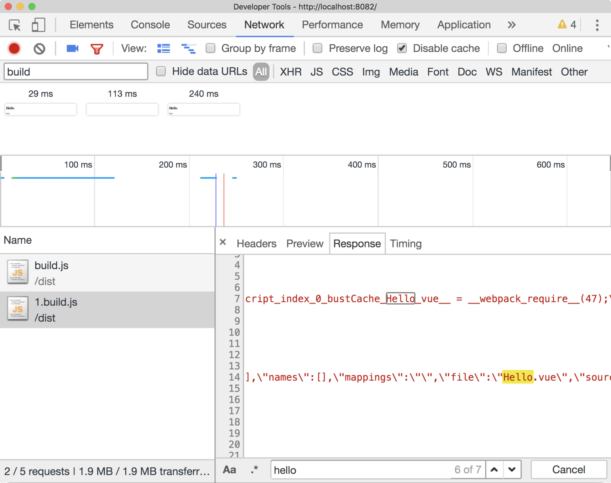
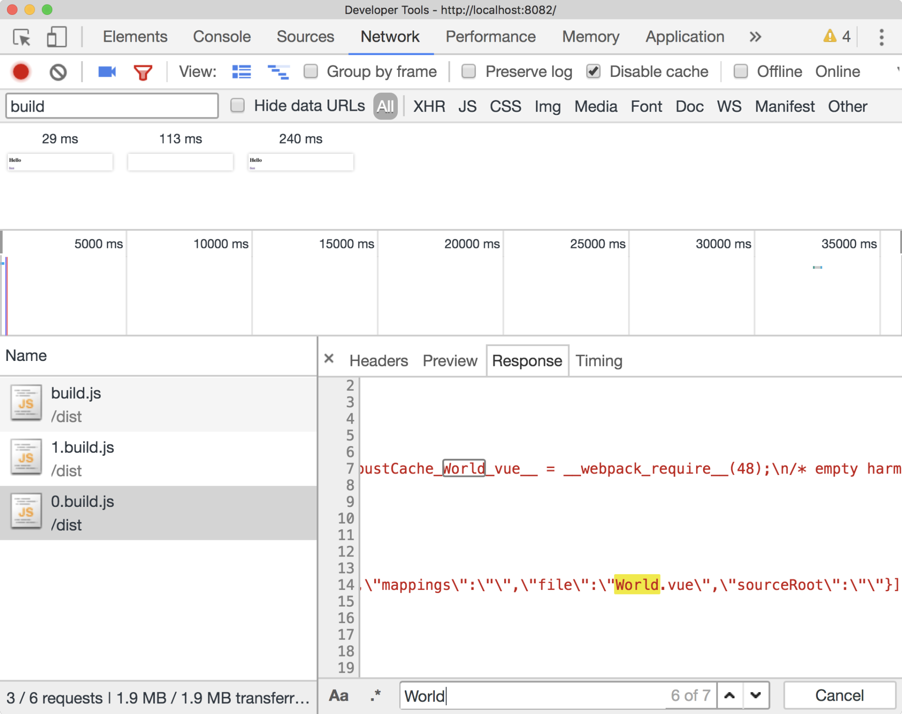
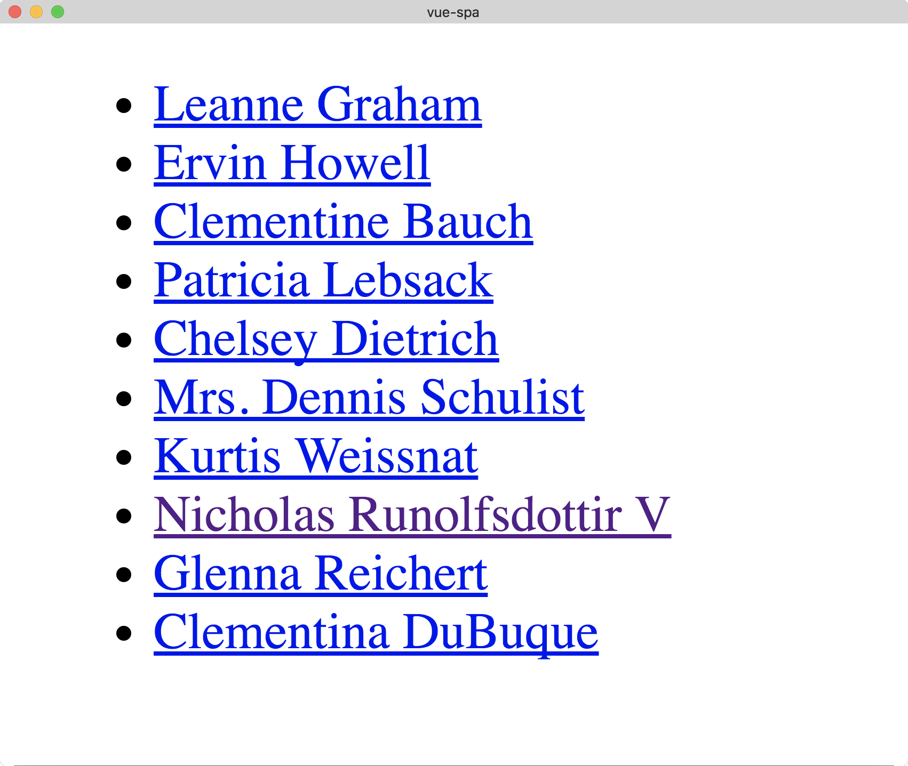
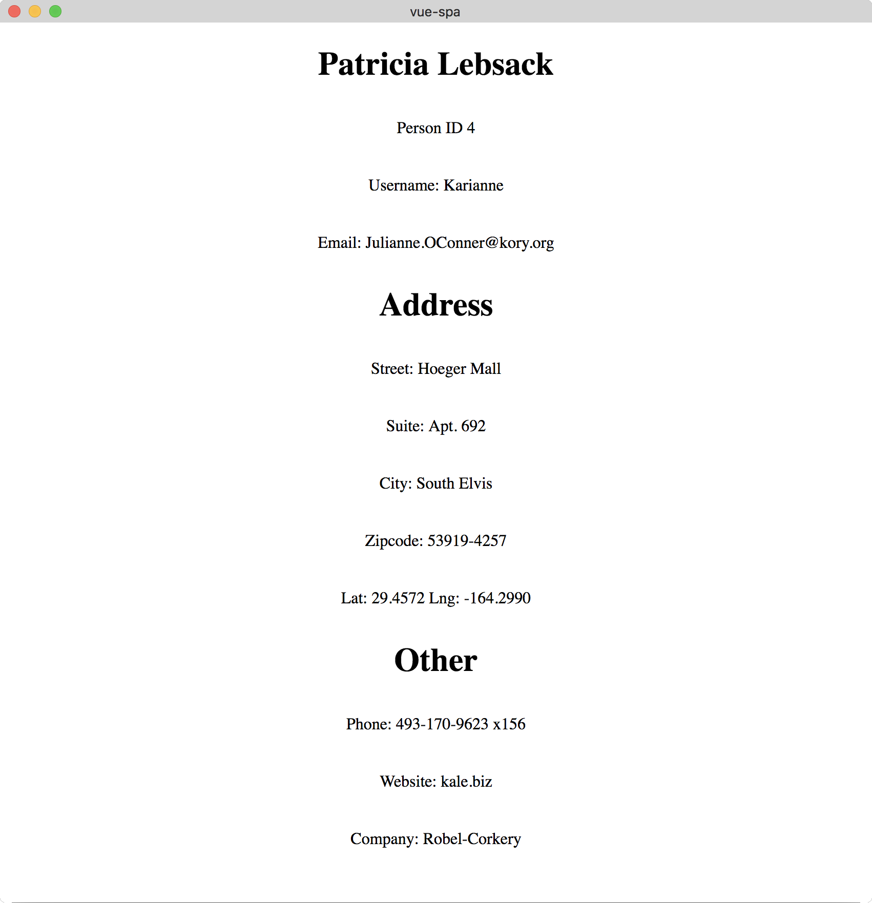
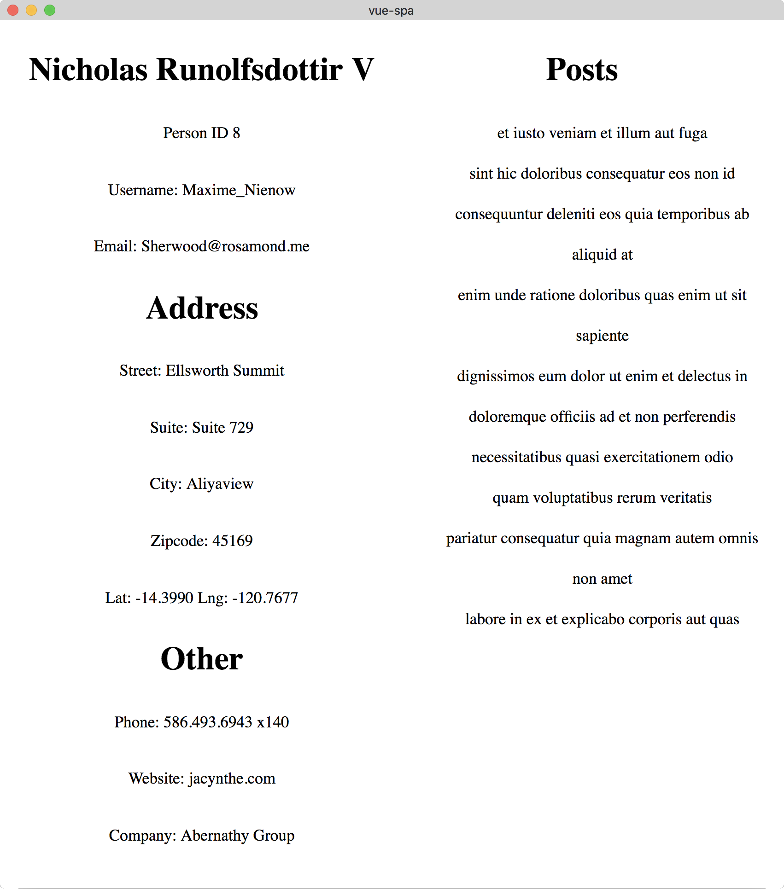

*******
Vue路由模式
*******
路由是任何单页应用程序（SPA）非常重要的一部分。 本章重点介绍如何最大化 ``Vue`` 路由器，并着眼于从用户到页面之间的路由，到参数到最佳配置。

到本章结束时，我们将涵盖以下内容：

- 在 ``Vue.js`` 应用程序中实现路由；
- 使用动态路由匹配来创建路由参数；
- 将路由参数作为组件 ``props`` 传递；

单页面应用
==========
现代 ``JavaScript`` 应用程序实现了一种称为 ``SPA`` 的模式。 以其最简单的形式，它可以被看作是基于 ``URL`` 显示组件的应用程序。 当模板映射到路由时，不需要重新加载页面，因为它们可以根据用户导航的位置注入。

这是路由器的工作。

通过这种方式创建我们的应用程序，我们可以提高感知速度和实际速度，因为我们的应用程序更具动态性。 如果我们添加前一章（HTTP）中学到的概念，就会发现它们很好地与 ``SPA`` 模型结合在一起。

使用路由
========
让我们开启一个演示项目并安装 ``vue-router`` 库。 这使我们能够在我们应用程序中利用路由，并赋予我们现代 ``SPA`` 的能力。

在终端中运行以下命令：

.. code-block:: shell

    # Create a new Vue project
    $ vue init webpack-simple vue-router-basics

    # Navigate to directory
    $ cd vue-router-basics

    # Install dependencies
    $ npm install

    # Install Vue Router
    $ npm install vue-router

    # Run application
    $ npm run dev

当我们使用 ``webpack`` 作为构建系统的一部分时，我们已经使用 ``npm`` 安装了路由器。 然后，我们可以在 ``src/main.js`` 中初始化路由器：

.. code-block:: js

    import Vue from 'vue';
    import VueRouter from 'vue-router';

    import App from './App.vue';

    Vue.use(VueRouter);

    new Vue({
        el: '#app',
        render: h => h(App)
    });

这有效地将 ``VueRouter`` 注册为全局插件。 一个插件只是一个接收 ``Vue`` 和选项作为参数的函数，并允许诸如 ``VueRouter`` 的库为我们的 ``Vue`` 应用程序添加功能。

创建路由
--------
然后，我们可以在我们的 ``main.js`` 文件中定义两个小组件，其中只有一个模板，用来显示了带有一些文本的 ``h1`` ：

.. code-block:: js

    const Hello = { template: `<h1>Hello</h1>` };
    const World = { template: `<h1>World</h1>`};

然后，为了在屏幕上以特定的 ``URL`` （例如 ``/hello`` 和 ``/world`` ）来显示这些组件，我们可以在我们的应用程序中定义路由：

.. code-block:: js

    const routes = [
        { path: '/hello', component: Hello },
        { path: '/world', component: World }
    ];

现在我们已经定义了我们想要使用的组件以及应用程序中的路由，我们需要创建一个新的 ``VueRouter`` 实例并传递上面定义的 ``routes`` 变量。

尽管我们使用了 ``Vue.use(VueRouter)`` ，但我们仍然需要创建一个新的 ``VueRouter`` 实例并使用 ``routes`` 初始化它 。 这是因为仅仅将 ``VueRouter`` 注册为插件可以让我们在 ``Vue`` 实例中的访问路由器选项：

.. code-block:: js

    const router = new VueRouter({
      routes
    });

然后我们需要将 ``router`` 传递给我们的根 ``Vue`` 实例：

.. code-block:: js

    new Vue({
        el: '#app',
        router,
        render: h => h(App)
    });

最后，为了在我们的 ``App.vue`` 组件中显示我们的路由的组件，我们需要在模板中添加 ``router-view`` 组件：

.. code-block:: html

    <template>
        

            <router-view/>
        

    </template>

然后，如果我们导航到 ``/＃/hello/`` 或 ``/＃/world`` ，则会显示相应的组件：

动态路由
--------
我们也可以根据特定参数动态匹配路由。 这是通过在参数名称前面用冒号指定一个路由来完成的。以下是使用类似问候语组件的示例：

.. code-block:: js

    // Components
    const Hello = { template: `<h1>Hello</h1>` };
    const HelloName = { template: `<h1>Hello {{ $route.params.name}}` }

    // Routes
    const routes = [
        { path: '/hello', component: Hello },
        { path: '/hello/:name', component: HelloName },
    ]

如果我们的用户导航到 ``/hello`` ，他们会看到文本为 ``Hello`` 的 ``h1`` 。 否则，如果他们导航到 ``/hello/{name}`` （即 ``Paul`` ），他们会看到带有文本 ``Hello Paul`` 的 ``h1`` 。

我们已经取得了很多进展，但重要的是要知道，当我们导航到参数化 ``URL`` 时，如果参数更改（即从 ``/hello/paul`` 到 ``/hello/katie`` ），组件生命周期挂钩不会再次被触发。 我们很快就会看到这个！

路由props
^^^^^^^^^
让我们更改 ``/hello/name`` 路由以将 ``name`` 参数作为组件 ``prop`` 传递，可以通过向路由添加 ``props:true`` 标志来完成：

.. code-block:: js

    const routes = [
        { path: '/hello', component: Hello },
        { path: '/hello/:name', component: HelloName, props: true},
    ];

然后，我们可以更新我们的组件，以获取一个 ``id`` 为 ``name`` 的 ``prop``并使用生命周期钩子函数将其记录到控制台：

.. code-block:: js

    const HelloName = {
        props: ['name'],
        template: `<h1>Hello {{ name }}</h1>`,
        created() {
            console.log(`Hello ${this.name}`)
        }
    }

如果我们尝试导航到不同的动态路由，那么即使我们的页面显示正确的名称，我们也会看到 ``created`` 钩子只会触发一次（除非我们刷新页面）：

组件导航卫兵
------------
我们如何解决生命周期钩子问题？ 在这种情况下，我们可以使用所谓的导航卫士。 这使我们能够挂接路由器的不同生命周期，比如 ``beforeRouteEnter`` ， ``beforeRouteUpdate`` 和 ``beforeRouteLeave`` 方法。

beforeRouteUpdate
^^^^^^^^^^^^^^^^^
我们使用 ``beforeRouteUpdate`` 方法来访问有关路由改变的信息：

.. code-block:: js

    const HelloName = {
        props: ['name'],
        template: `<h1>Hello {{ name }}</h1>`,
        beforeRouteUpdate(to, from, next) {
            console.log(to);
            console.log(from);
            console.log(`Hello ${to.params.name}`)
        },
    }

如果我们在导航到 ``/hello/{name}`` 下的其他路由后检查 ``JavaScript`` 控制台，我们将能够看到用户要前往哪个路线以及他们来自哪里。 ``to`` 和 ``from`` 对象还使我们可以访问 ``params`` ，查询，完整路径等等。

虽然我们正确地获取日志语句，但如果我们尝试在路径之间导航，则会注意到我们的应用程序不会使用参数 ``name prop`` 进行更新。 这是因为我们在完成卫兵挂载函数内没有使用 ``next`` 函数。 让我们在下面添加：

.. code-block:: js

    beforeRouteUpdate(to, from, next) {
        console.log(to);
        console.log(from);
        console.log(`Hello ${to.params.name}`)
        next();
    },

beforeRouteEnter
^^^^^^^^^^^^^^^^
我们还可以利用 ``beforeRouteEnter`` 在进入组件路由之前执行操作。 下面是一个例子：

.. code-block:: js

    beforeRouteEnter(to, from, next) {
        console.log(`I'm called before entering the route!`)
        next();
    }

我们仍然需要调用 ``next`` 来将堆栈传递给下一个路由处理程序。

beforeRouteLeave
^^^^^^^^^^^^^^^^
我们还可以挂钩到 ``beforeRouteLeave`` ，以便在我们离开路由时执行操作。 由于我们已经在这个钩子的上下文中的这条路线上，我们可以访问组件实例。 我们来看一个例子：

.. code-block:: js

    beforeRouteLeave(to, from, next) {
        console.log(`I'm called before leaving the route!`)
        console.log(`I have access to the component instance, here's proof! Name: ${this.name}`);
        next();
    }

在这种情况下，我们需要再次调用 ``next`` 。

全局路由钩子
------------
我们查看了组件导航卫士，虽然这些工作是基于组件的，但您可能需要建立全局钩子来监听导航事件。

beforeEach
^^^^^^^^^^
我们可以使用 ``router.beforeEach`` 在整个应用程序中侦听全局路由事件。 如果您有身份验证检查或应在每条路径中使用的其他功能，则值得使用。

这里有一个例子，简单地记录用户来往的路线。 以下每个示例都假定路由器的存在范围与以下类似：

.. code-block:: js

    const router = new VueRouter({
        routes
    })

    router.beforeEach((to, from, next) => {
        console.log(`Route to`, to)
        console.log(`Route from`, from)
        next();
    });

再一次，我们必须调用 ``next()`` 来触发下一个路由守卫。

beforeResolve
^^^^^^^^^^^^^
``beforeResolve`` 全局路由守卫在导航被确认之前，同时在所有组件内守卫和异步路由组件被解析之后，解析守卫就被调用。

这是一个例子：

.. code-block:: js

    router.beforeResolve((to, from, next) => {
        console.log(`Before resolve:`)
        console.log(`Route to`, to)
        console.log(`Route from`, from)
        next();
    });

afterEach
^^^^^^^^^
我们还可以挂接全局的 ``afterEach`` 函数，该函数允许我们执行操作，然而和守卫不同的是，这些钩子不会接受 ``next`` 函数也不会改变导航本身：

.. code-block:: js

    router.afterEach((to, from) => {
        console.log(`After each:`)
        console.log(`Route to`, to)
        console.log(`Route from`, from)
    });

Resolution stack
^^^^^^^^^^^^^^^^
现在我们已经熟悉了提供的各种不同的路由生命周期挂钩，每当我们尝试导航到另一个路由时，值得研究整个解析堆栈：

1. **触发路由更改** ：这是任何路线生命周期的第一阶段，并在我们尝试导航到新路线时触发。一个例子是从 ``/hello/Paul`` 到 ``/hello/Katie`` 。此时没有导航卫兵被触发。
2. **触发组件离开警卫** ：接下来，在加载的组件上触发任何离开警卫，如 ``beforeRouteLeave`` 。
3. **触发全局 beforeEach 警卫** ：由于可以使用 ``beforeEach`` 创建全局路由中间件，因此这些功能将在任何路由更新之前调用。
4. **触发重用组件的本地 beforeRouteUpdate 警卫** ：正如我们前面看到的，每当我们用不同的参数导航到相同的路由时，生命周期钩子都不会被触发两次。相反，我们使用 ``beforeRouteUpdate`` 来触发生命周期更改。
5. **在组件中触发 beforeRouteEnter** ：这是每次在导航到任何路线之前调用的。在这个阶段，组件不被渲染，所以它不能访问 ``this`` 组件实例。
6.  **解析异步路由组件** ：然后尝试在你的项目中解析任何异步组件。下面是一个例子：

    .. code-block:: js

        const MyAsyncComponent = () => ({
            component: import ('./LazyComponent.vue'),
            loading: LoadingComponent,
            error: ErrorComponent,
            delay: 150,
            timeout: 3000
        })

7. **在成功激活的组件中触发 beforeRouteEnter** ：我们现在可以访问 ``beforeRouteEnter`` 挂钩，并且可以在解析路由之前执行任何操作。
8. **触发全局的 beforeResolve 钩子** ：组件内部提供警卫和异步路由组件已经解析，我们现在可以挂接到全局 ``router.beforeResolve`` 方法，该方法允许我们在此阶段执行操作。
9. **导航** ：所有先前的导航卫兵已被触发，用户现在已成功导航到一个路由。
10. **触发 afterEach 挂钩** ：虽然用户已经被导航到路由，但并不止于此。接下来，路由器触发一个全局的 ``afterEach`` 挂接，它可以访问 ``to`` 和 ``from`` 参数。由于此阶段路由已经被解析，它没有下一个参数，因此不会影响导航。
11. **触发DOM更新** ：路线已经解析， ``Vue`` 可以适当地触发 ``DOM`` 更新。
12. **触发在 beforeRouteEnter next中定义的回调** ：正如 ``beforeRouteEnter`` 无权访问组件的 ``this`` 上下文， ``next`` 函数的参数将接收一个回调，该回调参数在导航时解析为组件实例。这里可以看到一个例子：

    .. code-block:: js

        beforeRouteEnter (to, from, next) {
            next(comp => {
                // 'comp' inside this closure is equal to the component instance
            })
        }

可编程导航
----------

https://blog.csdn.net/qq_37261367/article/details/78125369

我们不限于使用 ``router-link`` 的模板导航； 我们还可以通过编程的方式将用户从我们的 ``JavaScript`` 中导航到不同的路由。 在我们的 ``App.vue`` 中，让我们暴露 ``<router-view>`` ，并让用户能够选择一个按钮，将它们导航到 ``/hello`` 或 ``/hello/:name`` 路由：

.. code-block:: html

    <template>
        

            <nav>
                <button @click="navigateToRoute('/hello')">/Hello</button>
                <button
                        @click="navigateToRoute('/hello/Paul')">/Hello/Name</button>
            </nav>
            <router-view></router-view>
        

    </template>

然后，我们可以添加一个将新路由推入路由堆栈的方法：

.. code-block:: html

    

到此，任何时候我们选择一个按钮，它应该随后导航用户到适当的路由。 ``$ router.push()`` 函数可以采用各种不同的参数，具体取决于您设置路由的方式。 这里有些例子：

.. code-block:: js

    // Navigate with string literal
    this.$router.push('hello')

    // Navigate with object options
    this.$router.push({ path: 'hello' })

    // Add parameters
    this.$router.push({ name: 'hello', params: { name: 'Paul' }})

    // Using query parameters /hello?name=paul
    this.$router.push({ path: 'hello', query: { name: 'Paul' }})

router.replace
^^^^^^^^^^^^^^^
我们也可以用 ``router.replace`` 替换当前的历史堆栈，而不是在堆栈上推送导航项目。 下面是一个例子：

.. code-block:: js

    this.$router.replace({ path: routeName });

router.go
^^^^^^^^^
如果我们想要向后或向前导航用户，我们可以使用 ``router.go`` ； 这实质上是对 ``window.history`` ``API`` 的抽象。 我们来看看一些例子：

.. code-block:: js

    // Navigate forward one record
    this.$router.go(1);

    // Navigate backward one record
    this.$router.go(-1);

    // Navigate forward three records
    this.$router.go(3);

    // Navigate backward three records
    this.$router.go(-3);

懒加载路由
----------
我们也可以懒加载我们的路由，以利用 ``webpack`` 的代码分割。 这使我们比急切地加载我们的路由时有更好的表现。 为此，我们可以创建一个小型演示项目。 在终端中运行以下内容：

.. code-block:: shell

    # Create a new Vue project
    $ vue init webpack-simple vue-lazy-loading

    # Navigate to directory
    $ cd vue-lazy-loading

    # Install dependencies
    $ npm install

    # Install Vue Router
    $ npm install vue-router

    # Run application
    $ npm run dev

首先在 ``src/components`` 中创建两个名为 ``Hello.vue`` 和 ``World.vue`` 的组件：

.. code-block:: html

    // Hello.vue
    <template>
        

            <h1>Hello</h1>
            <router-link to="/world">Next</router-link>
        

    </template>

    

现在我们创建了 ``Hello.vue`` 组件，让我们创建第二个 ``World.vue`` ，如下所示：

.. code-block:: html

    // World.vue
    <template>
        

            <h1>World</h1>
            <router-link to="/hello">Back</router-link>
        

    </template>

    

然后，我们可以像通常那样在 ``main.js`` 中初始化我们的路由器：

.. code-block:: js

    import Vue from 'vue';
    import VueRouter from 'vue-router';

    Vue.use(VueRouter);

主要区别在于导入组件的方式。 这需要使用 ``syntax-dynamic-import`` ``Babel`` 插件。 通过在终端中运行以下内容将其安装到您的项目中：

.. code-block:: shell

    $ npm install --save-dev babel-plugin-syntax-dynamic-import

然后，我们可以更新 ``.babelrc`` 以使用新的插件：

.. code-block:: json

    {
      "presets": [["env", { "modules": false }], "stage-3"],
      "plugins": ["syntax-dynamic-import"]
    }

最后，这允许我们异步地导入我们的组件，如下所示：

.. code-block:: js

    const Hello = () => import('./components/Hello');
    const World = () => import('./components/World');

然后我们可以定义我们的路由并初始化路由器，这次引用了异步导入：

.. code-block:: js

    const routes = [
        { path: '/', redirect: '/hello' },
        { path: '/hello', component: Hello },
        { path: '/World', component: World },
    ];

    const router = new VueRouter({
        routes,
    });

    new Vue({
        el: '#app',
        router,
        render: h => h(App),
    });

然后，当应用程序导航时，我们可以在 ``Chrome`` 中通过 ``Developer Tools|Network`` 选项卡来查看其结果：

每条路由都被添加到它自己的捆绑文件中，随着初始捆绑包更小，给我们提供了更好的性能：

一个SPA项目
===========
我们来创建一个使用 ``RESTful API`` 和我们刚学过的路由概念的项目。 通过在终端中运行以下内容创建一个新项目：

.. code-block:: shell

    # Create a new Vue project
    $ vue init webpack-simple vue-spa

    # Navigate to directory
    $ cd vue-spa

    # Install dependencies
    $ npm install

    # Install Vue Router and Axios
    $ npm install vue-router axios

    # Run application
    $ npm run dev

开启路由器
----------
我们可以在我们的应用程序中启用 ``VueRouter`` 插件开始。 为此，我们可以在``src/router`` 中创建一个名为 ``index.js`` 的新文件。 我们将使用此文件来包含所有路由器特定的配置，但我们会根据基础功能将每个路由分隔成不同的文件。

我们导入并添加路由器插件：

.. code-block:: js

    import Vue from 'vue';
    import VueRouter from 'vue-router';

    Vue.use(VueRouter)

定义路由
--------
为了将路由分离到我们应用程序中的不同文件中，我们可以首先在 ``src/components/user`` 目录下创建名为 ``user.routes.js`` 的一个文件。 每次我们有不同的功能集（需要路由）时，我们都可以创建自己的 ``* .routes.js`` 文件，该文件可以导入到路由器的 ``index.js`` 中。

现在，我们可以导出一个新的空数组：

.. code-block:: js

    export const userRoutes = [];

然后，我们可以将路由添加到我们的 ``index.js`` （尽管我们还没有定义）：

.. code-block:: js

    import { userRoutes } from '../components/user/user.routes';

    const routes = [...userRoutes];

我们使用 ``ES2015 +`` 扩展运算符，它允许我们使用数组中的每个对象而不是数组本身。

为了初始化路由器，我们可以创建一个新的 ``VueRouter`` 并传递 ``routes`` ，如下所示：

.. code-block:: js

    const router = new VueRouter({
      // This is ES2015+ shorthand for routes: routes
      routes,
    });

最后，让我们导出路由器，以便它可以在我们的主 ``Vue`` 实例中使用：

.. code-block:: js

    export default router;

在 ``main.js`` 里面，我们导入路由器并将其添加到实例中，如下所示：

.. code-block:: js

    import Vue from 'vue';
    import App from './App.vue';
    import router from './router';

    new Vue({
        el: '#app',
        router,
        render: h => h(App),
    });

创建UserList路由
----------------
我们应用程序的第一部分将是一个显示来自 ``API`` 的用户列表的主页。 过去我们使用过这个例子，所以您应该熟悉所涉及的步骤。 让我们在 ``src/components/user`` 目录下创建一个名为 ``UserList.vue`` 的新组件。

该组件看起来像这样：

.. code-block:: html

    <template>
        <ul>
            <li v-for="user in users" :key="user.id">
                {{user.name}}
            </li>
        </ul>
    </template>

    

随时可以添加您自己的测试数据。 我们会暂时从 ``API`` 请求这些数据。

在创建我们的组件时，我们可以添加一个到 ``user.routes.js`` 的路由，只要激活了 ``'/'`` （或您选择的路径），就会显示该组件。

.. code-block:: js

    import UserList from './UserList';

    export const userRoutes = [{ path: '/', component: UserList }];

为了显示这条路由，我们需要更新 ``App.vue`` ，以便随后将内容注入 ``router-view`` 节点。 让我们更新 ``App.vue`` 来处理这个问题：

.. code-block:: html

    <template>
        

            <router-view></router-view>
        

    </template>

    

    

我们的应用程序应该显示一个用户。 让我们创建一个 ``HTTP`` 实用程序来从 ``API`` 获取数据。

从一个API获取数据
-----------------
在 ``src/utils`` 下创建一个名为 ``api.js`` 的新文件。 这将用于创建 ``Axios`` 的基础实例，然后我们可以在其上执行 ``HTTP`` 请求：

.. code-block:: js

    import axios from 'axios';

    export const API = axios.create({
        baseURL: `https://jsonplaceholder.typicode.com/`
    })

然后，我们可以使用 ``beforeRouteEnter`` Navigation Guard在用户导航到 ``'/'`` 路线时获取用户数据：

.. code-block:: html

    <template>
        <ul>
            <li v-for="user in users" :key="user.id">
                {{user.name}}
            </li>
        </ul>
    </template>

    

然后我们发现我们在屏幕上获得了用户列表，如下面的屏幕截图所示，每个用不同的列表项目表示。 下一步是创建一个细节组件，注册细节路由，并找到链接到该路由的方法：

创建一个详情页
---------------
为了创建一个详细页面，我们可以创建 ``UserDetail.vue`` 并按照与上一个组件类似的步骤进行操作：

.. code-block:: html

    <template>
        

            

                

                    <h1>{{userInfo.name}}</h1>
                    
Person ID {{$route.params.userId}}

                    
Username: {{userInfo.username}}

                    
Email: {{userInfo.email}}

                

                

                    <h1>Address</h1>
                    
Street: {{userInfo.address.street}}

                    
Suite: {{userInfo.address.suite}}

                    
City: {{userInfo.address.city}}

                    
Zipcode: {{userInfo.address.zipcode}}

                    
Lat: {{userInfo.address.geo.lat}} Lng:
                        {{userInfo.address.geo.lng}} 

                

                

                    <h1>Other</h1>
                    
Phone: {{userInfo.phone}}

                    
Website: {{userInfo.website}}

                    
Company:
                        {{userInfo.company.name}}

                

            

        

    </template>

    

    

由于我们的详细信息页面中不应有多个用户，因此 ``userInfo`` 变量已创建为 ``JavaScript`` 对象而不是数组。

然后，我们可以将新组件添加到我们的 ``user.routes.js`` 中：

.. code-block:: js

    import UserList from './UserList';
    import UserDetail from './UserDetail';

    export const userRoutes = [
        { path: '/', component: UserList },
        { path: '/:userId', component: UserDetail },
    ];

为了链接到这个组件，我们可以在我们的 ``UserList`` 组件中添加 ``router-link`` ：

.. code-block:: js

    <template>
        <ul>
            <li v-for="user in users" :key="user.id">
                <router-link :to="{ path: `/${user.id}` }">
                    {{user.name}}
                </router-link>
            </li>
        </ul>
    </template>

如果我们再看一下我们的浏览器，我们可以看到只有一个用户详细信息：

子路由
------
我们还可以从我们的 ``API`` 访问帖子，因此，我们可以显示帖子的信息以及用户信息。 我们来创建一个名为 ``UserPosts.vue`` 的新组件：

.. code-block:: html

    <template>
        

            <ul>
                <li v-for="post in posts" :key="post.id">{{post.title}}</li>
            </ul>
        

    </template>

    

这使我们能够根据我们的 ``userId`` 路由参数获取帖子。 为了将这个组件显示为子视图，我们需要在 ``user.routes.js`` 中注册它：

.. code-block:: js

    import UserList from './UserList';
    import UserDetail from './UserDetail';
    import UserPosts from './UserPosts';

    export const userRoutes = [
        { path: '/', component: UserList },
        {
            path: '/:userId',
            component: UserDetail,
            children: [{ path: '/:userId', component: UserPosts }],
        },
    ];

然后，我们可以在 ``UserDetail.vue`` 组件中添加另一个 ``<router-view>`` 标签来显示子路由。 模板现在看起来像这样：

.. code-block:: html

    <template>
        

            

                // Omitted
            

            

                <h1>Posts</h1>
                <router-view></router-view>
            

        

    </template>

最后，我们还添加了一些样式，在左侧显示用户信息，在右侧显示帖子：

.. code-block:: css

    

然后如果我们前往我们的浏览器，我们可以看到数据是如何显示的，就像我们计划的一样，用户信息显示在左侧，而帖子在右侧：

我们现在已经创建了具有多个路线，子路线，参数等的 ``Vue`` 应用程序！

总结
====
在本节中，我们了解了 ``Vue`` 路由器以及我们如何使用它来创建单页面应用程序。 因此，我们涵盖了从初始化路由器插件到定义路由，组件，导航卫士等等的所有内容。 我们现在拥有创建 ``Vue`` 应用程序的必要知识，这些应用程序可以超越单一组件。

既然我们已经扩展了我们的知识并且理解了如何使用 ``Vue`` 路由器，那么我们可以在下一章中继续使用 ``Vuex`` 来处理状态管理。
