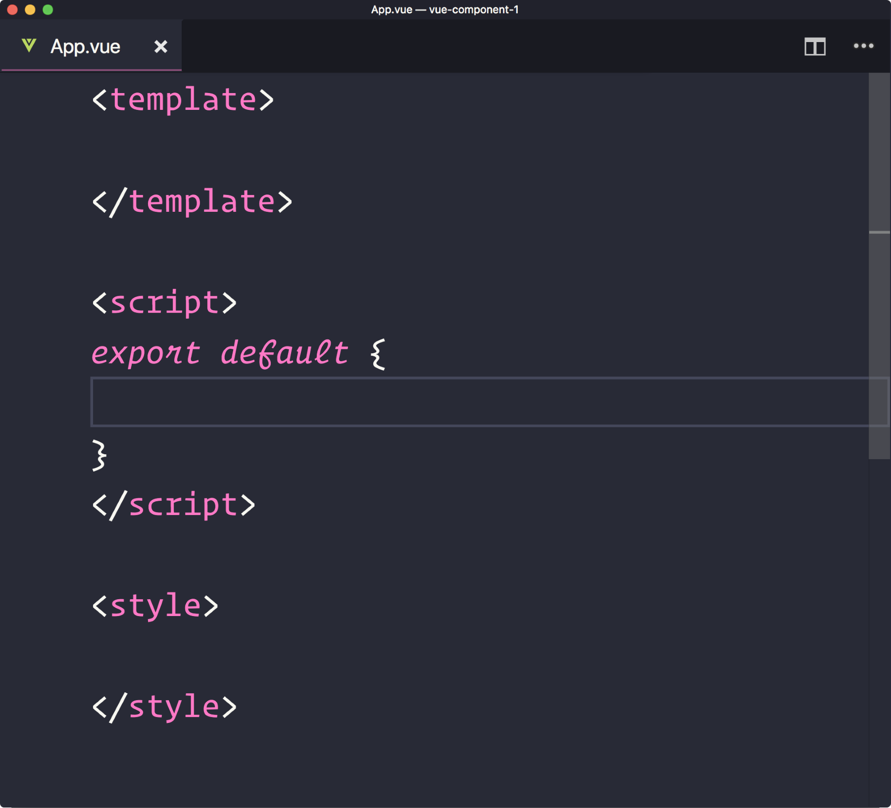
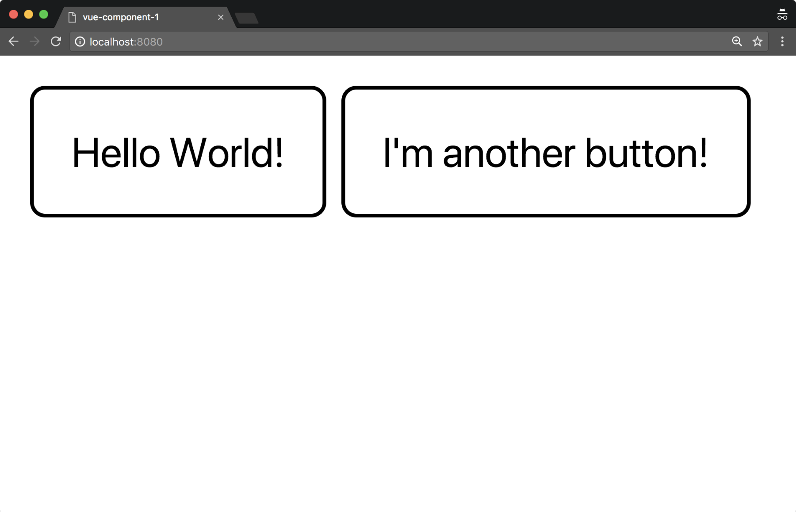
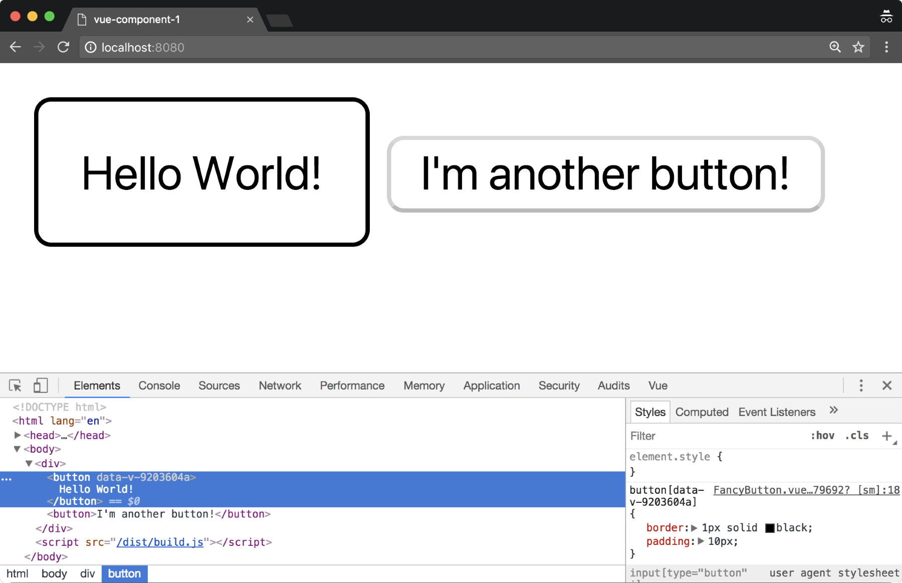
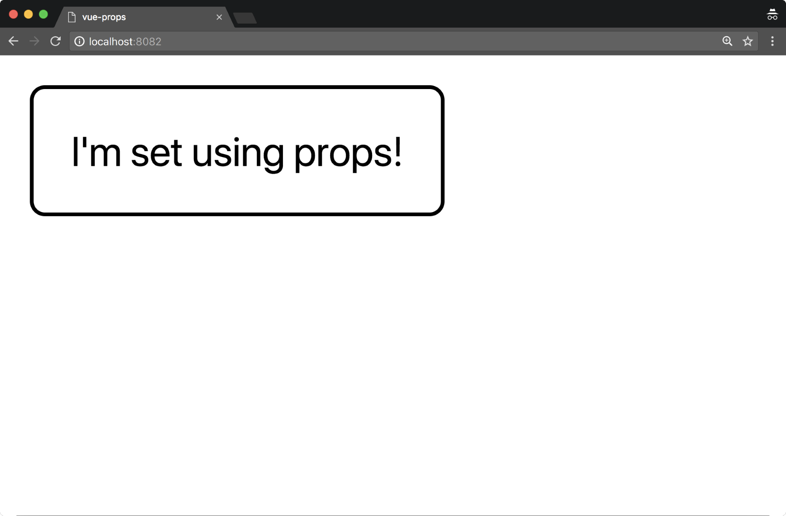
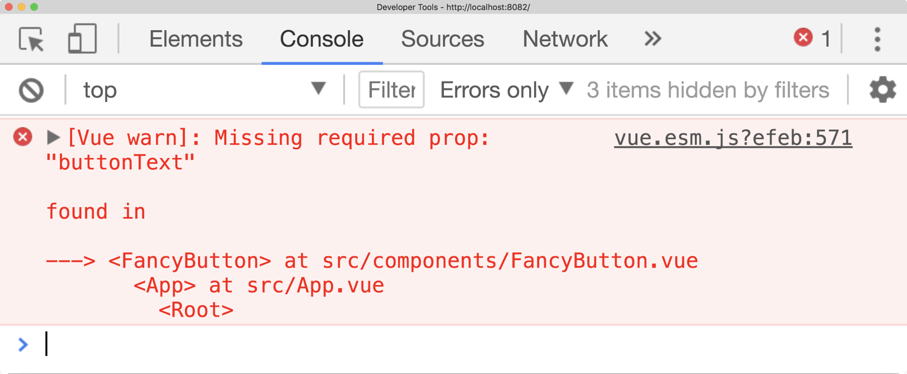
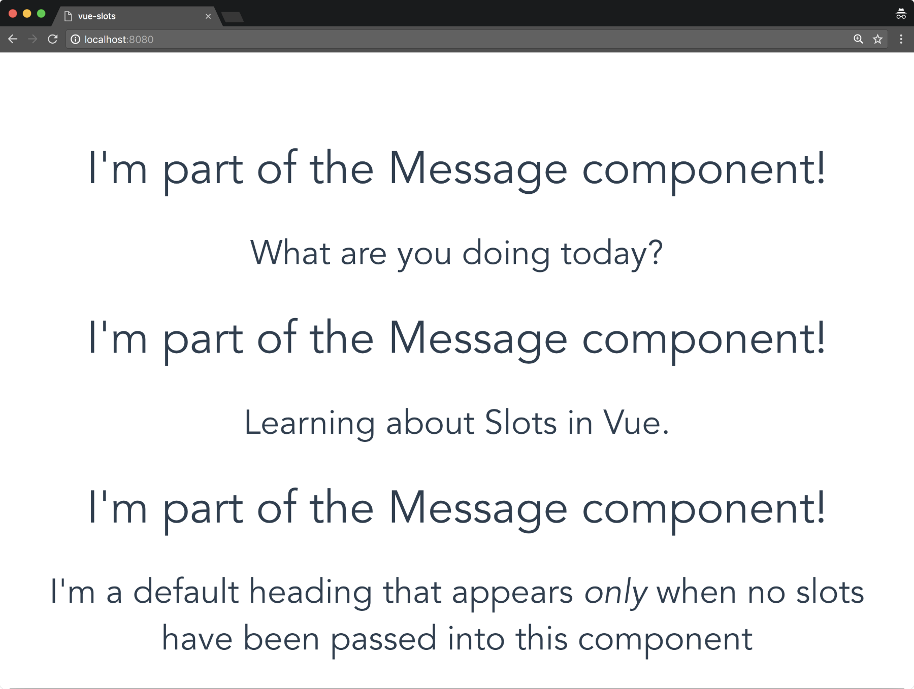
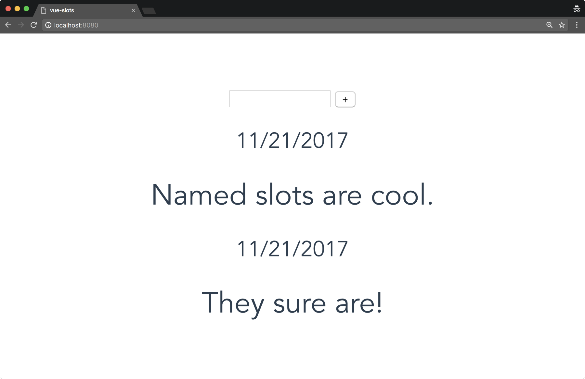

***************
与Vue.js组件进行安全通信
***************
如今，在现代 ``Web`` 应用程序中注意组件驱动架构之前，您不需要过多地考虑。开发需求在短时间内发生了变化， ``Web`` 从简单的文档查看器转向托管具有大量代码库的复杂应用程序。因此，创建可重用组件的能力使我们作为前端开发人员的生活变得更加轻松，因为我们可以将核心功能封装到单一块中，从而降低总体复杂性，从而更好地分离关注点，协作和可伸缩性。

在本章中，我们将采用前面的概念并将它们应用到我们的 ``Vue`` 应用程序中。在本章的最后，你将会达到：

- 能够创建你自己的 ``Vue`` 组件；
- 更好地理解单个文件组件；
- 能够创建特定于每个组件的样式；
- 在局部和全局注册组件的能力，以及理解为什么选择其中一个；
- 使用 ``props`` 在父母和孩子组件之间的沟通能力；
- 使用全局事件 ``Bus`` 跨应用程序进行通信的能力；
- 能够使用 ``slots`` 来使您的组件更加灵活；

我们首先看看你的第一个 ``Vue`` 组件。

你第一个Vue组件
===============
事实证明，我们一直在使用我们的 ``Vue`` 应用程序中的组件！ 使用 ``webpack-simple`` 模板，我们支持单个文件组件（ ``SFC`` ），它本质上只是一个带有 ``.vue`` 扩展名的模板，脚本和样式标签：

.. code-block:: shell

    # Create a new Vue project
    $ vue init webpack-simple vue-component-1

    # Navigate to directory
    $ cd vue-component-1

    # Install dependencies
    $ npm install

    # Run application
    $ npm run dev

当我们使用 ``Visual Studio Code`` 的 ``Vetur`` 扩展时，我们可以输入 ``scaffold`` 并点击 ``Tab`` ，然后创建一个可以在我们的项目中使用的 ``SFC`` 。 如果我们用一个空的组件覆盖App.vue，按照我们当前的定义，它将如下所示：

我们仍然需要为我们的组件添加一些功能，并且如果我们正在创建一个新文件（即，不使用默认的 ``App.vue`` 组件），请将其注册到要使用的地方。 让我们通过在 ``src/components/FancyButton.vue`` 下创建一个新文件来实现这一点：

.. code-block:: js

    <template>
    <button>
    {{buttonText}}
    </button>
    </template>

    

    

我们的 ``FancyButton`` 组件只是一个 ``Hello World!`` 的按钮。 并有一点样式。 我们需要考虑我们可以做的事情，以使其更具可扩展性：

- 允许此组件上的输入更改按钮文本；
- 在我们设计按钮元素时（或者即使我们添加了类），我们也需要一种方法来阻止泄漏我们组件的样式到应用的其余部分；
- 注册该组件，以便它可以在整个应用程序中全局使用；
- 注册该组件，以便它可以在组件内局部使用；
- 还有很多！

让我们从最简单的一个开始，注册组件，以便它可以在我们的应用程序中使用。

全局注册组件
------------
我们可以创建组件并使用以下接口在全局注册它们: ``Vue.component(name:string，options:Object <VueInstance>)`` 。 虽然不是必需的，但在命名组件时，必须遵守 ``W3C`` 自定义元素规范(https://www.w3.org/TR/custom-elements/#valid-custom-element-name)，即全小写，并且必须包含连字符。

在我们的 ``main.js`` 文件里面，首先从适当的路径导入组件，然后我们注册 ``FancyButton`` 组件：

.. code-block:: js

    import FancyButton from './components/FancyButton.vue';

之后，我们可以使用 ``Vue.component``注册该组件，这可以用粗体显示，使 ``main.js`` 中的结果代码如下所示：

.. code-block:: js

    import Vue from 'vue';
    import App from './App.vue';
    import FancyButton from './components/FancyButton.vue';

    Vue.component('fancy-button', FancyButton);

    new Vue({
      el: '#app',
      render: h => h(App)
    });

我们的组件现已在全局注册。 现在，我们如何在我们的 ``App.vue`` 组件中使用它？ 那么记住了我们具体的标签吗？ 我们只需将它添加到模板中即可：

.. code-block:: html

    <template>
        <fancy-button/>
    </template>

样式范围
--------
如果我们添加另一个按钮元素会怎样？ 当我们用 ``CSS`` 直接设计按钮元素：

.. code-block:: html

    <template>
        

            <fancy-button></fancy-button>
            <button>I'm another button!</button>
        

    </template>

如果我们转到我们的浏览器，我们可以看到我们创建的每个按钮：

其他按钮不是 ``fancy-button`` 组件 ，为什么它会得到样式？ 谢天谢地，阻止组件泄漏到组件之外很简单，我们需要做的就是将 ``scoped`` 属性添加到 ``style`` 标签中：

.. code-block:: css

    

``scoped`` 属性默认不是 ``Vue`` 的一部分，它来自我们的 ``Webpack vue-loader`` 。 你会注意到，添加后，按钮样式只针对我们的 ``fancy-button`` 组件。 如果我们查看下面截图中两个按钮之间的差异，我们可以看到其中一个仅仅是一个按钮，另一个是使用随机生成的数据属性来设置按钮的样式。 这将阻止浏览器在此场景中将样式应用于两个按钮元素。

在 ``Vue`` 中使用有作用域的 ``CSS`` 时，请记住，在该组件中创建的规则在整个应用程序中不能全局访问：

局部注册组件
------------
我们也可以在我们的应用程序局部注册我们的组件，这可以通过将其专门添加到我们的 ``Vue`` 实例来完成，例如，让我们在 ``main.js`` 中注释全局注册，然后导航到 ``App.vue`` ：

.. code-block:: js

    // Vue.component('fancy-button', FancyButton);

在将任何代码添加到我们的应用程序组件之前，请注意，我们的按钮已经消失，现在我们不再全局注册它。 为了在局部注册，我们需要先导入类似于我们之前做过的组件，然后将其添加到实例中的 ``component`` 对象：

.. code-block:: js

    <template>
        

            <fancy-button></fancy-button>
            <button>I'm another button!</button>
        

    </template>

    

    

现在我们的按钮再次出现在屏幕上。 在决定在哪里注册组件时，请考虑在整个项目中可能需要使用它们的频率。

组件通讯
========
现在我们有能力创建可重用的组件，使我们能够在我们的项目中封装功能。 为了使这些组件可用，我们需要赋予它们与另一个组件进行通信的能力。 我们首先要看的是与组件属性（称为 ``props`` ）的单向通信。

组件通信的要点是保持我们的功能分布式，松散耦合，进而使我们的应用程序更易于扩展。 为了实施松散耦合，您不应该尝试在子组件内引用父组件数据，而应该仅使用 ``props`` 传递它。 让我们来看看在我们的 ``FancyButton``上改变 ``button`` 文本的属性：

.. code-block:: html

    <template>
        <button>
            {{buttonText}}
        </button>
    </template>

    

    

注意我们如何能够绑定到我们模板内部的 ``buttonText`` 值，因为我们已经创建了每个组件属性的对象值或者一个包含字符串的 ``props`` 数组。 这个可以通过 ``kebab case`` 作为组件本身的设置属性来完成，这是必需的，因为 ``HTML`` 不区分大小写：

.. code-block:: html

    <template>
        <fancy-button button-text="I'm set using props!"></fancy-button>
    </template>

这给了我们以下结果：

配置属性值
----------
我们可以通过将其设置为对象来进一步配置我们的属性值。 这允许我们定义诸如默认值，类型，验证器等等。 让我们用我们的 ``buttonText`` 属性来做到这一点：

.. code-block:: js

    export default {
        props: {
            buttonText: {
                type: String,
                default: "Fancy Button!",
                required: true,
                validator: value => value.length > 3
            }
        },
    }

首先，我们确保我们只能将 ``String`` 类型传入此属性。 我们也可以检查其他类型，例如：

- Array
- Boolean
- Function
- Number
- Object
- String
- Symbol

根据 ``Web`` 组件的良好实践，向 ``props`` 发送原始值是一种很好的做法。

在底层，这是针对该属性运行 ``instanceof`` 运算符，以便它也可以对构造函数类型运行检查。

同时，我们还可以使用数组语法检查多个类型：

.. code-block:: js

    export default {
        props: {
            buttonText: {
                type: [String, Number, Cat],
            }
        },
    }

接下来，我们将默认文本设置为 ``FancyButton!`` ，这意味着默认情况下，如果未设置此属性，它将具有该值。我们还设置了 ``required`` 等于 ``true`` ，这意味着我们每次创建 ``FancyButton`` 时都必须包含 ``buttonText`` 属性。

目前存在一个矛盾（即默认值和必填项），有些时候您希望在属性不是必须的情况下具有默认值。 最后，我们为此添加了一个验证函数，以指定在我们设置此属性时，它必须具有大于3个字符串长度。

我们如何知道属性验证是否失败？ 在开发模式下，我们可以检查我们的开发控制台，我们应该有相应的错误。 例如，如果我们忘记在我们的组件上添加 ``buttonText`` 属性：

自定义事件
----------
我们正在取得很大进展。 我们现在有一个组件，可以接受输入，全局或局部注册，范围样式，验证等。 现在，我们需要赋予其在单击 ``FancyButton`` 按钮时将事件触发回其父组件进行通信的能力，这通过编辑 ``$emit`` 事件的代码来完成：

.. code-block:: html

    <template>
    <button
    @click.prevent="clicked">
        {{buttonText}}
    </button>
    </template>

    

在我们的例子中，我们已经将 ``clicked`` 的功能附加到按钮的点击事件上，这意味着只要点击它，我们就会发出 ``buttonClicked`` 事件。 然后我们可以在我们的 ``App.vue`` 文件中侦听这个事件，在那里我们将元素添加到 ``DOM`` ：

.. code-block:: html

    <template>
        <fancy-button
                @buttonClicked="eventListener()"
                button-text="Click
       me!">
        </fancy-button>
    </template>

    

    

请注意，在这一点上我们使用 ``@buttonClicked ="eventListener()"`` 。 这使用 ``v-on`` 事件在事件发出时随时调用 ``eventListener()`` 函数，随后将消息记录到控制台。 我们现在已经演示了在两个组件之间发送和接收事件的能力。

发送事件值
----------
为了使事件系统更加强大，我们还可以将值传递给其他组件。 让我们在我们的 ``FancyButton`` 组件中添加一个输入框（也许我们需要重命名它，或者考虑将输入分离到它自己的组件中）：

.. code-block:: html

    <template>
        

            <input type="text" v-model="message">
            <button
                    @click.prevent="clicked()">
                {{buttonText}}
            </button>
        

    </template>

    

这个组件的关键是我们现在导入 ``EventBus`` 并使用 ``$emit`` ，从而将应用程序的事件系统从基于组件的模式转变为基于应用程序的模式。 然后，我们可以使用 ``$on`` 观察我们想要的任何组件的更改（以及随后的值）。 我们来看看下面的组件 ``ShoppingList`` ：

.. code-block:: html

    <template>
        

            <ul>
                <li v-for="item in shoppingList" :key="item">
                    {{item}}
                </li>
            </ul>
        

    </template>

    

看看我们的 ``ShoppingList`` 组件，我们可以看到 ``$on`` 的使用，这允许我们监听名为 ``addShoppingItem`` 的事件（与我们发出的相同的事件名称，或者您希望听到的任何其他事件）。 这将返回该项目，然后我们可以输出到控制台或在此处执行其他任何操作。

我们可以将这一切放在我们的 ``App.vue`` 中：

.. code-block:: html

    <template>
        

            <shopping-input/>
            <shopping-list :shoppingList="shoppingList"/>
        

    </template>

    

如果我们在 ``App.vue`` 内部注册了我们的组件，并将其放置在我们的模板中，我们就可以像这样在组件标签内添加内容：

.. code-block:: html

    <template>
        

            <message>
                <h2>What are you doing today?</h2>
            </message>
            <message>
                <h2>Learning about Slots in Vue.</h2>
            </message>
        

    </template>

    

此时， ``message`` 标记内的所有内容都将放置在 ``Message`` 组件的插槽内。

默认
----
虽然我们可以将内容添加到插槽，但我们可能希望在不添加任何内容使用默认内容。 这意味着我们不必每次都添加内容，如果我们想要，我们可以在这种情况下重写它。

我们如何向我们的插槽添加默认行为？ 这很简单！ 我们所需要做的就是在 ``slot`` 标签之间添加我们的元素，如下所示：

.. code-block:: html

    <template>
        

            <h1>I'm part of the Message component!</h1>
            <slot>
                <h2>I'm a default heading that appears <em>only</em> when no slots
                    have been passed into this component</h2>
            </slot>
        

    </template>

如果我们因此添加另一个 ``message`` 元素，但是这次没有嵌套任何标记，我们会得到以下内容：

.. code-block:: html

    <template>
        

            <message>
                <h2>What are you doing today?</h2>
            </message>
            <message>
                <h2>Learning about Slots in Vue.</h2>
            </message>
            <message></message>
        

    </template>

现在，如果我们前往我们的浏览器，我们可以看到我们的消息显示如下：

命名slots
----------
我们还可以通过命名插槽进一步完善。 假设我们的 ``message`` 组件需要 ``date`` 和 ``messageText`` 输入，其中一个是插槽，另一个是组件的属性。 这个用例可能是我们想要以不同的方式显示日期，添加不同的信息位，甚至根本不显示。

我们的消息组件变成：

.. code-block:: html

    <template>
        

            <slot name="date"></slot>
            <h1>{{messageText}}</h1>
        

    </template>

    

注意我们 ``slot`` 标签上的 ``name ="date"`` 属性。 这允许我们在运行时动态地将我们的内容放置在正确的位置。然后，我们可以建立一个小型聊天系统来展示这个实例，让我们确保我们在继续之前已经安装 ``moment`` 在我们的项目中：

.. code-block:: shell

    $ npm install moment --save

您可能还记得在第4章 ``Vue.js`` 指令中使用 ``moment`` ，我们也将重用之前创建的日期管道。 让我们升级我们的 ``App.vue`` 以包含以下内容：

.. code-block:: html

    <template>
        

            <input type="text" v-model="message">
            <button @click="sendMessage()">+</button>

            <message v-for="message in messageList" :message-text="message.text" :key="message">
                <h2 slot="date">{{ message.date | date }}</h2>
            </message>
        

    </template>

    

这里发生了什么事？ 在我们的模板内部，我们遍历了我们的 ``messageList`` ，并在每次添加新消息时创建一个新的消息组件。 在组件标签内部，我们期待 ``messageText`` 显示（因为我们将它作为 ``prop`` 传递，在消息组件中定义标记），但我们也使用插槽动态添加日期：

如果我们从 ``h2`` 中删除 ``slot ="date"`` 会发生什么？ 日期仍然显示？ 不。 这是因为当我们只使用命名插槽时，没有其他地方可以添加插槽。 它只会在我们将 ``Message`` 组件更改为未命名的插槽时出现，如下所示：

.. code-block:: html

    <template>
        

            <slot name="date"></slot>
            <slot></slot>
            <h1>{{messageText}}</h1>
        

    </template>

总结
====
本章为我们提供了创建可以相互通信的可重用组件的功能。 我们研究了如何在整个项目中全局注册组件，或者在某个特定实例中局部注册，从而为我们提供了灵活性和适当的关注点分离。 我们已经看到，通过添加简单属性到复杂验证和默认值的例子，这可以是多么强大。

在下一章中，我们将研究如何创建更好的用户界面。 我们将在表单，动画和验证的上下文中更多地查看诸如 ``v-model`` 之类的指令。