****
优化
****
如果你多年来一直在编写针对 ``Web`` 平台的应用程序，那么你就会看到网络经历了多少变化。 现在，以简单的文档查看器开始的我们不得不处理复杂的构建步骤，状态管理模式，对性能和兼容性的持续审查等等。

值得庆幸的是， ``JavaScript`` 和后续工具的流行意味着我们可以使用模板和经过测试的技术来优化我们的应用程序和部署。

在本章中，我们将看看以下主题：

- ``Vue CLI`` 中的 ``vue-pwa`` 模板；
- 渐进式 ``Web`` 应用程序的特点；
- 使用 ``ngrok`` 查看任何设备上的本地主机应用程序；
- 使用 ``Firebase`` 托管来部署 ``Web`` 应用程序；
- 持续集成及其对于大型项目意味着什么；
- 自动运行每个 ``Git`` 提交的测试；
- 在每个 ``Git`` 提交中自动部署到 ``Firebase`` 托管；

渐进式Web应用程序（PWA）
=======================
可以将 ``PWA`` 定义为使用现代网络功能提供周到，引人入胜和互动体验的应用程序。我对 ``PWA`` 的定义是包含渐进式改进原则的定义。我们当然可以利用 ``PWA`` 所提供的一切，但我们不必。

这意味着我们不仅要不断改进我们的应用程序，而且要坚持这些原则，这迫使我们从互联网连接效果不好的用户的角度思考，希望获得离线优先体验，需要主屏幕可访问的应用程序，等等。 ``Vue CLI`` 再一次为我们提供了这个过程，因为它提供了一个 ``PWA`` 模板。让我们用适当的模板创建一个新的 ``Vue`` 应用程序：

.. code-block:: shell

    # Create a new Vue project
    $ vue init pwa vue-pwa

    ? Project name vue-pwa
    ? Project short name: fewer than 12 characters to not be truncated on homescreens (default: same as name)
    ? Project description A PWA built with Vue.js
    ? Author Paul Halliday <hello@paulhalliday.io>
    ? Vue build runtime
    ? Install vue-router? Yes
    ? Use ESLint to lint your code? Yes
    ? Pick an ESLint preset Airbnb
    ? Setup unit tests with Karma + Mocha? No
    ? Setup e2e tests with Nightwatch? No

    # Navigate to directory
    $ cd vue-pwa

    # Install dependencies
    $ npm install

    # Run application
    $ npm run dev

在本章中，我们将看看这个模板给我们带来的好处，以及我们如何使我们的应用程序和操作更加先进。

`渐进web APP <https://www.zcfy.cc/article/everything-you-should-know-about-progressive-web-apps-tutorialzine-2047.html>`_

Web应用程序清单
---------------
您可能已经看到了使用 ``Web`` 应用程序清单的应用程序的优点 - 如果您曾经访问过要求您在主屏幕上安装该应用程序的网站，或者 ``Android Chrome`` 上您已经注意到地址栏的颜色从默认灰色到不同的颜色，这是一个渐进的应用程序。让我们来看看 ``static/manifest.json`` 并查看内容：

.. code-block:: json

    {
      "name": "vue-pwa",
      "short_name": "vue-pwa",
      "icons": [
        {
          "src": "/static/img/icons/android-chrome-192x192.png",
          "sizes": "192x192",
          "type": "image/png"
        },
        {
          "src": "/static/img/icons/android-chrome-512x512.png",
          "sizes": "512x512",
          "type": "image/png"
        }
      ],
      "start_url": "/index.html",
      "display": "standalone",
      "background_color": "#000000",
      "theme_color": "#4DBA87"
    }

我们可以选择给我们的应用程序 ``name`` 和 ``short_name`` ；这些将在安装在设备的主屏幕上时显示。

图标阵列用于提供不同大小的图标，以实现跨设备的高清体验。 ``start_url`` 定义在安装在用户主屏幕上时要在启动时加载的文件，因此指向 ``index.html`` 。

我们可以改变我们的应用程序作为具有 ``display`` 属性的 ``PWA`` 在设备上运行时的显示方式。有各种选项可用，如 ``browser`` ， ``standalone`` ， ``minimal-ui`` ， ``fullscreen`` 。每一个都会改变我们的应用程序在设备上的显示方式；(https://developers.google.com/web/fundamentals/web-app-manifest/)

这里有一个 ``browser`` 和 ``standalone`` 的例子：

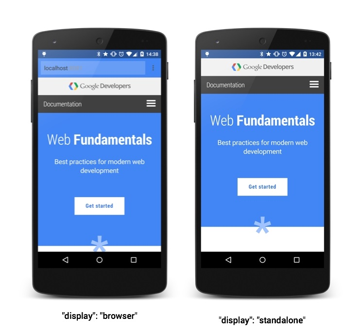

我们还可以利用 ``background_color`` 选项在我们的 ``PWA`` 启动时更改启动屏幕背景的颜色，如以下屏幕截图所示：

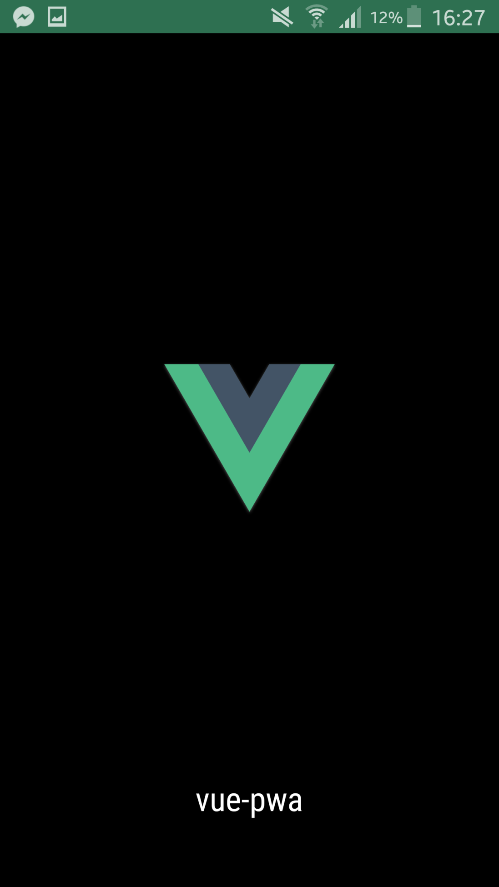

如果我们想要改变工具栏的颜色，我们可以使用 ``theme_color`` 选项（我们将在前进时看一个示例）。

还有其他选项可以传递到您的 ``Web`` 应用程序清单，您应该根据项目的需要定制这些选项。你可以在 https://developer.mozilla.org/en-US/docs/Web/Manifest ``MDN`` 上找到 ``web`` 应用清单的更多信息。

在设备上测试
------------
如果我们想在设备上测试我们的应用程序而不用担心部署，我们可以使用一个工具（如 ``ngrok`` ）在本地主机和外部世界之间创建隧道。这使我们能够在任何带有公共 ``URL`` 的设备上查看我们的应用程序，一旦我们关闭连接， ``URL`` 和后续应用程序就会消失。

通过导航到 ``https://ngrok.com/download`` 并按照您的平台的安装步骤下载 ``ngrok`` 。

``Ngrok`` 也可以通过 ``npm`` 输入如下命令安装：

.. code-block:: shell

    npm install ngrok -g

由于我们的 ``Vue`` 应用程序在端口 ``8080`` 上运行，我们可以启动 ``ngrok`` 并告诉它从该端口提供服务。在安装了 ``ngrok`` 的终端中运行以下命令：

.. code-block:: shell

    $ ngrok http 8080

然后我们在终端上得到以下结果：

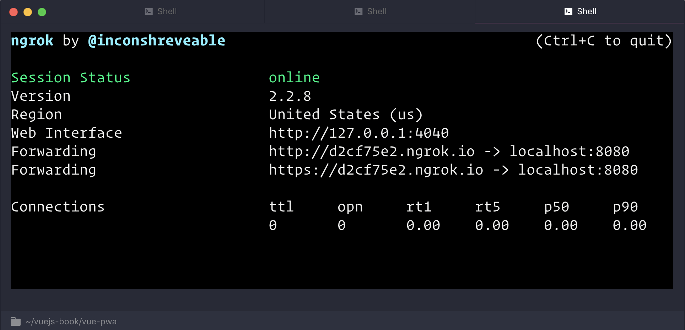

然后，我们可以在任何设备上导航到此网址，并在屏幕上看到以下结果：

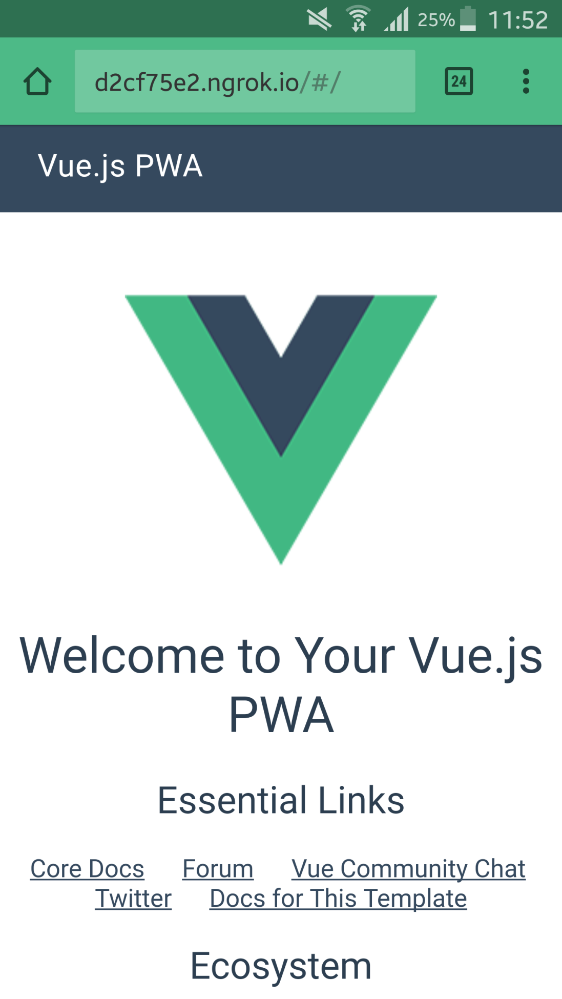

这不是更多的本地体验吗？现在我们默认有一个彩色的地址/状态栏。在生产模式下，我们还可以通过 ``ServiceWorker`` 的强大功能获得更多的权限。在深入研究之前，让我们看看如何使用 ``Firebase`` 将我们的应用程序部署到更永久的 ``URL`` 服务器中。

Firebase部署
============
``Firebase`` 是 ``Google`` 的一个平台，可让我们充分利用实时数据库，远程配置，推送通知等各种功能。对我们的用例来说，更重要的是静态文件部署的潜力，这是我们将要利用的。

.. note:: 该平台提供三种不同的软件包，每种都提供不同的服务级别，第一级是免费的，然后是以下两级需要付款。

首先导航到 ``https://firebase.google.com`` ，然后点击“登录”登录 ``Google`` 帐户，然后点击右上角的转到“控制台”。然后，我们可以通过选择 ``Firebase`` 仪表板上的 ``+`` 添加项目并随后选择项目名称和国家来创建新的 ``Firebase`` 项目。

然后，我们将导航到项目概览，在那里我们可以选择将 ``Firebase`` 添加到我们的项目以及其他各种选项。我们现在寻找主机，因为我们有兴趣的是部署我们的静态内容。从左侧菜单中，点击主机：

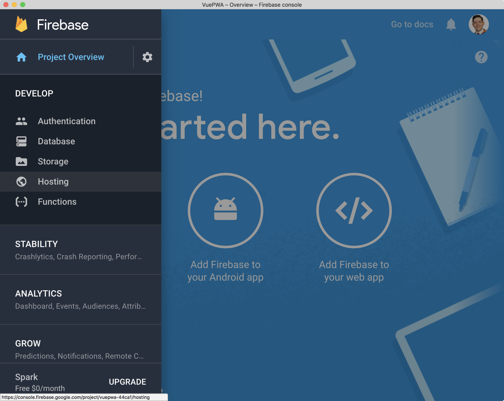

我们将在此屏幕上显示一些内容，因为它允许我们恢复部署以及查看其他使用情况指标。由于我们尚未进行首次部署，因此屏幕看起来与此类似：

.. image:: ./images/12-6.png

如果我们点击 ``GET STARTED`` ，我们会收到一条消息，指出我们需要下载 ``Firebase`` 工具。这是一个 ``CLI`` ，允许我们从终端内管理我们的 ``Firebase`` 项目。通过在终端中运行以下命令来安装 ``Firebase`` 工具：

.. code-block:: shell

    $ npm install firebase-tools -g

然后，我们可以按照托管向导下一步中概述的步骤进行操作，但我们目前还不会使用 "部署" 步骤。向导应该如下所示：

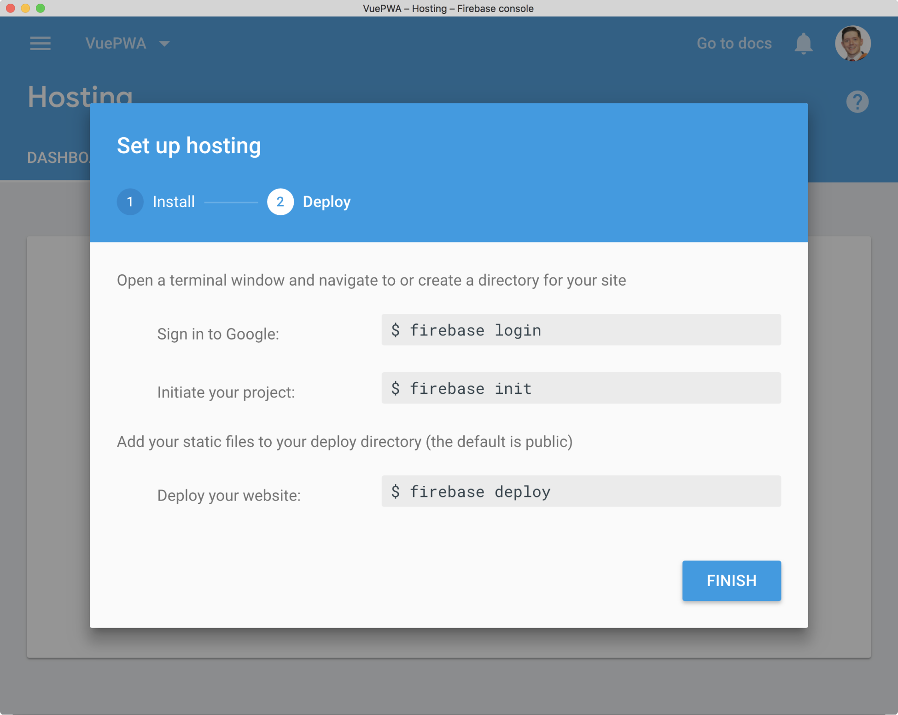

首先，通过在终端中运行以下内容登录到 ``Firebase`` 控制台：

.. code-block:: shell

    $ firebase login

选择一个 ``Google`` 帐户，并给它适当的权限。您应该提供以下屏幕：

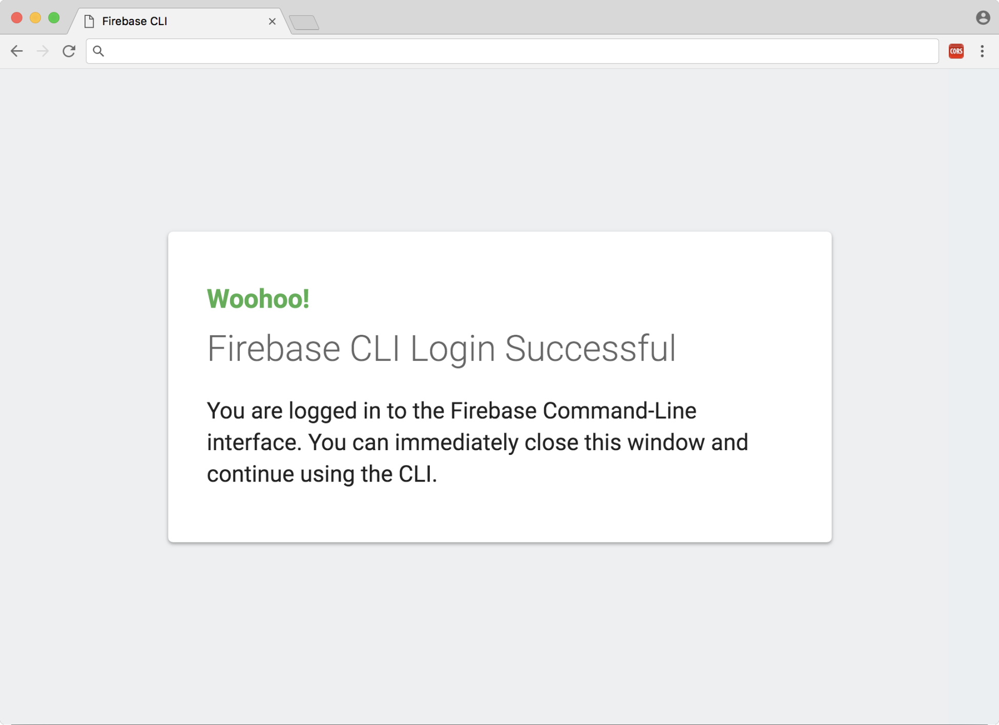

然后，我们可以在我们的 ``vue-pwa`` 项目中初始化一个新的 ``Firebase`` 项目。在终端中运行以下命令：

.. code-block:: shell

    $ firebase init

此时，我们可以使用键盘导航到主机并使用空格键选择它。这应该使该圈子变成绿色，并告诉 ``Firebase`` 我们希望在我们的项目中设置托管。

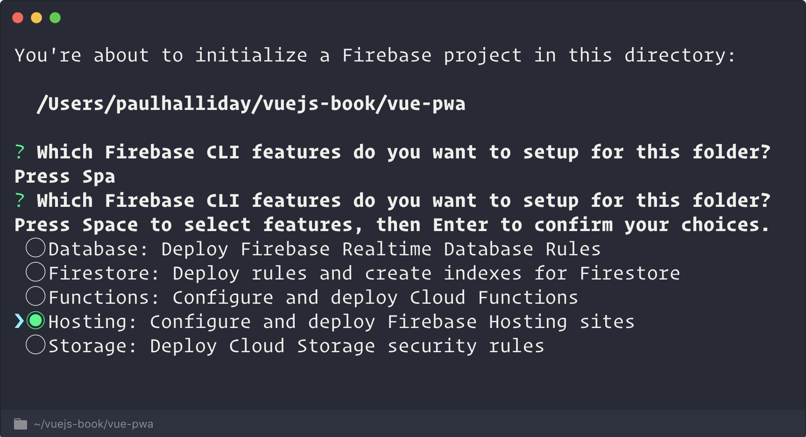

然后，我们必须将我们的本地项目与 ``Firebase`` 仪表板中的项目相匹配。从列表中选择您之前创建的项目：

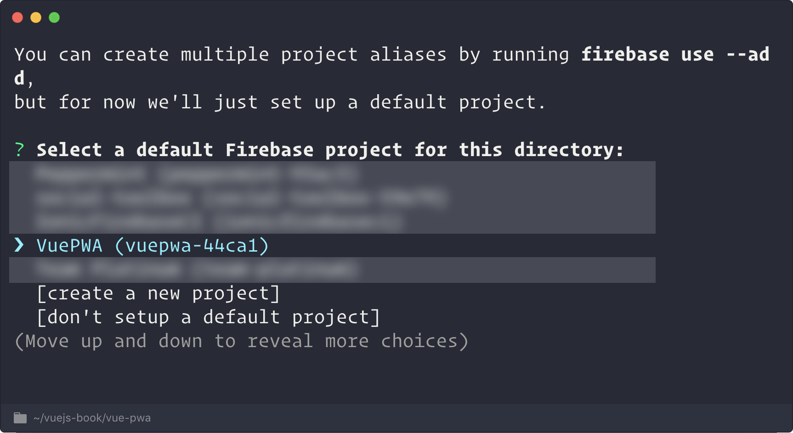

然后，它应该问你有关设置的问题 - 像这样回答他们：

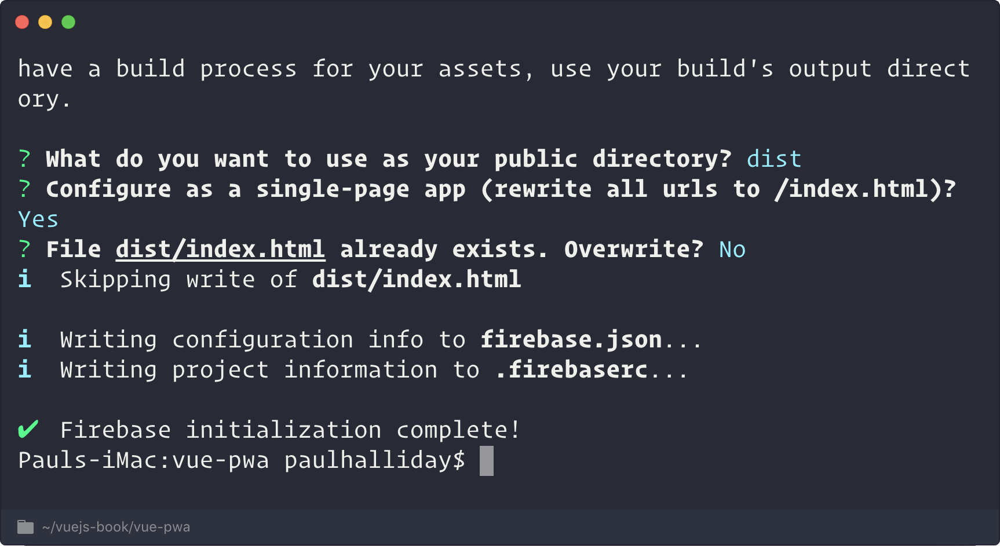

我们现在可以随意部署到 ``Firebase`` 。我们需要构建用于生产的项目，以适当地生成一个包含我们应用程序内容的 ``dist`` 文件夹。让我们在终端中运行以下命令：

.. code-block:: shell

    $ npm run prod

然后，要部署到 ``Firebase`` ，我们可以运行以下命令：

.. code-block:: shell

    $ firebase deploy

一段时间后，您应该获得一个可导航的 ``URL`` ，其中包含通过 ``HTTPS`` 提供的应用程序：

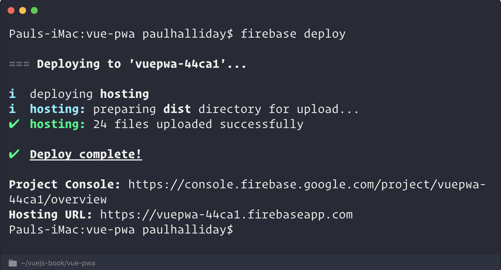

我们的 ``Firebase`` 信息中心也进行了更新，以反映我们的部署情况：

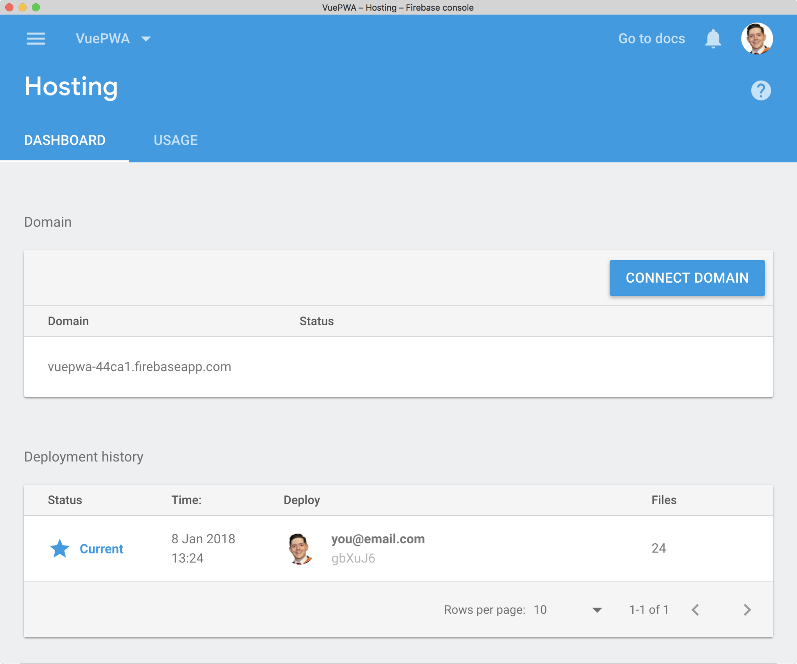

如果我们然后导航到 ``URL`` ，我们应该按预期得到我们的项目：

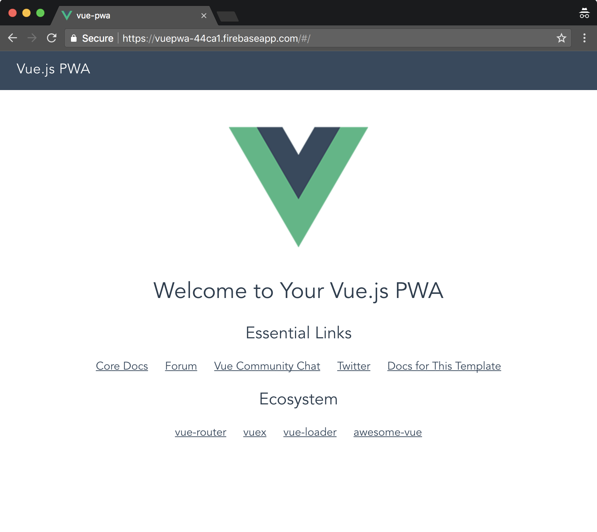

此外，因为我们使用生产版本构建了我们的应用程序，所以我们可以将网络 ``Wi-Fi`` 断开连接或检查开发人员工具中的离线框。这样做后，我们会发现我们的应用程序仍按预期运行，因为我们在所有生产版本上都运行了 ``ServiceWorker`` 。

持续集成(CI)
============
有许多可用的 ``CI`` 平台，例如 ``Travis`` ， ``GitLab`` ， ``Jenkins`` 和其他无数的平台。每个平台通常都有一个共同的目标，即自动化部署和随之而来的挑战。

当然，我们可以自己部署我们的网站，运行我们的测试，并在我们永远增加的构建步骤中重复构建。这不仅是一个单调乏味的过程，而且也给了我们很多犯错误的机会。此外，这也意味着每个步骤都必须记录在团队的每个成员身上，文件必须保持最新，并且在整个组织中不是完全可扩展的。

对于我们的例子，我们将使用 ``Travis CI`` ，我想要解决的第一个目标是自动运行我们的单元测试。为此，我们需要在我们的项目中定义一个或多个单元测试。

单元测试
--------
我们在前一章中介绍了测试我们的 ``Vue.js`` 应用程序，所以每次我们推送一个新建的构建时自动运行我们的测试不是很好吗？让我们快速在我们的项目中设置一些测试，并将其与 ``Travis`` 整合：

.. code-block:: shell

    # Install necessary dependencies
    $ npm install jest vue-test-utils babel-jest vue-jest --save-dev

然后，我们可以添加一个运行 ``jest`` 的新脚本：

.. code-block:: json

    {
      "scripts": {
        "test": "jest"
      }
    }

接下来，将 ``jest`` 配置添加到你的 ``package.json`` 中：

.. code-block:: json

    "jest": {
      "moduleNameMapper": {
        "^@/(.*)$": "<rootDir>/src/$1"
      },
      "moduleFileExtensions": [
        "js",
        "vue"
      ],
      "transform": {
        "^.+\\.js$": "<rootDir>/node_modules/babel-jest",
        ".*\\.(vue)$": "<rootDir>/node_modules/vue-jest"
      }
    }

最后，我们可以更新 ``.babelrc`` 中的 ``babel`` 配置：

.. code-block:: json

    {
      "presets": [
        ["env", {
          "modules": false,
          "targets": {
            "browsers": ["> 1%", "last 2 versions", "not ie <= 8"]
          }
        }],
        "stage-2"
      ],
      "plugins": ["transform-runtime"],
      "env": {
        "test": {
          "presets": [["env", { "targets": { "node": "current" } }]],
          "plugins": [ "istanbul" ]
        }
      }
    }

然后，我们可以在 ``components/__test__/Hello.spec.js`` 中进行一个简单的检查，以检查我们数据中的 ``msg`` 是否与字符串匹配：

.. code-block:: js

    import { mount } from 'vue-test-utils';
    import Hello from '../Hello';

    describe('Hello.vue', () => {
      it('should greet the user', () => {
        const wrapper = mount(Hello);

        expect(wrapper.vm.msg).toEqual('Welcome to Your Vue.js PWA');
      })
    })

正如所料，我们可以运行 ``npm test`` 来执行我们的测试。

创建一个Git仓库
---------------
要使用与 ``Travis CI`` 的持续集成，我们需要将我们的项目上传到 ``GitHub`` 。如果您的计算机上尚未安装 ``Git`` ，请从 https://git-scm.com/ 下载它，然后在 https://github.com 上创建一个 ``GitHub`` 帐户。在 https://github.com/new 中为您的项目创建一个新的存储库，或者通过单击屏幕右上角的 ``+`` 点击新存储库按钮。然后，我们可以为我们的存储库提供一个名称并使其可见性为 ``Public`` 或 ``Private`` ：

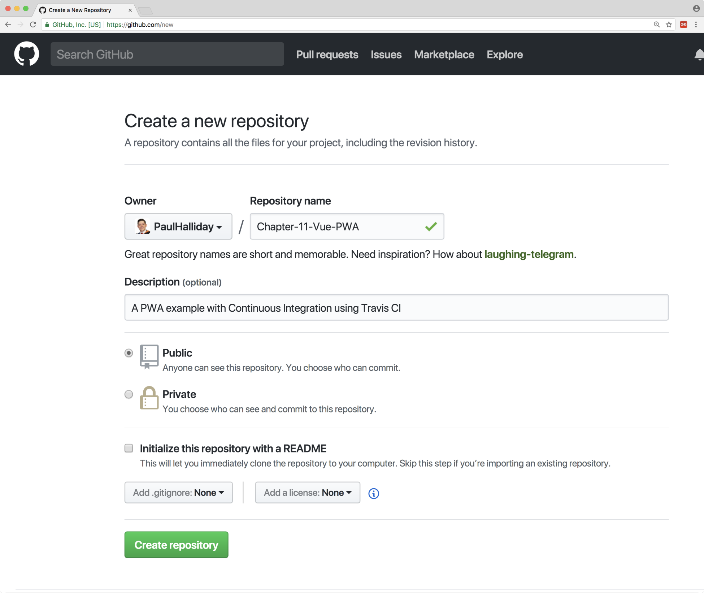

一旦我们点击创建存储库按钮，我们就会以各种方式来上传我们的存储库到 ``GitHub`` 。唯一的问题是，我们还没有将我们的 ``PWA`` 项目作为 ``Git`` 存储库。

我们可以在 ``Visual Studio Code`` 或命令行中执行此操作。在 ``Visual Studio Code`` 中，单击新建存储库按钮。如果您刚刚安装了 ``Git`` ，则可能需要重新启动编辑器才能显示此按钮。

然后，我们可以通过一个简单的消息（如 ``First commit`` ）进行新的提交，然后单击 ``tick`` 。

然后，我们可以按照内部强调的步骤将这些更改推送到 ``GitHub`` 上的存储库中，或者从以下映像中给出的命令行中推送现有存储库：

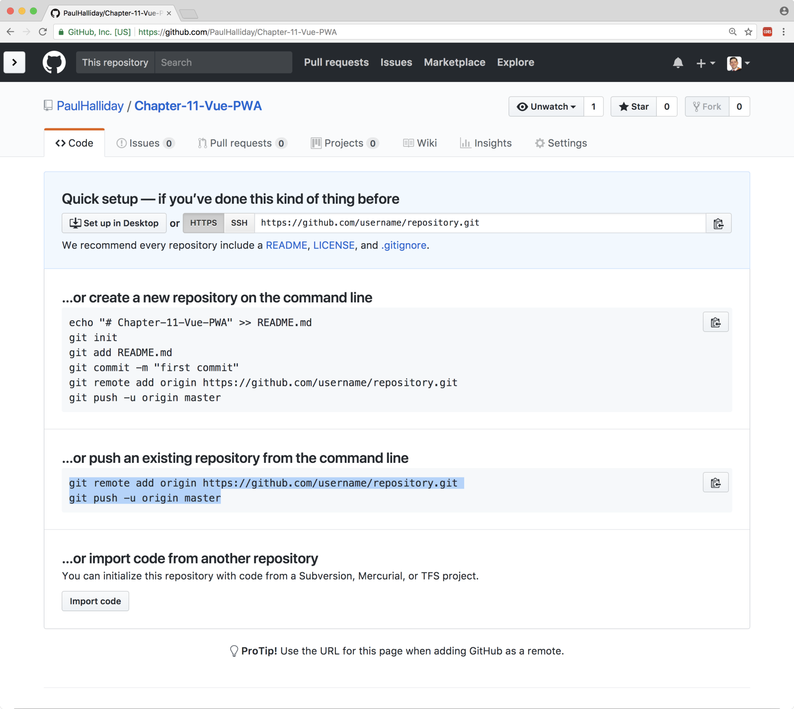

将来对我们存储库的任何更改都会推送到此远程存储库。这很重要，因为当我们创建我们的 ``Travis`` 帐户时，它会自动访问我们所有的 ``GitHub`` 存储库。

连接到Travis CI
---------------
让我们导航到 https://travis-ci.org/ 并点击使用 ``GitHub`` 登录。在给 ``Travis`` 任何必要的权限后，您应该能够看到附加到您帐户的存储库列表。我们可以告诉 ``Travis`` ，我们希望通过将开关切换到绿色来监视此存储库中的更改：

配置Travis
^^^^^^^^^^
接下来要做的是在我们的项目中添加一个合适的 ``.travis.yml`` 配置文件。这将告诉 ``Travis`` 每次我们将构建推送到 ``GitHub`` 时要做什么。因此，当我们使用 ``Travis`` 构建时，会发生两个不同的阶段：

- Travis 在我们的项目中安装任何依赖项；
- Travis 运行构建脚本；

我们可以在构建过程的各个阶段挂钩，比如 ``before_install`` ， ``install`` ， ``before_script`` ， ``script`` ， ``before_cache`` ， ``after_success`` ， ``after_failure`` ， ``before_deploy`` ， ``deploy`` ， ``after_deploy`` 和 ``after_script`` 。所有这些都是不言自明的，但如果看起来好像有很多的事情，不要担心，我们只会在这几个阶段中选择一些。让我们将一个名为 ``.travis.yml`` 的文件添加到我们项目的根目录，并一次添加一个选项。我们可以通过定义项目的语言开始，并且如果我们使用 ``Node`` 时，后续的是 ``Node`` 环境版本：

.. code-block:: yml

    language: node_js
    node_js:
     - "9.3.0"

我选择的 ``node_js`` 版本与我的环境相匹配（可以使用 ``node -v`` 查看），但是如果您需要定位特定版本的 ``Node`` （或多个版本），则可以在这里添加它们。

接下来，让我们添加一下，我们只想在 ``master`` 分支上触发构建：

.. code-block:: yml

    branches:
      only:
        - master

然后，我们需要告诉 ``Travis`` 运行 ``package.json`` 中的那个脚本。由于我们想运行我们的测试，我们将运行测试脚本：

.. code-block:: yml

    script:
      - npm run test

最后，让我们声明我们希望接收每个构建的电子邮件通知：

.. code-block:: yml

    notifications:
      email:
        recipients:
          - your@email.com
        on_success: always
        on_failure: always

这给了我们以下文件：

.. code-block:: yml

    language: node_js
    node_js:
      - "9.3.0"

    branches:
      only:
        - master

    script:
      - npm run build
      - npm run test

    notifications:
      email:
        recipients:
          - your@email.com
        on_success: always
        on_failure: always

如果我们将这些更改推送到我们的存储库并与原始同步，那么我们应该能够在运行我们的测试时观看我们的 ``Travis`` 控制台。 ``Travis`` 可能需要几分钟时间才能开始构建，因此请耐心等待：

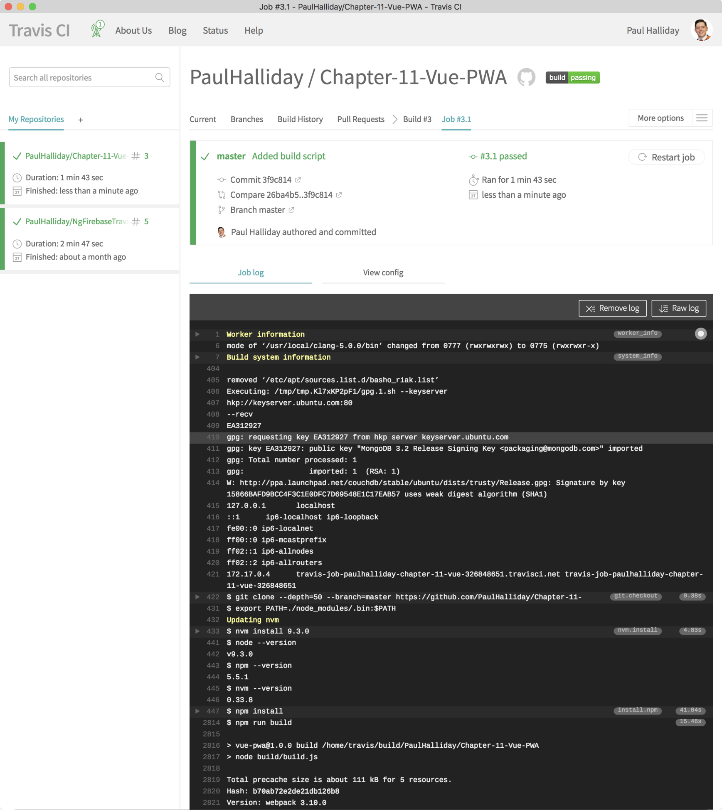

如果我们向下滚动到日志底部，可以看到我们的项目是为生产和我们的测试运行而构建的：

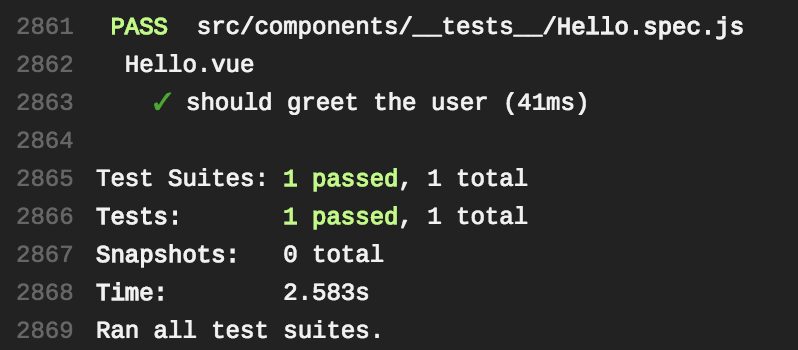

真棒！我们现在可以运行我们的测试，并使用 ``Travis CI`` 连接到构建过程的各个阶段。鉴于我们正在 ``Travis`` 上构建我们的生产项目，我们应该能够自动将此构建部署到 ``Firebase`` 。让我们改变我们的 ``Hello.vue`` 组件来产生一个新消息（并且也让我们的测试失败）：

.. code-block:: js

    export default {
      name: 'hello',
      data() {
        return {
          msg: 'Welcome to Your Vue.js PWA! Deployed to Firebase by Travis CI',
        };
      },
    };

自动部署到Firebase
-------------------
我们可以让 ``Travis`` 自动处理我们的部署，但我们需要一种方法让 ``Travis`` 访问我们的部署令牌。我们可以通过在终端中运行以下命令来获得 ``CI`` 环境的此令牌：

.. code-block:: shell

    $ firebase login:ci

在再次登录到您的 ``Google`` 帐户后，您应该在终端中获得一个令牌：

现在保留令牌，因为我们下一秒就需要。

返回到 ``Travis CI`` 仪表板，然后转到您的项目设置。在设置内部，我们需要添加一个环境变量，然后我们可以在部署脚本中引用它。

添加 ``FIREBASE_TOKEN`` 环境变量，其值等于我们从终端获得的令牌：

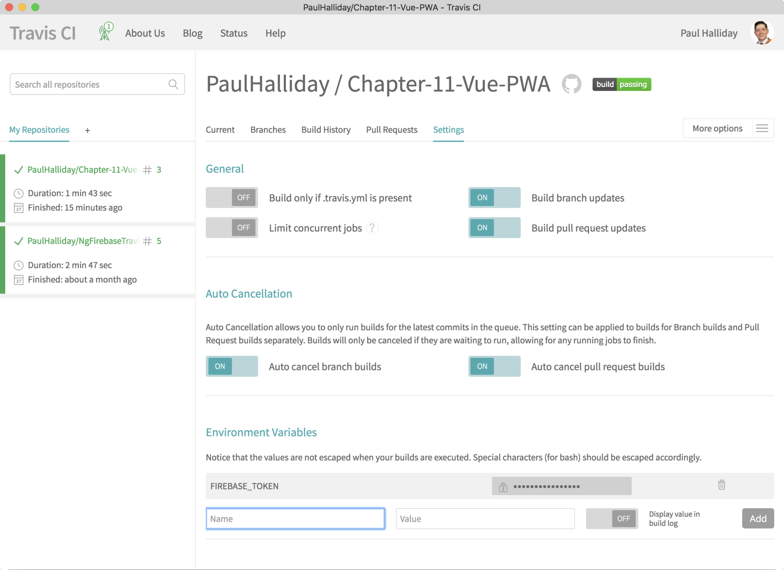

然后，我们可以更新我们的 ``.travis.yml`` 文件以在我们的 ``CI`` 环境中安装 ``Firebase`` 工具，如果一切顺利，然后部署它们到我们的 ``Firebase`` 托管环境：

.. code-block:: yml

    language: node_js
    node_js:
      - "9.3.0"

    branches:
      only:
        - master

    before_script:
      - npm install -g firebase-tools

    script:
      - npm run build
      - npm run test

    after_success:
      - firebase deploy --token $FIREBASE_TOKEN

    notifications:
      email:
        recipients:
          - your@email.com
        on_success: always
        on_failure: always

更改此文件后进行新的提交以同步存储库。这应该会引发 ``Travis`` 的新构建，我们可以观察日志。

因为我们的测试失败，所以我们的部署失败。请注意，我们在 ``Firebase`` 上托管的应用程序完全没有变化。这是有意的，也是为什么我们将部署步骤放入 ``after_success`` 之中的原因，因为如果我们有失败的测试，我们很可能不希望将此代码推到生产中。让我们来修复我们的测试并推送一个新的提交到存储库：

.. code-block:: js

    import { mount } from 'vue-test-utils';
    import Hello from '../Hello'

    describe('Hello.vue', () => {
      it('should greet the user', () => {
        const wrapper = mount(Hello);

        expect(wrapper.vm.msg).toEqual('Welcome to Your Vue.js PWA! Deployed to Firebase by Travis CI');
      })
    })

由于我们所有的脚本都以 ``0`` （无错误）的退出代码传递，因此 ``after_success`` 挂钩被触发，将我们的项目推送到 ``Firebase`` 托管环境。

如果我们使用适当的 ``URL`` 检查我们的应用程序，我们应该会看到一条更新的消息：

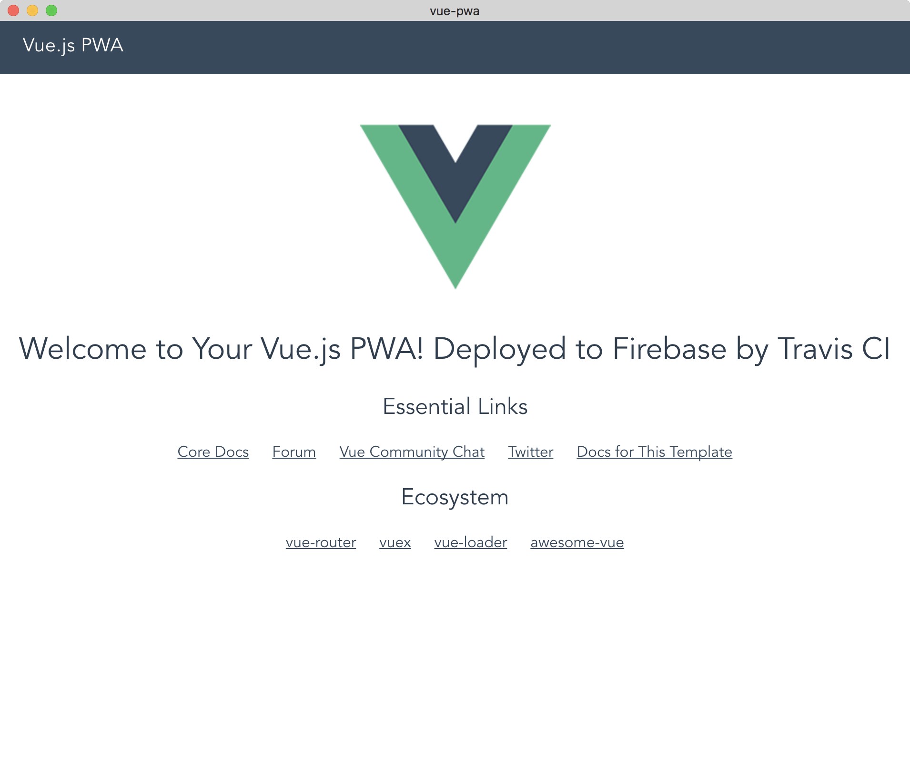

service worker
==============
在使用 ``vue-pwa`` 模板构建我们的生产应用程序时，它包含 ``ServiceWorker`` 。这本质上是一个在后台运行的脚本，它允许我们利用脱机优先方法，推送通知，后台同步等。

我们的应用程序现在还会提示我们的用户在他们的主屏幕上安装应用程序，如下所示：

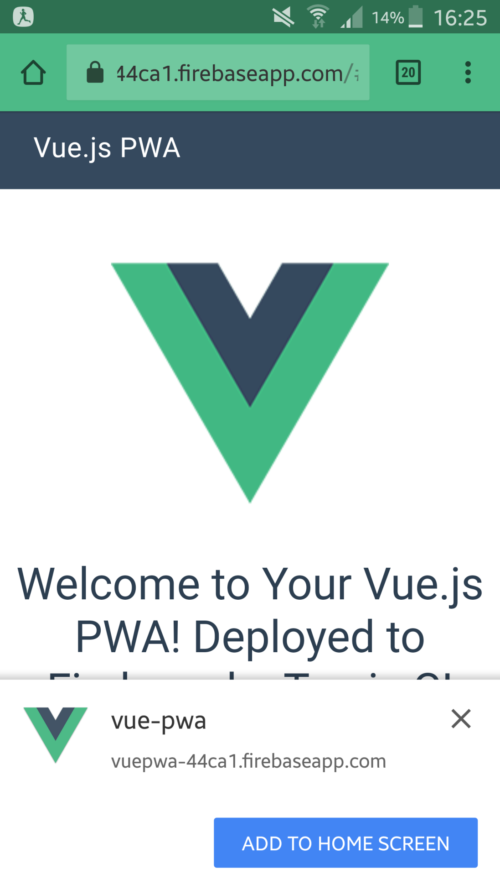

如果我们从互联网上断开连接，我们也会获得离线优先的体验，因为应用程序仍然继续运行。这是我们在使用 ``vue-pwa`` 模板时获得的主要好处之一，如果您想了解有关 ``ServiceWorker`` 的更多信息并了解如何根据您的需求进行自定义， ``Google`` 在 https://developers.google.com/web/fundamentals/primers/service-workers/ 上有一个好的入门指南。

总结
====
在本章中，我们从 ``Vue CLI`` 了解了 ``PWA`` 模板，随后研究了随着应用程序的不断增长，我们如何自动部署和测试应用程序。这些原则使我们能够不断确保我们可以花更多时间开发功能，减少维护部署文档和每次执行基本任务的时间。

在下一章中，我们将介绍 ``Nuxt`` ，一个允许我们使用 ``Vue`` 创建服务器端渲染/静态应用程序的框架。 ``Nuxt`` 还有一个有趣的基于文件夹的路由结构，这在创建 ``Vue`` 应用程序时给了我们很大的权力。