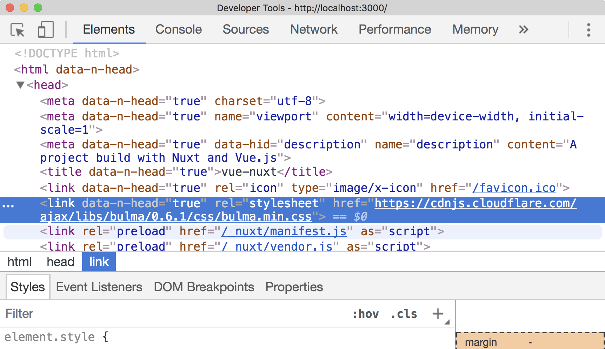
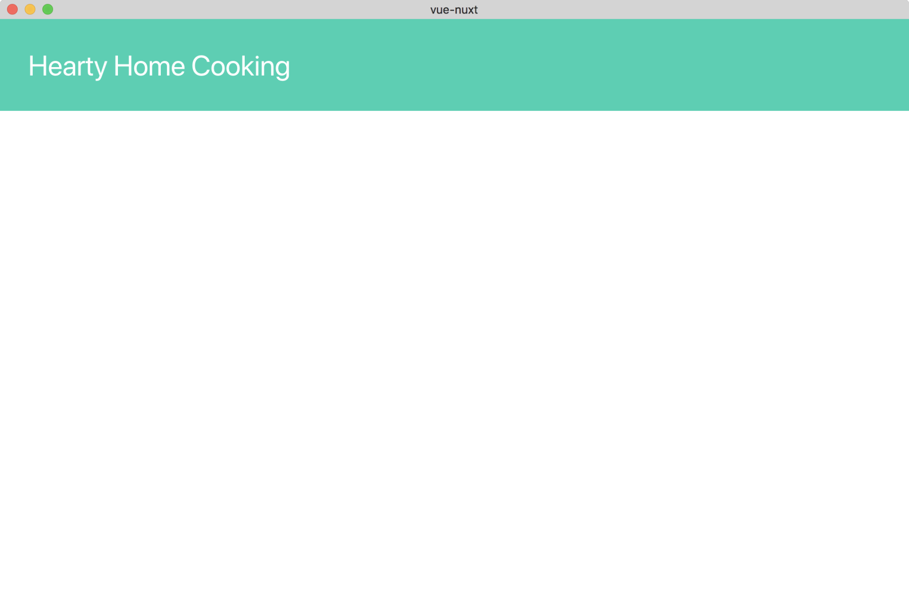
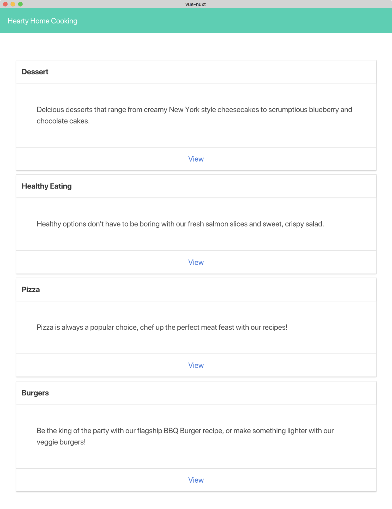
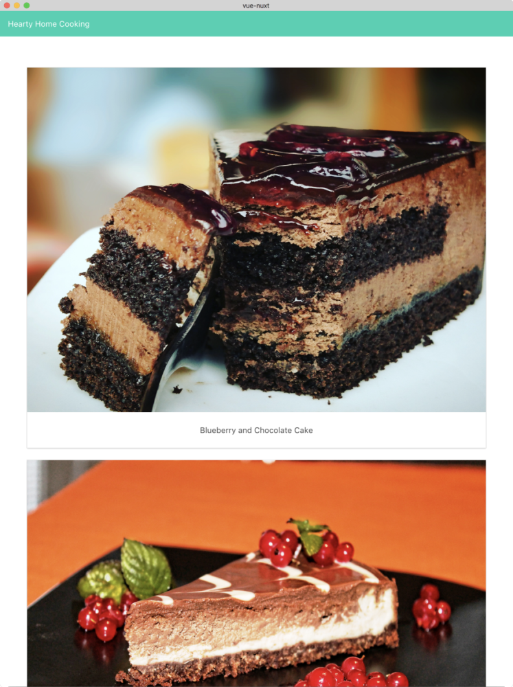
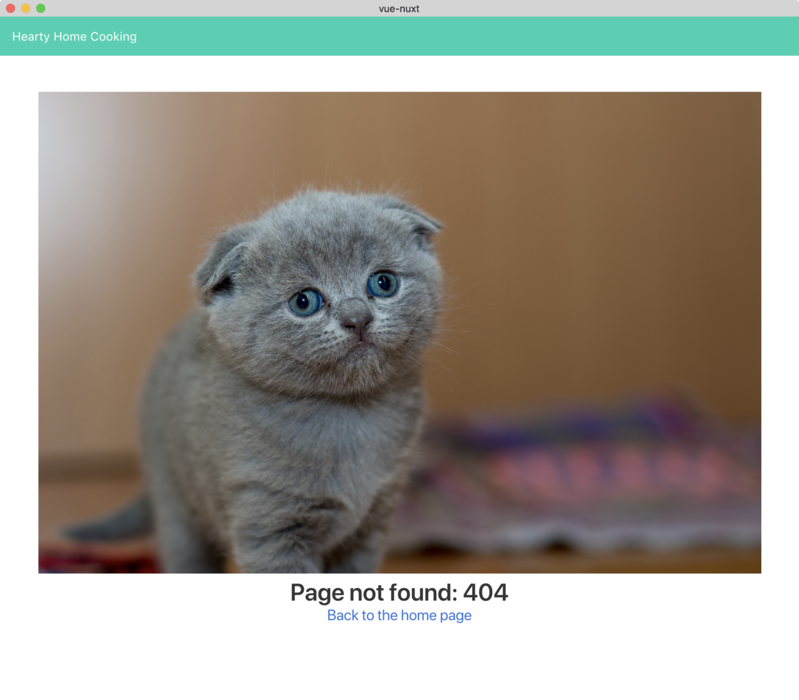
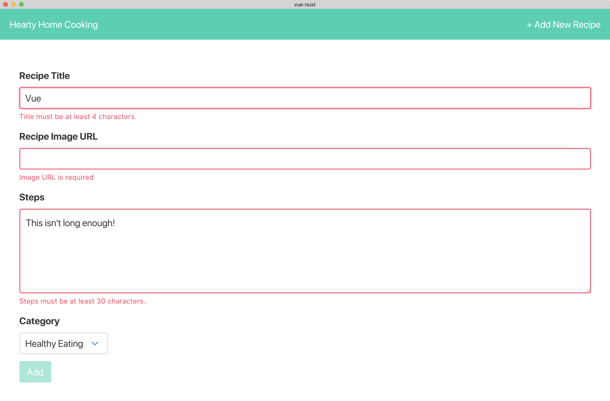
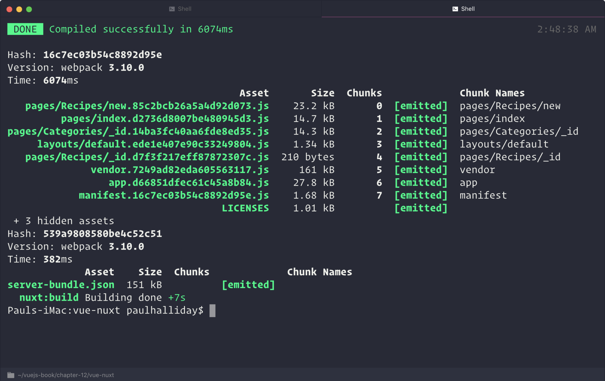
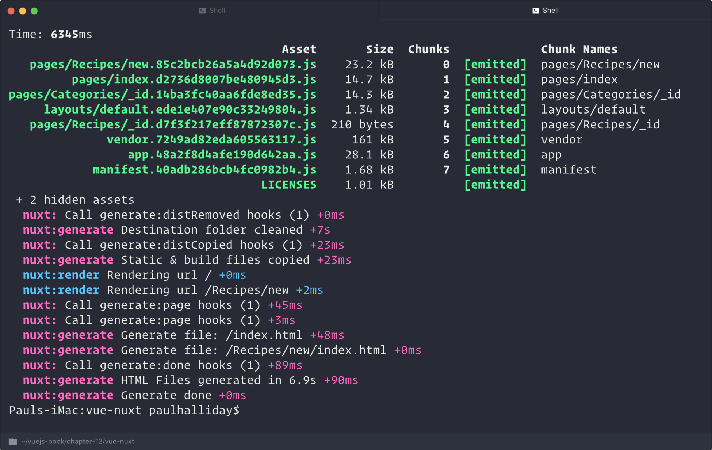
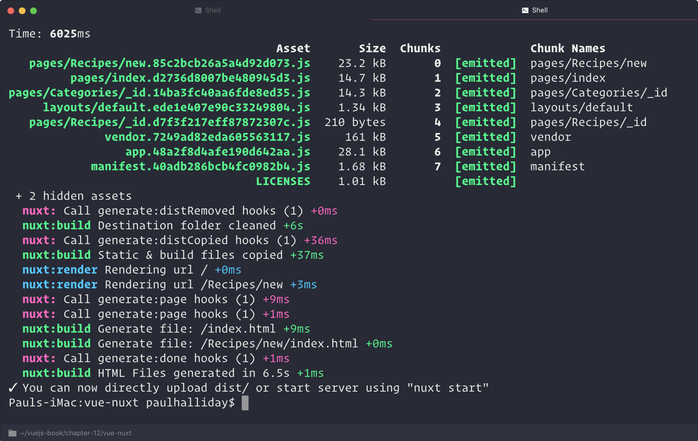

************
使用Nuxt服务器端渲染
************

.. contents:: 目录
   :depth: 4

``Nuxt`` 的灵感来自由 ``Zeit`` 构建的名为 ``Next.js`` 的流行 ``React`` 项目。 这两个项目都旨在创建应用程序，使用最新的思想，工具和技术提供更好的开发体验。 ``Nuxt`` 最近进入 ``1.x`` 版本以后，这意味着它应该被认为是稳定的用于生产网站。

在本章中我们将更详细地介绍 ``Nuxt`` ，如果您觉得它有用，它可能会成为您创建 ``Vue`` 应用程序的默认方式。

在本章中，我们将介绍以下主题：

- 探索 ``Nuxt`` 并了解使用它的好处；
- 使用 ``Nuxt`` 创建应用程序；
- 使用 ``Nuxt`` 中间件；
- 使用布局来定义内容；
- 了解 ``Nuxt`` 中的路由；
- 使用服务器端渲染构建 ``Vue`` 项目；
- 将 ``Vue`` 项目构建为静态网站；

Nuxt
====
``Nuxt`` 引入了 ``Universal Vue`` 应用程序的概念，因为它使我们能够轻松利用服务器端渲染（ ``SSR`` ）。同时， ``Nuxt`` 也赋予我们生成静态网站的能力，这意味着内容呈现为 ``HTML`` ， ``CSS`` 和 ``JS`` 文件，而无需从服务器进行后退和前进。

这不是全部， ``Nuxt`` 处理路由生成，不会减损 ``Vue`` 的任何核心功能。我们来创建一个 ``Nuxt`` 项目。

创建一个Nuxt项目
----------------
我们可以使用 ``Vue CLI`` 使用入门模板创建一个新的 ``Nuxt`` 项目。这为我们提供了一个准系统 ``Nuxt`` 项目，并使我们不必手动配置所有内容。我们将创建一个名为“Hearty Home Cooking”的“食谱列表”应用程序，该应用程序使用 ``REST API`` 获取类别和食谱名称。在终端中运行以下命令来创建一个新的 ``Nuxt`` 项目：

.. code-block:: shell

    # Create a new Nuxt project
    $ vue init nuxt-community/starter-template vue-nuxt

    # Change directory
    $ cd vue-nuxt

    # Install dependencies
    $ npm install

    # Run the project in the browser
    $ npm run dev

前面的步骤与我们在创建新 ``Vue`` 项目时所期望的非常相似，相反，我们可以简单地使用 ``Nuxt`` 仓库和入门模板来生成项目。

如果我们查看我们的 ``package.json`` ，你会看到我们没有生产依赖关系列表；相反，我们只有一个， ``nuxt`` ：

.. code-block:: json

    "dependencies": {
      "nuxt": "^1.0.0"
    }

这很重要，因为这意味着我们不必管理 ``Vue`` 的版本或担心其他兼容的软件包，因为我们只需要更新 ``nuxt`` 的版本。

目录结构
--------
如果我们在编辑器中打开我们的项目，我们会注意到我们的文件夹比我们以前的 ``Vue`` 应用程序多得多。我编制了一张表格，概述了它们的含义：

+------------+--------------------------------------------------------------------------------------------------+
| 文件夹     | 描述                                                                                             |
+============+==================================================================================================+
| Assets     | 用于存储项目资产，例如未编译的images，js和CSS。使用Webpack加载器作为模块加载。                   |
+------------+--------------------------------------------------------------------------------------------------+
| Components | 用于存储应用程序组件。这些不会转换为路由。                                                       |
+------------+--------------------------------------------------------------------------------------------------+
| Layouts    | 用于创建应用程序布局，例如默认，错误或其他自定义布局。                                           |
+------------+--------------------------------------------------------------------------------------------------+
| Middleware | 用于定义自定义应用程序中间件。这使我们能够在不同的事件上运行自定义功能，例如在页面之间进行导航。 |
+------------+--------------------------------------------------------------------------------------------------+
| Pages      | 用于创建用作应用程序路由的组件（.vue文件）。                                                     |
+------------+--------------------------------------------------------------------------------------------------+
| Plugins    | 用于注册应用程序范围的插件（即使用Vue.use）。                                                    |
+------------+--------------------------------------------------------------------------------------------------+
| Static     | 用于存储静态文件；此文件夹内的每个项目都映射到 ``/*`` 而不是 ``/static/*`` 。                    |
+------------+--------------------------------------------------------------------------------------------------+
| Store      | 与 ``Vuex`` 商店一起使用。 ``Vuex`` 的标准和模块实现都可以与 ``Nuxt`` 一起使用。                 |
+------------+--------------------------------------------------------------------------------------------------+

虽然这看起来可能更复杂，但请记住，这有助于我们分离我们的关注点，并且该结构允许 ``Nuxt`` 处理诸如自动生成的事情。

Nuxt配置
--------
让我们为项目添加一些自定义链接，以便我们可以利用 ``CSS`` 库，字体等等。让我们将 ``Bulma`` 添加到我们的项目中。

``Bulma`` 是一个 ``CSS`` 框架，允许我们使用 ``Flexbox`` 构建应用程序，并让我们利用许多预制组件。我们可以将它（和其他外部 ``CDN`` 文件）添加到我们的项目中，方法是导航到 ``nuxt.config.js`` 并向头对象内的 ``link`` 对象添加一个新对象，如下所示：

.. code-block:: json

    head: {
      // Omitted
      link: [
        { rel: 'icon', type: 'image/x-icon', href: '/favicon.ico' },
        {
          rel: 'stylesheet',
          href:
        'https://cdnjs.cloudflare.com/ajax/libs/bulma/0.6.1/css/bulma.min.css',
        },
      ],
    }

如果我们使用开发人员工具检查 ``HTML`` 文档中的头部，您会注意到 ``Bulma`` 已添加到我们的项目中。如果我们转向开发人员工具，我们可以看到它确实在项目中使用了 ``Bulma`` ：

导航
----
每次我们在 ``pages`` 目录中创建一个新的 ``.vue`` 文件时，我们都会为我们的应用程序提供一个新的路径。这意味着任何时候我们想要创建一个新的路由，我们只需创建一个包含路由名称的新文件夹，其余部分由 ``Nuxt`` 处理。鉴于我们的 ``pages`` 文件夹中有默认的 ``index.vue`` ，路由最初看起来像这样：

.. code-block:: json

    routes: [
      {
        name: 'index',
        path: '/',
        component: 'pages/index.vue'
      }
    ]

如果我们在里面添加一个带有 ``index.vue`` 的 ``categories`` 文件夹， ``Nuxt`` 会生成以下路径：

.. code-block:: json

    routes: [
      {
        name: 'index',
        path: '/',
        component: 'pages/index.vue'
      },
      {
        name: 'categories',
        path: '/categories',
        component: 'pages/categories/index.vue'
      }
    ]

如果我们想要利用动态路由参数（如 ``id`` ），我们可以在 ``categories`` 文件夹中创建一个名为 ``_id.vue`` 的组件。这会自动创建一个带有 ``id`` 参数的路由，以便我们根据用户的选择采取行动：

.. code-block:: json

    routes: [
      {
        name: 'index',
        path: '/',
        component: 'pages/index.vue'
      },
      {
        name: 'categories',
        path: '/categories',
        component: 'pages/categories/index.vue'
      },
      {
        name: 'categories-id',
        path: '/categories/id',
        component: 'pages/categories/_id.vue'
      }
    ]

在路由之间导航
^^^^^^^^^^^^^^
我们如何使用 ``Nuxt`` 在路由之间导航？那么，我们使用 ``nuxt-link`` 组件。

这与使用标准 ``Vue.js`` 应用程序在链接之间进行导航时使用的 ``router-link`` 组件类似（在编写时，它们是相同的），但是它包裹在 ``nuxt-link`` 组件中以利用功能，如预取。

布局
----
我们可以在我们的 ``Nuxt`` 项目中创建自定义布局。这使我们能够改变我们的页面排列方式，并且还允许我们添加共同点，例如静态导航栏和页脚。让我们使用 ``Bulma`` 创建一个新的导航栏，让我们可以在我们网站内的多个组件之间导航。

在 ``components`` 文件夹中，创建一个名为 ``NavigationBar.vue`` 的新文件并为其提供以下标记：

.. code-block:: html

    <template>
      <nav class="navbar is-primary" role="navigation" aria-label="main
      navigation">
        

          <nuxt-link class="navbar-item" to="/">Hearty Home Cooking</nuxt-
          link>
        

      </nav>
    </template>

    

然后，我们需要在 ``layouts/default.vue`` 中将其添加到我们的默认布局。我使用 ``nuxt`` 标签（也就是我们的主要路由器视图）和适当的 ``Bulma`` 类，以便将我们的内容居中：

.. code-block:: html

    <template>
      

        <navigation-bar></navigation-bar>
        <section class="section">
          <nuxt class="container"/>
        </section>
      

    </template>

    

如果我们然后前往浏览器，我们有一个看起来像这样的应用程序，反映我们的代码：

模拟REST API
------------
在我们创建组件来显示我们的数据之前，让我们用 ``JSON Server`` 模拟出来一个 ``REST API`` 。为此，我们需要一个名为 ``db.json`` 的文件在我们项目的根目录下，如下所示：

.. code-block:: json

    {
      "recipes": [
        { "id": 1, "title": "Blueberry and Chocolate Cake", "categoryId": 1, "image": "https://static.pexels.com/photos/291528/pexels-photo-291528.jpeg" },
        { "id": 2, "title": "Chocolate Cheesecake", "categoryId": 1, "image": "https://images.pexels.com/photos/47013/pexels-photo-47013.jpeg"},
        { "id": 3, "title": "New York and Berry Cheesecake", "categoryId": 1, "image": "https://images.pexels.com/photos/14107/pexels-photo-14107.jpeg"},
        { "id": 4, "title": "Salad with Light Dressing", "categoryId": 2, "image": "https://static.pexels.com/photos/257816/pexels-photo-257816.jpeg"},
        { "id": 5, "title": "Salmon Slices", "categoryId": 2, "image": "https://static.pexels.com/photos/629093/pexels-photo-629093.jpeg" },
        { "id": 6, "title": "Mushroom, Tomato and Sweetcorn Pizza", "categoryId": 3, "image": "https://static.pexels.com/photos/7658/food-pizza-box-chalkboard.jpg" },
        { "id": 7, "title": "Fresh Burger", "categoryId": 4, "image": "https://images.pexels.com/photos/460599/pexels-photo-460599.jpeg" }
      ],
      "categories": [
        { "id": 1, "name": "Dessert", "description": "Delcious desserts that range from creamy New York style cheesecakes to scrumptious blueberry and chocolate cakes."},
        { "id": 2, "name": "Healthy Eating", "description": "Healthy options don't have to be boring with our fresh salmon slices and sweet, crispy salad."},
        { "id": 3, "name": "Pizza", "description": "Pizza is always a popular choice, chef up the perfect meat feast with our recipes!"},
        { "id": 4, "name": "Burgers", "description": "Be the king of the party with our flagship BBQ Burger recipe, or make something lighter with our veggie burgers!"}
      ]
    }

接下来，通过在终端中运行以下命令，确保您的计算机上安装了 ``JSON Server`` ：

.. code-block:: shell

    $ npm install json-server -g

然后，我们可以通过在终端中输入以下命令，在 ``3001`` 端口（或任何 ``3000`` 以外的端口，因为这是 ``Nuxt`` 运行的端口）上运行服务器：

.. code-block:: shell

    $ json-server --watch db.json --port 3001

这将监视我们数据库的任何更改并相应地更新 ``API`` 。然后，我们可以向 ``localhost:3000/recipes/:id`` 和 ``localhost:3000/categories/:id`` 发送请求。在 ``Nuxt`` 中，我们可以使用 ``axios`` 的 ``asyncData`` 来完成此操作；接下来我们来看看。

asyncData
---------
在加载组件之前，我们可以使用 ``asyncData`` 方法解析组件的数据，本质上是在服务器端请求数据，然后在加载时将结果与组件实例内的数据对象合并。这使它成为添加异步操作的好地方，例如从 ``REST API`` 获取数据。

我们将使用 ``axios`` 库来创建 ``HTTP`` 请求，所以我们需要确保我们已经安装了它。从终端运行以下命令：

.. code-block:: shell

    $ npm install axios

然后，在 ``pages/index.vue`` 中，我们将得到一个类别列表，以便在我们的应用程序启动时向用户显示。让我们在 ``asyncData`` 中执行此操作：

.. code-block:: js

    import axios from 'axios'

    export default {
      asyncData ({ req, params }) {
        return axios.get(`http://localhost:3001/categories`)
          .then((res) => {
            return {
              categories: res.data
            }
          })
      },
    }

目录
----
当 ``asyncData`` 与我们的 ``Vue`` 实例的数据对象合并时，我们可以访问我们视图中的数据。让我们创建一个 ``category`` 组件，为我们的 ``API`` 中的每个类别显示一个类别：

.. code-block:: html

    <template>
      

        <header class="card-header">
          

            {{category.name}}
          

        </header>
        

          

            {{category.description}}
          

        

        <footer class="card-footer">
          <nuxt-link :to="categoryLink" class="card-footer-item">View</nuxt-link>
        </footer>
      

    </template>

    

    

在前面的代码中，我们使用 ``Bulma`` 来获取类别信息并将其放在一张卡片上。我们还使用了一个 ``computed`` 属性来生成 ``nuxt-link`` 组件的 ``prop`` 。这使我们能够根据类别 ``id`` 将用户导航到项目列表。然后，我们可以将其添加到我们的根页面 ``/index.vue`` 文件中：

.. code-block:: html

    <template>
      

        <app-category v-for="category in categories" :key="category.id"
        :category="category"></app-category>
      

    </template>

    

因此，这就是我们的主页现在的样子：

目录详情
--------
为了将用户导航到 ``category`` 详细信息页面，我们需要在 ``categories`` 文件夹内创建一个 ``_id.vue`` 文件。这将使我们能够访问此页面中的 ``ID`` 参数。这个过程与之前类似，除了现在我们还添加了一个 ``validate`` 函数来检查 ``id`` 参数是否存在：

.. code-block:: html

    

``validate`` 函数确保该路由存在该参数，如果该路由不存在，则会将用户导航到错误（404）页面。在本章的后面，我们将了解如何创建自己的错误页面。

现在我们在我们的 ``data`` 对象中有一个 ``recipes`` 数组，其中包含基于用户选择的 ``categoryId`` 的食谱。让我们在 ``components`` 文件夹内创建一个 ``Recipe.vue`` 组件来显示配方信息：

.. code-block:: html

    <template>
      

        

          

            <figure class="image is-4by3">
              
            </figure>
          

          

            

              {{recipe.title}}
            

          

        

      

    </template>

    

    

再一次，我们使用 ``Bulma`` 进行样式，并且能够将配方作为 ``prop`` 传递到该组件。让我们 ``_id.vue`` 组件中遍历所有的食谱：

.. code-block:: html

    <template>
      

        <app-recipe v-for="recipe in recipes" :key="recipe.id"
        :recipe="recipe"></app-recipe>
      

    </template>

    

当我们选择一个类别时，我们现在都会看到以下页面，其中显示了所选配方：

错误页面
--------
如果用户导航到不存在的路由或者我们的应用程序出现错误，该怎么办？那么，我们当然可以利用 ``Nuxt`` 的默认错误页面，或者我们可以创建自己的错误页面。

我们可以通过在 ``layouts`` 文件夹中创建 ``error.vue`` 来实现。让我们继续这样做，如果状态码是 ``404`` ，则显示错误消息；如果没有，我们将显示一个通用的错误消息：

.. code-block:: html

    <template>
      

        

          
            <h1 class="title">Page not found: 404</h1>
            <h2 class="subtitle">
              <nuxt-link to="/">Back to the home page</nuxt-link>
            </h2>
        

        

          <h1 class="title">An error occured.</h1>
          <h2 class="subtitle">
            <nuxt-link to="/">Back to the home page</nuxt-link>
          </h2>
        

      

    </template>

    

如果我们然后导航到 ``localhost:3000e`` ，您将导航到我们的错误页面。我们来看看错误页面：

插件
----
我们需要能够将食谱添加到我们的应用程序；因为添加新配方需要一个表单和一些输入。为了适当地验证表单，我们将使用 ``Vuelidate`` 。如果您还记得前几章，我们可以使用 ``Vue.use`` 添加 ``Vueidate`` 和其他插件。使用 ``Nuxt`` 的过程相似，但需要额外的步骤。通过在终端中运行以下命令来安装 ``Vuelidate`` ：

.. code-block:: shell

    $ npm install vuelidate

在我们的插件文件夹中，创建一个名为 ``Vuelidate.js`` 的新文件。在这个文件中，我们可以导入 ``Vue`` 和 ``Vuelidate`` 并添加插件：

.. code-block:: js

    import Vue from 'vue'
    import Vuelidate from 'vuelidate'

    Vue.use(Vuelidate)

然后，我们可以更新 ``nuxt.config.js`` 来添加指向我们的 ``Vuelidate`` 文件的插件数组：

.. code-block:: json

    plugins: ['~/plugins/Vuelidate']

在 ``build`` 对象内部，我们还将 ``vuelidate`` 添加到供应商捆绑包中，以便将其添加到我们的应用程序中：

.. code-block:: json

    build: {
     vendor: ['vuelidate'],
     // Omitted
    }

添加食谱
--------
让我们在 ``pages/Recipes/new.vue`` 下创建一个新的路由；这将会生成一条到 ``localhost:3000/recipes/new`` 的路由。我们的实现将很简单；例如，将配方步骤作为字符串可能不是生产的最佳想法，但它允许我们在开发中实现我们的目标。

然后，我们可以使用 ``Vuelidate`` 添加适当的数据对象和验证：

.. code-block:: js

    import { required, minLength } from 'vuelidate/lib/validators'

    export default {
      data () {
        return {
          title: '',
          image: '',
          steps: '',
          categoryId: 1
        }
      },
      validations: {
        title: {
          required,
          minLength: minLength(4)
        },
        image: {
          required
        },
        steps: {
          required,
          minLength: minLength(30)
        }
      },
    }

接下来，我们可以添加适当的模板，其中包括验证消息，上下文类以及如果表单有效/无效启用/禁用提交按钮，：

.. code-block:: html

    <template>
      <form @submit.prevent="submitRecipe">
        

          <label class="label">Recipe Title</label>
          <input class="input" :class="{ 'is-danger': $v.title.$error}" v-
          model.trim="title" @input="$v.title.$touch()" type="text">
          
Title is required

          
Title must be at least 4 characters.

        

        

          <label class="label">Recipe Image URL</label>
          <input class="input" :class="{ 'is-danger': $v.image.$error}" v-
          model.trim="image" @input="$v.image.$touch()" type="text">
          
Image URL is required

        

        

          <label class="label">Steps</label>
          <textarea class="textarea" rows="5" :class="{ 'is-danger':
          $v.steps.$error}" v-model="steps" @input="$v.steps.$touch()"
          type="text">
          </textarea>
          
Recipe steps are required.

          
Steps must be at least 30 characters.

        

        

          <label class="label">Category</label>
          

            

              <select v-model="categoryId" @input="$v.categoryId.$touch()">
                <option value="1">Dessert</option>
                <option value="2">Healthy Eating</option>
              </select>
            

          

        

        <button :disabled="$v.$invalid" class="button is-
        primary">Add</button>
      </form>
    </template>

要提交配方，我们需要对我们的 ``API`` 发出 ``POST`` 请求：

.. code-block:: js

import axios from 'axios'

    export default {
      // Omitted
      methods: {
        submitRecipe () {
          const recipe = { title: this.title, image: this.image, steps:
          this.steps, categoryId: Number(this.categoryId) }
          axios.post('http://localhost:3001/recipes', recipe)
        }
      },
    }

我们不需要手动导航到 http://localhost:3000/recipes/new ，而是添加一个项目到我们的导航栏中：

.. code-block:: html

    <template>
      <nav class="navbar is-primary" role="navigation" aria-label="main navigation">
        

          <nuxt-link class="navbar-item" to="/">Hearty Home Cooking</nuxt-
          link>
        

        

          <nuxt-link class="navbar-item" to="/recipes/new">+ Add New
          Recipe</nuxt-
         link>
        

      </nav>
    </template>

以下是我们的页面现在的样子：

虽然我们没有在应用程序中使用配方步骤，但我已将其作为您可能希望包含在自己项目中的功能。

过渡
----
在页面之间导航时， ``Nuxt`` 使添加过渡变得非常简单。让我们通过添加自定义 ``CSS`` 来为每个导航操作添加一个过渡。将一个名为 ``transition.css`` 的文件添加到 ``assets`` 文件夹中，我们将挂载各种不同的页面状态：

.. code-block:: css

    .page-enter-active, .page-leave-active {
      transition: all 0.25s;
    }

    .page-enter, .page-leave-active {
      opacity: 0;
      transform: scale(2);
    }

添加文件后，我们需要告诉 ``Nuxt`` 我们想将它用作 ``.css`` 文件。将以下代码添加到 ``nuxt.config.js`` 中：

.. code-block:: json

     css: ['~/assets/transition.css']

现在，我们可以在任何页面之间导航，并且每次都会进行页面过渡。

为生产构建
----------
``Nuxt`` 为我们提供了多种构建生产项目的方法，例如服务器渲染（通用），静态或单页面应用程序（SPA）模式。所有这些具有不同的优点和缺点，这取决于使用情况。

默认情况下，我们的项目处于服务器渲染（通用）模式，可以通过在终端中运行以下命令来生成生产：

.. code-block:: shell

    $ npm run build

然后我们在我们的项目中的 ``.nuxt`` 文件夹中获得 ``dist`` 文件夹；这包含我们应用程序构建的最终结果，可以将其部署到托管服务器中：

静态
^^^^
为了在静态模式下构建我们的项目，我们可以在终端中运行以下命令：

.. code-block:: shell

    $ npm run generate

这将构建一个静态网站，然后可以将其部署到静态托管服务器中（例如 ``Firebase`` ）。终端应该如何显示：

SPA模式
^^^^^^^
要在 ``SPA`` 模式下构建项目，我们需要将以下关键值添加到 ``nuxt.config.js`` 中：

.. code-block:: shell

    mode: 'spa'

然后，我们可以再次构建我们的项目，但这次将使用 ``SPA`` 模式构建：

.. code-block:: shell

    $ npm run build

我们的命令终端现在应该如下所示：

总结
====
在本章中，我们讨论了如何使用 ``Nuxt`` 创建服务器渲染的 ``Vue`` 应用程序。我们还讨论了创建新路由是多么容易，以及如何在我们的项目中添加自定义 ``CSS`` 库。此外，我们介绍了如何在页面之间添加过渡，以便在路由之间切换时使它更有趣。我们还介绍了如何构建不同版本的项目，具体取决于我们是否需要通用，静态或SPA应用程序。

在最后一章中，我们将讨论 ``Vue.js`` 中的常见反模式以及如何避免它们。这对编写能够经受住时间考验的一致软件是至关重要的。

